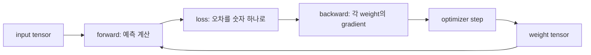

# 01. 텐서·자동미분·Transformer: 숫자 모양에서 학습까지

[이전: AI 워크로드와 모델](00-ai-workloads-and-models.md) · [다음: 가속기 소프트웨어와 실행](02-accelerator-software-and-execution.md) · [Linux 메모리](../../../linux/learning/linux-kernel/04-virtual-memory-and-reclaim.md)

AI 인프라는 결국 많은 숫자를 정해진 모양으로 읽고 곱하고 더하는 일을 빠르게 반복한다.
그 숫자 묶음을 tensor라고 부른다.
이 장은 tensor의 모양, matrix multiplication, 자동미분, attention, Transformer를 작은 예제로 연결한다.

**Tensor(텐서)**는 축을 가진 숫자 배열이고, **shape(형상)**는 각 축의 길이다. **Embedding(임베딩)**은 token 같은 이산 항목을 여러 실수로 표현한 벡터다. **Forward(순전파)**는 입력에서 예측값을 계산하는 방향, **backward(역전파)**는 손실에서 거꾸로 각 파라미터의 **gradient(기울기, 값을 조금 바꿀 때 손실이 변하는 정도)**를 계산하는 방향이다. 이 장에서 **activation(활성값)**은 순전파 중 layer 사이에 생기는 중간 tensor를 뜻한다.

목표는 딥러닝 수학 전체를 끝내는 것이 아니다.
GPU 메모리 표와 실행 로그를 읽을 때 “batch, sequence, embedding, head가 무엇을 뜻하는지” 이해하는 것이다.
모양을 읽을 수 있어야 어떤 연산이 커지는지, 어떤 buffer가 생기는지, 왜 OOM이 나는지 추적할 수 있다.

## 숫자 하나에서 학습까지의 지도

Tensor의 **shape**는 축마다 원소가 몇 개인지를 적은 표지다. `(batch=2, sequence=3, embedding=4)`라면 문장 2개, 문장마다 token 자리 3개, 각 token을 나타내는 숫자 4개라는 뜻이다. 축 이름은 데이터에 자동으로 저장되는 보편 의미가 아니므로 코드와 문서가 의미를 약속해야 한다.



원소 수는 `2 × 3 × 4 = 24`다. FP16으로 저장하면 payload는 `24 × 2 = 48 bytes`다. 하지만 실제 할당은 정렬, allocator 단위, 임시 workspace 때문에 48 bytes보다 클 수 있다. 이 차이가 “수식의 tensor 크기”와 “장치가 예약한 메모리”의 경계다.

## Tensor는 축이 있는 숫자 배열이다

scalar는 숫자 하나다.
예를 들어 `3.0`은 shape가 `()`인 값으로 볼 수 있다.
vector는 한 줄 숫자 묶음이다.
`[1, 2, 3]`은 shape `(3,)`이다.
matrix는 행과 열이 있는 2차원 배열이다.
이미지는 `(height, width, channel)` 또는 `(channel, height, width)` 같은 shape로 표현할 수 있다.

Tensor는 이런 배열을 일반화한 말이다.
rank 또는 ndim은 축의 수다.
shape는 각 축의 길이다.
dtype은 각 숫자의 표현 방식이다.
device는 숫자가 CPU 메모리에 있는지 GPU 메모리에 있는지 같은 위치 정보다.

PyTorch 튜토리얼은 입력과 출력, 모델 파라미터를 tensor로 표현한다고 설명한다.
PyTorch의 broadcasting 문서는 shape가 다른 tensor 연산이 어떤 규칙으로 확장되는지 설명한다.
이 규칙은 편리하지만, 의도하지 않은 큰 중간 tensor를 만들 수 있으므로 shape를 항상 적는다.

## Matrix multiplication의 모양

행렬 `A`의 shape가 `(m, k)`이고 `B`의 shape가 `(k, n)`이면 결과 `C = A @ B`의 shape는 `(m, n)`이다.
가운데 차원 `k`는 곱해서 더하는 축이다.
각 결과 원소는 `k`번 곱하고 `k-1`번 더해 만든다.

작은 예를 보자.

```text
A = [[1, 2],
     [3, 4]]          shape (2, 2)

B = [[10],
     [20]]            shape (2, 1)

C = A @ B             shape (2, 1)
C[0,0] = 1×10 + 2×20 = 50
C[1,0] = 3×10 + 4×20 = 110
```

이 예에서 multiply-add 수는 결과 원소 2개 × 각 2개 곱셈 = 4 multiply와 2 add다.
실제 성능 자료에서는 FLOP 정의가 fused multiply-add를 2 FLOPs로 세는 경우가 많다.
따라서 수치를 비교할 때 FLOP 계산 규칙을 확인해야 한다.

## Linear layer는 행렬곱과 bias다

입력 `x`가 shape `(batch, input_features)`이고 weight `W`가 `(input_features, output_features)`이면 출력은 `(batch, output_features)`다.
bias `b`는 보통 `(output_features,)`이고 batch 축으로 broadcasting된다.

```text
y = x @ W + b
```

예를 들어 batch 3개, 입력 특징 4개, 출력 특징 2개면 다음과 같다.

```text
x: (3, 4)
W: (4, 2)
b: (2,)
y: (3, 2)
```

이 모양을 못 맞추면 모델이 실행되지 않는다.
모양은 맞지만 의도하지 않은 축으로 broadcasting되면 실행은 되면서 틀린 결과를 만들 수 있다.
그래서 교재의 계산 예제에서는 항상 shape를 함께 쓴다.

## 손으로 보는 아주 작은 학습

모델을 `y_hat = w × x`라고 하자.
목표는 입력 `x = 2`일 때 정답 `y = 10`을 맞히는 것이다.
초기 weight `w = 3`이다.
손실은 squared error의 절반으로 둔다.

```text
y_hat = 3 × 2 = 6
loss = 0.5 × (y_hat - y)^2
     = 0.5 × (6 - 10)^2
     = 8
```

`w`를 조금 바꾸면 loss가 얼마나 변하는지 gradient가 말해준다.
연쇄 법칙을 쓰면 다음과 같다.

```text
d loss / d y_hat = y_hat - y = -4
d y_hat / d w = x = 2
d loss / d w = -4 × 2 = -8
```

학습률을 `0.1`로 두면 gradient descent update는 다음이다.

```text
new_w = w - learning_rate × gradient
      = 3 - 0.1 × (-8)
      = 3.8
```

새 weight로 다시 계산하면 `y_hat = 3.8 × 2 = 7.6`이고 loss는 `0.5 × (7.6 - 10)^2 = 2.88`이다.
이 한 step에서는 loss가 줄었다.
실제 모델은 수십억 개 파라미터와 많은 데이터에 대해 같은 원리를 큰 그래프로 반복한다.

## 자동미분은 계산 그래프에서 gradient를 만든다

자동미분은 symbolic algebra만도 아니고, 단순 numerical difference만도 아니다.
PyTorch autograd 문서는 forward pass 때 연산 그래프를 만들고, backward 때 그 그래프를 따라 gradient를 계산한다고 설명한다.
각 연산은 backward 계산에 필요한 값을 저장할 수 있다.

이 저장값 때문에 훈련 메모리가 커진다.
추론에서는 gradient가 필요 없으면 중간 activation을 덜 저장할 수 있다.
훈련에서는 backward를 위해 activation, mask, shape 정보, 일부 임시 buffer가 필요할 수 있다.
그래서 같은 모델이라도 `train`과 `inference`의 메모리 사용은 다르다.

자동미분이 모든 문제를 해결하지는 않는다.
gradient가 매우 작거나 커지는 문제, 불연속 연산, dtype overflow, custom kernel의 잘못된 backward는 여전히 사람이 확인해야 한다.
autograd가 계산해준다는 것은 “정의된 그래프에 대해 미분 규칙을 적용했다”는 뜻이지 “학습이 성공한다”는 뜻이 아니다.

## Batch, sequence, embedding

언어 모델에서 입력은 보통 token id 배열로 시작한다.
`batch`는 한 번에 처리하는 요청 또는 문장의 개수다.
`sequence`는 각 예제 안의 token 길이다.
`embedding`은 token id를 dense vector로 바꾼 표현의 차원이다.

예를 들어 batch 2, sequence 4, embedding 8이면 hidden state shape는 다음과 같다.

```text
hidden: (B, S, E) = (2, 4, 8)
원소 수 = 2 × 4 × 8 = 64
FP16 저장량 = 64 × 2 bytes = 128 bytes
```

실제 모델에서는 B, S, E가 훨씬 크다.
예를 들어 `(8, 2048, 4096)` FP16 hidden state는 다음과 같다.

```text
원소 수 = 8 × 2048 × 4096 = 67,108,864
저장량 = 67,108,864 × 2 bytes = 134,217,728 bytes
       = 128 MiB
```

이것은 hidden state 하나의 단순 저장량이다.
훈련에서는 여러 layer의 activation과 attention 관련 buffer가 추가될 수 있다.

## Attention의 직관과 shape

Attention은 각 token이 다른 token을 얼마나 참고할지 계산하는 방법이다.
입력 hidden에서 query, key, value라는 세 tensor를 만든다.
이름은 검색 비유에서 왔다.
query는 “무엇을 찾는가”, key는 “각 항목의 주소표”, value는 “가져올 내용”에 가깝다.

단일 head 예를 들면 shape는 다음처럼 볼 수 있다.

```text
Q: (B, S, D_head)
K: (B, S, D_head)
V: (B, S, D_head)
raw_score = Q @ K^T                              -> (B, S, S)
score = raw_score / sqrt(D_head) + attention_mask -> (B, S, S)
prob = softmax(score)                            -> (B, S, S)
out = prob @ V                                   -> (B, S, D_head)
```

`D_head`는 head 하나가 사용하는 Q/K vector 길이다. `sqrt(D_head)`로 나누는 scaling은 내적 크기가 차원과 함께 지나치게 커져 softmax가 극단적으로 쏠리는 것을 완화한다. `attention_mask`는 볼 수 있는 위치에는 0, 볼 수 없는 미래·padding 위치에는 softmax 결과가 거의 0이 되도록 매우 작은 값을 더하는 식으로 구현할 수 있다.

`S × S` score 때문에 attention은 sequence 길이에 민감하다.
S가 2배가 되면 score 원소 수는 4배가 된다.
구현은 이 중간값을 그대로 저장하지 않도록 최적화할 수 있지만, 기본 구조를 이해할 때는 `S^2` 항을 기억한다.

### Q, K, V와 softmax를 숫자로 따라가기

Query·Key·Value는 서로 다른 데이터 세 종류가 아니라, 같은 hidden state에 서로 다른 weight matrix를 곱해 만든 세 관점이다. Query는 현재 token이 찾는 특징, Key는 각 token이 가진 특징의 표지, Value는 선택되었을 때 섞어 올 실제 내용이다. 학습 과정은 어떤 projection이 작업에 유용한지 weight를 바꾼다.

현재 token의 Query와 두 과거 token의 Key를 내적하고 `sqrt(D_head)` scaling과 mask까지 반영한 최종 score가 `[2.0, 1.0]`이라고 하자. 값이 클수록 더 관련 있다고 해석하지만, 아직 합이 1인 비율은 아니다. **Softmax(소프트맥스)**는 각 score를 지수 함수로 바꾼 뒤 전체 합으로 나누어 0과 1 사이의 가중치로 만든다.

```text
exp(2.0) ≈ 7.39
exp(1.0) ≈ 2.72
합       ≈ 10.11

attention weight ≈ [7.39/10.11, 2.72/10.11]
                 ≈ [0.73, 0.27]
```

Value가 `[10, 0]`, `[0, 20]`이라는 두 벡터라면 output은 가중합이다.

```text
0.73 × [10, 0] + 0.27 × [0, 20]
= [7.3, 5.4]
```

이 숫자는 첫 번째 token을 그대로 복사했다는 뜻이 아니다. 두 Value 표현을 학습된 비율로 섞었다는 뜻이다. 위 `[2.0, 1.0]`은 scaling과 mask가 끝난 값이므로 바로 softmax에 넣었다.

## Multi-head attention

Multi-head attention은 embedding 차원을 여러 head로 나누어 여러 attention을 병렬로 계산한다.
예를 들어 embedding `E = 4096`, head 수 `H = 32`이면 head dimension은 다음이다.

```text
D_head = E ÷ H = 4096 ÷ 32 = 128
```

Q shape를 head까지 펼치면 `(B, H, S, D_head)`로 볼 수 있다.
K와 V도 같은 방식으로 볼 수 있다.
attention score는 `(B, H, S, S)`가 된다.
이 shape가 activation memory와 kernel 선택에 영향을 준다.

## Transformer는 중요한 구조지만 AI 전체는 아니다

Transformer 논문은 attention 중심 구조로 sequence transduction 문제를 다뤘다.
그 뒤 언어 모델, 비전, 음성 등 여러 분야로 확장되었다.
하지만 AI 전체가 Transformer인 것은 아니다.
CNN, RNN, diffusion model, tree model, retrieval system, symbolic system도 쓰인다.

인프라를 공부할 때 Transformer를 먼저 배우는 이유는 현대 LLM serving과 훈련의 대표 워크로드이기 때문이다.
그러나 “Transformer 최적화 = AI 인프라 전체”라고 보면 추천, 검색, 데이터 전처리, 전통 ML serving의 병목을 놓친다.
이 교재는 Transformer를 중심 예제로 쓰되 다른 workload가 다른 모양을 가질 수 있음을 계속 표시한다.

### 한 Transformer layer에서 빠뜨리기 쉬운 구성요소

**Position information(위치 정보)**은 token 순서를 모델에 알려준다. Attention만 놓고 보면 입력 순서를 자동으로 구별하지 못하므로, 위치 embedding을 더하거나 회전 위치 표현처럼 Q와 K에 위치 관계를 반영하는 방법을 쓴다. 구체적인 방식은 모델 구조마다 다르다.

**MLP(Multi-Layer Perceptron, 다층 퍼셉트론)**는 각 token 위치별 hidden vector를 더 큰 중간 차원으로 펼쳤다가 줄이는 비선형 변환이다. Attention이 token 사이 정보를 섞는다면 MLP는 한 token 표현 안의 특징을 변환하는 쪽에 가깝다. 큰 LLM에서는 MLP weight와 계산량도 매우 크다.

**Residual connection(잔차 연결)**은 block의 입력을 변환 결과에 다시 더한다. `output = input + attention(input)` 같은 모양이다. 정보와 gradient가 여러 layer를 지나갈 경로를 제공하지만, 두 tensor의 shape가 맞아야 한다.

**Normalization(정규화)**은 hidden 값의 크기 분포를 조정해 학습을 안정시키는 연산이다. LayerNorm이나 RMSNorm 같은 방식이 있으며, 적용 위치가 attention 앞인지 뒤인지도 모델 구조의 일부다. 여기서 normalization은 데이터 파일을 0~1 범위로 바꾸는 전처리와 같은 뜻이 아니다.

한 layer를 단순화하면 다음 순서다.

```text
token ID
  → token embedding + 위치 정보
  → normalization
  → Q/K/V projection과 attention
  → residual add
  → normalization
  → MLP
  → residual add
  → 다음 layer hidden state
```

궁금할 점: residual이 입력을 보존한다면 attention 결과가 필요 없는가? 아니다. residual은 원래 표현과 새 변환을 더해 다음 layer에 둘 다 전달한다. 학습은 두 경로를 어떤 비율과 방향으로 활용할지 weight를 조정한다. Normalization도 정보를 “정답으로 고치는” 연산이 아니라 수치 범위를 다루는 연산이다.

## Concrete trace: token 네 개가 한 layer를 지나는 길

batch 1, sequence 4, embedding 8, head 2를 가정하자.
head dimension은 4다.

1. Token id shape는 `(1, 4)`다.
2. Embedding lookup 뒤 hidden은 `(1, 4, 8)`이다.
3. Linear projection으로 Q, K, V를 각각 `(1, 4, 8)`로 만든다.
4. Head를 나누면 각각 `(1, 2, 4, 4)`다.
5. Q와 K를 곱해 score `(1, 2, 4, 4)`를 만든다.
6. Causal mask를 적용해 미래 token을 보지 못하게 할 수 있다.
7. Softmax 뒤 V와 곱해 head별 output `(1, 2, 4, 4)`를 만든다.
8. Head를 합쳐 `(1, 4, 8)`로 되돌린다.
9. MLP와 residual, normalization을 거쳐 다음 layer 입력이 된다.

이 trace는 교육용 구조다.
실제 구현은 projection을 합치거나, attention kernel을 fusion하거나, score를 온전히 materialize하지 않을 수 있다.
하지만 논리적인 shape 관계는 로그를 읽는 기본 언어가 된다.

## 흔한 오개념

- Tensor는 GPU 전용이 아니다. CPU tensor도 있고 저장 위치가 다를 뿐이다.
- Shape가 맞으면 의미도 맞는 것은 아니다. 축 순서가 바뀌어도 곱셈이 실행될 수 있다.
- Autograd는 “미분을 알아서 해주는 엔진”이지 “모델을 좋게 만드는 보증”이 아니다.
- Transformer는 LLM에서 중요하지만 AI 전체와 동의어가 아니다.
- Attention의 `S^2` 설명은 구조 모델이다. 최적화 kernel은 memory traffic과 materialization을 바꿀 수 있다.

## 연습 문제와 해설

문제 1.
`x` shape가 `(16, 128)`이고 `W` shape가 `(128, 512)`다.
`x @ W`의 shape와 원소 수는?

해설.
결과 shape는 `(16, 512)`다.
원소 수는 `16 × 512 = 8192`다.
FP16이면 저장량은 `8192 × 2 = 16,384 bytes = 16 KiB`다.

문제 2.
Embedding 3072, head 24인 attention의 head dimension은?

해설.
`3072 ÷ 24 = 128`이다.
나누어떨어지지 않는 설정도 가능하지만 일반적인 multi-head attention 구현에서는 head dimension을 명확히 정해야 한다.

문제 3.
Batch 4, sequence 1024, head 16인 attention score tensor의 원소 수는?

해설.
Shape는 `(4, 16, 1024, 1024)`로 볼 수 있다.
원소 수는 `4 × 16 × 1024 × 1024 = 67,108,864`다.
FP16으로 전부 저장하면 128 MiB다.
구현이 score를 그대로 저장하지 않을 수 있으므로 이것은 구조 이해용 상한 모델이다.

문제 4.
`y_hat = w × x`, `x = 3`, `y = 12`, `w = 2`, loss `0.5 × (y_hat-y)^2`, learning rate `0.05`일 때 새 `w`는?

해설.
`y_hat = 6`, `y_hat-y = -6`이다.
gradient는 `-6 × 3 = -18`이다.
`new_w = 2 - 0.05 × (-18) = 2.9`다.

## 공식 자료와 원전

- PyTorch tensor tutorial: https://docs.pytorch.org/tutorials/beginner/basics/tensor_tutorial.html
- PyTorch broadcasting semantics: https://docs.pytorch.org/docs/stable/notes/broadcasting.html
- PyTorch autograd mechanics: https://docs.pytorch.org/docs/stable/notes/autograd.html
- PyTorch automatic differentiation tutorial: https://docs.pytorch.org/tutorials/beginner/basics/autograd_tutorial.html
- Vaswani et al., Attention Is All You Need: https://arxiv.org/abs/1706.03762

문서의 API 세부사항은 PyTorch 버전에 따라 바뀔 수 있다.
이 장은 실행 가능한 PyTorch 코드를 요구하지 않고, shape와 계산 흐름을 이해하기 위한 교재다.
