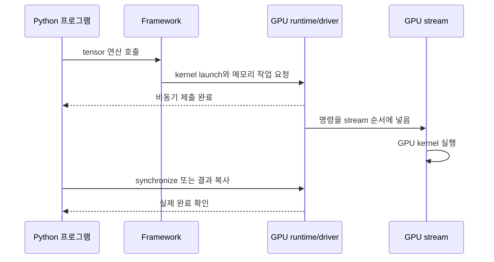

# 02. 가속기 소프트웨어와 실행: Python 호출이 GPU 일로 바뀌는 길

[이전: 텐서·자동미분·Transformer](01-tensors-autograd-and-transformers.md) · [다음: 메모리·정밀도·용량](03-memory-precision-and-capacity.md) · [Linux syscall·interrupt](../../../linux/learning/linux-kernel/02-boot-syscalls-and-interrupts.md) · [PCIe](../../../hardware/learning/server-hardware/03-pcie-slots-switches.md)

GPU를 쓴다는 말은 Python 코드가 GPU 안에서 직접 한 줄씩 실행된다는 뜻이 아니다.
대부분의 AI 프로그램은 framework, operator library, compiler, runtime, driver, GPU kernel을 거쳐 장치에 일을 보낸다.
이 장은 그 길을 용어별로 끊어 본다.

**Framework(프레임워크)**는 tensor와 학습 API를 제공하는 프로그램 틀이고, **operator(연산자)**는 행렬곱처럼 사용자가 요청한 논리 연산이다. **Compiler(컴파일러)**는 연산 표현을 실행 코드로 바꾸고, **runtime(실행 환경)**은 메모리 복사와 kernel 제출을 조정하며, **driver(장치 구동기)**는 운영체제와 GPU 사이에서 실제 장치 명령을 관리한다. **Stream(스트림)**은 GPU 작업의 순서를 보존하는 명령 줄이고, **event(이벤트)**는 stream 안의 특정 지점이 끝났는지 기록하거나 시간을 재는 표식이다.

Linux kernel과 GPU kernel이라는 단어가 함께 나오면 처음에는 헷갈린다.
Linux kernel은 운영체제의 핵심 프로그램이다.
GPU kernel은 GPU에서 많은 thread가 실행하는 작은 device program이다.
같은 단어지만 계층이 다르다.

## 코드 한 줄이 장치에서 끝날 때까지



**Operator**는 행렬곱처럼 사용자가 요청한 논리 연산이고, **GPU kernel**은 그 연산을 장치에서 수행하도록 컴파일된 작은 프로그램이다. **Runtime**은 메모리 할당·복사·kernel launch 같은 사용자 공간 API를 제공하고, **driver**는 장치와 운영체제 사이의 명령·주소·상태를 관리한다. 한 operator가 여러 kernel을 부를 수도 있고 여러 operator가 fusion되어 한 kernel이 될 수도 있다.

예를 들어 CPU 시계로 launch 직전과 직후만 재서 `0.05 ms`가 나와도 GPU 계산이 끝났다는 뜻은 아니다. 제출은 비동기일 수 있다. 완료 시점까지 재려면 같은 stream의 event나 명시적 동기화가 필요하며, 동기화 자체가 실행 겹침을 바꿀 수 있다는 조건도 기록한다.

## 실행 계층 지도

Application은 사용자가 작성한 학습·추론 코드다.
예를 들어 Python에서 model forward를 호출한다.
Framework는 tensor, autograd, module, optimizer 같은 추상화를 제공한다.
PyTorch, TensorFlow, JAX가 예다.

Operator는 matmul, convolution, layer normalization, softmax 같은 연산 단위다.
Library는 operator를 빠르게 실행하는 구현 모음이다.
**cuBLAS**는 CUDA GPU에서 행렬곱과 벡터 연산 같은 BLAS 계열 선형대수를 제공한다. **cuDNN**은 convolution, normalization, attention 관련 연산 등 딥러닝 primitive의 GPU 구현을 제공한다. **NCCL(NVIDIA Collective Communications Library)**은 여러 GPU 사이 all-reduce·all-gather 같은 집합 통신을 수행한다. 세 라이브러리는 모두 GPU와 관련되지만 계산 영역과 역할이 다르다.
Compiler는 그래프나 kernel 코드를 더 빠른 실행 형태로 바꾼다.
Runtime은 memory allocation, stream, event, kernel launch 같은 실행 관리 API를 제공한다.
Driver는 OS와 장치 사이에서 GPU 명령 제출, 메모리 관리, 장치 상태 관리를 담당한다.
GPU kernel은 장치에서 실제로 실행되는 parallel function이다.

이 계층은 제품마다 정확히 같지 않다.
그러나 로그를 읽을 때 “framework 오류인지, library 선택 문제인지, driver/runtime 호환 문제인지, kernel 실행 문제인지”를 나누는 데 도움이 된다.

## Python 한 줄을 따라가기

예를 들어 `y = x @ W`를 실행한다고 하자.
실행 경로는 대략 다음처럼 볼 수 있다.

1. Python 객체 `x`, `W`가 tensor metadata와 storage를 가리킨다.
2. Framework dispatcher가 dtype, device, shape를 보고 어떤 backend operator를 쓸지 고른다.
3. CUDA tensor라면 GPU용 matmul 구현을 호출한다.
4. Library 또는 compiler-generated code가 하나 이상의 GPU kernel launch를 만든다.
5. Runtime이 launch 명령을 stream에 enqueue한다.
6. Driver가 GPU command queue에 일을 전달한다.
7. GPU scheduler가 thread block을 SM에 배치하고 kernel이 device memory를 읽고 쓴다.
8. CPU 코드는 launch가 끝나기 전에 다음 줄로 진행할 수 있다.

### GPU 안에서는 thread가 어떻게 묶여 실행되는가

GPU kernel을 launch할 때 프로그램은 많은 **thread(스레드, 같은 함수를 서로 다른 데이터에 실행하는 작업 단위)**를 만든다. Thread들은 **block(블록)**으로 묶이고, 여러 block이 전체 **grid(그리드)**를 이룬다. Block은 GPU의 **SM(Streaming Multiprocessor, 스레드 묶음을 실행하는 계산 장치)**에 배치된다.

CUDA 계열 설명에서 **warp(워프)**는 SM이 같은 명령 흐름으로 함께 실행하는 작은 thread 묶음이다. Warp 안 thread들이 조건문에서 서로 다른 길을 택하면 경로를 나누어 실행할 수 있어 효율이 낮아질 수 있다. 정확한 warp 크기와 scheduling 세부는 플랫폼 계약을 확인해야 하며, 다른 가속기에도 CUDA 용어를 그대로 적용하지 않는다.

```text
operator: matrix multiplication
  └─ kernel launch 1개 이상
       └─ grid
            ├─ block 0 ─ threads ─ warp 묶음
            ├─ block 1 ─ threads ─ warp 묶음
            └─ ...

GPU scheduler: 준비된 block을 여유 있는 SM에 배치
```

Block 수가 SM 수보다 적으면 일부 SM이 놀 수 있다. 반대로 block이 많아도 register와 shared memory 사용량이 너무 크면 SM에 동시에 머물 수 있는 block 수가 줄 수 있다. 이를 **occupancy(점유도)** 관점에서 보지만, occupancy가 높다고 kernel이 반드시 빠른 것은 아니다. Memory bandwidth, instruction dependency, cache hit, 연산 종류도 시간을 결정한다.

마지막 문장이 중요하다.
CUDA programming guide는 많은 CUDA 작업이 host 관점에서 비동기적으로 동작할 수 있다고 설명한다.
즉 Python 줄의 시간이 곧 GPU 계산 완료 시간이 아닐 수 있다.
정확한 측정에는 synchronization 또는 event가 필요하다.

### 비동기 실행의 시간선을 읽는 법

CPU와 GPU는 각자 진행한다. 다음 예에서 `copy H2D`는 host-to-device, 즉 CPU RAM에서 GPU memory로 복사한다는 뜻이다.

```text
시간 ──────────────────────────────────────────>
CPU: [copy 제출][kernel A 제출][kernel B 제출][다른 CPU 작업][동기화 대기]
GPU:       [copy H2D 실행][kernel A 실행][kernel B 실행]
stream 0:  copy H2D  →  kernel A  →  kernel B
```

같은 stream에서는 앞 작업이 끝나야 뒤 작업이 그 의존성을 만족한다. CPU가 세 명령을 빨리 제출해도 GPU 완료 시각은 뒤에 있다. `synchronize()`는 CPU가 GPU 완료를 기다리는 경계이므로, 너무 자주 넣으면 원래 겹칠 수 있던 CPU 준비와 GPU 계산을 직렬화할 수 있다.

서로 다른 stream 두 개를 쓴다고 가정하자.

```text
stream copy:  [batch 1 H2D]        [batch 2 H2D]
stream work:                  [batch 1 compute]       [batch 2 compute]
```

복사 엔진과 계산 엔진, pinned host memory, 의존성 조건이 허용하면 batch 2 복사와 batch 1 계산을 겹칠 수 있다. 하지만 compute가 batch 2 데이터를 읽기 전에 복사가 끝났다는 보장이 필요하다. Copy stream에 event를 기록하고 work stream이 그 event를 기다리게 하는 이유다.

```text
copy_stream: copy(batch2) → record(data_ready)
work_stream: wait(data_ready) → kernel(batch2)
```

Event는 CPU 벽시계와 같은 것이 아니다. GPU 작업 순서 안의 완료 지점을 표현한다. Kernel 시간만 잴 때는 같은 실행 경로에 start/end event를 두고 end 완료를 기다린다. 사용자가 느낀 전체 지연을 잴 때는 tokenization, queue, 복사와 동기화까지 포함한 CPU 벽시계를 별도로 잰다.

## GPU kernel과 Linux kernel

Linux kernel은 process, virtual memory, file, network, driver를 관리한다.
사용자 프로그램은 syscall로 Linux kernel에 요청한다.
GPU driver도 Linux kernel 모듈과 사용자 공간 library의 조합으로 동작할 수 있다.

GPU kernel은 GPU에서 실행되는 계산 함수다.
CUDA C++ 문서에서는 kernel을 host에서 launch하고, 많은 CUDA thread가 실행하는 함수로 설명한다.
GPU kernel은 syscall handler가 아니다.
GPU kernel 안에서 일반적인 Linux syscall을 호출하는 식으로 생각하면 안 된다.

두 kernel은 만나는 지점이 있다.
프로그램이 GPU memory를 할당하거나 kernel launch를 제출할 때 driver 경로가 OS와 장치를 연결한다.
**DMA(Direct Memory Access, 직접 메모리 접근)**는 CPU가 byte마다 복사하지 않고 장치가 메모리와 데이터를 옮기는 방식이다. **Page pinning(페이지 고정)**은 전송 중 CPU 메모리 페이지가 다른 물리 위치로 옮겨지지 않게 고정한다. **Interrupt(인터럽트)**는 장치 완료나 오류를 CPU에 알리는 신호이고, **memory mapping(메모리 매핑)**은 장치·파일 영역을 process 주소 공간에서 접근할 수 있게 연결하는 방식이다. 더 자세한 OS·버스 동작은 [Linux I/O 장](../../../linux/learning/linux-kernel/05-vfs-devices-and-io.md)과 [하드웨어 PCIe 장](../../../hardware/learning/server-hardware/03-pcie-slots-switches.md)에서 이어진다.

## Stream은 GPU 작업의 순서표다

CUDA stream은 GPU 작업들이 들어가는 순서 있는 queue로 이해할 수 있다.
같은 stream에 들어간 작업은 enqueue 순서를 따른다.
서로 다른 stream의 작업은 장치와 의존성 조건이 허용하면 겹칠 수 있다.
NVIDIA 문서는 concurrency 가능 여부가 하드웨어와 작업 특성에 달린다고 설명한다.

이 말은 “stream을 여러 개 만들면 무조건 빨라진다”가 아니다.
복사 엔진, SM, memory bandwidth, dependency, default stream semantics가 모두 영향을 준다.
겹칠 수 없는 작업을 여러 stream에 넣어도 전체 시간은 줄지 않는다.

Event는 stream 위의 지점에 찍는 표식이다.
한 stream에서 event를 record하고 다른 stream이 그 event를 wait하게 만들 수 있다.
시간 측정용 event도 있다.
단, event timing도 올바른 stream과 synchronization을 써야 의미가 있다.

## 잘못된 시간 측정 예

다음은 의사코드다.
PyTorch나 CUDA 설치를 요구하지 않는다.

```text
t0 = now()
launch_gpu_matmul()
t1 = now()
print(t1 - t0)
```

이 코드는 GPU 계산 시간이 아니라 launch를 enqueue하는 데 걸린 host 시간을 잴 수 있다.
GPU가 아직 계산 중인데 CPU가 시간을 찍을 수 있기 때문이다.

더 나은 구조는 다음이다.

```text
start_event.record(stream)
launch_gpu_matmul(stream)
end_event.record(stream)
end_event.synchronize()
elapsed = event_elapsed_time(start_event, end_event)
```

또는 전체 프로그램 관점 시간을 재려면 명시적으로 device synchronize 뒤 시간을 찍는다.
무엇을 재는지 먼저 정해야 한다.
첫 token latency, kernel time, end-to-end request time은 서로 다른 값이다.

정확한 benchmark에서는 먼저 **warmup(예열)**을 수행한다. Warmup은 runtime 초기화, JIT(실행 중 컴파일), library 자동 튜닝, graph 준비, 차가운 cache를 채우는 초기 비용을 정상 반복 구간과 분리한다. 그 다음 같은 shape와 dtype을 N회 반복하고 매 회 완료를 event나 필요한 동기화로 확인한다. **Median(중앙값)**은 측정값을 순서대로 놓았을 때 가운데 값이고, **p95(95백분위수)**는 약 95%의 측정값이 그 이하인 경계다. 평균 하나만 제시하지 않고 median·p95 또는 전체 분포를 함께 기록하며, 첫 실행의 cold-start 시간은 버리지 말고 별도 항목으로 보고한다.

```text
같은 shape/dtype으로 warmup 10회
같은 shape/dtype으로 측정 100회:
  start event → kernel launch → end event → 완료 대기 → elapsed 저장
보고: cold-start, warmup 조건, median, p95, 최소/최대 또는 분포
```

## CPU, NUMA, 입력 파이프라인

GPU가 느려 보일 때 항상 GPU kernel이 원인은 아니다.
CPU가 데이터를 decode하거나 tokenize하느라 늦을 수 있다.
DataLoader worker가 디스크나 network storage를 기다릴 수 있다.
Pinned memory가 부족하거나 host-to-device copy가 serialize될 수 있다.
**NUMA(Non-Uniform Memory Access, 비균일 메모리 접근)**에서는 CPU socket마다 가까운 RAM이 달라 원격 socket 메모리 접근이 더 느릴 수 있다. **PCIe root complex(PCIe 루트 복합체)**는 CPU·메모리 계층과 PCIe 장치 트리를 잇는 시작점이다. GPU와 데이터를 준비하는 CPU/RAM이 서로 먼 NUMA 영역이면 경로가 길어질 수 있다.

하드웨어 교재의 NUMA 장은 CPU socket과 메모리 locality를 설명한다.
AI 파이프라인에서는 “GPU에 붙은 CPU/메모리에서 데이터를 준비하는가”가 중요해질 수 있다.
특히 여러 GPU와 **NIC(Network Interface Card, 네트워크 인터페이스 카드)**가 있는 서버에서는 장치 연결 구조인 PCIe topology와 NUMA 배치를 함께 본다.

입력 pipeline은 다음처럼 단계별로 쪼개서 본다.

```text
storage read -> decompression -> parsing/tokenization -> batching -> host buffer
-> host-to-device copy -> GPU compute -> output copy/logging
```

각 화살표마다 queue가 있고, 각 queue마다 대기 시간이 생길 수 있다.
GPU utilization만 보면 앞단 병목을 놓친다.

## Allocated와 reserved memory

PyTorch CUDA memory 문서는 `memory_allocated()`가 tensor가 점유하는 GPU memory를 보고, `memory_reserved()`가 caching allocator가 관리하는 전체 memory를 본다고 설명한다.
즉 reserved가 allocated보다 클 수 있다.
이는 allocator가 미래 할당을 빠르게 처리하려고 block을 보관하기 때문이다.

예를 들어 GPU 전체 24 GiB 중 PyTorch가 10 GiB를 reserved했고, 실제 tensor allocated가 7 GiB일 수 있다.
나머지 3 GiB는 allocator가 관리하지만 현재 tensor payload가 아닐 수 있다.
외부 도구에서 보이는 “사용 중”과 framework 내부 allocated는 같은 숫자가 아닐 수 있다.

이 차이를 모르면 OOM을 오해한다.
allocated가 낮아 보여도 fragmentation이나 큰 연속 block 부족으로 할당이 실패할 수 있다.
다른 프로세스가 GPU memory를 쓰고 있을 수도 있다.
reserved가 높은 것은 반드시 leak의 증거가 아니다.

## Concrete trace: inference 한 step

batch 4, sequence 128, embedding 1024인 입력이 있다고 하자.
모델의 한 linear layer는 `(1024, 4096)` weight를 사용한다.
FP16 weight 크기는 다음이다.

```text
1024 × 4096 × 2 bytes = 8,388,608 bytes = 8 MiB
```

Input activation 크기는 다음이다.

```text
4 × 128 × 1024 × 2 bytes = 1,048,576 bytes = 1 MiB
```

Output activation은 `(4, 128, 4096)`이다.

```text
4 × 128 × 4096 × 2 bytes = 4,194,304 bytes = 4 MiB
```

실행 중에는 library가 workspace를 요청할 수 있고, fusion 여부에 따라 중간 buffer가 달라진다.
따라서 위 계산은 최소 payload 감각을 주는 모델이지 실제 peak memory 보장이 아니다.
peak memory는 allocator, kernel 선택, graph capture, stream 겹침에 따라 달라질 수 있다.

## Compiler와 fusion

Framework는 연산 그래프를 그대로 하나씩 실행할 수도 있고, 일부를 compiler가 묶을 수도 있다.
Fusion은 여러 연산을 하나의 kernel로 합쳐 memory read/write를 줄이는 기법이다.
예를 들어 bias add와 activation function을 따로 실행하면 GPU memory를 여러 번 왕복할 수 있다.
합치면 intermediate write를 줄일 수 있다.

하지만 fusion이 항상 이득은 아니다.
compile time이 늘거나, shape가 자주 바뀌면 캐시된 compiled graph를 재사용하기 어렵다.
debugging도 어려워질 수 있다.
인프라 문서에서는 “compiler를 켰다”보다 어떤 shape와 workload에서 어떤 지표가 좋아졌는지 기록해야 한다.

## 흔한 오개념

- Python 실행 시간이 GPU 계산 시간과 같지 않다.
- GPU kernel은 Linux kernel이 아니다.
- Stream을 늘리면 항상 병렬 실행되는 것은 아니다.
- GPU utilization 100%가 항상 좋은 것도, 낮다고 항상 나쁜 것도 아니다. 무엇을 기다리는지 봐야 한다.
- Reserved memory는 allocated tensor memory와 다르다.
- Driver, runtime, library, framework 버전 문제를 하나의 “CUDA 오류”로 뭉개면 원인 찾기가 늦어진다.

## 연습 문제와 해설

문제 1.
GPU kernel launch 전후에 CPU wall clock만 찍었더니 0.1 ms가 나왔다.
이 값을 “GPU matmul이 0.1 ms 걸렸다”고 말해도 되는가?

해설.
안 된다.
비동기 launch라면 CPU는 작업 완료 전에 돌아올 수 있다.
정확한 GPU 실행 시간을 보려면 event timing 또는 synchronize된 구간을 사용해야 한다.

문제 2.
`memory_allocated = 7 GiB`, `memory_reserved = 10 GiB`라고 하자.
차이 3 GiB는 무조건 leak인가?

해설.
아니다.
Caching allocator가 재사용하려고 보유한 block일 수 있다.
다만 계속 증가하고 재사용되지 않는다면 leak, fragmentation, shape 변화, graph 보관 등을 조사한다.

문제 3.
입력 pipeline 단계 중 GPU compute 앞에서 20 ms 기다리고, GPU compute가 30 ms 걸린다.
GPU compute를 2배 빠르게 만들면 전체 시간은 얼마가 되는가?

해설.
기존 전체는 50 ms다.
GPU compute가 15 ms가 되면 전체는 `20 + 15 = 35 ms`다.
전체 배속은 `50 / 35 ≈ 1.43`이다.
앞단 대기를 줄이지 않으면 2배가 되지 않는다.

문제 4.
Linux kernel과 GPU kernel의 차이를 한 문장으로 쓰라.

해설.
Linux kernel은 운영체제 핵심으로 process, memory, device를 관리하고, GPU kernel은 GPU에서 병렬 thread가 실행하는 계산 함수다.
둘은 driver와 runtime을 통해 연결되지만 같은 계층의 프로그램이 아니다.

## 공식 자료

- NVIDIA CUDA C++ Programming Guide, kernels and programming model: https://docs.nvidia.com/cuda/cuda-c-programming-guide/
- NVIDIA CUDA C++ Programming Guide, asynchronous execution, streams, events: https://docs.nvidia.com/cuda/cuda-c-programming-guide/02-basics/asynchronous-execution.html
- PyTorch CUDA semantics and memory management: https://docs.pytorch.org/docs/stable/notes/cuda.html
- PyTorch autograd mechanics: https://docs.pytorch.org/docs/stable/notes/autograd.html
- NVIDIA NCCL documentation: https://docs.nvidia.com/deeplearning/nccl/user-guide/docs/

버전 caveat: CUDA, driver, PyTorch, NCCL, GPU architecture의 조합에 따라 가능한 기능과 기본 동작이 달라질 수 있다.
이 장은 API의 큰 의미와 측정 원칙을 설명하며, 특정 제품의 기본 성능이나 설정을 보증하지 않는다.
