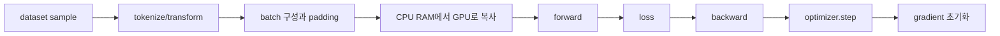

# 04. 학습 루프와 입력 파이프라인: 샘플이 gradient가 되기까지

[학습 안내](README.md) · 이전: [메모리·정밀도·용량](03-memory-precision-and-capacity.md) · 다음: [분산 학습과 collective](05-distributed-training-and-collectives.md)

근거 확인일: **2026-09-22**. 프레임워크 버전마다 옵션 이름과 기본값은 달라질 수 있다. 이 장은 PyTorch 공식 문서가 설명하는 `DataLoader`, pinned memory, autograd, `eval()`, `no_grad()`, DDP의 기본 개념을 기준으로, 특정 GPU나 패키지 설치 없이 학습 데이터가 장치까지 가는 길을 추적한다.

**입력 파이프라인(input pipeline)**은 저장된 샘플을 읽어 변환하고 batch로 묶어 장치에 공급하는 경로다. **DataLoader(데이터 적재기)**는 이 읽기·병렬 작업·batch 구성을 맡는 프레임워크 구성요소다. **Pinned memory(고정 메모리)**는 운영체제가 다른 곳으로 옮기지 않도록 고정한 CPU 메모리 페이지로, GPU와 비동기 복사를 준비할 때 쓰인다. **Autograd(자동미분)**는 forward에서 기록한 연산 관계를 따라 backward의 gradient를 계산한다.

## 학습 한 step에서 상태가 바뀌는 순서



**Optimizer**는 “학습을 알아서 하는 프로그램”이 아니라 gradient와 내부 상태를 사용해 parameter를 바꾸는 갱신 규칙이다. 가장 단순한 SGD는 `새 weight = 기존 weight - learning_rate × gradient`다. 기존 weight가 `2.0`, gradient가 `-0.4`, learning rate가 `0.1`이면 새 값은 `2.04`다. Adam 계열은 gradient의 이동 평균과 제곱 이동 평균을 추가로 보관하므로 같은 parameter 수라도 메모리를 더 쓴다. `zero_grad()`는 이 optimizer state를 지우는 동작이 아니라 다음 backward를 위해 gradient buffer를 비우거나 `None`으로 만드는 동작이다.

## 1. 이 장에서 쓰는 기본 단어

**샘플(sample)**은 데이터셋에서 하나 꺼낸 학습 예다. 문장 하나, 이미지 하나, 질의와 답변 한 쌍이 모두 샘플이 될 수 있다.

**토큰(token)**은 텍스트 모델이 처리하는 정수 단위다. 단어와 항상 같지 않으며, 한 문장이 12토큰일 수도 있고 400토큰일 수도 있다.

**배치(batch)**는 여러 샘플을 한 번에 묶은 것이다. **마이크로배치(microbatch)**는 큰 배치를 장치 메모리에 맞도록 나눈 작은 묶음이다.

**loss**는 모델 출력이 정답과 얼마나 다른지 나타내는 숫자다. **gradient**는 가중치를 조금 바꾸면 loss가 어느 방향으로 얼마나 변하는지 나타내는 값이고, **optimizer**는 gradient로 가중치를 갱신한다.

PyTorch `DataLoader`는 데이터셋에서 샘플을 꺼내 배치로 만들고, 여러 worker process를 사용해 로딩을 병렬화할 수 있다. `pin_memory=True`는 CUDA 장치로 보낼 Tensor를 page-locked host memory에 놓아 host-to-device 복사를 더 빠르게 만들 수 있다. 공식 문서: <https://docs.pytorch.org/docs/main/data.html>, <https://docs.pytorch.org/tutorials/recipes/recipes/tuning_guide.html>.

## 2. 전체 흐름 한 번에 보기

학습 step 하나는 대략 다음 흐름이다.

```text
파일·객체 저장소·DB
  → dataset.__getitem__
  → tokenize / decode / augment
  → collate: 길이가 다른 샘플을 batch 모양으로 맞춤
  → DataLoader worker
  → pinned host memory
  → GPU/NPU device memory
  → forward
  → loss
  → backward
  → gradient accumulation or sync
  → optimizer.step()
  → optimizer.zero_grad()
```

이 중 어디가 느린지는 모델 크기만으로 알 수 없다. 작은 모델도 CPU 전처리나 원격 스토리지 때문에 GPU가 놀 수 있고, 큰 모델은 forward/backward가 길어 데이터 로딩 지연을 숨길 수도 있다.

좋은 관측 질문은 “batch가 장치에 도착하기 전에 어디서 기다렸는가”다. 파일 열기, 압축 해제, 토큰화, Python worker, pinned memory 부족, PCIe 복사, 커널 실행, gradient 동기화가 각각 후보가 된다.

## 3. 입력 파이프라인은 데이터 구조를 바꾼다

텍스트 SFT 예제를 단순화해 보자. 원본 샘플은 사람이 읽는 문자열이다.

```text
{"prompt": "DNS란?", "answer": "도메인 이름을 IP 주소로 바꾸는 체계입니다."}
```

토크나이저는 문자열을 정수열로 바꾼다.

```text
input_ids = [101, 9381, 2043, 17, 155, 902, 310, 102]
labels    = [-100, -100, -100, 17, 155, 902, 310, 102]
```

여기서 `-100`은 흔히 “이 위치의 loss는 무시한다”는 뜻으로 쓰인다. 프롬프트를 그대로 외우는 것이 목표가 아니라 답변 구간을 맞히게 하려는 예이며, 프레임워크와 모델마다 ignore index는 다를 수 있다.

길이가 다른 샘플을 같은 배치에 넣으려면 padding이 필요하다.

```text
sample A length = 6
sample B length = 10
batch tensor length = 10

A: [a a a a a a PAD PAD PAD PAD]
B: [b b b b b b b   b   b   b]
```

padding 토큰까지 loss와 attention 계산에 넣으면 낭비와 오류가 생긴다. 그래서 `attention_mask`나 loss mask가 함께 움직인다. 입력 파이프라인은 모델이 계산할 수 있는 tensor 계약을 만든다.

## 4. pinned memory와 장치 복사

일반 host memory는 운영체제가 필요할 때 page를 이동하거나 swap할 수 있다. Pinned memory는 GPU DMA 전송에 유리하도록 고정된 host memory다. PyTorch 공식 문서는 `DataLoader(pin_memory=True)`가 Tensor batch를 pinned memory에 놓아 CUDA 장치 전송을 빠르게 할 수 있다고 설명한다.

흐름을 실제 물리 경로로 쓰면 이렇다.

```text
NVMe / network / page cache
  → CPU가 읽고 전처리한 host RAM
  → pinned host RAM
  → PCIe 또는 플랫폼의 CPU-GPU 링크
  → GPU VRAM
```

Pinned memory는 마법의 공유 메모리가 아니다. 데이터는 여전히 host에서 device로 복사되고, 너무 많이 pin하면 일반 프로세스와 OS의 메모리 관리에 부담을 줄 수 있다. custom batch type은 기본 pinning 로직이 모를 수 있으므로, 필요한 경우 batch 객체에 `pin_memory()`를 정의해야 한다는 점도 공식 문서가 언급한다.

프레임워크 의사코드는 다음처럼 이해하면 된다.

```text
# PyTorch 모양의 의사코드다. 이 교재의 검증 실행 대상이 아니다.
loader = DataLoader(dataset, batch_size=32, num_workers=4, pin_memory=True)
for batch in loader:
    batch = move_to_device(batch, non_blocking=True)
    output = model(batch["input_ids"])
```

`non_blocking=True`는 비동기 복사를 요청하는 힌트다. 실제로 겹쳐지는지는 pinned memory, device, stream, 뒤따르는 연산 의존성에 달려 있다.

### DataLoader worker와 queue를 실제 숫자로 보기

**Worker(작업 프로세스)**는 dataset에서 sample을 읽고 전처리하는 실행 단위다. Worker 수 4는 batch 4개가 동시에 GPU에서 실행된다는 뜻이 아니다. CPU 쪽에서 다음 batch 후보를 준비하는 process가 4개라는 뜻이며, 완성된 batch는 queue에서 학습 loop가 가져간다.

가정해 보자. GPU가 batch 하나를 80ms에 처리하고, worker 하나가 batch를 준비하는 데 평균 250ms가 걸린다.

```text
worker 1개의 이론적 공급률 = 1000 / 250 = 4 batch/s
GPU 요구률              = 1000 / 80  = 12.5 batch/s
```

Worker 하나만 있으면 GPU는 자주 입력을 기다린다. Worker 4개가 완전히 병렬로 일하고 저장장치 병목이 없다면 단순 공급 상한은 `4 × 4 = 16 batch/s`라서 GPU 요구률을 넘는다. 실제로는 process 시작, 직렬화, 공유 저장장치, CPU core 경쟁, 순서 보장 비용이 있으므로 이 계산은 worker 수를 정하는 출발점이다.

**Prefetch(미리 읽기)**는 GPU가 현재 batch를 계산하는 동안 다음 batch를 queue에 준비하는 방식이다. Queue가 항상 비면 입력 공급이 느린 신호이고, queue가 계속 가득 차는데 host RAM이 커지면 지나치게 많이 미리 읽는 신호일 수 있다. Worker 수를 늘리는 것과 storage bandwidth를 늘리는 것은 같은 해결책이 아니다.

## 5. forward, loss, backward, optimizer

**Forward**는 입력 tensor와 가중치를 사용해 출력을 계산하는 단계다. Transformer라면 embedding, attention, MLP, normalization을 통과한다.

**Loss 계산**은 모델 출력과 정답 label을 비교해 스칼라 또는 token별 loss를 만든다. 학습에서는 이 loss가 backward의 시작점이다.

**Backward**는 autograd graph를 거꾸로 따라가며 각 parameter의 gradient를 채운다. PyTorch tuning guide는 gradient가 필요한 연산의 중간 buffer를 저장한다고 설명하므로, 학습 메모리는 추론보다 보통 훨씬 크다.

**Optimizer step**은 gradient를 보고 parameter 값을 바꾼다. Adam 계열은 momentum과 variance 같은 optimizer state를 추가로 저장하며, 이 state는 모델 가중치 파일에는 없지만 학습 중 메모리를 크게 먹는다.

단일 step을 숫자로 보면 다음과 같다.

```text
parameter w = 10.0
learning_rate = 0.1
gradient dw = 3.0

SGD update:
new_w = w - learning_rate × gradient
      = 10.0 - 0.1 × 3.0
      = 9.7
```

실제 AdamW는 이보다 복잡하지만 핵심은 같다. gradient가 계산되기 전에는 optimizer가 무엇을 바꿀지 모른다.

### 역전파가 값을 전달하는 순서

두 연산 `a = w × x`, `loss = (a-y)^2 / 2`를 생각하자. `x=3`, `y=12`, `w=2`이면 forward에서 `a=6`, `loss=18`이다. Backward는 연산을 거꾸로 따라간다.

```text
d(loss)/d(a) = a - y = -6
d(a)/d(w)    = x     = 3
d(loss)/d(w) = -6 × 3 = -18
```

Gradient `-18`은 weight를 조금 키우면 이 지점의 loss가 줄어드는 방향임을 나타낸다. Learning rate가 `0.05`인 SGD라면 `new_w = 2 - 0.05 × (-18) = 2.9`다. Backward는 weight를 직접 고치지 않고 gradient buffer를 채우며, 실제 갱신은 optimizer step이 한다.

### Mixed precision은 저장 dtype과 계산 dtype을 나눈다

**Mixed precision(혼합 정밀도)**은 모든 값을 무조건 FP16으로 바꾸는 방법이 아니다. Weight 사본, activation, gradient, optimizer state, 특정 reduction을 서로 다른 dtype으로 둘 수 있다. 낮은 정밀도는 memory traffic과 지원되는 연산 속도에 이득을 줄 수 있지만 표현 범위가 좁아 overflow나 underflow가 날 수 있다.

**Loss scaling(손실 배율 조정)**은 작은 gradient가 낮은 정밀도에서 0으로 사라지는 것을 줄이려고 loss에 큰 수를 곱해 backward한 뒤, optimizer가 쓰기 전에 gradient를 같은 수로 나누는 방법이다. 예를 들어 원래 gradient가 `0.00001`이고 scale이 1024라면 backward 중 값은 `0.01024`가 되고, update 전 다시 1024로 나눈다. Scale이 너무 크면 overflow가 날 수 있어 구현은 유한값 여부를 확인하고 step을 건너뛰거나 scale을 조정할 수 있다.

### 두 microbatch가 parameter 하나를 바꾸는 실제 순서

Gradient accumulation을 정의로만 보면 batch 크기를 늘리는 옵션처럼 보인다. 실제로는 같은 gradient buffer를 여러 backward가 언제 더하고, optimizer가 언제 읽고, 언제 비우는지 정하는 상태 기계다.

모델 `y_hat=w×x`, loss `0.5×(y_hat-y)^2`, 초기 `w=1`, learning rate `0.1`을 사용하자. 한 optimizer step에 microbatch 두 개를 누적한다.

```text
microbatch A: x=1, y=3
microbatch B: x=2, y=4
```

두 샘플의 gradient를 현재 weight `w=1`에서 각각 계산한다.

```text
A: y_hat=1, loss=2, dw_A=(1-3)×1=-2
B: y_hat=2, loss=2, dw_B=(2-4)×2=-4
```

평균 loss와 같은 scale을 원하면 누적 gradient를 microbatch 수 2로 나눈다.

```text
gradient buffer after A = -2
gradient buffer after B = -2 + -4 = -6
gradient used by optimizer = -6 / 2 = -3
new_w = 1 - 0.1×(-3) = 1.3
```

| 시점 | parameter `w` | gradient buffer | 누가 바꾸나 |
|---|---:|---:|---|
| step 시작 | 1.0 | 0 | 학습 루프가 이전 gradient를 정리 |
| A forward | 1.0 | 0 | forward는 activation만 생성 |
| A backward | 1.0 | -2 | autograd가 gradient 누적 |
| B forward | 1.0 | -2 | 같은 parameter snapshot으로 계산 |
| B backward | 1.0 | -6 | autograd가 기존 buffer에 더함 |
| 평균/clip | 1.0 | -3 | 학습 정책이 optimizer 입력을 변환 |
| optimizer step | 1.3 | -3 | optimizer가 parameter/state 갱신 |
| 다음 step 준비 | 1.3 | 0 | gradient buffer 정리 또는 재사용 |

A backward 직후 optimizer step을 하면 B forward는 `w=1.2`를 보게 되어 큰 batch `[A,B]`를 한 번 계산한 것과 다른 알고리즘이 된다. Accumulation window 안에서는 parameter snapshot을 유지하고, window 경계에서만 update해야 하는 이유다.

DDP에서는 통신 시점도 붙는다. 모든 microbatch마다 all-reduce하면 값은 맞을 수 있지만 통신 횟수가 늘어난다. 중간 microbatch는 local gradient만 누적하고 마지막 backward에서 동기화하면 통신을 줄일 수 있다. 이때 모든 rank가 같은 accumulation count와 같은 경계에 도달해야 한다. 한 rank만 데이터가 일찍 끝나 collective 호출 수가 달라지면 hang이나 잘못된 평균이 생길 수 있다.

Loss scaling을 함께 쓰면 `scaled loss backward → 누적 → 한 번 unscale → inf/NaN 검사 → gradient clipping → optimizer step 또는 skip → gradient 정리` 순서를 명시해야 한다. Microbatch마다 서로 다른 scale로 만든 gradient를 그대로 더하거나 clipping을 unscale보다 먼저 하면 기준이 달라진다. Overflow 때문에 step을 건너뛴 경우 “batch를 읽었다”와 “parameter update가 성공했다”도 서로 다른 진행 단위가 된다.

반례로, 두 microbatch의 sample 수나 유효 token 수가 다르면 단순히 gradient를 2로 나누는 것이 전체 token 평균과 같지 않을 수 있다. A가 유효 token 2개, B가 8개라면 각 microbatch mean loss를 다시 평균할 때 두 token과 여덟 token에 같은 무게를 준다. Token 평균이 목적이면 loss sum과 유효 token 수를 함께 누적해 10으로 나누는 식으로 분모를 맞춰야 한다.

## 6. Gradient accumulation은 optimizer step을 늦춘다

장치 메모리에 batch 64를 한 번에 못 올린다고 하자. microbatch 8개를 8번 처리하고 gradient를 누적하면, optimizer는 batch 64를 본 것처럼 한 번만 움직일 수 있다.

```text
microbatch_size = 8 samples
accumulation_steps = 8
data_parallel_world_size = 1

effective sample batch = 8 × 8 × 1 = 64 samples
```

분산 학습에서는 **data parallel size(DP 크기)**, 즉 서로 다른 sample shard를 처리하는 모델 복제본 수가 곱해진다. 각 DP rank가 중복되지 않은 sample을 받는다는 전제에서 다음 식을 쓴다.

```text
microbatch_per_dp_rank = 4 samples
accumulation_steps = 8
data_parallel_size = 4

effective sample batch
  = microbatch_per_dp_rank × accumulation_steps × data_parallel_size
  = 4 × 8 × 4
  = 128 samples
```

전체 `world_size`를 곧바로 곱하면 안 된다. 예를 들어 `DP=4, TP=2, PP=2`이면 global world size는 16이지만 서로 다른 data shard를 처리하는 복제본은 4개이므로 배치 식에는 4를 쓴다. TP는 한 layer 계산을 나누고 PP는 layer 단계를 나누므로 같은 sample 처리에 협력한다.

또한 distributed sampler가 길이를 맞추려고 sample을 반복하면 “128개” 안에 중복이 있을 수 있다. 마지막 accumulation window가 8회보다 적게 끝났는데 그대로 optimizer step을 하면 유효 batch와 gradient 분모도 달라진다. 마지막 window를 drop할지, 실제 누적 횟수로 다시 나눌지, sample을 padding할지 명시한다.

하지만 언어모델에서는 샘플 수보다 **유효 토큰 수**가 더 중요할 때가 많다. 길이가 제각각이면 “샘플 128개”가 매번 같은 학습량을 뜻하지 않는다.

```text
rank 0 microbatch token counts: 100, 120
rank 1 microbatch token counts: 900, 880

sample 기준:
  rank 0도 2 samples, rank 1도 2 samples

token 기준:
  rank 0 = 220 tokens
  rank 1 = 1780 tokens
```

loss를 sample 평균으로만 내면 짧은 샘플 묶음과 긴 샘플 묶음의 가중치가 의도와 달라질 수 있다. 토큰 단위 cross entropy를 쓴다면 non-padding target token 수로 나누는지, microbatch마다 먼저 평균을 내는지, 전체 token loss 합을 전체 token 수로 나누는지 확인해야 한다.

작은 산술 예제를 보자.

```text
microbatch A: target tokens 10개, loss 합 20
microbatch B: target tokens 90개, loss 합 90

microbatch 평균을 다시 평균:
  A 평균 = 20 / 10 = 2.0
  B 평균 = 90 / 90 = 1.0
  step loss = (2.0 + 1.0) / 2 = 1.5

전체 token 기준 평균:
  step loss = (20 + 90) / (10 + 90) = 1.1
```

둘 다 코드로 가능하지만 의미가 다르다. 긴 샘플의 token 하나와 짧은 샘플의 token 하나를 같은 무게로 보려면 전체 token 기준 평균이 맞고, 샘플 하나를 같은 무게로 보려면 sample 기준 평균을 명시해야 한다.

Accumulation 중에는 보통 각 microbatch backward가 같은 gradient buffer에 더해진다. 따라서 8회 누적하려면 loss를 8로 나누거나, 마지막에 gradient를 8로 나누는 등 목표한 평균과 일치하는 scaling이 필요하다. 분산 DDP의 평균, padding 제외 token 수, 마지막에 덜 찬 accumulation window까지 들어오면 분모가 달라질 수 있다.

```text
microbatch gradient: 2, 4, 6, 8
합을 그대로 사용: 20
4개 평균 사용:     20 / 4 = 5
```

둘 중 어느 것이 맞는지는 loss 정의와 learning rate 계약에 달렸다. “누적 횟수를 늘렸더니 학습률도 사실상 커졌다”는 문제를 막으려면 optimizer step 직전 gradient가 합인지 평균인지 기록한다. Gradient clipping을 쓴다면 일반적으로 누적과 필요한 unscale이 끝난 뒤 어떤 전체 gradient를 자르는지도 확인한다.

## 7. train, eval, no_grad는 같은 스위치가 아니다

`model.train()`과 `model.eval()`은 module의 동작 모드를 바꾼다. Dropout은 train mode에서 무작위로 일부 값을 끄고, BatchNorm은 train/eval에서 running statistics 사용 방식이 달라진다.

`torch.no_grad()`는 autograd 기록을 끄는 context다.
PyTorch autograd notes는 `eval()`이 gradient 계산을 끄는 장치가 아니며, no-grad/inference mode와 직교한다고 설명한다. 공식 문서: <https://docs.pytorch.org/docs/stable/notes/autograd.html>.

검증 루프 의사코드는 그래서 두 가지를 함께 쓴다.

```text
# PyTorch 모양의 의사코드다.
model.eval()
with no_grad():
    for batch in valid_loader:
        output = model(batch)
        metric.update(output)

model.train()
```

`eval()`만 호출하면 gradient graph가 만들어질 수 있고, `no_grad()`만 쓰고 `eval()`을 빼면 Dropout 같은 module이 여전히 training behavior를 보일 수 있다. 학습으로 돌아갈 때 `model.train()`을 되돌리는 것도 잊기 쉬운 실수다.

## 8. Full fine-tuning, LoRA, QLoRA의 경계

**Full fine-tuning**은 기본 모델의 모든 또는 대부분의 parameter를 학습 가능하게 두고 갱신한다. 품질 조정 폭은 크지만 gradient와 optimizer state가 크다.

**LoRA**는 pretrained weight를 고정하고 작은 low-rank matrix를 추가해 그 adapter만 학습하는 방식이다.
원 논문은 transformer layer에 trainable rank decomposition matrix를 주입해 trainable parameter 수를 크게 줄인다고 설명한다. 논문: <https://arxiv.org/abs/2106.09685>.

**QLoRA**는 quantized base model 위에 LoRA adapter를 학습하는 방법이다.
QLoRA 논문은 4-bit NormalFloat, double quantization, paged optimizer 같은 기법을 제시한다. 논문: <https://proceedings.neurips.cc/paper_files/paper/2023/file/1feb87871436031bdc0f2beaa62a049b-Paper-Conference.pdf>.

경계를 표로 정리하면 다음과 같다.

| 방법 | base weight | 주로 학습되는 것 | 메모리 직관 | 주의 |
|---|---|---|---|---|
| Full fine-tuning | 보통 학습됨 | 전체 parameter | 가장 큼 | optimizer state가 큼 |
| LoRA | 보통 고정 | adapter matrix | 작아짐 | adapter target module과 rank가 품질에 영향 |
| QLoRA | quantized 상태로 사용 | LoRA adapter | 더 작아질 수 있음 | quantization kernel, 품질, optimizer 설정 확인 |

LoRA가 항상 full fine-tuning과 같은 품질을 보장하지는 않고, QLoRA가 항상 더 빠른 것도 아니다. 메모리 절약, 정확도, kernel 지원, 저장 형식, serving 병합 가능성을 따로 본다.
Hugging Face PEFT 문서는 LoRA 설정과 QLoRA-style target module 선택을 설명한다. 공식 문서: <https://huggingface.co/docs/peft/en/package_reference/lora>.

## 9. 결정성, seed, 데이터 누수

**결정성(determinism)**은 같은 입력과 설정에서 같은 결과가 재현되는 성질이다.
GPU kernel, 병렬 reduction 순서, DataLoader worker seed, random augmentation, dropout, mixed precision 때문에 완전한 재현은 생각보다 어렵다.

seed를 고정해도 다음이 바뀌면 결과가 달라질 수 있다.

- 데이터 파일 순서
- worker 수와 multiprocessing 시작 방식
- 분산 rank 수
- padding과 batch packing
- library와 driver 버전
- non-deterministic kernel 선택

**데이터 누수(data leakage)**는 학습 과정에서 평가나 실제 운영에서 모를 정보를 미리 본 상황이다.
validation 문서가 train shard에 중복되어 있거나, 같은 대화의 앞부분은 train에 뒷부분은 test에 들어가거나, benchmark 정답이 instruction 데이터에 섞이는 경우가 있다.

학습 파이프라인에서 누수를 막으려면 split을 파일명 뒤에서 하지 말고 stable sample id 기준으로 한다.
정규화, deduplication, filtering도 train/valid/test 경계를 넘나들며 정보를 섞지 않는지 확인한다.

## 10. 표준 라이브러리로 보는 누적 loss 계산

아래 코드는 PyTorch가 아니다.
토큰 수가 다른 microbatch를 어떻게 평균하느냐에 따라 숫자가 달라진다는 점만 확인한다.

```python
microbatches = [
    {"tokens": 10, "loss_sum": 20.0},
    {"tokens": 90, "loss_sum": 90.0},
]

mean_of_means = sum(m["loss_sum"] / m["tokens"] for m in microbatches) / len(microbatches)
token_weighted = sum(m["loss_sum"] for m in microbatches) / sum(m["tokens"] for m in microbatches)

print(round(mean_of_means, 3))
print(round(token_weighted, 3))
```

기대 출력:

```text
1.5
1.1
```

이 작은 차이가 accumulation, DDP, variable length packing과 만나면 학습 품질 차이로 커질 수 있다.

## 11. 자주 하는 오해

“GPU 사용률이 낮으니 모델이 작다”는 결론은 너무 빠르다.
입력 파이프라인이 느려도 GPU는 논다.

“Pinned memory를 켜면 복사가 사라진다”는 틀렸다.
복사는 남아 있고, 더 효율적이거나 비동기적으로 겹칠 가능성이 생긴다.

“Effective batch는 sample 수만 보면 된다”는 LLM에서 위험하다.
토큰 수와 loss normalization을 함께 봐야 한다.

“`eval()`은 `no_grad()`와 같다”는 틀렸다.
하나는 module behavior, 다른 하나는 autograd 기록 제어다.

“LoRA/QLoRA는 항상 full fine-tuning의 하위 호환”도 틀렸다.
목표 품질, domain shift, adapter 위치, quantization 오차에 따라 달라진다.

## 12. 해설 문제

문제 1. microbatch size 2, accumulation 16, world size 8이면 sample 기준 effective batch는 얼마인가?

해설: `2 × 16 × 8 = 256 samples`다.
다만 각 sample의 token 길이가 다르면 token 기준 effective batch는 step마다 달라질 수 있다.

문제 2. microbatch A는 50토큰 loss 합 100, B는 150토큰 loss 합 180이다. token 평균 loss는?

해설: `(100 + 180) / (50 + 150) = 280 / 200 = 1.4`다.
microbatch 평균을 다시 평균하면 `(2.0 + 1.2) / 2 = 1.6`이므로 의미가 다르다.

문제 3. validation에서 `model.eval()`만 호출하고 `no_grad()`를 빼면 어떤 일이 생길 수 있는가?

해설: Dropout 같은 module behavior는 평가 모드가 되지만 autograd graph와 중간 buffer가 만들어질 수 있다.
불필요한 메모리와 시간이 든다.

문제 4. QLoRA로 학습하면 base model의 모든 실행 메모리가 4bit로만 계산되는가?

해설: 아니다.
Quantized weight 저장, adapter, activation, optimizer state, dequantization, kernel의 compute dtype은 서로 다를 수 있다.
실제 메모리는 구현과 설정을 확인해야 한다.

[용어 사전](12-glossary.md) · [로컬 실습](11-local-labs-and-research.md) · [다음 장](05-distributed-training-and-collectives.md)
