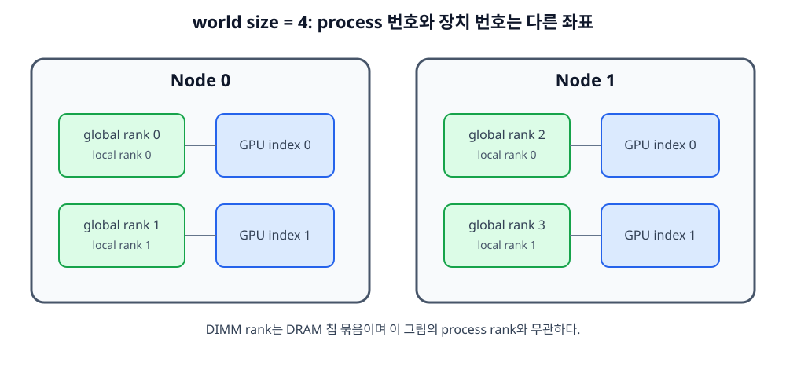
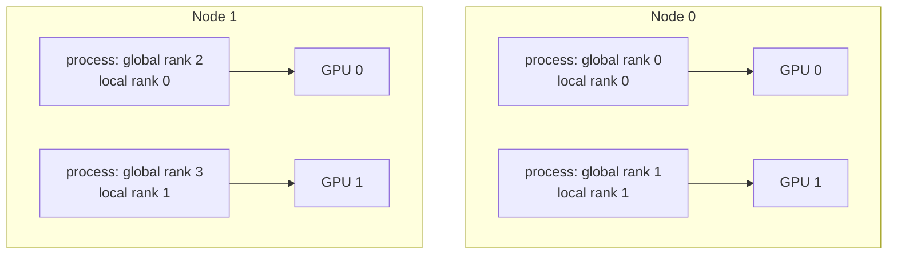

# 05. 분산 학습과 collective: 여러 GPU가 한 모델을 같이 학습하는 법

[학습 안내](README.md) · 이전: [학습 루프와 입력 파이프라인](04-training-and-input-pipelines.md) · 다음: [LLM 추론과 KV cache](06-llm-inference-and-kv-cache.md)

근거 확인일: **2026-09-22**. 이 장은 PyTorch `torch.distributed`, `DistributedDataParallel`, FSDP, DeepSpeed ZeRO, NVIDIA NCCL, Megatron-LM 문서를 기준으로 한다. 분산 학습 프레임워크의 세부 기본값은 버전마다 바뀔 수 있으므로, 여기서는 “어떤 데이터가 복제되고, 어떤 데이터가 나뉘며, 어떤 통신이 필요한가”를 먼저 세운다.

**분산 학습(distributed training)**은 여러 process와 장치가 한 학습 작업을 나누어 수행하는 방식이다. **Shard(샤드, 조각)**는 tensor·모델·데이터를 나눈 한 부분이고, **replica(복제본)**는 같은 내용을 여러 장치에 그대로 둔 사본이다. **Collective(집단 통신)**는 group의 여러 process가 같은 순서로 함께 참여하는 통신이며, all-reduce처럼 값을 합친 뒤 모두에게 돌려주는 연산이 대표적이다.

## 시작하기 전에: 여기서 rank는 process 번호다



*그림 1. world size는 참여 process 수다. global rank, node-local rank, 실제 GPU 번호는 서로 다른 좌표다.*



이 예의 world size는 4다. `global rank 2`는 전체 group의 세 번째 process이고, 그 process의 `local rank 0`은 두 번째 노드 안의 첫 번째 process라는 뜻이다. GPU 0은 노드마다 다시 등장하므로 global rank와 같지 않다. 또한 서버 메모리의 DIMM rank는 DRAM 칩 묶음을 뜻하며 이 번호 체계와 관계없다.

Collective를 호출할 때는 참여자·tensor shape·dtype·호출 순서가 group 전체에서 맞아야 한다. rank 0만 all-reduce를 호출하고 나머지가 호출하지 않으면, rank 0은 상대를 기다리며 멈춘 것처럼 보일 수 있다.

## 1. rank, world size, process group

**Process**는 실행 중인 프로그램 인스턴스다.
분산 학습에서는 보통 GPU 하나에 process 하나를 붙인다.

**Rank**는 process group 안에서 process를 구분하는 번호다.
PyTorch 문서는 rank가 process group 안에서 0부터 `world_size - 1`까지 이어지는 unique identifier라고 설명한다. 공식 문서: <https://docs.pytorch.org/docs/stable/distributed.html>.

**World size**는 process group 안 process 수다.
8개 GPU로 한 group을 만들면 world size는 8이다.

**Process group**은 collective 통신에 참여할 rank들의 집합이다.
전체 rank group도 있고, tensor parallel group처럼 일부 rank만 묶은 group도 있다.

```text
world_size = 4

rank 0 ┐
rank 1 ├─ default process group
rank 2 ┤
rank 3 ┘

tensor parallel group A: rank 0, rank 1
tensor parallel group B: rank 2, rank 3
```

같은 rank라도 group이 다르면 의미가 달라진다.
`rank 1`이라는 숫자만으로는 “전체에서 1번”인지 “부분 group에서 1번”인지 알 수 없다.

## 2. Collective는 모두가 같은 약속으로 부르는 통신이다

**Collective communication**은 group의 여러 rank가 함께 호출하는 통신이다.
NCCL은 all-gather, all-reduce, broadcast, reduce, reduce-scatter 같은 routine을 제공한다. 공식 문서: <https://developer.nvidia.com/nccl>, <https://docs.nvidia.com/deeplearning/nccl/user-guide/docs/usage/collectives.html>.

대표 연산을 표로 보자.

| 연산 | 입력 | 결과 |
|---|---|---|
| broadcast | 한 rank의 tensor | 모든 rank가 같은 tensor를 받음 |
| all-reduce | 각 rank의 tensor | reduce 결과가 모든 rank에 생김 |
| reduce-scatter | 각 rank의 tensor | reduce한 결과를 나눠 가짐 |
| all-gather | 각 rank의 shard | 모든 shard를 모아 모든 rank가 봄 |

Collective는 참여자와 tensor 모양이 맞아야 한다.
PyTorch distributed 문서는 일부 collective에서 노드 간 개별 shape checking이 구현되어 있지 않을 수 있으므로 주의하라고 설명한다.
한 rank만 다른 크기의 tensor를 넣으면 오류가 즉시 나지 않고 잘못된 결과나 hang이 날 수 있다.

### 네 rank의 값을 연산별로 직접 이동시키기

Rank 0~3이 각각 한 숫자 `[1]`, `[2]`, `[3]`, `[4]`를 갖고 있다고 하자.

**Broadcast(방송)**는 root rank 하나의 값을 모두에게 복사한다. Root가 rank 0이면 결과는 다음과 같다.

```text
입력: r0=[1], r1=[2], r2=[3], r3=[4]
결과: r0=[1], r1=[1], r2=[1], r3=[1]
```

**All-reduce(전체 축약)**는 모든 값을 더하거나 최댓값을 고르는 reduce를 수행한 뒤 결과를 모든 rank에 둔다. Sum이면 `1+2+3+4=10`이므로 네 rank 모두 `[10]`을 받는다. 평균이 필요하면 collective 자체 또는 framework 의미에 따라 4로 나눈다.

**All-gather(전체 모으기)**는 각 rank가 가진 서로 다른 shard를 순서대로 모아 모든 rank에 완전한 목록을 만든다.

```text
입력: r0=[A], r1=[B], r2=[C], r3=[D]
결과: 모든 rank=[A,B,C,D]
```

**Reduce-scatter(축약 후 나누기)**는 rank별 입력의 같은 위치를 먼저 reduce한 뒤 결과 조각을 나눠 갖는다. 각 rank가 길이 4 tensor를 넣는 예다.

```text
r0=[ 1, 10, 100, 1000]
r1=[ 2, 20, 200, 2000]
r2=[ 3, 30, 300, 3000]
r3=[ 4, 40, 400, 4000]

위치별 sum=[10, 100, 1000, 10000]
결과: r0=[10], r1=[100], r2=[1000], r3=[10000]
```

All-gather는 분할된 parameter를 잠시 완전한 tensor로 만들 때, reduce-scatter는 gradient를 합치면서 각 rank 담당 shard만 남길 때 사용할 수 있다. 실제 framework는 bucket, padding, dtype 변환과 비동기 실행을 더하므로 이 작은 값 예제는 의미를 보여주는 모형이다.

## 3. DDP는 모델 복제와 gradient 동기화다

**Data parallelism**은 같은 모델 복제본을 여러 rank에 두고, 각 rank가 다른 data shard를 처리하는 방식이다.
PyTorch `DistributedDataParallel` 문서는 모델 replica 사이 gradient를 동기화하며, input을 자동으로 shard하지 않으므로 사용자가 `DistributedSampler` 같은 방식으로 나눠야 한다고 설명한다. 공식 문서: <https://docs.pytorch.org/docs/main/generated/torch.nn.parallel.DistributedDataParallel.html>.

DDP step을 한 줄씩 펼치면 다음과 같다.

```text
rank 0: model replica, batch shard A → forward → backward → local gradients
rank 1: model replica, batch shard B → forward → backward → local gradients
rank 2: model replica, batch shard C → forward → backward → local gradients
rank 3: model replica, batch shard D → forward → backward → local gradients

all-reduce gradients
each rank gets averaged gradients
optimizer.step() on each rank
replicas stay numerically aligned
```

중요한 점은 DDP가 GPU 메모리를 자동으로 합쳐 하나의 큰 VRAM처럼 쓰게 해주지 않는다는 것이다.
모델 parameter, 많은 activation, optimizer state는 각 rank에 복제된다.
DDP는 주로 데이터 처리량을 늘리고 gradient를 평균하기 위한 방식이다.

## 4. DDP 메모리 산술

가상의 모델을 보자.

```text
parameters = 10 GiB
gradients = 10 GiB
optimizer states = 20 GiB
activations = 8 GiB per rank
```

DDP 4rank에서 rank 하나의 대략적인 학습 상태 메모리는 다음과 같다.

```text
10 + 10 + 20 + 8 = 48 GiB per rank
```

4rank니까 전체 cluster에 저장된 중복 총량은 커지지만, 각 GPU가 필요한 최소 메모리는 4분의 1로 줄지 않는다.
이 오해가 크다.
“GPU 4장이니 80GB × 4 = 320GB 모델이 DDP로 들어간다”는 결론은 틀릴 수 있다.
모델 하나가 각 rank에 올라가야 하기 때문이다.

## 5. Gradient all-reduce 숫자 예제

parameter 하나의 gradient가 rank마다 다르게 계산됐다고 하자.

```text
rank 0 gradient = 1.0
rank 1 gradient = 2.0
rank 2 gradient = 3.0
rank 3 gradient = 4.0
```

All-reduce sum의 결과는 모든 rank에서 `10.0`이다.
평균 gradient를 쓰려면 world size 4로 나눈다.

```text
average = (1 + 2 + 3 + 4) / 4 = 2.5
```

PyTorch DDP는 기본적으로 gradient를 평균하도록 동기화한다. 전체 backward가 끝난 뒤 통신을 한꺼번에 시작하는 고정 순서는 아니다. 준비된 gradient bucket부터 통신을 시작해 아직 진행 중인 backward 계산과 겹칠 수 있으며, optimizer update 전에 필요한 동기화 결과를 확보한다. 공식 문서: <https://docs.pytorch.org/tutorials/recipes/recipes/tuning_guide.html>.

optimizer는 각 rank에서 같은 평균 gradient로 같은 update를 한다.
그래서 별도의 parameter broadcast를 매 step마다 하지 않아도 복제본이 대체로 같은 값으로 유지된다.
부동소수점 비결정성과 unused parameter, skipped step 같은 예외는 별도 관리가 필요하다.

## 6. Ring all-reduce의 트래픽 모델

Ring all-reduce는 데이터를 조각으로 나눠 ring을 따라 reduce-scatter와 all-gather를 수행하는 모델로 설명할 수 있다.
NCCL은 ring, tree 등 여러 알고리즘을 topology와 메시지에 따라 선택할 수 있으며, `NCCL_ALGO`로 algorithm 선택을 제한할 수 있다. 공식 문서: <https://docs.nvidia.com/deeplearning/nccl/user-guide/docs/env.html>.

### 네 참가자의 ring을 step으로 보기

각 rank의 tensor를 네 chunk로 나누고, rank는 오른쪽 이웃에게 한 chunk를 보내며 왼쪽 이웃에서 한 chunk를 받는다고 하자. Ring all-reduce는 개념적으로 두 phase를 갖는다.

1. **Reduce-scatter phase:** `p-1=3`번 이동하며 같은 chunk 위치의 값을 합친다. 끝나면 각 rank는 완전히 합쳐진 chunk 하나를 담당한다.
2. **All-gather phase:** 다시 3번 이동하며 완성된 chunk를 이웃에게 전달한다. 끝나면 모든 rank가 완전한 합 tensor를 갖는다.

```text
ring: r0 → r1 → r2 → r3 → r0

reduce-scatter
  step 1: 각 rank가 chunk 1개 송신, 받은 chunk에 local 값 축약
  step 2: 다음 chunk 송신·축약
  step 3: 다음 chunk 송신·축약
  결과: rank마다 완성 chunk 1개

all-gather
  step 1: 완성 chunk 1개를 이웃에 전달
  step 2: 새로 받은 완성 chunk를 다음 이웃에 전달
  step 3: 마지막 완성 chunk 전달
  결과: 모든 rank가 chunk 4개 보유
```

Tensor 전체가 1GiB이고 균등하게 네 chunk로 나뉘면 chunk 하나는 0.25GiB다. 각 phase에서 rank마다 `3 × 0.25 = 0.75GiB`를 보내므로 두 phase 송신 합은 1.5GiB다. 수신량도 별도로 약 1.5GiB다. “총 트래픽 1.5GiB”라고 쓸 때 송신만 센 것인지 송수신 합 3GiB를 말하는지 분모를 밝혀야 한다.

시간을 `1.5GiB ÷ 링크 대역폭`만으로 단정할 수는 없다. 각 step의 latency, 링크 동시성, 단방향·양방향 대역폭 정의, PCIe/NVLink/NIC 경로, 다른 통신과의 경쟁이 붙는다. NCCL이 언제나 이 단순 ring을 고른다는 뜻도 아니다.

단순 ring 모델의 자주 쓰는 근사:

```text
p = rank 수
n = rank마다 all-reduce할 tensor bytes
각 rank의 총 송신량 ≈ 2 × (p - 1) / p × n
```

가정은 중요하다.
각 link가 균형이고, ring이 잘 매핑되고, 메시지가 충분히 크고, 프로토콜 overhead와 latency를 단순화한 모델이다.

숫자를 넣어 보자.

```text
p = 4
n = 1 GiB

각 rank 송신량 ≈ 2 × (4 - 1) / 4 × 1 GiB
             = 2 × 3/4 GiB
             = 1.5 GiB
```

양방향 대역폭, PCIe switch 구조, NVLink, NIC, host staging, congestion이 들어가면 실제 시간은 달라진다.
그래도 이 식은 “all-reduce는 공짜가 아니다”를 잡아준다.
모델이 커질수록 gradient bucket과 통신 overlap이 중요한 이유도 여기서 나온다.

## 7. FSDP와 ZeRO는 무엇을 줄이는가

**FSDP(Fully Sharded Data Parallel)**는 parameter, gradient, optimizer state를 rank 사이에 shard해 rank별 메모리를 줄이는 방식이다.
PyTorch FSDP tutorial은 DDP와 비교해 model parameter, gradient, optimizer state를 sharding하여 GPU memory footprint를 줄인다고 설명한다. 공식 문서: <https://docs.pytorch.org/tutorials/intermediate/FSDP_tutorial.html>.

**ZeRO(Zero Redundancy Optimizer)**도 data parallel process 사이 model state redundancy를 줄이는 계열이다.
DeepSpeed 문서는 ZeRO가 optimizer states, gradients, parameters를 partition한다고 설명한다. 공식 문서: <https://www.deepspeed.ai/training/>, <https://www.deepspeed.ai/docs/config-json/>.

간단히 나누면 다음 감각이다.

| 방식 | 줄이는 대상의 직관 | 통신 직관 |
|---|---|---|
| DDP | 거의 줄이지 않음 | gradient all-reduce |
| ZeRO-1 | optimizer state partition | optimizer state 관련 메모리 감소 |
| ZeRO-2 | optimizer state + gradient partition | reduce-scatter 성격 증가 |
| ZeRO-3 / FSDP full shard | parameter + gradient + optimizer state partition | forward/backward 때 parameter all-gather 필요 |

FSDP 문서는 process group이 FSDP의 all-gather와 reduce-scatter collective에 사용된다고 설명한다. 공식 문서: <https://docs.pytorch.org/docs/main/fsdp.html>.

## 8. Sharding은 순간 메모리까지 봐야 한다

FSDP/ZeRO-3는 parameter를 항상 완전한 형태로 모든 rank에 들고 있지 않게 해준다.
하지만 layer를 계산하려면 해당 layer의 full parameter가 순간적으로 필요할 수 있다.
그래서 forward 전에 all-gather하고, 계산 뒤 reshard하거나 버리는 흐름이 생긴다.
PyTorch FSDP advanced tutorial은 full params가 backward 끝에 해제되고 다음 forward에서 all-gather가 일어난다고 설명한다. 공식 문서: <https://docs.pytorch.org/tutorials/intermediate/FSDP_advanced_tutorial.html>.

따라서 “8rank FSDP니까 모든 메모리가 정확히 1/8”은 틀린 말이다.
shard된 장기 상태는 줄지만, all-gather buffer, activation, communication bucket, prefetch, fragmentation, largest layer가 peak memory를 만든다.

작은 예:

```text
model parameters = 80 GiB
world_size = 8
parameter shard lower bound = 10 GiB per rank

largest FSDP unit full parameter = 6 GiB
activation and temp buffers = 12 GiB

rough peak can be:
10 GiB shard + 6 GiB transient all-gather + 12 GiB others = 28 GiB+
```

이 산술은 하한 감각이다.
실제 peak는 wrapping 정책, prefetch, mixed precision, optimizer, allocator에 따라 달라진다.

## 9. DP, TP, PP, EP를 구분하기

Megatron-LM 병렬화 가이드는 data, tensor, pipeline, context, expert parallelism을 구분한다. 공식 문서: <https://github.com/NVIDIA/Megatron-LM/blob/main/docs/user-guide/parallelism-guide.md>.

**DP(Data Parallelism, 데이터 병렬화)**는 같은 모델 복제본이 서로 다른 입력 sample을 처리한다. **TP(Tensor Parallelism, 텐서 병렬화)**는 한 layer의 큰 행렬·tensor 계산을 여러 GPU가 나눈다. **PP(Pipeline Parallelism, 파이프라인 병렬화)**는 연속 layer 묶음을 **stage(단계)**로 나누고 앞 stage의 activation을 다음 stage로 보낸다. Stage가 입력을 기다리거나 마지막 일을 끝내느라 일부 GPU가 비는 시간을 **pipeline bubble(파이프라인 빈 구간)**이라고 한다.

**EP(Expert Parallelism, 전문가 병렬화)**는 **MoE(Mixture of Experts, 전문가 혼합)** 모델의 여러 **expert(전문가, token별로 선택되는 하위 신경망)**를 rank에 나눈다. Token을 선택된 expert가 있는 rank로 보내는 과정을 **dispatch(분배)**, expert 결과를 원래 token 순서로 모으는 과정을 **combine(결합)**이라고 한다. **CP(Context Parallelism, 문맥 병렬화)**는 긴 sequence/context 축을 여러 rank가 나누어 처리한다.

| 이름 | 무엇을 나누나 | 직관 |
|---|---|---|
| DP, Data Parallelism | batch dimension | 같은 모델, 다른 데이터 |
| TP, Tensor Parallelism | layer 안 tensor/행렬 | 큰 layer를 여러 GPU가 나눠 계산 |
| PP, Pipeline Parallelism | model depth | layer 묶음을 stage로 나눔 |
| EP, Expert Parallelism | MoE expert | expert를 rank에 나눠 배치 |
| CP, Context Parallelism | sequence/context | 긴 sequence 축을 나눔 |

TP는 한 layer의 행렬곱 자체를 나눠 계산하므로 layer마다 통신이 잦을 수 있다.
PP는 앞 stage 출력 activation을 다음 stage로 보내며, pipeline bubble과 microbatch scheduling이 성능에 영향을 준다.
EP는 token을 담당 expert가 있는 rank로 보내는 dispatch와 combine 비용이 생긴다.

현실의 큰 학습은 이들을 섞는다.
예를 들어 64GPU를 `DP=4, TP=4, PP=4`로 쓸 수 있다.
곱하면 `4 × 4 × 4 = 64`지만, 각 parallel dimension의 group과 통신 패턴은 다르다.

한 sample이 이 64GPU 배치를 지나는 개념 trace는 다음과 같다.

```text
1. DP group 4개가 서로 다른 microbatch A, B, C, D를 받는다.
2. 각 DP 복제본 안에서 TP GPU 4개가 stage 0의 같은 layer 행렬곱을 분할 계산한다.
3. TP 결과를 조합해 만든 activation을 PP의 다음 stage로 전달한다.
4. Stage 1도 자기 TP GPU 4개로 다음 layer 묶음을 계산한다.
5. PP stage 0→1→2→3을 지나 loss를 계산한다.
6. Backward는 stage를 거꾸로 지나며, 각 TP group이 layer gradient 계산을 협력한다.
7. 마지막으로 같은 parameter 복제본을 가진 DP rank들이 gradient를 동기화한다.
```

따라서 global world size 64를 effective batch 식에 곱하지 않는다. 서로 다른 입력을 받은 DP 크기 4만 batch 축에 기여하고, TP와 PP의 16 GPU는 각 DP 복제본 안에서 같은 microbatch의 모델 계산을 나눈다.

## 10. Topology는 collective 시간을 바꾼다

Topology는 장치와 링크의 연결 구조다.
같은 8GPU라도 모두 NVLink로 잘 연결된 서버, PCIe switch를 공유하는 서버, 노드 밖으로 InfiniBand를 건너야 하는 cluster는 다르다.

느린 rank 하나가 전체 step을 늦출 수 있다.
DDP all-reduce는 모든 rank의 gradient가 도착해야 끝난다.
한 rank의 DataLoader가 늦거나, GPU thermal throttling이 생기거나, NIC error가 재전송을 만들면 나머지 rank도 기다린다.

진단 질문:

- step time 분포에서 특정 rank만 늦은가?
- forward/backward가 늦은가, all-reduce가 늦은가?
- DataLoader queue가 비었는가?
- GPU clock, ECC/Xid, thermal 상태가 바뀌었는가?
- NIC counter, retransmit, congestion, link width가 정상인가?
- 같은 node 안 통신과 node 간 통신이 분리되어 보이는가?

분산 학습 장애는 “코드가 멈춤”처럼 보이지만 실제 원인은 rank 불일치, shape 불일치, sampler 길이 차이, network partition, collective timeout, 한 rank의 OOM일 수 있다.

## 11. Uneven batch와 sampler duplication

데이터셋 크기가 rank 수와 batch 크기로 딱 나누어떨어지지 않으면 마지막 step이 애매해진다.
PyTorch `DistributedSampler`는 dataset을 replica 수로 나눠 각 rank에 subset을 제공한다.
공식 문서는 sampler가 dataset이 constant size이고 항상 같은 순서로 같은 element를 반환한다고 가정한다고 설명한다. 공식 문서: <https://docs.pytorch.org/docs/main/data.html>.

분산 sampler는 길이를 맞추기 위해 sample을 추가로 반복하거나 일부를 drop할 수 있다.
이것은 “중복이 절대 없다”는 뜻이 아니다.
평가에서는 중복 sample이 metric을 왜곡할 수 있어 주의한다.

DDP에는 uneven input을 다루는 `join()` 흐름과 `divide_by_initial_world_size` 같은 선택지가 있다.
PyTorch DDP 문서는 uneven input에서 initial world size로 나눌지, 남은 rank 수로 나눌지에 따라 마지막 입력들의 gradient weight가 달라진다고 설명한다. 공식 문서: <https://docs.pytorch.org/docs/main/generated/torch.nn.parallel.DistributedDataParallel.html>.

토큰 수가 uneven하면 문제는 더 커진다.
rank마다 sample 수는 같아도 padding 후 실제 target token 수가 크게 다르면, loss scaling과 gradient 평균의 의미를 확인해야 한다.

## 12. 표준 라이브러리로 all-reduce를 흉내 내기

아래 코드는 통신을 하지 않는다.
all-reduce sum과 평균의 의미만 확인한다.

```python
gradients = [1.0, 2.0, 3.0, 4.0]
all_reduce_sum = sum(gradients)
world_size = len(gradients)
average_gradient = all_reduce_sum / world_size

print(all_reduce_sum)
print(average_gradient)

p = 4
n_gib = 1.0
ring_send_gib = 2 * (p - 1) / p * n_gib
print(ring_send_gib)
```

기대 출력:

```text
10.0
2.5
1.5
```

이 코드는 NCCL 성능 모델이 아니다.
숫자의 의미를 손에 잡히게 하는 작은 산술이다.

## 13. 자주 하는 오해

“DDP를 켜면 모델 메모리가 GPU 수만큼 나뉜다”는 틀렸다.
DDP는 replica 기반이다.

“FSDP/ZeRO를 쓰면 모든 메모리가 자동으로 N분의 1”도 틀렸다.
activation, transient all-gather, largest layer, buffers, optimizer 구현이 peak를 만든다.

“All-reduce는 네트워크 대역폭만 보면 된다”도 부족하다.
latency, topology, algorithm, bucket, overlap, slow rank를 함께 봐야 한다.

“Rank가 많으면 항상 빠르다”는 틀렸다.
통신과 input pipeline이 계산 절약보다 커지면 scaling이 꺾인다.

“Sampler가 분산이면 데이터 중복이 없다”는 틀렸다.
길이 맞춤, drop_last, epoch seed, validation metric 처리까지 확인해야 한다.

## 14. 해설 문제

문제 1. world size 8에서 rank 번호 범위는?

해설: 기본 group 기준 `0`부터 `7`까지다.
부분 process group에서는 같은 process가 다른 local rank 의미를 가질 수 있다.

문제 2. 4rank all-reduce에서 local gradient가 `[2, 2, 6, 10]`이면 평균 gradient는?

해설: 합은 `20`, 평균은 `20 / 4 = 5`다.

문제 3. 8rank ring all-reduce에서 rank마다 2GiB tensor를 줄이면 단순 모델상 각 rank 송신량은?

해설: `2 × (8 - 1) / 8 × 2GiB = 3.5GiB`다.
실제 시간은 topology와 algorithm에 따라 달라진다.

문제 4. FSDP가 DDP보다 메모리를 줄일 수 있는데도 OOM이 나는 이유를 두 가지 쓰라.

해설: layer 계산을 위한 transient all-gather가 peak를 만들 수 있고, activation·temporary workspace·communication buffer·allocator fragmentation은 parameter shard와 별개로 남는다.

[용어 사전](12-glossary.md) · [로컬 실습](11-local-labs-and-research.md) · [다음 장](06-llm-inference-and-kv-cache.md)
