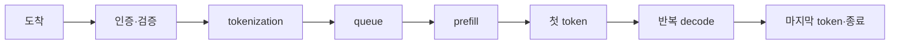

# 07. 서빙, 스케줄링, SLO

[AI 인프라 학습 목차](README.md) · 이전: [06. LLM 추론과 KV cache](06-llm-inference-and-kv-cache.md) · 다음: [08. 데이터, 모델, 체크포인트](08-data-models-and-checkpoints.md)

이 장은 사용자의 한 문장이 서버에 도착해서 첫 토큰과 마지막 토큰으로 돌아오기까지를 추적한다.
초점은 모델 품질이 아니라 운영 경로다.
인증, 토큰화, 큐, 스케줄러, GPU 실행, 스트리밍, 취소, timeout이 서로 어디에 붙는지 본다.

**Serving(서빙)**은 학습된 모델을 요청에 응답하는 서비스로 운영하는 일이고, **scheduler(스케줄러)**는 기다리는 요청 가운데 무엇을 언제 GPU batch에 넣을지 정한다. **SLO(Service Level Objective, 서비스 수준 목표)**는 운영자가 달성하려는 지연·가용성 목표이고, **SLA(Service Level Agreement, 서비스 수준 계약)**는 고객과 합의한 보상·책임을 포함할 수 있는 계약이다. **Percentile(백분위수)** p99는 관측값을 작은 순서로 놓았을 때 약 99%가 그 값 이하라는 뜻이다.

이 장의 구체적인 예시는 autoregressive LLM의 텍스트 생성 서빙이다. 이미지 분류나 embedding 생성처럼 한 번의 forward로 끝나는 AI 추론도 있다.
여기서 다루는 생성 요청은 prompt 처리(prefill)와 이후 토큰 반복 생성(decode)으로 나뉜다.
decode는 매 토큰마다 GPU 시간을 조금씩 다시 요구한다.
그래서 같은 GPU에 여러 요청을 섞는 스케줄러가 성능과 지연을 크게 좌우한다.

## 요청 시간은 여러 구간의 합이다



예를 들어 인증 5ms, tokenization 8ms, queue 40ms, prefill 60ms가 걸리면 TTFT는 대략 `5 + 8 + 40 + 60 = 113ms`다. 이후 token 20개를 평균 15ms 간격으로 내보냈다면 마지막 token까지는 추가로 약 `19 × 15 = 285ms`가 든다. 첫 token을 이미 센 상태라 간격은 20개가 아니라 19개다. 네트워크 전송과 측정 지점이 다르면 실제 E2E 값은 더 커질 수 있다.

## 핵심 용어

- **서빙(serving):** 학습된 모델을 요청/응답 API로 제공하는 운영 경로다.
- **프론트엔드:** TLS 종료, 인증, rate limit, 요청 ID 부여, tenant 식별 같은 일을 먼저 처리하는 계층이다.
- **토큰화(tokenization):** 문자열을 모델 vocabulary의 정수 ID 배열로 바꾸는 작업이다.
- **prefill:** prompt 문맥을 처리해 KV cache와 출력 후보 점수를 준비하는 단계다. chunked prefill은 이 작업을 나눠 실행한다.
- **decode:** 이미 만든 KV cache를 사용해 다음 토큰을 반복 생성하는 단계다.
- **KV cache:** attention 계산을 반복하지 않기 위해 과거 토큰의 key/value 텐서를 보관한 메모리다.
- **continuous batching:** 이미 실행 중인 batch에 새 요청을 단계적으로 섞어 GPU 빈틈을 줄이는 방식이다.
- **queue:** 지금 당장 실행할 수 없는 요청이 기다리는 장소다.
- **backpressure:** 뒤쪽 자원이 포화되었음을 앞쪽에 알려 더 받지 않거나 느리게 받는 제어다.
- **timeout:** 특정 단계가 약속한 시간 안에 끝나지 않으면 실패로 판정하는 경계다.
- **SLO:** 사용자가 기대하는 서비스 수준 목표다. 예: p99 TTFT 2초 이하.
- **goodput:** 전체 처리량 중 SLO를 만족한 유효 처리량이다.
- **TTFT:** Time To First Token. 요청 도착부터 첫 출력 토큰이 사용자에게 보일 때까지의 시간이다.
- **ITL:** Inter Token Latency. 스트리밍 중 연속 출력 토큰 사이의 간격이다.
- **E2E latency:** 요청 도착부터 최종 응답 종료까지의 전체 시간이다.
- **cancellation:** 사용자가 연결을 끊거나 중단을 요청했을 때 남은 GPU 작업과 큐 상태를 정리하는 처리다.

## 한 요청의 경로

아래 경로는 하나의 가능한 구현이다.
프레임워크마다 함수 이름과 metric 이름은 다르지만, 병목을 찾는 경계는 비슷하다.

1. 클라이언트가 HTTPS 연결로 요청을 보낸다.
2. 프론트엔드가 TLS를 처리하고 인증 토큰을 검증한다.
3. tenant, model, revision, max output token, streaming 여부를 확정한다.
4. 요청 ID와 deadline을 만든다.
5. 문자열 prompt를 byte에서 token ID로 바꾼다.
6. 입력 길이, 출력 길이 상한, 금지 옵션, quota를 확인한다.
7. scheduler queue에 요청을 넣는다.
8. 스케줄러가 prefill 대상과 decode 대상 중 무엇을 GPU에 올릴지 고른다.
9. GPU가 prefill을 실행하고 KV cache block을 할당한다.
10. 일반적인 decoder-only 모델에서는 prefill 마지막 위치의 logits에서 첫 출력 토큰을 선택해 스트리밍한다.
11. 선택한 토큰을 다음 입력으로 넣어 decode를 반복하며 후속 토큰을 생성한다. 전송은 토큰 하나씩 또는 작은 묶음일 수 있다.
12. stop token, max token, client cancel, timeout 중 하나가 종료 조건이 된다.
13. KV cache block을 반환하고 metric을 기록한다.
14. 로그에는 prompt 원문 대신 정책에 맞는 길이, hash, request ID만 남길 수 있다.

서빙 문제를 볼 때 “GPU가 느리다”로 시작하면 너무 넓다.
인증에서 밀렸는지, tokenization이 CPU에서 막혔는지, queue가 긴지, prefill이 긴지, decode가 긴지, 네트워크 streaming이 막혔는지 나눈다.

## TTFT, ITL, E2E의 경계

TTFT는 보통 프론트엔드가 요청을 받은 시각에서 첫 응답 조각이 나간 시각까지다.
이 안에는 인증, tokenization, queue wait, prefill, 첫 출력 토큰 선택·직렬화가 들어갈 수 있다. 첫 토큰에 필요한 모델 계산을 prefill과 decode 양쪽에 중복해서 더하지 않는다.
엔진 내부 metric은 “엔진 도착”을 시작으로 삼을 수 있으므로 외부 gateway metric과 숫자가 다를 수 있다.

ITL은 스트리밍된 출력 토큰 사이의 벽시계 간격이다.
첫 토큰 이전 시간은 ITL에 넣지 않는다.
출력이 토큰 1개뿐이면 “토큰 사이 간격”이 없으므로 ITL이 비어 있거나 null이 될 수 있다.
실제 계측에서는 token 간격과 streamed output event/chunk 간격이 다를 수 있다. 한 번에 여러 token을 전송한다면 전송 간격을 token당 시간과 그대로 비교할 수 없다. TPOT(Time Per Output Token)를 `(마지막 token 시각 - 첫 token 시각) / (출력 token 수 - 1)`로 정의한 도구라면 분모와 token 집계 기준을 함께 기록한다. vLLM의 metric 이름·집계는 버전에 따라 달라지므로 [metrics 문서](https://docs.vllm.ai/en/latest/design/metrics/)와 사용하는 엔진의 정의를 대조한다.

E2E latency는 마지막 토큰 또는 종료 응답이 나갈 때까지다.
출력 길이가 길면 E2E는 길어지는 것이 정상이다.
그래서 서로 다른 workload를 비교할 때 prompt 길이와 output 길이 분포를 함께 적어야 한다.

## Queue는 숨겨진 응답 시간이다

GPU 실행 시간이 200 ms여도 queue에서 2초 기다리면 사용자는 2.2초를 본다.
Triton Inference Server는 request time, queue time, compute input, compute infer, compute output 같은 latency metric을 구분한다.
이 구분은 “모델이 느린가, 대기열이 긴가”를 나누는 데 중요하다.

큐는 무한히 길면 안 된다.
큐가 길어질수록 이미 SLO를 넘을 요청이 계속 쌓인다.
그런 요청을 뒤늦게 처리하면 GPU 시간은 쓰지만 goodput에는 기여하지 못한다.

bounded queue는 큐 길이 또는 큐 대기 시간을 제한한다.
제한에 걸리면 429, 503, admission 실패 같은 명시적 실패를 반환할 수 있다.
실패 응답도 설계의 일부다.
무작정 받아서 모두 느리게 만드는 것보다, 빨리 거절하고 재시도 위치를 명확히 하는 편이 전체 시스템을 안정시킬 수 있다.

### Admission control은 실행 전에 지킬 수 있는 약속을 고른다

**Admission control(입장 제어)**은 요청을 queue에 넣기 전에 현재 용량과 요청 비용을 보고 받을지 결정하는 절차다. 단순 queue 길이만 볼 수도 있고, prompt token 수, 최대 출력 길이, 사용 가능한 KV block, tenant quota와 deadline을 함께 볼 수도 있다.

예를 들어 남은 KV slot이 10,000 token인데 요청 A와 B의 예약 상한이 각각 다음과 같다고 하자.

```text
A: prompt 2,000 + max output 2,000 = 최대 4,000 slots
B: prompt 7,000 + max output 3,000 = 최대 10,000 slots
```

A를 먼저 받으면 단순 최악 상한상 6,000 slots가 남아 B는 동시에 받기 어렵다. 실제 출력은 상한보다 짧을 수 있지만, 낙관적으로 모두 받으면 decode 중 cache가 부족해질 수 있다. 반대로 항상 최악 상한만 예약하면 사용률이 낮아질 수 있다. 그래서 엔진은 실제 증가량에 따라 block을 배정하되, 부족할 때 거절·대기·재계산·offload 중 무엇을 할지 정책을 가져야 한다.

Deadline이 500ms 남았고 예상 queue 400ms, prefill 300ms라면 실행 전에 이미 first-token 목표를 지키기 어렵다. 이 요청을 queue 끝에 넣는 것은 처리량에는 잡힐 수 있어도 goodput에는 기여하지 못한다. 예상은 오차가 있으므로 입장 정책의 예측값과 실제 오차도 관측한다.

### Queue 정책이 누구를 먼저 느리게 하는가

**FIFO(First In, First Out, 선입선출)**는 먼저 온 요청을 먼저 처리해 이해하기 쉽지만, 매우 긴 prompt 하나가 뒤의 짧은 요청을 오래 막는 head-of-line blocking을 만들 수 있다. **우선순위 queue**는 중요한 tenant나 deadline이 가까운 요청을 앞세울 수 있지만 낮은 우선순위 요청이 계속 밀리는 starvation을 막아야 한다.

Queue 길이 100이라는 숫자만으로 대기 시간을 알 수 없다. 앞선 요청 100개가 짧은 embedding인지, 각각 긴 prefill과 2,000 token 출력을 가진 생성 요청인지 비용이 다르다. 최소한 waiting requests와 waiting tokens를 나누고, prompt/output 길이 분포와 함께 본다.

## Timeout과 재시도

timeout은 한 숫자가 아니다.
적어도 다음 경계를 나누어 생각한다.

- 연결 timeout: 서버에 닿지 못했다.
- 인증 timeout: 인증 서비스나 key 조회가 지연됐다.
- queue timeout: 실행 기회를 얻기 전에 deadline을 넘었다.
- first-token timeout: TTFT 목표를 넘었다.
- stream idle timeout: 토큰 사이 간격이 너무 길다.
- total timeout: 전체 요청 시간이 너무 길다.

재시도는 항상 중복 가능성을 만든다.
생성 요청은 같은 seed와 설정을 고정하지 않으면 재시도 결과가 달라질 수 있다.
스트리밍 중간에 끊긴 요청을 재시도하면 사용자는 앞부분을 두 번 받을 수도 있다.
그러므로 client request ID, idempotency 정책, “부분 응답 이후 재시도 금지” 같은 규칙을 문서화해야 한다.

## Continuous batching의 이득과 대가

단순 batching은 batch가 찰 때까지 기다린 뒤 한 번에 실행한다.
continuous batching은 매 decode step마다 끝난 요청을 빼고 새 요청을 넣을 수 있다.
짧은 요청과 긴 요청이 섞여도 GPU를 더 바쁘게 유지할 수 있다.

대가는 스케줄러가 복잡해진다는 점이다.
prefill은 prompt 길이에 따라 큰 덩어리 계산을 만든다.
decode는 많은 요청이 작은 반복 계산을 만든다.
prefill을 너무 많이 넣으면 새 요청의 TTFT는 좋아질 수 있지만 기존 streaming 요청의 ITL이 나빠질 수 있다.
decode를 너무 우선하면 이미 들어온 긴 prompt 요청의 첫 토큰이 늦어진다.

간단한 모델을 보자.

```python
# Python 표준 라이브러리만 사용한다.
# 가정: GPU가 초당 decode token 800개를 처리하고, SLO상 평균 출력은 요청당 80 token이다.
# queue와 prefill 비용은 일부러 제외한 상한 계산이다.

decode_tokens_per_second = 800
tokens_per_request = 80
max_requests_per_second = decode_tokens_per_second / tokens_per_request
print(max_requests_per_second)
```

결과는 10 requests/s다.
하지만 이 값은 순수 decode 상한이다.
prefill, queue, sampling, 네트워크, padding, cache miss, 긴 prompt 분포가 들어가면 실제 허용률은 더 낮다.
capacity 숫자는 “이보다 많이 받을 수 있다”가 아니라 “이 단순 가정에서는 이보다 높기 어렵다”로 읽는다.

### Batching과 preemption에서 보존해야 할 상태

**Batching(묶음 처리)**은 여러 요청의 tensor를 한 장치 실행에 모으는 일이다. Prefill batch는 prompt 길이가 달라 padding이나 token 예산이 중요하고, decode batch는 실행 중인 여러 요청에서 보통 다음 token 한 자리씩을 모은다. “Batch size 32”만 적으면 요청 수 32인지, 총 token 32인지, 최대 sequence 32인지 알 수 없으므로 단위를 붙인다.

**Preemption(선점)**은 실행 중인 요청을 잠시 빼 더 높은 우선순위나 더 실행하기 좋은 요청에 자원을 주는 정책이다. CPU process를 멈추는 것처럼 항상 싸게 중단·재개되는 것은 아니다. 재개하려면 지금까지의 token IDs, sampling 상태, KV cache 또는 그것을 다시 만드는 정보, deadline과 출력 위치를 보존해야 한다.

가능한 정책의 비용은 다르다.

- KV block을 GPU에 그대로 둔 채 scheduler에서만 제외하면 재개는 빠르지만 GPU memory를 계속 쓴다.
- KV block을 CPU나 다른 계층으로 offload하면 GPU memory는 비우지만 전송 시간과 host memory가 든다.
- KV를 버리고 token IDs에서 recompute하면 저장 공간은 줄지만 다시 prefill하는 GPU 계산이 든다.
- 요청을 실패시키면 자원은 즉시 회수하지만 client가 부분 출력과 재시도를 처리해야 한다.

이미 제출한 GPU kernel 중간에서 요청 하나만 즉시 빼는 것은 일반적으로 어렵다. Scheduler는 iteration 경계에서 다음 batch에 그 요청을 넣지 않는 방식으로 반응할 수 있다. 따라서 preemption latency는 정책 결정 시각과 실제 GPU 자원 해제 시각을 따로 잰다.

### Admission부터 퇴장까지: token budget 8의 작은 스케줄

이제 요청 수가 아니라 **iteration당 token 예산**으로 continuous batching을 따라가 보자. GPU가 한 iteration에 최대 8 token position을 처리하고, KV block 여유는 16 token slot이라고 가정한다. 요청은 다음과 같다.

```text
A: t=0 도착, prompt 4, max output 3
B: t=0 도착, prompt 2, max output 1
C: t=1 도착, prompt 6, max output 2
```

예시 정책은 `decode를 먼저 넣고 남은 token budget으로 prefill`한다. 긴 prefill은 쪼개지 않으며, admission은 현재 KV 여유와 예약 상한을 함께 본다. 정책이 달라지면 결과도 달라진다.

| iteration | 시작 시 실행 집합 | 선택한 일 | token budget | cache 변화 | 관찰 결과 |
|---:|---|---|---:|---:|---|
| 0 | A, B 대기 | A prefill 4 + B prefill 2 | 6/8 | 0→6 | A와 B의 first token 계산 가능 |
| 1 | A decode, B decode, C 대기 | A 1 + B 1 | 2/8 | 6→8 | B가 끝나 3 slots 반환 예정 |
| 2 | A decode, C 대기 | A 1 | 1/8 | B 반환 후 5, A 추가 후 6 | C의 prompt 6은 예산에는 맞지만 예약 상한 때문에 대기 |
| 3 | A decode | A 1, A 종료 | 1/8 | 6→7→0 | A cache 반환 |
| 4 | C 대기 | C prefill 6 | 6/8 | 0→6 | C의 first token 계산 가능 |
| 5 | C decode | C 1 | 1/8 | 6→7 | stream token 전달 |
| 6 | C decode | C 1, C 종료 | 1/8 | 7→8→0 | 모든 cache 반환 |

`iteration 2`에서 GPU token budget 7이 남는데도 C가 들어오지 못하는 점이 핵심이다. C의 최악 예약은 prompt 6 + output 2 = 8 slots다. 그때 A가 이미 6 slots를 점유한다고 보면 둘을 합쳐 14로 물리 여유 16 안에는 들어간다. 그러나 A의 남은 출력 상한까지 1 slot, allocator block 반올림이나 안전 여유 2 slots를 정책이 요구한다고 가정하면 `14 + 1 + 2 > 16`이 되어 C를 미룬다. Admission 판단은 compute token budget과 KV capacity라는 서로 다른 제약을 동시에 통과해야 한다.

이 시간표를 요청별로 다시 읽으면 다음과 같다.

```text
A: 도착 t0 → prefill t0 → first token 경계 t0/t1 → decode t1~t3 → 종료
B: 도착 t0 → prefill t0 → decode t1 → 종료, cache 반환
C: 도착 t1 → admission 대기 t1~t3 → prefill t4 → decode t5~t6 → 종료
```

C의 모델 실행 시간만 보면 짧지만 queue/admission 대기가 길어 TTFT가 나쁘다. GPU utilization만 보면 iteration 2와 3에 빈 token budget이 많다. 그렇다고 C를 무조건 끼우면 cache headroom이나 기존 stream의 ITL 약속을 깰 수 있다. Scheduler 평가는 다음을 함께 봐야 한다.

- iteration별 사용 token budget과 빈 budget
- waiting request 수가 아니라 waiting prompt/output token
- active KV slots, reserved upper bound, block 반올림 낭비
- 요청별 queue time, TTFT, ITL, deadline miss
- 거절, 선점, recompute가 만든 추가 작업

긴 prefill을 chunk 3+3으로 나눌 수 있는 정책이면 C의 첫 chunk를 iteration 2의 남은 budget에 넣을 수 있다. TTFT는 좋아질 수 있지만 A decode와 같은 iteration에서 큰 prefill kernel이 실행되어 A의 ITL이 늘 수 있다. Chunked prefill은 빈칸을 없애는 무료 최적화가 아니라 서로 다른 SLO 사이의 선택이다.

또 다른 반례는 max output을 모두 선예약하지 않는 낙관적 정책이다. 평균적으로 더 많은 요청을 받을 수 있지만 여러 요청이 동시에 상한까지 생성하면 KV 부족이 실행 중에 나타난다. 그때 사용할 preemption, offload, recompute, 실패 정책이 없다면 admission에서 미룬 비용을 더 비싼 장애로 바꾼 셈이다.

## Worked calculation: goodput

1분 동안 요청 1,200개를 받았다고 하자.
그중 1,050개가 성공 응답을 받았다.
SLO는 TTFT 2초 이하, E2E 20초 이하, 오류 없음이다.
성공 1,050개 중 두 조건을 모두 만족한 요청은 900개다.

```python
requests = 1200
ok = 1050
slo_ok = 900
throughput = ok / 60
goodput = slo_ok / 60
goodput_ratio = slo_ok / requests
print(round(throughput, 2), round(goodput, 2), round(goodput_ratio, 3))
```

throughput은 17.5 req/s다.
goodput은 15 req/s다.
전체 요청 기준 goodput ratio는 0.75다.
실패한 요청 150개와, 성공했지만 지연 SLO를 넘긴 요청 150개는 goodput에서 빠진다. 여기서 throughput은 성공 응답 기준으로 정의했으며 전체 입장률 20 req/s와 구별한다.

## Prompt privacy와 tenant cache 경계

KV cache와 prefix cache는 성능을 크게 바꿀 수 있다.
같은 system prompt나 긴 공통 prefix를 재사용하면 TTFT가 줄어든다.
그러나 cache는 tenant 경계를 건드린다.

안전한 기본 원칙은 다음과 같다.

- cache key에는 model revision, tokenizer revision, adapter, decoding 옵션 중 cache에 영향을 주는 값을 포함한다.
- 서로 다른 tenant의 prompt 원문을 같은 cache entry로 공유하지 않는다.
- 공유 가능한 prefix라도 정책상 공개된 공통 prefix인지 확인한다.
- prompt 원문을 metric label에 넣지 않는다.
- debug log는 보존 기간과 접근 권한을 제한한다.

“hash가 같으니 안전하다”는 충분한 설명이 아니다.
hash가 prompt 존재 여부를 드러낼 수도 있고, 짧은 prompt는 추측될 수 있다.
운영 문서에는 cache hit rate와 함께 cache 격리 단위를 적는다.

## Streaming과 cancel

스트리밍 응답은 첫 토큰을 빨리 보여준다.
하지만 서버는 사용자가 창을 닫은 사실을 즉시 알지 못할 수 있다.
TCP 연결 상태, HTTP/2 stream reset, proxy buffering, client library 동작에 따라 cancel 전파가 달라진다.

cancel이 들어오면 세 가지를 정리해야 한다.

- queue에 있던 요청은 실행 전에 제거한다.
- 실행 중 요청은 다음 안전한 scheduler 지점에서 중단 표시를 확인한다.
- 할당한 KV cache와 per-request 상태를 반환한다.

GPU kernel 하나가 이미 제출되었다면 즉시 사라지는 것이 아니다.
취소는 대개 “다음 반복부터 더 넣지 않는다”에 가깝다.
그래서 cancel metric은 “사용자가 취소했다”와 “GPU 시간이 얼마나 더 쓰였나”를 함께 봐야 한다.

### 취소와 과부하 FAQ

**Q. 사용자가 브라우저를 닫으면 GPU 계산이 즉시 멈추는가?**

항상 그렇지 않다. Client 연결 종료가 proxy와 frontend를 거쳐 scheduler까지 전달되어야 하고, 이미 제출된 kernel은 완료될 수 있다. 취소 신호 수신 시각, scheduler 제거 시각, KV block 반환 시각을 나누어 기록한다.

**Q. Queue timeout 요청은 그냥 queue에서 지우면 끝인가?**

아직 실행되지 않았다면 요청 record와 예약 자원을 함께 지운다. Prefill 일부가 시작되었다면 생성한 KV block과 임시 buffer도 반환해야 한다. Metric에는 client cancel, deadline 초과, admission 거절, 서버 오류를 같은 “failed” 한 종류로만 합치지 않는다.

**Q. 재시도하면 성공률이 항상 올라가는가?**

과부하 원인이 그대로인데 모든 client가 즉시 재시도하면 새 요청이 폭증하는 retry storm이 생긴다. 지수 backoff, jitter, 최대 횟수와 서버의 `Retry-After` 같은 계약이 필요하다. 부분 token을 받은 생성 요청은 멱등하지 않을 수 있으므로 자동 재시도 범위를 더 좁게 잡는다.

**Q. 긴 요청을 선점하면 짧은 요청 지연은 항상 좋아지는가?**

짧은 요청은 빨라질 수 있지만 긴 요청의 recompute/offload 비용과 starvation이 생긴다. 정책을 평가할 때 평균 TTFT만 보지 말고 길이 구간별 p95/p99, 선점 횟수, 버린 계산량, 완료율을 함께 본다.

**Q. GPU 사용률이 100%면 admission을 닫아야 하는가?**

사용률 하나만으로 결정하지 않는다. 목표 goodput이 높고 queue와 tail latency가 안정적이면 높은 사용률은 정상일 수 있다. 반대로 사용률이 낮아도 KV memory가 가득 찼거나 CPU tokenization이 막혀 새 요청을 받을 수 없을 수 있다.

## Rollout과 model readiness

모델 배포에서 준비 완료는 Pod가 Running이라는 뜻만으로 부족하다.
다음이 준비되어야 요청을 받는다.

- 모델 weight가 로컬 또는 원격 저장소에서 확인되었다.
- tokenizer, config, adapter, generation template이 같은 revision으로 묶였다.
- GPU 메모리에 필요한 graph, cache, workspace가 준비되었다.
- warmup 요청이 성공했고 첫 요청의 cold-start 비용을 분리했다.
- readiness가 false인 동안 프론트엔드가 트래픽을 보내지 않는다.

rollout은 old model과 new model이 동시에 트래픽을 받을 수 있다.
이때 metric label에는 model name뿐 아니라 revision이 필요하다.
그렇지 않으면 느린 새 revision을 old revision 평균 속에 숨긴다.

## 관측 위치

서빙 경로에는 최소 네 종류의 시계가 있다.

- client 시계: 사용자가 본 전체 지연.
- gateway 시계: 서버 입구에서 본 인증·queue 전 전체 지연.
- engine 시계: scheduler와 GPU 실행 기준의 지연.
- device 시계: GPU kernel 또는 CUDA event 기준의 시간.

이 시계들은 같은 질문에 답하지 않는다.
client p99가 나빠졌는데 device 시간은 그대로라면 queue, network, proxy, streaming flush를 의심한다.
device 시간이 나빠졌다면 batch shape, prompt 길이, cache miss, kernel 선택, clock throttling을 본다.

## 오개념 바로잡기

- “GPU utilization 100%면 좋은 상태다”: SLO를 놓치며 바쁜 상태일 수 있다.
- “처리량이 높으면 사용자는 빠르다”: queue가 길면 throughput은 높아도 TTFT가 나쁠 수 있다.
- “batch를 키우면 항상 좋다”: ITL과 TTFT를 망칠 수 있다.
- “timeout은 실패를 줄인다”: timeout은 늦은 일을 실패로 분류해서 자원을 보호하는 장치다.
- “streaming이면 E2E가 중요하지 않다”: 긴 응답의 총 시간과 중간 멈춤도 사용자 경험이다.
- “cancel은 GPU 작업을 즉시 없앤다”: 이미 제출된 작업은 scheduler 경계에서야 줄어들 수 있다.

## 공식 자료

- Kubernetes의 GPU scheduling은 device plugin 기반 GPU 노출 방식을 설명한다: <https://kubernetes.io/docs/tasks/manage-gpus/scheduling-gpus/>
- Triton Inference Server metrics는 request, queue, compute 계층 지연을 나누어 보여준다: <https://docs.nvidia.com/deeplearning/triton-inference-server/user-guide/docs/user_guide/metrics.html>
- vLLM metrics는 TTFT, ITL, per-request latency 경계를 문서화한다: <https://docs.vllm.ai/en/latest/design/metrics/>
- Kubernetes DRA는 장치 요청과 할당을 구조화하는 새 경로다: <https://kubernetes.io/docs/concepts/resource-management/dynamic-resource-allocation/>

## 연습문제

1. 요청 600개 중 570개가 성공했고, 그중 510개만 TTFT와 E2E SLO를 만족했다. 5분 구간 goodput은?
   답: `510 / 300 = 1.7 req/s`다. 성공 처리량은 `570 / 300 = 1.9 req/s`지만 SLO 위반 60개는 goodput에서 빠진다.

2. TTFT p99가 나빠졌는데 GPU kernel 시간 p50/p99가 그대로다. 먼저 볼 지표 두 개는?
   답: queue wait와 tokenization/front-end time이다. device 시간이 그대로면 GPU 계산 전 대기나 CPU/네트워크 경로가 원인일 수 있다.

3. tenant A와 tenant B가 같은 prompt prefix를 보냈다. prefix cache를 공유해도 된다고 바로 말할 수 있는가?
   답: 아니다. cache key와 접근 정책, tenant 격리, prompt 존재 여부 노출 위험을 먼저 정해야 한다.

4. batch를 키웠더니 tokens/s는 30% 올랐지만 ITL p99가 2배가 되었다. 좋은 변경인가?
   답: SLO에 달려 있다. interactive streaming 서비스라면 goodput이 줄었을 수 있으므로 TTFT, ITL, E2E 기준으로 다시 판정한다.
