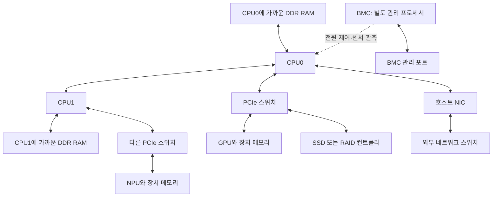

# 01. 서버 전체 지도 — 부품보다 먼저 데이터의 경로를 보기

[학습 안내](README.md) · 다음: [CPU·메모리·NUMA](02-cpu-memory-numa.md)

이 장을 마치면 서버 한 대를 연산, 저장, 연결, 관리, 전원·냉각이라는 다섯 관점으로 설명할 수 있어야 한다. 같은 장치도 어느 관점에서 보느냐에 따라 다른 이름과 번호가 붙는다는 점이 출발점이다.

## 1. 서버·노드·섀시·메인보드는 같은 물건인가?

**서버**는 서비스를 제공하는 컴퓨터를 가리키며, 물리 장비를 뜻할 때도 있고 소프트웨어 프로세스를 뜻할 때도 있다. 이 교재에서 서버는 물리 장비다. **노드**는 클러스터에서 구별하는 실행 단위다. 보통 물리 서버 한 대를 노드 하나로 운영하지만, 섀시 한 개에 여러 독립 노드가 들어가는 장비도 있다.

**섀시**는 보드, 전원, 팬, 디스크 등을 지지하고 공기 흐름을 만드는 구조물이다. **메인보드**는 CPU 소켓, 메모리 슬롯, 여러 연결 회로가 놓인 기판이다. 섀시가 크다고 CPU를 임의로 추가할 수 있는 것은 아니다. 보드의 소켓, 펌웨어 지원, 전원·냉각 설계가 함께 맞아야 한다.

랙에서 **1U는 높이 1.75인치, 약 44.45mm**를 뜻한다. 6U는 높이 범주다. GPU 여섯 장, CPU 여섯 개라는 뜻이 아니며 장착 가능한 카드 수를 직접 알려주지 않는다. 같은 높이라도 보드와 라이저 구성이 다르다. 랙 장비는 깊이, 무게, 레일, 케이블 여유도 맞아야 한다.

우리 노드는 **xFusion G6550 V8 6U 서버 안에 Furiosa RNGD와 NVIDIA GPU를 장착한 구성**이다. RNGD의 별칭인 Renegade만으로 서버 제조사나 후면 슬롯 번호를 정할 수 없다. [실제 장비 기록](../../npu/a7-expansion-plan-2026-09-21.md), [xFusion 제품 사양](https://www.xfusion.com/en/product/ai-servers/fusionserver-g6550-v8-ai).

## 2. 한 대의 서버 안에 있는 다섯 종류의 일

| 일 | 대표 부품 | 하는 역할 | 자주 하는 오해 |
|---|---|---|---|
| 연산·제어 | CPU, GPU, NPU | 프로그램을 실행하고 데이터를 계산 | GPU가 있으면 CPU는 필요 없다고 생각 |
| 작업 중 저장 | CPU 캐시, DDR RAM, GPU GDDR/HBM, NPU HBM/SRAM | 지금 계산할 데이터를 보관 | 모든 메모리를 합하면 하나의 큰 RAM이 된다고 생각 |
| 지속 저장 | SSD/HDD, 스토리지 컨트롤러 | 전원을 꺼도 파일·모델·OS를 보관 | NVMe를 RAM처럼 취급 |
| 연결 | PCIe, NIC, CPU 소켓 간 링크, 가속기 링크 | 부품과 서버 사이에 데이터 전달 | 커넥터가 같으면 속도·기능도 같다고 생각 |
| 관리·유지 | BMC, PSU, VRM, 팬, 센서 | 전원 공급, 상태 관측, 원격 관리 | OS가 정상 부팅되면 전원·냉각도 검증됐다고 생각 |

VRM은 보드에서 전압을 조절해 CPU/GPU 등에 공급하는 회로다. PSU가 서버로 전원을 보내고 VRM이 칩에 맞는 전압으로 조절한다. 팬과 방열판은 계산으로 발생한 열을 외부로 옮긴다. 연산 성능이 높아도 이 공급·배출 경로가 부족하면 클럭 제한이나 장애가 발생할 수 있다.

## 3. 기본 연결 그림

다음은 개념도이며 모든 서버가 같은 배선을 갖는다는 뜻은 아니다. A7의 정확한 SLOT 번호는 10장에서 다룬다.

그림에서 PCIe 스위치는 서버 내부의 장치를 연결한다. 외부 Ethernet/InfiniBand 스위치는 NIC와 다른 서버를 연결한다. 둘 다 스위치라고 부르지만 패킷 형식, 연결 대상, 배선과 설정이 다르다.

BMC는 OS와 별도인 관리 프로세서다. 호스트가 정지해도 대기 전원과 관리망이 있으면 전원 상태나 원격 콘솔을 제공할 수 있다. CPU가 수행하는 서비스 트래픽을 BMC 포트가 대신 처리하는 것은 아니다. BMC와 OS는 접속 주소·계정·업데이트 대상도 구분한다.

## 4. 모델 파일이 답변 토큰이 되기까지

일반적인 GPU/NPU 추론의 흐름을 순서대로 따라가 보자. 여기서는 호스트를 경유해 로딩하는 일반 경로를 예로 든다. GPUDirect Storage 같은 특수 경로가 자동 사용된다고 가정하지 않는다.

1. **SSD에 모델 파일이 저장**돼 있다. SSD 용량은 보관할 수 있는 파일의 크기를 결정한다.
2. **OS가 파일을 읽고 호스트 RAM에 준비**한다. 파일 캐시, 압축 해제, 형식 변환, 로딩 버퍼가 메모리를 사용할 수 있다.
3. **PCIe를 통해 장치 메모리로 가중치를 전송**한다. 이 단계에서는 호스트 메모리·PCIe·장치 메모리 중 느린 경로가 영향을 준다.
4. **CPU가 요청을 받고 입력을 준비**한다. 토큰화, 요청 큐, 배치 구성과 장치 작업 제출 등이 여기에 해당한다.
5. **GPU/NPU가 장치 메모리의 데이터를 읽으며 계산**한다. 장치 내부의 SRAM/캐시와 GDDR/HBM 사이 이동이 반복된다.
6. 여러 장으로 모델을 나눴다면 **장치 간 중간 결과를 통신**한다. 통신량과 경로는 병렬화 방식에 따라 달라진다.
7. 생성 결과를 호스트가 처리하고 **NIC를 통해 사용자에게 응답**한다.

모델을 장치 메모리에 올려 두는 일반적인 서빙에서는 매 토큰마다 모델 전체를 SSD에서 다시 읽지 않는다. 따라서 모델 최초 로딩이 느린 문제와 토큰 생성이 느린 문제는 다른 곳에서 원인을 찾아야 할 수 있다. 메모리 offload를 쓰면 이 흐름이 달라지므로 실제 설정도 확인한다.

가속기 연산과 데이터 이동을 함께 고려해야 한다는 기본 원칙은 [NVIDIA CUDA Best Practices의 이기종 처리 설명](https://docs.nvidia.com/cuda/cuda-c-best-practices-guide/index.html#heterogeneous-computing)에서도 다룬다. 이것이 모든 NPU가 CUDA를 사용한다는 뜻은 아니다.

## 5. 용량·대역폭·지연시간·처리량은 서로 다르다

| 지표 | 질문 | 단위 예 | 사례 |
|---|---|---|---|
| 용량 | 한 번에 얼마나 보관하는가? | GB, GiB | RAM 128GB, SSD 960GB |
| 대역폭 | 단위 시간에 얼마나 옮길 수 있는가? | GB/s, Gb/s | PCIe 링크, HBM, 100GbE |
| 지연시간 | 한 작업이 완료되기까지 얼마나 기다리는가? | ns, μs, ms | 메모리 접근, SSD 읽기, 요청 응답 |
| 처리량 | 단위 시간에 유용한 작업을 얼마나 끝내는가? | IOPS, requests/s, tokens/s | 디스크 랜덤 읽기, 모델 서빙 |
| 연산 성능 | 수학 연산을 얼마나 수행하는가? | FLOP/s, TOPS | 정밀도·연산 종류가 지정된 칩 성능 |

고속도로에 비유하면 용량은 주차 공간, 대역폭은 도로가 처리하는 이동량, 지연시간은 한 차량의 도착 시간에 가깝다. 비유만으로는 동시 요청, 큐와 공유 링크를 설명하기 어렵기 때문에 실제 계산에서는 단위를 사용한다.

큰 RAM으로 바꿔도 채널 수와 속도가 같으면 메모리 대역폭이 그대로일 수 있다. 넓은 대역폭의 SSD도 작은 동기식 요청 하나의 지연시간은 별도 특성이다. 서버 전체 성능을 큰 숫자 하나로 비교하기 어려운 이유다.

## 6. 꼭 구분할 단위

- **b는 bit, B는 byte**이며 1byte = 8bits다. 100Gb/s = 12.5GB/s이다. 실제 애플리케이션 전송률은 헤더와 처리 비용 등을 제외하므로 이보다 낮아질 수 있다.
- **GB는 10⁹bytes, GiB는 2³⁰bytes**다. 제조사 960GB 드라이브가 OS에서 약 894GiB로 보이는 것은 일부가 사라졌다는 뜻이 아니다. RAID 메타데이터와 파일시스템 공간은 이 단위 차이와 별개의 문제다.
- **MT/s는 초당 전송 횟수, GT/s는 그 10⁹배 단위**다. 메모리 버스 폭이나 PCIe 인코딩을 고려하기 전에는 곧바로 GB/s로 바꿀 수 없다.
- **x8/x16은 PCIe 링크의 레인 수**다. 속도 세대가 함께 있어야 대역폭을 계산할 수 있다.
- **W는 순간 전력, Wh/kWh는 시간에 걸친 에너지**다. 1kW를 한 시간 사용하면 1kWh다.
- **양방향 합산과 한 방향을 구분**한다. 송신 10GB/s + 수신 10GB/s를 20GB/s라고 표기한 값은 한 방향 20GB/s라는 뜻이 아니다.

계산 예: 압축되지 않은 20GB 데이터를 100Gb/s 경로로 한 방향 전송한다면, 헤더·저장장치·CPU·혼잡을 모두 무시한 최저 전송 시간은 `20GB ÷ 12.5GB/s = 1.6초`다. 실측이 2초라고 해서 바로 카드가 불량인 것은 아니다. 기대값의 전제가 현실에 맞는지 먼저 본다.

## 7. 성능은 경로의 공유 자원과 직렬 구간에서 제한된다

서로 다른 구간을 차례로 통과하면 지연시간이 더해진다. 충분히 겹쳐 실행되는 파이프라인의 지속 처리량은 느린 구간에 제한된다. 모든 경우를 단순히 각 대역폭의 최솟값 하나로 정확히 예측할 수는 없지만, 불가능한 성능 기대를 거르는 데는 유용하다.

예를 들어 SSD에서 초당 5GB를 읽고, PCIe로 초당 20GB를 보낼 수 있어도 처음 읽는 파일의 지속 로딩을 초당 20GB로 만들 수는 없다. 반대로 데이터가 이미 장치 HBM 안에 있다면 SSD 속도는 그 연산의 매 단계에 직접 개입하지 않을 수 있다.

**동시에 사용되는 경로**도 본다. PCIe 스위치 아래 GPU 두 장과 NVMe가 있고 모두 CPU 메모리로 전송하면 상위 링크를 나눠 쓴다. 그 순간에는 개별 카드의 링크 속도만 봐서는 총량을 설명할 수 없다. 03장에서 실제 A7 스위치를 계산한다.

전체 작업 시간 중 일부만 가속되는 경우도 있다. 원래 100초 중 CPU 전처리가 20초, 가속기 계산이 80초라면 계산 부분이 두 배 빨라져도 전체는 `20 + 80/2 = 60초`다. 통신과 대기가 그대로라면 GPU를 두 배로 늘렸다는 이유로 전체가 두 배 빨라지지 않는다. [CUDA Best Practices의 Amdahl 설명](https://docs.nvidia.com/cuda/cuda-c-best-practices-guide/index.html#strong-scaling-and-amdahl-s-law).

## 8. 장비를 식별하는 네 단계

| 단계 | 확인 예 | 이 정보만으로는 모르는 것 |
|---|---|---|
| 제품군 | Blackwell, RNGD, ConnectX | 정확한 카드 형상·메모리·인터커넥트 |
| 정확한 제품/P/N | RTX PRO 6000 Blackwell Server Edition, NIC 주문 코드 | 현재 슬롯과 펌웨어 설정 |
| 실제 장착·연결 | SLOT2, PCI BDF, NUMA, MAC, 포트 | 현재 성능·오류 여부 |
| 동작 상태·설정 | 링크 폭, RAID 레벨, 전력 제한, 센서 | 부하를 걸었을 때의 안정성·성능 |

제품 이름이 같아도 Server/Workstation, 공랭/수랭, 표준 PCIe/OCP, 단일/듀얼 포트 옵션이 달라질 수 있다. 소켓, 슬롯 번호, OS 장치 번호는 서로 대체할 수 없다. 장치 이동 뒤에는 `npu0` 같은 순서 번호가 바뀔 수 있어 내부 시리얼 매핑을 따로 유지한다.

공개 RUNBOOK에는 내부 접속 주소나 실제 시리얼을 옮기지 않는다. A7 문서에서는 NPU를 CARD-A/B/C/D로 구분하고, 실제 이전 때는 내부 기록과 대조한다.

## 9. 네 가지 질문으로 증설 판단 시작하기

새 카드를 살 때 아래 순서로 질문하면 “PCIe에 꽂히니까 된다”라는 판단에서 벗어날 수 있다.

1. **어떤 일을 더 잘하고 싶은가?** 모델이 메모리에 안 들어가는지, 처리량이 부족한지, 네트워크가 느린지 구분한다.
2. **어느 자원이 부족하다는 근거가 있는가?** 사용량, 실제 지연, 오류, 링크와 토폴로지를 확인한다.
3. **카드를 넣으면 새로 어디를 공유하게 되는가?** CPU 메모리 채널, PCIe 상위 링크, 네트워크 업링크, PSU와 냉각을 본다.
4. **누가 그 조합을 지원하며 무엇으로 검증하는가?** OEM BOM, 드라이버/SDK, 실제 모델과 부하 조건을 함께 확인한다.

이 질문에 필요한 개념을 이후 장에서 하나씩 다룬다. 현재 GPU를 더 사는 안도 10장에서 이 순서로 다시 검토한다.

## 연습 문제와 해설

**문제 1.** 6U 서버라는 정보만으로 GPU 6장을 넣을 수 있다고 판단할 수 있는가?

**해설:** 없다. U는 높이이고, 실제 카드 개수는 보드·라이저·공간·전원·냉각·OEM 지원의 조합으로 결정된다.

**문제 2.** 100Gb/s NIC가 있고 응용프로그램이 6GB/s를 전송했다. 정격의 6%인가?

**해설:** 아니다. 한 방향 이론 기준은 12.5GB/s이므로 48%에 해당한다. 어디서 측정했는지와 헤더·프로토콜·저장장치·PCIe 등의 제한을 더 확인해야 한다.

**문제 3.** GPU의 연산 부분이 전체 실행의 90%이고 이를 열 배 빠르게 만들었다. 전체가 열 배 빨라지는가?

**해설:** 다른 비용이 일정하다고 가정하면 상대 시간은 `0.1 + 0.9/10 = 0.19`, 속도 향상은 약 5.26배다. 실제 병렬화에서 통신 비용이 늘면 더 낮을 수 있다.

**문제 4.** 모델 최초 로딩은 느리지만 로딩 후 토큰 생성은 충분히 빠르다. HBM을 탓하기 전에 어떤 경로를 보는가?

**해설:** 파일이 있는 스토리지/원격 파일시스템, 호스트 파일 캐시·RAM, 변환·압축 해제, 장치 전송 경로를 본다. 최초 로딩과 반복 추론의 데이터 경로를 따로 그린다.

[학습 안내](README.md) · 다음: [02. CPU·메모리·NUMA](02-cpu-memory-numa.md)
