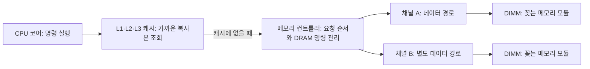
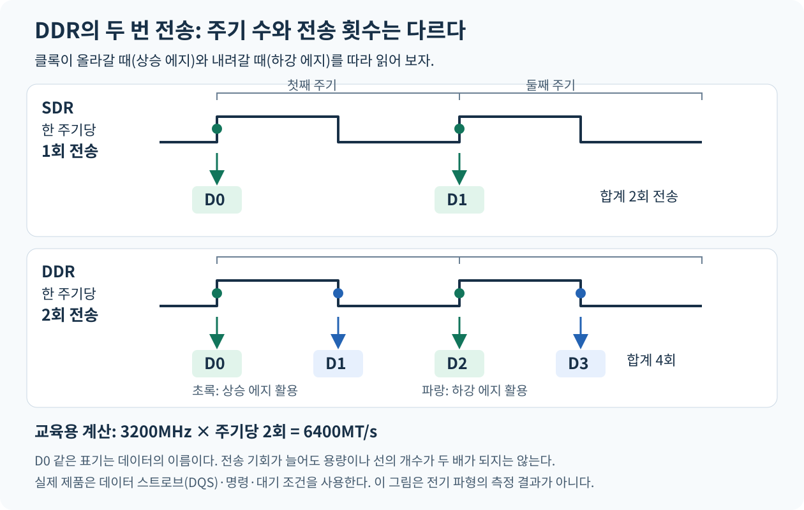
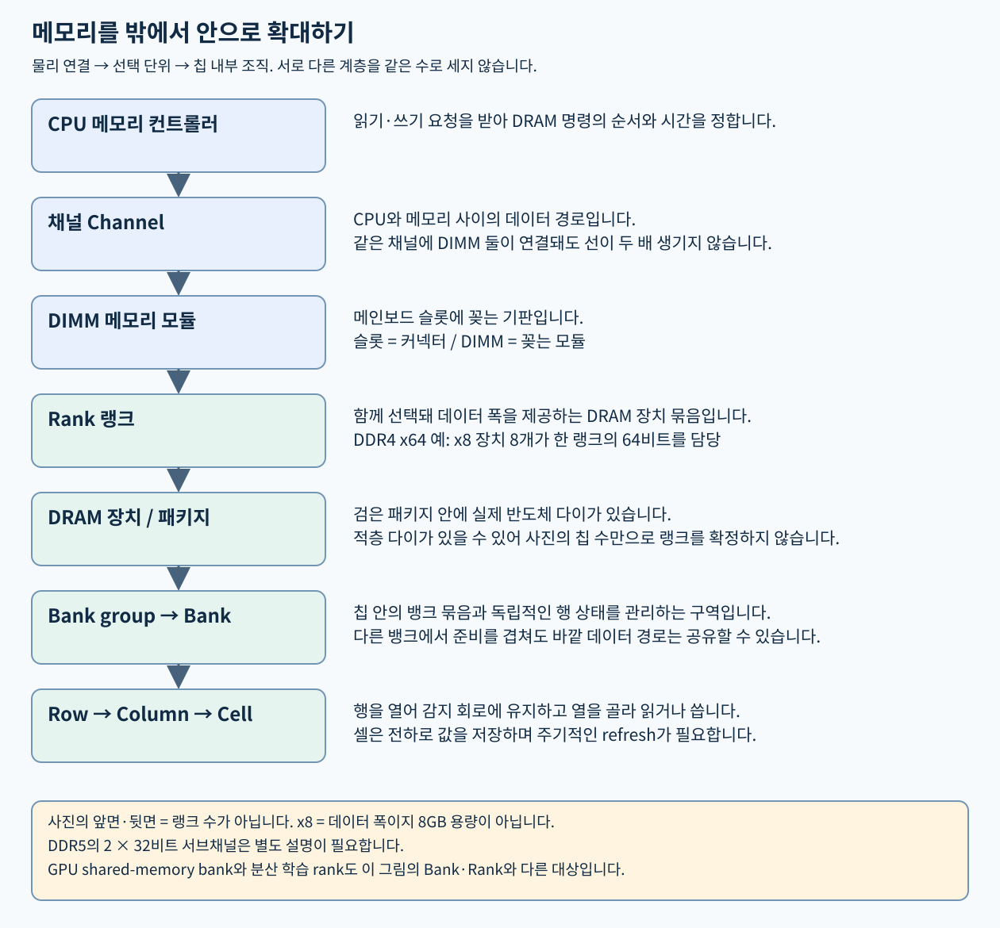
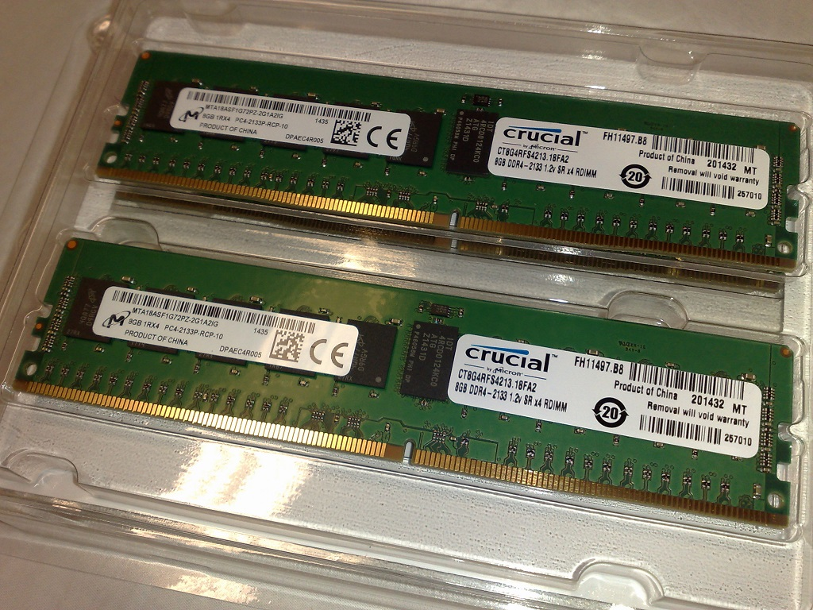
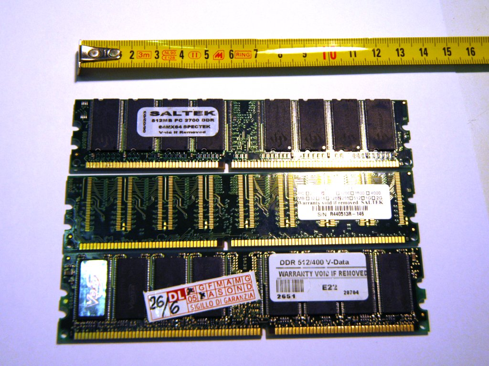
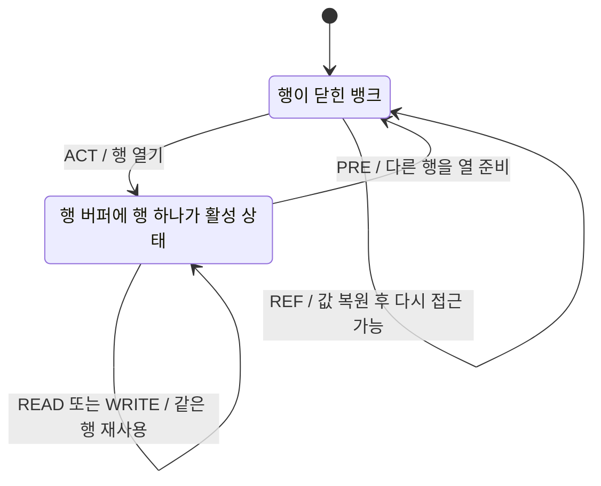
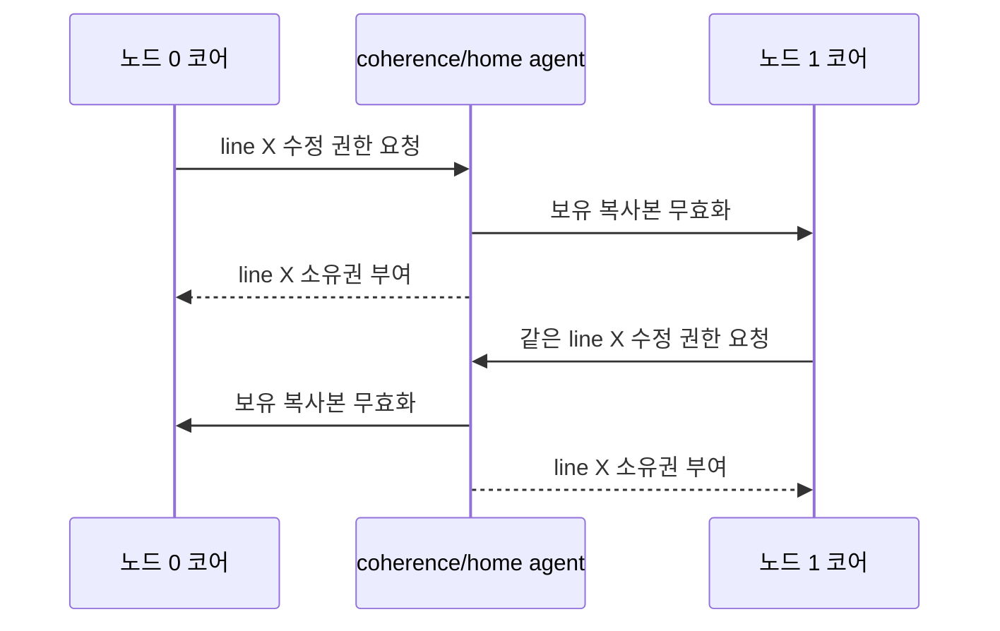

# 02. CPU·메모리·NUMA: 계산하는 장치와 데이터를 놓는 자리

[학습 목차](README.md) · [이전: 서버 전체 지도](01-system-map.md) · [다음: PCIe](03-pcie-slots-switches.md)

CPU가 빠른데도 작업이 느릴 수 있다. 계산할 숫자가 도착하기를 기다리는 시간이 길면 계산 장치가 많아도 도움이 작기 때문이다. 이 장에서는 **계산 자원**, **메모리 용량**, **데이터 이동 속도**, **접근 지연**을 각각 분리해서 배운다. 처음에는 일반적인 컴퓨터로 원리를 설명하고, 뒤에서 실제 서버의 구성표를 읽는다.

실측 사례에 등장하는 **A7은 NetAI 연구실에서 특정 서버 한 대를 부르는 내부 식별명**이다. CPU 제품명, GPU 세대, 메모리 규격이 아니다. 사례 수치는 [2026-09-21 작업일지](../../npu/a7-expansion-plan-2026-09-21.md)의 당시 관측이며 지금의 상태나 성능을 보장하지 않는다. A7을 모른 채 시작해도 기본 원리를 이해할 수 있다.

## 먼저 알아둘 말: 저장 위치와 이동 경로

**CPU(Central Processing Unit, 중앙처리장치)**는 프로그램의 명령을 실행하는 장치다. **RAM(Random Access Memory, 임의 접근 메모리)**은 작업 중인 명령과 데이터를 보관하는 주메모리다. 여기서 임의 접근은 원하는 주소를 지정해 읽는다는 뜻이며, 임의의 값이 나온다는 뜻이 아니다. 일반적인 서버의 RAM에는 **DRAM(Dynamic Random Access Memory)** 칩을 사용한다. DRAM은 전하로 비트를 저장하고 주기적으로 값을 복원하는 메모리다. **DDR(Double Data Rate)**은 이런 메모리에서 한 클록 주기에 두 번 데이터를 전달하는 전송 기술 계열이다. 클록과 전송률은 4절에서 그림으로 풀어낸다.

**주소(address)**는 데이터를 찾는 데 쓰는 번호다. **컨트롤러(controller, 제어기)**는 요청을 받아 장치가 실행할 명령과 순서를 정하는 회로다. 메모리 컨트롤러는 CPU의 읽기 요청을 DRAM이 이해하는 명령으로 바꾼다. **버스(bus)**는 데이터나 제어 신호가 오가는 연결을 부르는 말이고, **데이터 폭(data width)**은 한 번의 전송에서 나란히 전달하는 비트 수다. **캐시(cache)**는 반복해서 쓸 가능성이 있는 데이터를 가까운 곳에 보관해 먼 메모리로 가는 횟수를 줄이는 작은 고속 저장 공간이다.

이 장에서 계속 던질 질문은 네 가지다. **누가 계산하는가, 데이터는 어디 있는가, 어느 경로를 공유하는가, 왜 기다리는가?** **DIMM은 슬롯에 꽂는 모듈**, **Rank는 함께 선택되는 메모리 칩 묶음**, **Bank는 칩 안에서 행 상태를 관리하는 구역**이다. 아래에서 위치와 동작을 확대해 배운다.

## 1. 한눈에 보는 데이터 경로

```text
CPU 코어 → L1 캐시 → L2 캐시 → L3 캐시 → 메모리 컨트롤러
                                                ├─ 메모리 채널 A → 메모리 모듈
                                                └─ 메모리 채널 B → 메모리 모듈
CPU가 둘이면 소켓 간 연결을 통해 다른 CPU 쪽 메모리에 접근할 수도 있다.
```

이 그림은 연결 관계를 배우는 개념도다. 실제 요청은 각 계층에서 필요한 값이 있는지 확인하고, 없을 때 더 먼 계층으로 간다. 캐시의 공유 범위와 연결 구조는 CPU 모델에 따라 다르다. L3를 소켓 전체에서 모든 코어가 언제나 같은 지연으로 접근한다고 해석하지 않는다.



화살표는 읽기 요청이 진행할 수 있는 방향이다. 반환 데이터는 반대 방향으로 온다. 아래 캐시 예제는 CPU가 주소를 이미 변환했거나 필요한 변환을 함께 처리한다고 단순화한다. 실제 CPU에서는 주소 변환과 캐시 조회 일부가 겹칠 수 있다.

## 2. CPU 숫자를 읽는 순서

| 용어 | 뜻 | 두 CPU를 가진 서버의 예 |
|---|---|---|
| 소켓(socket) | 메인보드에 프로세서를 장착하는 자리 | CPU가 두 자리 모두에 장착됐다고 가정 |
| 코어(core) | 명령을 실행하는 물리 계산 단위 | CPU당 32개라면 전체 64개 |
| 하드웨어 스레드 | 한 코어가 OS에 제공하는 실행 문맥 | 코어당 둘이면 CPU당 64개 |
| 논리 CPU | OS가 실행할 스레드에 배정하는 CPU 번호 단위 | 전체 128개. 물리 코어 128개라는 뜻이 아님 |
| 명령 집합(ISA) | CPU가 이해하는 명령의 약속 | 같은 x86-64 계열이어도 확장 명령 지원은 모델별로 확인 |
| 클럭 | 초당 동작 주기의 표시 | 코어 수나 작업당 처리량과 동일한 수치가 아님 |

두 하드웨어 스레드가 한 코어의 실행 자원을 나눠 쓸 수 있다. 그래서 논리 CPU 수가 두 배여도 처리량이 정확히 두 배가 되지는 않는다. 프로그램이 사용할 수 있는 명령도 단지 “x86-64”라는 이름만으로 정하지 말고, 필요한 ISA 확장과 운영체제·컴파일 결과를 함께 확인한다.

캐시는 CPU 안쪽의 작은 고속 저장 공간이다. 보통 L1이 코어에 가장 가깝고, L2와 L3는 더 큰 용량을 제공한다. 캐시에 필요한 데이터가 있으면 DRAM(동적 임의 접근 메모리)까지 왕복하지 않아도 된다. 캐시 미스가 많으면 코어가 많아도 메모리 지연·대역폭의 영향을 크게 받는다. **캐시 크기와 RAM 용량을 합쳐 사용 가능 메모리로 계산하지 않는다.**

### toy ISA 실행 추적: PC, register, load/store

00장에서 본 **교육용 명령 집합(toy ISA)**을 더 자세히 보자. 명령 집합은 CPU가 알아듣는 명령과 그 의미의 약속이다. 실제 CPU는 **파이프라인(pipeline)**으로 여러 명령의 서로 다른 처리 단계를 겹치고, **비순차 실행(out-of-order execution)**으로 준비가 된 명령을 먼저 처리하기도 한다. 아래에서는 한 명령이 끝난 뒤 다음 명령을 실행하는 단순 모델을 사용한다. 표의 한 행이 실제 CPU의 한 클록이라고 가정하지 않는다.

초기 상태는 다음과 같다.

```text
PC = 100
R1 = 0
R2 = 0
메모리[100] = LOAD R1, [1000]
메모리[101] = LOAD R2, [1008]
메모리[102] = ADD R1, R2
메모리[103] = STORE R1, [1016]
메모리[104] = HALT
메모리[1000] = 7
메모리[1008] = 5
메모리[1016] = 0
```

| 단계 | PC가 가리킨 명령 | 실행 전 주요 상태 | 실행 뒤 주요 상태 | 해설 |
|---:|---|---|---|---|
| 1 | `LOAD R1, [1000]` | `R1=0` | `R1=7`, `PC=101` | 주소 1000의 데이터를 레지스터로 가져온다 |
| 2 | `LOAD R2, [1008]` | `R2=0` | `R2=5`, `PC=102` | 두 번째 피연산자를 가져온다 |
| 3 | `ADD R1, R2` | `R1=7`, `R2=5` | `R1=12`, `PC=103` | 산술논리장치가 레지스터 값을 더한다 |
| 4 | `STORE R1, [1016]` | `R1=12`, `메모리[1016]=0` | `메모리[1016]=12`, `PC=104` | 결과를 메모리에 쓴다 |
| 5 | `HALT` | `PC=104` | 종료 | 실행을 멈춘다 |

**PC(Program Counter)**는 다음 명령 주소를 담는 레지스터다. 쉬운 뜻은 “책갈피”다. 왜 필요할까? CPU가 어느 명령을 실행해야 하는지 기억해야 한다. 기작은 fetch 단계에서 PC 주소의 명령을 읽고, 보통 다음 주소로 증가시키거나 branch가 새 주소로 바꾸는 것이다. 책갈피 비유의 한계는 현대 CPU가 여러 명령을 미리 가져오고 예측 실행할 수 있다는 점이다.

**레지스터(register)**는 CPU 안의 작은 저장소다. 쉬운 뜻은 “계산대 바로 위에 놓인 숫자 칸”이다. 왜 필요할까? ALU가 매번 DRAM에 가지 않고 가까운 값으로 계산해야 한다. 기작은 명령이 어떤 레지스터를 읽고 쓸지 ISA가 정하고, CPU가 그 값을 내부 회로에 전달하는 것이다. 비유의 한계는 실제 CPU에는 물리 레지스터 renaming, reorder buffer, vector register 같은 더 복잡한 구조가 있다는 점이다.

**load/store**는 메모리와 레지스터 사이를 옮기는 명령 종류다. 왜 필요할까? 대부분의 산술 명령은 레지스터에서 빠르게 계산하고, 메모리는 load/store로 드나든다. 기작은 주소 생성, 캐시/TLB 조회, 권한 검사, 데이터 반환 또는 쓰기 큐 반영으로 이어진다. 단순 “읽기/쓰기” 비유의 한계는 캐시와 store buffer 때문에 다른 코어가 보는 시점이 바로 같지 않을 수 있다는 점이다.

### 캐시 hit/miss와 지역성

**캐시 히트(cache hit)**는 CPU가 찾는 데이터가 캐시에 있는 경우다. 쉬운 뜻은 “책상 위에 이미 있다”다. 왜 필요할까? 가까운 캐시에서 받으면 DRAM보다 훨씬 빨리 계산을 계속할 수 있다. 기작은 주소 일부로 cache set을 찾고, tag가 맞는 cache line을 선택하는 방식이다. 책상 비유의 한계는 캐시가 보통 한 바이트가 아니라 **캐시 라인(cache line)** 단위로 움직이고, 여러 코어의 복사본을 일관되게 관리해야 한다는 점이다.

**캐시 미스(cache miss)**는 필요한 데이터가 해당 캐시에 없어 더 아래 계층으로 내려가는 경우다. 쉬운 뜻은 “책상에 없어 서랍이나 창고를 찾는 일”이다. 왜 필요할까? 캐시가 작기 때문에 모든 데이터를 담을 수 없다. 기작은 L1 미스가 L2, L3, DRAM, 때로는 리모트 NUMA 메모리까지 요청을 보내는 것이다.

**지역성(locality)**은 프로그램이 가까운 시간이나 가까운 주소의 데이터를 반복해서 쓰는 경향이다. 시간 지역성은 같은 값을 곧 다시 쓰는 성질이고, 공간 지역성은 가까운 주소를 함께 쓰는 성질이다. 왜 필요할까? 캐시는 지역성이 있어야 효과가 크다. 배열을 순서대로 읽으면 한 캐시 라인에 들어온 여러 값이 이어서 쓰일 수 있지만, 연결 리스트를 무작위 주소로 따라가면 매번 미스가 날 수 있다.

AMAT(Average Memory Access Time, 평균 메모리 접근 시간)는 캐시 효과를 종이에서 감 잡는 계산이다.

```text
조건:
  L1 hit time = 1ns
  L1 miss rate = 5%
  L1 miss penalty = 80ns

AMAT = hit time + miss rate × miss penalty
     = 1ns + 0.05 × 80ns
     = 5ns
```

미스율이 5%뿐이어도 평균 접근 시간이 1ns에서 5ns로 늘었다. 미스율이 20%라면 `1 + 0.20 × 80 = 17ns`다. 이 계산은 단순화된 평균이다. 실제 CPU는 여러 미스를 겹치고, prefetch를 사용하고, out-of-order 실행으로 일부 대기를 숨길 수 있다. 그래도 “캐시 미스가 조금만 늘어도 코어가 기다릴 수 있다”는 감각을 주는 데 유용하다.

### 왜 코어가 놀고 있을까

CPU가 더할 숫자를 기다리는 동안 코어의 산술 장치는 일을 못 할 수 있다. 숫자가 L1 캐시에 있으면 가까운 곳에서 받고, L3에만 있으면 더 먼 캐시를, 캐시에도 없으면 DRAM을 찾는다. 그 DRAM이 다른 소켓에 있으면 소켓 간 경로도 지난다. 데이터가 연속되어 있으면 미리 가져오기와 캐시 활용이 쉬울 수 있지만, 불규칙한 주소를 한 번씩 방문하면 지연이 지배적일 수 있다.

따라서 두 작업을 구분한다. **많은 데이터를 순서대로 읽는 작업**은 초당 옮길 수 있는 양, 즉 대역폭의 영향을 크게 받는다. **작은 데이터를 무작위로 따라가는 작업**은 각 요청의 도착 시간, 즉 지연의 영향을 크게 받는다. 코어 64개라는 숫자 하나로 두 작업의 성능을 설명할 수 없다. 이 구분은 실제 CPU 캐시 미스·메모리 트래픽 측정으로 검증해야 한다.

SMT(동시 멀티스레딩)는 한 코어가 둘 이상의 하드웨어 스레드를 실행하게 한다. 한 스레드가 기다리는 사이 다른 스레드가 일부 실행 자원을 사용할 수 있지만, 같은 코어의 자원 경쟁도 생긴다. SMT의 이득은 프로그램에 따라 달라지며, **논리 CPU 128개를 물리 코어 128개의 독립 성능으로 계산하지 않는다.**

## 3. 가상 주소, 물리 주소, TLB

프로그램이 보는 주소와 DRAM 칩의 실제 위치는 같은 것이 아니다. **가상 주소(virtual address)**는 프로세스가 사용하는 주소다. 쉬운 뜻은 “프로그램마다 받은 자기만의 주소표”다. 왜 필요할까? 각 프로세스가 자기 메모리를 0번지부터 가진 것처럼 보이게 하고, 서로의 메모리를 함부로 읽지 못하게 하며, 실제 RAM보다 큰 주소 공간을 관리하기 위해서다. 기작은 CPU의 **MMU(Memory Management Unit, 주소 변환과 접근 권한을 다루는 회로)**와 운영체제의 페이지 테이블이 가상 주소를 물리 주소로 변환하는 것이다. **페이지 테이블(page table)**은 그 변환 정보와 권한을 저장하는 자료 구조다. 비유의 한계는 주소표가 단순 사전 하나가 아니라 다단계 페이지 테이블, 권한 비트, 캐시, **huge page(기본 크기보다 큰 메모리 관리 페이지)**, NUMA 정책과 엮인다는 점이다.

**물리 주소(physical address)**는 CPU와 메모리 컨트롤러가 실제 RAM 위치를 식별하는 주소다. 쉬운 뜻은 “건물 안 실제 방 번호”다. 왜 필요할까? 전기 신호는 결국 실제 메모리 채널, DIMM, rank, bank, row, column으로 가야 한다. 기작은 CPU가 변환된 물리 주소를 캐시와 메모리 컨트롤러에 전달하고, 컨트롤러가 DRAM 명령으로 바꾸는 것이다.

**TLB(Translation Lookaside Buffer)**는 최근 가상 주소와 물리 주소의 변환 결과를 저장하는 작은 캐시다. 쉬운 뜻은 “주소 번역 캐시”다. 왜 필요할까? 모든 **load/store(메모리 읽기·쓰기 명령)**마다 페이지 테이블을 여러 단계 읽으면 너무 느리다. 기작은 가상 페이지 번호를 넣어 물리 페이지 번호와 권한을 빠르게 찾고, 없으면 **page walk(페이지 테이블의 단계를 따라가며 변환을 찾는 작업)**로 페이지 테이블을 읽는 것이다. Intel의 설명도 TLB가 선형/가상 주소에서 물리 주소로의 변환을 캐시해 page-table walk 비용을 줄인다고 설명한다. [Intel TLB explanation](https://www.intel.com/content/www/us/en/developer/articles/technical/software-security-guidance/technical-documentation/machine-check-error-avoidance-on-page-size-change.html).

추적 예를 보자.

```text
가정:
  페이지 크기 = 4KiB = 4096B
  가상 주소 = 0x0000_1234
  가상 페이지 번호 = 0x1, 페이지 안 offset = 0x234
  페이지 테이블: 가상 페이지 0x1 -> 물리 페이지 0xABC

물리 주소 = 물리 페이지 0xABC + offset 0x234
          = 0xABC234
```

TLB hit이면 이 변환을 빠르게 얻는다. TLB miss이면 페이지 테이블을 읽어 변환을 찾고 TLB에 채운다. 페이지 테이블에도 유효한 항목이 없으면 page fault가 발생하고 운영체제가 새 페이지를 할당하거나 파일에서 읽거나 오류를 낸다. 따라서 “메모리 접근이 느리다”는 말에는 캐시 미스뿐 아니라 TLB miss도 포함될 수 있다.

## 4. RAM의 세 가지 질문: 얼마나, 얼마나 빨리, 얼마나 늦게

| 질문 | 지표 | 예시 | 혼동하면 생기는 오류 |
|---|---|---|---|
| 얼마나 담는가? | 용량(capacity) | 64GB DIMM × 2 | 128GB면 모든 작업의 전송이 빠르다고 생각함 |
| 초당 얼마나 옮기는가? | 대역폭(bandwidth) | 채널당 이론 51.2GB/s | 최대치가 실측 애플리케이션 속도라고 생각함 |
| 요청 뒤 언제 받는가? | 지연(latency) | 메모리 접근 시간 | 채널을 늘리면 지연도 같은 비율로 줄어든다고 생각함 |

**GB**는 10진 단위로 1GB = 10억 바이트다. **GiB**는 2진 단위로 1GiB = 2³⁰바이트다. 예를 들어 정확히 128,000,000,000바이트라면 약 119.2GiB다. 그러나 서버 DIMM의 64GB라는 표시를 곧바로 이 바이트 수로 가정하지 않는다. A7 작업일지는 **64GB × 2 장착**과 **OS 표시 약 125GiB**를 별도로 기록했다. 정확한 환산에는 모듈의 바이트 단위 용량과 OS가 예약한 영역을 확인해야 한다.

### DDR부터 읽기: 저장 방식, 전송 규격, 모듈 형태는 다르다

가게에서 “DDR5 32GB RAM”이라고 쓰인 제품을 봤다고 하자. 이 문장에는 서로 다른 정보가 겹쳐 있다.

- **RAM(Random Access Memory)**은 주소를 지정해 읽고 쓰는 메모리를 가리키는 말이다. 일상적인 컴퓨터 사양에서는 주로 작업용 주메모리를 뜻한다.
- **DRAM(Dynamic Random Access Memory)**은 전하로 비트를 저장하고 주기적으로 복원하는 기술이다. 일반적인 DDR 주메모리는 전원이 꺼지면 작업 내용을 유지하지 못한다. 파일을 보존하는 SSD와 역할이 다르다.
- **DDR(Double Data Rate)**은 클록에 맞춰 데이터를 주고받는 **동기식 DRAM**의 전송 기술 계열이다. “무엇에 비트를 저장하나?”보다 “어떤 타이밍과 규격으로 데이터를 주고받나?”에 해당한다.
- **DDR5**의 5는 그 전송 규격의 세대다. **32GB**는 저장 용량 표시다. “5GB 메모리”, “DDR4보다 정확히 다섯 배 빠름”이라는 뜻이 아니다.
- **DIMM(Dual In-line Memory Module)**은 여러 메모리 칩을 올려 슬롯에 꽂는 모듈 기판이다. DDR은 전송 기술, DIMM은 부품 형태이므로 두 이름을 같은 종류로 비교하지 않는다.

**클록(clock)**은 회로가 동작 타이밍을 맞출 때 쓰는 반복 신호다. 낮은 값에서 높은 값으로 바뀌는 순간을 **상승 에지(rising edge)**, 높은 값에서 낮은 값으로 바뀌는 순간을 **하강 에지(falling edge)**라고 한다. 낮음→높음→낮음의 한 반복이 **주기(cycle)**다. **Hz(헤르츠)**는 초당 주기 수이고, **MHz**는 초당 백만 주기다. 이것이 CPU의 실행 속도와 항상 같은 클록이라는 뜻은 아니다.

**SDR(Single Data Rate, 단일 데이터 전송률)**의 기본 원리는 한 주기에 한 번, **DDR**의 기본 원리는 양쪽 에지를 활용해 한 주기에 두 번 데이터를 전달하는 것이다. 한 번에 64비트를 보내는 경로라면 64비트를 두 번 보내는 것이며, 선의 개수가 갑자기 128개로 늘어나는 것은 아니다. 같은 기준 클록에서 전송 기회를 늘리는 방식이다.



그림의 D0·D1·D2·D3는 서로 다른 데이터 전송의 이름이다. 실제 제품의 전기 신호를 측정한 그림이 아니며, 명령 처리나 대기가 없는 데이터 전송 구간을 단순화했다. 실제 DDR 인터페이스에서는 **데이터 스트로브(data strobe, DQS)**라는 타이밍 신호도 사용한다. 이 그림을 메인보드의 클록 선과 데이터 선 사이의 정확한 위상·파형으로 해석하지 않는다.

**전송률(transfer rate)**의 **MT/s**는 초당 백만 번의 전송이다. 예를 들어 교육용 계산에서 기준 클록이 3200MHz라면 DDR의 데이터 전송률은 `3200 × 2 = 6400MT/s`다. 이것이 **DDR5-6400**의 6400을 읽는 방식이다. 6400MHz CPU, 6400MB/s의 프로그램 처리량, 6400GB의 용량을 뜻하지 않는다. DRAM 내부의 모든 회로가 이 전송률과 같은 주파수로 동작한다는 뜻도 아니다. [Micron의 모듈 표기표](https://my.micron.com/content/dam/micron/global/public/products/part-numbering-guide/numsdrammod.pdf)는 DDR5-6400을 모듈 클록 3200MHz와 전송률 6400MT/s로 구별한다.

64비트 **사용자 데이터 폭**의 경로에서 최대 전송 구간을 가정하면 `6400 × 10⁶전송/s × 64비트 ÷ 8 = 51.2GB/s`다. 실제 작업에서는 행을 여는 시간, 명령·대기·접근 패턴·공유 경로가 추가된다. “DDR5-6400이니 어느 프로그램에서나 51.2GB/s가 나온다”는 결론은 성립하지 않는다. 아래에서 그 대기가 생기는 위치를 배운다.

### DDR1·DDR2·DDR3·DDR4·DDR5: 세대가 바뀌면 무엇이 달라질까?

처음의 DDR을 DDR1이라고 부르기도 한다. 이후 세대는 지원 전송률, 신호·전력 조건, 칩 내부 조직과 명령 규칙을 발전시켰다. DDR5에서는 모듈 내부 데이터 경로를 서브채널로 나누는 변화도 있으며 뒤에서 구조를 확대한다. 세대 숫자는 용량과 별개이고, 숫자가 두 배라고 실제 프로그램의 성능도 두 배라는 뜻은 아니다.

**DDR4 슬롯에 DDR5 모듈을 꽂아 업그레이드하는 식으로 교체할 수 없다.** 세대별 접점·홈 위치, 전기적 규격, CPU 메모리 컨트롤러와 메인보드의 지원이 다르기 때문이다. 같은 DDR5라도 지원 모듈 종류·용량·속도·장착 수를 확인해야 한다. “길이가 비슷해 보인다”, “DDR5라고 쓰여 있다”만으로 서버 호환성이 정해지지 않는다. [Kingston의 DDR 세대·호환성 설명](https://www.kingston.com/unitedkingdom/en/blog/pc-performance/ddr-memory-generation-differences).

다음은 뜻을 읽는 교육용 라벨이며 실제 상품의 지원 사양을 대신하지 않는다.

| `DDR5-6400 32GB 2Rx8 ECC RDIMM`의 부분 | 뜻 | 이것만으로 알 수 없는 것 |
| --- | --- | --- |
| DDR5 | 메모리 전송 규격의 세대 | 내 메인보드의 지원 여부 |
| 6400 | 표시 전송률, 6400MT/s | 현재 설정 속도·프로그램의 실제 대역폭 |
| 32GB | 모듈의 표시 용량 | 메모리 지연·채널 수 |
| 2R | 함께 선택하는 칩 묶음인 랭크가 두 개 | 모듈 앞뒤 면 수·독립 채널 수 |
| x8 | DRAM 장치 하나의 데이터 입출력 폭이 8비트 | 칩의 저장 용량·PCIe 레인 수 |
| ECC | 오류 검출·정정을 위한 여분의 정보를 사용하는 방식 | 모든 고장 복구·전체 시스템 지원 |
| RDIMM | 명령·주소 신호를 중간 회로로 완충하는 모듈 종류 | 다른 DIMM 종류와의 혼용 가능 여부 |

### UDIMM·RDIMM·SO-DIMM·LPDDR도 DDR의 세대 이름일까?

| 이름 | 무엇을 구별하는 말인가? | 흔한 사용 맥락과 주의점 |
| --- | --- | --- |
| UDIMM(Unbuffered DIMM) | 명령·주소 신호를 등록 회로로 완충하지 않는 DIMM 종류 | 일반 데스크톱 등; UDIMM이라는 말만으로 ECC 유무를 확정하지 않음 |
| RDIMM(Registered DIMM) | 명령·주소 신호를 등록·완충하는 회로를 가진 DIMM 종류 | 서버 등; UDIMM과의 혼용·교체는 플랫폼 지원 없이 가정하지 않음 |
| SO-DIMM(Small Outline DIMM) | 더 작은 모듈 형태 | 노트북·소형 시스템 등; DDR 세대·핀 규격도 따로 확인 |
| LPDDR(Low Power DDR) | 저전력 기기용으로 설계된 별도 메모리 규격 계열 | 휴대전화·노트북 등; 일반 DDR DIMM 슬롯의 교체품이 아님 |

노트북 메모리가 모두 SO-DIMM인 것도 아니다. 기판에 직접 납땜한 메모리는 모듈을 뽑아 교체하는 방식과 다르다. 부품 종류와 전력·공간 요구에 따라 실제 장착 형태가 달라진다. [Kingston의 메모리 용어 안내](https://www.kingston.com/en/memory/kingston-glossary)에서 UDIMM·RDIMM·SO-DIMM 등의 구분을 확인하고, 실제 선택은 CPU·시스템 제조사의 지원표로 마무리한다.

이제 실제 사례에 대입하면 A7 DIMM의 설정 속도는 작업일지에서 **DDR5-6400, 6400MT/s**로 기록됐다. AMD의 [EPYC 9355 사양](https://www.amd.com/en/products/processors/server/epyc/9005-series/amd-epyc-9355.html)은 최대 6400MT/s를 제시하지만, 실제 지원 속도는 장착 수·DIMM 종류·서버 제조사의 설정에 따라 달라진다.

### DRAM 셀, row, refresh

DDR4와 DDR5의 4·5는 서로 다른 규격 세대다. 뒤에 붙은 6400 같은 수는 전송률 표기다. 세대 숫자, 전송률, 용량, 랭크 수를 각각 다른 항목으로 읽는다.

**DRAM(Dynamic Random Access Memory)**은 커패시터에 전하를 저장해 비트를 표현하는 메모리다. 쉬운 뜻은 “새는 물통에 물이 있으면 1, 없으면 0으로 보는 저장소”다. 왜 필요할까? SRAM보다 훨씬 높은 밀도로 큰 용량을 만들 수 있어 서버 주메모리에 적합하다. 기작은 wordline으로 row를 선택하고, bitline과 sense amplifier로 전하 차이를 감지하고 다시 보강하는 방식이다. 물통 비유의 한계는 실제 셀은 매우 작고, 읽기 자체가 저장 전하를 교란하므로 감지 뒤 복원 과정이 필요하다는 점이다.

**refresh**는 DRAM 셀의 전하가 새기 때문에 주기적으로 값을 복원하는 동작이다. 쉬운 뜻은 “기억을 다시 진하게 칠하는 일”이다. 전원을 켜 두어도 커패시터 전하는 시간이 지나면 약해진다. 메모리 컨트롤러가 규격에 따른 refresh 명령을 보내고, DRAM 내부 회로가 대상 행들의 값을 복원한다. 컨트롤러가 항상 각 행 주소를 지정해 직접 순회한다는 뜻은 아니다. refresh 중 일부 자원은 접근에 쓰기 어렵기 때문에 지연과 대역폭에 영향을 줄 수 있다. [Micron DDR5 new features white paper](https://www.micron.com/content/dam/micron/global/public/products/white-paper/ddr5-new-features-white-paper.pdf).

**행(row)**은 함께 선택하는 DRAM 셀들의 한 줄이다. **감지 증폭기(sense amplifier)**는 셀의 작은 전하 차이를 감지하고 값을 복원하는 회로다. **뱅크(bank)**는 자체적으로 행을 열고 닫는 상태를 관리하는 내부 구역이다. **랭크(rank)**는 함께 선택되어 필요한 데이터 폭을 제공하는 DRAM 장치들의 논리적 묶음이다. **채널(channel)**은 CPU 메모리 컨트롤러와 메모리 모듈 사이의 데이터 경로다. 이 이름들은 서로 다른 위치와 제어 단위를 가리킨다.

```text
CPU memory controller
  -> channel
      -> DIMM slot
          -> DIMM
              -> rank
                  -> DRAM chips
                      -> bank group -> bank
                          -> row / column
                              -> cell
```

이 계층을 구분해야 “DIMM 두 개”, “rank 두 개”, “채널 두 개”를 같은 말처럼 세지 않는다. 채널은 CPU와 DIMM 사이 길이고, rank는 DIMM 안 칩 묶음이며, row는 DRAM 내부 배열의 한 줄이다.

### DIMM을 확대해서 보기: 모듈, 랭크, 칩, 뱅크



그림은 전형적인 DDR4의 데이터 폭 예제로 모듈 바깥의 연결과 칩 안의 조직을 나누어 보여준다. 박스를 아래로 따라가면 더 작은 조직을 확대해서 보는 것이다. 선은 모든 데이터가 반드시 한 칩을 거쳐 다음 칩으로 흐른다는 뜻이 아니다.

**DIMM(Dual In-line Memory Module)**은 여러 메모리 칩과 연결 회로를 올린 모듈 기판이다. 초록색 또는 검은색 기판 한 장을 메인보드에 꽂는 모습을 떠올리면 된다. **DIMM 슬롯(slot)**은 그 모듈을 꽂는 물리 커넥터다. 슬롯이 두 개여도 같은 채널에 배선되어 있으면 독립 데이터 경로 두 개가 생기는 것은 아니다. **DPC(DIMMs Per Channel)**는 채널 하나에 연결하는 DIMM 수다. 2DPC는 한 채널에 모듈 둘이 연결된다는 뜻이다.



사진: Dsimic, [원본·CC BY-SA 4.0](assets/photos/README.md). 사진 속 제품은 DDR4-2133 ECC RDIMM이다. **ECC(Error-Correcting Code)**는 오류를 검출·정정하는 여분의 정보를 쓰는 방식이고, **RDIMM(Registered DIMM)**은 명령·주소 신호를 완충하는 회로를 가진 서버용 DIMM이다. 아래 금색 부분이 슬롯과 맞닿는 접점이고 접점 사이의 홈으로 삽입 방향과 규격을 구별한다. 검은 부품에는 DRAM 외의 신호 제어 회로도 있을 수 있다. 실제 장착 호환성과 랭크 수는 사진보다 제품 조직·서버 매뉴얼을 우선한다.



사진: M/, [원본·퍼블릭 도메인](assets/photos/README.md). 이것은 구형 DDR 모듈의 물리 형태 예다. DDR4·DDR5 사진으로 해석하면 안 된다. 세대마다 접점 수·홈 위치·전기적 지원이 다르며, DIMM이라는 같은 모듈 계열 이름만으로 서로의 슬롯에 꽂을 수 있다는 뜻은 아니다.

**DRAM 칩(chip)**이라고 흔히 부르는 검은 사각형은 바깥에서 보이는 패키지다. **패키지(package)**는 반도체를 보호하고 기판에 연결하는 외장이고, **다이(die)**는 그 안의 실제 반도체 조각이다. 한 패키지에 다이가 여러 개 적층될 수 있다. 그러므로 사진에서 검은 사각형을 세기만 해서 랭크 수나 용량을 확정하지 않는다.

**칩 선택 신호(chip select)**는 어떤 랭크가 명령에 응답할지를 고르는 신호다. 랭크 안의 칩들은 사용자 데이터의 서로 다른 비트 부분을 담당한다. 전형적인 DDR4 비ECC 64비트 모듈에서 칩 하나가 8비트씩 제공하는 **x8 조직**이면 `8개 × 8비트 = 64비트`로 한 랭크의 데이터 폭을 만든다. **x4 조직**이면 `16개 × 4비트 = 64비트`가 된다. 여기서 x4/x8은 DRAM 장치의 데이터 입출력 폭이며 PCIe의 x4/x8 레인 수와 다른 단위다.

**1Rx8**은 한 랭크, x8 장치 조직이라는 뜻이고 **2Rx8**은 두 랭크, x8 조직이라는 뜻이다. 위의 단순 DDR4 예제에서 2Rx8은 두 개의 64비트 칩 묶음을 선택할 수 있지만, 모듈 밖의 64비트 데이터 경로를 둘 다 동시에 각자 쓰지는 못한다. 1R/2R이 앞면/뒷면이라는 뜻도 아니다. 실제 모듈에는 ECC 비트, 적층 다이, 설계에 따른 패키지 수의 차이가 있다.

용량과 데이터 폭도 구별하자. 교육용 가정으로 칩 하나가 **8Gib(2³³비트), 즉 1GiB**를 저장하고 x8 데이터 폭을 갖는다고 하자. 이 칩 여덟 개는 한 랭크에서 총 8GiB를 저장한다. 같은 묶음이 두 랭크 있으면 16GiB다. `x8`은 저장 용량 8GB라는 뜻이 아니고, `2R`만으로 DIMM 용량도 정해지지 않는다. 제품 표기의 Gb/GB는 제조사의 단위 정의를 확인한다.

**뱅크 그룹(bank group)**은 여러 뱅크를 묶은 조직이다. 뱅크마다 행을 열어 놓는 상태가 있어 컨트롤러는 어떤 뱅크가 준비 중인 동안 다른 뱅크의 요청을 진행할 수 있다. 같은 그룹과 다른 그룹 사이에 적용되는 명령 간격이 달라질 수도 있다. 하지만 모든 뱅크가 모듈 밖으로 나가는 데이터 선을 각자 하나씩 갖는 것은 아니다. 그룹 수와 뱅크 수는 DDR 세대, 칩 밀도와 x4/x8/x16 조직에 따라 달라진다.

**열(column)**은 열린 행 안에서 읽거나 쓸 위치를 고르는 주소 부분이다. **버스트(burst)**는 한 번의 읽기·쓰기 명령으로 연속 데이터 여러 개를 보내는 전송 방식이다. 그래서 프로그램이 한 바이트를 요구해도 DRAM 명령과 CPU 캐시의 전송 단위가 정확히 한 바이트인 것은 아니다. **캐시 라인(cache line)**, OS의 **페이지(page)**, DRAM의 **행(row)**은 각각 캐시 전송, 주소 관리, 칩 내부 행 선택의 단위로 서로 다르다.

DDR5는 모듈의 사용자 데이터 폭 64비트를 **서브채널(subchannel, 하위 데이터 경로) 둘의 32비트씩**으로 나눈다. 따라서 위의 DDR4 칩 수 예제를 DDR5 패키지 수 표처럼 사용하면 안 된다. ECC 모듈에는 오류 정정용 비트가 추가되고, 적층 패키지에서는 물리 패키지 조직과 논리 랭크 수도 구별해야 한다. 모듈의 **SPD(Serial Presence Detect)**는 용량·조직·타이밍 등 정보를 저장해 펌웨어가 읽도록 하는 정보다. 제품 라벨과 SPD, 서버 제조사의 지원표를 함께 확인한다. [Micron의 DDR5 모듈 구조 설명](https://assets.micron.com/adobe/assets/urn%3Aaaid%3Aaem%3A5902f17e-8bde-4246-971c-8d7f274c6b1a/original/as/ddr5-key-module-features-wp-client.pdf), [AMD의 x4/x8/x16 조직 설명](https://docs.amd.com/r/en-US/pg313-network-on-chip/DDR4-Component-Choice).

### 실제로 한 값을 읽는 순서: 행을 열고, 열을 선택하고, 다시 닫는다

CPU가 `배열[100]`을 읽었다고 해서 DRAM은 배열이라는 이름을 알지 못한다. CPU의 주소 변환과 캐시 조회를 거친 요청을 메모리 컨트롤러가 받아, 채널·랭크·뱅크·행·열에 해당하는 명령으로 바꾼다. 실제 주소 배치는 CPU와 펌웨어에 따라 비트 섞기나 채널 분산을 사용하므로 단순한 위계 번호표로 고정할 수 없다.

뱅크 하나에서 다음 상태 변화를 관찰하자.

1. **활성화(ACTIVATE, ACT)**: 닫혀 있던 뱅크에서 요청한 행을 선택한다. 작은 전하 차이를 감지 증폭기로 읽고 복원한다. 활성 행의 데이터를 유지하는 이 감지 회로 상태를 **행 버퍼(row buffer)**라고 부른다. 별도의 거대한 SRAM 창고가 붙어 있다는 뜻은 아니다.
2. **읽기(READ)**: 열린 행에서 열 주소로 일부를 선택하고 버스트로 데이터를 내보낸다. **쓰기(WRITE)**는 열린 행의 지정 위치에 데이터를 반영한다.
3. **같은 행 다시 사용**: 행을 열어 둔 상태에서 같은 행의 다른 열을 읽으면 새 ACT 없이 READ를 할 수 있다. 이 경우가 **행 적중(row hit)**이다.
4. **다른 행 사용**: 같은 뱅크의 다른 행을 요청하면 기존 행을 닫고 다음 행을 열 준비를 해야 한다. **프리차지(PRECHARGE, PRE)**는 비트선을 초기 상태로 맞추고 다음 ACT를 준비하는 동작이다. 같은 뱅크의 행을 바꾸는 **행 충돌(row conflict)**에는 이 전환 비용이 붙는다.
5. **리프레시(REFRESH, REF)**: 전하가 약해지기 전에 행의 값을 복원한다. 방식에 따라 특정 뱅크 또는 더 넓은 자원이 잠시 접근에 쓰이지 못한다. 자세한 간격과 대상은 해당 DRAM 규격을 확인한다.



이 상태도는 동작을 배우는 단순 모델이다. 실제 refresh 방식에는 다른 뱅크의 처리를 계속할 수 있는 방식도 있고 명령마다 만족해야 할 시간 조건이 있다. **닫힌 행에 접근하는 행 미스(row miss)**와 **다른 행이 이미 열려 있는 행 충돌**도 비용이 같지 않을 수 있다.

### tRCD·CL·tRP가 뜻하는 시간을 실제 순서에 놓기

**타이밍(timing)**은 DRAM 명령 사이에 지켜야 할 최소 시간 조건이다. 데이터 전송률인 MT/s와 다른 종류의 숫자다.

| 표기 | 어느 구간의 최소 조건인가? | 읽기 과정에서 하는 일 |
| --- | --- | --- |
| tRCD | ACT에서 READ/WRITE까지 | 행을 열고 사용할 준비를 기다림 |
| CL 또는 tCL | READ에서 첫 데이터 반환까지 | 읽기 명령 후 데이터가 나올 때까지 기다림 |
| tRP | PRE 뒤 다음 ACT까지 | 기존 행을 닫고 다음 행을 준비 |
| tRAS | ACT 뒤 PRE까지의 최소 활성 시간 | 행을 너무 일찍 닫지 못하게 함 |
| tRFC | refresh 명령의 회복 시간 조건 | 복원 작업 뒤 다시 접근할 조건을 정함 |

교육용 가정으로 `tRP=tRCD=tCL=15ns`라고 하자. 큐·버스 경합이 없고 다른 최소 시간 조건이 이미 충족됐다고 단순화하면, **이미 열린 행의 읽기**는 READ 뒤 첫 데이터까지 15ns다. **닫힌 뱅크의 새 행 읽기**는 ACT 준비 15ns와 READ 15ns로 30ns다. **같은 뱅크의 다른 행 읽기**는 PRE 15ns, ACT 15ns, READ 15ns로 45ns다. 이 숫자는 개념 차이를 보여주는 가정이며 CPU 전체 메모리 지연의 실측값이 아니다.

CL 값이 클록 사이클 수로 표시될 때는 시간으로 바꿔야 비교할 수 있다. 전형적인 DDR 타이밍 표기의 계산 예에서 DDR5-6400의 클록은 3200MHz이므로 한 주기는 `1/3200MHz = 0.3125ns`다. CL32는 `32 × 0.3125 = 10ns`다. 전송률 6400MT/s를 그대로 CL 분모로 쓰면 두 배의 오류가 생긴다. 더 높은 MT/s가 항상 더 짧은 첫 응답을 뜻하지 않는 이유도 여기에 있다. [Micron DDR5의 뱅크·버스트·refresh 설명](https://www.micron.com/products/memory/dram-components/ddr5-sdram).

### 랭크와 뱅크를 늘리면 무엇을 겹칠 수 있을까?

뱅크 0이 행을 여는 동안 뱅크 1이 이미 열린 행의 읽기를 준비할 수 있다. 랭크 0이 내부 동작을 기다리는 동안 랭크 1을 선택할 여지도 있다. 컨트롤러가 이런 독립 준비 과정을 배치해 대기 시간을 숨기는 방식을 **인터리빙(interleaving, 요청을 여러 자원에 번갈아 배치하기)**이라고 한다.

겹칠 수 있는 내부 준비와 공유하는 바깥 데이터 버스는 구별해야 한다. 랭크가 두 개라고 채널의 선이 두 배 생기지는 않는다. 반대로 채널을 추가하면 독립 전송 경로가 늘지만, 프로그램이 한 요청의 응답을 받아야 다음 요청을 만들 수 있다면 그 경로를 다 쓰지 못할 수도 있다. 결국 용량, 내부 병렬성, 전송 폭, 요청 간 의존성을 따로 봐야 한다.

### 같은 영어를 쓰는 다른 개념

| 이름 | 대상 | 여기서 혼동하지 말 것 |
| --- | --- | --- |
| DRAM rank | 메모리 모듈의 칩 선택 단위 | 분산 학습의 프로세스 번호와 무관 |
| 분산 실행 rank | 통신에 참여하는 실행 단위에 붙인 번호 | DIMM의 1R/2R과 무관; [AI 분산 실행](../../../ai/learning/ai-infrastructure/05-distributed-training-and-collectives.md) |
| DRAM bank | DRAM 칩 안에서 행 상태를 관리하는 구역 | GPU 칩 안의 공유 메모리 뱅크와 다른 구조 |
| GPU shared-memory bank | GPU 내부 SRAM 공유 메모리에 병렬 접근하기 위한 구역 | [GPU 실행 장](05-gpu-npu-execution.md)에서 별도로 설명 |

### 채널·DIMM·랭크는 서로 다른 층위

- **메모리 채널**: CPU 메모리 컨트롤러가 DIMM과 통신하는 독립 경로다. EPYC 9355에는 소켓당 12개 채널이 있다.
- **DIMM 슬롯**: 메인보드의 물리 커넥터다. A7에는 전체 24개 자리가 있으며 두 개만 채워졌다. “슬롯 24개”는 곧 “현재 24채널 사용”이 아니다.
- **DIMM**: 슬롯에 꽂는 메모리 모듈이다. A7은 소켓마다 채널 A에 64GB DIMM 한 개씩 있다.
- **랭크(rank)**: 한 DIMM 안에서 함께 선택되어 데이터 폭을 이루는 DRAM 칩 집합이다. 1R/2R은 모듈 내부 조직을 나타내며, CPU 채널 수와 같은 개념이 아니다.
- **RDIMM**(Registered DIMM): 명령·주소 신호를 레지스터로 완충하는 서버용 DIMM 형식이다. ECC 여부, 랭크, 속도, OEM 호환성은 각각 확인해야 한다.
- **ECC**(Error-Correcting Code): 메모리 전송·저장 오류를 검출·정정하기 위한 여분의 비트를 사용한다. 모든 오류를 복구한다는 뜻은 아니다.

DDR5 DIMM은 **두 개의 32비트 데이터 서브채널**로 나뉜다. 이것을 CPU의 물리 메모리 채널 두 개로 세지 않는다. ECC RDIMM은 서브채널별로 ECC 비트가 더해지지만, 사용자 데이터 폭 계산은 **32비트 × 2 = 64비트**를 쓴다. ECC 비트를 더해 “80비트 데이터 대역폭”으로 계산하면 과대평가한다. [Kingston DDR5 설명](https://media.kingston.com/kingston/articles/MKF_954-DDR5-Collateral_us.pdf).

### 메모리 경로를 넓히면 무엇이 달라질까

메모리 컨트롤러는 CPU와 DRAM 사이의 요청을 관리한다. 채널을 여러 개 채우면 독립 경로로 요청을 분산할 수 있다. 운영체제나 펌웨어가 메모리 주소를 채널 사이에 배치하는 방식도 영향을 준다. 그러나 한 스레드가 단일 주소를 읽고 다음 주소를 기다리는 작업에서는 채널 총합보다 개별 요청 지연이 더 중요할 수 있다.

DIMM을 추가할 때는 용량만 맞춰서는 안 된다. 같은 소켓 안에서 지정된 채널 순서로 장착해야 할 수 있고, 두 소켓의 용량·채널 구성을 균형 있게 맞추는 편이 NUMA 활용에 유리하다. DIMM 수, 랭크, 속도와 전기적 부담 때문에 최대 MT/s가 달라질 수 있다. 장착 가능성과 속도는 실제 서버 OEM의 호환표·장착표가 최종 기준이다.

ECC에도 두 층위가 있다. DRAM 칩 안의 on-die ECC와 CPU 메모리 컨트롤러가 모듈의 추가 비트를 이용하는 시스템 ECC는 같은 기능이 아니다. on-die ECC가 있다고 모듈과 CPU 사이의 오류까지 시스템 ECC로 보호된다고 가정하지 않는다. [Kingston DDR5 기술 설명](https://media.kingston.com/kingston/articles/MKF_954-DDR5-Collateral_us.pdf).

### 랭크가 두 개여도 채널은 하나

2R DIMM은 선택할 수 있는 랭크가 두 개라는 뜻이다. 컨트롤러가 어느 랭크를 대상으로 명령을 보낼지 바꿀 수 있어 일부 접근을 겹치게 할 여지는 있지만, 두 랭크가 각각 독립된 64비트 CPU 채널을 새로 제공하지는 않는다. **1채널 × 2R을 2채널 대역폭으로 계산하지 않는다.**

마찬가지로 DDR5 DIMM 내부의 32비트 서브채널 두 개는 작은 요청을 효율적으로 다루도록 하는 구조다. 이것은 64비트 사용자 데이터 경로를 두 부분으로 나눈 것이므로 위 대역폭 식에서 32비트 두 번 또는 64비트 한 번으로 계산한다. 둘을 모두 더해 128비트로 계산하면 두 배의 허수 대역폭이 나온다.

### 채널 하나의 이론 대역폭 계산

```text
6400 MT/s × 64 data bits / 8 bits per byte
= 6400 million transfers/s × 8 bytes/transfer
= 51,200 MB/s = 51.2 GB/s, 한 채널의 이론 데이터 전송량
```

이 식은 설정 속도가 유지되고 데이터를 계속 보낼 수 있다고 가정한 **데이터 폭의 상한**이다. 읽기와 쓰기를 각각 중복 합산하지 않는다. 명령 간 간격, 읽기·쓰기 전환, 뱅크 충돌, 캐시 적중, 소켓 간 통신, 동시 작업 등이 실제 대역폭을 바꾼다. A7에서는 소켓마다 채널 A 한 개만 장착돼 있으므로, **메모리 채널을 통한 이론 데이터 폭은 소켓당 최대 51.2GB/s**로 보는 계산이 출발점이다. 두 소켓 합계 102.4GB/s는 이상적인 독립 사용의 산술 합계이며 단일 작업의 보장 속도가 아니다. 실제 병목은 측정되지 않았다.

GPU VRAM이나 NPU HBM은 가속기 쪽 메모리다. “GPU 메모리 48GB + 호스트 RAM 128GB”처럼 서로 다른 주소·전송 경로를 합쳐 한 종류의 사용 가능 RAM으로 취급하지 않는다. 모델 로딩, CPU 전처리, 호스트 버퍼, 오프로딩에서는 호스트 RAM의 **용량과 속도**를 따로 검토한다.

## 5. Cache coherence와 memory ordering은 다르다

**캐시 일관성(cache coherence)**은 여러 코어가 같은 메모리 주소의 복사본을 캐시에 가지고 있을 때, 그 주소에 대한 값이 서로 모순되지 않도록 관리하는 성질이다. 쉬운 뜻은 “같은 문서의 복사본들이 결국 같은 수정 내용을 보게 하는 규칙”이다. 왜 필요할까? 코어 0이 변수 X에 1을 썼는데 코어 1이 영원히 예전 값 0만 보면 프로그램이 깨진다. 기작은 보통 cache line 단위로 소유권과 상태를 주고받는 coherence protocol이 담당한다. 문서 비유의 한계는 실제 하드웨어는 byte가 아니라 cache line 단위로 움직이고, 장치 DMA와 MMIO는 일반 캐시 규칙과 다르게 취급될 수 있다는 점이다.

**메모리 순서(memory ordering)**는 여러 load/store가 다른 코어와 장치에 어떤 순서로 보이는가의 규칙이다. 쉬운 뜻은 “수정 내용이 보이는 순서의 약속”이다. 왜 필요할까? CPU와 컴파일러는 성능을 위해 독립적인 메모리 접근을 재배치할 수 있고, 락 없는 자료구조나 장치 제어는 순서 보장이 필요하다. 기작은 ISA의 메모리 모델, compiler barrier, CPU fence, acquire/release 연산이 함께 만든다. Linux memory barrier 문서는 barrier가 CPU 쪽 접근과 메모리 쪽 관측 순서를 제어한다고 설명한다. [Linux memory barriers](https://kernel.org/doc/html/latest/core-api/wrappers/memory-barriers.html).

둘은 다른 질문이다. coherence는 “같은 주소 X의 최신 값이 무엇인가”에 가깝고, ordering은 “X를 쓴 뒤 Y를 썼다는 순서를 다른 관찰자가 어떻게 보는가”에 가깝다.

```text
코어 0:
  data = 42
  ready = 1

코어 1:
  if ready == 1:
      print(data)
```

사람은 코어 1이 `ready == 1`을 보면 당연히 `data == 42`도 보리라 기대한다. 하지만 약한 메모리 모델이나 컴파일러 재배치가 있는 환경에서는 적절한 acquire/release 또는 lock 없이 그런 순서를 일반화하면 안 된다. 일반 애플리케이션은 mutex, atomic, channel 같은 언어·라이브러리의 동기화 도구를 써서 이 문제를 맡기는 편이 안전하다. 하드웨어 학습에서는 coherence와 ordering을 구분하는 것이 목표다.

### 같은 cache line을 두 코어가 번갈아 쓰면 무슨 일이 일어나는가

coherence를 “언젠가 최신 값을 보게 한다”는 정의로만 외우면, 값은 맞는데 성능이 무너지는 상황을 설명하지 못한다. 코어 0은 `counter_a`만, 코어 1은 `counter_b`만 증가시키지만 두 변수가 우연히 같은 64바이트 cache line에 들어 있다고 하자. 64바이트는 흔한 예시이며 실제 line 크기는 CPU 사양으로 확인해야 한다.

```text
cache line 한 개
byte 0                 byte 8                              byte 63
┌──────────────────────┬──────────────────────────────────────────┐
│ counter_a (core 0)   │ counter_b (core 1)                       │
└──────────────────────┴──────────────────────────────────────────┘
```

누가 언제 무엇을 하는지 시간순으로 따라가 보자.

| 순서 | 코어 0 | 코어 1 | coherence가 해야 하는 일 |
|---:|---|---|---|
| 1 | line을 읽고 `counter_a`를 수정할 소유권을 얻음 | 같은 line의 복사본을 가지고 있을 수 있음 | 코어 1 복사본을 무효화 |
| 2 | `counter_a += 1` | `counter_b += 1`을 시도 | 수정 권한이 코어 1로 이동하도록 요청 |
| 3 | 자기 복사본이 무효화됨 | line을 받아 `counter_b` 수정 | line 전체가 이동 |
| 4 | 다음 증가를 위해 다시 요청 | 자기 복사본이 무효화됨 | 같은 과정 반복 |

각 코어는 서로의 변수를 읽지 않지만 소유권 단위가 byte가 아니라 line이므로 line이 왕복한다. 이를 **false sharing**이라고 한다. 논리적으로 공유하지 않는 데이터가 물리적 coherence 단위를 공유해서 생기는 경합이다.

두 코어가 각각 초당 2천만 번 갱신하고 매번 소유권이 반대 소켓으로 넘어간다고 단순화하면 초당 최대 4천만 번의 소유권 이동을 요구한다. 각 갱신이 8바이트여도 프로토콜은 8바이트 변수만 조용히 고치는 것이 아니다. 64바이트 line과 coherence 메시지가 소켓 간 경로를 압박할 수 있다. 이 계산은 실제 전송 byte 수를 예측하는 식이 아니라 “작은 변수 두 개”가 왜 큰 경합을 만들 수 있는지 보여 주는 상한 사고 실험이다.



예상 결과는 두 counter의 최종 값은 맞더라도 단일 코어 실행보다 처리량이 크게 떨어질 수 있다는 것이다. 변수 사이를 padding해서 서로 다른 line에 놓거나, 코어별 counter를 따로 누적하고 가끔 합치면 왕복을 줄일 수 있다.

조건이 바뀌는 반례도 있다. 두 코어가 읽기만 하면 여러 캐시에 공유 상태로 둘 수 있어 매 읽기마다 line이 왕복하지 않는다. 같은 line이라도 한 코어만 쓰거나 갱신 빈도가 낮으면 문제가 작다. 반대로 변수가 서로 다른 line이어도 하나의 lock을 두 코어가 번갈아 갱신하면 lock이 든 line이 같은 방식으로 튈 수 있다. NUMA의 remote RAM 접근과 cache line 소유권 왕복은 관련은 있지만 같은 사건이 아니다.

## 6. NUMA: 메모리의 주소보다 위치가 중요할 때

NUMA(Non-Uniform Memory Access)는 CPU마다 가까운 메모리와 먼 메모리의 접근 비용이 다른 구조다. A7은 현재 OS에 **NUMA 노드 0·1**로 보이고 각 노드에 약 64GB가 있으며, 이 설정에서는 두 소켓과 대응한다. 노드 0에서 실행하는 CPU가 노드 0 메모리를 읽으면 **로컬**, 노드 1 메모리를 읽으면 **리모트** 접근이다. 리모트 접근은 소켓 사이 경로를 더 거쳐 일반적으로 지연과 경합 위험이 늘지만, 모든 워크로드에서 동일한 성능 차이를 약속하지 않는다. [Linux NUMA 개요](https://docs.kernel.org/mm/numa.html).

```text
노드 0 CPU ── 로컬 ── 노드 0 RAM
    │
    └──── 소켓 간 경로 ──── 노드 1 RAM ── 로컬 ── 노드 1 CPU
```

“NUMA 노드 하나 = 소켓 하나”는 보편 규칙이 아니다. AMD EPYC의 NPS(Nodes Per Socket) 설정은 한 소켓을 NPS1/2/4에 따라 하나·둘·넷의 NUMA 영역으로 노출할 수 있다. 일부 설정은 DIMM 장착 상태에 따른 제약이 있고, LLC(L3 캐시) 도메인 설정도 노드 표현에 영향을 준다. A7의 **현재 2노드 관측**만으로 향후 BIOS 설정 변경 뒤에도 2노드라고 단정하지 않는다. [AMD EPYC 9005 BIOS 가이드](https://www.amd.com/content/dam/amd/en/documents/epyc-technical-docs/tuning-guides/58467_amd-epyc-9005-tg-bios-and-workload.pdf).

A7 작업일지에는 NUMA0 논리 CPU가 0–31·64–95, NUMA1 논리 CPU가 32–63·96–127로 기록됐다. 번호가 연속되지 않은 부분은 논리 CPU 열거 방식 때문이다. **번호가 가까우면 같은 물리 코어**라는 식으로 해석하지 않는다. 스레드와 코어의 실제 대응은 OS 토폴로지 조회로 확인해야 한다.

### CPU를 묶는 일과 메모리를 묶는 일

| 선택 | 제한하는 대상 | 놓치기 쉬운 점 |
|---|---|---|
| CPU affinity / CPU 집합 | 스레드가 실행될 논리 CPU | 이미 할당된 메모리 페이지의 위치가 자동으로 바뀌지 않음 |
| 메모리 정책 / 메모리 노드 집합 | 새 메모리 페이지를 할당할 노드 | 스레드가 어느 CPU에서 실행되는지는 별도 결정 |
| cpuset | 허용 CPU와 허용 메모리 노드 | 메모리 정책보다 좁은 제한이 우선할 수 있음 |

일반적인 **first-touch**(첫 접근) 설명은 다음과 같다. 한 프로세스가 메모리 주소 공간을 예약하고, 노드 0에서 실행 중인 스레드가 그 페이지에 처음 실제로 쓰면 기본 로컬 할당 정책 아래 노드 0 메모리에 페이지가 놓일 수 있다. 뒤에 계산 스레드를 노드 1로 옮겨도 기존 페이지가 그 즉시 노드 1로 이동하지는 않는다. 단, 정책, 페이지 종류, 공간 부족, 자동 NUMA 균형 조정 등으로 실제 배치는 달라진다. [Linux 메모리 정책 문서](https://docs.kernel.org/admin-guide/mm/numa_memory_policy.html).

예를 들어 노드 1에 연결된 NPU를 지원하는 CPU 전처리 스레드를 노드 1 CPU에 두더라도, 데이터 로딩 스레드가 먼저 노드 0에서 버퍼를 채웠다면 버퍼가 노드 0에 남을 수 있다. **장치가 노드 1에 있다는 사실**, **프로세스 CPU affinity**, **버퍼가 놓인 메모리 노드**는 따로 확인해야 한다. 장치끼리의 직접 전송 여부는 또 다른 문제이며 [PCIe 장](03-pcie-slots-switches.md)에서 다룬다.

### first-touch가 실제로 어긋나는 예

노드 1의 NPU가 처리할 데이터를 CPU가 먼저 읽어 버퍼를 만든다고 하자. 로더 스레드가 노드 0 CPU에서 처음 페이지에 쓰면, 기본 로컬 할당에서는 노드 0 RAM에 놓일 수 있다. 이후 전처리 스레드를 노드 1 CPU로 고정하면 CPU 위치는 바뀌지만 버퍼는 그대로 남을 수 있다. 이 경우 노드 1 CPU는 소켓 간 경로로 버퍼를 읽는다.

해석할 때는 시간 순서를 본다. **누가 처음 페이지를 채웠는지 → 어느 노드에 페이지가 있는지 → 지금 어느 CPU가 읽는지 → 장치가 어느 루트에 연결됐는지**를 따라가야 한다. 프로세스 이름 하나의 NUMA 번호나 GPU의 PCIe NUMA 번호만으로 전체 데이터 흐름을 판정하지 않는다.

메모리 여유가 부족하면 선호 노드 밖으로 할당되거나 할당이 실패할 수 있다. 정책의 bind, preferred, interleave는 각각 엄격한 제한, 선호와 대체, 분산이라는 다른 뜻을 가진다. 실제 효과는 cpuset 제한과 함께 해석한다. [Linux NUMA 메모리 정책](https://docs.kernel.org/admin-guide/mm/numa_memory_policy.html).

## 7. A7 용량·대역폭을 어떻게 해석할까

이제 일반 원리를 실제 구성에 대입한다. **A7은 앞에서 소개한 연구실 서버의 내부 이름**이다. 2026-09-21 기록에는 AMD EPYC 9355 두 개가 있고 CPU 하나당 32코어·64하드웨어 스레드다. [AMD 제품 사양](https://www.amd.com/en/products/processors/server/epyc/9005-series/amd-epyc-9355.html)은 CPU당 L3 캐시 256MB와 DDR5 채널 12개를 명시한다. 아래에서는 이 제품을 알아야 개념을 배울 수 있는 것이 아니라, 배운 개념으로 특정 제품의 관측을 해석한다.

| 관측 | 확정할 수 있는 것 | 아직 알 수 없는 것 |
|---|---|---|
| EPYC 9355 × 2 | 총 물리 64코어·논리 128 CPU | 실제 작업에서 CPU가 병목인지 |
| 64GB DIMM × 2 | 총 장착 128GB, 각 소켓 한 DIMM | 모델별 호스트 RAM 수요와 여유 |
| CPU별 채널 A만 장착 | 소켓별 12채널 중 하나씩 사용 | 채널 증설 뒤 실제 속도 향상 폭 |
| NUMA 노드 2개 | 현재 OS의 두 지역성 영역 | BIOS를 바꾼 뒤의 노드 배치 |

채널을 더 채우면 *조건이 맞을 때* 병렬로 데이터를 옮길 경로가 늘어난다. 그러나 DIMM을 많이 꽂는 것이 언제나 동일 속도를 유지하거나 작업 성능을 선형으로 늘리는 것은 아니다. 용량 요구, 지원 DIMM 조합·랭크, 소켓별 균형, OEM 장착 순서, 목표 속도를 함께 확인한다. **128GB가 충분한가**와 **현재 한 채널이 병목인가**는 서로 다른 측정 질문이다. [A7 실측 작업일지](../../npu/a7-expansion-plan-2026-09-21.md)에는 성능 병목 측정이 없다.

### 병목을 판정할 때 필요한 관측

| 관측할 것 | 답하려는 질문 | 해석에서 주의할 점 |
|---|---|---|
| NUMA별 장착·사용 가능 메모리 | 각 노드가 얼마나 담는가? | 전체 128GB만 보면 한 노드 부족을 놓침 |
| 프로세스의 CPU 허용 집합 | 어느 코어에서 실행할 수 있는가? | CPU 위치만으로 페이지 위치는 모름 |
| 프로세스의 페이지별 NUMA 분포 | 데이터가 어느 노드에 놓였는가? | 실행 중 분포가 바뀔 수 있음 |
| CPU 사용률·캐시 미스·메모리 트래픽 | 계산, 캐시, DRAM 중 어디서 기다리는가? | 단일 수치로 인과관계를 확정하지 않음 |
| 동일 작업의 처리량·지연 | 배치나 증설이 작업에 도움 되는가? | 같은 입력·동시성·전력 조건으로 비교 |

조회 도구의 숫자는 시점과 범위가 다르다. DIMM 장착표는 하드웨어 구성을, OS 메모리 표시는 사용 가능 상태를, 작업 처리량은 최종 효과를 보여준다. 세 종류를 같은 단위의 숫자처럼 비교하지 않는다. A7 작업일지에는 구성 조회가 있지만, 위 표의 작업 성능 비교는 수행되지 않았다.

### 같은 128GB라도 다른 두 상황

**상황 A: 용량 문제.** 모델과 호스트 버퍼가 노드 1에서 70GB를 필요로 하는데 노드 1에는 약 64GB만 장착되어 있다면, 전체 128GB라는 숫자만으로 노드 1의 로컬 메모리가 충분하다고 말할 수 없다. 실제 할당 정책에 따라 리모트 메모리로 넘어가거나 할당에 실패할 수 있다.

**상황 B: 대역폭 문제.** 메모리 사용량은 노드당 20GB뿐인데 CPU 전처리 스레드가 데이터를 계속 순회한다면 용량은 남아도 한 채널의 데이터 경로가 제약일 수 있다. 다만 실제로 DRAM 트래픽이 한계에 닿는지, 캐시 미스나 계산 비용이 원인인지 측정해야 한다.

두 상황의 해법은 다르다. 용량 문제는 필요한 바이트 수와 배치 정책을, 대역폭 문제는 채널 사용·측정 처리량·동시 작업을 살핀다. DIMM 증설은 둘 모두에 영향을 줄 수 있지만 **무엇이 병목이었는지**를 확인한 뒤 효과를 판단한다.

## 8. 스스로 계산해 보기

1. EPYC 9355 두 개가 있고 각 CPU가 32코어·64스레드라면 물리 코어와 논리 CPU는 각각 몇 개인가?
2. DDR5-6400의 64비트 데이터 채널 하나에서 제어·명령 오버헤드를 무시한 초당 데이터량은 얼마인가? 두 채널을 *서로 다른 소켓에서* 동시에 쓰면 산술 합계는 얼마인가?
3. L1 hit time 1ns, miss rate 8%, miss penalty 90ns라면 AMAT는 얼마인가?
4. 페이지 크기가 4KiB이고 가상 페이지 0x20이 물리 페이지 0x777로 매핑된다. 가상 주소 0x20ABC의 물리 주소는 얼마인가?
5. 노드 0에서 버퍼를 처음 채운 뒤 스레드만 노드 1 CPU로 옮겼다. 왜 노드 1 계산이 항상 로컬 메모리 접근이 되지 않는가?
6. 전형적인 DDR4 비ECC x64 모듈에서 x8 DRAM 장치 몇 개가 한 랭크의 데이터 폭을 만드는가? 2Rx8이면 독립 채널도 두 개인가?
7. 뱅크 0에 행 10이 열려 있다. 행 10의 다른 열을 읽을 때와 행 11을 읽을 때 필요한 명령은 어떻게 다른가?
8. DDR5-6400 CL32의 교육용 클록 계산에서 CL의 시간은 얼마인가? DIMM 하나의 사용자 데이터 폭을 128비트로 계산해도 되는가?

<details>
<summary>해설 보기</summary>

1. 32 × 2 = **64 물리 코어**, 64 × 2 = **128 논리 CPU**다.
2. 6400 × 64 ÷ 8 = **51,200MB/s = 51.2GB/s**다. 두 소켓의 산술 합계는 **102.4GB/s**지만 측정 처리량이나 한 작업의 속도를 보장하지 않는다.
3. `1ns + 0.08 × 90ns = 8.2ns`다. 미스율이 작아 보여도 penalty가 크면 평균이 크게 오른다.
4. offset은 0xABC이고 물리 페이지 base는 0x777000이므로 물리 주소는 **0x777ABC**다.
5. CPU affinity는 실행 CPU를 제한한다. first-touch 때 이미 노드 0에 놓인 페이지의 위치는 별도로 확인하거나 정책에 따라 관리해야 한다.
6. `64/8 = 8개`다. 두 랭크는 같은 모듈 데이터 경로를 번갈아 사용하므로 독립 채널 둘이라는 뜻이 아니다. 실제 패키지 수는 ECC와 적층 조직에 따라 달라질 수 있다.
7. 같은 행은 READ로 재사용한다. 다른 행은 최소 유지·회복 조건을 지키며 PRE → ACT → READ 순서가 필요하다. 두 요청 모두 큐와 버스 경합의 영향을 별도로 받는다.
8. `32/(3200MHz)=10ns`다. DDR5의 두 32비트 서브채널의 데이터 폭 합계는 64비트다. 64비트에 다시 둘을 곱하면 중복 계산이다.

</details>

## 9. 흔한 오해 바로잡기

- “128스레드니까 128코어다” → 하드웨어 스레드는 물리 코어의 실행 문맥이다.
- “64GB DIMM 두 개면 2채널×두 소켓이다” → A7에서는 **소켓당 한 채널**, 전체 두 채널만 장착됐다.
- “DDR5 DIMM의 서브채널 둘은 CPU 채널 둘이다” → 한 DIMM 내부의 분할과 CPU 채널 수를 혼동한 것이다.
- “메모리 용량을 늘리면 지연도 절반이 된다” → 용량·대역폭·지연은 다른 지표다.
- “NUMA 2개는 언제나 소켓 2개를 뜻한다” → NPS와 플랫폼 설정을 확인해야 한다.
- “CPU를 핀하면 메모리도 따라온다” → CPU와 메모리 배치는 별도의 정책이다.
- “캐시 일관성이 있으면 순서도 항상 코드 순서 그대로 보인다” → coherence와 ordering은 다른 성질이다.
- “TLB는 캐시와 전혀 무관한 OS 기능이다” → TLB는 주소 변환 결과를 저장하는 하드웨어 캐시이며 OS 페이지 테이블과 함께 동작한다.
- “DRAM은 전원을 켜 두면 가만히 보존된다” → DRAM 셀은 refresh가 필요하다.

## Primary Sources

- AMD, [EPYC 9355 product specifications](https://www.amd.com/en/products/processors/server/epyc/9005-series/amd-epyc-9355.html), [EPYC 9005 BIOS & Workload Tuning Guide](https://docs.amd.com/v/u/en-US/58467_amd-epyc-9005-tg-bios-and-workload)
- Linux Kernel, [NUMA](https://docs.kernel.org/mm/numa.html), [NUMA memory policy](https://docs.kernel.org/admin-guide/mm/numa_memory_policy.html), [Memory barriers](https://kernel.org/doc/html/latest/core-api/wrappers/memory-barriers.html)
- Intel, [TLB and page-size change discussion](https://www.intel.com/content/www/us/en/developer/articles/technical/software-security-guidance/technical-documentation/machine-check-error-avoidance-on-page-size-change.html)
- Micron, [DDR5 SDRAM new features white paper](https://www.micron.com/content/dam/micron/global/public/products/white-paper/ddr5-new-features-white-paper.pdf), [Introducing Micron DDR5 SDRAM](https://www.micron.com/content/dam/micron/global/public/products/white-paper/ddr5-more-than-a-generational-update-wp.pdf)

다음 장에서는 CPU와 장치 사이의 **PCIe 경로**를 본다. 그 경로의 대역폭은 이 장의 DRAM 채널 대역폭과 서로 다른 제약이다.
