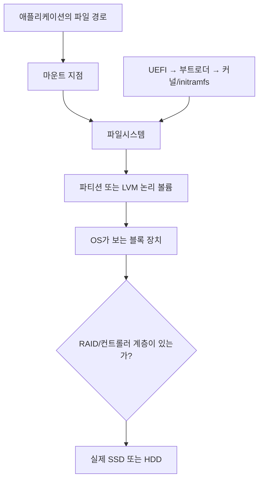
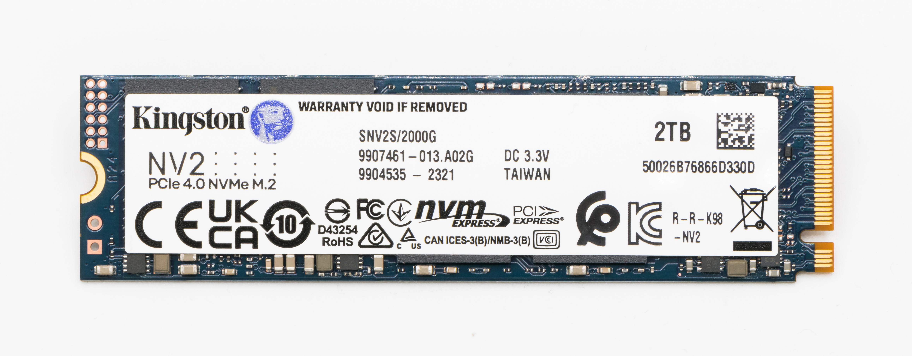
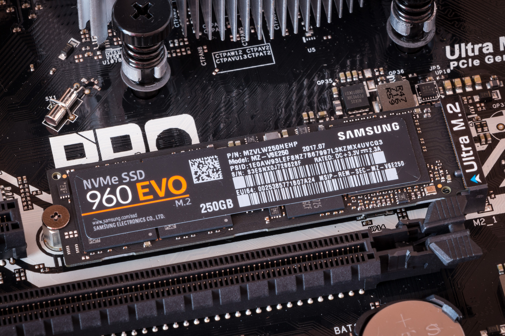
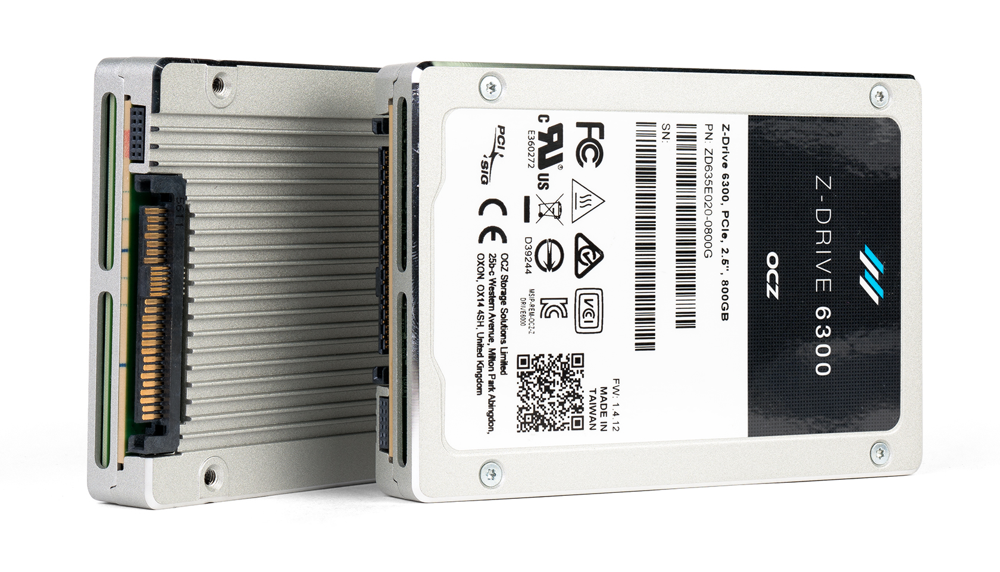
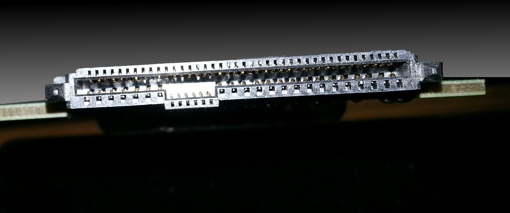
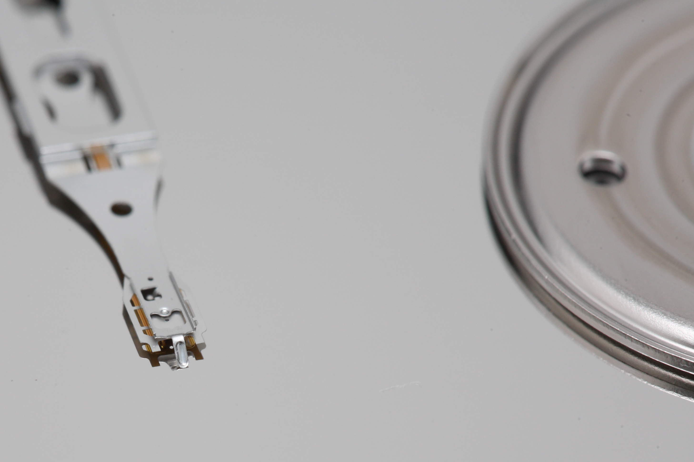

# 04. 저장장치·RAID·부팅: `/dev/sda` 뒤의 실제 경로

이 장의 목표는 “디스크가 보인다”는 사실에서 출발해 물리 매체, 연결 방식, RAID, 파일시스템, 부팅 경로를 거꾸로 추적하는 것이다.
예시의 `A7`은 제품이나 저장 규격 이름이 아니라 랩 내부 서버의 고유 식별명이다. [A7 실측 일지](../../npu/a7-expansion-plan-2026-09-21.md)의 2026-09-21 읽기 전용 조회를 기준으로 한다.
장치 이름과 상태는 그 시점의 관측값이며, 장애·교체·재부팅 시험 결과는 아니다.

먼저 이름의 종류를 나눈다. **NVMe(Non-Volatile Memory Express)**는 플래시 저장장치에 명령을 보내는 규약이고, **M.2**는 카드의 크기·단자·장착 조건을 정하는 **폼팩터(form factor, 물리 형태 규격)**다. **SSD(Solid-State Drive, 반도체 저장장치)**는 **NAND 플래시(NAND flash, 전원이 꺼져도 전하 상태로 데이터를 보존하는 반도체 메모리)** 같은 매체에 데이터를 저장하고, **HDD(Hard Disk Drive, 하드디스크 드라이브)**는 회전하는 자기 원판에 데이터를 저장한다. **컨트롤러(controller)**는 호스트 명령을 받아 실제 저장매체 접근을 관리하는 제어 장치다. **RAID(Redundant Array of Independent Disks)**는 여러 디스크에 데이터를 배치해 성능이나 장애 허용 방식을 만드는 기술이며, 같은 데이터를 복제하는 **미러(mirror)**와 데이터를 조각내 여러 장치에 나누는 **스트라이프(stripe)**가 기본 재료다. **UEFI(Unified Extensible Firmware Interface)**는 전원을 켠 직후 하드웨어를 초기화하고 부팅 항목을 고르는 펌웨어 규격이고, **부트로더(bootloader)**는 선택된 운영체제 커널을 메모리에 올려 실행을 넘기는 프로그램이다.



이 흐름은 위에서 아래로는 “파일이 어디에 저장되는가”, 아래에서 위로는 “전원을 켠 뒤 루트 파일시스템이 어떻게 나타나는가”를 보여 준다. `/dev/sda` 같은 이름 하나만 보고 매체·인터페이스·중복성을 한꺼번에 추정하면 안 된다.

## 1. 한눈에 보는 저장 계층

```text
애플리케이션의 /data/file
    ↓ 경로와 파일 권한
마운트 /data → 파일시스템 ext4
    ↓ 블록 주소
파티션 /dev/nvme0n1p1
    ↓ 디스크/논리 장치
단일 NVMe SSD → PCIe 경로 → CPU

애플리케이션의 /etc/hosts
    ↓ 마운트 / → ext4 → 파티션 /dev/sda2
논리 디스크 /dev/sda ← RAID1 ← 카드 위 M.2 NVMe SSD 두 장
```

파일시스템은 파일 이름을 블록에 연결하고, 마운트는 그 파일시스템을 디렉터리 트리에 붙인다.
파티션은 블록 장치를 나누는 방식이며, RAID는 여러 저장 장치의 블록을 하나의 논리 장치로 조직한다.
LVM(Logical Volume Manager, 논리 볼륨 관리자)은 물리 볼륨을 모아 논리 볼륨을 만드는 별도 계층이다.
PV(Physical Volume, 물리 볼륨)는 LVM이 재료로 쓰도록 초기화한 디스크·파티션·RAID 장치이고, VG(Volume Group, 볼륨 그룹)는 여러 PV를 묶은 저장 공간 풀이다. LV(Logical Volume, 논리 볼륨)는 VG에서 잘라 만든 실제 사용 단위이며, 운영체제에는 다시 하나의 블록 장치처럼 보인다.
**파티션 → RAID → LVM**처럼 조합할 수도 있고, **RAID → 파티션 → 파일시스템**처럼 조합할 수도 있다.
항상 한 가지 순서로 고정된 도식이라고 외우지 말고, 실제 블록 장치 의존 관계를 읽어야 한다.
[Linux md 문서](https://docs.kernel.org/admin-guide/md.html)는 배열을 독립 블록 장치로 노출하는 방식을 설명한다.

| 질문 | 확인할 계층 | A7의 답 |
|---|---|---|
| `/`는 어디에 있는가? | 마운트·파일시스템·파티션 | `/dev/sda2`의 ext4 |
| `/dev/sda`는 무엇인가? | 논리 장치·컨트롤러 | MegaRAID `LogicalDrive0` |
| 실제 저장 매체는? | 물리 장치 | 카드 위 960GB M.2 NVMe SSD 두 개 |
| `/data`도 미러인가? | 별도 경로 | 아니다. 7.68TB 단일 NVMe의 파티션 |

같은 이름의 장치가 재부팅이나 구성 변경 후 같은 물리 디스크라고 보장되지는 않는다.
이름만으로 결론 내리지 말고 모델, 용량, PCIe 경로, 컨트롤러가 보고한 멤버를 함께 대조한다.

## 2. 매체와 인터페이스를 분리해 읽기

HDD는 회전하는 플래터와 움직이는 헤드로 데이터를 찾는다.
따라서 랜덤 I/O에서는 탐색 시간과 회전 지연이 크게 작용하고, 순차 전송은 상대적으로 유리하다.
SSD는 움직이는 헤드 없이 NAND 플래시를 쓰지만, “지연이 0”인 장치는 아니다.
컨트롤러, NAND 접근, 대기열, PCIe 또는 SATA 연결, 파일시스템까지 합쳐 지연이 생긴다.

**SATA(Serial ATA)**는 저장장치를 호스트에 직렬 연결하는 인터페이스 계열이고, **SAS(Serial Attached SCSI)**는 서버 저장장치에 널리 쓰이는 직렬 연결 계열이다. 여기서 **SCSI(Small Computer System Interface)**는 저장장치 명령과 동작을 표현하는 표준 계열을 가리킨다. SAS는 SCSI 명령 체계를 사용하지만 SATA와 같은 말은 아니다.

| 구분 축 | 예 | 뜻 |
|---|---|---|
| 매체 | HDD, NAND SSD | 정보를 저장하는 물리 방식 |
| 명령·전송 규약 | SATA, SAS, NVMe | 호스트가 장치에 명령을 전달하는 방법 |
| 외형·커넥터 | M.2, U.2, U.3, PCIe 카드 | 장착 위치와 기계·전기 연결 조건 |
| 호스트 노출 | `/dev/sda`, `/dev/nvme0n1`, `/dev/md0` | Linux가 만든 블록 장치 이름 |

NVMe는 비휘발성 메모리 접근 규약이고, M.2는 얇은 기판형 장치의 크기·단자·고정 방식을 정하는 폼팩터다. M.2 SSD가 반드시 NVMe인 것은 아니며 SATA M.2도 있다. Broadcom 9520-2M2 자체가 SATA 또는 NVMe M.2 두 개를 지원하지만, **A7에 장착된 두 SSD는 NVMe**로 확인됐다. [Broadcom 9520-2M2 가이드](https://docs.broadcom.com/doc/9520-2M2-UG), [NVM Express 사양 개요](https://nvmexpress.org/specifications/).

### M.2는 생김새, key, 길이, 전기 연결을 따로 본다

`M.2 2280`의 `22`는 기판 너비 약 **22mm**, `80`은 길이 약 **80mm**를 뜻한다. 같은 방식으로 2230은 22×30mm, 22110은 22×110mm다. **에지 커넥터(edge connector)**는 기판 가장자리에 줄지어 있는 금속 접점이고, **래치(latch)**는 부품을 제자리에 잡아 주는 걸쇠다. **키(key)**와 **노치(notch)**는 맞는 슬롯과 카드 조합을 기계적으로 구분하는 홈의 위치를 뜻한다. 노트북이나 서버 보드에서는 에지 커넥터를 슬롯에 비스듬히 넣고 반대쪽 끝을 내려 나사나 래치로 고정하는 형태가 흔하다. 길이가 맞지 않으면 고정 위치가 맞지 않고, 두께·방열판·양면 NAND 때문에 덮개나 이웃 부품과 간섭할 수도 있다.



*실물 보기: 왼쪽의 금색 에지 접점과 키 홈, 길고 얇은 22×80mm 기판, 반대쪽의 고정 나사 홈을 본다. 이 사진은 M.2 2280의 외형 예시이며 A7에 장착된 SSD 사진이나 모든 M.2 프로토콜의 증거는 아니다. 사진: Jacek Halicki, CC BY-SA 4.0 — [원본·라이선스](assets/photos/README.md).*



*장착 보기: 에지 커넥터는 메인보드의 M.2 소켓(socket, 카드를 끼우는 자리)에 들어가고 기판 반대쪽은 **스탠드오프(standoff, 기판 높이를 받치는 지지 기둥)**와 나사로 고정된다. 주변 방열판·그래픽카드·덮개와의 공간도 장착 조건이다. 사진: Ilya Plekhanov, CC BY-SA 4.0 — [원본·라이선스](assets/photos/README.md).*

```text
M.2 2280의 위에서 본 개념도

슬롯 쪽                                                   고정 나사 쪽
┌─ 금색 edge connector ─┬──────────────── NAND/controller ───────────○
│      key notch         │<──────────── 약 80 mm ────────────────────>│
└────────────────────────┴────────────────────────────────────────────┘
                         전체 너비 약 22 mm
```

**key**는 edge connector의 홈(notch) 위치와 사용 가능한 접점 영역을 구분하는 기계적 표식이다. 저장장치에서는 **B key**, **M key**, 양쪽 홈이 있는 **B+M key**를 자주 본다. 하지만 홈 모양은 “물리적으로 들어갈 가능성”을 좁힐 뿐, 슬롯에 어떤 신호가 실제 배선됐는지와 펌웨어가 어떤 장치를 지원하는지를 확정하지 않는다. 예를 들어 M-key M.2 SSD가 흔히 PCIe x4/NVMe를 사용하고 B+M-key SSD가 SATA 또는 더 적은 PCIe 레인을 사용하는 경우가 많지만, 구매·장착 판단은 반드시 보드 매뉴얼의 **지원 길이, key, SATA/PCIe 배선, NVMe 부팅 지원**을 함께 확인한다.

| 확인할 것 | 눈으로 볼 수 있는 단서 | 눈으로만 확정할 수 없는 것 |
|---|---|---|
| 크기 | 기판 너비·길이, 2280 같은 라벨, 고정 나사 위치 | 덮개를 닫았을 때 열·두께 간섭 |
| key | edge connector의 B/M notch 위치 | 실제 SATA/PCIe 신호 배선과 레인 수 |
| 프로토콜 | 제품 라벨의 SATA 또는 PCIe/NVMe 표기 | 노트북·서버 슬롯의 지원 여부 |
| 성능 | 제품의 PCIe 세대·레인 사양 | 장착 뒤 협상 세대·폭, 열 제한, 실제 처리량 |

**노트북 장착 예:** 노트북 매뉴얼에 “M.2 2280, M-key, PCIe x4 NVMe only”라고 적혀 있다면 22×80mm M-key NVMe SSD가 후보가 된다. 같은 2280 길이의 SATA M.2 SSD가 홈 때문에 물리적으로 들어가더라도, SATA 신호가 배선되지 않은 슬롯에서는 동작하지 않는다. 반대로 “M.2 SATA only” 슬롯에는 PCIe NVMe SSD를 꽂아도 NVMe 장치로 열거되지 않는다. 답은 SSD 외형이 아니라 **노트북 모델별 서비스 매뉴얼과 슬롯 지원표**에 있다.

### U.2는 2.5인치 케이스 뒤에 PCIe 경로가 있는 폼팩터다

**U.2**는 서버에서 흔히 보는 2.5인치 드라이브 외형에 NVMe용 PCIe 신호와 전원·관리 신호를 연결하는 폼팩터·커넥터 계열이다. **베이(bay)**는 드라이브를 밀어 넣는 섀시의 장착 자리이고, **백플레인(backplane)**은 여러 베이의 전원·데이터 접점을 모아 서버 내부 케이블이나 보드 배선으로 연결하는 회로기판이다. 드라이브의 뒤쪽 커넥터는 U.2에서 널리 쓰이는 SFF-8639 계열이며, 서버에서는 드라이브를 전면 베이에 밀어 넣어 백플레인에 결합하는 형태가 흔하다. 실제 데이터 경로는 다음처럼 이어진다.



*실물 보기: 외형은 2.5인치 SATA SSD와 비슷하지만 뒤쪽 connector와 내부 프로토콜이 다르다. 앞면 모양만 보고 SATA·SAS·U.2 NVMe를 판정하지 말고 라벨, connector, bay 지원표를 함께 본다. 사진: Dmitry Nosachev, CC BY-SA 4.0 — [원본·라이선스](assets/photos/README.md).*



*연결 보기: 사진은 드라이브 뒤 SFF-8639 계열 접점과 케이블 쪽 어댑터가 어떻게 만나는지 보여 주는 한 예다. 실제 서버는 전면 backplane과 보드 배선을 사용할 수 있으므로 이 어댑터가 모든 U.2 장착에 필요하다는 뜻은 아니다. 사진: Kevinf28, CC BY-SA 4.0 — [원본·라이선스](assets/photos/README.md).*

```text
2.5-inch U.2 NVMe SSD
  → 드라이브 connector
  → NVMe 지원 backplane의 해당 bay
  → 케이블 또는 보드 배선
  → PCIe switch/root port
  → CPU
```

서버 전면에 2.5인치 베이가 보인다는 사실만으로 U.2 NVMe를 지원한다고 결론 내릴 수 없다. 같은 크기의 2.5인치 SATA SSD, SAS SSD, U.2 NVMe SSD는 앞에서 보면 비슷해 보이지만 커넥터 접점, 백플레인 배선, 컨트롤러 또는 **HBA(Host Bus Adapter, 호스트와 저장장치를 연결해 주는 어댑터)**, 케이블, 펌웨어 지원이 다르다. **트라이 모드(tri-mode)**는 지원 컨트롤러와 백플레인이 SAS·SATA·NVMe 같은 여러 저장 프로토콜을 다룰 수 있게 한 기능 계열이다. **핫스왑(hot-swap)**은 시스템 전원을 끄지 않고 지원되는 절차로 드라이브를 교체하는 기능이다. 핫스왑 가능 여부는 드라이브 외형이 아니라 전체 베이·백플레인·컨트롤러·운영체제 조합으로 판단한다. **P/N(Part Number, 부품 번호)**은 정확한 제품·옵션을 구분하는 식별값이며, 비슷한 제품명보다 구체적인 지원표를 찾는 기준이 된다.

**서버 장착 예:** 서버 사양서에 “앞쪽 베이 0–3은 NVMe U.2, 베이 4–7은 SAS/SATA”라고 적혀 있다고 하자. U.2 NVMe SSD는 베이 0–3 후보이며, 베이 4에 물리적으로 밀어 넣을 수 있어 보여도 PCIe 경로가 없으면 NVMe로 동작하지 않는다. 반대로 2.5인치 SATA SSD를 베이 0에 넣을 수 있어 보여도 그 NVMe 전용 백플레인이 SATA 신호나 트라이 모드 컨트롤러를 제공하지 않으면 동작을 기대할 수 없다. 베이 번호별 백플레인 P/N, 케이블 목적지, **컨트롤러 동작 모드(controller mode)**를 확인해야 한다.

#### 장착 판단 문제와 답

1. **노트북에 2280 길이 M.2 슬롯이 보이면 어떤 2280 SSD든 쓸 수 있는가?**<br>
   아니다. B/M key, SATA 또는 PCIe 배선, NVMe 지원, 허용 두께와 방열 조건을 서비스 매뉴얼에서 확인한다.
2. **M-key 홈이 있는 SSD면 반드시 NVMe PCIe x4로 동작하는가?**<br>
   아니다. key는 기계적·접점 범위를 나타내는 단서다. 장치 사양과 슬롯의 실제 배선·지원 프로토콜·협상 레인을 확인한다.
3. **서버의 2.5인치 bay에 SATA SSD가 들어갔으니 U.2 NVMe도 호환되는가?**<br>
   아니다. NVMe용 PCIe backplane 경로와 connector, 전원, 펌웨어·controller 지원이 있어야 한다.
4. **U.2 NVMe 네 장을 꽂으면 CPU에 PCIe x4 경로 네 개가 항상 독립적으로 생기는가?**<br>
   아니다. 백플레인 뒤에서 PCIe 스위치의 공유 상위 링크, **레인 분할(bifurcation, 하나의 레인 묶음을 여러 링크로 나누는 구성)**, 케이블 또는 컨트롤러를 사용할 수 있다. 서버 제조사(OEM) 배선도와 `lspci -t` 같은 실제 토폴로지를 함께 본다.

U.3도 2.5인치 드라이브·백플레인 문맥에서 쓰이지만, U.2와 이름이 비슷하다고 같은 배선·관리 방식을 자동으로 가정하지 않는다. 커넥터가 비슷해 보여도 드라이브·백플레인·컨트롤러의 지원 조합을 확인해야 한다.

`/dev/sda`를 보고 “SATA HDD”라고 판단하면 A7에서는 틀린다.
하드웨어 RAID 컨트롤러가 두 NVMe SSD를 한 논리 장치로 만들어 SCSI 계열 블록 인터페이스로 내보낸 결과다.
반대로 `/dev/nvme0n1`은 NVMe 장치 이름이지만, 이름만으로 중복 저장 여부를 판단할 수 없다.


### HDD는 왜 랜덤 I/O가 느린가

HDD(Hard Disk Drive)는 자성 물질이 칠해진 원판(platter)을 빠르게 돌리고, 헤드(head)를 원하는 위치로 이동해 데이터를 읽고 쓴다.



*실물 보기: 반짝이는 원판이 platter이고, 그 위로 뻗은 가는 arm 끝에 head가 있다. head는 표면을 긁으며 움직이는 것이 아니라 매우 가까이 떠서 트랙을 읽고 쓰며, 원하는 트랙으로 이동하는 시간이 seek다. 사진: Matthew Field, CC BY-SA 3.0 — [원본·라이선스](assets/photos/README.md).*
비트를 0과 1로 저장한다는 말은 물질의 아주 작은 영역이 서로 다른 자화 방향을 갖도록 만든다는 뜻이다.
자화 방향 자체가 문자나 파일 이름을 아는 것은 아니다.
컨트롤러와 파일시스템이 "이 논리 블록의 바이트열을 어느 물리 위치에 둘 것인가"를 정하고, HDD는 그 바이트열을 자성 패턴으로 바꾼다.

원판 위의 동심원 경로를 트랙(track), 트랙을 잘게 나눈 단위를 섹터(sector)라고 부른다.
현대 디스크는 실제 물리 배치가 매우 복잡하고 결함 대체 영역도 있지만, 처음 이해할 때는 `트랙 → 섹터 → 바이트`로 생각하면 된다.
호스트가 보는 LBA(Logical Block Address)는 "0번 블록, 1번 블록..." 같은 번호다.
호스트는 보통 실제 원판의 정확한 위치를 직접 지정하지 않고 LBA를 요청한다.
디스크 내부 펌웨어가 LBA를 물리 위치에 대응시킨다.

HDD 한 번의 랜덤 읽기에는 세 시간이 더해진다.

```text
랜덤 읽기 시간의 단순 모델
≈ seek 시간 + 평균 회전 지연 + 전송 시간

seek 시간: 헤드를 원하는 트랙 근처로 움직이는 시간
평균 회전 지연: 원하는 섹터가 헤드 아래로 올 때까지 기다리는 평균 시간
전송 시간: 섹터가 지나가며 실제 비트가 읽히는 시간
```

회전 지연은 RPM으로 계산할 수 있다.
RPM은 revolutions per minute, 즉 분당 회전 수다.
7200RPM 디스크는 1초에 `7200 / 60 = 120`바퀴 돈다.
한 바퀴 시간은 `1 / 120 = 0.00833초 = 8.33ms`다.
원하는 섹터가 어디에 있을지 모르면 평균적으로 반 바퀴를 기다리므로 평균 회전 지연은 약 `8.33 / 2 = 4.17ms`다.

```text
7200RPM 예시
초당 회전 수 = 7200 / 60 = 120rps
한 바퀴 시간 = 1 / 120s = 8.33ms
평균 회전 지연 = 8.33ms / 2 = 4.17ms
```

seek가 5ms이고 전송이 0.1ms라면 작은 랜덤 읽기 하나는 대략 `5 + 4.17 + 0.1 = 9.27ms`가 된다.
초당 이론 완료 수는 `1 / 0.00927 ≈ 108 IOPS` 정도다.
이 계산은 synthetic 예제이며 실제 디스크의 캐시, 명령 재정렬, 구역별 밀도, 큐 깊이에 따라 달라진다.
중요한 직관은 헤드와 원판이 움직이는 시간이 바이트 전송 시간보다 클 수 있다는 점이다.

순차 읽기는 다르다.
헤드가 이미 올바른 트랙 근처에 있고 다음 섹터들이 계속 지나오면 seek와 회전 대기를 매 요청마다 다시 치르지 않는다.
그래서 HDD는 큰 순차 읽기에서 랜덤 읽기보다 훨씬 높은 대역폭을 낼 수 있다.
파일시스템 조각화(fragmentation)는 논리적으로 이어진 파일이 물리적으로 떨어진 위치에 놓이는 현상이고, HDD에서는 조각화가 seek를 늘릴 수 있다.
SSD에서도 조각화가 전혀 의미 없는 것은 아니지만, 움직이는 헤드가 없으므로 영향의 성격이 다르다.

HDD의 기록 방식도 구분해야 한다. **CMR(Conventional Magnetic Recording, 전통 자기 기록)**은 인접 트랙을 독립적으로 다시 쓰기 쉬운 방식이다. **SMR(Shingled Magnetic Recording, 기와식 자기 기록)**은 트랙을 기와처럼 일부 겹쳐 기록해 밀도를 높인다. SMR에서는 앞 트랙을 다시 쓰면 겹친 이웃 트랙도 영향을 받을 수 있어, 작은 랜덤 덮어쓰기를 내부의 더 큰 구역 단위로 읽고 재작성해야 할 수 있다. 그래서 같은 RPM·용량의 HDD라도 지속 랜덤 쓰기와 **RAID 재구축(rebuild, 고장 난 멤버의 데이터를 남은 멤버에서 다시 만드는 작업)**에서 지연 특성이 크게 달라질 수 있다.

SMR도 관리 주체에 따라 동작이 다르다. **드라이브 관리형(drive-managed) SMR**은 드라이브 펌웨어가 재배치를 맡아 호스트에는 일반 블록 장치처럼 보이게 한다. **호스트 관리형(host-managed) SMR**은 운영체제·파일시스템 같은 호스트 소프트웨어가 순차 기록 구역 규칙을 이해하고 지킨다. 제품 사양에 CMR/SMR이 명시되지 않았다고 임의로 추정하지 않는다. 서버 RAID·데이터베이스용 드라이브를 고를 때는 정확한 P/N의 기록 방식, **워크로드 등급(workload rating, 제조사가 정한 기간당 읽기·쓰기 작업량 기준)**, **오류 복구 동작(error recovery, 읽기 오류 때 드라이브가 재시도하고 보고하는 방식)**과 컨트롤러 지원을 확인한다.

SSD 비교표에 나오는 용어를 먼저 푼다. NAND **페이지(page)**는 읽거나 새 데이터를 프로그램하는 기본 단위이고, **지우기 블록(erase block)**은 여러 페이지를 묶어 한꺼번에 지우는 더 큰 단위다. **FTL(Flash Translation Layer, 플래시 변환 계층)**은 호스트의 논리 블록 주소를 실제 NAND 위치에 대응시킨다. **GC(Garbage Collection, 가비지 컬렉션)**는 유효 데이터를 옮기고 지울 수 있는 블록을 회수한다. **TBW(Total Bytes Written)**는 제품 조건에서 허용·보증하는 누적 호스트 쓰기량, **DWPD(Drive Writes Per Day)**는 보증 기간 동안 하루에 드라이브 전체 용량을 몇 번 쓸 수 있는지를 나타내는 지표다. **PLP(Power Loss Protection, 전원 손실 보호)**는 갑작스러운 전원 차단 때 진행 중인 데이터와 내부 매핑을 보호하는 설계다.

| 질문 | HDD에서의 핵심 | SSD에서의 핵심 |
|---|---|---|
| 작은 랜덤 읽기 | seek와 회전 대기가 큼 | 움직이는 부품은 없지만 NAND·controller 지연이 남음 |
| 큰 순차 읽기 | 헤드 이동을 줄여 높은 대역폭 가능 | 여러 NAND channel 병렬화로 높은 대역폭 가능 |
| 덮어쓰기 | CMR은 해당 영역 재기록, SMR은 주변 구역 재작성 가능 | 새 page 기록 후 FTL 매핑 변경, 나중에 GC |
| 가득 찼을 때 | 조각화·배치가 seek에 영향 | 빈 block 부족으로 GC와 쓰기 지연이 커질 수 있음 |
| 수명 지표 | workload rating, 연간 쓰기량, 진동 조건 등 | TBW·DWPD, NAND 쓰기 증폭, PLP 등 |

**자주 묻는 질문:** “7200RPM이면 모든 HDD가 약 108 IOPS인가?” 아니다. **IOPS(Input/Output Operations Per Second)**는 초당 완료한 입출력 요청 수다. 108 IOPS는 seek 5ms, 평균 회전 4.17ms, 전송 0.1ms를 가정한 한 요청씩의 가상 계산이다. 캐시, 대기열(queue), 명령 재정렬, CMR/SMR, 읽기/쓰기 혼합에 따라 달라진다. “SSD는 seek가 없으니 랜덤과 순차가 같은가?”도 아니다. 작은 랜덤 I/O는 컨트롤러·NAND 페이지·대기열 비용을 많이 치르고, 큰 순차 I/O는 여러 **NAND 채널(channel, 컨트롤러와 플래시 칩 사이의 병렬 데이터 경로)**을 효율적으로 사용하기 쉽다.

### SSD 내부에서 일어나는 일

NAND는 읽기·쓰기 단위와 지우기 단위가 다르고, 이미 쓴 위치를 제자리에서 무한히 덮어쓸 수 없다.
SSD 컨트롤러의 FTL(Flash Translation Layer)은 호스트의 논리 블록 주소를 실제 NAND 위치에 매핑한다.
가비지 컬렉션은 유효 데이터를 옮기고 지울 수 있는 블록을 확보한다.
웨어 레벨링은 쓰기·지우기 부하가 일부 셀에만 쏠리지 않도록 한다.
TRIM/디스카드는 파일시스템이 더 이상 쓰지 않는 블록을 아래 계층에 알려 재사용 판단을 돕는다.
RAID나 가상화 계층이 디스카드를 전달하는지는 별도로 확인해야 하며, 지원 여부를 가정해 실행하지 않는다.
[Kingston의 TRIM·가비지 컬렉션 설명](https://www.kingston.com/en/ssd/ssd-faq), [Linux XFS 디스카드 설명](https://docs.kernel.org/admin-guide/xfs.html).


NAND 플래시는 셀(cell)에 전하를 가두거나 빼서 값을 표현한다.
SLC는 셀 하나에 1bit, MLC/TLC/QLC는 더 많은 bit를 담기 위해 여러 전압 구간을 구분한다.
한 셀에 더 많은 bit를 담으면 용량은 늘지만, 전압 구간 사이의 간격이 좁아져 읽기 판정과 내구성 관리가 더 어려워진다.
SSD 사양에서 enterprise, read-intensive, mixed-use 같은 표현이 나오는 이유가 여기에 있다.
같은 "NVMe SSD"라도 NAND 종류, 오버프로비저닝, PLP, 펌웨어 정책이 다르면 서버 운용 성격이 달라진다.

NAND의 핵심 제약은 "페이지 단위로 읽고 쓰지만, 블록 단위로 지운다"는 점이다.
숫자는 제품마다 다르므로 아래는 개념 설명용 synthetic 예시다.

```text
가정:
page = 16KiB
erase block = 256 pages = 4MiB
호스트 논리 블록 = 4KiB

읽기: 필요한 page를 읽어 일부 4KiB를 꺼낼 수 있음
쓰기: 비어 있는 page에 새 데이터를 프로그램(program)
지우기: 이미 쓴 page 하나만 지우지 못하고 erase block 전체를 지움
```

호스트가 LBA 100에 `A`를 쓴 뒤 다시 `B`로 덮어쓴다고 하자.
HDD라면 같은 물리 위치를 다시 자화할 수 있지만, NAND는 이미 프로그램된 위치를 바로 덮어쓰기 어렵다.
SSD는 새 비어 있는 물리 page에 `B`를 쓰고, FTL 매핑을 `LBA 100 → 새 위치`로 바꾼다.
예전 `A`가 있던 page는 더 이상 유효하지 않은 stale page가 된다.
나중에 같은 erase block 안의 유효 page만 다른 곳으로 복사한 뒤 block 전체를 지워 재사용한다.
이 과정이 가비지 컬렉션이다.

```text
처음:
LBA 100 → 물리 page P1: A

덮어쓰기 후:
LBA 100 → 물리 page P9: B
물리 page P1: stale, 나중에 GC 대상
```

쓰기 증폭(write amplification)은 호스트가 쓴 양보다 NAND 내부에서 더 많이 쓰이는 현상이다.
호스트가 4KiB를 자주 덮어쓰는데 SSD 내부가 유효 데이터를 옮기고 블록을 지워야 하면 NAND 쓰기량이 늘어난다.
오버프로비저닝은 사용자에게 보이지 않는 여유 NAND를 두어 GC와 웨어 레벨링이 숨 쉴 공간을 만드는 방식이다.
디스크가 거의 꽉 차면 SSD가 빈 블록을 찾기 어려워져 쓰기 지연이 튈 수 있다.

TRIM 또는 discard는 "이 LBA는 파일시스템에서 더 이상 필요 없다"는 힌트다.
삭제 명령 자체가 NAND를 즉시 깨끗하게 지운다는 뜻은 아니다.
파일 삭제, 파일시스템, LVM, RAID, 컨트롤러, SSD까지 discard가 전달되어야 SSD가 그 정보를 활용할 수 있다.
그래서 `rm`을 했다는 사실만으로 하부 SSD의 물리 page가 사라졌다고 말하지 않는다.
반대로 보안 삭제가 필요하면 파일 삭제나 TRIM만 믿지 말고 장치가 지원하는 sanitize, crypto erase, 폐기 절차를 별도로 검토한다.

내구성 표기의 TBW는 정해진 조건에서 보증·평가하는 총 호스트 쓰기량이고, DWPD는 정해진 기간 동안 하루에 드라이브 용량을 몇 번 쓸 수 있는지다.
예컨대 **960GB, 1 DWPD, 5년**이면 산술 기준은 `0.96TB × 365 × 5 = 1,752TB`의 호스트 쓰기다.
이는 가상 제품의 계산 예시이며 A7 삼성 SSD의 공인 내구성이나 잔여 수명을 뜻하지 않는다.
실제 내구성은 해당 정확한 모델의 데이터시트, 작업 부하, 온도, 쓰기 증폭에 따른다.
[Micron SSD 제품 사양](https://assets.micron.com/adobe/assets/urn%3Aaaid%3Aaem%3A7daa93d3-5d59-4ee0-89dd-4d99f33f042e/renditions/original/as/xtr-ssd-tech-prod-spec.pdf)은 TBW와 DWPD를 별도 항목으로 제시한다.

PLP(Power Loss Protection)는 갑작스러운 전원 손실 때 드라이브 내부의 진행 중인 데이터·매핑 갱신을 보호하는 장치 설계다.
모든 SSD에 같은 수준의 PLP가 있는 것은 아니다.
SSD의 PLP와 RAID 컨트롤러의 캐시 보호는 서로 다른 위치의 데이터에 적용된다.
[Kingston의 SSD PLP 설명](https://www.kingston.com/unitedkingdom/en/blog/servers-and-data-centers/ssd-power-loss-protection).

### 성능 숫자를 읽는 네 가지 렌즈

- IOPS: 초당 완료된 입출력 요청 수. 블록 크기와 읽기/쓰기 비율이 없으면 비교가 어렵다.
- 대역폭: 초당 전송한 바이트. 큰 순차 요청에서 높아지기 쉽다.
- 지연: 한 요청이 완료될 때까지 걸린 시간. 평균과 꼬리 지연(p99 등)을 구분한다.
- 큐 깊이(QD): 동시에 대기시키는 요청 수. QD를 높여 처리량을 얻어도 개별 요청 지연은 늘 수 있다.

예를 들어 4KiB 요청을 초당 100,000개 완료하면 산술 대역폭은 약 409.6MB/s다.
그렇다고 1MiB 순차 요청의 최대 대역폭이나 QD1 지연을 알 수는 없다.
광고 수치는 테스트 블록 크기, QD, 동시 스레드, 읽기/쓰기 혼합, 지속 시간과 함께 읽는다.

## 3. 컨트롤러, 카드, 스위치, 백플레인

```text
일반적인 핫스왑 베이 예
CPU ─ PCIe ─ HBA/RAID 카드 ─ 케이블 ─ 백플레인 ─ 드라이브 베이

A7의 부팅 경로
CPU0 ─ PCIe 스위치 A ─ SLOT2: MegaRAID 9520-2M2
                            ├─ 카드 위 M.2 NVMe SSD 0
                            └─ 카드 위 M.2 NVMe SSD 1
```

HBA는 보통 물리 드라이브를 OS에 직접 전달하는 어댑터 역할을 한다.
RAID 카드는 자체 펌웨어로 멤버를 묶어 논리 디스크를 제공할 수 있다.
PCIe 스위치는 여러 장치가 상위 PCIe 링크를 공유하도록 연결하는 장치이고, RAID 계산의 주체가 아니다.
백플레인은 드라이브 베이의 전원·신호·장착 경로를 제공한다.
같은 서버에 이 부품들이 함께 있을 수 있지만, 이름이 서로를 대신하지 않는다.

A7의 9520-2M2는 일반 베이 케이블 경로의 예외다.
**두 M.2 SSD가 카드 위에 직접 장착**되므로 이 부팅 경로를 외부 드라이브 백플레인으로 그리면 틀린다.
카드는 PCIe Gen4 x8로 관측됐고, 모델의 공식 설명도 두 M.2 드라이브를 쓰는 부팅 어댑터라고 밝힌다.
[Broadcom 제품 개요](https://docs.broadcom.com/doc/9520-2M2-PB).
같은 스위치 A에는 GPU 두 장도 연결되어 있으므로 공유 상위 링크의 동시 I/O는 별도 성능 주제다.

## 4. RAID 레벨은 무엇을 바꾸는가

같은 용량 `S`의 디스크 `N`개라는 단순 모델을 사용한다.
표의 용량은 메타데이터·포맷·제조사 표기 차이를 제외한 근삿값이다.

| 레벨 | 최소 디스크 | 사용 가능 용량 | 허용되는 디스크 장애 | 기본 원리 |
|---|---:|---:|---|---|
| RAID0 | 2 | `N × S` | 0개 | 스트라이핑만 수행 |
| RAID1 | 2 | 보통 `S` | `N-1`개까지, 각 데이터의 복사본이 남을 때 | 같은 데이터를 미러링 |
| RAID5 | 3 | `(N-1) × S` | 1개 | 분산 패리티 1개 분량 |
| RAID6 | 4 | `(N-2) × S` | 2개 | 분산 패리티 2개 분량 |
| 전통적 RAID10 | 4, 짝수 | `(N/2) × S` | 각 미러 쌍에서 최대 1개 | 미러 쌍들을 스트라이핑 |

RAID10은 “항상 두 디스크 장애를 견딘다”가 아니다.
4개 디스크를 `(A,A')`, `(B,B')` 두 쌍으로 묶었다면 `A`와 `B`의 동시 장애는 견딜 수 있지만 `A`와 `A'`가 함께 고장 나면 해당 데이터가 사라진다.
따라서 두 개 이상 장애 허용 여부는 **어느 쌍에서 고장 나는지**에 달렸다.
Linux md에는 세 디스크와 다른 배치도 가능하므로 표는 전통적인 네 개 이상 미러 쌍 RAID10에 한정한다.
[Linux dm-raid의 RAID10 배치 설명](https://docs.kernel.org/admin-guide/device-mapper/dm-raid.html), [Red Hat RAID 설명](https://docs.redhat.com/en/documentation/red_hat_enterprise_linux/10/html/managing_storage_devices/managing-raid).

RAID5/6의 패리티 갱신에는 쓰기 비용이 있고, 장애 후 재구성 동안 다른 드라이브에도 부하가 간다.
실제 성능과 복구 시간은 컨트롤러, 드라이브 용량·상태, 작업 부하에 따라 달라진다.
RAID1도 미러 동기화와 복구가 필요하며, 장애 발생 즉시 동일 성능이 보장되지는 않는다.

**RAID는 백업이 아니다.** 잘못 지운 파일, 랜섬웨어, 파일시스템 손상, 컨트롤러 오류, 화재처럼 두 멤버에 함께 영향을 주는 사건은 미러가 해결하지 못한다.
별도 위치·권한·복구 절차의 백업과 실제 복원 검증이 필요하다.
A7의 백업 존재 여부는 실측 일지에서 확인하지 않았다.


### RAID 주소 계산을 손으로 해보기

RAID를 제대로 이해하려면 "용량이 몇 배"보다 "논리 블록 주소가 어느 물리 디스크로 가는가"를 먼저 본다.
아래 예시는 chunk 크기를 64KiB로 가정한다.
chunk는 스트라이핑에서 한 디스크에 연속으로 쓰는 데이터 묶음이다.
호스트가 보는 논리 주소 공간은 chunk 번호로 나누어 생각할 수 있다.

RAID0 두 디스크 `D0`, `D1`에서는 chunk가 번갈아 배치된다.

```text
논리 chunk 0 → D0의 chunk 0
논리 chunk 1 → D1의 chunk 0
논리 chunk 2 → D0의 chunk 1
논리 chunk 3 → D1의 chunk 1
```

논리 오프셋 160KiB는 `160 / 64 = 2.5`이므로 논리 chunk 2 안의 32KiB 지점이다.
위 배치에서는 `D0의 chunk 1 + 32KiB`를 읽는다.
RAID0은 두 디스크를 함께 쓰므로 순차 처리량은 좋아질 수 있지만, 어느 한 디스크라도 잃으면 그 디스크에 있던 chunk들이 사라져 전체 파일시스템이 깨진다.

RAID1 두 디스크에서는 같은 논리 chunk가 두 디스크에 모두 있다.

```text
논리 chunk 0 → D0 chunk 0, D1 chunk 0
논리 chunk 1 → D0 chunk 1, D1 chunk 1
```

읽기는 컨트롤러가 둘 중 하나에서 읽을 수 있고, 쓰기는 두 복사본에 반영되어야 한다.
"두 곳에 쓴다"는 말은 안정성만 뜻하지 않는다.
쓰기 완료를 언제 호스트에 알릴지, 한쪽이 느리거나 실패할 때 어떻게 처리할지, write-back 캐시가 보호되는지가 같이 중요하다.

RAID5는 각 stripe마다 데이터 chunk들과 패리티 chunk 하나를 둔다.
패리티는 XOR로 설명할 수 있다.
XOR는 두 bit가 같으면 0, 다르면 1이 되는 연산이다.
세 값 `A`, `B`, `P`가 있고 `P = A XOR B`라면 하나를 잃어도 나머지 둘로 복구할 수 있다.

```text
XOR 규칙:
0 XOR 0 = 0
0 XOR 1 = 1
1 XOR 0 = 1
1 XOR 1 = 0

예시:
A = 10110010
B = 01100110
P = A XOR B = 11010100

A를 잃으면:
A = B XOR P
  = 01100110 XOR 11010100
  = 10110010
```

3디스크 RAID5의 단순 stripe를 그리면 다음과 같다.
실제 컨트롤러의 회전 패리티 배치와 chunk 번호는 구현별 layout에 따르므로, 아래는 개념용이다.

```text
stripe 0: D0=data A0 | D1=data B0 | D2=parity P0=A0 XOR B0
stripe 1: D0=data A1 | D1=parity P1=A1 XOR B1 | D2=data B1
stripe 2: D0=parity P2=A2 XOR B2 | D1=data A2 | D2=data B2
```

작은 overwrite가 비싼 이유도 여기서 나온다.
RAID5에서 데이터 chunk 하나를 바꾸면 새 패리티도 바뀐다.
컨트롤러는 보통 기존 데이터와 기존 패리티를 읽고, 새 데이터와 새 패리티를 쓴다.
이를 read-modify-write라고 부른다.
큰 순차 쓰기처럼 stripe 전체를 한꺼번에 쓰면 계산 방식이 달라질 수 있지만, 작은 랜덤 쓰기에는 쓰기 증폭이 생긴다.

RAID6은 두 개의 독립적인 패리티 정보를 둔다.
하나는 XOR 계열 P, 다른 하나는 더 복잡한 수학으로 계산하는 Q라고 생각하면 된다.
덕분에 두 디스크까지 잃어도 복구할 수 있지만, 용량과 쓰기 비용을 더 지불한다.
RAID6의 Q 패리티 계산은 처음 배우는 장에서 유한체 수학까지 들어갈 필요는 없다.
핵심은 "두 번째 패리티는 단순 복사본이 아니라 서로 다른 복구 방정식 하나를 더 두는 것"이다.

### Rebuild와 URE의 한계

rebuild는 고장 난 디스크를 교체한 뒤 남은 디스크들의 데이터와 패리티로 새 디스크 내용을 다시 만드는 과정이다.
이때 배열은 보호 수준이 낮아진 상태로 많은 데이터를 읽는다.
큰 디스크일수록 rebuild 시간이 길어지고, 남은 디스크에 read 부하가 걸린다.
작업 부하가 계속 들어오면 rebuild와 서비스 I/O가 같은 장치를 두고 경쟁한다.

URE(Unrecoverable Read Error)는 디스크가 어떤 섹터를 끝내 읽지 못하는 사건이다.
제조사 사양은 보통 `10^14 bits read당 1회 이하`처럼 bit 단위 오류율로 표시한다.
이 숫자는 확률 모델의 입력일 뿐이며 특정 rebuild가 반드시 실패한다는 예언은 아니다.
하지만 대용량 RAID5에서 rebuild 중 남은 모든 데이터를 읽어야 할 때 위험을 키우는 요인이다.

```text
synthetic 계산:
10TB 디스크 2개에서 남은 데이터를 약 20TB 읽는다고 가정
20TB = 20 × 10^12 bytes = 160 × 10^12 bits = 1.6 × 10^14 bits

URE 사양을 1 per 10^14 bits로 단순 모델링하면
평균 오류 기대치가 1을 넘는 규모가 된다.
```

이 계산은 실제 제품의 보증 실패율이 아니고, 컨트롤러의 재시도·섹터 재배치·작업 부하도 생략했다.
운영 판단에서 얻는 결론은 명확하다.
큰 디스크 여러 개의 RAID5를 "한 개 고장 허용이니까 충분"이라고만 보지 말고, rebuild 시간, URE 사양, 백업, 스크럽, 핫스페어, RAID6/RAID10 대안을 함께 검토한다.

### A7의 RAID1 계산

```text
960GB SSD 0 ─┐
             ├─ LogicalDrive0: RAID1 → /dev/sda ≈ 960GB
960GB SSD 1 ─┘                      ├─ sda1 → /boot/efi
                                     └─ sda2 → /

별도 7.68TB NVMe → /dev/nvme0n1p1 → /data
```

두 960GB를 합친 1.92TB가 아니라, 한 개 분량의 논리 공간을 얻는다.
실측 논리 장치 크기는 959,656,755,200바이트, 약 960GB 또는 893.8GiB다.
컨트롤러는 `RAIDType: RAID1`, `State: Optimal`, 두 멤버 `Online`·`Health: OK`를 보고했다.
SSD 두 개가 온라인이라는 현재 상태와 장애 시 재부팅 성공은 별개의 검증이다.
`/data`의 7.68TB SSD는 이 미러에 속하지 않는다.

## 5. 하드웨어 RAID와 Linux md

| 항목 | 하드웨어 RAID | Linux md 소프트웨어 RAID |
|---|---|---|
| 묶는 주체 | 컨트롤러 펌웨어 | Linux 커널 |
| OS가 주로 보는 것 | 컨트롤러가 만든 논리 디스크 | `/dev/md*` 배열과 구성 멤버 |
| 복구 시 의존성 | 호환 컨트롤러·메타데이터·펌웨어 절차 확인 | md 메타데이터·OS 도구·배열 조립 절차 확인 |
| CPU 비용 | 작업 일부를 카드가 수행할 수 있음 | 호스트 CPU가 수행, 실제 영향은 부하에 따라 측정 |

“하드웨어가 무조건 빠르다” 또는 “md면 복구가 자동으로 쉽다”는 일반화는 위험하다.
컨트롤러 장애 때는 호환 모델과 메타데이터 인식 여부를 알아야 한다.
md도 멤버 순서, 메타데이터, 부팅 initramfs 구성과 관측 자료가 필요하다.
A7에서는 `/proc/mdstat`에 활성 md 배열이 없었고, 카드의 논리 디스크 `/dev/sda`가 루트의 하부 장치다.
[Linux md 관리 문서](https://docs.kernel.org/admin-guide/md.html).

카드가 꽂혔다는 사실만으로 RAID1이라고 결론 낼 수 없다.
JBOD, 단일 디스크, RAID0, 미리 설정된 공장 출하 볼륨 등 가능성이 있다.
**현재 볼륨의 레벨, 멤버, 상태**를 읽어야 한다.
9520-2M2에서 RAID 배열로 구성하는 레벨은 RAID0과 RAID1 문맥으로 확인하고, JBOD나 단일 드라이브 노출은 RAID 레벨이 아니라 별도 노출 방식으로 구분해서 확인한다. RAID 번호는 업그레이드 순서가 아니다.
[Broadcom 9520-2M2 사용자 가이드](https://docs.broadcom.com/doc/9520-2M2-UG).

컨트롤러의 write-through는 대개 하부 저장장치 완료를 기다려 쓰기 완료를 알리고, write-back은 캐시에 받아 먼저 완료를 알릴 수 있다.
write-back 성능 이점만 보고 보호 없는 휘발성 캐시를 켜면 전원 손실 때 이미 완료됐다고 알린 쓰기가 사라질 수 있다.
컨트롤러 캐시 보호 모듈·상태, SSD 자체 PLP, 펌웨어 정책, 작업 부하를 모두 확인해야 한다.
A7의 캐시 정책과 보호 모듈 장착 여부는 이 자료에서 확정하지 않는다.
[Broadcom CacheVault 설명](https://docs.broadcom.com/doc/cache-protection-options-matrix).

## 6. 전원을 켠 뒤 `/`가 나타나기까지

```text
전원 인가
  → 플랫폼 펌웨어(UEFI)가 장치 초기화·부팅 항목 선택
  → EFI System Partition(ESP)의 OS 부트로더 실행
  → 부트로더가 커널과 필요하면 initramfs를 로드
  → 커널·초기 사용자 공간이 저장장치 드라이버와 루트 장치 준비
  → 루트 파일시스템 마운트 → 사용자 공간 서비스 시작
```

UEFI는 부팅 항목과 EFI 실행 파일을 선택하는 펌웨어 영역의 역할이다.
ESP는 EFI 파일을 담는 파티션이고, 부트로더는 커널을 시작하는 프로그램이다.
커널 드라이버는 실제 컨트롤러와 블록 장치를 다루며, initramfs는 루트 파일시스템에 접근하기 전 필요한 초기 사용자 공간이다.
이름이 비슷해도 서로 대체하지 않는다.
[UEFI 부트 관리자 사양](https://uefi.org/specs/UEFI/2.11/03_Boot_Manager.html), [UEFI 개요](https://uefi.org/specs/UEFI/2.10/02_Overview.html).

A7에서는 `/dev/sda1`이 vfat `/boot/efi`, `/dev/sda2`가 ext4 `/`로 관측됐다.
`megaraid_sas` 드라이버가 확인됐지만 이 정보만으로 특정 재부팅 때의 펌웨어 로드 순서나 장애 시 부팅 성공까지 입증하지는 못한다.
부트 경로를 변경하는 명령은 이 교재의 범위에 넣지 않는다.


### 부팅 단계를 장애 위치로 나누기

부팅은 "전원이 켜졌다"와 "로그인 프롬프트가 보인다" 사이에 여러 프로그램이 이어달리기 하는 과정이다.
어느 주자가 실패했는지 나누면 문제를 덜 무섭게 볼 수 있다.

| 단계 | 주체 | 성공하면 보이는 것 | 실패 예 |
|---|---|---|---|
| 1. AC/DC 전원 | PDU, PSU, 전원 보드 | 팬·BMC·전원 LED | PSU 미감지, 전원 차단기, 케이블 불량 |
| 2. 초기 펌웨어 | BMC, 플랫폼 전원 제어, UEFI | POST, 장치 초기화 로그 | 메모리 초기화 실패, PCIe 장치 hang |
| 3. 부팅 항목 선택 | UEFI Boot Manager | ESP의 EFI 파일 실행 | 부팅 순서 오류, ESP 손상 |
| 4. 부트로더 | GRUB/systemd-boot 등 | 커널·initramfs 로드 | 부트로더 파일 누락, 커널 경로 오류 |
| 5. 커널 초기화 | Linux kernel | 드라이버 로드, block device 발견 | RAID/NVMe 드라이버 없음, 커널 panic |
| 6. initramfs | 초기 사용자 공간 | 루트 장치 검색·마운트 준비 | UUID 불일치, 암호화/LVM/md 조립 실패 |
| 7. 루트 마운트 | 커널 VFS | `/`가 읽기 전용 또는 읽기쓰기 마운트 | 파일시스템 손상, 잘못된 root= |
| 8. PID 1 | systemd 등 | 서비스 시작, 로그인 | 필수 서비스 실패, `/etc/fstab` 대기 |

ESP(EFI System Partition)는 대개 FAT 계열 파일시스템으로 포맷된 작은 파티션이다.
UEFI 펌웨어는 여기 있는 `.efi` 실행 파일을 읽을 수 있어야 한다.
부트로더는 커널 이미지를 읽고, 커널에는 루트 파일시스템을 마운트할 정보가 필요하다.
initramfs는 "진짜 루트 파일시스템에 들어가기 전 임시 도구 상자"다.
RAID, LVM, 암호화, 특수 스토리지 드라이버가 필요하면 initramfs 안에 그 도구와 모듈이 있어야 한다.

문제를 볼 때는 메시지 위치를 먼저 본다.
화면에 UEFI 설정도 안 보이면 OS보다 전원·펌웨어·메모리 쪽을 의심한다.
부트로더 메뉴까지 보이고 커널 panic이 나면 커널 인자, initramfs, 루트 장치를 본다.
커널이 올라오고 systemd가 emergency mode로 들어가면 `/etc/fstab`, 파일시스템 검사, 필수 마운트 실패를 본다.
같은 "부팅 안 됨"이라도 수리 담당과 증거가 완전히 달라진다.

다음은 synthetic 로그 조각이다.

```text
error: no such device: <UUID>
Entering rescue mode...
grub rescue>
```

이 조각은 커널이 시작되기 전, 부트로더가 필요한 파티션이나 파일을 찾지 못한 상황에 가깝다.
반면 다음은 커널과 initramfs가 시작된 뒤 루트 장치가 준비되지 않은 상황에 가깝다.

```text
ALERT! UUID=<uuid> does not exist. Dropping to a shell!
(initramfs)
```

두 메시지를 같은 처방으로 다루면 안 된다.
전자는 ESP, GRUB 설정, 디스크 순서, RAID 논리 장치 노출을 본다.
후자는 initramfs 안의 드라이버, root UUID, LVM/md 조립, 장치 발견 지연을 본다.

## 7. 읽기 전용으로 그림을 검산하기

다음 명령은 [A7 조사에서 실제 사용한 조회](../../npu/a7-expansion-plan-2026-09-21.md)다.
시리얼·UUID가 출력될 수 있으므로 공유 자료에는 필요한 필드만 옮긴다.

```bash
lsblk -b -e 7 -o NAME,TYPE,SIZE,MODEL,FSTYPE,MOUNTPOINTS
findmnt -no SOURCE,FSTYPE /
cat /proc/mdstat
readlink -f /sys/class/block/sda/device
readlink -f /sys/class/block/nvme0n1/device
```

`lsblk`는 이름·크기·파티션·마운트를, `findmnt`는 현재 `/`의 출처를 보여 준다.
`/proc/mdstat`의 `Personalities` 줄은 사용 가능한 RAID 기능 목록이지 활성 배열 목록이 아니다.
`readlink`는 sysfs의 실제 PCIe/컨트롤러 경로를 추적할 때 쓴다.
하드웨어 RAID의 정확한 레벨과 멤버는 OS 블록 목록만으로 확정하지 말고 컨트롤러/BMC의 **현재 볼륨** 정보와 대조한다.

## 8. 흔한 오해와 연습

| 오해 | 바로잡기 |
|---|---|
| “M.2 두 개면 RAID1이다.” | 장착 수와 배열 설정은 별개다. A7은 볼륨의 `RAIDType`으로 확인했다. |
| “`/dev/sda`는 회전식 SATA 디스크다.” | A7의 `/dev/sda`는 NVMe 두 개 위 하드웨어 RAID 논리 장치다. |
| “RAID1이면 `/data`도 보호된다.” | A7의 `/data`는 별도 단일 SSD다. |
| “`Optimal`이면 백업과 복구 시험이 끝났다.” | 현재 배열 상태만 뜻한다. 백업·장애·재부팅 검증은 별개다. |

1. 960GB 두 개로 RAID1을 만들면 사용자에게 몇 TB 정도가 보이는가?
2. 전통적 4디스크 RAID10에서 같은 미러 쌍의 두 디스크가 고장 나면 어떻게 되는가?
3. `/dev/sda2`에 ext4가 있고 `/`로 마운트됐다. 이 정보만으로 물리 매체가 HDD인지 알 수 있는가?
4. 파일을 삭제해도 SSD가 그 블록을 더 이상 쓰지 않는다고 반드시 아는 것은 왜 아닌가?
5. 7200RPM HDD의 평균 회전 지연은 얼마인가?
6. RAID5에서 `A=10110010`, `B=01100110`이면 XOR 패리티 P는 무엇인가?
7. 부트로더 메뉴는 보이지만 `(initramfs)` 프롬프트로 떨어졌다. 전원 문제부터 의심하는가, 루트 장치 준비 문제부터 의심하는가?

**답:** ① 약 0.96TB(포맷 전 근삿값)다. ② 해당 데이터의 두 복사본이 사라져 배열을 잃을 수 있다. ③ 알 수 없다. ④ 파일시스템의 삭제 정보가 TRIM/디스카드로 하부 장치까지 전달돼야 하기 때문이다. ⑤ 한 바퀴 8.33ms의 절반인 약 4.17ms다. ⑥ `11010100`이다. ⑦ 커널·initramfs까지는 왔으므로 루트 장치, initramfs 드라이버, UUID, RAID/LVM 조립을 먼저 나눈다.

[← 03. PCIe 슬롯과 스위치](03-pcie-slots-switches.md) · [목차](README.md) · [05. GPU·NPU 실행 →](05-gpu-npu-execution.md)
