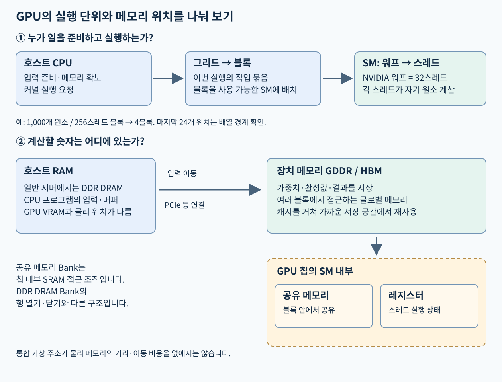
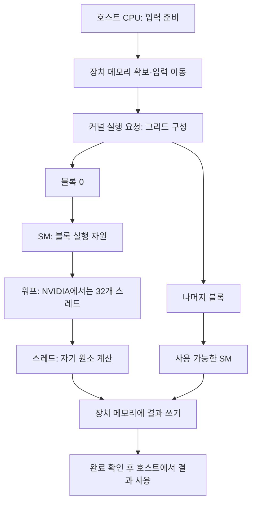

# 05. GPU·NPU와 모델 실행 — 연산기보다 데이터 이동부터 이해하기

[학습 안내](README.md) · 이전: [스토리지·RAID·부팅](04-storage-raid-boot.md) · 다음: [NIC·RDMA](06-networking-rdma.md)

이 장의 목표는 가속기 사양표를 실제 모델 실행과 연결하는 것이다. “TFLOPS가 높다”, “HBM이 크다”, “카드가 네 장이다”는 각각 다른 조건을 설명한다. 모델이 메모리에 들어가는지, 지원 연산으로 실행되는지, 원하는 지연시간과 처리량을 내는지를 따로 판단해야 한다.

## 읽기 전: 가속기와 프로그램의 관계

**가속기(accelerator)**는 특정 종류의 계산을 효율적으로 처리해 CPU의 작업 일부를 맡는 장치다. **GPU(Graphics Processing Unit, 그래픽 처리장치)**는 많은 데이터에 비슷한 일을 병렬로 처리하는 데 널리 쓰이며, **NPU(Neural Processing Unit, 신경망 처리장치)**는 신경망 계산과 데이터 이동에 맞춘 설계를 뜻한다. GPU가 있어도 프로그램 시작, 파일 읽기, 요청 처리를 맡는 CPU와 주메모리는 계속 필요하다.

**모델(model)**은 입력을 출력으로 바꾸는 계산 구조와 그 계산에 쓰는 숫자들의 묶음이다. **가중치(weight)**는 학습으로 정해지는 숫자이고, **활성값(activation)**은 입력을 처리하는 중간 계산 결과다. **계층(layer)**은 모델 계산을 나누어 부르는 한 단계다. 다음 절의 텐서와 행렬은 이런 숫자들을 배열에 담는 방법이다.

**지연시간(latency)**은 요청 하나가 완료될 때까지 걸리는 시간이고, **처리량(throughput)**은 일정 시간에 끝내는 작업 수나 데이터량이다. **배치(batch)**는 여러 입력을 묶어서 처리하는 단위다. 배치를 키워 처리량이 좋아져도 한 요청의 기다림은 길어질 수 있다. **TFLOP/s**는 초당 10¹²개의 부동소수점 연산을, **TOPS**는 초당 10¹²개의 연산을 나타낸다. 정밀도와 연산을 세는 조건을 함께 확인해야 비교할 수 있다.

뒤의 제품 사례에서 **A7은 NetAI 연구실의 특정 서버를 부르는 이름**, **RTX PRO 6000은 NVIDIA의 GPU 제품**, **RNGD는 FuriosaAI의 NPU 제품**이다. 일반 실행 원리를 먼저 배우고 제품마다 다른 조건을 대입한다.



그림의 위쪽은 누가 일을 준비하고 실행하는지, 아래쪽은 숫자가 어디에 놓이는지를 보여준다. 프로그램의 실행 단위인 스레드와 저장 장치인 메모리를 서로 다른 줄에서 읽어보자. 화살표를 따라 CPU가 준비한 입력이 장치 메모리로 이동하고, 가까운 저장 공간을 거쳐 계산되는 과정을 확인한다.

## 1. CPU·GPU·NPU는 무엇에 자원을 쓰는가?

CPU는 운영체제, 분기와 예외, 다양한 프로그램의 실행을 맡는다. 적은 수의 복잡한 흐름을 빠르게 진행시키는 능력이 중요하다. GPU는 많은 데이터에 비슷한 연산을 수행하는 병렬 처리에 많은 자원을 쓴다. NPU는 신경망에 자주 쓰이는 연산과 데이터 이동에 맞춰 하드웨어와 컴파일러를 설계한다.

이것은 설계 경향이지 능력을 둘로 나누는 법칙은 아니다. CPU도 벡터·행렬 연산을 하고 GPU도 제어 흐름을 실행한다. NPU 제품끼리도 지원 연산, 메모리 구조, 프로그래밍 모델이 다르다. 실제로는 어느 모델과 정밀도를 어떤 소프트웨어가 지원하는지 확인해야 한다.

| 구성 | 장점으로 기대하는 것 | 함께 확인할 것 |
|---|---|---|
| CPU | 범용 코드, OS·서비스 제어, 전처리 | 코어·메모리 채널·NUMA·실제 사용량 |
| GPU | 대규모 병렬 연산, 넓은 소프트웨어 생태계 | 정확한 GPU, 연산 정밀도, 메모리, 커널·통신 구현 |
| NPU | 지원하는 모델·연산에서 효율적인 데이터 이동과 실행 | 컴파일 가능성, 모델·shape·정밀도·SDK 제약 |

GPU/NPU가 있어도 요청 처리, 토큰화, 파일 로딩, 드라이버 호출에는 CPU와 호스트 RAM이 필요하다. 장치 사용률이 낮다면 카드가 느린 것 외에 CPU 전처리나 입력 공급 부족도 가설에 포함한다.


### scalar, vector, SIMD, SIMT를 한 줄씩 쌓기

scalar는 값 하나를 뜻한다.
`3 + 4`처럼 숫자 하나와 숫자 하나를 더하면 scalar 연산이다.
vector는 여러 값을 순서대로 모은 것이다.
`[1, 2, 3] + [10, 20, 30] = [11, 22, 33]`처럼 같은 위치끼리 더하면 vector 연산이다.
행렬(matrix)은 vector를 행과 열로 놓은 2차원 표이고, tensor는 축이 더 많아진 배열이다.
AI 모델의 입력, 가중치, activation은 결국 이런 숫자 배열이다.

SIMD(Single Instruction, Multiple Data)는 명령 하나가 여러 데이터 lane에 같은 일을 시키는 방식이다.
여기서 lane(연산 레인)은 명령이 처리하는 여러 데이터 위치를 뜻하며 PCIe의 물리 연결 레인과 같은 대상은 아니다. **CUDA**는 NVIDIA GPU용 병렬 컴퓨팅 플랫폼이며 GPU 작업을 표현하고 실행하는 프로그래밍 모델을 제공한다.
CPU의 벡터 명령을 생각하면 된다.
예를 들어 8개의 FP32 값을 한 명령으로 더할 수 있으면, 프로그래머가 보기에는 한 반복문이지만 하드웨어는 여러 lane을 동시에 움직인다.
SIMT(Single Instruction, Multiple Threads)는 NVIDIA GPU 설명에서 자주 나오는 실행 모델이다.
여러 thread가 같은 명령 흐름을 함께 진행하지만, 각 thread는 자기 register와 thread index를 갖는다.
분기가 갈라지면 같은 묶음 안의 thread들이 서로 다른 경로를 순차적으로 실행해야 해서 효율이 떨어질 수 있다.

```text
scalar: a0 + b0
vector/SIMD: [a0 a1 a2 a3] + [b0 b1 b2 b3]
SIMT: thread0은 c[0], thread1은 c[1], thread2는 c[2]를 계산하되 같은 커널 명령 흐름을 공유
```

GPU의 thread는 아주 가벼운 실행 단위다.
NVIDIA 용어에서 warp는 보통 함께 스케줄되는 32개 thread 묶음이고, block은 thread들을 묶어 shared memory와 동기화를 공유하는 단위다.
grid는 kernel launch 하나에 속한 block 전체다.
이 숫자들은 프로그래밍 모델의 단위이며, GPU 카드 수나 CPU core 수와 같은 말이 아니다.
VRAM은 GPU 가까이에 붙은 장치 메모리이고, thread/block은 그 VRAM에 있는 데이터를 읽어 계산하는 실행 단위다.

### 커널을 실행한다는 말: CPU가 준비하고 GPU가 숫자를 처리한다

GPU 문맥의 **커널(kernel)**은 GPU의 여러 스레드가 실행할 함수다. 운영체제의 중심인 **Linux 커널**과 같은 이름을 쓰지만 다른 대상이다. **호스트(host)**는 작업을 준비하고 장치를 제어하는 CPU 쪽 환경이고, **디바이스(device, 장치)**는 여기서는 GPU다. **런타임(runtime, 실행 지원 계층)**은 메모리 할당·복사·커널 실행 요청 같은 기능을 제공한다. **드라이버(driver)**는 운영체제가 장치와 통신하고 접근을 관리하게 해 주는 소프트웨어다.

벡터 `A+B`의 1,000개 원소를 GPU에서 더하는 과정을 추적하자.

1. 호스트가 배열 A와 B를 준비한다. 일반적인 분리 메모리 GPU에서는 이 시점의 배열이 CPU RAM에 있다.
2. 런타임으로 장치 메모리를 확보하고 입력을 복사한다. **H2D(Host to Device)**는 호스트에서 장치로, **D2H(Device to Host)**는 반대 방향의 이동이다.
3. 호스트가 `C[i]=A[i]+B[i]`를 실행할 GPU 커널을 요청한다. **커널 실행 요청(kernel launch)**은 함수의 실행 단위와 입력 위치 등을 지정해 장치에 일을 맡기는 단계다.
4. **그리드(grid)**는 이번 실행의 모든 블록이다. **블록(block)**은 서로 공유 메모리와 블록 내부 동기화를 사용할 수 있는 스레드 묶음이다. **스레드(thread)**는 자기 인덱스와 레지스터 상태를 갖고 코드를 실행한다. 이 스레드는 CPU의 OS 스레드와 다른 실행 모델이다.
5. NVIDIA GPU의 **SM(Streaming Multiprocessor)**은 블록들을 받아 스레드의 명령을 진행시키는 장치 내부 실행 자원 묶음이다. 일반적인 CUDA 블록은 한 SM에서 실행되고 여러 블록이 자원 조건에 따라 같은 SM에 머무를 수 있다.
6. SM은 스레드들을 **워프(warp)** 단위로 진행시킨다. NVIDIA CUDA의 워프는 32개 스레드다. 워프마다 준비된 명령을 선택해 진행하며, 어느 워프가 메모리를 기다리면 다른 워프의 준비된 명령을 실행할 수 있다.
7. 호스트가 결과를 사용할 때는 완료를 확인하고 필요한 데이터를 받는다. 비동기 요청의 제출이 끝났다는 사실과 실제 GPU 계산이 끝났다는 사실은 구별한다.



블록 크기를 256스레드로 정하면 `ceil(1000/256)=4`블록이 필요하다. **올림(ceil)**은 나눗셈 결과보다 작지 않은 가장 가까운 정수를 고르는 연산이다. 총 실행 위치는 1,024개이므로 마지막 24개에는 처리할 원소가 없다. 그래서 커널에 `i < 1000` 조건을 넣어 배열 밖에 쓰지 않게 한다. 블록 하나는 8워프이고 전체는 32워프지만, 이것이 32워프가 모두 같은 순간 실행된다는 뜻은 아니다. `스레드 인덱스 i = 블록 번호 × 256 + 블록 안 스레드 번호`라는 계산이 배열의 원소를 분담한다.

### 점유율과 분기: 스레드를 늘리는 것만으로 빠르게 만들 수 없는 이유

**점유율(occupancy)**은 SM이 지원하는 최대 워프 수 중 현재 자원을 확보하고 머무는 워프 수의 비율이다. GPU 사용률이나 실제 최대 연산 성능 달성률과 같은 수치가 아니다. 스레드마다 **레지스터(register, 가까운 계산 값 저장소)**가 필요하고 블록마다 공유 메모리가 필요해서 동시에 배치할 블록 수가 제한될 수 있다.

가상 SM에 레지스터 65,536개, 공유 메모리 48KiB, 최대 2,048스레드가 있다고 하자. 블록마다 256스레드이고 각 스레드가 레지스터 64개, 블록이 공유 메모리 16KiB를 쓰면 레지스터 조건은 `65536/(256×64)=4`블록, 공유 메모리 조건은 `48/16=3`블록이다. 다른 제한과 할당 단위 반올림을 무시하면 작은 값인 3블록, 768스레드가 머문다. 점유율은 `768/2048=37.5%`다. 실제 장치 수치가 아니라 공유 자원을 계산하는 예다. 점유율을 높이는 대신 재사용이 줄거나 레지스터 부족으로 장치 메모리에 값을 내보내면 오히려 느려질 수도 있다.

**분기 발산(branch divergence)**은 같은 워프의 스레드들이 조건문에서 서로 다른 길을 택하는 경우다. 각 경로에 참여하지 않는 스레드를 잠시 비활성으로 두고 명령을 진행해야 해 효율이 낮아질 수 있다. 구체적인 스케줄링은 GPU 세대에 따라 달라지지만 서로 다른 경로를 모든 스레드가 언제나 추가 비용 없이 함께 실행한다고 가정하지 않는다. [NVIDIA의 CUDA 실행 모델](https://docs.nvidia.com/cuda/cuda-programming-guide/01-introduction/programming-model.html).

## 2. 장치 안의 메모리를 구분하기

```text
호스트 DDR RAM
      ↕ PCIe 또는 특정 플랫폼의 CPU–GPU 연결
가속기의 GDDR / HBM
      ↕ 장치 내부 메모리 경로
캐시 / 명시적으로 관리되는 SRAM / 공유 메모리
      ↕
레지스터·연산 유닛
```

**GDDR(Graphics Double Data Rate)**와 **HBM(High Bandwidth Memory)**은 가속기 가까이에 배치하는 DRAM 계열이다. GDDR은 보통 장치 기판 위의 메모리 패키지와 높은 입출력 속도를 활용한다. HBM은 적층한 DRAM과 매우 넓은 연결을 장치 가까운 패키징에 결합해 큰 대역폭을 노린다. 대역폭은 초당 옮기는 양이며 저장 용량과 다른 지표다. GPU라면 모두 HBM을 쓰는 규칙은 없다. 제품 사례의 **RTX PRO 6000 Blackwell Server Edition은 96GB GDDR7**, RNGD는 공식 제품 사양상 **48GB HBM3**를 사용한다. [메모리 제조사 Micron의 HBM·GDDR 구조 비교](https://my.micron.com/content/dam/micron/global/public/products/technical-marketing-brief/ultra-bandwidth-solutions-tech-brief.pdf), [NVIDIA 제품 사양](https://www.nvidia.com/en-us/data-center/rtx-pro-6000-blackwell-server-edition/), [Furiosa RNGD 사양](https://furiosa.ai/rngd).

**SRAM**은 칩 안의 빠른 저장 공간에 널리 쓰인다. 같은 용량의 DRAM보다 칩 면적 비용이 높아 대규모 모델 전체를 무제한으로 담을 수 없다. 레지스터는 실행에 더 밀접한 작은 저장 공간이다. 캐시는 하드웨어가 재사용을 돕는 구조이고, scratchpad나 shared memory처럼 소프트웨어가 명시적으로 배치하는 공간도 있다. 모든 SRAM이 같은 접근·관리 방식을 갖는 것은 아니다.

모델 가중치가 GDDR/HBM에 있어도 연산할 때 필요한 부분을 더 가까운 저장 공간으로 가져온다. 가까운 공간에서 여러 번 재사용하면 먼 메모리에 반복 접근하는 양을 줄일 수 있다. 그러나 SRAM 용량·동시 작업·타일 크기의 제한이 있으므로 “HBM에서 한 번 읽으면 모델 전체가 계속 SRAM에 남는다”고 이해하면 안 된다.

강의에서 사용하는 연산 대비 SRAM·HBM 접근 비용 배수는 특정 공정·연산·단위·측정 조건의 설명값일 수 있다. **모든 GPU/NPU에서 항상 1:6:200이라는 물리 법칙은 아니다.** 기억할 핵심은 이동 비용이 크며, 지역성과 재사용을 설계해야 한다는 것이다.

### 글로벌 메모리, 공유 메모리, 레지스터는 누가 공유하는가?

CUDA의 **글로벌 메모리(global memory)**는 여러 블록의 스레드가 접근할 수 있는 장치 메모리 주소 공간이다. 일반적인 GPU에서는 GDDR/HBM 쪽 저장 공간을 주로 떠올릴 수 있다. **공유 메모리(shared memory)**는 블록의 스레드들이 명시적으로 함께 쓰는 GPU 칩 내부 저장 공간이다. CPU RAM을 모든 사용자에게 공유하는 기능이라는 뜻이 아니다. **레지스터(register)**는 각 스레드가 계산에 쓰는 가까운 값 저장소이며, **캐시(cache)**는 접근한 데이터의 재사용을 하드웨어가 돕는 구조다.

| 공간 | 기본적인 사용 범위 | 값이 놓이는 곳과 관리 방식 |
| --- | --- | --- |
| 호스트 메모리 | CPU 프로그램 | 일반 서버에서는 CPU 쪽 DDR RAM |
| 글로벌 메모리 | 장치의 여러 블록 | GDDR/HBM 등 장치 메모리; 할당·주소 지정 필요 |
| 공유 메모리 | 일반적인 CUDA의 같은 블록 | 칩 내부 SRAM; 프로그램이 담을 값과 동기화 결정 |
| 레지스터 | 스레드 자신의 실행 상태 | 칩 내부; 컴파일러가 배치, 자원 부족 시 다른 공간 사용 가능 |
| L1/L2 캐시 | 장치 구조에 따른 공유 범위 | 최근 데이터를 하드웨어가 보관; 용량·구조는 제품에 따라 다름 |

여기서 **스코프(scope)**는 어떤 실행 단위가 자원을 함께 사용할 수 있는지를 뜻한다. 같은 커널의 스레드라는 사실만으로 모두 같은 공유 메모리를 쓰는 것은 아니다. 일부 최신 GPU에는 블록 묶음 사이의 별도 공유 기능도 있지만, 그런 기능을 일반 블록 공유 메모리의 기본 규칙으로 섞지 않는다.

### 메모리 병합과 공유 메모리 Bank: 같은 Bank라는 이름의 다른 구조

**병합된 접근(coalesced access)**은 같은 워프의 스레드가 가까운 글로벌 메모리 주소에 접근해, 하드웨어가 요청을 효율적인 메모리 전송 묶음으로 처리할 수 있는 패턴이다. 스레드 0~31이 연속된 32비트 원소 0~31을 읽는 경우와, 멀리 떨어진 주소를 각자 읽는 경우를 비교하면 된다. 실제 전송 수는 정렬, 접근 크기, 캐시와 GPU 세대에 영향을 받는다. 단순히 스레드가 32개라고 무조건 전송 한 번은 아니다.

**공유 메모리 뱅크(shared-memory bank)**는 칩 내부 공유 메모리에 여러 스레드가 병렬로 접근하도록 나눈 자원 구역이다. [02장](02-cpu-memory-numa.md)의 DDR DRAM 뱅크는 행을 열고 닫는 구역이었다. 여기서는 SRAM 기반 공유 메모리의 병렬 접근 조직이다. 서로 다른 구조이므로 DRAM의 ACT/PRE 시간을 이 뱅크에 그대로 적용할 수 없다.

현재 NVIDIA 문서의 기본 32비트 접근 예에서는 연속된 32비트 워드가 32개 뱅크에 순서대로 배치된다. **워드(word)**는 여기서는 32비트 값 한 칸이다. 교육용 매핑 `bank = word_index % 32`에서 `%`는 나머지 연산이다.

- 스레드 번호 `t`가 워드 `t`를 읽으면 뱅크 0~31에 흩어져 접근한다.
- 스레드 `t`가 워드 `32×t`를 읽으면 나머지가 모두 0이라 서로 다른 주소가 같은 뱅크로 몰린다. 이것이 **뱅크 충돌(bank conflict)**이며 요청이 여러 번에 나뉘어 처리될 수 있다.
- 모두 같은 워드 0을 읽는 경우에는 읽은 값을 여러 스레드에 전달하는 **브로드캐스트(broadcast)**를 사용할 수 있어, 서로 다른 주소가 몰린 경우와 구별한다. 여러 스레드가 같은 주소에 동시에 쓰는 동작의 결과를 이 읽기 규칙으로 설명하지 않는다.

2차원 배열 한 행이 32워드이고 같은 열을 읽는다면 주소 간격이 32워드라 충돌할 수 있다. 한 행의 저장 폭을 33워드로 만드는 **패딩(padding, 배열에 여분의 공간 넣기)**을 적용하면 간격이 33이 되어 뱅크 번호가 분산된다. 더 많은 저장 공간을 쓰는 대신 접근 경합을 줄이는 사례다. 실제 커널은 자료형과 GPU 구조를 함께 확인한다. [NVIDIA의 공유 메모리 접근과 패딩 예제](https://docs.nvidia.com/cuda/cuda-programming-guide/02-basics/writing-cuda-kernels.html).

## 3. 행렬곱·텐서 수축과 데이터 재사용

행렬곱 `C[i,j] = Σk A[i,k] × B[k,j]`에서 공통 인덱스 k를 따라 곱하고 합산한다. 텐서 수축은 이 아이디어를 여러 축으로 확장한 것이다. 예를 들어 `A[b,l,e]`와 `B[e,f]`를 곱해 e축을 합치면 결과는 `C[b,l,f]`가 된다.

계산 순서와 데이터를 자르는 방향에 따라 같은 값을 몇 번 다시 읽어야 하는지가 달라진다. 작은 타일을 가까운 메모리에 올리고 여러 출력 계산에 재사용하면 이동량을 줄일 수 있다. 어떤 타일을 어느 연산기에 놓을지와 언제 옮길지는 하드웨어 구조·컴파일러·커널 구현이 함께 결정한다.

RNGD의 Tensor Contraction Processor는 이러한 텐서 분할·배치·데이터 이동을 컴파일러와 하드웨어가 함께 다루는 설계다. 이 문맥에서 TCP는 **네트워크의 Transmission Control Protocol과 다른 약어**다. [Furiosa TCP 논문](https://furiosa.ai/download/FuriosaAI-tensor-contraction-processor-isca24), [RNGD tensor DMA 설명](https://developer.furiosa.ai/furiosa-opt/book/moving-tensors/dma-engine.html).

GPU에도 타일링, 공유 메모리, 캐시, 연산 융합, Tensor Core와 재사용 최적화가 있다. “GPU는 텐서를 행렬로 바꾸므로 재사용 정보를 항상 모두 잃는다”는 일반화는 맞지 않는다. 하드웨어와 커널·컴파일러가 어떤 모델에서 얼마나 효율적으로 재사용을 실현하는지를 비교해야 한다. [CUDA Best Practices의 메모리 최적화](https://docs.nvidia.com/cuda/cuda-c-best-practices-guide/index.html#memory-optimizations).


### 2×2 행렬곱을 실제 숫자로 보기

행렬곱은 큰 모델의 기본 재료지만, 처음에는 2×2로 충분하다.

```text
A = [1 2]    B = [5 6]
    [3 4]        [7 8]

C[0,0] = A[0,0]×B[0,0] + A[0,1]×B[1,0] = 1×5 + 2×7 = 19
C[0,1] = A[0,0]×B[0,1] + A[0,1]×B[1,1] = 1×6 + 2×8 = 22
C[1,0] = A[1,0]×B[0,0] + A[1,1]×B[1,0] = 3×5 + 4×7 = 43
C[1,1] = A[1,0]×B[0,1] + A[1,1]×B[1,1] = 3×6 + 4×8 = 50

C = [19 22]
    [43 50]
```

각 출력 원소는 곱셈 두 번과 덧셈 한 번으로 만들어졌다.
GPU에서는 thread 하나가 출력 원소 하나를 맡을 수도 있고, 여러 thread가 한 원소의 부분합을 나눠 계산할 수도 있다.
큰 행렬곱에서는 A의 한 조각과 B의 한 조각을 shared memory나 cache에 올려 여러 C 원소 계산에 재사용한다.
타일링(tiling)은 이 조각 크기와 순서를 정하는 기법이다.

왜 재사용이 중요한지 synthetic 숫자로 보자.
한 thread가 C 원소 하나만 생각 없이 계산하면 A와 B 값을 매번 VRAM에서 다시 읽는다.
반대로 16×16 타일을 가까운 메모리에 올리면 같은 A 값 하나가 여러 B 열과 곱해지고, 같은 B 값 하나가 여러 A 행과 곱해진다.
연산량은 같아도 먼 메모리 왕복이 줄어든다.
이것이 Tensor Core, shared memory, compiler tiling, kernel fusion이 모두 데이터 이동을 줄이려는 이유다.

## 4. 연산 성능과 메모리 성능을 연결하는 간단한 계산

**연산 집약도(arithmetic intensity)**는 특정 메모리 경계를 오간 데이터 1byte당 수행한 연산 수다. 계산 대상 경계가 HBM인지 PCIe인지 반드시 정한다.

```text
연산 집약도 I = 수행 연산 수 / 해당 경계를 이동한 bytes
처리 성능의 단순 상한 ≈ min(연산기 최대 성능, 메모리 대역폭 × I)
```

이는 병목을 생각하는 단순한 모델이며, 실제 지연·명령 발행·통신·커널 효율은 더 고려해야 한다. 예를 들어 가상의 장치가 100TFLOP/s, 메모리 대역폭이 1TB/s라고 하자.

- 집약도 10FLOP/byte인 작업은 메모리 쪽 상한이 10TFLOP/s다. 연산기만 두 배로 늘려도 이 상한은 그대로다.
- 집약도 200FLOP/byte인 작업은 메모리 계산값이 200TFLOP/s이므로 연산기 쪽 100TFLOP/s가 먼저 제한한다.

따라서 “AI는 모두 memory-bound”도, “행렬곱은 언제나 compute-bound”도 충분한 설명이 아니다. 행렬 크기, 배치, 재사용, 정밀도, 통신과 구현을 함께 본다.


### PCIe 전송까지 포함한 roofline 계산

roofline을 쓸 때 가장 흔한 실수는 장치 안 HBM/GDDR 대역폭만 보고, 호스트에서 장치로 데이터를 옮기는 시간을 빼먹는 것이다.
가상의 예를 보자.

```text
가상 작업:
입력 8GiB를 CPU RAM에서 GPU VRAM으로 복사
GPU에서 160TFLOP의 계산 수행
결과 1GiB를 GPU VRAM에서 CPU RAM으로 복사

가상 장치:
GPU 계산 상한 = 100TFLOP/s
PCIe 유효 전송률 = 한 방향 25GB/s
```

계산만 보면 `160 / 100 = 1.6초`가 하한이다.
전송은 단순 십진 GB로 거칠게 계산하면 `(8GiB + 1GiB) ≈ 9.66GB`이고, `9.66 / 25 ≈ 0.39초`다.
전송과 계산을 완전히 겹치지 못하면 총 하한은 약 `1.99초`다.
입력이 매 요청마다 새로 오고 결과를 모두 다시 CPU로 가져와야 한다면 PCIe가 무시할 수 없는 시간이 된다.
모델 가중치를 VRAM에 상주시켜 반복 재사용하면 매 요청마다 가중치를 PCIe로 보내지 않아도 되므로 계산이 완전히 달라진다.

Amdahl의 법칙은 병렬화해도 남는 직렬 구간이 전체 속도 향상을 제한한다는 법칙이다.
전체 시간 중 90%가 GPU로 10배 빨라지고, 10%가 CPU 전처리·네트워크·동기화로 그대로라면 전체 속도 향상은 다음과 같다.

```text
새 시간 = 0.9 / 10 + 0.1 = 0.19
속도 향상 = 1 / 0.19 ≈ 5.26배
```

따라서 GPU를 두 배로 늘렸는데 서비스가 두 배 빨라지지 않아도 이상한 일이 아니다.
토큰화, 데이터 로딩, PCIe 복사, collective 통신, scheduler 대기, Python 오버헤드 같은 남은 구간을 같이 재야 한다.

## 5. FP32·BF16·FP16·FP8·INT4와 사양표 읽기

숫자를 몇 비트로 표현하느냐는 메모리 사용량, 연산 속도, 표현 범위·오차에 영향을 준다. BF16과 FP16은 둘 다 16bits지만 지수와 가수의 배분이 달라 표현 특성이 같다거나 완전히 교환 가능하다고 볼 수 없다.

| 표기 | 저장 크기의 단순 기준 | 주의할 점 |
|---|---|---|
| FP32 | 값당 4bytes | 모든 연산에서 필요한 정밀도인지 검토 |
| FP16 / BF16 | 값당 2bytes | 모델·누산 방식·커널 지원에 따라 선택 |
| FP8 / INT8 | 값당 약 1byte | 스케일·보정 등 추가 정보와 정확도 검증 필요 |
| INT4 등 4bit 양자화 | 값당 약 0.5byte | 패킹·스케일·그룹 메타데이터·변환 비용 추가 |

`1000 TOPS`와 `500 TFLOPS`는 정밀도·연산 종류가 다르면 숫자만 비교할 수 없다. 구조적 sparsity를 가정한 수치인지, dense 연산인지, 곱셈과 덧셈을 몇 연산으로 세었는지, 어떤 전력 설정에서 나온 값인지 확인한다.

가중치를 4bit로 바꿨다고 activation과 KV cache까지 자동으로 4bit가 되는 것은 아니다. 모델 품질과 실제 커널 지원이 필요하며, 양자화 파일이 작아져도 실행 중 추가 버퍼 때문에 메모리 사용량이 파일 크기와 같지는 않다.


### 양자화는 압축, 근사, 커널 지원을 함께 요구한다

정밀도를 낮추면 값 하나가 차지하는 byte가 줄어 메모리와 대역폭 부담이 줄 수 있다.
하지만 숫자 표현을 줄인다는 것은 실제 값을 근사한다는 뜻이다.
예를 들어 FP32 가중치 `0.13742`를 INT8로 저장하려면 어떤 scale을 정하고 정수 범위에 맞게 반올림한다.
나중에 계산할 때는 그 scale을 적용해 근사값으로 쓴다.

```text
synthetic INT8 양자화 예:
scale = 0.01
실수 0.13742 → 정수 round(0.13742 / 0.01) = 14
복원 근사값 = 14 × 0.01 = 0.14
```

이 작은 오차가 모델 전체에서는 거의 영향이 없을 수도 있고, 특정 layer나 긴 문맥에서 품질 저하를 만들 수도 있다.
그래서 양자화는 파일 크기 계산으로 끝나지 않는다.
calibration 데이터, per-tensor/per-channel/per-group scale, activation quantization 여부, 누산 정밀도, 해당 GPU/NPU 커널 지원을 확인한다.
지원 커널이 없으면 작은 파일을 로드해도 실행 중 다시 높은 정밀도로 dequantize하여 메모리와 시간이 늘 수 있다.

학습과 추론도 다르다.
학습은 작은 gradient 변화가 누적되므로 optimizer state와 누산 정밀도가 중요하고, 역전파 activation 저장도 필요하다.
추론은 보통 가중치와 KV cache, 요청 scheduler가 더 큰 운영 변수다.
따라서 "4bit면 4분의 1 메모리"라는 말은 가중치 파일의 거친 하한일 뿐, 실행 메모리 총량이나 품질을 보장하지 않는다.

## 6. 모델이 메모리에 들어가는지 계산하기

가중치만의 대략적인 하한은 다음과 같다. 여기서 B는 billion, 즉 10억 개의 파라미터다.

```text
가중치 bytes ≈ 파라미터 수 × 파라미터당 bytes

70B × 2bytes = 140GB       # 16bit 가중치만
70B × 0.5bytes = 35GB     # 4bit 가중치만, 부가 정보 제외
```

실제 실행에는 여기에 KV cache, activation, 임시 workspace, 통신 버퍼, 런타임 예약 공간, 양자화 메타데이터가 추가된다. 학습에서는 gradient와 optimizer state 등도 필요하므로 추론 메모리 계산을 그대로 적용하지 않는다.

MoE 모델의 **전체 파라미터 수**와 **토큰당 활성 파라미터 수**도 구분한다. 토큰마다 일부 expert만 계산해도 전체 expert 가중치를 메모리에 유지하는 구현이 있다. 활성 파라미터만 곱해 저장 용량을 계산하면 크게 부족해질 수 있다. offload를 쓰면 저장 위치와 통신 비용을 별도로 계산한다.

카드 4개의 메모리를 더한 값은 분산 배치 가능한 총량의 출발점일 뿐이다. 프레임워크가 모델을 나누는 방식과 카드별로 가장 많이 차지하는 shard를 확인해야 한다. 하나의 텐서나 특정 layer가 한 카드에 남는 구성도 있다.

## 7. Prefill·Decode·KV cache

**토큰(token)**은 텍스트를 모델 입력 숫자로 바꿀 때 쓰는 단위다. 한 글자 또는 한 단어와 언제나 같지는 않다. **토큰화(tokenization)**는 문자열을 토큰 번호 배열로 바꾸는 과정이다. **자기회귀(autoregressive)** 생성은 앞에서 받은 입력과 지금까지 만든 출력에 조건을 두어 다음 토큰을 하나씩 선택한다.

**어텐션(attention)**은 현재 위치가 다른 위치의 정보를 얼마나 사용할지 점수를 만들고 그에 따라 값들을 섞는 계산이다. **쿼리(Query, Q)**는 지금 찾을 정보의 표현, **키(Key, K)**는 각 위치를 비교할 표현, **값(Value, V)**은 선택 정도에 따라 섞을 정보의 표현이다. 사람이 정한 키워드 목록이 아니라 모델 계산으로 만든 숫자 배열이다. 예를 들어 두 값이 2와 10이고 참고 비율이 0.25와 0.75라면 결과는 `0.25×2+0.75×10=8`이다. 실제 어텐션의 점수 계산과 여러 차원의 배열은 [AI 텐서·모델 장](../../../ai/learning/ai-infrastructure/01-tensors-autograd-and-transformers.md)에서 이어서 배운다.

**Prefill**은 입력 토큰들을 처리해 생성에 필요한 상태를 준비하는 구간이다. **Decode**는 그 상태와 이전 결과를 사용해 출력 토큰을 이어서 생성하는 구간이다. 실서비스에서는 큐 대기, tokenization, chunked prefill과 동시 요청 스케줄링도 시간에 영향을 준다.

| 구간/지표 | 의미 | 자주 영향을 주는 것 |
|---|---|---|
| Prefill | 입력 문맥 처리 | 입력 길이·배치·연산량·attention 구현 |
| Decode | 출력 토큰을 순차 생성 | 가중치/KV 접근·배치·통신·연산 |
| TTFT | 요청 후 첫 토큰까지 시간 | 대기·전처리·prefill·스케줄링·전송 |
| TPOT | 출력 토큰 사이의 평균 시간 | 반복 decode와 스케줄링 |
| E2E latency | 요청 시작부터 종료까지 | 위 구간 전체 |

큰 prefill은 연산 활용도가 높고 작은 배치 decode는 메모리 대역폭에 제한되는 경우가 흔하다. 그러나 배치, 긴 문맥 attention, offload, 통신 때문에 병목이 달라질 수 있다. “prefill은 무조건 연산, decode는 무조건 메모리”로 판정하지 않는다.

단순한 자기회귀 full-attention에서 KV cache는 이전 토큰의 Key/Value를 저장해 다시 계산하는 일을 줄인다. 예제로 다음 형태를 사용한다.

```text
KV bytes ≈ 2(K와 V) × layer 수 × 토큰 수 × KV head 수
           × head 차원 × 값당 bytes × 동시에 유지하는 시퀀스 수

2 × 32 × 4096 × 8 × 128 × 2 × 1
= 536,870,912 bytes = 512MiB
```

이 예제에서 동시 시퀀스가 32개이고 길이가 모두 같다면 약 16GiB다. 실제로는 GQA/MQA, sliding window, cache 양자화, prefix 공유, paging·정렬·예약, 병렬화 방식에 따라 달라진다. **attention head 수와 KV head 수를 혼동하지 않는다.**


### KV cache를 도서관 색인처럼 이해하기

자기회귀 LLM은 다음 토큰을 만들 때 이전 토큰들을 계속 참고한다.
이전 토큰의 Key와 Value를 매번 처음부터 다시 계산하면 같은 일을 반복한다.
KV cache는 이전 토큰의 Key/Value를 저장해 두고, 다음 decode 단계에서 재사용하는 저장 공간이다.
정확히 말하면 책의 문장을 저장하는 색인이 아니라 attention 계산에 필요한 중간 텐서를 저장하는 것이다.
비유의 대응은 "나중에 다시 찾을 정보를 미리 정리해 둔다"는 데까지만 맞고, cache 안의 값은 사람이 읽는 단어가 아니다.

한 요청이 길어질수록 cache가 커지고, 동시에 유지하는 요청이 많을수록 거의 곱으로 늘어난다.
그래서 작은 모델도 긴 context와 높은 동시성을 주면 VRAM이 먼저 찰 수 있다.
반대로 prefix caching, paged attention, sliding window, GQA/MQA는 같은 답을 더 적은 저장·이동으로 만들기 위한 구현 선택이다.
이 기능들의 이름이 같아도 엔진별 동작과 제약이 다르므로 버전과 설정을 남긴다.

모든 요청의 KV가 항상 완전히 별개라고 단정할 수도 없다. 지원되는 prefix caching은 공통 프롬프트의 일부 계산·캐시를 재사용할 수 있다. 어떤 캐시 구현을 사용하는지는 엔진과 버전으로 확인한다. [Hugging Face KV cache 문서](https://huggingface.co/docs/transformers/en/kv_cache).

## 8. 여러 장을 쓰는 TP·PP·DP

**병렬화(parallelism)**는 작업을 여러 실행 단위에 나누는 것이다. 모델 전체가 한 카드에 들어가지 않으면 가중치나 계층을 나누어 저장할 수 있고, 요청이 많으면 모델 복제본에 요청을 분산할 수 있다. 나눠 놓은 부분을 **샤드(shard)**, 같은 내용을 별도로 가진 것을 **복제본(replica)**이라고 부른다. 둘은 메모리 요구와 통신 목적이 다르다.

분산 실행의 **랭크(rank)**는 통신에 참여하는 실행 단위에 붙이는 번호다. **월드 크기(world size)**는 같은 실행 그룹의 참가자 수다. `rank 0~3, world size 4`는 네 참가자를 구별한다는 뜻이지 DIMM이 4R이라는 뜻이 아니다. 아래 TP·PP·DP는 이 참가자들이 계산을 어떻게 분담하는지 설명한다. [NCCL의 통신 참가자 번호 정의](https://docs.nvidia.com/deeplearning/nccl/user-guide/docs/usage/communicators.html).

| 방식 | 무엇을 나누는가? | 어떤 통신/비용을 생각하는가? |
|---|---|---|
| Tensor Parallelism(TP) | layer 안의 텐서·계산을 여러 실행 단위에 분할 | layer마다 중간 결과를 모으는 통신이 잦을 수 있음 |
| Pipeline Parallelism(PP) | layer 구간을 여러 단계로 분할 | 단계 사이 activation 전송, 파이프라인 대기 |
| Data Parallelism(DP) | 요청/데이터를 여러 모델 실행 복제본에 분산 | 추론에서는 복제 메모리와 요청 분배; 학습에서는 gradient 동기화도 중요 |

카드를 늘리면 모델을 담을 여유나 처리량은 늘 수 있지만 통신·동기화 비용도 생긴다. 단일 요청 지연을 줄이는 목표와 다수 요청 처리량을 늘리는 목표가 같은 배치를 요구하지 않을 수 있다.

### RNGD의 PE와 TP 숫자는 버전까지 확인

RNGD는 카드당 8개 PE를 갖는다. 네 장의 물리 PE 총수는 32다. 하지만 **32PE가 존재한다는 사실과 `tensor_parallel_size=32`가 현재 SDK에서 지원된다는 사실은 별개**다.

2026-09-21에 확인한 Furiosa 문서는 **2026.3.0에서 TP 크기를 4 또는 8로 제한**한다고 설명한다. 네 장의 예로 `TP=8, PP=4, DP=1`과 `TP=4, PP=2, DP=2`를 제시한다. 반면 이전 2025.3.0 문서도 별도로 존재하므로 강의·artifact·SDK의 버전을 섞어 해석하지 않는다. [현재 Model Parallelism 문서](https://developer.furiosa.ai/latest/en/furiosa_llm/model-parallelism.html), [2025.3.0 artifact 예제](https://developer.furiosa.ai/v2025.3.0/en/furiosa_llm/build-artifacts-by-examples.html).

위 내용은 확인한 문서 버전의 제약이다. A7에 설치된 드라이버 패키지 버전만으로 Furiosa-LLM의 버전과 모델 artifact 구성을 추정하지 않는다. 모델 카드·컴파일 설정·설치된 런타임을 함께 확인한다. 이 교재 작성 중 모델을 재컴파일하거나 실행하지 않았다.

## 9. 컴파일·버킷·드라이버·펌웨어의 역할

| 계층 | 하는 일 | 문제가 있을 때의 예 |
|---|---|---|
| 모델·정밀도·그래프 | 수행할 수학 연산과 가중치 정의 | 지원하지 않는 연산, 잘못된 양자화 |
| 컴파일러·커널 라이브러리 | 연산을 분할하고 장치 실행·이동 계획 생성 | shape/타깃 아키텍처/버전 불일치 |
| artifact/engine | 특정 조건에 맞게 준비된 실행 결과물 | 다른 카드·TP·런타임과 호환되지 않음 |
| 런타임·서빙 엔진 | 메모리, 요청, 배치, 실행과 통신 관리 | 예약 메모리·동시성·큐 문제 |
| 커널 드라이버 | OS와 PCIe 장치를 연결 | 커널 호환, 장치 접근·DMA 오류 |
| 장치 펌웨어 | 카드 내부 제어·실행 지원 | 드라이버 조합 불일치, 장치 상태 문제 |

입력 shape별 실행 계획이 필요한 구현에서는 자주 쓰는 길이·배치 크기를 **버킷(bucket)**으로 준비하고 그중 맞는 계획을 선택할 수 있다. 가능한 입력을 모두 같은 효율로 처리한다는 뜻은 아니다. 패딩과 버킷 개수, 컴파일 시간·저장 공간 사이의 절충이 생긴다. 버킷은 컴파일/서빙의 개념이며 물리 PE 개수와 다르다.

CUDA GPU도 커널 선택, shape 특화, 그래프 최적화 등을 사용한다. “GPU는 컴파일이 전혀 필요 없고 NPU만 컴파일한다”는 구분도 정확하지 않다. 어떤 단계가 사전·실행 시점에 수행되는지, 입력 변화에 얼마나 유연한지가 제품·소프트웨어마다 다르다.

Unified Memory나 통합 가상 주소 공간은 여러 물리 메모리를 프로그래밍하기 쉽게 만드는 기능이다. 서로 다른 메모리의 물리적 거리와 이동 비용까지 없애지는 않는다. OS·GPU·드라이버·연결에 따라 지원 방식도 다르다. [CUDA Unified/System Memory](https://docs.nvidia.com/cuda/cuda-programming-guide/02-basics/understanding-memory.html).

## 10. 장치 분할·가상화·스케줄링

GPU 한 장을 여러 사용자에게 나누는 방법에는 시간 공유, 프로세스 간 공유, MIG(Multi-Instance GPU, 한 GPU를 여러 하드웨어 격리 인스턴스로 나누는 NVIDIA 기능) 같은 지원 하드웨어의 자원 분할, vGPU(virtual GPU, 하이퍼바이저·드라이버가 제공하는 가상 GPU 노출) 등이 있다. **분할된 논리 장치 수가 물리 카드 수나 메모리 총량을 늘리지는 않는다.** 격리하는 자원, 지원 프로파일, 드라이버·라이선스·플랫폼 조건을 확인한다.

컨테이너에 GPU를 보이게 하는 것과 호스트 드라이버를 설치하는 것도 다른 일이다. 컨테이너가 host PCIe 배선을 바꾸지는 않는다. Kubernetes의 GPU/NPU 자원 할당이 NUMA·NIC·메모리 배치를 자동으로 최적으로 만든다고 가정하지 않는다.

RTX PRO 6000 Server Edition은 NVIDIA의 특정 MIG/vGPU 지원이 있는 제품이지만, 이 노드에서 활성화했는지는 별도 설정 조회가 필요하다. **NVLink는 미지원**으로 공식 표에 명시돼 있다. MIG 지원과 NVLink 지원은 서로 다른 기능이다. [NVIDIA 지원 GPU 표](https://docs.nvidia.com/vgpu/sizing/virtual-workstation/latest/gpus-vws.html).

## 11. 상태·성능·품질을 서로 다른 증거로 검증

| 확인 단계 | 답할 수 있는 질문 | 아직 답하지 못하는 질문 |
|---|---|---|
| PCIe 열거 | 장치가 OS에 보이는가? | 드라이버와 추론이 정상인가? |
| SMI의 alive·온도·전력 | 조회 시 장치 상태가 어떤가? | 최대 부하를 견디는가? |
| 프로세스·사용률 | 누가 어느 장치를 쓰는가? | 최대 가능한 처리량을 내는가? |
| 진단·통신 측정 | 정해진 조건의 오류·통신 성능은 어떤가? | 실제 모델의 응답 품질·지연은 어떤가? |
| 모델 검증 | 해당 모델/정밀도/부하에서 결과가 어떤가? | 다른 모델·문맥·동시성에서도 같은가? |

사용률 100%가 사양표 최대 FLOPS 달성을 뜻하지 않는다. 무엇의 활성 시간을 집계했는지 확인한다. 측정은 모델, 입력/출력 길이, 동시성, 정밀도, 워밍업, 버전, 전력 제한, 링크·NUMA 조건을 같이 남겨야 비교할 수 있다.

A7의 CARD-B는 다른 PE binning 값, 225W 전력 제한과 1.7GHz 동작이 함께 관측됐다. 이를 “등급 불량이 확정됐다”거나 “슬롯 이동으로 고쳐진다”고 단정하지 않는다. 해당 원인은 공급자 확인 대상이다. [원시 값과 판정 범위](../../npu/a7-rngd-slot-numa-binning-2026-09-21.md).

## 연습 문제와 해설

**문제 1.** 70B 모델을 4bit로 만들면 35GB 카드에 반드시 들어가는가?

**해설:** 아니다. 35GB는 단순 가중치 하한이다. 메타데이터·KV·activation·workspace·런타임과 배치 분할을 포함해야 한다.

**문제 2.** 메모리 대역폭 2TB/s, 연산 성능 200TFLOP/s인 가상 장치에서 집약도 20FLOP/byte 작업의 단순 상한은?

**해설:** `2TB/s × 20FLOP/byte = 40TFLOP/s`. 연산기 상한보다 낮다. 계산한 메모리 경계와 실제 재사용량이 맞는지 확인한다.

**문제 3.** RNGD 네 장을 봤으니 TP32 옵션을 쓰면 되는가?

**해설:** 물리 PE는 32개지만 지원 TP·PP·DP는 SDK와 artifact에 달려 있다. 확인한 2026.3.0 문서는 TP 4/8을 명시한다. 해당 문서를 다른 SDK 버전에 자동 적용하지도 않는다.

**문제 4.** TTFT가 길지만 이후 토큰 간 간격은 짧다. 무엇을 나눠 측정하는가?

**해설:** 요청 큐, 전처리, prefill과 초기 스케줄링을 decode와 분리한다. HBM 대역폭 한 가지 원인으로 확정하지 않는다.

**문제 5.** 전체 시간의 80%가 GPU 계산이고 이를 4배 빠르게 만들었다. 나머지 20%는 그대로라면 전체 속도 향상은?

**해설:** 새 시간은 `0.8 / 4 + 0.2 = 0.4`이므로 `1 / 0.4 = 2.5배`다. GPU 계산만 빨라져도 직렬 구간이 남는다.

**문제 6.** 2×2 행렬곱에서 `A=[[1,2],[3,4]]`, `B=[[5,6],[7,8]]`일 때 `C[1,0]`은?

**해설:** `3×5 + 4×7 = 43`이다. 출력 원소 하나는 A의 한 행과 B의 한 열의 dot product다.

**문제 7.** 1,000개 원소를 256스레드 블록으로 처리할 때 블록 수와 마지막 블록에서 제외할 스레드 수는?

**해설:** 4블록, 전체 1,024개 위치 중 24개다. 각 스레드는 `i<1000`을 확인해야 한다. 블록 수와 물리 SM 수가 같아야 할 필요는 없다.

**문제 8.** 교육용 공유 메모리 매핑에서 스레드 `t`가 워드 `32t`를 읽는 경우와 `33t`를 읽는 경우의 뱅크 번호는?

**해설:** `32t%32=0`이므로 전자는 한 뱅크의 서로 다른 주소에 몰린다. `33t%32=t`(t=0~31)이므로 후자는 뱅크가 분산된다. 이것은 GPU 칩 내부 공유 메모리 예이며 DDR DRAM 행 충돌과는 다른 현상이다.

**문제 9.** CPU RAM 128GB와 GPU 메모리 48GB가 있고 통합 가상 주소 기능을 켰다. 물리적으로 같은 속도의 176GB 메모리가 되는가?

**해설:** 주소를 다루기 편해지는 것과 실제 저장 위치가 같아지는 것은 다르다. 일반적인 분리 메모리 장치에서는 CPU와 GPU 사이의 이동·접근 비용과 각 공간의 용량을 별도로 고려해야 한다.

[학습 안내](README.md) · 다음: [06. NIC·Ethernet·InfiniBand·RDMA](06-networking-rdma.md)
