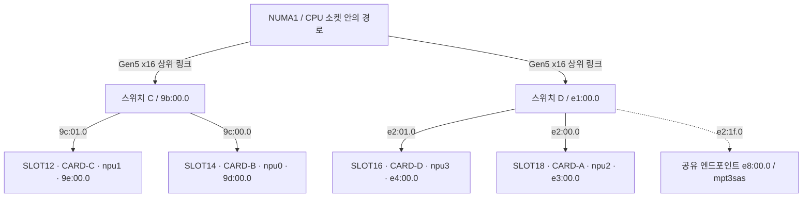

# A7 RNGD NPU 작업일지 — SLOT18 이전 후 진단 (2026-09-22)

- 대상: XFUSION G6550 V8, RNGD NPU 4장
- 부팅 시각: 2026-09-22 14:10:40 KST
- 범위: CARD-A의 SLOT10→SLOT18 이전 후 장치 식별, PCIe·NUMA·토폴로지, binning·전력 상태 및 설치된 진단 도구의 정보 위주 실행 결과 확인
- 공개 범위: 실제 시리얼·UUID, 내부 주소·계정·접속 경로, 인증 정보와 원시 머신 덤프는 싣지 않는다. 카드 식별에는 CARD-A/B/C/D 별칭만 사용한다.

## Current status

- **이전 확인 완료:** CARD-A는 이전의 `npu0 / 81:00.0 / SLOT10 / NUMA0`에서 현재 `npu2 / e3:00.0 / SLOT18 / NUMA1`로 이동했다. 실제 카드 동일성은 비공개 시리얼로 대조했다.
- **기본 상태 정상:** 네 장 모두 인식되고 `alive`이며, 47.5GiB HBM 중 사용량은 조회 당시 모두 0이었다. 각 엔드포인트는 Gen5 32GT/s x16이고 PCIe AER correctable/non-fatal/fatal 카운터는 모두 0이었다.
- **배치 목표 달성:** 네 장 모두 NUMA1에 있다. CARD-B/C가 같은 스위치 아래 `Bridge`, CARD-A/D가 같은 스위치 아래 `Bridge`이며 두 쌍 사이 경로는 `Cpu`다. 이전 토폴로지의 CPU 소켓 간 경로를 뜻하는 `Interconnect` 표시는 없어졌다.
- **CARD-B의 기존 차이 유지:** PE2 binning `0x0162`, 1.7GHz, 225W 제한은 이전 전부터 확인된 상태다. 이번에는 `power_sense=0`과 부팅 경고도 확인했으나, 이 두 항목이 이전 전부터 같았는지는 확보한 기록만으로 확인하지 못했다.
- **정보 위주 진단 1회 완료:** 14:40:25–14:40:27 KST에 HAL benchmark와 stress test를 제외한 `rngd-diag`가 종료 코드 0으로 끝났다. 보고서에는 stress/HAL 결과 구간이 없지만 governor 전환 시험을 포함하거나 나타내므로 순수 읽기 전용 실행으로 분류하지 않는다.
- **최종 governor 확인:** 후속 `furiosa-smi info`에서 네 장 모두 `Performance`로 확인했다. 진단 전후 감시 스냅샷은 같았지만 실행 중 일시 상태까지 변하지 않았다고 확대 해석하지 않는다.
- **실부하 진단 보류:** 전체 진단 직전 `sudo furiosa-smi ps`에서 CARD-A의 현재 장치인 `npu2:0`을 사용하는 애플리케이션 프로세스가 발견됐다. 14:47:37 KST 최종 확인에도 계속 열려 있었다. 표시 메모리와 utilization이 0이어도 장치를 연 프로세스가 존재하므로 사용자가 허용한 “아무도 NPU를 사용하지 않을 때” 조건을 충족하지 않는다. full-load 및 P2P 성능 진단을 시작하지 않았고, 해당 프로세스를 중지하거나 종료하지 않았다.

## 1. 이전 전후 카드 매핑

장치 번호와 BDF는 카드의 고정 식별자가 아니다. 아래 별칭은 비공개 시리얼 대조 결과를 기준으로 한다.

| 카드 | 2026-09-21 이전 | 2026-09-22 현재 | 현재 NUMA / 링크 | 결과 |
|---|---|---|---|---|
| CARD-A | npu0 / `81:00.0` / SLOT10 | npu2 / `e3:00.0` / SLOT18 | NUMA1 / 32GT/s x16 | 이동 및 동일 카드 확인 |
| CARD-B | npu1 / `9d:00.0` / SLOT14 | npu0 / `9d:00.0` / SLOT14 | NUMA1 / 32GT/s x16 | 위치 유지, 장치 번호 변경 |
| CARD-C | npu2 / `9e:00.0` / SLOT12 | npu1 / `9e:00.0` / SLOT12 | NUMA1 / 32GT/s x16 | 위치 유지, 장치 번호 변경 |
| CARD-D | npu3 / `e4:00.0` / SLOT16 | npu3 / `e4:00.0` / SLOT16 | NUMA1 / 32GT/s x16 | 변화 없음 |

실제 후면 슬롯의 물리 순서와 스위치 포트는 다음과 같다.

| 후면 물리 순서 | 현재 장치 / 카드 | 스위치 경로 |
|---|---|---|
| SLOT12 | npu1 / CARD-C | 스위치 C: `9b:00.0 → 9c:01.0 → 9e:00.0` |
| SLOT14 | npu0 / CARD-B | 스위치 C: `9b:00.0 → 9c:00.0 → 9d:00.0` |
| SLOT16 | npu3 / CARD-D | 스위치 D: `e1:00.0 → e2:01.0 → e4:00.0` |
| SLOT18 | npu2 / CARD-A | 스위치 D: `e1:00.0 → e2:00.0 → e3:00.0` |

이전 기록의 후면 기준으로 CARD-A는 첫 GPU가 있는 SLOT4부터 두 슬롯 폭 자리를 빈 자리까지 세었을 때 4번 자리 SLOT10에서 8번 자리 SLOT18로 이동했다. 현재 포트 매핑은 실측으로 대조했지만 현장 사진으로 방향과 라벨을 재확인한 기록은 없다.

슬롯은 `lspci`의 Physical Slot과 `/sys/bus/pci/slots` 매핑을 함께 대조했다. 비특권 `lspci`에서는 일부 capability 접근이 거부되어, 실제 링크 속도와 폭은 sysfs 값을 사용했다.

## 2. 이전 후 토폴로지와 PCIe 건전성



이전 전 CARD-A는 NUMA0에 있었고 다른 세 장과 `Interconnect`로 표시됐다. 현재는 네 장 모두 NUMA1이며 두 장씩 같은 스위치에 묶인 예상 배치가 확인됐다. `Bridge`는 하나 이상의 PCIe 스위치를 통한 경로, `Cpu`는 한 CPU 소켓 안에서 CPU 쪽을 거치는 경로, `Interconnect`는 CPU 소켓 사이 링크를 지나는 경로다. 실제 스위치 매핑을 대조해 위 두 쌍이 각각 같은 스위치 아래임을 확인했다. ACS/IOMMU에 따른 직접 P2P 가능 여부와 처리량은 별도 검증 대상이다.

네 NPU 엔드포인트의 현재 링크는 모두 Gen5 32GT/s x16이고, AER의 correctable/non-fatal/fatal 오류 카운터는 모두 0이었다. 이는 이전 직후 PCIe 링크와 기록된 오류 상태가 정상이라는 근거다. 장시간 안정성이나 부하 성능까지 증명하지는 않는다.

진단 토폴로지는 모든 노드를 Gen5 x16, `bottleneck: false`로 보고하면서 같은 경로를 공유하는 엔드포인트에 일반 경고를 냈다. 경고에 나온 `e8:00.0`은 PCI ID `1000:00b2`의 Broadcom/LSI PCIe Switch management endpoint이며 class `0107`(`Serial Attached SCSI controller`), 드라이버 `mpt3sas`로 관측됐다. 이 이름과 class만으로 RAID 또는 NVMe 병목이라고 단정할 수 없다. [2026-09-21 저장장치 조회](a7-expansion-plan-2026-09-21.md#9-raid-후속-조회--ubuntu-부팅-디스크-구성-확인)에서 OS 부팅용 MegaRAID는 별도 `05:00.0`/`megaraid_sas` 경로, 데이터 NVMe는 별도 `7f:00.0` 경로로 기록됐다. 이 두 디스크의 현재 상태는 이번에 다시 검증한 항목이 아니다. 이번 실행은 이 경로들의 실제 경합을 측정하지 않았다.

## 3. binning·클럭·전력 관측

| 항목 | CARD-B / 현재 npu0 | CARD-C / 현재 npu1 | CARD-A / 현재 npu2 | CARD-D / 현재 npu3 |
|---|---:|---:|---:|---:|
| PE binning | PE2 `0x0162`, 나머지 `0x0001` | 모두 `0x0001` | 모두 `0x0001` | 모두 `0x0001` |
| HBM binning | `0x0003` | `0x0003` | `0x0003` | `0x0003` |
| PE 클럭 | 1700MHz | 2000MHz | 2000MHz | 2000MHz |
| power limit | 225000mW | 300000mW | 300000mW | 300000mW |
| default power limit | 300000mW | 300000mW | 300000mW | 300000mW |
| `power_max_mw` 원시 값 | 225000 | 675000 | 675000 | 675000 |
| `power_sense` | 0 | 3 | 3 | 3 |
| throttle reason | `0x4` / `APP_POWER_CAP` | 0 | 0 | 0 |
| `npu_freq_limit_hz` 원시 값 | 2147483000 | 2147483000 | 2147483000 | 2147483000 |
| slowdown temperature | 80°C (80000m°C) | 80°C (80000m°C) | 80°C (80000m°C) | 80°C (80000m°C) |

`power_max_mw=675000`은 드라이버가 노출한 원시 값이며 카드의 허용 소비전력이나 전원 설계 정격으로 사용하지 않는다. CARD-B의 225W 제한, 1.7GHz, PE2 binning 차이는 2026-09-21에도 존재했다. 따라서 binning을 불량·저등급 판정으로 해석하거나, binning이 전력 제한의 원인이라고 연결할 근거는 없다.

현재 부팅의 커널 로그에는 14:10:57 KST에 CARD-B의 BDF에 대해 `Pwrsense invalid`가 기록됐다. 설치된 `/usr/src/furiosa-driver-rngd-2026.3.1/src/npu_pdma_pci.c`의 `npu_check_boot_failure()`(615–637행)는 PLL/HBM 오류에서 `-EIO`를 반환하지만 power-sense invalid 비트는 오류 로그를 남긴 뒤 부팅 실패로 반환하지 않는다. 따라서 `alive` 상태와 이 경고는 함께 존재할 수 있다. 이는 경고를 무시해도 된다는 뜻은 아니다.

[공개 RNGD validator](https://github.com/furiosa-ai/furiosa-rngd-validator)는 `power_sense`의 허용 사례로 2 또는 3을 검사한다. 이는 별도 공개 도구의 기준이며, 설치된 `rngd-diag` 자체가 CARD-B에 PASS/FAIL을 출력했다는 뜻은 아니다. 설치된 드라이버에서 이 값은 펌웨어의 `GET_PWR_SENSE` 명령으로 읽어 debugfs의 읽기 전용 속성으로 노출된다. CARD-B의 0은 보조전원 또는 sense 경로와 드라이버·펌웨어 해석을 우선 확인할 단서지만, 설치 소스에서 0을 225000mW로 연결하는 규칙은 찾지 못했다. 현재 자료만으로 정확한 물리 원인이나 225W 제한과의 인과관계를 정할 수 없으며, 이전 부팅 로그가 없어 이 경고가 카드 이전 전에도 발생했는지도 확인하지 못했다.

throttle reason은 debugfs가 아니라 `/sys/class/rngd_mgmt/rngd!npuNmgmt/throttle_reason`에서 조회했다. CARD-B의 현재 장치인 npu0만 `0x4`(`APP_POWER_CAP`)이고 나머지는 0이었다.

## 4. 설치된 진단 도구 확인과 실행 증거

설치된 `/usr/bin/rngd-diag`는 `furiosa-toolkit-rngd`가 제공한다. 서버의 `lab2/day1/scripts/03_run_diag.sh`는 정보 위주 실행에서 `--no-hal-bench --no-stress-test`를 전달하는 래퍼다. 실행 전에 래퍼, 공용 라이브러리와 결과 파서를 읽었으나 작성자를 확인할 근거는 없었다. `/usr/local/bin/furiosa_rngd_drv_tools.sh`는 시간대 설정용이며 진단 스크립트가 아니므로 실행하지 않았다.

**다음은 이번에 실행한 명령을 기록한 것이다. 두 제외 옵션을 사용해도 powersave/performance governor 전환 시험이 포함될 수 있으므로 읽기 전용 재실행 명령으로 사용하지 않는다. 재실행은 전체 NPU 점유와 전환 허용 범위를 먼저 확인해야 한다.**

실행 명령의 공개 형태:

```bash
sudo rngd-diag --no-hal-bench --no-stress-test \
  -o "<private-tmp-dir>/rngd-diag.yaml"
```

메모에 있던 `--no-stres-test`는 오타이며 실제 옵션은 `--no-stress-test`다.

| 항목 | 결과 |
|---|---|
| 실행 시각 | 2026-09-22 14:40:25–14:40:27 KST |
| 종료 코드 | 0 |
| 보고서 크기 | 31,797 bytes |
| SHA-256 | `a892e5df1d4706e5effae8109ed2e2a91c6fce4ab238401a10400afb723198b1` |
| 최상위 구간 | `rngd_diag`만 존재 |
| 제외 확인 | stress 및 HAL benchmark 결과 구간 없음 |

종료 코드 0은 이 명령과 보고서 생성이 완료됐다는 뜻이다. 모든 하드웨어 항목의 종합 PASS, 고객 등급, binning 의미 또는 부하 안정성을 판정한 결과가 아니다.

### 부하 시험을 제외한 실행의 센서 스냅샷

| 현재 장치 / 카드 | ambient | HBM0 / HBM1 | SoC | power |
|---|---:|---:|---:|---:|
| npu0 / CARD-B | 31°C | 26°C / 26°C | 25°C | 36W |
| npu1 / CARD-C | 30°C | 24°C / 24°C | 23°C | 38W |
| npu2 / CARD-A | 27°C | 25°C / 25°C | 25°C | 37W |
| npu3 / CARD-D | 29°C | 26°C / 24°C | 25°C | 38W |

위 값은 14:40 정보 수집 진단의 센서 스냅샷이다. 열·전력 여유나 카드 간 성능을 비교하는 부하 결과로 사용하지 않는다. 14:47 최종 조회에는 장치를 연 프로세스가 존재했으므로 해당 시점까지 서버 전체가 유휴였다고 확대하지 않는다.

### governor 부작용 경계

HAL benchmark와 stress test를 제외했지만 보고서에는 네 장 모두 다음과 같은 governor 시험 결과가 있다.

```text
governor.current: performance
governor.tested.powersave: OK
governor.tested.performance: OK
```

따라서 이 실행을 순수 조회로 설명할 수 없다. 최소한 powersave/performance governor 전환 시험을 포함하거나 수행 사실을 나타낸다. 이를 확인한 뒤 추가 진단 실행을 중단했고, 수동 ACS·펌웨어·드라이버·전력 제한 변경이나 재부팅은 하지 않았다. 진단 전후 감시 스냅샷은 동일했고 14:47:37 KST 최종 조회에서 네 장 모두 `Performance`였지만, 실행 중 일시 변화가 없었다거나 모든 상태가 불변이었다고 증명된 것은 아니다.

## 5. 해석 — 가능성이 높은 순서와 한계

1. **CARD-B의 저클럭·225W·binning 차이는 이번 이동 전부터 있던 카드별 상태다.** 전후 자료로 직접 확인되는 가장 강한 결론이다. CARD-A의 SLOT18 이동이 이를 만들었다는 가설은 시간 순서와 맞지 않는다.
2. **CARD-B의 `power_sense=0`과 현재 부팅의 `Pwrsense invalid`는 전원 sense 경로를 조사할 이유가 된다.** 공개 validator의 기대값 및 설치 드라이버의 경고 처리와 일치한다. 다만 케이블·커넥터·카드·펌웨어·드라이버 중 원인을 특정할 자료는 없으며, live 상태에서 재결선하거나 전력 제한을 바꾸지 않는다.
3. **CARD-A 이동 후 광범위한 PCIe 이상 징후는 현재 기본 검사에서 보이지 않는다.** 네 장 alive, Gen5 x16, AER 카운터 0, 예상 NUMA/Bridge 배치를 확인했다. 부하 중 오류와 처리량은 아직 검사하지 않았다.
4. **진단의 shared endpoint 경고는 측정된 저장장치 병목이 아니다.** 관리 엔드포인트의 PCI class와 공통 경로를 토대로 낸 일반 경고이며, 모든 토폴로지 노드의 `bottleneck` 판정은 false였다. 실제 병목 판단에는 워크로드 기반 측정이 필요하다.

CARD-B의 상태가 정상 출하 프로파일인지, 지원되는 고객 등급이 무엇인지, PE2 binning 값과 225W 제한 사이에 제조사 정의 관계가 있는지는 공급자 확인 전 미확정이다. [서버 하드웨어 학습 교재](../learning/server-hardware/README.md)의 전원·PCIe·NPU 설명은 조사 배경이며 설치된 드라이버 동작이나 이 카드의 등급을 증명하는 근거로 사용하지 않는다.

## 6. 버전

| 구성요소 | 확인 버전 |
|---|---|
| OS | Ubuntu 24.04.4 LTS |
| kernel | 6.8.0-136-generic |
| furiosa-smi CLI | 2026.1.1 |
| toolkit package | 2026.2.1-4 |
| RNGD driver | 2026.3.1 / `e28c5c0` |
| firmware | 2026.2.2 / `c96cc0d` |
| rngd-diag report | 0.1.0-dev+`15ae450` |

## 7. 남은 확인

- [ ] 모든 NPU의 사용자 프로세스가 없는 유휴 작업 시간을 다시 확인한다.
- [ ] 유휴 조건에서 승인된 full-load 진단을 실행하고 명령, 시작·종료 시각, 종료 코드, 보고서 해시와 카드별 결과를 이 일지에 추가한다.
- [ ] full-load 전후 governor, 전력 제한, 온도, AER, 커널 로그를 비교한다. 진단 실행 중 상태 전환 가능성을 작업 범위에 포함한다.
- [ ] 동일 조건의 P2P/호스트 경유 처리량을 측정해 `Bridge` 쌍과 `Cpu` 경로를 비교한다.
- [ ] CARD-B의 `power_sense=0`, 부팅 경고, 225W 제한, 1.7GHz 및 PE2 binning에 대한 제조사·공급자 판정을 받는다.
- [ ] 물리 전원 경로를 확인해야 한다면 정상 종료·전원 차단 및 OEM 절차가 확보된 별도 작업으로 수행한다.

**실부하 결과 상태: PENDING.** NPU 점유가 발견되어 full-load와 P2P 성능 시험은 실행하지 않았다. 이 문서에는 결과를 추정하거나 완료로 기록하지 않는다.

## 참고

- [이전 슬롯·NUMA·binning 관측](a7-rngd-slot-numa-binning-2026-09-21.md)
- [GPU·NPU·NIC 증설 검토](a7-expansion-plan-2026-09-21.md)
- [NPU 작업일지 목록](README.md)
- [Furiosa RNGD Validator](https://github.com/furiosa-ai/furiosa-rngd-validator)
- [Furiosa RNGD 개요 — 12VHPWR 전원 연결](https://developer.furiosa.ai/v2026.1.0-rc2/en/overview/rngd.html)
