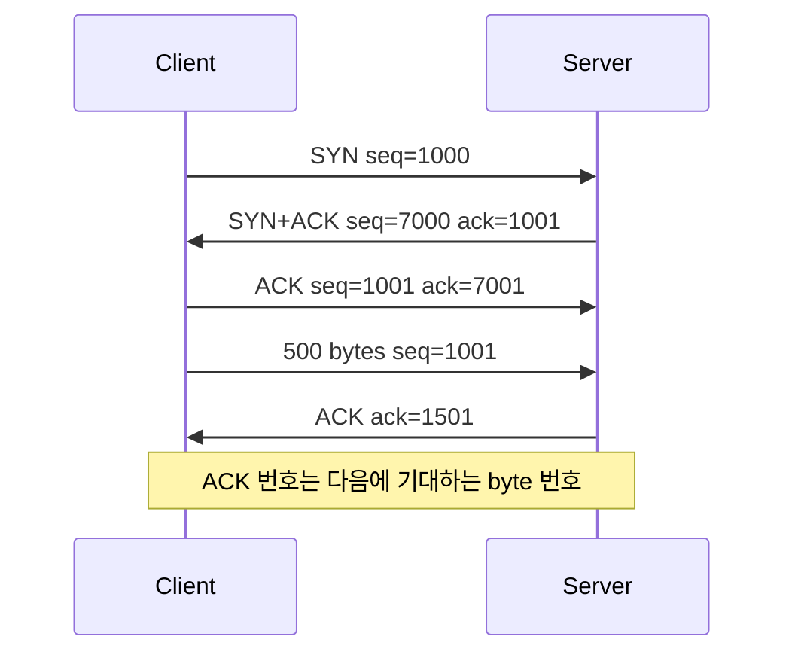
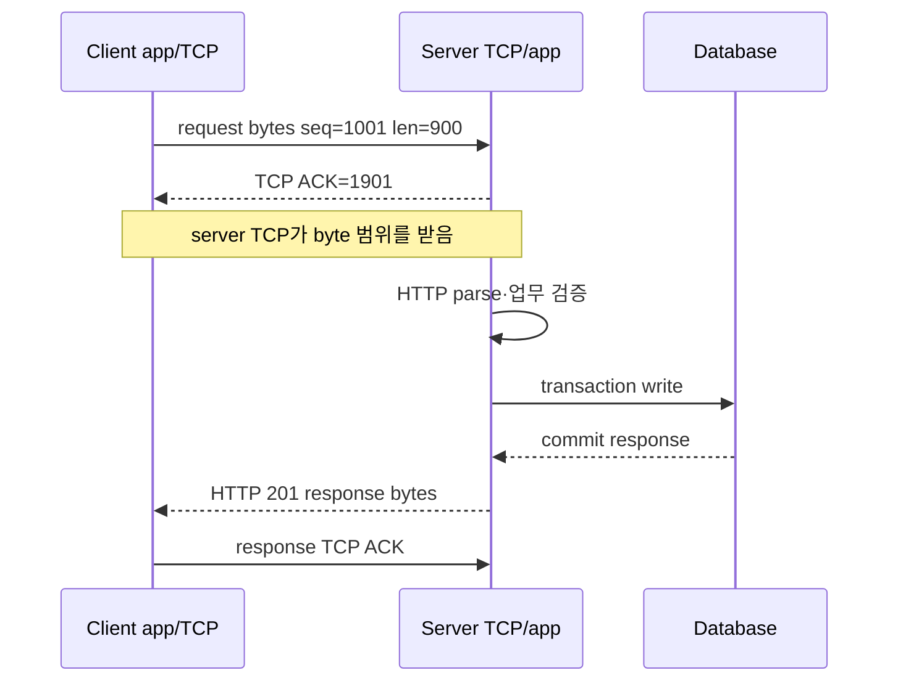

# 03. Transport: TCP, UDP, QUIC

범위: 이 장은 IP 위에서 process(실행 중인 프로그램)와 process가 통신하는 방법을 다룬다.
port(한 host 안의 통신 상대를 가리키는 16 bit 번호), socket(프로그램이 통신 endpoint를 다루는 운영체제 객체), 5-tuple(프로토콜·출발/목적 IP·출발/목적 port로 flow를 구별하는 다섯 값)을 먼저 설명한다. 이어서 TCP(Transmission Control Protocol, 순서 있고 신뢰성 있는 byte stream) sequence number(byte stream 위치 번호), ACK(Acknowledgment, 다음에 받기를 기대하는 byte 번호로 하는 확인), handshake(양쪽이 연결 상태를 맞추는 사전 메시지 교환), retransmission(손실 추정 데이터를 다시 보냄), RTT(Round-Trip Time, 왕복 시간), flow control(수신자의 처리 여유 보호), congestion control(공유 네트워크의 혼잡 억제)을 다룬다. UDP(User Datagram Protocol)는 전달 보장 없이 datagram 경계를 보존하는 전송 규칙이고, QUIC은 UDP 위에서 보호된 연결과 여러 reliable stream을 구현하는 전송 프로토콜이다.
패킷 캡처나 호스트 설정은 하지 않는다.



TCP sequence number는 “몇 번째 packet인가”가 아니라 **byte stream의 어느 위치인가**를 센다. 위 예에서 SYN도 sequence 공간 1을 소비하고, 500 byte를 받으면 다음 기대 번호가 `1001 + 500 = 1501`이 된다.

## 1. IP는 host 쪽으로, transport는 process 쪽으로 가까워진다

IP 주소는 packet을 목적지 host 또는 interface 쪽으로 보낸다.
하지만 한 host 안에는 웹 서버, SSH 서버, DNS client, database client 같은 여러 process가 동시에 있다.
transport 계층은 “어느 process의 어느 통신 endpoint인가”를 구분하는 port를 제공한다.

**port**는 transport protocol 안의 16 bit 번호다.
TCP port 443과 UDP port 443은 같은 숫자지만 다른 protocol 공간이다.
“443번 포트”라고만 말하면 TCP인지 UDP인지 문맥을 붙여야 한다.

## 2. Socket은 통신 endpoint를 다루는 OS 객체다

**socket**은 process가 네트워크 통신 endpoint를 다루기 위해 여는 OS 객체다.
파일처럼 fd로 다룰 수 있지만 regular file과 의미가 다르다.
socket은 byte stream 또는 datagram을 주고받는 통신 endpoint다.

비유하면 IP 주소는 건물 주소, port는 건물 안 사무실 번호, socket은 사무실 전화기와 통화 상태에 가깝다.
비유의 한계는 port 하나에 여러 연결이 붙을 수 있고, socket은 kernel 상태와 buffer를 가진 객체라는 점이다.

Linux의 socket API는 `socket(2)`, `bind(2)`, `listen(2)`, `accept(2)`, `connect(2)`, `send(2)`, `recv(2)` 같은 syscall로 노출된다.
개념 확인 출처: [man7 socket(7)](https://man7.org/linux/man-pages/man7/socket.7.html).

## 3. 5-tuple은 하나의 흐름을 구분하는 기본 열쇠다

많은 장비와 OS는 flow를 다음 다섯 값으로 구분한다.

```text
protocol
source IP
source port
destination IP
destination port
```

예:

```text
TCP, 10.0.1.10, 53000, 203.0.113.7, 443
TCP, 10.0.1.11, 53000, 203.0.113.7, 443
UDP, 10.0.1.10, 53000, 203.0.113.7, 443
```

세 줄은 서로 다른 flow다.
source port가 같아도 source IP가 다르면 다르다.
IP와 port가 같아도 protocol이 다르면 다르다.

## 4. TCP는 reliable byte stream을 제공한다

**TCP(Transmission Control Protocol)**는 연결형 transport protocol이다.
애플리케이션에는 순서 있는 byte stream을 제공한다.
RFC 9293은 TCP가 reliable, ordered, full-duplex byte stream을 제공한다고 설명한다.
출처: [RFC 9293](https://www.rfc-editor.org/rfc/rfc9293.html).

TCP가 보장하는 것:

- 연결 안에서 byte 순서를 맞춘다.
- 손실된 segment를 재전송할 수 있다.
- 중복 segment를 처리한다.
- 수신자가 받을 수 있는 양을 window로 알린다.
- 네트워크 혼잡에 맞춰 송신량을 조절한다.

TCP가 보장하지 않는 것:

- 애플리케이션 message boundary 보존.
- 서버가 업무 요청을 성공 처리했다는 보장.
- DB commit 또는 disk fsync.
- 연결이 끊긴 뒤 이미 보낸 업무가 실행됐는지에 대한 완전한 의미 보장.

## 5. TCP는 message가 아니라 byte stream이다

애플리케이션이 `send()`를 세 번 호출해도 수신자가 `recv()` 세 번으로 같은 경계를 받는다는 보장은 없다.

```text
sender send:  "HE"  "LL"  "O"
receiver recv 가능:
  "HEL"  "LO"
  "H" "E" "LLO"
  "HELLO"
```

그래서 HTTP, Redis protocol, PostgreSQL protocol 같은 상위 protocol은 자기 message 경계를 따로 정의한다.
길이 prefix, delimiter, header의 Content-Length 같은 장치가 필요하다.

## 6. Sequence number는 byte 위치를 세는 번호다

TCP의 sequence number는 segment 번호가 아니라 byte stream의 위치를 가리킨다.
송신자가 1000번부터 100 byte를 보냈다면 다음 byte의 sequence는 1100이다.

```text
Segment A:
  seq = 1000
  data length = 100

Receiver ACK:
  ack = 1100

뜻:
  1100 이전 byte까지 받았고 다음으로 1100을 기대한다.
```

ACK는 누적 ACK다.
`ack=1100`은 “1100번 byte 자체를 받았다”가 아니라 “다음으로 받고 싶은 byte가 1100”이라는 뜻으로 이해한다.

## 7. 3-way handshake는 양쪽 sequence 공간을 맞춘다

TCP 연결 시작은 보통 SYN, SYN-ACK, ACK 세 단계로 설명한다.

```text
Client -> Server: SYN, seq = x
Server -> Client: SYN+ACK, seq = y, ack = x+1
Client -> Server: ACK, ack = y+1
```

왜 3단계가 필요한가?
양쪽이 서로의 초기 sequence number를 알고, 양방향 byte stream 상태를 시작하기 위해서다.

SYN도 sequence number 공간을 1 소비한다.
data byte가 없는데 `ack=x+1`이 되는 이유가 이것이다.

## 8. Retransmission은 손실을 숨기지만 latency를 만든다

TCP sender는 보낸 data가 ACK되지 않으면 손실을 의심하고 재전송한다.
손실 판단에는 timer, duplicate ACK, selective acknowledgment 같은 여러 메커니즘이 관계한다.
초보 단계에서는 “TCP는 손실을 발견하면 재전송할 수 있지만, 그 시간 동안 애플리케이션은 늦어진다”를 기억한다.

```text
보낸 byte:
seq 1000..1099
seq 1100..1199  손실
seq 1200..1299  도착

수신자는 1100이 비었으므로 애플리케이션에 1200 이후를 바로 넘기기 어렵다.
1100..1199가 재전송되어야 stream 순서가 이어진다.
```

이것이 TCP에서 말하는 head-of-line blocking의 기본 감각이다.

## 9. Reordering은 손실과 다르지만 손실처럼 보일 수 있다

IP network는 packet 순서를 항상 보장하지 않는다.
나중에 보낸 segment가 먼저 도착할 수 있다.
수신 TCP는 sequence number로 순서를 복원한다.

하지만 sender 입장에서는 ACK 패턴이 손실처럼 보일 수 있다.
그래서 TCP는 reordering과 real loss를 구분하려고 timer와 ACK 신호를 조합한다.
운영에서는 “packet loss”와 “packet reordering”이 모두 TCP 성능을 떨어뜨릴 수 있음을 기억한다.

## 10. FIN, RST, TIME_WAIT

**FIN**은 더 이상 보낼 data가 없다는 정상 종료 신호다.
TCP는 full-duplex라 한쪽이 FIN을 보내도 반대 방향 data는 잠시 더 올 수 있다.

**RST**는 연결을 즉시 reset하는 신호다.
없는 port로 연결하거나, 애플리케이션이 강제 종료하거나, 중간 장비가 상태를 잃으면 RST를 볼 수 있다.

**TIME_WAIT**는 연결의 마지막 ACK를 보낸 쪽이 일정 시간 상태를 유지하는 단계다.
이유는 지연된 segment가 새 연결에 섞이지 않게 하고, 마지막 ACK가 유실됐을 때 상대의 재전송 FIN에 다시 ACK할 수 있게 하기 위해서다.

초보 오개념:

| 오개념 | 바로잡기 |
| --- | --- |
| TIME_WAIT는 항상 문제다 | TCP 안전 종료를 위한 정상 상태다 |
| RST는 항상 공격이다 | 애플리케이션 종료, 없는 port, state mismatch로도 생긴다 |
| FIN을 보내면 양방향이 즉시 닫힌다 | 한 방향 stream 종료일 수 있다 |

## 11. Flow control은 수신자 보호다

**flow control**은 sender가 receiver의 buffer를 넘치게 하지 않도록 조절하는 기능이다.
TCP receiver는 receive window, 즉 `rwnd`를 광고한다.
sender는 receiver가 받아들일 수 있는 범위 안에서 data를 보낸다.

```text
receiver buffer 여유 = 64 KiB
advertised rwnd = 약 64 KiB

sender는 ACK 없이 무한히 보내면 안 된다.
```

flow control의 상대는 receiver다.
네트워크 혼잡 자체를 다루는 것은 congestion control이다.

## 12. Congestion control은 네트워크 보호다

**congestion control**은 network path가 감당할 수 있는 양을 넘지 않도록 sender가 조절하는 기능이다.
TCP sender는 congestion window, 즉 `cwnd`를 갖는다.

sender가 실제로 한 번에 outstanding으로 둘 수 있는 양은 단순화하면 다음과 같다.

```text
send window = min(rwnd, cwnd)
```

`rwnd`는 receiver가 말한 여유다.
`cwnd`는 sender가 network 혼잡을 추정해 정한 한계다.

초보자가 자주 헷갈리는 점:

| 용어 | 누구를 보호하나 |
| --- | --- |
| flow control / rwnd | receiver |
| congestion control / cwnd | network path |

## 13. BDP는 대역폭과 지연이 만드는 “관 안의 양”이다

**BDP(Bandwidth-Delay Product)**는 path를 꽉 채우는 데 필요한 in-flight data 양이다.

```text
BDP = bandwidth x RTT
```

손계산:

```text
bandwidth = 10 Gb/s
RTT = 40 ms = 0.04 s

BDP = 10,000,000,000 bit/s x 0.04 s
    = 400,000,000 bit
    = 50,000,000 bytes
    = 약 50 MB
```

이 경로에서 TCP가 10 Gb/s를 꽉 쓰려면 대략 50 MB의 data가 flight 중이어야 한다.
window가 작으면 link는 빨라도 throughput이 안 나온다.

주의: 이는 이상적 계산이다.
실제 throughput은 loss, congestion control algorithm, offload, CPU, application read/write 속도, TLS, proxy, buffer size 영향을 받는다.

## 14. UDP는 작은 header의 datagram service다

**UDP(User Datagram Protocol)**는 connectionless datagram transport다.
RFC 768은 UDP가 procedure 사이에 datagram을 보내기 위한 protocol이며 transaction oriented라고 설명한다.
출처: [RFC 768](https://www.rfc-editor.org/rfc/rfc768.html).

UDP가 제공하지 않는 것:

- delivery guarantee.
- ordering guarantee.
- duplicate 제거.
- congestion control 자체.
- stream abstraction.

UDP가 제공하는 것:

- source port, destination port.
- length.
- checksum.
- message boundary가 있는 datagram.

UDP는 “나쁜 TCP”가 아니다.
DNS, real-time media, QUIC처럼 애플리케이션이나 상위 protocol이 필요한 제어를 직접 만들 때 유용하다.

## 15. UDP datagram boundary는 유지되지만 크기와 손실을 조심한다

TCP는 stream이라 send boundary가 사라진다.
UDP는 datagram boundary가 있다.
한 번 보낸 datagram은 하나의 datagram으로 받는 모델이다.

하지만 너무 큰 UDP datagram은 IP fragmentation이나 PMTUD 문제를 만날 수 있다.
손실되면 TCP처럼 자동 재전송하지 않는다.
애플리케이션이 필요하면 timeout, retry, idempotency, duplicate 처리, congestion response를 설계해야 한다.

## 16. QUIC은 UDP 위에 reliable streams를 만든다

**QUIC**은 UDP 위에서 동작하는 transport protocol이다.
RFC 9000은 QUIC을 UDP 기반 multiplexed and secure transport로 정의한다.
출처: [RFC 9000](https://www.rfc-editor.org/rfc/rfc9000.html).

QUIC이 UDP를 쓴다고 해서 “UDP처럼 신뢰성이 없다”는 뜻은 아니다.
QUIC protocol 자체가 packet number, ACK, retransmission, stream, flow control, congestion control, TLS 기반 보안을 제공한다.
차이는 이 기능들이 kernel TCP가 아니라 QUIC stack에서 구현된다는 점이다.

## 17. QUIC stream은 TCP의 head-of-line 문제 일부를 줄인다

TCP connection 하나 안의 byte stream은 앞쪽 byte가 빠지면 뒤쪽 byte를 애플리케이션에 넘기기 어렵다.
HTTP/2가 TCP 하나 위에서 multiplexing될 때 packet loss가 모든 stream을 막을 수 있다.

QUIC은 여러 stream을 하나의 connection 안에 두되, stream별로 독립적인 순서를 제공한다.
한 stream의 손실이 다른 stream data 전달을 전부 막지 않도록 설계됐다.

주의:
QUIC도 같은 network path에서 packet loss와 congestion의 영향을 받는다.
QUIC이 물리 손실을 없애는 것은 아니다.
다만 transport와 stream 설계가 TCP+HTTP/2 조합의 일부 head-of-line 문제를 줄인다.

## 18. TLS와 QUIC

TCP 기반 HTTPS는 보통 TCP 연결 위에 TLS를 올리고 그 위에 HTTP를 올린다.
QUIC은 TLS 1.3 handshake를 transport 안에 통합한다.
QUIC의 TLS 사용은 RFC 9001이 설명한다.
출처: [RFC 9001](https://www.rfc-editor.org/rfc/rfc9001.html).

이 때문에 HTTP/3은 TCP가 아니라 QUIC 위에서 동작한다.
HTTP/1.1과 HTTP/2는 TCP 위에서 많이 쓰이고, HTTP/3은 QUIC 위에서 쓰인다.

## 19. Packet journey: HTTPS over TCP

```text
1. client가 ephemeral source port를 고른다.
2. TCP SYN을 server IP:443으로 보낸다.
3. server가 SYN-ACK로 응답한다.
4. client가 ACK를 보내 TCP connection이 열린다.
5. TLS handshake가 진행된다.
6. HTTP request byte가 TLS record로 암호화된다.
7. TCP는 암호문 byte stream을 segment로 나눈다.
8. IP는 packet을 routing한다.
9. server TCP는 byte 순서를 복원한다.
10. TLS는 복호화와 검증을 한다.
11. HTTP server가 request를 해석한다.
```

각 단계의 실패는 다른 오류로 드러난다.
SYN 응답이 없으면 routing, firewall, server listen 문제일 수 있다.
TCP는 열렸지만 TLS가 실패하면 certificate, SNI, protocol version 문제일 수 있다.
TLS는 성공했지만 HTTP 404가 나오면 application routing 문제일 수 있다.

## 20. Packet journey: HTTP/3 over QUIC

```text
1. client가 UDP source port를 고른다.
2. QUIC Initial packet을 UDP destination port 443으로 보낸다.
3. QUIC transport와 TLS handshake가 진행된다.
4. HTTP/3 request가 QUIC stream에 실린다.
5. QUIC packet은 UDP datagram으로 IP 위에 실린다.
6. QUIC stack은 ACK, retransmission, congestion control을 처리한다.
7. HTTP/3 layer는 stream의 request/response 의미를 처리한다.
```

UDP port 443을 쓰더라도 단순 UDP 애플리케이션이 아니다.
QUIC이 transport 기능을 제공한다.

## 21. TCP ACK와 애플리케이션 완료 사이를 시간순으로 본다

Client가 `POST /charge` 요청 900 byte를 보내고 server가 DB에 기록한 뒤 응답한다고 하자. TCP initial sequence는 client 1000, server 7000이며 SYN이 sequence 공간 하나를 소비했다고 가정한다.



각 응답은 확인 범위가 다르다.

| 시점 | 관측 | 확인된 것 | 아직 확인되지 않은 것 |
| --- | --- | --- | --- |
| T0 | client `send()`가 900 반환 | local kernel이 900 byte를 수락 | wire 전송, server 수신 |
| T1 | server가 ACK 1901 전송 | server TCP가 1001..1900 byte를 수신 | HTTP parse, 결제 처리, DB commit |
| T2 | server app이 request parse | HTTP message 형식 해석 | 업무 규칙과 저장 성공 |
| T3 | DB commit 응답 | DB 계약상 transaction 완료 | HTTP response가 client에 도착 |
| T4 | client가 HTTP 201 해석 | application protocol 결과 확인 | 외부 후속 시스템의 완료 |

### ACK 뒤 연결이 끊기는 반례

Server TCP가 request 전체를 받고 ACK 1901을 보낸 직후 process가 crash났다고 하자. Client는 TCP ACK를 봤지만 HTTP response를 못 받는다. DB transaction이 시작되기 전 crash라면 업무 효과는 없을 수 있다. DB commit 직후 response 전송 전에 crash라면 업무 효과는 이미 있을 수 있다. Client에서 보이는 증상은 둘 다 timeout일 수 있다.

~~~text
Case A
  TCP ACK → app crash → DB write 없음 → client timeout

Case B
  TCP ACK → DB commit → app crash → client timeout
~~~

그래서 timeout 뒤 무조건 같은 요청을 다시 보내면 Case B에서 중복 효과가 생길 수 있다. Transport reliability와 업무 idempotency는 다른 설계다. 요청 ID, unique constraint, 서버의 중복 판정 범위가 필요한 이유다.

### 하나의 segment 손실이 stream에 미치는 영향

900 byte 요청을 300 byte씩 세 segment로 단순화해 보자.

~~~text
S1 seq=1001 len=300  도착
S2 seq=1301 len=300  손실
S3 seq=1601 len=300  도착
~~~

수신 TCP는 S1 뒤 `ACK=1301`을 보낸다. S3가 먼저 도착해 buffer에 보관돼도 빈 범위 1301..1600 때문에 누적 ACK는 계속 1301일 수 있다. S2가 재전송돼 도착하면 연속 범위가 1900까지 이어지고 `ACK=1901`이 가능하다.

TCP가 순서를 복원하므로 application은 보통 중간 구멍을 그대로 받지 않는다. 대신 S3가 이미 도착했어도 S2를 기다리는 지연이 생긴다. QUIC의 독립 stream은 한 stream의 이런 구멍이 다른 stream의 전달을 모두 막는 범위를 줄이지만, 같은 QUIC stream 안의 순서와 물리 경로 손실까지 없애지는 않는다.

## 22. 자주 틀리는 오개념

| 오개념 | 바로잡기 |
| --- | --- |
| port는 process ID다 | port는 transport endpoint 번호이고 PID와 다르다 |
| TCP send 한 번은 packet 한 개다 | TCP는 byte stream이고 segmentation은 별도다 |
| ACK는 서버 업무 처리 완료다 | ACK는 TCP byte 수신 신호일 뿐이다 |
| rwnd와 cwnd는 같은 window다 | rwnd는 receiver, cwnd는 network path를 보호한다 |
| UDP는 항상 빠르고 TCP는 항상 느리다 | workload와 구현에 따라 다르다 |
| QUIC은 UDP라 신뢰성이 없다 | QUIC이 UDP 위에 신뢰성과 stream을 구현한다 |
| TIME_WAIT는 무조건 제거해야 한다 | TCP 안전성을 위한 정상 상태다 |

## 23. 해설 문제

### 문제 1

`TCP, 10.0.1.10:50000 -> 203.0.113.7:443`과 `UDP, 10.0.1.10:50000 -> 203.0.113.7:443`은 같은 flow인가?

해설:

아니다.
protocol이 다르므로 5-tuple이 다르다.

### 문제 2

TCP sender가 `seq=7000`, data length 500 byte를 보냈다.
모두 순서대로 받았다면 receiver가 기대하는 다음 ACK 번호는?

해설:

```text
7000 + 500 = 7500
```

ACK 번호는 다음으로 기대하는 byte sequence다.

### 문제 3

10 Gb/s, RTT 80 ms 경로의 BDP는 대략 얼마인가?

해설:

```text
10,000,000,000 bit/s x 0.08 s = 800,000,000 bit
800,000,000 / 8 = 100,000,000 bytes
약 100 MB
```

### 문제 4

UDP를 쓰는 애플리케이션이 반드시 직접 설계해야 할 수 있는 기능 3가지는?

해설:

예: timeout, retry, duplicate 처리, ordering, congestion response, message id, idempotency.
UDP 자체는 delivery와 ordering을 보장하지 않는다.

## 24. 1차 출처와 더 읽기

- TCP: [RFC 9293](https://www.rfc-editor.org/rfc/rfc9293.html)
- UDP: [RFC 768](https://www.rfc-editor.org/rfc/rfc768.html)
- QUIC transport: [RFC 9000](https://www.rfc-editor.org/rfc/rfc9000.html)
- QUIC과 TLS: [RFC 9001](https://www.rfc-editor.org/rfc/rfc9001.html)
- Linux socket API 개요: [man7 socket(7)](https://man7.org/linux/man-pages/man7/socket.7.html)
