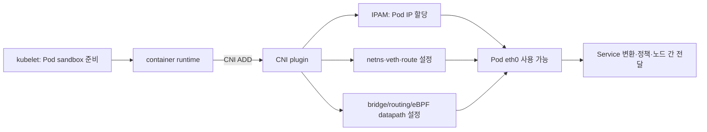
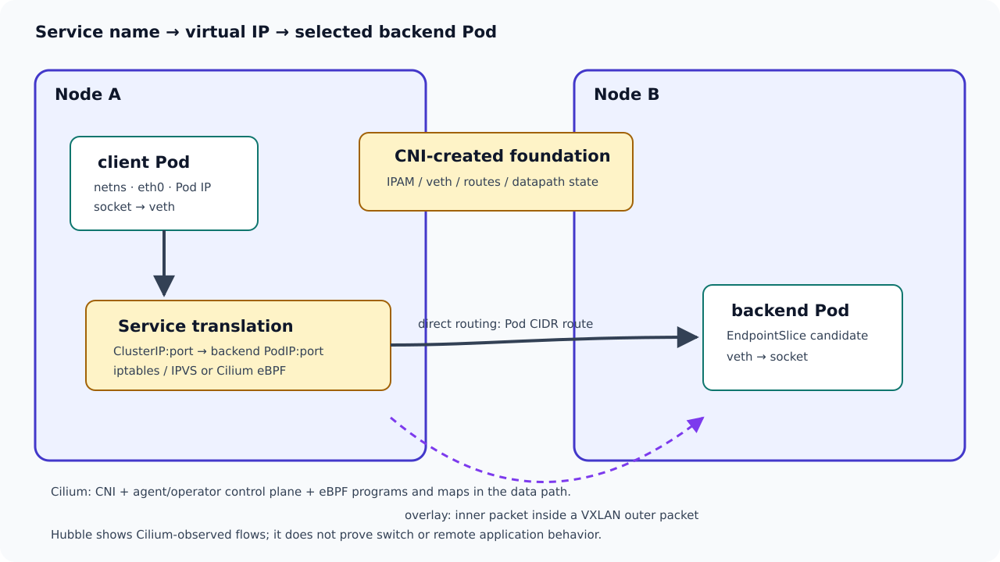

# 07. Kubernetes CNI와 Cilium: Pod IP가 실제 packet 경로가 되기까지

[이전: eBPF·XDP·TC](06-ebpf-xdp-tc.md) · 다음: [트러블슈팅과 안전한 실습](08-troubleshooting-and-labs.md)

근거 확인일: **2026-09-22**.

범위: Kubernetes networking을 Linux packet path와 연결한다. CNI(Container Network Interface)는 container runtime이 plugin을 호출해 Pod network interface와 주소·route를 준비하도록 정한 규격이다. IPAM(IP Address Management)은 겹치지 않는 Pod IP를 할당하고 회수하는 기능이다. datapath(데이터 경로)는 실제 packet에 forwarding·주소 변환·정책을 적용하는 경로이고, control plane(제어 평면)은 Pod·Service·정책 같은 원하는 상태를 모아 datapath가 쓸 규칙과 map으로 바꾸는 부분이다. Cilium(실리움)은 CNI를 구현하며 eBPF를 이용해 routing, Service load balancing, NetworkPolicy, 관측 등을 수행할 수 있는 Kubernetes networking 제품이다. overlay는 Pod packet을 node 사이 packet 안에 다시 넣어 운반하는 방식이고, direct routing은 underlay가 Pod 주소 경로를 직접 알게 하는 방식이다. NetworkPolicy는 어떤 Pod의 ingress·egress 통신을 허용할지 선언하는 Kubernetes API다. 이 장은 Pod namespace, veth, 두 node 간 routing, Service translation, policy, Cilium eBPF datapath를 설명한다. 실제 cluster 명령, CNI 설정 변경, BPF attach, packet capture는 하지 않는다.





*그림 1. CNI 호출은 Pod의 네트워크 기반을 준비하고, Service 선택과 노드 간 전달은 설치된 datapath가 수행한다. 그림의 direct routing과 overlay는 대표적인 두 선택지다.*

## 1. Kubernetes 네트워크 모델을 먼저 말로 고정한다

Kubernetes에서 Pod는 자기 IP를 가진다. 같은 cluster 안의 Pod들은 일반적으로 NAT 없이 서로 통신할 수 있어야 한다는 모델을 따른다. Service는 안정적인 가상 IP 또는 DNS 이름으로 backend Pod 집합을 가리킨다. NetworkPolicy는 어떤 Pod가 어떤 방향으로 통신할 수 있는지 제한하는 선언이다.

하지만 이 모델은 구현이 아니다. 구현은 CNI plugin과 cloud/network 환경이 맡는다.

| 모델의 말 | 실제 구현에서 필요한 것 |
| --- | --- |
| Pod에 IP가 있다 | IPAM이 Pod IP를 할당하고, Pod netns에 interface와 route를 넣음 |
| Pod끼리 통신한다 | node local veth/bridge/routing, cross-node overlay 또는 underlay route 필요 |
| Service IP로 접속한다 | kube-proxy iptables/IPVS 또는 Cilium eBPF service translation 필요 |
| 외부로 나간다 | route, SNAT/masquerade, cloud security group, firewall 필요 |
| NetworkPolicy를 적용한다 | CNI가 policy enforcement datapath를 구현해야 함 |

## 2. CNI는 무엇을 책임지는가

CNI(Container Network Interface)는 container runtime과 network plugin 사이의 표준 interface다. CNI spec은 runtime이 network namespace와 config를 plugin에 전달하고, plugin이 interface, IP, route, DNS 결과 등을 설정하는 구조를 정의한다. [CNI specification](https://www.cni.dev/docs/spec/).

CNI가 보통 하는 일은 다음과 같다.

1. Pod network namespace 안에 interface를 만든다.
2. host 쪽 연결 장치를 만든다. 보통 veth pair를 사용한다.
3. Pod IP를 할당한다. 이 영역이 IPAM이다.
4. Pod namespace route와 default gateway를 설정한다.
5. host datapath에 필요한 route, bridge, eBPF map, policy state를 갱신한다.
6. Pod 삭제 시 위 자원을 정리한다.

CNI는 "Kubernetes 전체 네트워크가 항상 정상"을 보장하는 마법 API가 아니다. CNI plugin이 성공했다고 해도 cross-node route, MTU, DNS, NetworkPolicy, external firewall, cloud route table이 따로 문제를 만들 수 있다.

### 누가 언제 CNI를 호출하는가

Pod manifest가 곧바로 CNI plugin을 직접 실행하지는 않는다. 교육용으로 단순화한 생성 생애주기는 다음과 같다.

| 순서 | 주체 | 만들어지거나 확인되는 것 | 이 단계의 성공이 아직 보장하지 않는 것 |
| --- | --- | --- | --- |
| 1 | scheduler·kubelet | Pod가 실행될 node 결정, sandbox 준비 | Pod IP와 cross-node 연결 |
| 2 | container runtime | Pod가 쓸 network namespace 준비 | 그 namespace 안의 interface와 route |
| 3 | runtime의 CNI 호출 | plugin에 command, container ID, netns 경로, interface 이름, network config 전달 | Service·DNS·정책 전체 정상 |
| 4 | CNI plugin·IPAM | IP 할당, veth/interface·route·필요한 datapath state 구성 | remote node의 route와 underlay 통과 |
| 5 | kubelet/runtime | 성공 결과를 받고 Pod 실행 계속 | application이 port를 listen함 |
| 6 | Pod 삭제 시 CNI DEL | 주소와 interface·plugin state 정리 시도 | 외부 시스템의 모든 stale state 즉시 소멸 |

CNI specification의 `ADD`, `DEL`, `CHECK`, `GC`, `VERSION`은 plugin 실행에 전달되는 command다. `GC`(garbage collection)는 runtime이 알려 준 유효 attachment 목록과 비교해 stale 자원을 가능한 만큼 정리하는 명령이다. `ADD`가 성공했다는 것은 plugin이 요청된 network 구성을 만들었다는 의미이지, DNS 이름 조회부터 HTTP 응답까지 end-to-end 시험했다는 뜻이 아니다. plugin chain을 쓰는 환경에서는 앞 plugin의 결과가 뒤 plugin 입력으로 이어질 수도 있으므로, “CNI 하나”라는 말 안에 여러 실행 파일과 책임이 들어갈 수 있다.

## 3. Pod namespace와 veth 기본 경로

한 Pod가 만들어질 때 흔한 Linux 그림은 다음과 같다.

```text
Pod network namespace
  eth0: 10.244.1.23/32 또는 /24
  default route → gateway
       │
       │ veth pair
       ▼
host namespace
  lxcABC 또는 vethABC
  route/eBPF/bridge/qdisc/netfilter
       │
       ▼
node NIC 또는 overlay device
```

Pod 안에서 `localhost`는 Pod 자기 namespace다. node의 `localhost`와 다르다. Pod의 `eth0`는 실제 NIC가 아니라 veth 끝일 수 있다. packet은 veth를 지나 host namespace의 CNI datapath로 들어간다.

## 4. 같은 node Pod 통신

가정:

```text
Pod A: 10.244.1.10 on node1
Pod B: 10.244.1.20 on node1
```

가능한 경로는 구현에 따라 다르지만, 개념적으로는 node 밖으로 나갈 필요가 없다.

| 단계 | 위치 | packet |
| --- | --- | --- |
| 1 | Pod A netns | `10.244.1.10 → 10.244.1.20` |
| 2 | veth A host end | host datapath로 진입 |
| 3 | bridge 또는 eBPF/routing | Pod B가 같은 node에 있음을 찾음 |
| 4 | veth B host end | Pod B netns로 전달 |
| 5 | Pod B socket | application이 받음 |

같은 node traffic이 물리 NIC를 지나가지 않을 수 있다는 점이 중요하다. NIC capture에 없다고 Pod끼리 통신하지 않았다고 단정하면 안 된다. veth, bridge, TC, Cilium monitor/Hubble 같은 다른 관측 지점이 필요할 수 있다.

## 5. cross-node Pod 통신: overlay와 direct routing

가정:

```text
Pod A: 10.244.1.10 on node1 192.0.2.11
Pod B: 10.244.2.20 on node2 192.0.2.12
```

### Overlay VXLAN 모델

VXLAN은 원래 packet을 UDP packet 안에 캡슐화해 underlay network 위로 운반한다. outer packet은 node IP끼리 오가고, inner packet은 Pod IP를 유지한다.

```text
inner: 10.244.1.10 → 10.244.2.20 TCP
outer: 192.0.2.11 → 192.0.2.12 UDP/VXLAN
```

MTU 계산을 해야 한다. 예를 들어 underlay MTU가 1500이고 VXLAN overhead를 대략 50 bytes로 보면, Pod가 안전하게 보낼 수 있는 inner MTU는 약 `1500 - 50 = 1450`이다. 실제 overhead는 IPv4/IPv6, VLAN, Geneve/VXLAN option, encryption에 따라 달라진다.

### Direct routing 모델

Direct routing은 Pod CIDR이 underlay에서 route될 수 있게 만든다. node나 router가 `10.244.2.0/24 via node2` 같은 route를 알고 있으면 encapsulation 없이 Pod IP packet을 보낼 수 있다.

```text
packet on wire: 10.244.1.10 → 10.244.2.20
next hop L2: node2 또는 router MAC
```

Direct routing은 encapsulation overhead가 줄지만, underlay route 배포와 source IP 보존, firewall/security group, asymmetric routing을 더 신경 써야 한다.

Cilium 문서는 tunnel routing과 native/direct routing 같은 routing mode를 설명한다. [Cilium routing concepts](https://docs.cilium.io/en/stable/network/concepts/routing/).

## 6. Service ClusterIP는 물리 장치가 아니다

ClusterIP는 Linux NIC에 꽂힌 실제 IP가 아닐 수 있다. Service IP는 datapath가 인식하는 가상 destination이다. packet이 ClusterIP로 향하면 kube-proxy나 Cilium eBPF가 backend Pod 중 하나로 destination을 바꾼다.

```text
client Pod → Service ClusterIP:80
  → service translation
  → backend PodIP:targetPort
```

kube-proxy iptables mode라면 netfilter rule과 conntrack이 중요하다. Cilium kube-proxy replacement라면 eBPF service maps, socket-LB, device hook이 중요하다. Cilium 문서는 kube-proxy replacement가 socket-LB 기능에 의존하며, co-existence나 전환 시 기존 connection이 끊길 수 있음을 경고한다. [Cilium kube-proxy replacement](https://docs.cilium.io/en/stable/network/kubernetes/kubeproxy-free/).

## 7. same-node, cross-node, external 경로 trace

### same-node Pod to Service to Pod

```text
Pod A 10.244.1.10 → Service 10.96.0.80:80
translation → Pod B 10.244.1.20:8080
reply reverse translation → Pod A sees reply from 10.96.0.80:80
```

물리 NIC를 지나지 않을 수 있다. Service translation 위치가 socket layer일 수도 있고 packet layer일 수도 있다. Cilium 설정에 따라 socket-LB가 connect 시점에 backend를 고를 수 있다.

### cross-node Pod to Service to Pod

```text
Pod A node1 → Service IP
translation chooses backend Pod B on node2
routing/overlay sends packet to node2
node2 delivers to Pod B
reply returns by reverse path or direct path depending on NAT/routing
```

여기서 preserve source가 중요한 질문이다. backend가 client Pod IP를 보려면 SNAT 없이 source가 유지되어야 한다. 하지만 externalTrafficPolicy, masquerade, egress gateway, overlay, cloud LB, NodePort는 source 보존 여부를 바꿀 수 있다.

### Pod to external Internet

```text
Pod 10.244.1.10 → 203.0.113.10:443
node egress route selected
SNAT/masquerade may change source to node IP
external reply returns to node IP
conntrack/eBPF NAT state maps reply back to Pod
```

Cilium masquerading 문서는 Pod IPv4 주소가 보통 RFC1918 private range라 cluster 밖으로 나갈 때 node IP로 masquerade될 수 있고, native routing CIDR이나 BPF masquerade 설정에 따라 달라진다고 설명한다. [Cilium masquerading](https://docs.cilium.io/en/stable/network/concepts/masquerading/).

## 8. DNS, Ingress, Gateway, NetworkPolicy는 서로 다른 층이다

| 항목 | 하는 일 | 흔한 오해 |
| --- | --- | --- |
| DNS | 이름을 IP로 바꿈 | DNS가 되면 TCP/TLS/HTTP도 된다고 생각함 |
| Service | 안정적인 가상 IP와 backend 선택 | ClusterIP를 물리 device IP로 생각함 |
| Ingress | HTTP routing을 ingress controller가 구현 | 모든 L4/L7 routing이 Ingress 하나로 해결된다고 생각함 |
| Gateway API | 더 일반적이고 역할 분리된 traffic API | controller 구현 없이 object만 만들면 동작한다고 생각함 |
| NetworkPolicy | Pod ingress/egress 허용 관계 선언 | CNI가 enforcement하지 않아도 자동 적용된다고 생각함 |

NetworkPolicy에서 reply traffic은 구현의 statefulness와 policy 방향 해석이 중요하다. 일반적으로 허용된 connection의 reply는 conntrack/stateful datapath로 허용될 수 있지만, CNI와 policy 종류에 따라 L7 policy, DNS policy, egress policy가 별도 영향을 준다. "ingress만 열었으니 reply도 항상 된다" 또는 "egress가 없으니 reply도 항상 막힌다" 같은 단순화는 피한다.

## 9. Hubble이 보여주는 범위

### 먼저 Cilium의 객체를 나눈다

`Cilium`을 하나의 실행 파일이나 하나의 eBPF program으로 생각하면 장애 범위를 잡기 어렵다. 대표 구성 요소의 역할은 다음과 같다. 실제 설치 방식과 버전에 따라 세부 구성은 달라질 수 있다.

| 객체 | 정체 | 주로 하는 일 |
| --- | --- | --- |
| Cilium CNI plugin | Pod 생성·삭제 때 runtime이 호출하는 node의 실행 파일 | Pod interface/IP 설정을 agent와 협력해 준비 |
| `cilium-agent` | 각 node에서 실행되는 장기 실행 agent | Kubernetes 상태를 받아 endpoint·policy·Service 관련 datapath를 구성하고 BPF program/map 관리 |
| Cilium operator | cluster 범위의 control-plane 구성 요소 | 선택한 IPAM mode와 cluster-wide 작업을 조정 |
| Cilium endpoint | Cilium이 관리하는 Pod network endpoint 표현 | identity·policy·datapath 상태를 Pod와 연결 |
| security identity | label 집합에서 파생되는 정책용 식별자 | 바뀔 수 있는 IP만으로 policy 주체를 판단하지 않도록 함 |
| BPF program·map | kernel hook의 실행 코드와 상태 표 | forwarding, Service/backend 선택, policy, NAT/conntrack 등 실제 packet 처리에 사용 가능 |
| Hubble | Cilium flow 관측 계층 | datapath event를 수집·가공해 source/destination·verdict·일부 L4/L7 정보를 제공 |

제어 흐름과 packet 흐름도 분리한다.

```text
제어 흐름:
Kubernetes Pod/Service/EndpointSlice/NetworkPolicy
  → cilium-agent가 watch
  → endpoint, identity, policy, service/backend map 갱신

packet 흐름:
Pod socket → veth/socket hook/TC 등 구성된 hook
  → BPF program이 map을 조회
  → 허용·drop·backend 선택·redirect·NAT 같은 동작
```

Kubernetes API object가 바뀌었는데 agent가 아직 반영하지 못하면 control plane의 선언과 datapath state가 잠시 다를 수 있다. 반대로 BPF map에 항목이 있다는 사실만으로 application readiness나 remote route까지 정상이라고 결론낼 수 없다. 그래서 문제를 볼 때 `원하는 Kubernetes 상태 → agent가 계산한 상태 → kernel에 설치된 program/map → 실제 packet event` 순서로 증거를 잇는다.

Hubble은 Cilium 환경에서 flow visibility를 제공한다. 하지만 Hubble은 Cilium datapath와 agent가 관찰한 event를 보여준다. 물리 switch, cloud firewall, remote endpoint application log, non-Cilium host process까지 모든 것을 직접 보여주는 것은 아니다.

Hubble event가 도움이 되는 질문:

1. Cilium identity 기준 source/destination은 무엇인가
2. policy verdict가 allow/drop인지
3. DNS, HTTP, TCP flag 같은 일부 L7/L4 정보가 보이는지
4. 어느 node/endpoint에서 event가 관측됐는지

Hubble만으로 확정하기 어려운 질문:

1. underlay switch가 drop했는가
2. remote cloud firewall이 막았는가
3. application이 요청을 받고 내부 오류를 냈는가
4. capture되지 않은 packet이 없었는가
5. event loss가 있었는가

## 10. 연습 문제

1. ClusterIP는 node NIC에 반드시 붙어 있는 IP인가?
2. VXLAN overlay에서 underlay MTU 1500, overhead 50 bytes라면 Pod MTU는 대략 얼마로 잡아야 안전한가?
3. 같은 node의 두 Pod 통신이 NIC tcpdump에 보이지 않았다. 통신이 없었다고 결론낼 수 있는가?
4. CNI plugin의 책임과 CoreDNS의 책임은 어떻게 다른가?
5. Cilium kube-proxy replacement를 켜면 kube-proxy와 NAT state를 같이 안전하게 공유하는가?

**답:** ① 아니다. datapath가 translation하는 가상 IP일 수 있다. ② 약 1450이다. 실제 overhead와 환경을 확인해야 한다. ③ 없다. veth/bridge/eBPF 경로로 node 내부에서 전달됐을 수 있다. ④ CNI는 Pod interface/IP/route/datapath를 만들고, CoreDNS는 이름을 Service/Pod/external IP로 해석한다. ⑤ 아니다. Cilium 문서는 coexistence나 전환 시 독립 NAT tables 때문에 기존 connection이 끊길 수 있음을 경고한다.

## 11. 확인한 1차 자료

- [CNI specification](https://www.cni.dev/docs/spec/)
- Cilium 구성 요소와 역할: [Component Overview](https://docs.cilium.io/en/stable/overview/component-overview/), [Cilium과 Hubble 소개](https://docs.cilium.io/en/stable/overview/intro/)
- Hubble의 node/cluster 관측 범위: [Network Observability with Hubble](https://docs.cilium.io/en/stable/observability/hubble/), [Hubble internals](https://docs.cilium.io/en/stable/internals/hubble/)
- Cilium: [routing concepts](https://docs.cilium.io/en/stable/network/concepts/routing/), [IPAM](https://docs.cilium.io/en/stable/network/concepts/ipam/), [masquerading](https://docs.cilium.io/en/stable/network/concepts/masquerading/), [kube-proxy replacement](https://docs.cilium.io/en/stable/network/kubernetes/kubeproxy-free/)
