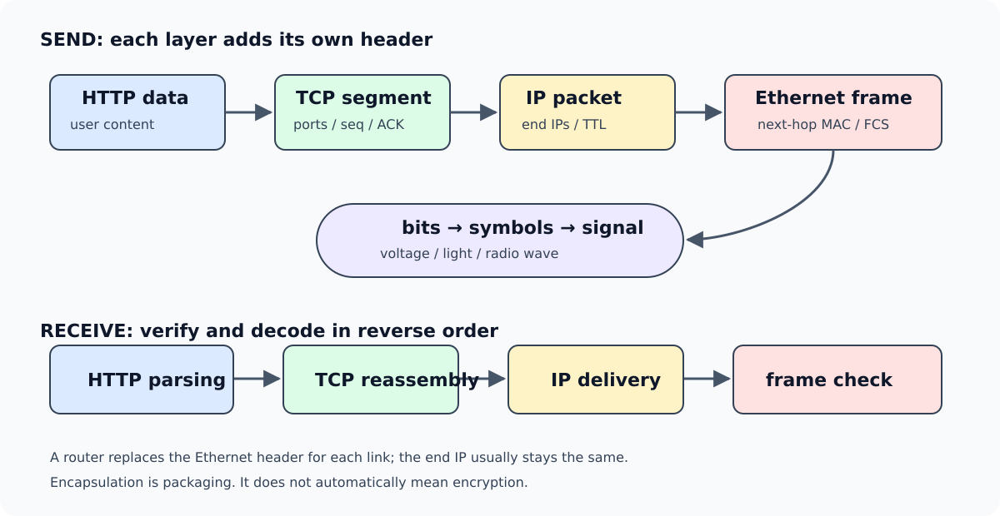

# 네트워크의 밑바닥부터 Linux·eBPF·Kubernetes까지

[통합 학습 안내](../../../learning/README.md) · [Linux·커널](../../../linux/learning/linux-kernel/README.md) · [NIC·RDMA 하드웨어](../../../hardware/learning/server-hardware/06-networking-rdma.md) · [AI 인프라](../../../ai/learning/ai-infrastructure/README.md)

**스위치, 라우터, 패킷이라는 말을 처음 듣는 사람**을 위한 교재다. 스위치(switch)는 같은 링크 영역에서 MAC 주소를 보고 frame을 전달하는 장비이고, 라우터(router)는 IP 주소와 routing table을 보고 서로 다른 network 사이로 packet을 전달하는 장비다. frame(프레임)은 한 링크에서 운반하는 묶음이고, packet(패킷)은 여러 network를 건너는 IP 계층의 묶음이다. 전기·빛으로 정보를 보내는 원리에서 시작해 주소·경로·연결·애플리케이션을 순서대로 설명한다. 이후 같은 packet을 Linux kernel(운영체제의 핵심부) 안에서 추적하고, eBPF가 어느 지점에 어떤 역할로 들어가는지 연결한다. 마지막에는 Kubernetes와 Cilium을 배운다. CNI(Container Network Interface)는 Pod의 interface·IP·route를 준비하기 위해 runtime이 network plugin을 호출하는 규격이다. Cilium(실리움)은 Kubernetes에서 Pod 연결·Service 변환·통신 정책·관측을 구현할 수 있는 CNI 제품이며, eBPF를 주요 데이터 경로 기술로 사용한다.

목표는 제품 설정을 외우는 것이 아니다. **어떤 바이트를 누가 포장했고, 어느 주소를 보고 보냈으며, 어디에서 기다리거나 버렸고, 성공 응답이 무엇을 뜻하는지** 설명할 수 있어야 한다.

처음 읽을 때는 모르는 약어를 전부 외우려 하지 않는다. 각 장에서 먼저 아래 네 질문에 답한 뒤 세부 필드로 내려간다.

1. 이 계층은 바로 아래 계층만으로 해결하지 못한 어떤 문제 때문에 생겼는가?
2. 입력으로 무엇을 받고, 어떤 header나 상태를 더해, 누구에게 넘기는가?
3. 요청과 응답은 어느 경로를 지나며, hop마다 무엇이 바뀌는가?
4. 관측한 성공은 어디까지의 성공이고, 아직 무엇은 증명하지 못했는가?

```mermaid
flowchart LR
    A["00 신호·frame"] --> B["01 MAC·switch"]
    B --> C["02 IP·route"]
    C --> D["03 socket·TCP/UDP/QUIC"]
    D --> E["04 DNS·TLS·HTTP"]
    E --> F["05 Linux packet path"]
    F --> G["06 eBPF·XDP·TC"]
    G --> H["07 CNI·Cilium"]
    H --> I["08 진단·안전 실습"]
    I --> J["09 종합 설계"]
```

위 화살표는 “앞 장을 완벽히 암기해야 다음 장을 읽을 수 있다”는 뜻이 아니다. 뒤에서 막혔을 때 어떤 바닥 개념으로 돌아갈지 보여 주는 의존 지도다.

## 읽는 순서

| 장 | 내용 | 핵심 과제 |
| --- | --- | --- |
| [00. 신호·프레임·패킷](00-signals-frames-and-packets.md) | 전기/광/무선·bit/symbol·포장·오류·지연 | bit, frame, packet, stream을 구별하고 전송 시간을 계산 |
| [01. Ethernet·스위치·VLAN](01-ethernet-switches-vlans.md) | MAC·학습 테이블·flood·tag·loop·STP·LACP | 빈 스위치 테이블이 학습되는 과정을 손으로 추적 |
| [02. IP·서브넷·라우터](02-ip-subnets-and-routers.md) | CIDR·ARP/NDP·경로·TTL·ICMP·NAT·IPv6 | /26 주소 범위와 라우터 통과 전후 MAC/IP를 계산 |
| [03. TCP·UDP·QUIC](03-transport-tcp-udp-quic.md) | 포트·연결·seq/ACK·재전송·흐름/혼잡 제어 | 손실·재정렬·중복·timeout 상황의 결과를 설명 |
| [04. DNS·HTTP·TLS](04-dns-http-tls.md) | 이름 조회·요청·인증서·암호화·프로토콜 버전 | URL 입력부터 응답까지 성공 조건을 계층별로 나눔 |
| [05. Linux 패킷 경로](05-linux-packet-path.md) | socket·qdisc·driver·DMA·NAPI·veth·bridge·netfilter | 앱부터 wire까지, wire부터 앱까지 방향별 경로를 그림 |
| [06. eBPF·XDP·TC](06-ebpf-xdp-tc.md) | verifier·map·helper·JIT·BTF·CO-RE·hook·관측 | 프로그램이 붙는 위치와 허용된 작업·상태·한계를 구별 |
| [07. Kubernetes·CNI·Cilium](07-kubernetes-cni-cilium.md) | Pod·IPAM·Service·overlay/direct routing·정책·Hubble | 같은 노드·다른 노드·외부 통신의 요청/응답 경로를 추적 |
| [08. 진단과 안전한 실습](08-troubleshooting-and-labs.md) | 명령 출력 해석·계층별 진단·로컬 모형 | 관측 위치와 가설을 연결하고 예상 결과와 대조 |
| [09. 종합 설계 문제·용어 사전](09-design-exercises-and-glossary.md) | 풀어 쓴 계산·장애 해석·설계·학습 평가 | 설정 이름 없이 패킷 경로와 실패 조건을 설명 |

처음에는 00→01→02→03→04를 읽는다. 05부터는 [Linux의 프로세스·커널·메모리 입문](../../../linux/learning/linux-kernel/01-programs-processes-and-shell.md)을 먼저 읽으면 좋다. 06장부터 시작하면 `커널·주소·드라이버·hook`이 한꺼번에 나와 어렵다. eBPF에 관심이 있어도 앞의 패킷 경로부터 연결한다.

## 계속 사용할 작은 네트워크

종합 문제에서는 문서용 주소를 사용한다. 실제 사내 네트워크 설정값이 아니다.

~~~text
PC A: 192.0.2.10/26
      │ Ethernet
   스위치 S ── 라우터 R: 192.0.2.1/26
                          │ 다른 링크
                    R: 198.51.100.1/24
                          │
                    서버 B: 198.51.100.20/24
~~~

물리적 선으로 이어진 그림만으로 정상 통신을 보장하지 않는다. VLAN, 링크 상태, 주소·경로, 필터 정책, 서비스 바인딩, 응답 경로까지 필요하다. 장마다 같은 그림에 하나씩 조건을 더해 무엇을 새로 알아야 하는지 살펴본다.

*그림 1. 같은 애플리케이션 byte가 계층마다 다른 이름과 header를 얻는다. router가 링크를 바꿀 때 Ethernet header는 새로 만들어진다.*

## 실습과 관측의 구별

실습은 메모리 안의 패킷·주소 계산, 제한된 로컬 통신, 읽기 전용 명령 중심이다. 예제 토폴로지와 출력은 설명용이면 그렇게 표시한다. 운영 인터페이스 변경, 패킷 생성 부하, 실제 트래픽 캡처, iptables/nftables 정책 수정, BPF 프로그램 부착·분리는 자동 실행하지 않는다.

eBPF 예제의 의사코드를 읽었다는 것, 실제 verifier를 통과했다는 것, 특정 hook에 부착했다는 것, 운영 정책의 정확성을 검증했다는 것은 각각 다른 단계다. 이 교재는 앞 단계의 학습을 뒷 단계의 검증으로 보고하지 않는다.

## 교재 사이의 연결

- NIC의 PCIe 대역폭과 RDMA·광 모듈·케이블은 [하드웨어 네트워크 장](../../../hardware/learning/server-hardware/06-networking-rdma.md).
- 프로세스·인터럽트·주소 변환·격리는 [운영체제 교재](../../../linux/learning/linux-kernel/README.md).
- JSON·UTF-8·payload와 TCP 메시지 경계는 [데이터 기초 00a](../../storage/data-systems-foundations/00a-bytes-payload-and-packets.md).
- 원격 ACK와 데이터 영속성은 [분산 저장](../../storage/data-systems-foundations/03-hdfs-distributed-files.md)·[DB WAL](../../storage/data-systems-foundations/05-database-pages-wal-indexes.md).
- 실제 운영 기록은 [Kubernetes Networking 런북](../README.md). 교재의 모형을 실제 구성의 증거와 비교하며 읽는다.

## 통합 보강 검증 — 2026-09-22

[검증 기록](../../../learning/VALIDATION.md): 네 교재의 Python 본문 예제 22개 실행, 기존 I/O 테스트 12개, 1 MiB·16 MiB 실제 파일 실습, 상대 링크·표·코드 구문 검사 및 독립 기술 검토를 완료했다. 실제 장치 고장·분산 서비스 장애·eBPF 부착은 이 검증에 포함되지 않는다.
