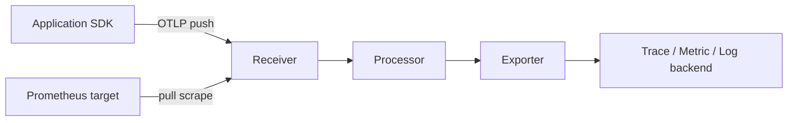

# OpenTelemetry 기초: 신호를 만들고, 잃지 않게 흘려보내기
[위로: data-pipelines README](README.md) · [전체 저장소 README](../../../README.md) · 다음: [Kafka](02-kafka.md)

이 문서는 Kubernetes와 데이터 파이프라인 운영자가 OpenTelemetry(OTel)를 설치 제품이 아니라 **telemetry 생성·처리·전달 흐름**으로 이해하도록 돕는 학습 장이다.
조사 기준 시점은 **2026-09-15**이다. OTel 웹 문서는 빠르게 갱신되는 `main` 성격이 강하므로, 실제 배포 전에는 Collector distribution, language SDK, exporter 버전을 다시 확인한다.

## 1. 먼저 결론
| 구성 요소 | 역할 | 운영자가 기억할 점 |
| --- | --- | --- |
| API | 코드가 span, metric, log를 기록할 때 호출하는 인터페이스 | API만 넣으면 전송·배치·샘플링이 끝나지 않는다. |
| SDK | API 호출을 실제 record로 만들고 처리·export한다 | sampler, resource, processor, exporter 설정은 SDK 책임이다. |
| Instrumentation library | HTTP, DB, messaging library를 감싸 자동 기록한다 | 업무 의미는 자동으로 알 수 없으므로 수동 계측이 필요하다. |
| Collector | telemetry를 받아 처리하고 backend로 내보내는 vendor-neutral proxy | receiver → processor → exporter pipeline을 명시해야 한다. |
| Backend | 저장, 검색, 시각화, alert를 담당한다 | OTel 자체는 data warehouse, TSDB, trace UI가 아니다. |
OTel 공식 문서는 Specification, Collector, 언어별 API/SDK, instrumentation library, exporter, propagator, sampler를 주요 구성 요소로 나눈다. [OpenTelemetry Components](https://opentelemetry.io/docs/concepts/components/)

## 2. OTel이 아닌 것
- OTel은 로그 검색 엔진이 아니다. OpenSearch, Loki, Elasticsearch 같은 저장·검색 계층이 별도로 필요하다.
- OTel은 metrics TSDB가 아니다. Prometheus, Mimir, Thanos, VictoriaMetrics 같은 backend가 별도로 필요하다.
- OTel은 trace UI가 아니다. Jaeger, Tempo, vendor APM 등이 보여주는 역할을 한다.
- OTel은 업무 이벤트를 자동으로 이해하지 않는다. `order.approved`, `invoice.failed` 같은 business semantic은 사람이 설계해야 한다.
- OTel Collector는 무한 queue가 아니다. memory, disk, retry window, downstream 장애에 따라 drop될 수 있다.
- 자동 계측은 framework 호출을 잡아도 domain decision, tenant boundary, security outcome은 직접 기록해야 한다.

## 3. 신호 세 가지
| 신호 | 무엇을 보여주는가 | 대표 질문 |
| --- | --- | --- |
| Trace | 하나의 요청이 여러 서비스와 thread를 지나가는 경로 | 어디서 느려졌는가? retry가 있었는가? |
| Metric | 시간에 따라 집계되는 숫자 | 오류율, 처리량, queue depth가 임계값을 넘었는가? |
| Log | 사람이 읽을 사건 기록 | 왜 실패했는가? 어떤 조건에서 예외가 났는가? |
Trace는 여러 span으로 구성된다. Span은 시작/종료 시각, parent, attribute, event, status를 가진다.
Metric은 counter, gauge, histogram, observable instrument처럼 비용이 낮고 alert에 적합한 형태가 많다.
Log는 trace_id, span_id, resource와 연결하면 trace 안에서 함께 볼 수 있다.
OTel 로그 사양은 로그를 시간, trace context, resource context로 다른 신호와 연결하는 방향을 설명한다. [OpenTelemetry Logs specification](https://opentelemetry.io/docs/specs/otel/logs/)

## 4. Resource: “누가 냈는가”
| Resource attribute 예시 | 의미 |
| --- | --- |
| `service.name` | 논리 서비스 이름 |
| `service.version` | 배포 버전 |
| `deployment.environment.name` | dev, stage, prod 같은 환경 |
| `k8s.namespace.name` | Kubernetes namespace |
| `k8s.pod.name` | Pod 이름 |
| `container.name` | 컨테이너 이름 |
Resource를 잘못 붙이면 같은 서비스가 둘로 쪼개지거나 다른 환경의 trace가 섞인다.
운영 원칙: `service.name`은 안정적으로 유지하고, Pod UID처럼 매번 바뀌는 값은 business metric label로 남용하지 않는다.
Resource detector를 쓰더라도 최종 attribute 목록을 review한다.

## 5. Context propagation
Context propagation은 서비스 경계를 넘어 trace context와 baggage를 전달하는 메커니즘이다. 공식 문서는 propagation이 context를 직렬화·역직렬화해 서비스 사이로 옮긴다고 설명한다. [OpenTelemetry Context propagation](https://opentelemetry.io/docs/concepts/context-propagation/)
```text
traceparent: 00-4bf92f3577b34da6a3ce929d0e0e4736-00f067aa0ba902b7-01
baggage: demo.tenant=training,feature=checkout-v2
```
위 값은 형식 설명용이며 실제 운영 trace ID가 아니다.
주의할 점:
- 외부 사용자 요청의 `traceparent`를 무조건 신뢰하면 공격자가 trace 구조를 오염시킬 수 있다.
- `baggage`는 서비스 경계를 넘어 전파되므로 secret이나 개인정보를 넣지 않는다. OTel baggage 문서는 민감 정보 노출과 무결성 부재를 경고한다. [OpenTelemetry Baggage](https://opentelemetry.io/docs/concepts/signals/baggage/)
- Kafka 같은 messaging에서는 record header로 context를 옮긴다.
- batch job은 parent request가 없을 수 있으므로 job run ID와 dataset ID를 별도 attribute로 둔다.

## 6. API와 SDK
API는 instrumentation code가 의존하는 얇은 표면이다.
```python
# 실행하지 않은 illustrative 예시: opentelemetry-api/sdk 패키지가 필요하다.
from opentelemetry import trace
tracer = trace.get_tracer("training.checkout")
with tracer.start_as_current_span("validate-cart") as span:
    span.set_attribute("cart.item_count", 3)
    span.set_attribute("demo.tenant", "training")
```
이 코드는 business span 모양을 보여주기 위한 예시다. 현재 저장소에는 Python OTel dependency가 없으므로 실행 검증하지 않았다.
SDK는 span 기록 여부를 sampling하고, processor queue에 넣고, batch로 묶고, OTLP/stdout/file 같은 exporter로 보낸다.
API만 사용하고 SDK를 초기화하지 않으면 많은 언어에서 no-op처럼 보일 수 있다.
SDK를 설정해도 코드나 자동 계측이 아무것도 기록하지 않으면 보낼 데이터가 없다.

## 7. 자동 계측과 수동 계측
| 방식 | 장점 | 한계 |
| --- | --- | --- |
| Zero-code/agent | 코드 변경 없이 HTTP, DB, messaging 기본 span을 얻기 쉽다 | 업무 의미, 보안 판정, custom queue state는 모른다. |
| Library instrumentation | framework별 표준 attribute가 잘 붙는다 | 지원 library/version 범위를 확인해야 한다. |
| Manual instrumentation | domain event와 실패 이유를 정확히 표현한다 | 개발자가 설계해야 하고 과도하면 비용이 증가한다. |
좋은 수동 계측: `checkout.validate_cart`, `payment.authorize`, `shipment.reserve_capacity`, `kafka.consume_lag_observed`.
나쁜 수동 계측: 모든 function마다 span 생성, user email/token/raw payload를 attribute에 넣기, random request ID를 metric label로 넣기.

## 8. Collector pipeline

Collector 설정에서 pipeline은 receiver, processor, exporter 집합으로 구성된다. 공식 configuration 문서도 `traces`, `metrics`, `logs` pipeline이 이 세 요소로 구성된다고 설명한다. [OpenTelemetry Collector configuration](https://opentelemetry.io/docs/collector/configuration/)
Receiver는 데이터가 들어오는 입구다: OTLP, Prometheus scrape, Kafka, filelog 등이 있다.
Processor는 데이터를 수정, drop, enrich, batch한다: `memory_limiter`, `batch`, `resource`, `attributes`, `redaction`, `tail_sampling` 등이 있다.
Exporter는 다음 hop으로 보낸다: OTLP, Prometheus exporter, Prometheus remote write, Kafka, debug/file exporter 등이 있다.
Processor 순서는 중요하다. 보통 memory limiter와 drop 계열을 앞에 두고, redaction/enrichment를 batch 전에 둔다.

## 9. Pull과 push
| 방식 | 대표 | 장점 | 위험 |
| --- | --- | --- | --- |
| Push | SDK → Collector OTLP, Collector → backend | 방화벽과 batch 전송이 단순하다 | downstream 장애 시 sender queue가 찬다. |
| Pull | Prometheus scrape, Collector Prometheus receiver | target discovery와 freshness 확인이 쉽다 | scrape timeout, label 폭증, target 접근성이 문제다. |
Metrics에서 pull은 흔하지만 traces/logs는 대체로 push다.
Collector가 Prometheus receiver로 scrape한 뒤 remote write로 push할 수 있으므로 한 pipeline 안에 pull과 push가 함께 존재할 수 있다.
운영 질문: 누가 retry 책임을 지는가, target이 죽으면 stale/failure가 보이는가, push queue가 차면 app이 느려지는가 아니면 데이터만 drop되는가?

## 10. Queue, retry, WAL
Collector exporter에는 sending queue와 retry 설정을 둘 수 있다. 공식 resiliency 문서는 in-memory queue, file storage 기반 WAL, retry window, queue overflow 같은 데이터 손실 조건을 설명한다. [OpenTelemetry Collector resiliency](https://opentelemetry.io/docs/collector/resiliency/)
```yaml
# 실행하지 않은 illustrative Collector 조각: 실제 component 지원 여부와 버전을 확인해야 한다.
extensions:
  file_storage/training:
    directory: /var/lib/otelcol-training
exporters:
  otlp/training-backend:
    endpoint: telemetry-gateway.example.invalid:4317
    sending_queue:
      storage: file_storage/training
      queue_size: 5000
    retry_on_failure:
      initial_interval: 5s
      max_interval: 30s
      max_elapsed_time: 10m
service:
  extensions: [file_storage/training]
```
이 설정은 개념 설명용이다. 현재 작업에서는 Collector binary를 실행하지 않았고, 실제 distribution이 `file_storage` extension을 포함하는지 검증하지 않았다.
한계: in-memory queue는 crash 때 사라지고, WAL은 disk 장애·disk full을 해결하지 못하며, retry window나 queue capacity를 넘으면 drop될 수 있다.
Kafka 같은 외부 queue를 넣으면 내구성은 좋아질 수 있지만 운영 복잡도와 지연이 늘어난다.
Collector는 정확히 한 번 저장을 보장하는 데이터베이스가 아니다.

## 11. Sampling
| 방식 | 위치 | 특징 |
| --- | --- | --- |
| Head sampling | SDK에서 span 시작 시점 | 싸고 빠르지만 오류 여부를 나중에 알 수 없다. |
| Parent-based sampling | upstream 결정 상속 | trace 일관성이 좋아진다. |
| Tail sampling | Collector에서 trace를 모은 뒤 결정 | 오류·지연 기준 선택 가능하지만 memory와 지연이 든다. |
| Probabilistic sampling | 확률 기반 | 단순하지만 희귀 장애를 놓칠 수 있다. |
운영 원칙: 오류 trace와 고지연 trace는 낮은 확률 sampling만으로 놓치지 않게 한다.
Sampling 전후의 지표를 분리한다. “요청 수”는 metrics로 본다.
Tail sampling Collector의 memory와 decision wait를 sizing한다.

## 12. Clock freshness
Telemetry는 시간 데이터다. clock이 틀어지면 span duration, log 검색 창, metric freshness, JWT/TLS 검증이 동시에 이상해질 수 있다.
확인 질문: node time sync가 정상인가, event time과 ingestion time을 구분하는가, backend가 너무 오래된 timestamp를 거부하는가, retry된 telemetry가 늦게 도착해도 받는가?
증상: duration 음수, 미래 로그, stale metric, 만료 전/후 검증 실패, batch job 처리 순서 혼란.

## 13. Secret redaction
금지 예: `authorization` header 원문, cookie 원문, database password, OAuth access token, Kubernetes Secret data, private key, seed phrase, recovery key, 실제 사용자 email/전화번호.
방어 단계:
1. 애플리케이션에서 애초에 기록하지 않는다.
2. logging framework filter로 제거한다.
3. OTel processor에서 attribute/log body를 redaction한다.
4. backend ingest pipeline에서 한 번 더 막는다.
5. 사고 대응 export 권한을 제한한다.
Collector redaction은 마지막 보루이지, 애플리케이션이 secret을 마음대로 내보내도 된다는 허가가 아니다.

## 14. Cardinality 폭발
Cardinality는 label/attribute 조합의 개수다. Metrics에서 특히 위험하다.
나쁜 label: `user_id`, `session_id`, `request_id`, raw URL path, error message 전체, Pod UID를 모든 business metric에 붙이기.
좋은 label: route template, HTTP method, status code class, service name, environment, bounded enum `result=success|failure|timeout`.
판단 기준: 값 개수가 제한되어 있는가, 새 요청마다 새 값이 생기지 않는가, alert/dashboard에서 실제로 group-by 하는가, retention 비용을 감당할 수 있는가?

## 15. Pipeline 예시 읽기
```yaml
# 실행하지 않은 illustrative 설정: 학습용 host와 component 이름만 사용한다.
receivers:
  otlp/app:
    protocols:
      grpc: { endpoint: collector.example.invalid:4317 }
processors:
  memory_limiter: { check_interval: 1s, limit_mib: 512 }
  attributes/redact:
    actions:
      - { key: http.request.header.authorization, action: delete }
      - { key: enduser.id, action: delete }
  batch: { timeout: 5s, send_batch_size: 1024 }
exporters:
  otlp/gateway: { endpoint: telemetry-gateway.example.invalid:4317 }
service:
  pipelines:
    traces:
      receivers: [otlp/app]
      processors: [memory_limiter, attributes/redact, batch]
      exporters: [otlp/gateway]
```
읽는 순서: receiver가 받고, memory limiter가 압박을 제어하고, redaction이 지우고, batch가 묶고, exporter가 다음 Collector나 backend로 보낸다.

## 16. 장애 대응 표
| 증상 | 가능 원인 | 먼저 볼 것 | 수정 방향 |
| --- | --- | --- | --- |
| trace가 전혀 없음 | SDK 미초기화, endpoint 오류, receiver 비활성 | app env, Collector receiver, pipeline 연결 | endpoint/protocol과 SDK 초기화 확인 |
| 일부 span만 없음 | instrumentation 누락, sampling, async context 손실 | span 이름, sampler, propagator | manual span 또는 propagator 보강 |
| service가 둘로 보임 | resource attribute 불일치 | `service.name`, namespace, env | resource 규칙 통일 |
| metrics 비용 급증 | high-cardinality label | top label cardinality | bounded enum과 route template 사용 |
| 로그에 secret 노출 | app log filter 없음, redaction 누락 | sample log와 processor rule | app에서 제거하고 redaction 추가 |
| Collector OOM | batch/queue/tail sampling 과다 | memory limiter, queue size, heap | queue와 policy 재설계 |
| downstream 장애 뒤 drop | retry window 초과, queue full | exporter failed/send metrics, queue capacity | retry/WAL/Kafka buffer 검토 |
| trace 연결 끊김 | propagation header 누락 | ingress, proxy, messaging header | propagator 통일 |

## 17. Kafka와 만날 때
Collector → Kafka exporter → Collector Kafka receiver 구조는 network segment 분리와 buffering에 유용할 수 있다.
하지만 Kafka topic retention보다 오래 장애가 나면 telemetry는 사라질 수 있고, partition key를 잘못 잡으면 ordering과 load balance가 깨진다.
Telemetry record 자체에 secret이 있으면 Kafka에 오래 남는다.
Kafka 기본 개념은 다음 장 [Kafka](02-kafka.md)에서 다룬다.

## 18. 복습 문제
1. **질문:** OTel API와 SDK의 차이는 무엇인가?<br>
   **답:** API는 instrumentation code가 호출하는 인터페이스이고, SDK는 sampling, processor, exporter, resource 같은 실제 처리와 전송을 담당한다.
2. **질문:** Collector receiver, processor, exporter는 각각 무엇을 하는가?<br>
   **답:** Receiver는 데이터를 받고 내부 모델로 바꾸며, processor는 변환·drop·enrich·batch하고, exporter는 다음 backend나 Collector로 보낸다.
3. **질문:** 자동 계측이 business event를 자동으로 완성하지 못하는 이유는?<br>
   **답:** framework 호출은 볼 수 있지만 “주문 승인”, “위험 거래 차단” 같은 domain 의미와 정책 판단은 애플리케이션 코드와 팀 규칙을 알아야 하기 때문이다.
4. **질문:** WAL을 켜면 데이터 손실이 완전히 없어지는가?<br>
   **답:** 아니다. disk full, disk 장애, retry window 초과, queue overflow, downstream 장기 장애에서는 여전히 손실될 수 있다.
5. **질문:** metric label에 `request_id`를 넣으면 왜 위험한가?<br>
   **답:** 요청마다 새 label 값이 생겨 cardinality가 폭발하고 저장 비용, query 성능, backend 안정성을 해칠 수 있다.

## 19. 다음 학습과 공식 자료
- 다음: [Kafka](02-kafka.md), [Flink](03-flink.md), [OpenSearch와 Data Prepper](04-opensearch-and-data-prepper.md), [Iceberg](05-iceberg.md), [Spark](06-spark.md), [Metrics와 Prometheus](07-metrics-and-prometheus.md), [통합 설계](08-integration-design.md), [실습·복습](09-labs-and-review.md).
- 공식 자료: [Components](https://opentelemetry.io/docs/concepts/components/), [Collector configuration](https://opentelemetry.io/docs/collector/configuration/), [Collector resiliency](https://opentelemetry.io/docs/collector/resiliency/), [Context propagation](https://opentelemetry.io/docs/concepts/context-propagation/), [Baggage](https://opentelemetry.io/docs/concepts/signals/baggage/), [Logs specification](https://opentelemetry.io/docs/specs/otel/logs/).

[위로: data-pipelines README](README.md) · [전체 저장소 README](../../../README.md) · 다음: [Kafka](02-kafka.md)
