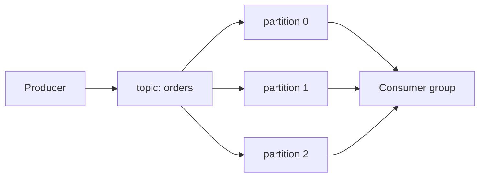

# Kafka 기초: 순서 있는 로그를 안전하게 읽고 다시 처리하기
[위로: data-pipelines README](README.md) · [전체 저장소 README](../../../README.md) · 이전: [OpenTelemetry](01-opentelemetry.md) · 다음: [Flink](03-flink.md)

이 문서는 Apache Kafka를 단순 메시지 큐가 아니라 **partitioned replicated commit log**로 이해하기 위한 학습 장이다.
조사 기준 시점은 **2026-09-15**이다. Kafka 공식 문서는 release 경로별로 내용이 다를 수 있으므로, 실제 배포 전에는 사용하는 distribution과 정확한 release 문서를 확인한다.

## 1. 먼저 결론
| 개념 | 한 줄 정의 | 운영자가 기억할 점 |
| --- | --- | --- |
| Record | key, value, header, timestamp를 가진 단위 | 너무 큰 record는 throughput과 복구를 모두 해친다. |
| Topic | record가 들어가는 논리 이름 | topic은 하나 이상의 partition으로 나뉜다. |
| Partition | 순서가 보장되는 append-only log | 강한 순서는 partition 안에서만 성립한다. |
| Offset | partition 안 record 위치 | consumer가 어디까지 읽었는지 추적하는 숫자다. |
| Broker | partition log를 저장하고 요청을 처리하는 서버 | broker 장애는 leader election과 ISR 상태로 이어진다. |
| Consumer group | partition을 group member에게 나눠 읽게 하는 구독 단위 | 같은 group 안에서는 partition 하나를 보통 한 consumer가 읽는다. |
| Retention | 오래된 log segment를 버리는 정책 | Kafka는 무한 보관소가 아니다. |
Kafka 공식 introduction은 topic, producer, consumer, broker, partitioned log, offset, retention, replication, consumer group을 핵심 개념으로 설명한다. [Apache Kafka Introduction](https://kafka.apache.org/08/getting-started/introduction/)

## 2. Kafka가 아닌 것
- Kafka는 무한 저장소가 아니다. retention time과 retention bytes가 지나면 데이터가 삭제될 수 있다.
- Kafka는 “절대 유실 없음” 보증이 아니다. producer ack, replication, ISR, disk, retention, consumer commit 설계에 따라 달라진다.
- Kafka는 모든 record의 전역 순서를 보장하지 않는다. 순서는 partition 내부 기준이다.
- Kafka consumer group commit은 Spark checkpoint와 같은 개념이 아니다.
- Kafka exactly-once는 모든 외부 DB, object storage, REST API까지 자동으로 exactly-once로 만드는 마법이 아니다.
- Kafka에 secret과 개인정보를 넣으면 retention 기간 동안 여러 consumer와 backup에 남을 수 있다.

## 3. Record 설계
| 요소 | 설명 | 설계 질문 |
| --- | --- | --- |
| key | partition 선택과 compaction 기준에 쓰일 수 있다 | 같은 entity의 순서가 필요하면 같은 key를 써야 하는가? |
| value | payload | schema와 크기 제한을 정했는가? |
| headers | metadata | trace context, schema id, content type을 넣을 수 있는가? |
| timestamp | event time 또는 append time | producer clock을 믿을 수 있는가? |
| offset | broker가 partition 안에서 부여한 위치 | 재처리와 resume 기준은 무엇인가? |
좋은 record는 ordering boundary와 key가 맞고, schema evolution을 고려하며, header에는 작은 metadata만 둔다.
Secret, token, raw credential은 value나 header에 넣지 않는다.
큰 object는 Kafka record에 직접 넣기보다 외부 저장소 참조로 분리한다.

## 4. Topic과 partition

Partition 수는 parallelism 상한, consumer group 안에서 동시에 처리할 수 있는 member 수, leader 분산, file/memory overhead, rebalance 비용, key ordering boundary를 결정한다.
Partition 수를 늘리는 것은 쉬워 보이지만 key-to-partition mapping이 바뀔 수 있어 ordering 가정이 깨질 수 있다.
Partition 수를 줄이는 것은 더 어렵고 대개 topic 재생성 또는 migration 설계가 필요하다.

## 5. Key와 ordering
```text
key=customer-001 -> partition 1 -> offsets 10, 11, 12
key=customer-002 -> partition 3 -> offsets 7, 8, 9
```
같은 customer 이벤트 순서가 중요하면 같은 key가 같은 partition으로 가야 한다.
모든 record를 같은 key로 보내면 한 partition에 몰려 throughput이 제한된다.
Apache Kafka 문서는 partition을 통해 ordering과 load balancing을 함께 제공하지만, 전체 topic 전역 순서는 단일 partition 같은 제한적 설계가 필요하다고 설명한다. [Apache Kafka Introduction](https://kafka.apache.org/08/getting-started/introduction/)
설계 질문: 순서가 필요한 단위는 user인가 order인가 account인가, hot key가 있는가, null key partitioning은 어떤가, partition 수 변경이 허용되는가?

## 6. Offset과 replay
Offset은 partition 안의 위치다. Consumer는 보통 “다음에 읽을 offset”을 commit한다.
```text
partition 0: [offset 40] [41] [42] [43]
consumer processed: 40, 41, 42
committed offset: 43
```
재시작하면 43부터 읽는다.
Offset은 topic 전체가 아니라 partition별 숫자이고, commit은 처리 성공과 같은 뜻이 아니다.
Kafka design 문서는 consumer position이 partition별 숫자 하나라 checkpoint가 작고, consumer가 의도적으로 과거 offset으로 되돌아가 재소비할 수 있다고 설명한다. [Apache Kafka Design](https://kafka.apache.org/41/design/design/)
Replay 방법: 새 group id로 읽기, 기존 group offset reset, versioned output으로 새로 쓰기, dead-letter topic 재처리.
Replay 전에는 output sink 중복 허용, 과거 schema 호환성, side effect 재실행 위험, retention 내 offset 존재, downstream 처리 용량을 확인한다.

## 7. Broker, leader, follower, ISR
각 partition에는 leader replica와 follower replica가 있다.
Producer write는 leader로 가고 follower는 leader log를 복제한다.
ISR(In-Sync Replicas)은 leader를 충분히 따라잡은 replica 집합이다.
Leader 장애 시 ISR 안의 follower가 새 leader 후보가 된다.
Apache Kafka design 문서는 replication 단위가 topic partition이며, 정상 상태에서 각 partition에는 하나의 leader와 0개 이상의 follower가 있다고 설명한다. [Apache Kafka Design](https://kafka.apache.org/41/design/design/)
운영 질문: replication factor는 몇인가, `min.insync.replicas`와 producer `acks`가 맞는가, under-replicated partition이 있는가, unclean leader election을 허용하는가?

## 8. KRaft metadata quorum
예전 Kafka는 ZooKeeper가 cluster metadata를 관리했다. KRaft 모드에서는 Kafka controller quorum이 metadata log를 관리한다.
Controller는 broker와 별도 role로 운영할 수 있고, critical 환경에서 broker+controller combined mode는 권장되지 않는다.
Controller quorum은 과반수가 살아 있어야 availability가 유지된다.
Controller metadata log도 유실되면 cluster metadata가 위험해진다.
Kafka KRaft 문서는 controller를 보통 3개 또는 5개 선택하며 과반수가 살아 있어야 availability가 유지된다고 설명한다. [Apache Kafka KRaft](https://kafka.apache.org/42/operations/kraft/)
Broker와 controller의 node id, listener, quorum 설정은 release별 차이가 있으므로 실제 release 문서를 확인한다.

## 9. Consumer group
```text
topic orders partitions: 0, 1, 2, 3
consumer group: billing-writer
member A: partitions 0, 1
member B: partitions 2, 3
```
같은 group id를 쓰면 하나의 logical subscriber처럼 동작한다.
Group 안에서 partition 하나는 보통 한 member에게 할당된다.
Member 수가 partition 수보다 많으면 일부 member는 놀 수 있다.
Member가 추가·제거되면 rebalance가 발생한다.
Group id를 바꾸면 다른 subscriber로 취급되어 별도 offset을 가진다.
주의: group id는 application instance id가 아니라 logical subscription id다.

## 10. Kafka commit과 Spark checkpoint의 차이
| 항목 | Kafka consumer group offset commit | Spark checkpoint |
| --- | --- | --- |
| 저장 위치 | Kafka 내부 offset storage | checkpoint directory 또는 state store |
| 범위 | topic partition별 다음 offset | streaming query의 source offset, state, sink progress 등 |
| 소유자 | Kafka consumer group | Spark query/application |
| 의미 | 이 group이 다음에 어디서 읽을지 | stateful streaming 복구에 필요한 전체 진행 상태 |
| 외부 sink와 원자성 | 별도 설계 필요 | sink 종류와 query semantics에 따라 다름 |
Spark가 Kafka source를 읽는다고 해서 Kafka consumer group commit만 보면 충분하지 않다.
Spark checkpoint를 삭제하면 query는 state와 source progress를 잃을 수 있다.
Kafka offset을 되돌려도 Spark checkpoint가 과거 state를 기억하면 예상과 다르게 동작할 수 있다.

## 11. Delivery semantics
Kafka 공식 design 문서는 at-most-once, at-least-once, exactly-once를 구분하고, consumer가 처리 전/후 어느 시점에 position을 저장하는지에 따라 손실 또는 중복이 생길 수 있다고 설명한다. [Apache Kafka Design: Message Delivery Semantics](https://kafka.apache.org/41/design/design/)
| 방식 | 순서 | 실패 시 결과 | 적합한 경우 |
| --- | --- | --- | --- |
| At-most-once | commit 후 process | 처리 전 crash면 손실 | 손실 허용, 중복 불가 |
| At-least-once | process 후 commit | commit 전 crash면 중복 | 대부분의 idempotent sink |
| Exactly-once within Kafka | consume, process, produce, offset commit을 transaction으로 묶음 | Kafka topic 간 원자성 가능 | Kafka Streams, transactional producer 패턴 |
Kafka topic에서 Kafka topic으로 쓰는 경우는 transaction으로 강한 보장을 만들 수 있다.
외부 DB, object storage, REST API까지 포함하면 그 시스템과 offset 저장을 함께 설계해야 한다.
Idempotent write, primary key upsert, deduplication table, transactional outbox 같은 패턴이 필요할 수 있다.

## 12. Retention: 시간과 bytes
Kafka retention은 “consumer가 읽었는가”와 독립적으로 topic log를 보관하는 정책이다.
대표 설정: `retention.ms`, `retention.bytes`, `segment.bytes`, compacted topic의 tombstone retention.
Kafka topic config 문서는 `retention.ms`가 delete retention policy에서 log를 버리기 전 최대 보관 시간을 제어하며, `retention.bytes`가 partition 단위 크기 제한을 제어한다고 설명한다. [Apache Kafka Topic Configs](https://kafka.apache.org/41/configuration/topic-configs/)
Retention은 복구 SLA다. “며칠 안에 장애를 발견하고 replay할 수 있는가?”와 연결한다.
Bytes 제한은 time 제한보다 먼저 작동할 수 있다.
Partition 수가 많으면 topic 전체 보관 용량 계산이 달라진다.
Compacted topic도 delete tombstone window를 놓치면 삭제 의미를 잃을 수 있다.

## 13. Backpressure와 lag
| 신호 | 의미 | 가능한 원인 |
| --- | --- | --- |
| Consumer lag 증가 | consumer가 head를 따라가지 못함 | 처리 느림, sink 장애, rebalance, partition 부족 |
| Produce latency 증가 | broker write가 느림 | ISR 축소, disk I/O, network, quota |
| Request throttle 증가 | quota에 걸림 | client별 제한 초과 |
| Under-replicated partitions | follower가 leader를 못 따라감 | broker 장애, network, disk |
| Page cache pressure | disk read/write 부담 | retention, compaction, replay |
Lag만 보고 consumer를 늘리는 것은 위험하다.
Partition 수보다 consumer가 많으면 더 늘려도 처리량이 늘지 않는다.
Sink가 느리면 consumer를 늘려도 sink 장애를 키운다.
Hot key가 한 partition에 몰리면 전체 group lag보다 partition별 lag를 봐야 한다.

## 14. Producer ack와 유실 경계
| 설정/상태 | 의미 | 위험 |
| --- | --- | --- |
| `acks=0` | broker 응답을 기다리지 않음 | 전송 실패를 모를 수 있다. |
| `acks=1` | leader write 응답 | leader 장애와 replica 미반영 사이 손실 가능. |
| `acks=all` | ISR 조건 충족 응답 | latency 증가, ISR 축소 시 실패 가능. |
| `min.insync.replicas` | 필요한 ISR 수 | 너무 낮으면 내구성 약화, 너무 높으면 availability 저하. |
| idempotent producer | retry 중복 완화 | application side effect와는 별개. |
Kafka는 throughput, latency, durability, availability를 모두 최대로 만들 수 없는 trade-off 시스템이다.

## 15. Schema와 poison pill
Kafka는 bytes를 저장한다. 의미 있는 event stream을 만들려면 schema 전략이 필요하다.
질문: JSON/Avro/Protobuf 중 무엇을 쓰는가, schema registry를 쓰는가, backward/forward compatibility 정책은 무엇인가, required field 삭제를 막는가?
나쁜 패턴: consumer마다 payload 해석이 다름, 운영 중 field 타입 변경, version 없는 JSON, error record를 같은 topic에 무한 retry.
Poison pill은 DLQ로 격리하고, 원본 topic/partition/offset, error reason, schema version, first failure time을 함께 남긴다.

## 16. Kafka와 OpenTelemetry
OTel trace context를 Kafka record header에 넣으면 producer와 consumer span을 이어 볼 수 있다.
```text
headers:
  traceparent = 00-4bf92f3577b34da6a3ce929d0e0e4736-00f067aa0ba902b7-01
  baggage = demo.tenant=training
```
이 값은 예시다. 실제 trace id나 tenant 값을 공개 문서에 넣지 않는다.
Produce span과 consume span 사이에는 queue time이 있다.
Consumer lag와 trace 지연을 함께 봐야 한다.
Retry topic, DLQ, compacted topic은 span 이름과 attribute로 구분한다.
Header에도 민감 값을 넣지 않는다.
OTel 기본은 이전 장 [OpenTelemetry](01-opentelemetry.md)에서 다룬다.

## 17. 안전한 illustrative CLI 예시
아래 명령은 Kafka CLI가 설치되고 학습용 cluster 접근 권한이 있을 때만 실행 가능한 **예시**다. 이 작업에서는 실제 Kafka cluster에 연결하지 않았으므로 실행 검증하지 않았다.
```bash
# topic 목록 확인 예시
kafka-topics.sh --bootstrap-server kafka-bootstrap.example.invalid:9092 --list
# consumer group lag 확인 예시
kafka-consumer-groups.sh --bootstrap-server kafka-bootstrap.example.invalid:9092 --describe --group training-reader
```
공개 문서에서는 실제 bootstrap 주소, 사용자명, SASL password, TLS private key를 쓰지 않는다.

## 18. 장애 대응 표
| 증상 | 흔한 원인 | 먼저 볼 것 | 수정 방향 |
| --- | --- | --- | --- |
| 특정 partition lag만 증가 | hot key | partition별 lag와 key 분포 | key 설계 또는 topic 분리 |
| consumer가 계속 rebalance | processing 시간이 길거나 heartbeat 문제 | group event, poll 간격 | batch 크기와 processing time 조정 |
| replay 후 중복 output | at-least-once 처리 | sink primary key와 offset 기록 | idempotent write/dedup 설계 |
| producer timeout 증가 | ISR 축소 또는 broker I/O | broker request latency, under-replication | replication/disk/network 확인 |
| record가 사라짐 | retention time/bytes 초과 | topic config와 earliest offset | retention을 복구 SLA에 맞춤 |
| exactly-once라고 했는데 외부 DB 중복 | Kafka transaction 경계를 오해 | offset과 DB write 원자성 | 외부 sink transaction/dedup 설계 |
| Spark 재시작 결과 이상 | Kafka offset과 checkpoint 혼동 | Spark checkpoint, query id | checkpoint 정책과 offset reset 분리 |
| DLQ가 계속 증가 | poison pill schema | error reason, schema version | schema 호환성/격리 처리 |

## 19. 운영자가 던질 질문
- 이 topic의 소유자와 schema owner는 누구인가?
- partition key는 ordering boundary와 맞는가?
- retention은 replay SLA보다 긴가?
- bytes 제한이 time 제한보다 먼저 데이터를 지우지 않는가?
- consumer group commit 시점은 처리 결과와 맞는가?
- sink는 중복을 견딜 수 있는가?
- KRaft controller quorum은 과반수 장애를 견딜 수 있는가?
- secret이나 개인정보가 value/header/log에 들어가지 않는가?
- lag alert는 partition별 hot spot을 보여주는가?

## 20. 복습 문제
1. **질문:** Kafka가 보장하는 강한 순서는 어디까지인가?<br>
   **답:** 같은 topic partition 안에서의 offset 순서다. topic 전체 전역 순서는 기본 보장이 아니다.
2. **질문:** consumer가 process 전에 offset을 commit하면 어떤 semantics에 가까운가?<br>
   **답:** crash 시 처리하지 않은 record를 건너뛸 수 있으므로 at-most-once에 가깝다.
3. **질문:** Kafka consumer group offset commit과 Spark checkpoint는 왜 다른가?<br>
   **답:** Kafka commit은 group의 partition별 다음 offset이고, Spark checkpoint는 streaming query의 source progress, state, sink 진행 정보를 포함하는 복구 상태다.
4. **질문:** retention.ms를 길게 잡으면 데이터 유실이 완전히 사라지는가?<br>
   **답:** 아니다. bytes 제한, disk 장애, replication 설정, producer ack, compaction, 운영 실수 등 다른 유실 경계가 남는다.
5. **질문:** Kafka exactly-once가 외부 REST API 호출까지 자동으로 한 번만 실행되게 만드는가?<br>
   **답:** 아니다. Kafka transaction 경계 밖의 외부 side effect는 별도 idempotency, transaction, deduplication 설계가 필요하다.

## 21. 다음 학습과 공식 자료
- 다음: [Flink](03-flink.md), [OpenSearch와 Data Prepper](04-opensearch-and-data-prepper.md), [Iceberg](05-iceberg.md), [Spark](06-spark.md), [Metrics와 Prometheus](07-metrics-and-prometheus.md), [통합 설계](08-integration-design.md), [실습·복습](09-labs-and-review.md).
- 공식 자료: [Apache Kafka Introduction](https://kafka.apache.org/08/getting-started/introduction/), [Apache Kafka Design](https://kafka.apache.org/41/design/design/), [Apache Kafka KRaft operations](https://kafka.apache.org/42/operations/kraft/), [Apache Kafka Topic Configs](https://kafka.apache.org/41/configuration/topic-configs/), [Apache Kafka Documentation index](https://kafka.apache.org/documentation/).

[위로: data-pipelines README](README.md) · [전체 저장소 README](../../../README.md) · 이전: [OpenTelemetry](01-opentelemetry.md) · 다음: [Flink](03-flink.md)
