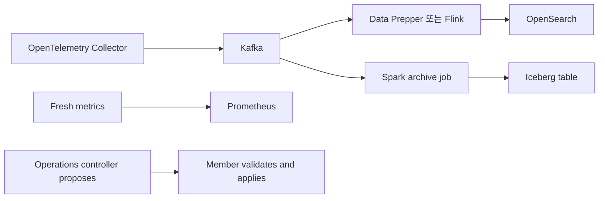

# 03. Apache Flink: 실시간 처리 DAG와 상태 운영

## 이 장의 위치

- 상위 문서: [저장소 README](../../../README.md), [Kubernetes Observability](../README.md)
- 전체 경로: [01 OpenTelemetry](01-opentelemetry.md), [02 Kafka](02-kafka.md), [03 Flink](03-flink.md), [04 OpenSearch와 Data Prepper](04-opensearch-and-data-prepper.md), [05 Iceberg](05-iceberg.md), [06 Spark](06-spark.md), [07 Metrics and Prometheus](07-metrics-and-prometheus.md), [08 Integration Design](08-integration-design.md), [09 Labs and Review](09-labs-and-review.md)

## 문서 기준

- 조사일: **2026-09-15**
- 기준 문서: Apache Flink stable docs와 Apache Flink downloads page
- 예시는 학습용 의사 코드입니다. 이 저장소에서는 Flink cluster, connector, sink endpoint를 실행하지 않았습니다.
- 실제 주소, credential, 운영 topic, 운영 index 이름은 쓰지 않습니다.

## 먼저 기억할 문장

Flink는 **계속 들어오는 event를 상태와 시간 개념으로 처리하는 stream processing engine**입니다.
Flink는 generic database가 아니며, 임의 조회·색인·backup·사용자 facing 검색을 대신하지 않습니다.
학습 예시 구조에서는 `OTel -> Kafka -> Flink -> OpenSearch`가 hot processing 후보입니다.
같은 예시에서 장기 archive는 독립적인 `Spark -> Iceberg` 경로가 담당할 수 있습니다.
이 구조는 공부용 제안일 뿐이며 모든 환경의 표준 설계로 결정된 것이 아닙니다.

## 공식 근거 빠른 링크

- [Flink Architecture](https://nightlies.apache.org/flink/flink-docs-stable/docs/concepts/flink-architecture/): JobManager, TaskManager, task slot, operator chaining
- [Timely Stream Processing](https://nightlies.apache.org/flink/flink-docs-stable/docs/concepts/time/): event time, processing time, watermarks
- [Generating Watermarks](https://nightlies.apache.org/flink/flink-docs-stable/docs/dev/datastream/event-time/generating_watermarks/): timestamp assigner와 watermark strategy
- [Windows](https://nightlies.apache.org/flink/flink-docs-stable/docs/dev/datastream/operators/windows/): keyed window, trigger, allowed lateness
- [Checkpointing](https://nightlies.apache.org/flink/flink-docs-stable/docs/dev/datastream/fault-tolerance/checkpointing/): state snapshot과 fault tolerance
- [Savepoints](https://nightlies.apache.org/flink/flink-docs-stable/docs/ops/state/savepoints/): 운영자가 의도적으로 남기는 state image
- [Flink Downloads](https://flink.apache.org/downloads/): connector별 호환 Flink version 확인

## Flink가 처리하는 모양: source -> operator -> sink

Flink program은 dataflow graph, 즉 DAG로 실행됩니다.
DAG의 앞쪽은 source, 중간은 operator, 끝은 sink입니다.
Flink architecture 문서는 runtime이 JobManager와 TaskManager process로 구성되고, operator subtask가 task로 실행된다고 설명합니다.

```text
Kafka source
  -> parse / validate
  -> keyBy(service.name)
  -> windowed aggregation
  -> enrich / route
  -> OpenSearch sink
```

| 구성 | 역할 | 운영자가 보는 질문 |
| --- | --- | --- |
| Source | Kafka, file, socket 등에서 record를 읽음 | replay 가능한가, offset은 어디에 저장되는가 |
| Operator | map, filter, keyBy, window, join, process 등 | state가 있는가, parallelism은 충분한가 |
| Sink | OpenSearch, filesystem, Kafka, Iceberg 등으로 씀 | commit이 atomic한가, retry가 중복을 만들 수 있는가 |

Flink는 operator를 chain으로 묶어 task 수와 thread 간 handoff 비용을 줄일 수 있습니다.
그러나 `keyBy`, shuffle, rebalance, window, join은 network exchange와 state 증가를 만들 수 있습니다.
따라서 DAG 그림은 성능 그림이기도 합니다.

## JobManager와 TaskManager

Flink Architecture 문서 기준으로 JobManager는 scheduling, checkpoint coordination, failure recovery를 조정합니다.
TaskManager는 실제 task를 실행하고, stream data를 buffer/exchange하며, slot 단위로 작업을 수용합니다.
client는 job 제출에 관여하지만 runtime 자체의 long-running 처리자가 아닙니다.

| 프로세스 | 초보자 설명 | 장애 시 관찰할 것 |
| --- | --- | --- |
| Client | job graph를 만들고 제출하는 쪽 | 제출 실패와 실행 실패를 구분 |
| JobManager | job별 실행 계획과 checkpoint를 조정 | leader, JobMaster, checkpoint coordinator 상태 |
| TaskManager | operator subtask를 실행하는 worker | slot, CPU, heap, managed memory, backpressure |
| Checkpoint storage | state snapshot을 저장하는 외부 저장소 | 쓰기 지연, 권한, 용량, cleanup 정책 |

JobManager가 데이터를 모두 들고 계산하는 구조로 이해하면 안 됩니다.
대부분의 record 처리는 TaskManager subtask에서 일어납니다.
JobManager 병목은 scheduling, checkpoint metadata, recovery coordination에서 드러납니다.
TaskManager 병목은 CPU, serialization, network buffer, state backend, sink latency에서 드러납니다.

## bounded stream과 unbounded stream

Flink는 bounded data와 unbounded data를 모두 처리할 수 있습니다.
Bounded data는 끝이 있는 dataset입니다.
Unbounded data는 계속 도착하는 event stream입니다.
관측 telemetry, log, metric event는 보통 unbounded stream으로 생각합니다.

| 구분 | Bounded | Unbounded |
| --- | --- | --- |
| 끝 | 있음 | 없음 |
| 흔한 예 | 하루치 log file 재처리 | Kafka topic의 지속 event |
| 완료 조건 | 모든 input 소비 후 종료 | job이 살아 있는 동안 계속 처리 |
| 핵심 위험 | shuffle 비용, file 수, skew | late data, state growth, sink backpressure |

초보자는 “Kafka topic을 한 번 읽으면 batch”라고 착각하기 쉽습니다.
Kafka topic도 offset 범위를 정하면 bounded처럼 읽을 수 있고, 계속 tail하면 unbounded stream이 됩니다.
처리 모드는 input의 물리 저장소보다 job이 event 범위를 어떻게 정의하는지에 좌우됩니다.

## processing time, event time, ingestion time

Flink의 time 개념은 문서상 timely stream processing의 핵심입니다.
Processing time은 operator machine이 record를 처리한 시각입니다.
Event time은 event 자체에 들어 있는 발생 시각입니다.
Ingestion time은 Flink가 source에서 event를 받아들인 시각에 가깝게 이해할 수 있습니다.

| 시간 | 기준 | 장점 | 위험 |
| --- | --- | --- | --- |
| Processing time | 처리 node clock | 빠르고 단순함 | 지연·재처리 때 결과가 달라질 수 있음 |
| Event time | event timestamp | 재처리와 지연 도착을 더 잘 설명 | watermark와 late-data 정책 필요 |
| Ingestion time | Flink 유입 시점 | event time보다 단순 | source 앞단 지연을 설명하지 못함 |

Observability pipeline에서는 event time을 명시하는 습관이 중요합니다.
예를 들어 trace span의 실제 시작 시각과 collector가 Kafka에 쓴 시각은 다를 수 있습니다.
장애 때 buffer가 쌓이면 processing time window는 “늦게 처리된 시각”을 집계할 수 있습니다.
Event time window는 “실제로 발생한 시각”을 기준으로 집계합니다.

## watermark와 late data

Watermark는 “이 시각보다 오래된 event는 대부분 도착했다고 보아도 된다”는 진행 신호입니다.
Flink의 watermark 문서는 event timestamp assigner와 watermark strategy를 source 가까이에서 부여하는 방식을 설명합니다.
Watermark가 너무 빠르면 정상 지연 event가 late data가 됩니다.
Watermark가 너무 느리면 window 결과가 늦게 나오고 state가 오래 남습니다.

```text
event time: 10:00:00, 10:00:03, 10:00:02, 10:00:08
watermark: 10:00:05
window [10:00:00, 10:00:05)는 닫을 수 있음
10:00:01 event가 나중에 오면 late data 정책을 따름
```

Late data 처리 선택지는 보통 셋입니다.
첫째, 버립니다.
둘째, allowed lateness 안에서는 window를 갱신합니다.
셋째, side output이나 별도 topic으로 보내 재처리·감사 대상으로 남깁니다.
어떤 선택도 공짜가 아닙니다.
버리면 정확도가 떨어지고, 늦게 받으면 state 비용이 늘고, 별도 경로는 운영 복잡도가 늘어납니다.

## keyed state

`keyBy` 이후의 operator는 key별 state를 가질 수 있습니다.
예를 들어 `service.name`별 error count, `trace_id`별 join buffer, `host.name`별 last-seen timestamp가 keyed state입니다.
Flink의 checkpointing 문서는 이 state가 checkpoint에 포함되어 failure recovery에 쓰인다고 설명합니다.

| state 종류 | 예 | 주의점 |
| --- | --- | --- |
| ValueState | key별 마지막 상태 하나 | TTL과 schema evolution 고려 |
| ListState | key별 여러 event buffer | 무한 증가 방지 필요 |
| MapState | key 안의 세부 map | key cardinality와 memory 관찰 |
| Window state | window가 닫힐 때까지의 집계 | watermark 지연이 state 지연으로 이어짐 |

State를 쓰는 순간 운영 질문이 바뀝니다.
CPU만 보는 것이 아니라 state backend, checkpoint size, restore time, TTL, serializer compatibility를 함께 봐야 합니다.
High-cardinality key를 무심코 쓰면 checkpoint가 커지고 backpressure가 생길 수 있습니다.

## window와 join

Window는 unbounded stream을 계산 가능한 조각으로 자르는 방법입니다.
Flink Windows 문서는 tumbling, sliding, session 같은 window와 trigger, allowed lateness를 설명합니다.
Join은 두 stream의 record를 일정 시간 또는 key 범위 안에서 맞추는 작업입니다.
Window와 join은 대부분 state를 사용합니다.

| 패턴 | 설명 | 관측 pipeline 예 |
| --- | --- | --- |
| Tumbling window | 겹치지 않는 고정 길이 구간 | 1분 error count |
| Sliding window | 일정 간격으로 겹치는 구간 | 최근 5분을 1분마다 갱신 |
| Session window | 비활성 gap으로 session 분리 | 사용자 요청 burst 단위 분석 |
| Interval join | 두 stream의 event-time 범위 join | span event와 enrich event 연결 |

Join에서 가장 중요한 질문은 “상대 record를 얼마나 기다릴 것인가”입니다.
기다리는 시간이 길수록 late event를 더 잡지만 state가 커집니다.
기다리는 시간이 짧으면 결과가 빠르지만 unmatched event가 늘어납니다.

## checkpoint와 savepoint

Checkpoint는 failure recovery를 위한 자동 state snapshot입니다.
Savepoint는 운영자가 upgrade, migration, stop-with-state 같은 의도를 가지고 남기는 일관된 state image입니다.
Flink Savepoints 문서는 savepoint를 운영 작업의 출발점으로 다룹니다.

| 항목 | Checkpoint | Savepoint |
| --- | --- | --- |
| 목적 | 장애 복구 | 계획된 중단·upgrade·migration |
| 생성 주체 | job 설정에 따라 자동 | 운영자 또는 orchestration |
| 수명 | 보통 cleanup 정책에 따름 | 운영자가 보존·삭제 판단 |
| 사용 예 | TaskManager 장애 후 재시작 | 새 job version으로 상태 이전 |

Checkpoint를 켰다고 모든 sink 결과가 자동으로 exactly-once가 되는 것은 아닙니다.
Checkpoint는 Flink state와 source position을 일관되게 복구하는 기반입니다.
Sink가 transaction, idempotent write, two-phase commit 같은 방식으로 checkpoint와 맞물려야 end-to-end 의미가 생깁니다.

## backpressure

Backpressure는 downstream이 느려져 upstream도 밀리는 상태입니다.
OpenSearch bulk가 느리거나, network shuffle이 막히거나, checkpoint storage가 느리면 backpressure가 upstream으로 전파됩니다.
Flink 운영에서는 backpressure를 “source가 느리다”가 아니라 “어느 operator가 흐름을 막는가”로 추적합니다.

```text
Kafka source -> parse -> aggregate -> OpenSearch sink
                                  ^
                                  sink bulk retry가 누적되면 aggregate와 source도 밀릴 수 있음
```

확인 순서:

1. DAG에서 바쁜 operator와 idle operator를 구분합니다.
2. Sink latency와 retry를 봅니다.
3. Shuffle operator의 network buffer와 skew를 봅니다.
4. Checkpoint duration과 alignment 시간을 봅니다.
5. Key cardinality가 특정 subtask에 몰렸는지 봅니다.

## exactly-once를 분해해서 보기

Exactly-once는 한 문장으로 끝낼 수 없는 운영 계약입니다.
다음 세 층을 나누어 말해야 합니다.

| 층 | 질문 | 깨지는 예 |
| --- | --- | --- |
| Flink state | 장애 후 operator state가 중복·손실 없이 복구되는가 | checkpoint 미설정, state backend 오류 |
| Source position | replay 위치가 state와 맞는가 | replay 불가 source, offset 외부 commit 충돌 |
| Sink effect | 외부 시스템에 결과가 한 번만 반영되는가 | non-idempotent REST write, bulk retry 중복 |

OpenSearch 같은 search sink는 index document id를 안정적으로 설계하면 중복 영향이 줄 수 있습니다.
그러나 이것은 “OpenSearch 전체가 Flink checkpoint와 atomic transaction을 공유한다”는 뜻이 아닙니다.
두 개 sink에 동시에 쓰는 dual sink는 더 조심해야 합니다.
Flink state와 sink A는 복구됐지만 sink B는 이미 반영된 상태일 수 있습니다.
공통 transaction boundary가 없는 non-atomic dual sinks는 전체 결과에 대해 exactly-once라고 부르기 어렵습니다.

## OpenSearch connector version 주의

2026-09-15 확인 기준, Apache Flink downloads page는 connector별 호환 Flink version을 별도로 표시합니다.
예를 들어 2026-09-15 확인 시점의 downloads page는 Flink Opensearch Connector 2.0.0을 Flink 1.18.x/1.19.x 호환으로 표시했습니다.
따라서 “stable OpenSearch connector”라는 말만으로 최신 Flink runtime과 호환된다고 결론 내리면 안 됩니다.
Flink core version, connector artifact version, OpenSearch client major version, JDK version을 따로 확인해야 합니다.
이 문서는 지원 matrix를 꾸며내지 않습니다.
배포 직전에는 공식 downloads page와 해당 connector 문서를 다시 확인합니다.

## 학습용 예시 아키텍처에서 Flink의 자리



이 그림에서 Flink는 hot processing 후보입니다.
Data Prepper가 더 단순한 OpenSearch ingestion에 맞을 수 있고, Flink가 복잡한 stateful processing에 맞을 수 있습니다.
Spark archive와 Iceberg는 Flink sink의 backup이 아니라 독립 archive 경로입니다.
Fresh metrics는 telemetry archive에서 나중에 뽑아도 되지만, alert용 metric은 별도 신선도 요구를 가져야 합니다.
Operations controller는 변경안을 제안하고, Member가 검증·적용한다는 학습용 통제 모델입니다.

## Flink를 선택하기 좋은 경우

- event time window와 late data 정책이 중요합니다.
- key별 stateful aggregation이나 join이 필요합니다.
- 낮은 지연 시간으로 OpenSearch hot index를 갱신해야 합니다.
- 재처리와 checkpoint 기반 복구를 설계할 수 있습니다.
- sink 중복·idempotency 조건을 명확히 만들 수 있습니다.

## Flink를 피하거나 늦춰야 하는 경우

- 단순히 Kafka record를 OpenSearch에 옮기기만 합니다.
- 운영팀이 checkpoint, savepoint, state schema를 관리할 준비가 없습니다.
- “Flink가 database처럼 조회도 해준다”고 오해하고 있습니다.
- sink가 non-idempotent이고 duplicate 처리 전략이 없습니다.
- connector version matrix를 확인하지 않았습니다.

## Troubleshooting 표

| 증상 | 흔한 원인 | 먼저 볼 것 |
| --- | --- | --- |
| window 결과가 늦음 | watermark가 느림, idle partition | source별 watermark, idle timeout |
| 결과가 빠르지만 누락 의심 | watermark가 너무 빠름 | allowed lateness, side output |
| checkpoint가 커짐 | keyed state 증가 | key cardinality, TTL, serializer |
| restart가 오래 걸림 | 큰 state restore | checkpoint size, state backend, parallelism |
| source lag 증가 | downstream backpressure | sink latency, busy subtask, checkpoint alignment |
| OpenSearch 중복 문서 | unstable document id 또는 retry | idempotent key, bulk failure handling |
| upgrade 후 state 복구 실패 | operator uid/schema 변경 | savepoint, uid 고정, serializer compatibility |

## 복습 문제

1. Flink가 generic database가 아니라는 말은 무엇을 뜻하나요?
2. event time window와 processing time window의 결과가 달라질 수 있는 이유는 무엇인가요?
3. checkpoint와 savepoint의 목적 차이는 무엇인가요?
4. Flink state exactly-once와 sink exactly-once를 분리해 말해야 하는 이유는 무엇인가요?
5. OpenSearch connector를 고를 때 “stable”이라는 단어만 믿으면 안 되는 이유는 무엇인가요?

## 정답

1. Flink는 stream을 처리하고 상태를 복구하는 engine이지, 임의 조회·색인·backup·사용자 검색까지 제공하는 database가 아닙니다.
2. Processing time은 처리 node의 현재 시각이고 event time은 event 발생 시각입니다. 지연·재처리·buffer 적체가 있으면 두 기준의 window 배치가 달라집니다.
3. Checkpoint는 장애 복구용 자동 snapshot이고, savepoint는 upgrade나 migration 같은 계획된 운영 작업을 위한 의도적 state image입니다.
4. Flink 내부 state가 정확히 복구되어도 외부 sink가 transaction/idempotency를 제공하지 않으면 외부 효과는 중복 또는 누락될 수 있기 때문입니다.
5. Flink connector는 connector release별로 호환 Flink minor version이 다를 수 있습니다. 공식 downloads page와 connector 문서를 확인해야 하며 지원 범위를 꾸며내면 안 됩니다.
