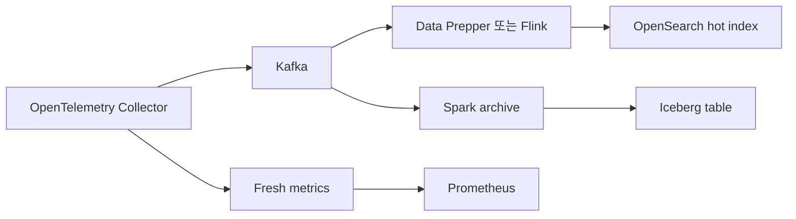

# 05. Apache Iceberg: Table Format과 장기 Archive 운영

## 이 장의 위치

- 상위 문서: [저장소 README](../../../README.md), [Kubernetes Observability](../README.md)
- 전체 경로: [01 OpenTelemetry](01-opentelemetry.md), [02 Kafka](02-kafka.md), [03 Flink](03-flink.md), [04 OpenSearch와 Data Prepper](04-opensearch-and-data-prepper.md), [05 Iceberg](05-iceberg.md), [06 Spark](06-spark.md), [07 Metrics and Prometheus](07-metrics-and-prometheus.md), [08 Integration Design](08-integration-design.md), [09 Labs and Review](09-labs-and-review.md)

## 문서 기준

- 조사일: **2026-09-15**
- 기준 문서: Apache Iceberg latest docs, Iceberg spec, Project Nessie docs
- 예시는 학습용입니다. 이 저장소에서는 object storage, catalog, Spark, Flink 작업을 실행하지 않았습니다.
- 실제 bucket, endpoint, credential, private dataset 이름을 쓰지 않습니다.

## 먼저 기억할 문장

Iceberg는 **table format**입니다.
Iceberg는 Spark, Flink, Trino 같은 engine이 읽고 쓰는 table metadata 규칙입니다.
Iceberg 자체가 stream processor도 아니고 OpenSearch 같은 search engine도 아닙니다.
Iceberg table은 object storage의 data file과 metadata file, 그리고 catalog pointer가 함께 있어야 의미가 있습니다.
장기 archive에는 잘 맞지만, fresh alert metric이나 사용자 facing 검색을 자동으로 해결하지 않습니다.

## 공식 근거 빠른 링크

- [Iceberg Introduction](https://iceberg.apache.org/docs/latest/): 여러 compute engine 위에서 SQL table처럼 쓰는 open table format
- [Iceberg Spec](https://iceberg.apache.org/spec/): data file, manifest, snapshot, metadata 구조
- [Iceberg Reliability](https://iceberg.apache.org/docs/latest/reliability/): atomic commit과 optimistic concurrency
- [Iceberg Spark Queries - Time Travel](https://iceberg.apache.org/docs/latest/spark-queries/#time-travel): snapshot 기준 조회
- [Iceberg Maintenance](https://iceberg.apache.org/docs/latest/maintenance/): expire snapshots, orphan file deletion, compaction 주의
- [Iceberg Nessie Catalog](https://iceberg.apache.org/docs/latest/nessie/): Iceberg catalog로 Nessie를 쓰는 방식
- [Project Nessie Iceberg + Spark](https://projectnessie.org/iceberg/spark/): Nessie의 Git-like catalog semantics

## Iceberg는 engine이 아니라 table format

Iceberg 문서는 Iceberg를 “huge analytic datasets”를 위한 open table format으로 설명합니다.
중요한 단어는 engine이 아니라 format입니다.
Spark가 SQL을 실행하고, Flink가 stream을 처리하고, Trino가 query를 실행합니다.
Iceberg는 이 engine들이 같은 table을 안전하게 읽고 쓰도록 metadata 규칙을 제공합니다.

| 범주 | 예 | 역할 |
| --- | --- | --- |
| Engine | Spark, Flink, Trino | 계산, query, streaming job 실행 |
| Table format | Iceberg | schema, partition, snapshot, manifest 규칙 |
| Storage | object storage, HDFS 등 | data file과 metadata file 보관 |
| Catalog | REST, Hive, JDBC, Nessie 등 | table name을 current metadata로 연결 |

이 구분을 잊으면 설계가 흔들립니다.
“Iceberg로 실시간 처리한다”는 말은 정확하지 않습니다.
정확한 표현은 “Flink 또는 Spark가 Iceberg table에 쓰고, 다른 engine이 Iceberg metadata를 따라 읽는다”입니다.

## data file과 metadata file

Iceberg table의 실제 row는 data file에 있습니다.
Iceberg spec은 data file format으로 Avro, Parquet, ORC 같은 형식을 다룹니다.
대부분의 lakehouse 운영에서는 Parquet가 흔하지만, format 선택은 engine과 workload 요구에 맞춰야 합니다.

```text
warehouse/
  events/
    data/                 # Parquet/Avro/ORC data files
    metadata/
      v00001.metadata.json
      snap-...avro        # manifest list
      manifest-...avro    # manifest files
```

| 파일 | 설명 | 사람이 직접 수정해도 되는가 |
| --- | --- | --- |
| Data file | 실제 row가 들어 있는 Parquet/Avro/ORC | 아니오 |
| Manifest | data/delete file 목록과 partition/statistics | 아니오 |
| Manifest list | snapshot이 참조하는 manifest 목록 | 아니오 |
| Metadata JSON | schema, partition spec, snapshot log, current snapshot | 아니오 |

Object storage directory만 보고 table 상태를 판단하면 위험합니다.
Iceberg는 현재 snapshot이 참조하는 file set이 table의 논리 상태입니다.
버려진 것처럼 보이는 file도 과거 snapshot이나 rollback이 참조할 수 있습니다.

## snapshot이 주는 의미

Iceberg snapshot은 특정 시점의 table file set입니다.
Spec은 snapshot에 snapshot id, parent snapshot id, sequence number, timestamp, manifest list 같은 필드가 있다고 설명합니다.
Reader는 current metadata가 가리키는 snapshot을 읽습니다.
Time travel query는 특정 timestamp 또는 snapshot id의 table 상태를 읽습니다.

| 개념 | 초보자 설명 | 운영 의미 |
| --- | --- | --- |
| Snapshot | table의 한 버전 | reproducible query와 rollback 기반 |
| Snapshot log | current snapshot 변화 이력 | time travel 판단 근거 |
| Manifest | snapshot이 참조하는 file 목록 | planning 성능과 metadata 크기에 영향 |
| Sequence number | 변경 순서 추적 | delete/merge semantics와 관련 |

Time travel은 backup과 같지 않습니다.
Retention으로 snapshot을 만료하면 그 snapshot은 time travel 대상에서 사라질 수 있습니다.
따라서 “30일 전까지 조회 가능” 같은 요구는 retention policy와 storage lifecycle을 함께 설계해야 합니다.

## catalog와 Nessie의 역할

Catalog는 `prod.events.span_archive` 같은 table name을 Iceberg metadata location으로 연결합니다.
Catalog가 없으면 engine은 어떤 metadata file이 현재 table 상태인지 안정적으로 알기 어렵습니다.
Nessie는 Iceberg catalog 구현 중 하나로 Git-like branch/tag semantics를 제공합니다.
Project Nessie 문서는 branch와 commit 개념으로 lake catalog 변경을 관리하는 방식을 설명합니다.

| 구성 | 담당 | 담당하지 않는 것 |
| --- | --- | --- |
| Iceberg table metadata | schema, snapshots, manifests | 사용자 인증 전체, object storage 자체 |
| Catalog | table name -> current metadata pointer | data file format 정의 전체 |
| Nessie | branch/tag/commit semantics가 있는 catalog | compute engine, object storage 대체 |
| Object storage | file 보관 | transaction 판단, schema evolution 판단 |

Nessie를 쓴다고 Iceberg metadata가 사라지지 않습니다.
Nessie는 catalog pointer와 versioned catalog history를 관리합니다.
Data file과 Iceberg metadata file은 여전히 storage에 있습니다.

## append, schema evolution, partition evolution

Iceberg는 append 중심의 archive table에 잘 맞습니다.
Introduction 문서는 schema evolution, hidden partitioning, partition layout evolution, time travel을 Iceberg의 주요 사용자 경험으로 설명합니다.
Telemetry archive에서는 새 field가 추가되거나 partition layout을 바꿔야 하는 일이 흔합니다.

| 변화 | Iceberg에서 다루는 방식 | 주의점 |
| --- | --- | --- |
| Column 추가 | schema evolution | reader가 null/default를 어떻게 해석하는지 확인 |
| Column rename | field id 기반 evolution | engine별 지원 차이 확인 |
| Partition 변경 | partition spec evolution | old files는 old spec에 남음 |
| Append | 새 data file과 새 snapshot commit | small file 증가 가능 |

Iceberg의 schema evolution은 “아무 변경이나 안전하다”는 뜻이 아닙니다.
Engine별 DDL 지원, reader compatibility, downstream query, data contract를 확인해야 합니다.
관측 데이터는 JSON처럼 느슨해 보이지만, 장기 archive에서는 schema가 비용과 품질을 결정합니다.

## concurrency와 atomic commit

Iceberg Reliability 문서는 table 변경이 metadata 교체를 통해 atomic하게 commit되고, conflict에는 optimistic concurrency를 사용한다고 설명합니다.
쉽게 말해 writer는 새 data file과 metadata를 준비한 뒤, catalog의 current pointer를 조건부로 바꿉니다.
다른 writer가 먼저 pointer를 바꾸면 conflict를 감지하고 retry 또는 실패합니다.

```text
writer A: snapshot 10을 기준으로 snapshot 11 준비
writer B: snapshot 10을 기준으로 snapshot 12 준비
B가 먼저 commit하면 A는 current가 바뀐 것을 보고 재시도 또는 실패
```

이 구조 덕분에 reader는 절반만 commit된 table 상태를 보지 않도록 설계됩니다.
하지만 atomic commit은 “source event 중복 제거”와 다릅니다.
Kafka에서 같은 event가 두 번 들어오거나 Spark job이 같은 범위를 두 번 append하면 Iceberg table에도 중복 row가 들어갈 수 있습니다.
Dedup은 primary key, event id, merge/upsert 설계, downstream query 규칙으로 별도 처리해야 합니다.

## OpenSearch snapshot/backup과 다르다

OpenSearch snapshot은 OpenSearch cluster index를 repository에 백업하는 기능입니다.
Iceberg snapshot은 table metadata가 참조하는 data file set입니다.
둘 다 “snapshot”이라는 단어를 쓰지만 계층이 다릅니다.

| 항목 | Iceberg snapshot | OpenSearch snapshot/backup |
| --- | --- | --- |
| 대상 | analytic table의 file set | OpenSearch index/cluster data |
| 목적 | time travel, rollback, reader isolation | search cluster backup/restore |
| 조회 engine | Spark/Flink/Trino 등 | OpenSearch |
| 보장 | table metadata 수준 | OpenSearch repository와 cluster 수준 |

OpenSearch hot index를 Iceberg snapshot으로 복원할 수 있다고 말하면 안 됩니다.
반대로 OpenSearch backup이 Iceberg table history를 보존한다고 말해도 안 됩니다.
학습 예시에서는 hot search와 archive table을 독립 경로로 둡니다.

## retention과 compaction 안전

Iceberg Maintenance 문서는 snapshot expiration, metadata cleanup, orphan file deletion, data file compaction을 설명합니다.
각 write는 새 snapshot을 만들 수 있고, streaming write는 metadata를 빠르게 늘릴 수 있습니다.
Snapshot을 만료하면 time travel 가능한 범위가 줄어듭니다.
Orphan file deletion은 진행 중인 write file을 지워 table을 망가뜨릴 수 있으므로 retention interval을 너무 짧게 잡으면 위험합니다.

| 작업 | 목적 | 안전 질문 |
| --- | --- | --- |
| Expire snapshots | 오래된 snapshot metadata와 미참조 file 정리 | time travel SLA를 침해하지 않는가 |
| Delete orphan files | metadata가 참조하지 않는 file 정리 | 진행 중 writer보다 충분히 오래된 file만 지우는가 |
| Rewrite data files | small files를 큰 file로 compaction | concurrent writer와 충돌 정책은 안전한가 |
| Rewrite manifests | planning metadata 최적화 | query planning 이점이 비용보다 큰가 |

Compaction은 단순 청소가 아닙니다.
Compaction도 새 snapshot을 만드는 table write입니다.
따라서 운영 job, streaming writer, batch backfill이 동시에 있을 때 commit conflict와 file churn을 고려해야 합니다.

## source-event dedup 보장 아님

Iceberg는 file과 snapshot metadata의 일관성을 관리합니다.
Iceberg가 자동으로 “같은 telemetry event가 한 번만 저장된다”고 보장하지 않습니다.
중복 제거가 필요하면 event id, trace id + span id, source offset, ingestion id 같은 business key를 설계해야 합니다.

| 중복 원인 | Iceberg가 자동 해결? | 필요한 설계 |
| --- | --- | --- |
| Kafka 재처리로 같은 event append | 아니오 | idempotent write 또는 merge |
| Spark restart 후 같은 micro-batch 재실행 | sink와 checkpoint에 따라 다름 | checkpoint, deterministic output, dedup key |
| upstream collector 중복 전송 | 아니오 | event identity와 late dedup window |
| 두 archive job이 같은 topic 범위 처리 | 아니오 | ownership, offset range, catalog 권한 |

Archive에서 중복을 허용하고 query에서 보정할 수도 있습니다.
반대로 저장 단계에서 dedup을 강제할 수도 있습니다.
어느 쪽이든 Iceberg format만으로 해결됐다고 쓰면 안 됩니다.

## real-time control과 archive는 독립 설계

장기 archive는 비용 효율, schema evolution, 재현 가능한 분석에 강합니다.
Real-time alert, autoscaling, user-facing dashboard는 fresh metrics와 낮은 지연이 중요합니다.
따라서 학습 예시에서는 fresh metrics를 별도 경로로 둡니다.
[07 Metrics and Prometheus](07-metrics-and-prometheus.md)는 이 경계를 다루는 장입니다.



OpenSearch 장애 분석을 위해 Iceberg archive를 읽을 수는 있습니다.
그러나 alerting loop가 archive compaction이나 time travel query에 의존하면 늦습니다.
운영 제어는 신선도 요구를 먼저 정의해야 합니다.

## 운영 체크리스트

- Catalog는 무엇인가: REST, Hive, JDBC, Nessie 중 무엇을 쓰는가.
- Object storage lifecycle이 Iceberg retention보다 먼저 file을 지우지 않는가.
- Snapshot retention과 time travel 요구가 일치하는가.
- Streaming writer의 commit 주기가 metadata 폭증을 만들지 않는가.
- Compaction job과 append writer가 동시에 충돌할 때 재시도 정책이 있는가.
- Source-event dedup 요구가 table format이 아니라 writer/query 설계에 반영됐는가.
- OpenSearch backup 요구와 Iceberg archive 요구를 같은 말로 섞지 않았는가.

## Troubleshooting 표

| 증상 | 흔한 원인 | 먼저 볼 것 |
| --- | --- | --- |
| query가 느림 | small files, manifest 증가 | file size 분포, manifest 수, compaction 이력 |
| time travel 실패 | snapshot expired | retention policy, snapshot log |
| table이 사라진 것처럼 보임 | catalog pointer 문제 | catalog current metadata location |
| data file은 있는데 query에 안 보임 | current snapshot이 참조하지 않음 | manifests, metadata tables |
| duplicate row 증가 | replay 또는 dual writer | event id, writer ownership, checkpoint |
| orphan cleanup 후 손상 | retention interval이 너무 짧음 | 진행 중 job 시간, orphan deletion 설정 |
| Nessie branch 혼동 | branch/tag context 불일치 | catalog branch 설정, commit log |

## 복습 문제

1. Iceberg가 engine이 아니라 table format이라는 말은 무엇을 뜻하나요?
2. data file, manifest, snapshot, catalog의 역할을 각각 한 문장으로 설명하세요.
3. Iceberg snapshot과 OpenSearch snapshot/backup을 혼동하면 어떤 문제가 생기나요?
4. Iceberg가 source-event dedup을 자동 보장하지 않는 이유는 무엇인가요?
5. orphan file deletion retention을 너무 짧게 잡으면 왜 위험한가요?

## 정답

1. Iceberg는 계산을 수행하는 runtime이 아니라 여러 engine이 공유할 table metadata와 file layout 규칙입니다.
2. Data file은 row를 담고, manifest는 file 목록과 통계를 담고, snapshot은 특정 시점의 file set을 가리키며, catalog는 table name을 current metadata로 연결합니다.
3. Search cluster 복구와 analytic table time travel은 대상과 계층이 다릅니다. 한쪽 snapshot이 다른 쪽 복구를 보장한다고 오해할 수 있습니다.
4. Iceberg는 commit과 metadata 일관성을 관리하지만 같은 event가 두 번 append되는 business-level 중복 여부는 알지 못하기 때문입니다.
5. 아직 commit 중인 writer의 file을 orphan으로 오판해 삭제하면 table corruption이나 data loss가 생길 수 있기 때문입니다.
