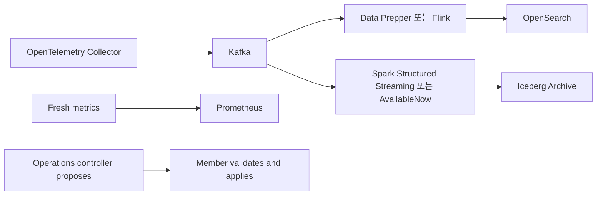

# 06. Apache Spark: Batch Archive와 Structured Streaming 운영

## 이 장의 위치

- 상위 문서: [저장소 README](../../../README.md), [Kubernetes Observability](../README.md)
- 전체 경로: [01 OpenTelemetry](01-opentelemetry.md), [02 Kafka](02-kafka.md), [03 Flink](03-flink.md), [04 OpenSearch와 Data Prepper](04-opensearch-and-data-prepper.md), [05 Iceberg](05-iceberg.md), [06 Spark](06-spark.md), [07 Metrics and Prometheus](07-metrics-and-prometheus.md), [08 Integration Design](08-integration-design.md), [09 Labs and Review](09-labs-and-review.md)

## 문서 기준

- 조사일: **2026-09-15**
- 기준 문서: Apache Spark latest docs와 Apache Iceberg latest docs
- 예시는 학습용 의사 코드입니다. 이 저장소에서는 Spark cluster, Kafka broker, Iceberg catalog를 실행하지 않았습니다.
- 실제 bootstrap server, credential, bucket, topic, 운영 table 이름을 쓰지 않습니다.

## 먼저 기억할 문장

Spark는 큰 데이터를 **batch 또는 micro-batch**로 처리하는 데 강한 engine입니다.
Structured Streaming은 Spark SQL engine 위에서 streaming query를 incremental하게 실행합니다.
Kafka source offset은 Spark checkpoint와 query progress에 의해 관리되며, Kafka consumer auto commit에 의존하는 방식으로 이해하면 안 됩니다.
학습 예시에서는 Spark가 hot OpenSearch ingestion을 대신하기보다 독립 archive 경로에서 Iceberg table을 채우는 역할이 자연스럽습니다.

## 공식 근거 빠른 링크

- [Spark Cluster Mode Overview](https://spark.apache.org/docs/latest/cluster-overview.html): driver, executor, task, job, stage
- [Spark SQL, DataFrames and Datasets Guide](https://spark.apache.org/docs/latest/sql-programming-guide.html): DataFrame과 Spark SQL engine
- [Structured Streaming Overview](https://spark.apache.org/docs/latest/streaming/index.html): micro-batch 기본 모델과 checkpoint 기반 fault tolerance
- [Structured Streaming APIs](https://spark.apache.org/docs/latest/streaming/apis-on-dataframes-and-datasets.html): source, trigger, checkpoint, AvailableNow
- [Structured Streaming Kafka Integration](https://spark.apache.org/docs/latest/streaming/structured-streaming-kafka-integration.html): startingOffsets, resume, auto commit 주의
- [Spark Tuning Guide](https://spark.apache.org/docs/latest/tuning.html): shuffle, memory, reduce task OOM, parallelism
- [Iceberg Spark Structured Streaming](https://iceberg.apache.org/docs/latest/spark-structured-streaming/): Iceberg streaming read/write, AvailableNow rate limiting, continuous processing 제한

## driver와 executor

Spark Cluster Mode Overview는 Spark application이 driver program과 executor process들로 구성된다고 설명합니다.
Driver는 `SparkContext` 또는 `SparkSession`을 만들고 job을 계획합니다.
Executor는 worker node에서 task를 실행하고 cache 또는 shuffle data를 보관합니다.

| 구성 | 역할 | 운영 질문 |
| --- | --- | --- |
| Driver | query plan, job scheduling, task coordination | driver memory, network reachability, query progress |
| Executor | task 실행, cache, shuffle read/write | CPU, heap, disk spill, executor loss |
| Task | executor에 보내는 작업 단위 | skew, retry, serialization |
| Stage | shuffle boundary로 나뉜 task 집합 | wide dependency, shuffle size |
| Job | action 또는 streaming micro-batch가 만든 실행 | duration, failure, retry |

Driver가 모든 데이터를 처리한다고 생각하면 안 됩니다.
Driver는 계획과 조정을 담당하고, data processing은 executor task가 수행합니다.
다만 driver가 query plan, checkpoint metadata, streaming progress를 관리하므로 driver 장애도 중요합니다.

## DataFrame 중심으로 이해하기

Spark SQL 문서는 DataFrame을 이름 있는 column으로 조직된 Dataset이라고 설명합니다.
DataFrame API는 batch와 streaming 모두에서 핵심 인터페이스입니다.
초보자는 RDD보다 DataFrame, schema, logical plan, physical plan을 먼저 이해하는 편이 좋습니다.

```text
Kafka topic bytes
  -> DataFrame(key, value, topic, partition, offset, timestamp)
  -> parse JSON / select columns
  -> repartition or aggregate
  -> write Iceberg table
```

| 개념 | 설명 | 예 |
| --- | --- | --- |
| Logical plan | 무엇을 계산할지 | select, filter, groupBy |
| Physical plan | 어떻게 실행할지 | shuffle, sort, join strategy |
| Narrow transform | partition 간 이동이 적음 | select, filter |
| Wide transform | shuffle이 필요함 | groupBy, join, distinct |

Spark 성능 문제의 상당수는 wide transform과 shuffle에서 시작됩니다.
따라서 archive job에서도 “그냥 저장”인지 “aggregation/join 후 저장”인지가 운영 난이도를 바꿉니다.

## stage와 shuffle

Shuffle은 같은 key의 data를 같은 쪽으로 모으기 위해 network와 disk를 사용하는 경계입니다.
Spark Tuning Guide는 shuffle·join·sort·aggregation이 execution memory와 reduce task memory에 영향을 준다고 설명합니다.
GroupBy key가 한쪽으로 몰리면 특정 reduce task만 느려집니다.
이것이 skew입니다.

| 증상 | 가능한 원인 | 대응 방향 |
| --- | --- | --- |
| 특정 task만 오래 걸림 | key skew | salting, partitioning, key 설계 |
| executor disk spill 증가 | shuffle memory 부족 | partition 수, memory, query plan 조정 |
| 작은 file 폭증 | micro-batch가 너무 자주 commit | trigger interval, coalesce, compaction |
| driver OOM | 너무 큰 collect 또는 metadata | collect 금지, pagination, file 수 관리 |

Shuffle은 나쁜 것이 아니라 분산 처리의 비용입니다.
운영자는 “shuffle이 있는가”보다 “shuffle 크기와 skew가 예측 가능한가”를 물어야 합니다.

## batch와 micro-batch

Spark batch job은 정해진 input 범위를 읽고 결과를 쓴 뒤 종료합니다.
Structured Streaming은 unbounded input을 DataFrame처럼 표현하고, 기본적으로 작은 batch의 반복으로 처리합니다.
Spark docs는 micro-batch engine이 기본이고, AvailableNow trigger로 현재 이용 가능한 데이터를 여러 micro-batch로 처리할 수 있음을 설명합니다.

| 모드 | 설명 | 맞는 일 |
| --- | --- | --- |
| Batch | 시작과 끝이 있는 처리 | 하루치 archive 보정, backfill |
| ProcessingTime micro-batch | 일정 주기로 새 data 처리 | Kafka -> Iceberg nearline archive |
| AvailableNow | 현재 쌓인 data를 micro-batch로 모두 처리하고 종료 | 재처리, 일회성 catch-up |
| Continuous | 낮은 latency 실험적 모드 | Iceberg sink에는 부적합 |

Iceberg Spark Structured Streaming 문서는 Iceberg가 continuous processing을 지원하지 않는다고 설명합니다.
이유는 continuous mode가 output commit interface를 제공하지 않기 때문입니다.
따라서 Iceberg sink와 함께 쓸 때는 micro-batch trigger를 전제로 version별 지원을 확인해야 합니다.

## Kafka source offset과 checkpoint

Spark Kafka integration 문서는 streaming query에서 `startingOffsets`가 새 query 시작 때 적용되고, resume은 checkpoint에 남은 위치에서 이어진다고 설명합니다.
또한 Kafka source는 `enable.auto.commit`으로 offset을 commit하지 않습니다.
Structured Streaming이 어떤 offset을 소비했는지 내부적으로 관리합니다.

| 항목 | 의미 | 주의점 |
| --- | --- | --- |
| startingOffsets | 새 query 최초 시작 offset | checkpoint가 있으면 resume에는 적용되지 않음 |
| checkpointLocation | progress, offsets, state 저장 위치 | job code 변경과 query name 변경 시 호환성 확인 |
| maxOffsetsPerTrigger | micro-batch당 Kafka offset 제한 | backlog catch-up 속도와 latency tradeoff |
| failOnDataLoss | offset 손실 감지 시 실패 여부 | retention 초과 상황을 숨기지 않도록 주의 |

```scala
// 학습용 예시입니다. 이 저장소에서 실행하지 않았습니다.
val raw = spark.readStream
  .format("kafka")
  .option("kafka.bootstrap.servers", "<KAFKA_BOOTSTRAP>")
  .option("subscribe", "<OBSERVABILITY_TOPIC>")
  .option("startingOffsets", "earliest")
  .load()
```

`<KAFKA_BOOTSTRAP>`와 `<OBSERVABILITY_TOPIC>`은 placeholder입니다.
실제 endpoint나 secret을 문서에 넣지 않습니다.
운영에서는 checkpoint path, query id, topic ownership을 함께 관리해야 합니다.

## Iceberg sink와 version 확인

Iceberg Spark Structured Streaming 문서는 `DataStreamWriter`로 Iceberg table에 streaming write하는 예를 제시하고, append와 complete output mode를 설명합니다.
같은 문서는 `Trigger.AvailableNow`에서 rate limiting option을 적용할 수 있다고 설명합니다.
하지만 Spark, Iceberg runtime, catalog, object storage, Scala binary version 조합은 배포 전 확인해야 합니다.
이 문서는 특정 version matrix를 꾸며내지 않습니다.

```scala
// 학습용 예시입니다. live 검증하지 않았습니다.
parsed.writeStream
  .format("iceberg")
  .outputMode("append")
  .trigger(org.apache.spark.sql.streaming.Trigger.AvailableNow())
  .option("checkpointLocation", "<CHECKPOINT_PATH>")
  .toTable("<CATALOG>.<NAMESPACE>.<TABLE>")
```

확인 질문:

- Spark runtime version과 Iceberg Spark runtime artifact가 맞는가.
- Scala binary version이 맞는가.
- Catalog 구현이 streaming write와 checkpoint 재시작을 시험했는가.
- `AvailableNow`가 해당 source/sink 조합에서 기대대로 동작하는가.
- Partitioned table writer가 small files를 만들지 않는가.

## restart, overlap, idempotency

Streaming job은 실패 후 같은 checkpoint로 재시작할 수 있어야 합니다.
하지만 output idempotency가 없으면 overlap 구간에서 중복 row가 생길 수 있습니다.
Spark와 Iceberg가 commit을 관리하더라도 business-level dedup은 별도 설계입니다.
[05 Iceberg](05-iceberg.md)에서 설명한 것처럼 Iceberg table format 자체가 source-event dedup을 자동 보장하지 않습니다.

| 상황 | 위험 | 방어 |
| --- | --- | --- |
| checkpoint 삭제 후 earliest 재시작 | 전체 중복 append | checkpoint 보존, backfill table 분리 |
| code 변경 후 checkpoint 재사용 | state schema/query plan 불일치 | 변경 호환성 검토, 새 checkpoint와 cutover |
| AvailableNow 반복 실행 | 같은 범위 재처리 | deterministic range, event id dedup |
| 작은 trigger interval | tiny files | trigger 조정, file size tuning, compaction |

Archive job은 “중복이 절대 없어야 한다”보다 “중복 발생 조건을 알고 제거 또는 허용 정책을 정했다”가 중요합니다.
장기 분석 table에서는 중복 허용 후 query에서 latest를 고르는 전략도 가능하지만, 비용과 복잡도를 문서화해야 합니다.

## tiny file tradeoff

Micro-batch를 자주 commit하면 latency는 줄지만 작은 data file이 늘어납니다.
작은 file은 object storage request 수, metadata 크기, query planning 비용을 늘립니다.
Iceberg 문서는 streaming write가 table versions와 metadata를 빠르게 만들 수 있어 maintenance가 필요하다고 설명합니다.

| 선택 | 장점 | 단점 |
| --- | --- | --- |
| 짧은 trigger | archive freshness 좋음 | tiny files와 metadata 증가 |
| 긴 trigger | 큰 file을 만들기 쉬움 | 지연 증가, failure replay 범위 증가 |
| AvailableNow catch-up | backlog 처리에 명확함 | source/sink 지원 확인 필요 |
| Compaction | query 효율 개선 | 추가 write, conflict, 비용 |

Tiny file 문제는 Spark만의 문제가 아닙니다.
Kafka partition 수, input rate, partition spec, trigger interval, executor parallelism, Iceberg writer 설정이 함께 만듭니다.

## Spark archive와 Flink processing의 선택

[03 Flink](03-flink.md)는 낮은 지연의 stateful stream processing과 watermark를 다룹니다.
Spark는 대규모 batch, backfill, micro-batch archive에 자연스럽습니다.
둘은 경쟁 제품이라기보다 시간 요구와 처리 모델이 다른 도구입니다.

| 요구 | Spark가 맞는 경우 | Flink가 맞는 경우 |
| --- | --- | --- |
| 하루치 재처리 | batch/AvailableNow로 명확 | 가능하지만 운영 복잡도 높을 수 있음 |
| 초 단위 hot index | micro-batch 지연이 부담 | continuous stream processing 후보 |
| event-time late data | 제한적 처리 가능 | watermark/window 모델이 강함 |
| 장기 Iceberg archive | 자연스러움 | 가능하지만 sink/version 검토 필요 |
| 복잡한 stateful join | batch join은 강함 | unbounded stateful stream join에 강함 |

학습 예시에서는 `Kafka -> Spark -> Iceberg`를 archive 경로로 둡니다.
`Kafka -> Data Prepper 또는 Flink -> OpenSearch`는 hot search 경로입니다.
Fresh metrics는 별도 경로입니다.
Operations controller는 변경안을 제안하고 Member가 검증·적용합니다.
이 모델은 학습용 architecture이며 설치나 universal standard가 아닙니다.

## 예시 전체 흐름



Spark archive job은 OpenSearch sink의 retry queue가 아닙니다.
OpenSearch와 Iceberg는 서로 다른 query pattern과 retention requirement를 가집니다.
한쪽 장애가 다른 쪽의 data ownership을 자동으로 바꾸지 않습니다.

## Troubleshooting 표

| 증상 | 흔한 원인 | 먼저 볼 것 |
| --- | --- | --- |
| Kafka backlog가 줄지 않음 | micro-batch 처리 시간 > trigger interval | batch duration, maxOffsetsPerTrigger, executor CPU |
| 재시작 후 startingOffsets가 안 먹힘 | 기존 checkpoint 사용 | checkpointLocation, query id |
| 중복 row 증가 | checkpoint 삭제, overlap 재실행 | event id, batch id, Iceberg snapshot history |
| tiny file 폭증 | 짧은 trigger, 낮은 input rate, 과도한 partition | file size, snapshot commit 빈도 |
| 특정 stage가 매우 느림 | shuffle skew | stage task duration, key distribution |
| driver memory 증가 | file metadata 또는 collect 남용 | query plan, file count, driver logs |
| Iceberg write 실패 | catalog conflict 또는 version mismatch | Spark/Iceberg artifact, catalog commit log |

## 복습 문제

1. Spark driver와 executor의 역할 차이는 무엇인가요?
2. Structured Streaming이 Kafka offset을 Kafka auto commit에 의존하지 않는다는 말은 무엇을 뜻하나요?
3. `startingOffsets`가 재시작 때 기대대로 적용되지 않는 흔한 이유는 무엇인가요?
4. Iceberg sink에서 `AvailableNow`를 쓸 때 version 확인이 필요한 이유는 무엇인가요?
5. Spark archive와 Flink hot processing을 구분해야 하는 이유는 무엇인가요?

## 정답

1. Driver는 Spark application을 계획하고 job/task를 조정하며, executor는 worker에서 task를 실행하고 data/cache/shuffle을 처리합니다.
2. Structured Streaming이 소비 위치를 checkpoint와 query progress로 관리하며 Kafka consumer의 `enable.auto.commit`으로 source offset을 확정하지 않는다는 뜻입니다.
3. 기존 checkpoint가 있으면 streaming query는 새 `startingOffsets`가 아니라 checkpoint에 저장된 진행 위치에서 이어가기 때문입니다.
4. Spark trigger, Iceberg runtime artifact, catalog, sink commit semantics는 version 조합에 따라 지원 범위가 다를 수 있으므로 공식 문서와 테스트로 확인해야 합니다.
5. Spark는 batch·micro-batch archive와 backfill에 강하고, Flink는 낮은 지연의 stateful event-time processing에 강합니다. 같은 Kafka source를 읽어도 운영 목표가 다릅니다.
