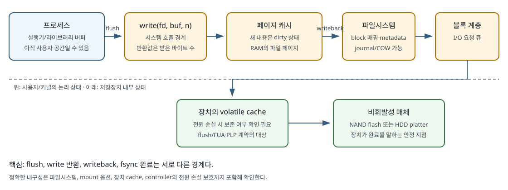

# 00b. 프로그램·프로세스·메모리: 파일 I/O를 배우기 위한 운영체제 입문

[학습 목차](README.md) · 이전: [바이트·페이로드·패킷](00a-bytes-payload-and-packets.md) · 다음: [Linux 관측](00c-linux-observation-and-troubleshooting.md) · 심화: [Linux·커널 독립 교재](../../../linux/learning/linux-kernel/README.md)

이 장은 운영체제를 처음 보는 독자를 위한 연결 장이다. 목표는 커널 구현을 외우는 것이 아니라 **프로그램이 실행되어 프로세스가 되고, 가상 메모리와 파일 디스크립터를 거쳐 커널에 I/O를 요청하는 과정**을 설명하는 것이다. 여기서 잡은 소유 관계가 01장의 페이지 캐시와 `fsync()`를 이해하는 바탕이 된다.

## 1. 먼저 전체 경로를 본다


디스크에 놓인 **프로그램(program)**은 실행할 명령과 초기 데이터가 담긴 파일이다. 아직 실행 주체는 아니다. 셸 등이 `exec` 계열 호출로 프로그램을 적재하면 **프로세스(process)**, 즉 PID와 주소 공간, 열린 파일들을 가진 실행 단위가 된다. 프로세스는 자기 메모리의 버퍼 주소와 파일 디스크립터 번호를 `write()`에 넘기고, 커널은 그 번호를 실제 열린 파일 상태로 연결한다.

## 2. 프로그램, 프로세스, 스레드는 서로 다르다

| 용어 | 한 문장 정의 | 무엇을 소유하거나 공유하는가 |
| --- | --- | --- |
| 프로그램(program) | 실행 가능한 명령과 초기 데이터가 담긴 파일 | 파일 자체는 PID나 실행 중인 스택을 갖지 않는다. |
| 프로세스(process) | 프로그램을 실행하는 격리된 자원 단위 | PID, 가상 주소 공간, fd table, 자격 정보 등을 가진다. |
| 스레드(thread) | 한 프로세스 안에서 명령을 실행하는 흐름 | 같은 프로세스의 주소 공간과 열린 파일을 대체로 공유하고, 각자 스택과 실행 상태를 가진다. |
| 커널(kernel) | 하드웨어와 보호 자원을 중재하는 운영체제 핵심 | 실행 순서, 가상 메모리, 파일시스템, 네트워크, 장치 드라이버를 관리한다. |

같은 `/usr/bin/python3` 파일을 세 번 실행하면 프로그램 파일은 하나여도 프로세스는 세 개다. 각 프로세스는 서로 다른 **PID(Process ID, 프로세스 식별 번호)**와 주소 공간을 가진다. 한 프로세스의 잘못된 포인터가 보통 다른 프로세스의 메모리를 곧바로 읽지 못하는 이유가 이 격리다.

## 3. 셸은 명령어가 아니라 프로그램이다

터미널에 `python3 job.py`라고 입력할 때 터미널, 셸, Python을 구분한다.

1. 터미널은 문자 입출력을 제공한다.
2. 셸(`bash` 등)은 입력을 해석한다.
3. 셸은 필요하면 새 프로세스를 만들고 Python 실행 파일을 적재한다.
4. Python 프로세스가 `job.py`를 열고 읽어 실행한다.

`|`, `>`, `*` 같은 문자는 Python보다 먼저 셸이 해석할 수 있다. 예를 들어 `producer | consumer`에서 셸은 **파이프(pipe)**라는 커널 내부 바이트 통로를 만들고 두 프로세스의 표준 입출력을 연결한다. “명령이 무엇을 읽고 어디에 썼는가”를 밝히려면 이 경계를 알아야 한다.

## 4. PID와 권한은 요청의 주체를 식별한다

PID는 시간이 지나 재사용될 수 있으므로 영구 식별자가 아니다. 프로세스에는 사용자 ID와 그룹 ID 같은 **자격 정보(credentials)**도 연결된다. 파일 접근 때 커널은 경로, 파일 메타데이터, 현재 자격 정보와 권한 규칙을 함께 본다.

`sudo`는 파일 권한을 무시하는 주문이 아니라 다른 자격 정보로 명령을 실행하게 하는 도구다. 학습 실습에서는 sudo가 필요한 조작을 피한다. 권한 오류는 원인을 보여 주는 증거이며 무조건 권한을 높이면 원래 문제를 가릴 수 있다.

## 5. 가상 주소와 물리 메모리를 분리한다

프로그램이 보는 포인터는 보통 **가상 주소(virtual address)**다. CPU와 커널의 메모리 관리 기능이 이를 물리 메모리 프레임과 연결한다. 이 덕분에 각 프로세스는 자신만의 연속된 주소 공간처럼 볼 수 있다.

```text
프로세스 A의 0x4000 ─┐
                     ├─ page table을 통해 서로 다른 physical frame에 mapping
프로세스 B의 0x4000 ─┘
```

숫자가 같은 가상 주소라도 프로세스가 다르면 보통 다른 물리 메모리를 뜻한다. 반대로 공유 메모리나 파일 매핑을 사용하면 서로 다른 가상 주소가 같은 물리 페이지를 가리킬 수도 있다.

### 페이지는 문맥을 붙여 말한다

- **가상 메모리 페이지(virtual memory page)**: 가상 주소 공간을 나누는 고정 크기 단위다.
- **물리 페이지 프레임(physical page frame)**: RAM 쪽의 대응 단위다.
- **페이지 캐시 페이지(page-cache page)**: 파일 내용을 RAM에 임시 보관한 커널 관리 단위다.
- **데이터베이스·Parquet·SSD 페이지**: 각 시스템이 별도로 정의한 단위다.

이름이 같다고 크기와 책임까지 같지는 않다. 실제 OS 페이지 크기는 `getconf PAGESIZE`로 확인할 수 있으며 흔히 4 KiB지만 고정 불변값으로 가정하지 않는다.

## 6. code, heap, stack, mapping을 주소 공간 안에서 찾는다

| 영역 | 주된 내용 | 크기·수명 직관 |
| --- | --- | --- |
| 코드(code/text) | 실행할 기계 명령 | 실행 파일에서 매핑되며 보통 쓰기 불가 |
| 데이터(data) | 전역·정적 데이터 | 프로세스 수명과 함께 존재 |
| 힙(heap) | 실행 중 동적으로 할당한 객체 | 메모리 할당기가 관리하고 필요에 따라 확장 |
| 스택(stack) | 함수 호출 정보와 지역 변수 일부 | 스레드마다 있으며 호출과 반환에 따라 변함 |
| 파일/익명 매핑(mapping) | `mmap()`한 파일 또는 익명 메모리 | 페이지 폴트 때 실제 페이지가 연결될 수 있음 |

Python 객체 하나가 “힙에 있다”는 설명은 출발점일 뿐이다. Python 실행기 할당기, C 라이브러리 할당기, 가상 메모리 매핑, 물리 페이지라는 여러 층이 더 있다. 객체를 해제한 뒤에도 RSS가 즉시 같은 양만큼 감소한다고 단정할 수 없는 이유다.

## 7. 페이지 폴트는 언제나 오류가 아니다

CPU가 접근한 가상 페이지에 현재 필요한 매핑이 없으면 **페이지 폴트(page fault)**가 발생한다. 이름에 fault가 있지만 정상적인 지연 할당에서도 쓰이는 커널 처리 사건이다.

- 아직 물리 프레임만 붙지 않은 익명 페이지라면 프레임을 할당할 수 있다.
- 파일 매핑 페이지가 RAM에 없다면 저장장치에서 읽어 올 수 있다.
- 이미 RAM에 있는 페이지와 매핑만 연결하면 디스크 I/O 없이 처리될 수 있다.
- 허용되지 않은 주소나 권한이면 프로세스에 `SIGSEGV` 같은 신호를 보낼 수 있다.

따라서 “페이지 폴트가 늘었다 = 디스크가 고장 났다”는 결론은 성립하지 않는다. 폴트 종류와 I/O·메모리 압박 증거를 함께 봐야 한다.

## 8. fd는 파일이 아니라 프로세스 안의 작은 번호다

**파일 디스크립터(file descriptor, fd)**는 프로세스의 fd table에 있는 정수 인덱스다. 관례적으로 새 프로세스는 `0` 표준 입력, `1` 표준 출력, `2` 표준 오류를 연결받지만 redirect되거나 닫힐 수 있다.

```text
프로세스 fd table          커널의 열린 파일 상태             파일 객체
fd 0 ───────────────────▶ terminal/pipe ...
fd 3 ─┐
      ├─────────────────▶ offset=120, flags=... ───────────▶ inode/file
fd 7 ─┘  dup()로 같은 open file description을 공유할 수 있음
```

**오프셋(offset)**은 여기서는 파일의 시작에서 몇 바이트 떨어진 위치인지를 나타낸다. fd 번호 `3`은 다른 프로세스의 fd `3`과 무관할 수 있다. `dup()`로 만든 두 fd는 같은 **열린 파일 기술(open file description, OFD)**을 가리켜 오프셋을 공유한다. 같은 경로를 `open()` 두 번 하면 보통 OFD도 둘이라 오프셋이 독립적이다. 이 차이는 [01장](01-linux-read-write.md#9-open-두-번-dup-fork의-offset-차이)에서 확인한다.

## 9. 시스템 호출은 보호 경계를 건너는 요청이다

**시스템 호출(system call, syscall)**은 사용자 프로그램이 보호된 커널 기능을 요청하는 공식 경계다. `openat()`, `read()`, `write()`, `fsync()`가 예다.

`write(fd, buf, 4096)`를 풀면 다음 질문이 생긴다.

1. `fd`는 현재 프로세스에서 무엇을 가리키는가?
2. `buf` 가상 주소에서 4096바이트를 읽을 권한이 있는가?
3. 파일 오프셋은 어디인가? `O_APPEND`인가?
4. 커널 페이지 캐시에 복사한 뒤 바로 반환하는가?
5. 저장장치에 언제 제출하고 언제 안정 저장됐다고 볼 것인가?

시스템 호출 반환은 해당 호출의 계약만 말한다. `write()`가 4096을 반환했다고 해서 정전 뒤에도 그 4096바이트가 반드시 남는 것은 아니다.

## 10. 사용자 버퍼와 페이지 캐시는 다른 메모리다

**버퍼(buffer)**는 생산자와 소비자의 속도·호출 크기 차이를 완충하려고 데이터를 잠시 모아 두는 영역이다. **캐시(cache)**는 나중에 같은 데이터를 다시 쓸 때 원본보다 빨리 얻으려고 복사본을 보관한다. 같은 RAM을 써도 목적이 다르다.

```text
Python/프로그램 buffer
   │ flush: 실행기 buffer의 bytes를 아래 파일 객체/syscall로 보냄
   ▼
커널 page cache의 file page (dirty 가능)
   │ writeback: 커널이 block I/O를 장치로 제출
   ▼
장치 내부 cache·flash/HDD media
```

**플러시(flush)**는 특정 계층에 쌓인 내용을 다음 계층으로 밀어내는 동작이라 대상 계층을 붙여야 한다. **더티(dirty)** 페이지는 파일보다 새 내용이 RAM에만 반영돼 장치로 써야 하는 페이지다. **라이트백(writeback)**은 그 더티 페이지를 저장장치 쪽으로 기록하는 과정이다. 프로그램의 `flush()`는 보통 사용자 공간 버퍼를 비우는 단계다. 커널의 더티 페이지를 장치 안정 저장 지점까지 보내도록 요청하고 기다리는 **`fsync()` 파일 동기화 시스템 호출**과 같은 말이 아니다.



*그림 00b-1. 한 번의 쓰기가 지나갈 수 있는 경계. 화살표는 전형적인 경로를 단순화한 것이며 각 반환 시점의 내구성은 API·파일시스템·장치에 따라 확인해야 한다.*

## 11. `fork()`와 `exec()`를 소유 관계로 읽는다

`fork()`는 호출 시점의 프로세스를 바탕으로 자식 프로세스를 만든다. 메모리는 보통 **쓰기 시 복사(copy-on-write)** 방식으로 시작하고, 열린 fd는 같은 OFD를 참조할 수 있다. 따라서 부모와 자식이 같은 fd로 읽으면 오프셋에 서로 영향을 줄 수 있다.

`exec()`는 새 PID를 만드는 호출이 아니라 현재 프로세스의 실행 이미지를 새 프로그램으로 교체하는 계열이다. close-on-exec로 표시하지 않은 fd가 새 프로그램에 이어질 수 있다. 셸 파이프라인과 daemon이 fd를 넘기는 데 이 성질을 사용한다.

## 12. 12 KiB 읽기를 숫자로 따라가 본다

교육용으로 OS 페이지 크기가 4 KiB이고 파일 오프셋 0부터 12 KiB를 읽는다고 하자.

- 요청 바이트: `12 × 1024 = 12,288 bytes`
- 겹치는 4 KiB 파일 페이지: 0–4095, 4096–8191, 8192–12287의 3개
- 세 페이지가 페이지 캐시에 있으면 장치 읽기 없이 복사될 수 있다.
- 하나만 캐시에 있고 둘이 없다면 실제 장치 I/O 크기와 횟수는 미리 읽기, 파일시스템, 장치 정책에 따라 달라진다. “정확히 2번”이라고 단정하지 않는다.

논리적 읽기 크기와 물리 I/O 크기가 다른 이유가 여기서 시작된다.

## 13. 안전한 관찰

```bash
printf 'shell PID=%s\n' "$$"
getconf PAGESIZE
ulimit -n
ls -l /proc/self/fd 2>/dev/null || true
```

- `$$`는 현재 셸의 PID이며 다음 실행에서 달라질 수 있다.
- `PAGESIZE`는 이 환경의 기본 페이지 크기다.
- `ulimit -n`은 현재 셸과 자식 프로세스에 적용되는 열린 파일 수 제한의 한 부분이다.
- `/proc/self/fd`는 이 명령 프로세스가 가진 fd를 보여 준다. 시스템의 모든 파일 목록이 아니다.

## 14. 확인 문제와 답

1. **같은 프로그램을 두 번 실행하면 주소 `0x4000`은 같은 RAM 위치인가?** 답: 그렇다고 볼 수 없다. 가상 주소는 프로세스별 주소 공간에서 해석된다.
2. **fd 3은 세 번째 파일인가?** 답: 아니다. 현재 프로세스 fd table의 인덱스일 뿐이며 무엇에 연결됐는지 확인해야 한다.
3. **`write()` 성공은 정전 내구성을 뜻하는가?** 답: 일반적으로 아니다. 페이지 캐시까지만 반영된 상태일 수 있으며 별도의 동기화 계약을 확인한다.
4. **페이지 폴트는 모두 디스크 I/O인가?** 답: 아니다. 매핑만 보완하는 minor fault일 수도 있고 잘못된 접근일 수도 있다.
5. **왜 `dup()`한 fd끼리 오프셋이 움직이는가?** 답: 두 fd가 같은 OFD의 파일 오프셋을 참조할 수 있기 때문이다.

## 15. 근거와 더 읽을 자료

- [Linux man-pages: proc_pid_fd(5)](https://man7.org/linux/man-pages/man5/proc_pid_fd.5.html)
- [Linux man-pages: open(2)](https://man7.org/linux/man-pages/man2/open.2.html)
- [Linux man-pages: fork(2)](https://man7.org/linux/man-pages/man2/fork.2.html)
- [Linux man-pages: execve(2)](https://man7.org/linux/man-pages/man2/execve.2.html)
- [Linux kernel documentation: Page Cache](https://docs.kernel.org/mm/page_cache.html)
- 더 넓은 설명은 [Linux·커널 독립 교재](../../../linux/learning/linux-kernel/README.md)에서 이어진다.
