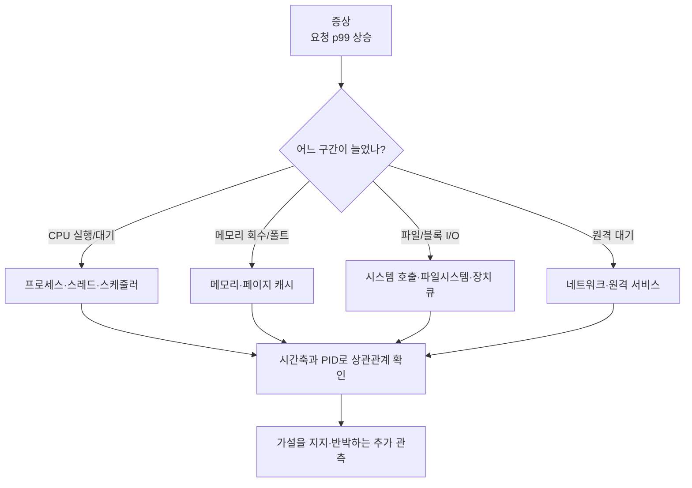

# 00c. Linux 관측과 문제 해결: 숫자를 원인으로 오해하지 않는 법

[학습 목차](README.md) · 이전: [프로세스·메모리](00b-linux-processes-and-memory.md) · 다음: [Linux 읽기·쓰기](01-linux-read-write.md) · 심화: [Linux·커널 독립 교재](../../../linux/learning/linux-kernel/README.md)

관측 도구를 많이 아는 것보다 중요한 것은 **질문 → 후보 원인 → 구별할 증거 → 가장 작은 관측 → 해석**의 순서다. 이 장의 명령은 읽기 전용이다. 출력 필드와 제공 여부는 Linux 배포판·커널·도구 버전에 따라 달라질 수 있다.

## 1. 문제를 증상 문장으로 바꾼다

“서버가 느리다”는 아직 측정 가능한 질문이 아니다. 다음처럼 범위를 고정한다.

> 14:00–14:10 사이 API의 p99 지연시간이 80 ms에서 900 ms로 상승했다. 같은 시간 요청률은 비슷했고, 특정 작업 서버 세 대에서만 재현됐다.

좋은 증상 문장에는 시간 구간, 관측 대상, 지표, 비교 기준, 영향 범위가 있다. 원인은 쓰지 않는다. “디스크 때문에 느리다”는 이미 가설이다.

## 2. 증거 사슬을 먼저 그린다



**지연시간(latency)**은 요청 하나가 시작부터 끝까지 걸린 시간이고, **p99(99번째 백분위수)**는 관측값 99%가 그 값 이하였다는 경계다. 한 숫자는 보통 여러 원인을 갖는다. CPU 사용률이 낮아도 잠금·I/O·네트워크를 기다릴 수 있고, 메모리의 `used`가 커도 페이지 캐시라면 즉시 장애가 아니다. 서로 다른 계층의 증거를 같은 시간축과 같은 PID·호스트·요청에 맞춰야 한다.

## 3. 관측의 네 질문

1. **누구인가?** 호스트, 컨테이너, 프로세스, 스레드, fd, 장치를 식별한다.
2. **언제인가?** 시계 시간 구간과 표본 간격을 기록한다.
3. **무엇을 기다리는가?** CPU, 실행 대기열, 잠금, 메모리 회수, 페이지 폴트, 블록 I/O, 네트워크 중 후보를 세운다.
4. **어느 경계의 숫자인가?** 애플리케이션 지연, 시스템 호출 지연, 블록 장치 지연을 섞지 않는다.

## 4. 프로세스부터 식별한다

```bash
ps -eo pid,ppid,stat,etime,comm,args --sort=pid
```

| 열 | 뜻 | 주의점 |
| --- | --- | --- |
| PID/PPID | 프로세스와 부모 프로세스 식별자 | PID는 재사용될 수 있다. |
| STAT | 실행·sleep 등 현재/부가 상태 코드 | 한 순간의 표본만으로 장기 상태를 단정하지 않는다. |
| ELAPSED | 시작 후 경과 시간 | CPU를 사용한 시간과 다르다. |
| COMMAND/ARGS | 실행 이름과 인자 | 이름만으로 실제 바이너리·컨테이너를 단정하지 않는다. |

`ps`는 순간 사진이다. 짧게 생겼다 사라지는 프로세스나 스레드별 병목은 놓칠 수 있다.

## 5. `/proc`는 커널이 보여 주는 현재 상태 창이다

```bash
pid=$$
sed -n '1,25p' "/proc/$pid/status"
sed -n '1,20p' "/proc/$pid/limits"
ls -l "/proc/$pid/fd"
```

- `status`: 이름, 상태, UID, 메모리 수치, 스레드 수 등을 제공한다.
- `limits`: 열린 파일 수 같은 자원 제한을 보여 준다.
- `fd`: fd 번호가 파이프, 소켓, 파일 중 무엇을 가리키는지 단서를 준다.

관측 중 대상 PID가 종료되고 같은 번호가 재사용될 수 있다. 시작 시각이나 프로세스 정체성을 함께 고정해야 한다.

## 6. CPU 사용률과 대기를 분리한다

`top`이나 `ps`의 CPU%는 일정 시간 동안 CPU에서 실행된 비율에 관한 지표다. 느린 원인을 곧바로 말하지 않는다.

- 높은 사용자 CPU: 계산, 직렬화, 압축 같은 사용자 코드 후보
- 높은 시스템 CPU: 시스템 호출·커널 작업 후보
- 실행 가능한 작업 증가: CPU 경합 후보
- 낮은 CPU와 긴 지연: I/O·잠금·네트워크 대기 후보

시스템 전체 **load average(평균 부하)**는 단순 CPU 사용률이 아니다. Linux에서는 실행 가능 작업과 일부 중단 불가능 대기가 포함될 수 있다. CPU 코어 수, 작업 상태, 시간 변화를 함께 본다.

## 7. 메모리 숫자를 주소 공간·RSS·캐시로 나눈다

```bash
free -h
sed -n '1,30p' /proc/meminfo
```

**RSS(Resident Set Size, 상주 집합 크기)**는 프로세스의 가상 메모리 중 현재 RAM에 상주한 규모를 나타내지만 공유 페이지 계산과 도구 방식에 주의해야 한다. **VSZ/VIRT(가상 메모리 크기)**는 예약한 가상 주소 범위를 포함해 실제 RAM 사용과 같지 않다. 시스템의 페이지 캐시는 파일을 빠르게 다시 읽기 위해 RAM을 사용하며 상황에 따라 회수될 수 있다.

그래서 `free`가 작다는 한 줄만으로 메모리 누수를 판정하지 않는다. 애플리케이션 RSS 추세, 메모리 회수·스왑·페이지 폴트, OOM 기록을 함께 확인한다.

## 8. 시스템 호출을 보면 프로그램과 커널의 경계가 보인다

`strace`가 설치된 개발 환경에서는 새로 시작하는 작은 명령을 관찰할 수 있다.

```bash
strace -f -tt -T -e trace=openat,read,write,fsync,fdatasync,rename \
  python3 kubernetes/storage/data-systems-foundations/examples/io_durability_demo.py
```

- `-f`: 생성된 자식·스레드의 시스템 호출도 따라간다.
- `-tt`: 시계 시각을 붙인다.
- `-T`: 각 시스템 호출에 걸린 시간을 붙인다.
- 반환값이 `-1`이면 뒤의 errno 오류 이름을 읽는다.

`strace`는 관측 부하를 만들고 실행 시간을 바꿀 수 있다. 한 시스템 호출 시간이 전체 요청 지연과 같지도 않다. 운영 프로세스 attach에는 별도 검토가 필요하므로 이 교재에서는 새 로컬 데모만 대상으로 한다.

## 9. fd·오프셋·삭제된 파일을 연결한다

프로세스가 파일을 열어 둔 뒤 경로명이 삭제되어도 inode와 열린 핸들이 남아 공간을 계속 차지할 수 있다.

```bash
ls -l /proc/<PID>/fd
```

출력 대상에 `(deleted)`가 보이면 그 가능성을 조사할 수 있다. 하지만 그 문자열 하나만으로 원인을 확정하지 않는다. fd가 가리키는 마운트·파일시스템과 파일 크기, 실제 디스크 사용량을 함께 본다.

## 10. 파일시스템 용량과 inode 고갈을 분리한다

```bash
df -h
df -i
```

`df -h`는 파일시스템의 바이트 용량 관점이고 `df -i`는 inode 수 관점이다. 아주 작은 파일을 많이 만들면 바이트 여유가 있어도 inode가 부족할 수 있다. 반대로 희소 파일의 표시 크기와 실제 할당 블록도 다를 수 있어 `ls -l`과 `du`가 다르게 보일 수 있다.

## 11. 블록 장치 숫자를 애플리케이션 결론으로 바로 올리지 않는다

`iostat -x`가 제공되는 환경에서는 장치별 요청률·대기·큐 관련 지표를 볼 수 있다. 정확한 열 정의는 설치된 sysstat 버전의 설명서를 따른다.

- 높은 사용률처럼 보이는 값은 장치 종류와 병렬성에 따라 해석이 달라진다.
- 평균 대기시간은 꼬리 지연을 숨긴다.
- 애플리케이션 캐시 적중이면 느린 요청이 장치 I/O를 전혀 만들지 않을 수 있다.
- device mapper, RAID, 네트워크 블록 장치에서는 어느 층의 장치를 보는지 확인한다.

애플리케이션 요청 → 시스템 호출 → 파일시스템 → 블록 장치 사이를 연결할 증거가 없으면 상관관계를 인과관계로 쓰지 않는다.

## 12. 네트워크와 원격 저장 대기를 구분한다

원격 객체 저장소나 HDFS를 읽을 때 애플리케이션 대기시간에는 DNS, 연결, TLS, 서버 큐, 원격 디스크, 페이로드 전송이 섞인다. `ss`는 로컬 소켓 상태를 보여 줄 수 있지만 원격 서비스 내부 원인을 직접 보여 주지 않는다.

```bash
ss -tpn 2>/dev/null || true
```

재전송이나 왕복시간을 관찰해도 “원격 디스크가 느리다”까지 바로 결론 낼 수 없다. 클라이언트 시간 측정, 서버 지표, 추적 ID 등 독립 증거가 필요하다.

## 13. 오류 메시지는 층을 좁히는 구조화된 증거다

| errno/현상 | 첫 뜻 | 추가로 구별할 것 |
| --- | --- | --- |
| `ENOENT` | 경로 요소나 대상이 없음 | 잘못된 현재 디렉터리, rename 경쟁, mount 차이 |
| `EACCES` | 권한 규칙상 접근 거부 | 파일 mode, 디렉터리 search, ACL, 자격 정보 |
| `EMFILE` | 해당 프로세스 fd limit 도달 | 누수, 동시성, limit 설정 |
| `ENOSPC` | 공간 부족 계열 | 바이트, inode, quota, thin pool |
| `EIO` | 하위 I/O 오류 | 커널·장치 기록과 영향 범위 |
| 짧은 read/write | 요청보다 적게 처리 | EOF, signal, nonblocking, 자원 조건 |

오류 이름은 원인 전체가 아니라 API 경계가 보고한 분류다.

## 14. 사건표로 증거를 정렬한다

| 시각 | 계층·대상 | 관측 사실 | 해석/다음 구별 |
| --- | --- | --- | --- |
| 14:02:01 | API, worker-2 | p99 900 ms | 영향 호스트 좁힘 |
| 14:02:02 | PID 4312 | CPU 8%, 스레드 64 | 계산 포화만으로 설명 어려움 |
| 14:02:02 | 시스템 호출 | 다수 요청이 `fsync()`에서 대기 | 파일 내구성 경계 후보 |
| 14:02:03 | 장치 | 큐와 꼬리 지연 동시 증가 | 같은 장치·시간인지 확인 |

“디스크가 느렸다”보다 이 표가 강한 이유는 사실과 해석을 분리하고 다음 반증 방법을 남기기 때문이다.

## 15. 최소 문제 해결 절차

1. 증상을 시간·대상·지표로 다시 쓴다.
2. 정상 구간 또는 정상 호스트와 비교한다.
3. CPU·메모리·I/O·네트워크·잠금 후보를 적는다.
4. 후보 둘을 구별할 가장 싼 읽기 전용 관측을 고른다.
5. 출력 원문, 명령, 시각, 환경을 보존한다.
6. 사실과 해석을 분리해 기록한다.
7. 새 증거가 가설과 충돌하면 가설을 버린다.

## 16. 확인 문제와 답

1. **CPU가 10%이면 CPU 문제는 완전히 배제되는가?** 답: 아니다. 한 코어나 한 스레드가 병목일 수 있고 짧은 폭증이 평균에 숨을 수 있다.
2. **`free`의 여유 RAM이 적으면 누수인가?** 답: 아니다. 페이지 캐시 등 회수 가능한 사용량과 RSS 추세·회수 증거를 본다.
3. **`strace`에서 `fsync()`가 100 ms면 전체 요청도 정확히 100 ms인가?** 답: 아니다. 그 스레드의 시스템 호출 구간이며 큐 대기·다른 작업·관측 부하를 별도로 본다.
4. **`df -h`에 여유가 있으면 새 파일 생성은 항상 가능한가?** 답: 아니다. inode, quota, permission 등 다른 제한이 있다.
5. **한 시점의 장치 사용률이 높으면 근본 원인인가?** 답: 아니다. 같은 시간의 애플리케이션 지연과 I/O 경로를 연결하고 대안 가설을 반박해야 한다.

## 17. 근거와 더 읽을 자료

- [proc(5)](https://man7.org/linux/man-pages/man5/proc.5.html)
- [proc_pid_status(5)](https://man7.org/linux/man-pages/man5/proc_pid_status.5.html)
- [strace manual](https://man7.org/linux/man-pages/man1/strace.1.html)
- [Linux PSI documentation](https://docs.kernel.org/accounting/psi.html)
- 저장 경로 상세는 [01장](01-linux-read-write.md), 장치 계층은 [02장](02-filesystems-block-devices.md), 실험 설계는 [07장](07-measurement-and-paper-reading.md)에서 이어진다.
