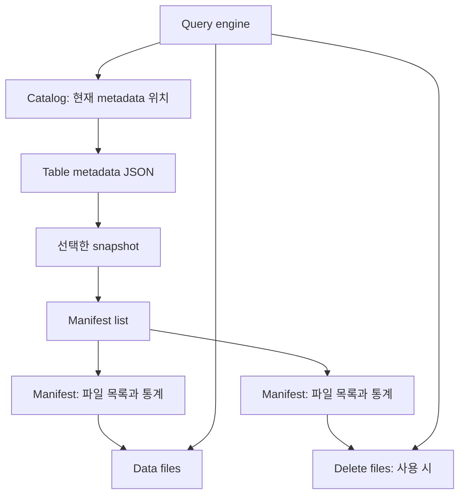

# 01. Iceberg와 Open Table Format의 구조

[학습 목차](README.md) · [논문 리뷰](02-paper-reviews.md) · [NetAI 검증 계획](03-netai-evaluation.md)

## 1. 먼저 계층을 구분한다

| 계층 | 예 | 책임 | 이 계층만으로 해결되지 않는 것 |
| --- | --- | --- | --- |
| 객체 저장소 | S3, S3 호환 저장소 | 객체 저장·조회·내구성 | 여러 파일을 묶은 테이블 트랜잭션 |
| 파일 포맷 | Parquet, ORC | 한 파일 안의 인코딩·압축·컬럼 배치 | 현재 테이블에 속하는 파일 집합 |
| 테이블 포맷 | Iceberg, Delta Lake, Hudi | 파일 집합·변경 이력·트랜잭션 프로토콜 | 모든 엔진의 동일한 기능·성능 |
| 카탈로그 | Iceberg 카탈로그 구현 | 테이블 발견·메타데이터 접근·구현별 커밋 조정 | 모든 스토리지 접근에 대한 자동 보안 통제 |
| 처리 엔진 | Spark, Trino, Flink | SQL·배치·스트리밍 실행 | 다른 엔진의 구현 오류나 설정 차이 |
| 운영 제어 | 유지보수·관측·권한 관리 | 압축 정리·보존·자격 증명·복구 | 애플리케이션의 잘못된 비즈니스 규칙 |

이 표는 논문을 읽기 위한 **설계 관점의 분류**다. 실제 제품은 여러 계층을 함께 구현한다. 포맷 이름이 같아도 엔진·커넥터·카탈로그가 바뀌면 평가 대상 시스템도 바뀐다.

## 2. Parquet 파일이 있다고 테이블이 완성되는 것은 아니다

**설명용 예제:** 센서 로그를 하루마다 저장한다. 처음에는 `09-01.parquet`와 `09-02.parquet`만 있다. 9월 2일 데이터에서 중복을 제거하려고 두 번째 파일을 여러 새 파일로 교체한다.

교체 도중 다른 사용자가 디렉터리를 열거하면 이전 파일과 일부 새 파일을 함께 읽을 수 있다. 새 파일 업로드에 성공했어도 “이제 이것들이 공식 테이블이다”라는 결정을 게시하지 못할 수 있다. 같은 디렉터리에 파일을 잘 저장하는 일과, 일관된 테이블을 읽게 하는 일은 다르다.

검증해야 할 질문은 다음처럼 나뉜다.

1. 파일 하나가 온전히 저장됐는가?
2. 독자가 같은 버전의 파일 집합만 읽는가?
3. 두 작성자의 변경이 충돌했을 때 한쪽 변경이 사라지지 않는가?
4. 실패 후 재시도해도 동일 이벤트가 두 번 집계되지 않는가?
5. 두 테이블을 갱신한다면 둘 다 성공하거나 둘 다 실패하는가?

1번의 성공을 2–5번의 성공으로 간주하면 안 된다. 특히 마지막 두 항목은 소스 offset, 애플리케이션 멱등성, 다중 테이블 조정까지 포함해 평가해야 한다.

## 3. Iceberg 메타데이터를 읽는 순서

**원문 근거:** Iceberg는 디렉터리 전체를 현재 데이터로 간주하지 않고 커밋된 메타데이터가 가리키는 파일을 추적한다. 다음은 대표적인 snapshot 참조 경로의 개념도다. [Iceberg Table Spec](https://iceberg.apache.org/spec/)



테이블 메타데이터에는 스키마·파티션 정의·snapshot 참조가 들어간다. Manifest의 파일별 통계는 읽을 필요 없는 파일을 제외하는 데 쓰인다. Delete 표현은 테이블 포맷 버전에 따라 달라진다. 규격과 커넥터 구현을 함께 확인한다. [Iceberg Table Spec](https://iceberg.apache.org/spec/)

**해석:** planning이 느리다고 항상 데이터 파일부터 합칠 필요는 없다. 파일을 찾는 단계가 병목인지, 이미 찾은 파일을 읽는 단계가 병목인지 먼저 나눠야 한다.

## 4. 커밋과 동시성

**원문 근거:** Iceberg는 새 파일과 메타데이터를 만든 뒤 테이블의 현재 상태를 원자적으로 바꾸는 방식으로 변경을 게시한다. 동시 작성 시 이전 상태에 대한 가정이 유효한지 확인하고 필요하면 재시도한다. 읽기는 커밋된 snapshot을 기준으로 수행한다. [Iceberg Reliability](https://iceberg.apache.org/docs/latest/reliability/)

**설명용 예제:** A와 B가 모두 snapshot S0에서 작업을 시작한다. A가 먼저 S1을 게시하면 B는 S0를 전제로 만든 변경을 그대로 덮어쓰면 안 된다. B의 작업이 호환 가능한 append인지, A가 바꾼 데이터를 다시 수정하는 충돌 작업인지에 따라 재검증과 처리가 달라진다.

이를 운영 지표로 바꾸면 다음 네 가지가 필요하다.

- 커밋 성공 지연과 재시도 횟수.
- 실패 후 재처리된 논리 이벤트 수.
- 업로드됐지만 참조되지 않는 파일의 양.
- 카탈로그 오류와 객체 저장소 오류의 구분.

**해석:** retry가 성공했다고 논리적 중복까지 없어졌다는 뜻은 아니다. 작업 ID·이벤트 ID·소스 offset을 이용한 결과 검증이 별도로 필요하다.

## 5. 스키마와 파티션의 진화

**원문 근거:** Iceberg는 필드를 ID로 추적하여 이름·순서 변화와 데이터 해석을 분리한다. 파티션 정의도 진화할 수 있으며 기존 파일을 즉시 다시 쓰지 않고 새 정의로 쓰기를 시작할 수 있다. 기존·신규 파티션 사양이 함께 존재할 수 있다. [Schema and partition evolution](https://iceberg.apache.org/docs/latest/evolution/)

**설명용 예제:** `temperature`를 `temperature_c`로 이름만 바꾸는 것과 섭씨 값을 화씨로 바꾸는 것은 다르다. 첫 번째는 스키마 변경일 수 있지만, 두 번째는 값의 의미와 데이터 자체를 바꾸는 작업이다. ID를 보존했다고 단위 변환이 자동으로 수행되지 않는다.

마찬가지로 일 단위 파티션을 시간 단위로 바꿔도 과거 데이터가 자동으로 시간별 재배치됐다고 가정하지 않는다. 새 파티션의 쿼리 이득은 신규 데이터와 기존 데이터에서 따로 측정해야 한다.

NetAI 검증에서는 센서 이름 변경 전후, timestamp 정밀도, NULL 처리, timezone을 엔진별로 대조한다. 이름 변경 직후 `COUNT(*)`가 같다는 확인만으로 충분하지 않다. 잘못된 컬럼 매핑은 행 수가 같아도 발생한다.

## 6. Copy-on-Write와 Merge-on-Read를 비용 문제로 읽는다

| 방식 | 개념 | 별도로 측정할 비용 |
| --- | --- | --- |
| Copy-on-Write / eager rewrite | 변경을 반영한 데이터 파일을 다시 작성 | 적은 행을 바꿀 때의 재작성량 |
| Merge-on-Read / lazy update | 변경·삭제 표현을 두고 읽을 때 반영 | 읽기 병합 비용과 유지보수 부채 |

이는 설계 계열을 비교한 표다. Hudi의 로그, Iceberg의 delete files, Delta의 구현을 동일한 온디스크 구조로 취급하지 않는다. 실제 Iceberg 행 단위 동작은 [Petabyte-Scale 논문 리뷰](02-paper-reviews.md#p2)를 참고한다.

**설명용 계산:** 128 MiB 파일에서 1 KiB 분량의 값 하나를 바꿨다고 가정한다. 파일 전체를 재작성하면 논리 변경량 대비 약 131,072배의 쓰기가 생긴다. 이는 단순 단위 계산이며 실제 엔진의 측정값이 아니다. 반대로 변경을 계속 따로 쌓아 두면 읽기와 compaction이 그 비용을 나눠 부담한다.

평가식은 다음처럼 잡을 수 있다.

```text
총비용 = 수집 비용 + 쿼리 비용 + 유지보수 비용
       + 복구 비용 + 보존 스토리지 비용 + 운영 인력 비용
```

단위가 다른 항목을 그대로 더하지 말고, 금액 또는 자원 시간으로 환산한다. freshness와 지연 SLO는 비용과 별도 제약으로 둔다.

## 7. 포맷 지원과 상호운용성은 다르다

**원문 근거:** REST Catalog는 클라이언트와 카탈로그 사이의 표준화된 인터페이스를 정의한다. 이것만으로 모든 쿼리 엔진의 읽기·쓰기 기능이 같아지지는 않는다. [REST Catalog Spec](https://iceberg.apache.org/rest-catalog-spec/)

**제안:** 다음 단계를 순서대로 통과한 조합만 운영 후보로 삼는다.

| 단계 | 테스트 | 실패하면 생기는 문제 |
| --- | --- | --- |
| 발견 | 양쪽 엔진이 같은 테이블을 찾음 | 카탈로그가 분리되거나 다른 위치를 사용 |
| 읽기 | 같은 snapshot의 값·NULL·삭제 결과 일치 | 삭제 행 재노출, 타입 오해석 |
| 쓰기 | A가 작성한 변경을 B가 정확히 읽음 | 기능이나 포맷 버전 불일치 |
| 동시성 | A·B의 동시 작업 후 허용된 결과만 관측 | 갱신 누락, 중복, 부분 반영 |
| 유지보수 | compaction·보존 후에도 필요한 조회 가능 | 장기 작업이나 학습 재현 실패 |
| 보안 | 권한 없는 경로로 같은 데이터에 접근 불가 | 카탈로그 정책 우회 |

## 8. 논문 연도와 현재 규격을 혼동하지 않는다

확인일의 공식 규격은 v1·v2·v3를 채택된 버전으로, v4를 개발 중으로 표시한다. v3에는 deletion vectors 등 확장이 있다. **규격 채택과 모든 엔진의 구현 완료는 별개다.** 특정 최신 기능을 실험에 넣기 전 reader와 writer의 지원을 각각 확인한다. [Format versioning](https://iceberg.apache.org/spec/#format-versioning)

2023년 논문에서 사용한 Iceberg 1.1.0의 결과를 최신 Iceberg 전체의 한계로 적으면 안 된다. 반대로 최신 규격에 기능이 있다고 오래된 논문 실험에 그 기능이 존재했다고 해석해서도 안 된다.

## 9. 논문을 읽으며 적어 둘 질문

1. 개선한 대상이 파일 포맷인가, 테이블 포맷인가, 엔진인가, 운영 제어인가?
2. 쓰기를 빨리 한 뒤 읽기와 compaction으로 비용을 미룬 것은 아닌가?
3. 측정 지연이 producer ACK, 커밋 완료, SQL 가시성 중 무엇인가?
4. 실험의 장애와 재시도가 정상 결과 검증에 포함됐는가?
5. 한 테이블의 원자성을 여러 테이블의 원자성으로 확장해 주장하지 않았는가?
6. 객체를 직접 읽을 수 있는 사용자가 정책을 우회할 수 있는가?
7. 보고된 가속을 포맷 규격의 효과와 특정 엔진 구현의 효과로 분리할 수 있는가?
