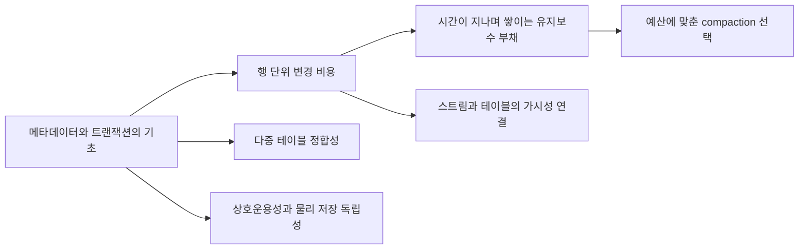

# 02. Iceberg·Open Table Format 주요 논문 리뷰

[학습 목차](README.md) · [구조와 개념](01-concepts.md) · [NetAI 검증 계획](03-netai-evaluation.md)

문헌 확인일: **2026-09-16**. 최근 연구는 2024–2026년을 중심으로 골랐다. 각 절의 **원문 근거**는 저자들의 결과이며, **비평·적용 제안**은 이 노트의 해석이다. NetAI에서 동일한 수치를 재현했다는 의미는 아니다.

## 긴 해설 바로 읽기

이 파일은 서지·실험 근거와 비교 요약이다. 원리와 예제를 처음부터 자세히 읽으려면 아래 독립 해설로 이동한다. 각 장에는 단계별 동작, 직접 계산하는 예제, 한계와 풀이형 복습 문제가 있다.

| 상세 해설 | 설명하는 내용 |
| --- | --- |
| [LST-Bench: 장기 성능과 실험 설계](papers/p1-lst-bench.md) | 파일·API 비용, workload 구성, 회복률 계산, 실험 통제 |
| [Iceberg 행 단위 변경](papers/p2-row-level-operations.md) | 행·파일 전후 추적, delete sequence, join·shuffle, 손익 계산 |
| [AutoComp: 유지보수 예산 배분](papers/p3-autocomp.md) | 정리 비용, 우선순위와 선택 반례, 오차·피드백 |
| [Ursa: 실시간 스트림과 테이블](papers/p4-ursa.md) | partition·offset·WAL, ACK와 SQL 가시성, 보존 비용 |
| [Active Data Lakes](papers/p5-active-data-lakes.md) | 물리 독립성, 가상 Parquet·range 읽기, 캐시·변환 비용 |
| [CIDR 포맷 비교](papers/p6-cidr-comparison.md) | 포맷·엔진·파일 배치 분리, 실험 수치와 비율 해석 |
| [다중 테이블 ACID](papers/p7-interoperable-acid.md) | 부분 갱신, snapshot isolation, write skew, 게시 모델 |

## 선정 결과와 우선순위

| ID | 논문 | 게재 | 선정 이유 | 확인 범위 |
| --- | --- | --- | --- | --- |
| P1 | LST-Bench | PACMMOD / SIGMOD 2024 | 세 포맷을 장기 운영·유지보수 관점에서 비교 | 저자 공개 전문·공식 연구기관 페이지 |
| P2 | Petabyte-Scale Row-Level Operations in Data Lakehouses | PVLDB 17(12), 2024 | Iceberg의 UPDATE·DELETE·MERGE 설계를 직접 다룸 | VLDB 전문 |
| P3 | AutoComp | SIGMOD Companion, 산업 트랙, 2025 | 어떤 테이블부터 compaction할지 다룸 | 저자 공개 전문·학회 채택 목록 |
| P4 | Ursa | PVLDB 18(12), 산업 트랙, 2025 | Kafka 스트림과 Iceberg/Delta를 연결, Best Industry Paper | VLDB 전문·공식 수상 목록 |
| P5 | Active Data Lakes | PVLDB 19(6), 2026 | 상호운용성과 물리 저장 독립성의 긴장을 다룸 | VLDB 전문 |
| P6 | Analyzing and Comparing Lakehouse Storage Systems | CIDR 2023 | Iceberg·Delta·Hudi 비교의 출발점 | CIDR 전문 |
| P7 | Interoperable ACID Transactions for Open Table Formats | VLDB 2026, Regular Research | 다중 테이블 트랜잭션과 상호운용성 | **공식 프로그램 초록만 확인, 최종 전문 미확인** |

우선 3편만 읽는다면 **P2 → P1 → P4**를 권한다. Iceberg 내부 설계, 평가 방법, 실시간 수집을 이어서 이해할 수 있다. 운영 자동화가 관심사면 P3, 새로운 아키텍처 연구가 목적이면 P5·P7을 이어 읽는다.

이 목록의 권위 판단은 게재 기관과 트랙, 원문 접근성에 근거한다. 인용 수나 저널 impact factor를 확인하지 않았으므로 수치로 서열화하지 않았다. **CIDR와 SIGMOD Companion을 SCIE 저널로 표시하지 않으며, PVLDB의 특정 색인 상태도 이 노트에서 단정하지 않는다.**

<a id="p1"></a>
## P1. LST-Bench: Benchmarking Log-Structured Tables in the Cloud

**[→ LST-Bench: 장기 성능과 실험 설계: 단계별 심화 해설 읽기](papers/p1-lst-bench.md)**

### 서지와 읽을 위치

- 저자: Jesús Camacho-Rodríguez, Ashvin Agrawal, Anja Gruenheid 외.
- 게재: *Proceedings of the ACM on Management of Data*, 2(1), Article 59, 2024; SIGMOD 2024.
- [DOI: 10.1145/3639314](https://doi.org/10.1145/3639314), [Microsoft Research](https://www.microsoft.com/en-us/research/publication/lst-bench-benchmarking-log-structured-tables-in-the-cloud/), [저자 공개 PDF](https://jesus.camachorodriguez.name/_media/publications/lst-bench-sigmod2024.pdf).
- 먼저 benchmark 구성·workload package를 보고, PDF 후반 평가에서 latency와 파일·API 호출 지표를 함께 읽는다.

### 먼저 쉬운 예제로 이해하기

새 책상 위에서 물건을 찾는 시간만 재면 정리 방식의 차이를 알기 어렵다. 물건을 계속 추가하고 옮긴 뒤에도 빨리 찾을 수 있는지, 정리에 얼마나 시간이 드는지 봐야 한다. **이 비유는 설명용**이다. 테이블에서도 초기 데이터 적재, 반복 변경, 정리 작업을 이어서 평가해야 한다는 질문으로 연결된다.

논문의 workload는 “시스템에 시킬 일의 묶음”이다. Package는 그 일을 조합한 실험 시나리오라고 읽으면 된다. Query 한 번의 기록보다 여러 단계의 흐름을 평가한다는 점을 먼저 이해하고 아래 숫자를 본다.

### 원문 근거: 문제·방법·실험

한 번 적재한 테이블의 SQL 속도만으로 지속적인 갱신과 유지보수 후 성능 회복을 평가하기 어렵다는 문제에서 출발한다. 워크로드를 조합 가능한 package로 만들고 TPC-DS와 장기 실행, 동시성, time travel을 다룬다. 여기서 resilience는 정기 최적화와 크기가 다른 반복 변경 아래의 성능 변화 평가이며 장애 주입·복구 실험을 뜻하지 않는다. 지연·처리량 외에 저장소 API 호출과 자원 사용도 관찰한다.

평가는 Azure ADLS Gen2, 16-worker 클러스터, Spark 3.3.1·Trino 420, Delta 2.2.0·Iceberg 1.1.0·Hudi 0.12.2를 사용한다. SF100·SF1000의 TPC-DS를 포함한다. 일부 Spark 갱신 과정에서 Delta·Iceberg가 생성한 작은 증분 파일은 API 호출을 5배 넘게 늘렸고, 비교한 Trino 경로는 최대 40배 적은 파일을 만들었다. 따라서 엔진 구현도 결과에 크게 영향을 준다.

모든 엔진에서 모든 package를 실행한 것은 아니며, 당시 Hudi time-travel 평가에는 구현 제약이 있었다. 이 결과는 그 버전과 workload의 관측이지 최신 포맷 순위가 아니다. 근거: [원문 평가, PDF pp. 8–12](https://jesus.camachorodriguez.name/_media/publications/lst-bench-sigmod2024.pdf).

### 비평·적용 제안

**이 논문의 가장 유용한 산출물은 승자 이름보다 평가 구조다.** 다음 두 제품을 생각해 보자. A는 첫 쿼리가 빠르지만 하루 동안 파일이 쌓여 저녁에는 느려진다. B는 첫 쿼리가 조금 느리지만 유지보수가 자동으로 수행돼 지연이 안정적이다. 초기 조회 시간만 측정하면 운영비와 SLO 판단이 뒤집힐 수 있다.

NetAI에서는 03 문서의 반복 갱신 실험으로 이를 확장한다. 같은 논리 데이터에 대해 초기·갱신 직후·유지보수 후를 측정하고, compaction 자원을 조회 비용에서 숨기지 않는다. 엔진 간 비교에서는 “공통 설정으로 포맷 차이 관찰”과 “각 엔진 권장 설정으로 완성된 시스템 비교”를 분리한다.

**발표·토론 질문:** 파일 수를 동일하게 맞춘 뒤에도 차이가 남는가? 남는 차이가 reader, planning, shuffle, 압축률 중 어디서 발생하는가? 포맷의 이름만으로 원인을 설명하는 발표라면 근거가 부족하다.

<a id="p2"></a>
## P2. Petabyte-Scale Row-Level Operations in Data Lakehouses

**[→ Iceberg 행 단위 변경: 단계별 심화 해설 읽기](papers/p2-row-level-operations.md)**

### 서지와 읽을 위치

- 저자: Anton Okolnychyi, Chao Sun, Kazuyuki Tanimura, Russell Spitzer, Ryan Blue, Szehon Ho, Yufei Gu, Vishwanath Lakkundi, DB Tsai.
- 게재: *PVLDB* 17(12), 4159–4172, 2024.
- [DOI: 10.14778/3685800.3685834](https://doi.org/10.14778/3685800.3685834), [VLDB PDF](https://www.vldb.org/pvldb/vol17/p4159-okolnychyi.pdf).
- §2 메타데이터 → §3 변경 표현 → §4 Spark 개선 → §5 평가 순으로 읽는다.

### 먼저 쉬운 예제로 이해하기

[입문 예제](00-start-here.md)의 잘못된 온도 한 건을 수정하려고 대량 파일을 다시 쓰면 비효율적이다. 대신 “이전 행을 읽지 말라”는 기록과 새 값을 둘 수도 있다. 그때 **어떤 행을 제외할지** 표현하는 방법이 필요하다.

Equality delete는 지정한 컬럼 값이 일치하는 행을 제외하는 표현이고, position delete는 특정 파일의 행 위치로 대상을 지정하는 표현이다. 둘 다 원본 파일에서 bytes를 즉시 지운다는 뜻은 아니다. 저장된 행과 쿼리가 보여 주는 행을 구분해야 한다. 아래 논문은 이 처리와 계산 엔진의 실행 방법을 함께 다룬다.

### 원문 근거: 문제·방법·실험

Iceberg와 Spark에서 행 단위 변경을 효율적으로 처리한다. 변경을 즉시 파일에 반영하는 eager 방식과 equality/position delete를 읽기 때 반영하는 lazy 방식을 비교한다. Storage-partitioned join으로 shuffle을 줄이고, runtime filtering으로 재작성 대상을 줄이며, adaptive writes로 출력 배치를 조정한다.

실험은 Spark 3.5.1, Iceberg 1.5.0과 추가 predicate-pushdown 변경, EKS 8노드(각 16-core·64 GB), TPC-DS `store_sales` SF1000 약 28억 행을 사용한다. 약 2,800만 update를 포함한 microbatch의 반복 실험에서 position delete 쓰기는 10회 뒤에도 eager보다 약 7배 빨랐다. Minor compaction은 eager 1회 비용의 23%로 읽기 시간을 45% 줄였지만, 읽기는 여전히 baseline보다 14% 느렸다.

이는 Spark+Iceberg의 특정 변경 밀도와 쿼리 실험이다. 제목의 petabyte-scale을 모든 공개 benchmark가 PB 크기였다는 뜻으로 읽으면 안 된다. 근거: [원문 §3–5](https://www.vldb.org/pvldb/vol17/p4159-okolnychyi.pdf).

### 비평·적용 제안

**해석:** 변경 위치를 찾아내는 비용, 변경을 저장하는 비용, 나중에 병합하는 비용을 따로 봐야 한다. `MERGE` 전체 시간이 줄었다고 저장소 쓰기만 좋아진 것은 아니다. Join의 shuffle이 줄어든 효과일 수도 있다.

NetAI의 센서 정정 작업을 예로 들면 “전체 행의 1% 변경”만으로는 충분한 workload 설명이 아니다. 변경이 하루치 파일에 모여 있는지, 1년치 모든 파일에 흩어져 있는지가 중요하다. 같은 행 수라도 영향을 받는 파일 수가 다르면 eager rewrite 비용이 달라진다.

실험은 변경 밀도와 지역성을 독립 변수로 둔다. 예를 들어 0.1%·1%·10% 변경을 각각 최근 파티션 집중과 전체 기간 분산으로 만든다. 이는 **새로운 실험 제안값**이지 논문 설정을 복제한 수치가 아니다. 각 조합에서 다음을 기록한다.

| 측정 | 해석 |
| --- | --- |
| 읽은 기존 데이터 bytes | 변경 대상을 찾는 비용 |
| shuffle bytes와 spill | join 계획의 비용 |
| 새 data/delete bytes | 변경 표현의 직접 비용 |
| 변경 직후 조회 지연 | 쓰기 최적화로 미룬 비용 |
| compaction 시간·CPU·I/O | 정상 상태로 돌아가는 비용 |

**발표·토론 질문:** 빠른 write 이후 몇 번의 read가 발생하면 총비용 이득이 사라지는가? 낮은 write latency만으로 MoR을 선택할 수 없는 이유를 이 질문으로 설명할 수 있다.

<a id="p3"></a>
## P3. AutoComp: Automated Data Compaction for Log-Structured Tables in Data Lakes

**[→ AutoComp: 유지보수 예산 배분: 단계별 심화 해설 읽기](papers/p3-autocomp.md)**

### 서지와 읽을 위치

- 저자: Anja Gruenheid, Jesús Camacho-Rodríguez, Carlo Curino 외.
- 게재: *SIGMOD Companion 2025*, 404–417, **산업 트랙**. 일반 연구 트랙 PACMMOD 논문과 구분한다.
- [DOI: 10.1145/3722212.3724430](https://doi.org/10.1145/3722212.3724430), [저자 공개 PDF](https://www.cs.umd.edu/~abadi/papers/autocomp-sigmod.pdf), [공식 산업 논문 목록](https://2025.sigmodconf.hosting.acm.org/sigmod_industry_papers.shtml).
- 설계의 관측·우선순위·스케줄링 흐름과 LinkedIn 운영 평가를 함께 읽는다.

### 먼저 쉬운 예제로 이해하기

테이블이 1만 개이고 야간 작업 시간이 2시간뿐이라면 전부 정리할 수 없다. 작은 파일이 가장 많은 테이블부터 할지, 가장 자주 조회되는 테이블부터 할지 선택해야 한다. **숫자는 설명용**이다.

예를 들어 A는 정리에 1시간이 들고 일일 쿼리 시간을 총 10분 줄인다. B는 정리에 10분이 들고 쿼리 시간을 총 2시간 줄인다. 이 가정에서는 B를 먼저 처리하는 편이 유리하다. 실제 판단에는 읽기 개선 외에도 쓰기 충돌과 자원 비용을 넣어야 한다. 이처럼 “정리 실행”을 “어디에 정리 예산을 쓸지 결정”으로 확장하는 문제를 읽는다.

### 원문 근거: 문제·방법·실험

수많은 테이블에 무조건 compaction을 실행하면 자원을 낭비한다. AutoComp는 테이블 상태를 관찰하고 예상 이득과 비용을 추정해, 제한된 자원에서 우선순위를 정한다. LinkedIn OpenHouse의 Iceberg 운영 제어와 통합했다.

약 35,000개 테이블 환경에서 수동 top-100의 평균 파일 감소량은 659만, AutoComp top-10은 744만이었다. 다만 compute cost도 증가했다. 이는 **파일 감소량**의 비교이며 자원 효율이나 쿼리 처리량 10배 향상을 뜻하지 않는다. 한 task 사례에서는 비용을 19% 과소추정하고 파일 감소량을 28% 과대추정했다. 일부 TPC-DS workload는 이득이 있었지만 TPC-H에서는 compaction을 하지 않는 편이 나았다.

실서비스 사례는 OpenHouse·Iceberg·HDFS 맥락이다. 다른 저장소에서 같은 정책이 최적이라는 증거는 아니다. 근거: [원문 설계·평가](https://www.cs.umd.edu/~abadi/papers/autocomp-sigmod.pdf).

### 비평·적용 제안

**해석:** “작은 파일이 많다”와 “지금 합칠 가치가 있다”는 별개다. 거의 읽지 않는 보관 테이블을 반복 재작성하는 일은 비용만 늘릴 수 있다. 반대로 파일 수가 적어도 중요한 대시보드의 p95 지연을 크게 줄일 수 있다면 우선순위가 높다.

NetAI용 첫 구현은 논문의 전체 최적화기를 바로 재구현하기보다, 다음 정보를 수집하는 것으로 시작한다. 이는 도입 제안이며 현재 배포 상태가 아니다.

| 입력 | 사용 이유 |
| --- | --- |
| 최근 조회 빈도·SLO 중요도 | 읽기 개선의 실제 가치 판단 |
| 파일 크기 분포·delete 누적 | 유지보수 후보 탐지 |
| 재작성 예상 bytes | 저장소·네트워크 예산 계산 |
| 동시 writer 수·commit retry | 실행 시점의 충돌 비용 추정 |
| 직전 compaction의 실제 개선량 | 예상 이득 모델 보정 |

정책을 운영에 적용하기 전에는 추천만 생성하는 관찰 기간을 둔다. 추천된 테이블과 실제 병목 테이블이 일치하는지 확인하고, 실행 후 줄어든 지연과 사용한 자원을 함께 남긴다.

**발표·토론 질문:** 목적 함수를 “파일 수 감소”로 잡으면 조회하지 않는 거대 테이블에 예산을 몰아주지 않는가? SLA 가중치를 추가하면 어떤 테이블이 우선되는가?

<a id="p4"></a>
## P4. Ursa: A Lakehouse-Native Data Streaming Engine for Kafka

**[→ Ursa: 실시간 스트림과 테이블: 단계별 심화 해설 읽기](papers/p4-ursa.md)**

### 서지와 읽을 위치

- 저자: Matteo Merli, Sijie Guo, Penghui Li, Hang Chen, Neng Lu.
- 게재: *PVLDB* 18(12), 5184–5196, 2025, 산업 트랙.
- [DOI: 10.14778/3750601.3750636](https://doi.org/10.14778/3750601.3750636), [VLDB PDF](https://www.vldb.org/pvldb/vol18/p5184-guo.pdf).
- **VLDB 2025 Best Industry Paper**: [공식 수상 목록](https://vldb.org/2025/?conference-awards=).
- 읽을 핵심: broker·WAL·Oxia 역할, stream/table 가시성 경계, 성능 및 비용 평가의 서로 다른 실험 조건.

### 먼저 쉬운 예제로 이해하기

실시간 프로그램은 들어오는 이벤트를 순서대로 빠르게 읽고 싶다. 분석 프로그램은 하루치 데이터를 컬럼별로 묶어 읽고 싶다. 요구하는 읽기 방식이 달라서 스트림 시스템과 분석 저장소 사이에 데이터 이동 단계가 생긴다.

Ursa를 읽을 때는 이 이동 단계를 통합하면 어떤 복사를 줄일 수 있는지 묻는다. **Broker**는 메시지를 받거나 전달하는 서버, **ACK**는 요청을 받았다는 응답이며 그 응답의 내구성 의미는 설정·프로토콜에 달려 있다. Kafka API를 사용할 수 있다는 사실과 기존 Kafka의 모든 지연·장애 특성이 동일하다는 주장은 구분한다.

### 원문 근거: 문제·방법·실험

Kafka 스트림과 분석용 테이블 사이의 복제·커넥터 비용을 줄이는 시스템이다. Stateless·leaderless broker, 외부 WAL, Oxia 메타데이터 조정을 사용한다. WAL 객체를 Parquet로 정리한 뒤 Iceberg/Delta에 commit해 스트림과 테이블이 공유하도록 설계한다. 일반 SQL reader의 live WAL 조회는 현재 기능이 아니라 향후 과제다. External table 모드는 별도 복사본을 만들 수 있다.

AWS 3-AZ 처리량 평가에서 약 5 GB/s publish/consume과 선택한 fanout 조건의 p99 publish 1초 미만을 보고한다. 별도 비용 실험은 200 clients·2시간·100억 records, 압축 입력 180 GB를 사용했다. 보고 비용은 Ursa $2.71, disk Kafka $35.31, tiered Kafka $11.98이다. Kafka replay 7일·lakehouse 1개월 보존 가정의 비교이며, Ursa의 소량 metadata inter-zone traffic은 비용 계산에서 제외·반올림된다.

Producer ACK가 곧 SQL 조회 가능 시점은 아니다. Table 게시까지의 지연을 구분해야 한다. 저자들이 개발한 전체 streaming 시스템 평가이며, Iceberg와 Delta 자체의 공정한 성능 대결도 아니다. 근거: [원문 아키텍처·평가](https://www.vldb.org/pvldb/vol18/p5184-guo.pdf).

### 비평·적용 제안

**해석:** 스트리밍과 분석 저장을 통합하면 중간 복사와 별도 connector를 줄일 여지가 있다. 동시에 장애 책임도 바뀐다. 예전 connector가 담당했던 재시도·중복 제거·스키마 처리가 어느 컴포넌트로 이동했는지 확인해야 한다.

NetAI 텔레메트리에서는 다음 네 시각을 이벤트별로 수집한다.

```text
t0: 소스 이벤트 생성
t1: producer가 내구성 있는 ACK 수신
t2: 스트림 consumer가 읽을 수 있음
t3: 분석 엔진의 커밋된 테이블에서 조회 가능
```

이벤트 지연은 `t3 - t0`, ACK 지연은 `t1 - t0`다. 서로 다른 지연을 같은 그래프에 이름 없이 넣으면 빠른 수집 시스템이 실제보다 신선한 분석 데이터를 제공하는 것처럼 보인다. 테스트 호스트 사이 시계 오차도 측정한다.

비용 검토에서는 논문의 달러 수치를 NetAI 예산으로 환산하지 않는다. 우리 환경의 복제 정책, 저장 기간, 압축률, 읽기 fanout, 운영 인력을 넣어 다시 계산한다. Ceph RGW를 후보로 삼더라도 실제 RGW 배포 여부와 동작은 별도 확인 대상이다.

**발표·토론 질문:** 장애 직전 ACK한 이벤트는 복구 후 스트림과 테이블 양쪽에서 정확히 어떻게 나타나는가? 수집 속도를 유지하면서 SQL freshness를 보장하는 지점을 설명할 수 있는가?

<a id="p5"></a>
## P5. Active Data Lakes: Regaining Physical Data Independence Without Losing Interoperability

**[→ Active Data Lakes: 단계별 심화 해설 읽기](papers/p5-active-data-lakes.md)**

### 서지와 읽을 위치

- 저자: Pascal Ginter, Viktor Leis.
- 게재: *PVLDB* 19(6), 1372–1385, 2026.
- [DOI: 10.14778/3797919.3797941](https://doi.org/10.14778/3797919.3797941), [VLDB PDF](https://www.vldb.org/pvldb/vol19/p1372-ginter.pdf), [논문이 공개한 artifact](https://github.com/ActiveDataLake/vldb-26).
- §3 구조, §4 파일 가상화, §6 트랜잭션, §7.2 비용 모델, §8 제약을 읽는다.

### 먼저 쉬운 예제로 이해하기

모든 도구가 파일 형식 A만 읽는 상황에서 더 효율적인 형식 B가 나와도 전부 바꾸기는 어렵다. 중간 계층이 B를 저장하고 기존 도구에는 A처럼 보여 준다면 도구를 한꺼번에 고치지 않고도 저장 방식을 바꿀 여지가 생긴다.

이것이 **물리적 데이터 독립성**을 이해하는 출발점이다. 사용자가 요구하는 데이터와 내부 bytes 배치를 분리하는 것이다. 다만 중간 계층의 변환과 전달도 계산 자원과 시간이 든다. 단순히 “호환되니 공짜”라고 볼 수 없다. 이 논문을 읽을 때 이득과 추가 서비스의 부담을 함께 찾는다.

### 원문 근거: 문제·방법·실험

여러 엔진이 Parquet를 직접 읽는 구조는 상호운용성에 유리하지만, 새로운 물리 포맷 도입을 어렵게 한다. 저자들은 엔진과 저장소 사이에 active 계층을 두고, 내부 저장 표현과 외부 가상 파일 표현을 분리한다. 필요할 때 Parquet로 변환하고 prefetching과 작은 쓰기 buffering을 적용한다.

§6.3은 같은 테이블에 95% insert·5% delete인 단일 행 트랜잭션을 실행한다. EBS 단일 client에서 prototype 약 144 tps, DuckLake 26 tps, Iceberg(PyIceberg writer) 3 tps를 보고한다. 이는 극단적인 소규모 commit 실험이다. 다중 writer에서는 delete 실패로 성공 연산의 비율도 달라지므로 같은 작업 조합의 처리량으로 단순 비교하면 안 된다. §7.2의 비용 절감은 resource utilization 80% 등 가정에 기반한 모델이다. 일부 접근 빈도에서는 직접 S3 읽기보다 최대 50% 비싸진다.

추가 서비스의 가용성·대역폭·운영비가 쟁점이다. Iceberg 설정 하나로 얻는 기능이 아니라 연구 아키텍처다. 근거: [원문 §3–8](https://www.vldb.org/pvldb/vol19/p1372-ginter.pdf).

### 비평·적용 제안

**해석:** 이 논문은 “open = 모든 엔진이 원본 파일에 직접 접근”이라는 설계 선택을 다시 묻는다. 공개된 접근 인터페이스를 유지하면서 내부 저장을 바꾸는 것도 가능한 방향이라는 것이다. 대신 데이터 경로에 서비스를 추가하는 비용을 실제로 부담해야 한다.

NetAI에서 연구 프로젝트로 재현한다면 먼저 단일 테이블의 읽기 경로에 작은 prototype을 두고 비교한다. 데이터 파일을 바로 읽는 baseline과 active 경로를 동일한 캐시 조건에서 측정한다. 변환 CPU, 네트워크 hop, 작은 range request, 대용량 순차 scan을 따로 기록한다.

| 검토 항목 | 이 노트의 검증 질문 |
| --- | --- |
| 가용성 | 중간 서비스가 내려갔을 때 어떤 읽기와 쓰기가 중단되는가? |
| 효율 | 작은 파일의 이득이 큰 파일의 변환 비용을 상쇄하는가? |
| 수평 확장 | 처리량 증가 때 중앙 상태가 병목이 되는가? |
| 탈출 경로 | 원본 데이터와 메타데이터를 표준 형태로 복구·내보낼 수 있는가? |
| 보안 | 직접 저장소 우회 접근을 허용하면 제공 정책이 유지되는가? |

**발표·토론 질문:** 파일 호환성을 유지하는 것과 시스템을 다른 구현으로 교체하기 쉬운 것은 같은가? Interface portability와 operational portability를 구분해서 논의한다.

<a id="p6"></a>
## P6. Analyzing and Comparing Lakehouse Storage Systems

**[→ CIDR 포맷 비교: 단계별 심화 해설 읽기](papers/p6-cidr-comparison.md)**

### 서지와 읽을 위치

- 저자: Paras Jain, Peter Kraft, Conor Power, Tathagata Das, Ion Stoica, Matei Zaharia.
- 게재: **CIDR 2023**. 최근 연구의 기준점으로 포함한 기초 비교 논문이다.
- [공식 논문 페이지](https://www.vldb.org/cidrdb/2023/analyzing-and-comparing-lakehouse-storage-systems.html), [CIDR PDF](https://www.vldb.org/cidrdb/papers/2023/p92-jain.pdf), [LHBench](https://github.com/lhbench/lhbench).
- §2 설계 비교 → §3.1 조건 → Figure 1 및 갱신 실험 순으로 읽는다. 확인되지 않은 DOI는 기입하지 않는다.

### 먼저 쉬운 예제로 이해하기

동일한 책을 한 권으로 묶어 읽는 경우와 수천 장의 작은 봉투로 나누어 읽는 경우를 생각해 보자. 내용이 같아도 봉투를 여는 횟수와 읽는 도구에 따라 시간이 달라진다. **이는 파일 수와 reader 영향을 이해하기 위한 비유**다.

Benchmark 결과를 볼 때 “포맷 A가 빠름”에서 멈추지 않고 왜 빨랐는지 따져야 한다. 파일 배치, 읽기 구현, 설정, 오류가 원인이라면 해당 요소가 바뀌었을 때 결과도 달라질 수 있다. 이 논문은 그 구분을 연습하기 좋은 과거 비교 연구다.

### 원문 근거: 문제·방법·실험

Delta·Hudi·Iceberg의 메타데이터와 갱신 설계를 비교하고 성능 차이의 원인을 추적한다. AWS EMR 6.9.0, Spark 3.3.0, S3, Delta 2.2.0, Hudi 0.12.0, Iceberg 1.1.0에서 기본 설정 위주로 실험했다.

3 TB TPC-DS의 합산 query runtime은 Delta 3,500초, Hudi 4,836초, Iceberg 5,977초였다. 저자들은 파일 크기와 당시 reader 구현에서 원인을 찾았다. Iceberg MoR 1.1.0의 일부 갱신 실험은 S3 connection timeout이 발생해 0.14.0 결과도 별도로 보고한다.

이 논문은 과거 구현·기본 설정을 비교한다. 동일한 query plan이라도 reader와 파일 배치가 결과를 바꿀 수 있다는 근거로 유용하다. 현재 Iceberg가 언제나 느리다는 증거로 쓰면 안 된다. 근거: [원문 §3, Figure 1](https://www.vldb.org/cidrdb/papers/2023/p92-jain.pdf).

### 비평·적용 제안

**해석:** 실험에서 설정을 통일했다는 말은 모든 내부 동작을 통제했다는 뜻이 아니다. 같은 엔진에서 같은 SQL을 실행해도 포맷별 reader 경로와 파일 생성 방식이 다를 수 있다.

이 노트에서는 이 논문을 2026년 구매·도입 순위표로 사용하지 않는다. 대신 새 benchmark 보고서에 반드시 버전·파일 크기·reader·타임아웃·실패한 query를 함께 쓰도록 하는 근거로 사용한다.

재현 연구를 한다면 두 질문을 구분한다. 첫째는 “논문 시점의 결과를 재현할 수 있는가?”이고, 둘째는 “동일한 방법을 현재 버전에 적용하면 어떤 차이가 나는가?”다. 두 결과를 같은 표에 두더라도 과거 버전 복원과 최신 버전 비교라는 목적을 명시한다.

**발표·토론 질문:** 실패한 실험을 빼고 성공한 run의 평균만 보고하면 도입 판단은 어떻게 왜곡되는가? p95 지연과 failure rate를 함께 보여야 하는 이유를 설명한다.

<a id="p7"></a>
## P7. Interoperable ACID Transactions for Open Table Formats

**[→ 다중 테이블 ACID: 단계별 심화 해설 읽기](papers/p7-interoperable-acid.md)**

### 서지와 검증 범위

- 저자: Tobias Götz, Daniel Ritter, Muhammad El-Hindi, Jana Giceva.
- **VLDB 2026 공식 프로그램, Research 44, Regular Research Paper**에서 최종 제목·저자·초록을 확인했다.
- [공식 프로그램](https://vldb.org/2026/program.html). 페이지에서 제목을 검색하면 된다.
- 최종 전문의 직접 접근과 DOI를 이번 조사에서 1차 출처로 충분히 확인하지 못했으므로, 권·호·쪽·DOI와 세부 benchmark 수치를 확정 기입하지 않는다.
- 이전 [arXiv:2504.20768](https://arxiv.org/abs/2504.20768)의 제목은 *LakeVilla: Multi-Table Transactions for Lakehouses*이며 저자 구성도 다르다. 두 판본의 숫자를 섞지 않는다.

### 먼저 쉬운 예제로 이해하기

센서값 테이블의 200을 22로 고쳤는데 일별 평균 테이블은 옛 값을 유지한다고 하자. 두 테이블이 서로 다른 순간을 나타내는 셈이다. 각각의 파일은 멀쩡하고 각 테이블을 단독 조회해도 오류가 없을 수 있다. 그런데 함께 사용하면 결과가 모순된다.

이 문제를 막으려면 **여러 테이블 사이에서도 변경을 하나의 작업으로 다루는 규칙**이 필요하다. 여기서는 그 규칙을 별도 조정 서비스에 두지 않고 구성할 수 있는지가 연구 질문이다. 상세 구현에 대한 판단은 아래에 표시한 전문 확인 한계 때문에 보류한다.

### 공식 프로그램 초록 근거: 확인한 기여

이 연구는 여러 테이블의 원자성·일관성·격리를 별도 coordinator에만 의존하지 않고 객체 저장소 primitive로 구성하는 접근을 제시한다. LakeVilla prototype으로 기존 OTF 배포와의 호환성을 목표로 한다. 공식 초록은 형식 검증, benchmark, Trino 상호운용 사례를 평가 근거로 제시한다. [VLDB 2026 프로그램](https://vldb.org/2026/program.html)

**미확인:** 최종 알고리즘의 정확한 격리 수준, 장애 모델, 객체 저장소 전제 조건, 실험 장비와 수치. 따라서 이 절은 완전한 전문 리뷰가 아니라 **최신 채택 논문을 추적하기 위한 노트**다.

### 비평·적용 제안

**설명용 예제:** `events`에 새 관측값을 넣고 `daily_summary`를 갱신한다고 하자. 첫 테이블만 새 버전이고 두 번째는 이전 버전이면 둘을 join한 대시보드는 서로 맞지 않는 결과를 보여줄 수 있다. 각 테이블이 단독으로 올바른 snapshot을 제공해도 이 문제는 남는다.

NetAI 실험에서 두 테이블을 하나의 dataset version으로 묶을 필요가 있다면, 다음 사항을 먼저 계약으로 정한다.

- 독자가 혼합 버전을 보는 것을 허용하는가?
- 허용하지 않는다면 두 테이블을 하나의 commit 단위로 묶는가, 게시할 버전 쌍을 별도로 관리하는가?
- 실패한 쓰기의 재실행은 전체 작업인가, 테이블별 작업인가?
- 모든 reader가 같은 트랜잭션 프로토콜을 사용하는가?

최종 전문을 확보하면 이 질문을 기준으로 검증한다. 논문이 채택됐다는 사실을 사용 중인 Iceberg·REST Catalog·Trino 조합에 다중 테이블 ACID가 기본 제공된다는 뜻으로 해석하지 않는다.

## 보충 문헌 3편

### B1. Delta Lake 원전 — 트랜잭션 로그를 이해할 때

Michael Armbrust 외, *Delta Lake: High-Performance ACID Table Storage over Cloud Object Stores*, PVLDB 13(12), 3411–3424, **2020**. [DOI](https://doi.org/10.14778/3415478.3415560), [VLDB PDF](https://www.vldb.org/pvldb/vol13/p3411-armbrust.pdf).

**원문 근거:** 객체 저장소 위에 transaction log와 checkpoint를 두어 테이블 상태, ACID, time travel을 구현하는 설계를 설명한다. Iceberg와 다른 메타데이터 접근을 이해하는 기초 자료다. 최신 연구로 분류하지 않는다. 특히 논문 당시 객체 저장소 consistency 설명을 현재 모든 서비스의 동작으로 일반화하지 않는다.

**읽기 질문:** snapshot 상태를 복원하는 비용은 어디서 발생하며 checkpoint가 그 비용을 어떻게 바꾸는가? 버전 기록의 존재만으로 데이터 보존과 복구가 보장되는가?

### B2. The Lakehouse: State of the Art on Concepts and Technologies

Jan Schneider, Christoph Gröger, Arnold Lutsch, Holger Schwarz, Bernhard Mitschang, *SN Computer Science* 5, Article 449, **2024-04-18**. [출판사 전문·DOI](https://doi.org/10.1007/s42979-024-02737-0).

**원문 근거:** lakehouse 정의와 분석 workload에서 8개 요구 조건을 도출하고 기술 조합을 평가하는 survey다. 데이터 포맷 하나의 benchmark가 아니라 플랫폼 전체를 분류하는 데 적합하다. 저자들의 정의와 요구 조건은 제안된 평가 틀이므로 보편적인 표준 인증 기준으로 취급하지 않는다.

**읽기 질문:** 우리 요구는 OLAP·ML·streaming 중 어디에 가까운가? 어떤 요구를 제외하면 시스템이 얼마나 단순해지는가? 저널 게재는 확인했지만 이 노트는 SCIE 등재 여부를 확정하지 않는다.

### B3. Data Lakehouse: A survey and experimental study

Ahmed A. Harby, Farhana H. Zulkernine, *Information Systems* 127, Article 102460, **2025**. [DOI](https://doi.org/10.1016/j.is.2024.102460), [출판사 페이지](https://www.sciencedirect.com/science/article/pii/S0306437924001182).

**원문 근거:** warehouse·lake·lakehouse의 구조를 정리하고 IMDb 데이터 및 HDFS/Hive/Delta 기반 실험을 다룬다. 최근 학술지 문헌을 함께 읽으려는 독자에게 보충 자료다. Iceberg·Hudi·Delta 세 포맷의 직접 비교 결과로 인용하지 않는다. 이 노트에서는 상세 수치 재검증이나 색인 상태 확정을 하지 않았다.

## 논문들을 연결해 읽는 방법

다음 연결은 **이 노트의 종합 해석**이다.



포맷 비교는 “누가 더 빠른가”에서 끝나지 않는다. 어떤 상태에서 측정했는지, 어떤 계층이 비용을 부담했는지, 어떤 장애까지 올바른 결과를 보장하는지로 이어져야 한다. 다음 문서에는 이 질문들을 실험 항목으로 바꾼 [NetAI 검증 계획](03-netai-evaluation.md)을 정리했다.
