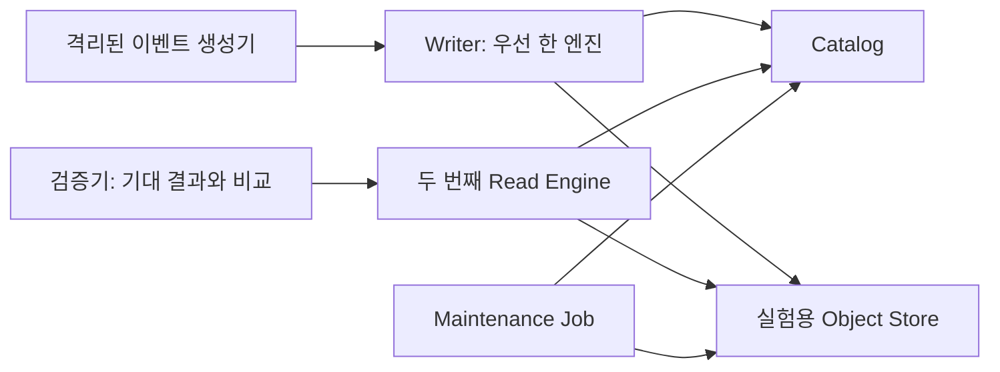

# 03. NetAI 적용 가설과 검증 계획

[학습 목차](README.md) · [구조와 개념](01-concepts.md) · [논문 리뷰](02-paper-reviews.md)

**상태: 제안, 미실행.** 아래 구조·데이터·SLO·명령은 검증 계획이다. NetAI에 해당 서비스가 이미 배포됐거나 benchmark를 수행했다는 기록이 아니다. 먼저 읽기 전용 진단과 격리된 실험으로 확인한다.

## 1. 무엇을 저장하려는가

이 문서의 설명용 데이터는 센서·클러스터 이벤트다. 실제 수집 중인 테이블을 확인해 만든 모델은 아니다.

| 필드 | 의미 | 검증에서 필요한 이유 |
| --- | --- | --- |
| `event_id` | 이벤트의 안정적인 식별자 | 재전송 중복 검출 |
| `device_id` | 장비 식별자 | 특정 장비 조회·변경 지역성 |
| `event_time` | 장비에서 사건이 발생한 시각 | 실제 데이터 freshness |
| `ingest_time` | 수집 시스템이 받은 시각 | 네트워크·수집 지연 분리 |
| `event_version` | 같은 이벤트의 정정 순서 | 늦게 도착한 이전 값의 덮어쓰기 방지 |
| `temperature_c` | 섭씨 측정값 | 컬럼 값·NULL·타입 검증 |

처음에는 append-only 적재만으로 시작할 수 있다. 그러나 늦게 온 값, 잘못된 값의 정정, 장비 ID 변경이 필요해지면 UPDATE·DELETE·MERGE 비용을 검증해야 한다. 어떤 변경이 실제로 필요한지 먼저 정한 뒤 포맷을 고른다.

## 2. 평가할 최소 구조



첫 단계에서는 세 포맷·세 엔진·여러 카탈로그를 한꺼번에 설치하지 않는다. **제안 기준선**은 Iceberg + 하나의 writer + 별도 reader + 하나의 검증된 catalog/store 조합이다. 이것이 올바르게 동작한 뒤 비교 후보를 늘린다.

저장소의 Rook-Ceph 문서는 인프라 운영 자료다. 그것만으로 S3 호환 endpoint가 준비됐다고 볼 수 없다. 실제 endpoint, 인증 방식, 객체 연산과 catalog의 전제 조건을 확인해야 한다.

## 3. 실험 전 고정할 조건

| 항목 | 기록할 내용 |
| --- | --- |
| 소프트웨어 | 엔진·커넥터·포맷 라이브러리·catalog 버전, 이미지 digest |
| 테이블 | format-version, schema, partition, 정렬, 압축, 목표 파일 크기 |
| 실행 자원 | CPU·메모리·worker 수·동시 작업 수·driver 자원 |
| 저장소 | 구현 버전·endpoint·복제 정책·네트워크 경로 |
| 데이터 | 생성 seed·행 수·논리 크기·실제 저장 크기·변경 분포 |
| 시간 조건 | 실행 시간대·공유 클러스터 간섭·캐시 초기화 방법 |
| 유지보수 | compaction·보존 작업의 주기와 자원 사용 |
| 판정 | 사전 SLO와 정합성 기준, 실패 시 중단 조건 |

**제안:** 각 실험은 최소 3회 반복하고 실행 순서를 교차한다. 다만 3개 수치만으로 신뢰할 만한 p99를 추정하지 않는다. 충분한 이벤트·요청 표본을 수집해 percentile을 계산하고 표본 수와 실패율을 함께 기록한다.

## 4. 네 가지 실험을 나눠 수행한다

### E1. 기본 적재와 조회

우선 고정 seed의 데이터를 적재하고 writer와 reader의 결과를 비교한다. 전체 행 수, 고유 `event_id` 수, NULL 수, 장비별·일별 합계를 확인한다. 작은 검증 dataset에서는 행 단위 결과도 대조한다.

성능은 전체 scan과 특정 시간·장비 조건 조회를 나눈다. Cold cache와 warm cache를 섞어 평균내지 않는다. `COUNT(*)`는 메타데이터만 사용하는 최적화가 가능하므로 그것 하나로 대량 데이터 scan 성능을 대표하지 않는다.

### E2. 반복 갱신과 유지보수

기준 데이터를 만든 뒤 같은 크기·지역성·변경률을 가진 서로 다른 정정 batch를 반복 적용한다. 각 batch는 event_version을 증가시키고 실제 값을 변경하도록 구성한다. 완전히 같은 batch의 재전송은 E3의 멱등성 검증으로 분리한다. 갱신 직후와 유지보수 후 같은 쿼리를 실행한다. 이 실험은 [P1](02-paper-reviews.md#p1)과 [P2](02-paper-reviews.md#p2)의 질문을 우리 데이터로 재구성한 것이다.

| 단계 | 확인할 것 |
| --- | --- |
| 초기 적재 직후 | 기준 latency·파일 크기 분포 |
| 반복 갱신 중 | commit 지연·delete 증가·쓰기 bytes |
| 유지보수 전 | 조회 악화·스토리지 증가 |
| 유지보수 수행 | CPU·I/O·시간·충돌·재시도 |
| 유지보수 후 | 조회 회복량·결과 동일성 |

**제안 판정:** 빠른 write만으로 통과시키지 않는다. 예상 운영 기간의 반복 갱신에서 조회 SLO를 유지하고 유지보수 예산 안에 들어와야 한다. 구체적인 SLO 수치는 workload 소유자와 결정할 값이다.

### E3. 엔진 간 일치와 데이터 진화

A에서 쓰고 B에서 읽는 방향과 B에서 허용된 변경을 만들고 A에서 읽는 방향을 분리한다. 두 엔진의 쓰기 기능이 같다고 가정하지 않는다.

| 변경 | 올바른 결과 |
| --- | --- |
| 중복 이벤트 재전송 | 정의한 멱등성 규칙에 따라 중복 없음 |
| 이전 버전 이벤트의 지연 도착 | 더 최신 정정값 유지 |
| 컬럼 이름 변경 | 기존 값이 새 이름에 정확히 대응 |
| 새 nullable 컬럼 | 기존 행의 값이 정한 규칙과 일치 |
| partition 변경 | 변경 전후 데이터가 빠짐없이 조회됨 |
| 행 삭제 | 모든 지원 reader에서 같은 행이 제외됨 |
| 과거 버전 조회 | 보존 계약 범위에서 기대 데이터 재현 |

행 수만 같아도 값은 틀릴 수 있다. timestamp·decimal·NaN·NULL의 엔진별 표현을 정규화하고, 집계 비교에 이어 샘플 행이나 전체 작은 dataset을 확인한다.

### E4. 실패 후 복구

운영 클러스터를 장애 실험 대상으로 사용하지 않는다. 격리된 환경에서 다음 지점을 하나씩 중단한다.

| 중단 지점 | 관측할 결과 |
| --- | --- |
| 데이터 업로드 뒤 commit 전 | 불완전한 새 데이터가 공식 테이블에 보이지 않음 |
| commit 성공 뒤 client 응답 전 | 재시도 시 논리 이벤트가 중복 반영되지 않음 |
| writer 재시작 | source offset과 테이블 결과가 정합 |
| catalog 일시 불가 | 실패가 식별되고 복구 후 결과가 일관됨 |
| compaction과 writer 경쟁 | 갱신이 누락되지 않고 retry 비용이 기록됨 |
| 보존 작업과 장기 reader 겹침 | 보존 계약을 만족하거나 명시된 실패로 처리됨 |

두 번째 행은 특히 애플리케이션·소스·싱크 전체의 보장이다. OTF의 테이블 commit 원자성만으로 automatically exactly-once라고 선언하지 않는다.

## 5. 비용과 성능을 같은 표에 남긴다

| 지표 | 정의 | 쉬운 해석 |
| --- | --- | --- |
| ingest throughput | 성공적으로 반영한 논리 rows/s 또는 bytes/s | 실제로 얼마나 빨리 넣는가 |
| commit latency | commit 요청부터 결과 확인까지 | 테이블 버전 게시에 얼마나 걸리는가 |
| SQL freshness | 이벤트 발생부터 SQL에서 관측까지 | 대시보드 데이터가 얼마나 늦는가 |
| planning latency | 실행할 파일·작업을 결정하는 시간 | 읽기 준비가 오래 걸리는가 |
| query p50/p95 | 조회 latency의 중앙·95백분위 | 보통과 느린 경우의 사용자 경험 |
| write amplification | 물리 쓰기 bytes / 논리 변경 bytes | 작은 정정을 위해 얼마나 다시 쓰는가 |
| maintenance cost | 유지보수 CPU 시간·I/O·스토리지 요청 | 빠른 조회를 유지하는 데 드는 비용 |
| correctness failures | 기대 결과 불일치·중복·유실 | 빠르더라도 사용 가능한 시스템인가 |

분모가 0인 amplification은 계산하지 않는다. 입력 JSON bytes와 저장 Parquet bytes를 혼동하지 않도록 논리 크기의 기준을 정의한다. CPU 초와 wall-clock 초를 같은 값으로 취급하지 않는다.

## 6. 읽기 전용 Iceberg 진단 예시

아래는 **Spark SQL + Iceberg catalog가 이미 설정된 환경**의 예시다. `lab.telemetry.events`는 임의의 `catalog.namespace.table` 이름이므로 실제 승인된 실험 테이블로 바꾼다. 엔진별 문법과 metadata schema를 확인한 뒤 실행한다. 이 문서 작성 시 실제 SQL 실행은 하지 않았다.

```sql
-- 최근 테이블 변경 이력: 최신 commit 시각과 동작 확인
SELECT committed_at, snapshot_id, parent_id, operation
FROM lab.telemetry.events.snapshots
ORDER BY committed_at DESC
LIMIT 20;

-- 현재 snapshot이 참조하는 data/delete 파일 상태
SELECT content,
       COUNT(*) AS file_count,
       SUM(file_size_in_bytes) AS total_bytes,
       AVG(file_size_in_bytes) AS mean_file_bytes,
       MIN(file_size_in_bytes) AS min_file_bytes,
       MAX(file_size_in_bytes) AS max_file_bytes
FROM lab.telemetry.events.files
GROUP BY content;

-- Snapshot 참조 이름과 보존 관련 정보: 지원 schema 확인
SELECT * FROM lab.telemetry.events.refs;
```

근거: [Iceberg Spark Queries의 metadata tables](https://iceberg.apache.org/docs/latest/spark-queries/). `content`는 data·position delete·equality delete 등을 구분하는 값이다. 해석은 해당 format-version과 metadata schema를 따른다. `files`의 레코드 수 합은 delete 적용 후 논리 행 수와 같다고 가정하지 않는다.

파일 평균만 보면 작은 파일과 매우 큰 파일이 섞인 상태를 놓친다. 정밀 평가에서는 크기 구간별 개수나 percentile을 추가한다. Snapshot commit 시각은 이벤트 발생 시각이 아니므로 freshness 계산에는 소스의 `event_time`도 필요하다.

## 7. 유지보수와 보존을 구분한다

**공식 문서 근거:** data-file compaction은 작은 파일을 합치고, manifest rewrite는 메타데이터 배치를 조정한다. Snapshot expiration은 과거 버전 보존에 영향을 준다. Orphan 정리는 참조되지 않는 파일을 대상으로 하지만 진행 중인 write보다 짧은 보존 간격이나 경로 불일치는 데이터 손실을 일으킬 수 있다. [Iceberg Maintenance](https://iceberg.apache.org/docs/latest/maintenance/)

| 관측 증상 | 첫 확인 | 대응 검토 |
| --- | --- | --- |
| scan 전 대기 증가 | planning·manifest·catalog 지연 | 메타데이터 경로 최적화 |
| 많은 작은 I/O | 파일 크기 분포·request 수 | data-file compaction |
| 갱신 후 read 증가 | delete 누적·실행 계획 | delete 처리와 compaction |
| 저장량만 계속 증가 | snapshot·참조·실패 작업 이력 | 보존 정책과 미참조 파일 검토 |
| 과거 학습 데이터 조회 실패 | 보존 기간·snapshot 존재 | 복구 계약과 dataset 기록 점검 |

학습 재현에 쓸 버전을 보존하려면 snapshot ID만 기록하지 말고 관련 데이터가 유지되도록 보존 정책과 연결한다. 여러 테이블을 사용한 학습이라면 테이블별 버전의 조합도 기록한다. 삭제·복구 명령은 실제 catalog/store와 보존 계약을 확정한 운영 문서에서 별도로 작성한다.

## 8. DevSecOps 관점에서 실험에 넣을 항목

아래는 논문이 NetAI 보안을 검증했다는 주장이 아닌 **우리의 설계 제안**이다.

- Writer·reader·maintenance의 권한을 별도로 정의한다. “테이블 read만 허용”한 계정이 원본 객체를 직접 읽어 우회할 수 있는지도 확인한다.
- 장기 키를 실험 YAML에 넣지 않는다. 저장소의 [identity/secrets 학습 경로](../../security/identity-secrets/README.md)를 참고해 실제 workload identity 지원 범위를 확인한다.
- Audit에는 작업 ID, 사용자 또는 workload 주체, 테이블 이름, commit 결과와 snapshot 식별자를 남긴다. 자격 증명이나 원본 민감 데이터는 로그에 남기지 않는다.
- 백업 범위에 객체 데이터와 카탈로그 상태가 어떻게 들어가는지 문서화한다. 복구 후 이름 해석·snapshot 참조·실제 파일 접근을 함께 검증한다.
- Git에는 스키마와 구성 변경, 실험 조건, 검증 요약을 남긴다. 실제 원본 데이터와 비밀값은 포함하지 않는다.

## 9. 결과를 남기는 템플릿

```text
실험 ID / 날짜:
검증하려는 주장:
관련 논문과 절:
엔진 / 커넥터 / 포맷 / catalog / store 버전:
데이터 seed / 크기 / 변경 분포:
캐시 / 동시성 / 유지보수 조건:
정합성 검증 결과:
실패 수 / 전체 시도 수:
latency 분포 / throughput / 자원 사용:
논문과 다른 조건:
확인된 사실:
아직 가설인 설명:
다음 결정 / 남은 blocker:
```

실제 테스트 결과가 생기면 이 학습 노트와 별도의 날짜별 실험 기록으로 추가한다. 첫 도입 판단의 완료 조건은 기능 이름의 존재가 아니라 **정합성 통과, workload SLO 충족, 유지보수 비용 확인, 복구 경로 검증**이다.
