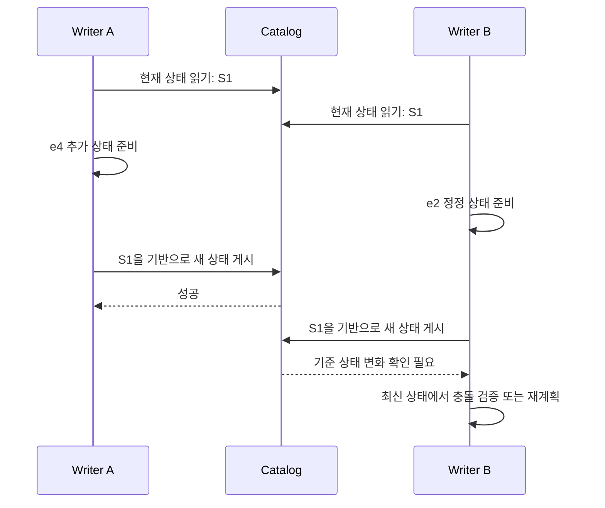

# 04. 센서 데이터 세 행으로 끝까지 따라가는 Iceberg

[전체 목차](README.md) · [용어 입문](00-start-here.md) · [논문별 해설](02-paper-reviews.md)

이 장은 **같은 데이터가 저장·수정·조회·복구되는 과정을 끝까지 추적하는 설명용 사례**다. 실제 NetAI 측정 결과가 아니며, 아래 파일 이름과 메타데이터 표현은 이해를 돕기 위해 단순화했다. 실제 metadata JSON schema나 실행 가능한 구현으로 복사하면 안 된다.

읽다가 모르는 말이 나와도 우선 “누가 어떤 정보를 보고 무엇을 결정하는가”를 따라가면 된다. 파일 이름 자체보다 파일을 참조하는 관계가 중요하다.

## 1. 목표: 같은 데이터에서 서로 모순되지 않는 결과 얻기

우리가 만드는 시스템에는 세 사용자가 있다.

- **수집 작업**은 센서가 보낸 값을 지속적으로 저장한다.
- **대시보드**는 저장된 값으로 평균 온도를 계산한다.
- **학습 작업**은 특정 시점에 확정한 데이터를 읽어 모델을 만든다.

이 셋은 동시에 실행된다. 학습이 끝날 때까지 수집을 하루 종일 멈추는 것은 피하고 싶다. 그렇다고 학습 중간에 입력 데이터가 바뀌어 결과를 재현할 수 없게 만들고 싶지도 않다.

따라서 “모두 같은 최신 파일을 읽으면 된다”는 답은 충분하지 않다. 각 작업이 어느 상태를 읽는지 명확해야 하고, 갱신이 진행 중이어도 완성된 상태를 제공해야 한다.

### 1.1 첫 입력

모든 시각은 예제에서 동일한 날짜·시간대를 사용한다고 가정한다.

| event_id | event_version | device_id | event_time | temperature_c |
| --- | --- | --- | --- | --- |
| e1 | 1 | sensor-A | 09:00 | 20 |
| e2 | 1 | sensor-B | 09:00 | 200 |
| e3 | 1 | sensor-A | 09:01 | 21 |

`event_id`는 동일한 사건을 알아보는 논리적 식별자다. `event_version`은 그 사건이 정정됐을 때 어느 값이 더 최신인지 나타내기 위해 **이 예제에서 정한 애플리케이션 규칙**이다. Iceberg가 이 컬럼의 의미를 자동으로 아는 것은 아니다.

현재 전체 온도 합은 241, 행 수는 3, 평균은 약 80.333이다. sensor-A만 보면 평균은 20.5다. 평균이 이상하다는 사실은 사용자가 발견할 수 있지만, 저장 포맷이 200을 잘못된 측정값이라고 자동 판정하지는 않는다.

## 2. 처음 저장할 때 실제로 여러 결정이 필요하다

### 2.1 데이터를 파일로 묶기

입력을 다음처럼 두 파일에 쓴다고 가정하자.

```text
F1.parquet
  e1, version=1, sensor-A, 09:00, 20
  e2, version=1, sensor-B, 09:00, 200

F2.parquet
  e3, version=1, sensor-A, 09:01, 21
```

실제 시스템에서는 이렇게 작은 입력을 파일 여러 개로 만드는 것이 비효율적일 수 있다. 여기서는 파일 참조를 따라가기 쉽게 세 행을 나눴다.

이제 객체 저장소에는 두 객체가 있다. 그러나 그것만으로 독자가 “둘을 함께 읽어야 현재 테이블이다”라는 사실을 알 수는 없다. 디렉터리 전체를 읽으면 실패한 이전 시도의 파일까지 섞을 위험이 있다.

### 2.2 현재 테이블의 파일 목록 만들기

설명을 위해 다음 두 정보를 만든다고 생각하자.

```text
Snapshot S0
  data files = [F1, F2]

Catalog
  lab.telemetry.events → 현재 상태 S0를 설명하는 metadata
```

실제 Iceberg는 catalog, table metadata, snapshot, manifest list, manifest를 거쳐 파일 집합을 찾는다. 위 표기는 그 중간 단계를 접은 **교육용 표현**이다. 경로별 역할은 [01의 메타데이터 그림](01-concepts.md#3-iceberg-메타데이터를-읽는-순서)을 참고한다.

### 2.3 독자가 해야 하는 일

대시보드가 쿼리를 시작하면 다음과 같은 질문을 순서대로 해결한다.

1. `lab.telemetry.events`라는 이름은 어느 테이블인가?
2. 읽을 snapshot은 무엇인가?
3. 그 snapshot에서 유효한 데이터 파일은 무엇인가?
4. 조건에 맞지 않아 건너뛸 파일은 무엇인가?
5. 남은 파일에서 필요한 컬럼·행을 읽으면 어떤 값이 나오는가?

1–4의 상당 부분은 읽기 준비인 **planning**이다. 5는 데이터 읽기와 계산이다. 두 단계가 모두 느려질 수 있으므로 “SQL이 느리다”는 말만으로 원인을 구분할 수 없다.

## 3. 값 하나를 고치되 읽는 사람을 방해하지 않기

09:10에 센서 운영자가 `e2`의 200이 잘못됐고 22가 맞다고 알려왔다. 정정 이벤트는 같은 `event_id=e2`, 더 높은 `event_version=2`를 가진다고 하자.

### 3.1 단순 덮어쓰기가 불편한 이유

대시보드와 학습 작업이 F1을 읽는 동안 같은 경로의 내용을 바꿔 버리면 어느 상태를 읽었는지 설명하기 어려워진다. 저장소가 객체 하나의 교체를 원자적으로 제공하더라도, 여러 파일과 메타데이터를 함께 바꾸는 문제는 남는다.

따라서 이 사례에서는 기존 파일을 유지하고 수정된 파일을 새 경로에 만든다.

```text
새 파일 F3.parquet
  e1, version=1, sensor-A, 09:00, 20
  e2, version=2, sensor-B, 09:00, 22

새 Snapshot S1
  data files = [F3, F2]
```

F2의 내용은 바뀌지 않았으므로 공유한다. S1을 만든다고 전체 데이터셋을 복사하는 것은 아니다.

### 3.2 쓰기 준비와 공식 게시를 분리하기

| 순서 | 저장소에 있는 상태 | 새로 쿼리를 시작한 독자가 볼 상태 |
| --- | --- | --- |
| 1 | F1·F2와 S0 | S0 |
| 2 | F3 쓰기 준비 또는 완료 | 아직 S0 |
| 3 | S1용 메타데이터 준비 | 아직 S0 |
| 4 | 현재 상태를 S1으로 게시 | S1을 선택할 수 있음 |

핵심은 파일 생성과 공식 게시 사이의 경계다. “F3가 존재한다”와 “현재 테이블이 F3를 사용한다”는 다른 사실이다.

**공식 설계 근거:** Iceberg는 새 상태를 준비한 뒤 원자적 메타데이터 변경으로 게시하며, 동시 작업의 충돌은 재검증·재시도로 처리한다. 위 시간표는 그 개념을 단순화한 예제다. [Iceberg Reliability](https://iceberg.apache.org/docs/latest/reliability/)

### 3.3 이전 독자와 새 독자가 다른 값을 봐도 되는가

학습 작업이 S0를 고정하고 시작했다면 200을 읽을 수 있다. 새 대시보드가 S1을 선택했다면 22를 읽을 수 있다. 이것만으로 정합성이 깨진 것은 아니다. 서로 **다른 버전을 읽도록 정해졌기 때문**이다.

문제는 S0로 시작한 동일 작업이 중간에 S1의 일부 파일을 섞어 읽는 경우다. “한 작업이 어떤 snapshot을 사용했는가”가 명확해야 하는 이유다.

S1의 전체 평균은 이제 `(20 + 22 + 21) / 3 = 21`이다. 학습 재현 기록에는 “9월 16일 데이터” 같은 느슨한 이름보다 테이블 식별자와 실제 사용한 snapshot을 남겨야 한다. 여러 테이블이면 각각의 버전과 그 조합도 기록한다.

## 4. Snapshot이 있으면 파일을 영원히 보존해야 하는가

S0가 F1·F2를 읽고 S1이 F3·F2를 읽는 동안 F1을 바로 지우면 S0를 사용하는 작업은 실패할 수 있다. 반대로 모든 과거 파일을 영원히 유지하면 저장 공간이 계속 증가한다.

여기에는 제품 선택이 아니라 **보존 계약**이 필요하다.

- 학습 재현을 위해 과거 상태를 얼마나 오래 보관하는가?
- 장시간 실행되는 작업은 최대 얼마나 오래 파일을 참조하는가?
- 삭제 요청이 들어온 데이터는 어떤 보존 경로까지 고려해야 하는가?
- 이미 끝난 실험의 데이터를 계속 보존할 가치는 있는가?

Snapshot ID는 “어떤 상태인지 가리키는 이름”이지 별도 영구 백업 파일이 아니다. 그 이름이 참조하는 메타데이터와 데이터가 유지돼야 다시 읽을 수 있다.

**공식 동작 근거:** snapshot expiration과 orphan 정리는 목적이 다르며, 진행 중인 write를 orphan으로 오인해 삭제하지 않도록 보존 간격을 고려해야 한다. [Iceberg Maintenance](https://iceberg.apache.org/docs/latest/maintenance/)

## 5. 실패를 세 가지로 나누어 이해한다

### 5.1 새 데이터 파일을 쓰는 도중 실패

아직 S1을 게시하지 않았다면 독자는 S0를 읽는다. 새로 쓰던 파일이 남았더라도 그것을 현재 테이블에 포함하지 않는 것이 중요하다.

복구할 때 디렉터리에 있는 파일을 모두 가져와 “유실 데이터”로 복원하면 안 된다. 실패한 중간 산출물과 성공한 데이터가 섞일 수 있기 때문이다. 어떤 commit이 성립했는지부터 확인한다.

### 5.2 파일은 완성했지만 commit 전에 실패

F3가 완성됐더라도 현재 상태가 S0라면 공식 데이터는 아직 바뀌지 않았다. 저장 공간은 사용했지만 사용자에게 변경이 게시되지는 않은 상태다.

이 파일을 언제 정리할지는 작업 재시도·commit 상태·보존 정책에 따라 정한다. 파일이 새로 생겼다는 이유로 즉시 읽거나, 아직 참조되지 않는다는 이유로 즉시 삭제하는 양쪽 행동을 피해야 한다.

### 5.3 Commit은 성공했는데 응답이 끊김

가장 헷갈리는 경우다. 서버는 S1을 게시했는데 네트워크가 끊겨 client는 성공 응답을 받지 못했다. Client의 관측은 “timeout”이지만 시스템의 실제 상태는 “성공”일 수 있다.

따라서 timeout 이후 같은 입력을 단순 append하면 중복이 생길 수 있다. 이것은 원자적 commit만으로 자동 해결되는 문제가 아니다. 작업의 결과 확인, 재시도 식별자, 입력의 중복 처리 규칙이 필요하다.

| 관측 | 가능한 실제 상태 | 바로 결론 내리면 안 되는 것 |
| --- | --- | --- |
| Client가 성공 응답을 받음 | 계약된 commit 성공 | 모든 후속 엔진의 캐시가 즉시 갱신됐다는 주장 |
| Client가 timeout을 받음 | 실패했거나 성공 후 응답만 유실 | 무조건 실패했으니 입력을 다시 추가해도 된다는 주장 |
| 새 파일이 보임 | 준비 중·실패 산출물·성공 결과 모두 가능 | 현재 테이블의 유효 파일이라는 주장 |

## 6. Exactly-once라는 말을 실제 행으로 검증하기

S1에 e1=20, e2=22, e3=21이 있다. 응답 유실 때문에 e2 정정을 다시 append했다고 가정하면 다음처럼 된다.

| event_id | event_version | temperature_c |
| --- | --- | --- |
| e1 | 1 | 20 |
| e2 | 2 | 22 |
| e3 | 1 | 21 |
| e2 | 2 | 22 |

이제 행 수는 4, 합은 85, 평균은 21.25다. 저장소에 깨진 파일이 하나도 없어도 분석 결과는 틀린다.

이를 막는 한 가지 **애플리케이션 설계 예**는 다음 규칙이다.

```text
같은 event_id의 입력이 들어오면:
  입력 version > 저장 version → 최신 값으로 변경
  입력 version = 저장 version이고 내용도 같음 → 변화 없음
  입력 version = 저장 version인데 내용이 다름 → 데이터 계약 오류
  입력 version < 저장 version → 늦게 온 이전 값이므로 정책에 따라 무시·기록
```

이것은 Iceberg가 기본적으로 강제하는 규칙이나 즉시 실행할 SQL이 아니다. 운영 요구에 맞게 구현하고 동시 실행 조건까지 검증해야 하는 예제다. 특히 두 writer가 동시에 같은 ID를 다루면 단독 테스트와 결과가 달라질 수 있다.

“같은 입력을 두 번 보내도 결과가 같은가”가 **멱등성**의 핵심 질문이다. “입력이 누락되지 않는가”는 또 다른 질문이다. 중복을 없애기 위해 정상 입력까지 버리면 정확한 처리라고 할 수 없다.

## 7. 동시에 두 명이 쓰면 왜 다시 확인해야 하는가

현재 상태가 S1이라고 하자. Writer A는 e4를 추가하고, Writer B는 e2를 다시 정정하려 한다. 둘 다 S1을 보고 작업을 준비한다.



위 그림은 특정 카탈로그의 실제 API 메시지가 아닌 **동시성 개념도**다.

B가 “내 결과가 더 늦게 나왔으니 내 파일 목록으로 덮어써도 된다”고 처리하면 A가 추가한 e4가 사라질 수 있다. 최신 상태에 자신의 변경을 안전하게 적용할 수 있는지 다시 확인해야 한다.

이때 모든 충돌이 같은 것은 아니다.

- 서로 독립적인 append는 새 파일을 합쳐 다시 시도할 여지가 있다.
- 같은 행이나 같은 파일에 대한 변경은 기존 읽기 가정이 깨졌을 수 있다.
- 특정 조건에 맞는 모든 행을 수정하는 작업은 그 조건에 새로 들어온 행도 고려해야 할 수 있다.

실제 충돌 판정은 작업 종류·격리 수준·구현에 의존한다. “낙관적 동시성 제어”는 충돌이 안 생긴다고 믿는다는 뜻이 아니라, 먼저 작업한 뒤 게시 시점에 유효성을 검증하는 접근이라고 이해하면 된다.

## 8. 쿼리가 느릴 때 파일 수와 bytes를 따로 봐야 한다

논리 데이터가 같아도 파일을 어떻게 나눴는지에 따라 비용이 달라진다.

**설명용 계산:** 압축률 차이는 없고 총 1 GiB 데이터를 담는다고 가정한다.

| 경우 | 파일 크기 | 파일 수 |
| --- | --- | --- |
| A | 128 MiB | 8 |
| B | 8 MiB | 128 |

bytes는 같지만 파일 수는 16배다. 파일 하나를 여는 고정 비용을 4 ms라고 **가정**하고 전부 순차 수행한다면 열기 비용만 A는 32 ms, B는 512 ms다.

이 계산은 실제 조회 latency 예측이 아니다. 엔진은 병렬로 읽을 수 있고, 각 요청의 지연과 압축·네트워크·캐시가 다르다. 여기서 확인할 것은 “bytes가 같으면 모든 읽기 비용도 같다”는 추론이 틀릴 수 있다는 점이다.

반대로 파일을 끝없이 크게 만들면 작업을 나눠 읽거나 일부 데이터만 다시 쓰는 데 불리할 수 있다. 적정 파일 크기는 쿼리·변경 지역성·병렬성·저장소 특성을 함께 봐야 한다. 이 논의를 실제 비교 연구로 확장한 것이 [LST-Bench](papers/p1-lst-bench.md)와 [CIDR 비교](papers/p6-cidr-comparison.md)다.

## 9. Partition과 pruning을 같은 예제로 이해한다

### 9.1 Partition: 어떤 기준으로 데이터를 나눌 것인가

시간별 센서 데이터가 1년치 쌓였다고 하자. 어제 데이터만 조회할 때 매번 1년치를 읽는 것은 낭비다. 날짜처럼 자주 쓰는 기준으로 데이터 배치를 나누면 필요한 부분을 찾기 쉬워진다.

하지만 너무 세분하면 작은 파일이 늘어날 수 있다. 장비별·분별로 나누었는데 각 조합의 데이터가 아주 적다면, “찾기 쉬움”을 위해 만든 세분화가 파일 관리 비용을 높일 수 있다.

### 9.2 Pruning: 조건상 불필요한 파일을 제외하기

파일의 최소·최대 시간 정보를 안다면 “이 파일에는 어제 데이터가 없다”는 판단을 먼저 할 수 있다. 이것이 pruning의 기본 발상이다.

중요한 논리 차이가 있다. 통계로 **조건을 만족할 수 없다는 것**은 증명할 수 있어도, 범위가 겹친다고 그 파일의 모든 행이 조건을 만족하는 것은 아니다. 후보 파일을 읽고 실제 행 조건을 적용해야 한다.

예를 들어 어떤 파일의 온도 범위가 10–30이라고 하자. `temperature_c > 100` 쿼리에서는 제외할 수 있다. `temperature_c = 22` 쿼리에서는 후보가 되지만 22가 실제로 존재한다고 단정할 수 없다.

### 9.3 Hidden partitioning이 숨기는 것

사용자가 timestamp 조건을 적을 때 파티션 변환 관계를 포맷이 관리하면, 사용자가 별도 날짜 컬럼 조건을 반복해서 직접 맞추는 부담을 줄일 수 있다. 여기서 “hidden”은 보안상 비밀이라는 뜻이 아니라 사용자 쿼리와 물리 배치를 분리한다는 의미다.

**공식 개념 근거:** Iceberg의 hidden partitioning은 원래 값에 대한 필터를 partition 정보와 연결하고 partition evolution을 지원한다. [Iceberg Partitioning](https://iceberg.apache.org/docs/latest/partitioning/)

## 10. 스키마 변경이 실제 값의 의미까지 바꾸지는 않는다

`temperature_c`를 `temperature_f`로 이름만 바꿨다고 섭씨 20이 화씨 68로 변하지 않는다. 이름·타입·식별자 관리와 값의 변환은 서로 다른 일이다.

이 예제에서 올바른 단위 변환은 `F = C × 9/5 + 32`다. 20°C는 68°F, 22°C는 71.6°F, 21°C는 69.8°F다. 평균 21°C는 69.8°F에 대응한다.

실제 운영에서는 새 컬럼을 추가하고 변환값을 채우는지, 기존 컬럼을 교체하는지, 이전 reader를 언제 바꾸는지까지 정해야 한다. 포맷이 스키마 진화를 지원한다는 사실은 비즈니스 의미 변경이 자동으로 안전하다는 뜻이 아니다.

**공식 개념 근거:** Iceberg는 필드 ID를 사용해 이름이나 순서 변화에 따른 데이터 매핑 오류를 피하도록 설계한다. 이 보장은 온도 단위처럼 애플리케이션 의미를 자동 변환하는 보장과 다르다. [Iceberg Evolution](https://iceberg.apache.org/docs/latest/evolution/)

## 11. 이 예제가 논문 7편으로 어떻게 이어지는가

| 방금 만난 질문 | 다음에 읽을 해설 |
| --- | --- |
| 파일이 오래 쌓이고 정정이 반복되면 언제 느려지는가? | [P1. LST-Bench](papers/p1-lst-bench.md) |
| e2 하나를 고치기 위해 F1 전체를 다시 쓰지 않을 수 있는가? | [P2. 행 단위 변경](papers/p2-row-level-operations.md) |
| 정리할 데이터가 많을 때 어떤 테이블부터 합칠 것인가? | [P3. AutoComp](papers/p3-autocomp.md) |
| 스트림으로 받은 사건이 언제 SQL 테이블에서 보이는가? | [P4. Ursa](papers/p4-ursa.md) |
| 기존 reader를 유지하며 내부 저장 방식을 바꿀 수 있는가? | [P5. Active Data Lakes](papers/p5-active-data-lakes.md) |
| 같은 데이터라도 reader와 파일 배치 때문에 얼마나 달라지는가? | [P6. CIDR 비교](papers/p6-cidr-comparison.md) |
| 정정값과 일별 평균을 여러 테이블에서 함께 게시할 수 있는가? | [P7. 다중 테이블 트랜잭션](papers/p7-interoperable-acid.md) |

## 12. 직접 설명해 보는 복습 문제와 해설

### 문제 A. F3가 존재하는데 쿼리는 왜 여전히 200을 보여 줄까?

현재 선택한 snapshot이 S0를 참조할 수 있기 때문이다. 또는 작업이 S0에 고정돼 있을 수 있다. 새 파일 업로드 성공과 새 snapshot 게시 성공을 먼저 구분하고, reader가 어떤 버전을 읽는지 확인한다. 존재하는 파일을 무조건 현재 테이블에 합치지 않는다.

### 문제 B. S1에는 세 행인데 저장소 파일을 다 읽으면 더 많은 행이 나오는 이유는?

S0용 F1과 S1용 F3가 함께 남아 있을 수 있기 때문이다. 테이블 상태는 유효 파일 참조로 정의된다. 객체 저장소 전체의 물리 행 수와 선택한 snapshot의 논리 행 수는 다르다.

### 문제 C. “쓰기 요청을 재시도하면 되니 데이터는 안전하다”가 부족한 이유는?

이전 요청이 실제로 성공했는지 모를 수 있다. 단순 재추가는 e2 중복과 평균 21.25 같은 오류를 만든다. 결과 확인과 멱등성 규칙, 늦게 도착한 버전 처리까지 함께 설명해야 한다.

### 문제 D. 파일 수를 줄이면 무조건 쿼리가 빨라질까?

아니다. 고정 open 비용은 줄일 여지가 있지만 병렬 작업 수, 필요한 부분의 선택성, 파일 압축과 배치도 바뀐다. 조회하지 않는 데이터까지 자주 재작성하면 총비용이 늘 수 있다. 실제 쿼리와 유지보수 비용을 함께 측정한다.

### 문제 E. 학습 데이터가 재현된다는 주장을 어떻게 검증할까?

테이블·snapshot 식별자와 스키마, 필터, 전처리 코드 버전, 관련 파일 보존을 기록한다. 다시 실행했을 때 같은 입력 행 집합을 얻는지 확인한다. 모델 실행의 난수나 라이브러리 차이는 데이터 재현과 구분해 추가로 통제한다.

이 장의 목표는 파일·메타데이터·애플리케이션의 책임을 섞지 않는 것이다. 이 경계를 이해하고 논문을 읽으면, 저자가 개선한 계층과 여전히 남는 문제가 무엇인지 훨씬 구체적으로 볼 수 있다.
