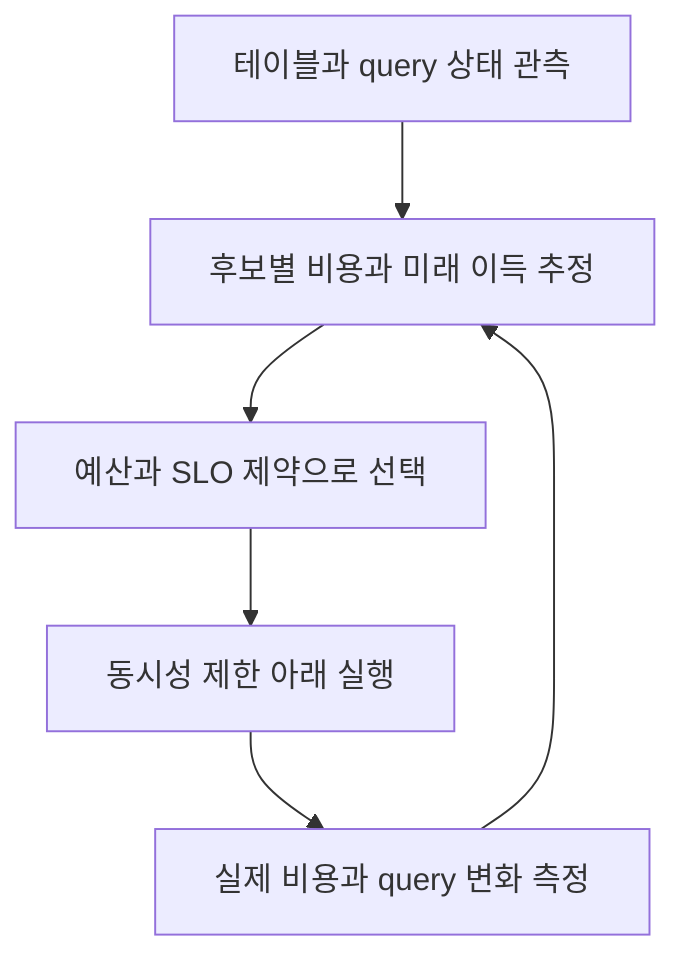

# P3 심화 학습: 제한된 예산으로 어느 테이블부터 정리해야 할까?

[학습 목차](../README.md) · [논문 목록과 검증한 결과](../02-paper-reviews.md) · [행 변경과 정리 비용](p2-row-level-operations.md)

이 장은 *AutoComp: Automated Data Compaction for Log-Structured Tables in Data Lakes*의 문제를 이해하기 위한 학습 해설이다.
서지와 검증한 실험 결과는 [P3 원문 리뷰](../02-paper-reviews.md#p3)에 모아 두었다.
이 장의 계산·테이블·운영 설계는 **새로 만든 교육용 예시와 적용 제안**이다.
AutoComp의 실제 소스코드나 원문 최적화기를 재구현한 알고리즘이라고 해석하면 안 된다.
논문 기여를 짧게 읽으면, 다수 테이블의 정리 후보를 관측하고 비용과 이득을 추정해 선택한다는 것이다.
처음 읽는 독자에게는 “정리 자체”와 “정리할 대상을 선택하는 문제”를 나누는 것이 출발점이다.

## 1. Compaction은 데이터를 더 많이 쌓는 작업이 아니라 배치를 다시 만드는 작업이다

센서 이벤트를 1분마다 적재하면 매번 작은 출력 파일이 생길 수 있다.
하루가 지나면 논리적으로는 하나의 날짜 테이블인데 물리적으로는 많은 작은 객체를 읽어야 한다.
또 행 변경을 delete file로 표현했다면 reader는 제외 규칙까지 반영해야 한다.
Compaction은 이런 배치를 더 적절한 파일 묶음으로 다시 만드는 유지보수 작업이다.

다음은 **논리 데이터가 바뀌지 않는 교육용 trace**다.

```text
정리 전
  f1: (101, 21), (102, 200)
  f2: (103, 23)
  f3: (102, 22)
  d1: f1의 position 1 제외
논리 조회: (101,21), (102,22), (103,23)

정리 후의 새 snapshot
  g1: (101,21), (102,22), (103,23)
논리 조회: (101,21), (102,22), (103,23)
```

파일 개수는 줄었지만 새 업무 이벤트가 생긴 것은 아니다.
가장 먼저 지켜야 할 불변식은 논리 결과의 보존이다.
파일 경로나 행 위치가 바뀌는 것은 자연스럽지만 정정값 22가 다시 200이 되면 실패다.
실제 rewrite는 동시 변경과 delete 의미를 안전하게 보존하는 검증된 엔진 절차를 사용해야 한다.
이 trace만 보고 직접 storage 파일을 편집해서는 같은 의미가 보장되지 않는다.

Compaction과 오래된 snapshot 정리는 목적이 다르다.
새 배치를 만드는 일과 과거 참조를 없애 공간을 회수하는 일을 따로 계획해야 한다.
공식 문서는 data file 정리, snapshot expiration, orphan file 처리를 각각 다룬다.
[Iceberg 유지보수 문서](https://iceberg.apache.org/docs/latest/maintenance/)

## 2. 왜 작은 파일이 느릴 수 있는가?

쿼리는 bytes만 읽지 않는다.
읽을 파일을 계획하고 요청을 만들고 파일 헤더와 메타데이터를 처리한다.
파일마다 드는 고정 비용이 있으면 같은 총량을 수많은 작은 파일로 나눈 상태가 불리할 수 있다.
다만 요청이 병렬 실행되므로 개수에 고정 지연을 곱한 값을 곧바로 query wall-clock이라고 부르면 안 된다.

다음 계산은 개념을 이해하기 위한 **파일별 고정비를 직렬 합산하는 단순 모델**이다.
총 1 GiB를 1 MiB 파일 1,024개로 읽고 파일별 추가 시간이 2 ms라고 가정하자.
파일별 시간 합은 2,048 ms, 약 2.05초다.
128 MiB 파일 8개라면 같은 합은 16 ms다.
이 숫자는 실제 object store latency나 benchmark가 아니다.
병렬성·캐시·네트워크 연결 재사용·CPU 제한이 실제 관측값을 바꾼다.

그리고 큰 파일이 언제나 좋은 것도 아니다.
사용자가 아주 작은 키 범위만 읽는데 정리 과정이 데이터의 좋은 clustering을 무너뜨리면 읽을 bytes가 늘 수 있다.
너무 큰 단위는 병렬 처리 기회를 줄일 수도 있다.
이 때문에 “파일 개수 감소”는 유용한 중간 지표지만 사용자 가치의 완전한 대리 지표는 아니다.

## 3. 한 테이블에서는 쉬워 보여도 수만 테이블에서는 선택 문제가 된다

테이블이 하나라면 상태를 확인하고 여유 시간에 정리하는 방식도 가능하다.
테이블이 많아지면 전부 정리하는 데 필요한 자원과 운영 시간이 부족해진다.
같은 컴퓨트 풀에는 ETL, 대시보드, 학습 데이터 생성 작업도 올라올 수 있다.
Compaction이 그 자원을 소비하면 다른 업무의 지연이 늘 수 있다.

여기서 **예산**은 돈만 의미하지 않는다.
하루 CPU초, storage rewrite bytes, 네트워크 대역폭, 작업 동시성, commit 충돌 허용량도 예산이다.
또 “오늘 밤 2시간”이라는 실행 창과 “worker 4개의 CPU시간 합”은 서로 다른 단위다.
4개 작업을 병렬로 1시간 실행하면 wall-clock은 1시간이지만 worker 시간 합은 4시간이다.
이 차이를 구분하지 않으면 스케줄이 예산 안에 들어온 것처럼 보이는 오류가 생긴다.

대상 선택에는 세 질문이 필요하다.

1. 지금 어떤 테이블에 문제가 있는가?
2. 이 테이블을 정리하면 실제로 얼마나 이득이 생기는가?
3. 그 이득을 얻기 위해 얼마의 자원과 간섭을 감수해야 하는가?

“파일이 많다”는 첫 질문의 신호일 수 있다.
하지만 읽지 않는 테이블이라면 두 번째 질문의 읽기 이득은 작다.
Writer가 계속 바꾸는 테이블이라면 세 번째 질문의 충돌 비용은 클 수 있다.

## 4. 비용 단위를 먼저 정하고 계산해야 한다

아래 예제에서 compaction 비용 C는 **배정한 모든 worker의 CPU시간 합**, 단위는 CPU분이다.
쿼리 이득 B는 **앞으로 24시간 동안 예상되는 query CPU시간 감소 합**, 단위도 CPU분이다.
두 값을 같은 단위로 맞춰 교육용 선택 문제를 만든다.
CPU분은 대시보드의 wall-clock latency와 같지 않다.
사용자 지연을 최적화하려면 별도의 목적함수가 필요하다.

이득의 단순 모델은 다음과 같다.

```text
B = 다음 24시간 예상 query 횟수 × query당 예상 CPU초 절감 / 60
```

예를 들어 query 600회가 각각 CPU 12초를 덜 쓰면 7,200 CPU초, 즉 120 CPU분이다.
이는 당장 120분의 벽시계 시간이 단축된다는 뜻이 아니다.
여러 query와 worker의 계산량을 합한 값이다.
또 내일 query 수가 달라지면 예상 이득도 달라진다.

단순 모델에서 미래 24시간을 잡은 이유는 비교 기간을 통일하기 위해서다.
테이블 A는 하루 이득, B는 한 달 이득으로 계산하면 우선순위가 왜곡된다.
정리 직후 빠르게 다시 조각나는 테이블의 개선 지속시간도 이 기간에 반영해야 한다.

## 5. 이득/비용 비율이 좋은 후보부터 고르면 항상 최적인가?

**다음 표는 전부 가상 입력이며 AutoComp의 실제 평가 데이터가 아니다.**
오늘 compaction 예산은 50 CPU분이다.
작업은 중간에 나눠서 일부만 수행할 수 없는 하나의 선택 단위라고 가정한다.
작업 간 간섭과 I/O 제한은 우선 빼고 CPU예산만 본다.

| 후보 | 정리 비용 C, CPU분 | query 횟수/24h | query당 CPU초 절감 | 이득 B, CPU분 | B/C |
| --- | --- | --- | --- | --- | --- |
| A | 10 | 600 | 12 | 120 | 12.0 |
| B | 20 | 600 | 10 | 100 | 5.0 |
| C | 30 | 720 | 10 | 120 | 4.0 |
| D | 40 | 600 | 21 | 210 | 5.25 |

A의 계산은 `600 × 12 / 60 = 120`이다.
B는 `600 × 10 / 60 = 100`이다.
C는 `720 × 10 / 60 = 120`이다.
D는 `600 × 21 / 60 = 210`이다.
모든 이득은 같은 24시간 query CPU분이다.

비율 순서는 A → D → B → C다.
이 순서로 가능한 후보를 넣으면 A+D이며 비용 50, 이득 330이다.
이 표에서는 실제로 높은 조합이다.
하지만 이 한 사례로 greedy, 즉 당장 좋은 후보부터 고르는 방식이 항상 최적이라고 증명할 수 없다.

반례도 같은 단위로 만들어 보자.
예산은 다시 50 CPU분이다.

| 후보 | C, CPU분 | B, CPU분 | B/C |
| --- | --- | --- | --- |
| X | 30 | 180 | 6.0 |
| Y | 25 | 145 | 5.8 |
| Z | 25 | 145 | 5.8 |

Greedy는 X를 고르고 남은 20 CPU분으로 Y나 Z를 넣지 못한다.
합계 이득은 180 CPU분이다.
Y+Z는 비용 50 CPU분에 이득 290 CPU분이다.
따라서 비율은 좋지만 남은 공간을 채우지 못하는 선택이 전체 최적을 놓친다.
이 예시는 분할 불가능한 예산 선택 문제의 직관을 보여 주며 원문 최적화기의 실패 사례가 아니다.

## 6. “정리 비용을 뺀 순이득”을 목표로 잡으면 선택도 바뀔 수 있다

앞 표에서 A+D의 query 이득은 330 CPU분이고 compaction 비용은 50 CPU분이다.
정리까지 포함한 단순 순이득은 280 CPU분이다.
이처럼 목적을 명확히 정해야 보고서의 “이득”이 무엇인지 알 수 있다.
파일 감소량을 최대화하는 목표와 query CPU순이득을 최대화하는 목표는 같은 선택을 보장하지 않는다.

실무에서는 CPU 한 단위의 가격도 같지 않을 수 있다.
쿼리는 비싼 전용 클러스터에서 돌고 compaction은 저렴한 batch 자원에서 돌 수도 있다.
그렇다면 CPU분을 바로 빼지 말고 비용 가중치를 명시해야 한다.
반대로 SLO 위반을 줄이는 것이 핵심이면 CPU절감보다 중요 query의 p95를 우선할 수 있다.
가중치 없는 지표를 여러 개 섞어 하나의 “점수”라고 부르면 판단 근거가 흐려진다.

## 7. CPU예산 하나만 지켜도 시스템이 안전한 것은 아니다

가상 후보 E의 비용이 10 CPU분이고 이득이 200 CPU분이라면 매우 좋아 보인다.
하지만 E가 2 TiB를 다시 읽고 쓰며 같은 storage를 대시보드가 사용한다고 하자.
CPU예산은 통과해도 네트워크·storage I/O 예산은 넘을 수 있다.
Candidate 선택은 자원별 한도를 함께 확인하는 문제로 확장된다.

```text
예시 정책의 제약
  선택 작업 CPU시간 합 <= 50 CPU분
  예상 rewrite input <= 300 GiB
  동시 실행 작업 <= 2
  중요 대시보드 p95 악화 허용폭 <= 사전 합의한 값
```

여기 값은 운영 제안의 예시이며 현재 NetAI에 설정된 정책이 아니다.
Rewrite input과 output을 합산할지 각각 제한할지도 정해야 한다.
“300 GiB 처리”라는 표현은 읽기 300 GiB인지 읽기+쓰기 총량인지 불명확하기 때문이다.
압축 변화가 있으면 읽기와 출력 bytes도 같지 않다.

## 8. 관측 → 추정 → 선택 → 실행 → 피드백을 분리한다

다음 그림은 이 장이 제안하는 일반적인 운영 흐름이다.
AutoComp 내부 구현의 정확한 구성도를 복사한 것이 아니다.



관측 단계에서는 작은 파일 수 하나에만 기대지 않는다.
파일 크기 분포, delete 누적, 조회 빈도, scan bytes, planning 시간, 마지막 정리 시점을 함께 본다.
파일의 평균 크기만 보면 일부 거대한 파일이 평균을 끌어올려 수많은 작은 파일을 숨길 수 있다.
그래서 median과 작은 파일 비율 같은 분포 지표가 필요하다.

추정 단계에서는 실제 실행 전 알 수 없는 미래를 예측한다.
예측에는 불확실성이 있으므로 가장 가능성 높은 값 하나만 저장하면 부족하다.
가능하면 보수적 범위와 낙관적 범위를 함께 기록한다.
선택 단계가 이득의 낮은 추정값을 사용하면 과잉 실행 위험을 줄이는 방향이 된다.
그 대신 좋은 후보를 놓칠 가능성도 생긴다.

## 9. 예측 오차를 어떻게 기록할까?

**다음은 새로 만든 오차 계산 예제다.**
작업의 예상 비용이 40 CPU분이고 실제 비용이 50 CPU분이었다고 하자.
실제값 기준 비용 오차는 `(40-50)/50 = -20%`다.
예상값 기준 초과율은 `(50-40)/40 = +25%`다.
두 숫자는 같은 관측에서 나오므로 분모를 명시해야 한다.

이득의 예상값이 120 CPU분이고 실제값이 90 CPU분이라면,
실제값 기준 추정 오차는 `(120-90)/90 = +33.3%`다.
예상값 기준 미달률은 `(120-90)/120 = 25%`다.
“예측이 25% 틀렸다”라고만 쓰면 어떤 식을 썼는지 알 수 없다.

실제 이득은 더 측정하기 어렵다.
정리 전후 query 입력량이 바뀌거나 캐시가 따뜻해지면 정리 효과와 다른 요인이 섞인다.
정리 후 query 10개가 빨라졌다는 사실만으로 인과관계를 확정하기 어렵다.
동일 snapshot에 가까운 비교, query 구성 고정, 캐시 조건 기록이 필요한 이유다.
운영 환경에서는 완전 통제가 어렵기 때문에 관찰된 개선과 추정된 정리 효과를 구분한다.

## 10. 간섭은 실행시간 증가뿐 아니라 실패와 반복 작업으로도 나타난다

Compaction이 읽은 파일을 동시 writer가 바꾸면 commit 검증이나 재시도 문제가 생길 수 있다.
정확한 충돌 조건은 작업 종류·엔진·격리 설정에 따라 확인해야 한다.
교육용 관점에서는 같은 테이블을 동시에 바꾸는 작업의 비용을 독립적으로 더하는 가정이 깨진다는 뜻이다.

Storage 대역폭을 두 작업이 나누면 각 작업의 wall-clock은 늘 수 있다.
하지만 CPU시간 합이 같은 비율로 늘어난다고 단정할 수는 없다.
I/O 대기시간은 CPU사용시간과 다른 항목이다.
이 차이를 구분해 CPUseconds, executor elapsed, storage bytes, retry를 따로 저장한다.

다음 정책들은 NetAI용 검토 제안이다.

| 상황 | 고려할 대응 | 먼저 볼 증거 |
| --- | --- | --- |
| query p95가 정리 때 상승 | 동시성 축소 또는 실행 창 이동 | storage queue, scan throughput |
| commit retry 급증 | writer가 적은 시간대 또는 범위 축소 | 실패 원인과 영향 파일 |
| 정리 후 금방 작은 파일 재증가 | 적재 배치와 writer 출력 조정 | 시간별 파일 유입량 |
| 저조회 테이블이 반복 선정 | 목적함수·조회기간 재검토 | 기대 이득과 실제 query 수 |

자꾸 생기는 작은 파일을 계속 합치기만 하면 원인을 고치지 못할 수 있다.
수집 빈도·partition 설계·write 배치가 만드는 유입 패턴도 함께 검토해야 한다.
다만 적재 지연 요구를 무시하고 batch를 크게 늘리면 freshness 목표가 깨질 수 있다.

## 11. 원문의 결과를 정확히 읽는 법

원문 평가의 manual top-100 평균 파일 감소량은 약 659만이고 AutoComp top-10은 약 744만이다.
동시에 compute cost도 증가했다. 이 비교는 자원 효율이나 처리량이 10배 개선되었다는 의미가 아니다.
또 비용 19% 과소추정·파일 감소 28% 과대추정은 **한 task 사례**이며 전체 예측 평균 오차가 아니다.
검증한 출처와 운영 환경은 [P3 근거 절](../02-paper-reviews.md#p3)을 확인하자.

핵심은 숫자의 단위와 비교 대상을 보존하는 것이다.
파일 감소량, query latency 감소, CPU절감, 달러 비용은 서로 다른 결과다.
한 지표가 좋아졌다고 나머지가 좋아졌다고 단정할 수 없다.
원문 실서비스 환경을 object store 기반 NetAI 환경으로 그대로 일반화하는 것도 피한다.

어떤 workload에서는 정리하지 않는 편이 더 낫다는 관측도 의미가 있다.
파일 배치가 이미 충분하거나 query가 파일 개수에 민감하지 않으면 rewrite 비용이 이득보다 클 수 있다.
이는 “compaction이 쓸모없다”는 결론이 아니라 후보별 판단이 필요하다는 문제로 이어진다.

## 12. 처음 도입할 때는 추천의 품질부터 측정한다

처음부터 모든 추천을 자동 실행하면 모델 오류와 충돌 원인을 동시에 추적해야 한다.
읽기 관측과 추천 기록을 먼저 축적하면 후보 판단이 실제 병목과 맞는지 확인할 수 있다.
아래 순서는 배포 상태가 아니라 이 문서의 도입 제안이다.

1. 일정 기간 query·파일·writer 상태를 수집한다.
2. 추천 후보, 예상 비용, 예상 이득, 선택 이유를 남긴다.
3. 일부 후보에 제한된 정리를 실행하고 같은 기준으로 전후 측정한다.
4. 예상과 실제 차이를 유형별로 분석한다.
5. 충분한 증거가 생긴 범위부터 예산·중단 조건을 포함해 자동화한다.

추천이 거절되거나 실행되지 않은 후보도 기록해야 한다.
실행된 좋은 후보만 평가하면 선택 정책이 실제보다 좋아 보인다.
동시에 실행하지 않은 후보의 잠재 이득을 실제 관측으로 알 수 없는 한계도 명시해야 한다.
이를 모두 측정한 것처럼 보고하면 평가가 과장된다.

## 13. 추천 기록 한 건은 무엇을 설명해야 할까?

다음은 사람이 이유를 검토할 수 있는 **가상 기록**이다.

```text
candidate: sensor_events / 2026-09-15 partition
observation window: 최근 24시간
expected compaction CPU: 40 CPU분, 범위 30~55
expected query CPU saving: 다음 24시간 120 CPU분, 범위 70~150
expected input read: 80 GiB
reason: 자주 읽는 범위에 작은 파일과 delete 누적
constraints checked: CPU예산, input bytes, 동시 실행 수
actual result: 실행 뒤 기록할 항목
```

예상 이득은 오늘의 관측에서 내일을 추정한 값이다.
관측 시간창과 미래 이득 기간이 다르다는 사실을 표시해야 한다.
추천 이유에 “파일이 많음”만 남기면 조회 중요도가 반영되었는지 알 수 없다.
실제 결과에는 감소한 파일 수뿐 아니라 자원 사용·실패·사용자 query 변화를 함께 남긴다.

## 14. 이해 확인 질문과 답

### 파일이 제일 많은 테이블을 먼저 정리하면 안 되는가?

읽지 않는 테이블을 정리해도 query 개선의 가치는 작을 수 있다.
같은 비용으로 자주 읽는 테이블을 정리하면 더 큰 실익을 얻을 수 있다.
공간 회수가 목적이라면 별도의 보존 정책과 비용 판단이 필요하다.
파일 수는 후보 신호이며 목적함수의 전체가 아니다.

### Greedy 비율 선택이 틀릴 수 있는 이유는 무엇인가?

작업이 분할 불가능하면 높은 비율 작업이 남긴 예산으로 다음 후보를 넣지 못할 수 있다.
위 X/Y/Z 사례에서는 X의 비율이 더 높지만 Y+Z의 전체 이득이 더 크다.
이 반례는 일반적인 선택 직관이며 AutoComp 구현이 같은 실패를 했다는 주장은 아니다.

### 정리 전후 query가 빨라지면 정리 효과가 증명된 것인가?

입력량, query 구성, 캐시, 동시 부하도 바뀔 수 있다.
가능한 요인을 통제하거나 최소한 기록해야 관측을 해석할 수 있다.
실서비스 전후 비교에는 인과 추정의 한계가 남을 수 있다.

### 평균 파일 감소량이 크면 비용 효율도 좋은가?

아니다. 많은 파일을 줄이기 위해 더 큰 컴퓨트 비용을 지불했을 수 있다.
동일 목적에 대해 비용을 정규화하거나 예산 내 사용자 이득을 비교해야 한다.
원문의 659만/744만 비교도 비용 증가를 함께 읽어야 한다.

### 한 task의 19%와 28%는 모델의 전체 정확도인가?

아니다. 한 사례에서 발생한 추정 오차다.
전체 정확도를 논하려면 여러 task의 오차 분포, 표본 수, 계산 분모와 실패 task 처리까지 필요하다.
단일 사례를 전체 평균으로 옮기면 근거가 바뀐다.

### 언제 아무것도 하지 않는 선택이 맞는가?

예상 이득이 비용보다 작거나 불확실성이 크고 중요 query에 간섭할 때다.
정리할 후보가 있다는 사실과 지금 실행해야 한다는 판단은 다르다.
보류 역시 이유와 관측을 기록하는 정책 결정으로 다뤄야 한다.

이 장을 읽은 뒤에는 “작은 파일을 합치자”에서 더 나아가 어떤 기간의 어떤 이득을 어떤 자원으로 얻을지 설명할 수 있어야 한다.
그 설명과 실제 측정이 일치하는지 확인하는 것이 자동화의 검증 기준이다.
