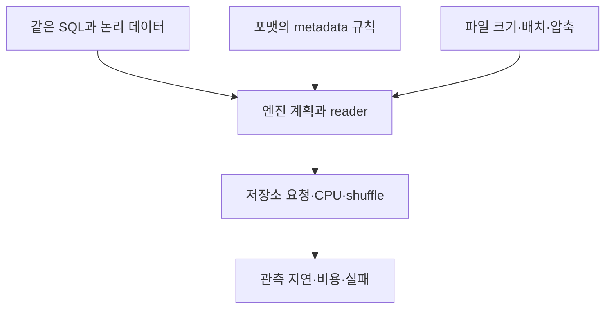

# P6 깊이 읽기: CIDR의 Lakehouse 비교와 공정한 benchmark를 읽는 법

[전체 학습 목차](../README.md) · [P6 원문 근거](../02-paper-reviews.md#p6)

이 장의 목표는 “Delta·Hudi·Iceberg 중 무엇이 가장 빠른가?”라는 질문을 실험 가능한 질문으로 고치는 것이다.
처음 접하는 독자를 위해 포맷·엔진·파일의 역할을 풀고, 결과표가 어느 정도의 주장까지 허용하는지 계산으로 설명한다.
**원문 근거**는 저자들이 발표한 내용이고, **학습용 가정**은 이 문서에서 만든 예시다.
실제 NetAI 환경에서 benchmark를 실행했다는 의미가 아니다.

## 1. 논문을 역사적 기준점으로 배치하기

*Analyzing and Comparing Lakehouse Storage Systems*는 Paras Jain 외의 CIDR 2023 논문이다.
CIDR는 데이터 시스템 설계를 논의하는 학회이며 이 문서를 SCIE 저널 논문으로 표시하지 않는다.
원문은 세 저장 시스템의 설계·기능·성능 절충을 비교하고 LHBench를 공개한다.
당시 구현과 기본 설정의 관측을 현재의 보편적인 포맷 순위로 사용할 수는 없다.
[공식 논문 페이지](https://www.vldb.org/cidrdb/2023/analyzing-and-comparing-lakehouse-storage-systems.html), [CIDR 전문](https://www.vldb.org/cidrdb/papers/2023/p92-jain.pdf), [저자 benchmark 저장소](https://github.com/lhbench/lhbench)가 1차 출처다.

**원문 근거:** EMR 6.9.0·Spark 3.3.0·S3와 Delta 2.2.0·Hudi 0.12.0·Iceberg 1.1.0을 비교했다.
3 TB TPC-DS의 query별 3회 실행 중앙값을 합산한 시간은 각각 3,500초·4,836초·5,977초다. 실험은 i3.2xlarge worker 16대(각 8 vCPU·61 GiB)를 사용했다.
일부 Iceberg MoR 갱신은 connection timeout으로 다른 판본 결과도 별도로 보고됐다.
이 결과는 파일 배치·reader·실패 관측을 포함해 읽어야 한다. 자세한 사실 범위는 [기존 리뷰](../02-paper-reviews.md#p6)를 따른다.

이후 대부분의 설명은 그 결과를 이해하는 데 필요한 독립적인 교육 예제와 실험 비평이다.
현재 제품의 기능 지원이나 성능을 원문 당시 버전에서 추정하지 않는다.

## 2. 비교 대상을 세 층으로 나누어 보기

### 2.1 테이블 포맷이 제공하는 규칙

테이블 포맷은 여러 파일을 어떤 테이블 상태로 해석할지 정하는 규칙과 표현을 제공한다.
Snapshot, 스키마, 파티션 정보, 변경 파일 등의 정보를 사용해 독자가 올바른 데이터를 찾게 한다.
SQL 문장을 실제로 실행하는 전체 계산 프로그램과 같은 범주는 아니다.
같은 포맷을 여러 엔진이 지원해도 지원 범위와 구현 경로가 같다는 뜻은 아니다.

### 2.2 엔진이 수행하는 계산

Spark 같은 엔진은 SQL을 분석하고, 실행 계획을 만들며, 여러 worker에 작업을 나눈다.
파일을 읽어 값을 해석하고 filter·join·집계를 수행한다.
Reader는 파일 데이터를 엔진 내부 값으로 변환하는 읽기 구현을 뜻한다.
파일 내용이 같아도 reader의 batch 처리·메모리 사용·filter 적용 방식이 다르면 시간이 달라질 수 있다.

### 2.3 물리 파일과 저장소

파일 수·크기·정렬·압축·분산 배치는 같은 논리 데이터에서도 달라질 수 있다.
저장소 요청 지연과 대역폭, 연결 제한도 실제 실행에 영향을 준다.
“같은 SQL, 같은 Spark, 같은 S3”라는 문장만으로 파일 분포와 reader까지 같았다고 판단할 수 없다.
결과표를 읽을 때 포맷 규칙·엔진 구현·물리 배치를 각각 확인한다.

이 그림은 **이 문서의 개념도**다.
각 화살표는 영향을 검사할 후보 관계이지 특정 논문의 인과 실험을 그대로 도식화한 것이 아니다.

## 3. 센서 정정 작업으로 갱신 설계 이해하기

NetAI가 센서 이벤트 1,000만 개를 파일 1,000개에 보관한다고 가정하자.
파일마다 평균 1만 행이 있고, 잘못된 이벤트 1만 개를 수정해야 한다.
전체 행의 0.1%만 수정한다는 설명은 맞지만 비용 예측에는 불충분하다.
그 1만 행이 파일 몇 개에 분포하는지 알아야 한다.

첫 경우에는 최근 파일 한 개의 모든 행을 바꾼다.
두 번째에는 모든 파일에서 10행씩 바꾼다.
수정 행 수는 같지만 영향을 받는 파일 수는 1개와 1,000개다.
기존 파일을 재작성하는 경로라면 두 번째 경우의 읽기·쓰기량이 크게 달라질 수 있다.
이것을 변경의 **지역성**이라고 설명할 수 있다. 변경이 물리 배치에서 얼마나 모여 있는지를 말한다.

변경 정보를 별도로 남기는 경로는 즉시 재작성량을 줄일 여지가 있다.
그러나 독자가 나중에 원래 행과 변경 정보를 합쳐 올바른 결과를 만들어야 한다.
이때 쓰기 완료가 빨라진 이득 일부가 읽기나 유지보수 비용으로 이동할 수 있다.
각 포맷의 정확한 표현과 지원은 버전·엔진별로 확인해야 하며 이 예제는 공통 비용 질문만 설명한다.

## 4. Snapshot을 읽는 비용도 query 시간에 들어간다

SQL이 데이터를 읽기 전에 어떤 파일이 현재 테이블에 속하는지 알아야 한다.
이 과정에서 테이블 metadata를 찾고 snapshot을 결정하고 파일 후보를 줄인다.
이를 planning 시간에 포함할 수도 있고 별도 metadata 시간으로 계측할 수도 있다.
실험 문서에서 계측 범위를 명시해야 두 결과를 비교할 수 있다.

가상 query A의 총시간을 다음처럼 분해하자.
Metadata·planning 5초, scan 20초, join·집계 15초이면 합은 40초다.
Metadata 최적화로 앞 구간이 1초가 되어도 총시간은 36초, 개선은 10%다.
최적화된 구간이 80% 줄었다는 말과 전체 query가 80% 줄었다는 말은 다르다.

반대로 작은 조회에서는 metadata의 비중이 클 수 있다.
Planning 5초, scan 1초, 집계 1초인 가상 조회를 같은 방법으로 개선하면 총 7초가 3초가 된다.
전체 개선은 약 57.1%다.
특정 최적화의 효과는 workload에서 그 구간이 차지하는 비중에 달려 있다.

## 5. 파일 크기의 영향에 대한 두 가지 계산

### 5.1 전량 scan에서 파일 열기 비용

같은 100 GiB 데이터를 100 MiB 파일로 저장하면 약 1,024개 파일이 필요하다.
10 MiB 파일이면 약 10,240개다.
가상으로 파일당 2 ms의 직렬 관리 비용이 있다고 두면 합은 2.048초와 20.48초다.
데이터 전송량은 같아도 관리 작업 수는 열 배가 될 수 있다.

실제 엔진은 병렬 실행하고 파일 단위 요청도 여러 단계이므로 이 합을 실제 query 시간으로 쓰지 않는다.
이 계산은 작은 파일이 관리 비용을 증가시킬 수 있는 원리를 보여 준다.
같은 파일 수에서도 파일 통계의 선택 능력이나 reader 성능이 다를 수 있다.
따라서 파일 크기가 원인 후보라는 사실과 모든 차이를 설명한다는 주장은 구분해야 한다.

### 5.2 선택적인 조회에서는 필요한 bytes도 보기

100 GiB 중 특정 센서의 1 GiB만 필요한 조회를 생각하자.
데이터가 센서 기준으로 잘 모여 있으면 파일 통계로 많은 파일을 제외할 가능성이 있다.
같은 센서 값이 모든 파일에 흩어져 있으면 훨씬 많은 파일이 후보로 남을 수 있다.
이를 data skipping의 직관으로 이해하면 된다. metadata·통계를 이용해 읽지 않아도 되는 데이터를 제거하는 것이다.

가상 A는 2 GiB를 읽고 B는 50 GiB를 읽는다면 파일 크기만 맞춘 비교도 충분하지 않다.
파일 수가 같아도 정렬·배치 때문에 read amplification이 다르다.
이 장에서 read amplification을 `실제로 읽은 bytes / 필요한 논리 bytes`로 정의하면 A는 2배, B는 50배다.
이 비율은 설명용 정의이며 논문의 공식 metric 이름을 주장하지 않는다.

## 6. 과거 합산 시간에서 계산할 수 있는 것과 없는 것

원문 보고값 3,500초와 5,977초만 놓으면 비율은 `5,977 / 3,500 ≈ 1.708`이다.
당시 그 query 묶음에서 후자의 합산 시간이 약 1.71배였다고 계산할 수 있다.
앞의 값을 기준으로 시간 차이를 표현하면 `(5,977 - 3,500) / 3,500 ≈ 70.8%`다.
후자의 시간을 얼마나 줄이면 앞의 값이 되는지 계산하면 `2,477 / 5,977 ≈ 41.4%`다.

70.8%와 41.4%가 다른 것은 분모가 다르기 때문이다.
이를 “70.8% 더 느림”과 “41.4% 시간 감소”의 관계로 이해한다.
Throughput이 같은 비율로 변했다고 주장하려면 작업량과 실행 모델에 대한 추가 조건이 필요하다.
현재 버전의 query나 다른 데이터의 성능을 이 비율로 예측할 수는 없다.

합산 시간은 어느 query가 문제였는지 숨길 수 있다.
큰 query 하나가 합을 지배하면 대다수 query의 작은 이득은 덜 보인다.
원문을 읽을 때 query별 값과 실행 실패를 함께 확인하는 이유다.
합산 숫자 하나로 tail latency, concurrency, 운영 비용을 알 수 없다.

## 7. 합계와 평균이 서로 다른 판단을 만드는 가상 예제

세 query의 가상 시간을 아래처럼 두자.
이 표는 원문 수치가 아니다.

| Query | 시스템 A | 시스템 B | B/A |
| --- | --- | --- | --- |
| 짧은 조회 | 1초 | 2초 | 2.0 |
| 중간 조회 | 10초 | 5초 | 0.5 |
| 큰 조회 | 100초 | 100초 | 1.0 |
| 합계 | 111초 | 107초 | 약 0.964 |

합산 시간으로는 B가 약 3.6% 짧다.
하지만 짧은 조회만 사용하는 대시보드에서는 B가 두 배 느리다.
Query별 비율의 산술평균은 `(2 + 0.5 + 1) / 3 ≈ 1.167`이다.
그 비율의 기하평균은 `(2 × 0.5 × 1)^(1/3) = 1`이다.

서로 다른 집계가 서로 다른 질문에 답한다.
합산 시간은 정해진 query 묶음을 한 번씩 실행하는 총시간에 가깝다.
비율 평균은 query 간 상대 성능을 다른 방식으로 가중한다.
실제 서비스의 query 발생 빈도가 다르면 그 빈도로 가중한 결과를 별도로 계산한다.
유리해 보이는 집계만 골라 설명하지 않는다.

## 8. 기본 설정 비교와 조정된 비교는 각각 무엇을 묻나

기본 설정 비교는 사용자가 큰 조정 없이 도입했을 때의 경험을 관찰하는 데 유용하다.
그러나 기본 파일 목표 크기나 writer 동작이 다르면 여러 요소가 함께 바뀐다.
이를 포맷 규칙 하나의 효과를 분리한 실험으로 해석하기는 어렵다.
논문이 기본 설정을 사용했다면 그 조건은 결과의 한계이자 평가 목적의 일부다.

통제된 비교는 파일 크기나 파티션, 자원량 등의 후보 변수를 맞추고 차이를 관찰한다.
그렇다고 모든 포맷의 내부 구현까지 같게 만들 수 있는 것은 아니다.
동일한 값의 설정 이름이 같은 실제 파일 분포를 보장하지 않을 수도 있다.
설정값 표와 실제 산출물 표를 모두 작성해야 한다.

권장 설정으로 조정한 비교는 각 시스템이 적절히 운영됐을 때의 성능을 묻는다.
이 경우 조정에 쓴 시간과 유지보수 정책도 비교에 포함할 가치가 있다.
다른 설정을 사용했다는 사실을 숨길 필요는 없지만 최적화한 시스템 전체를 비교한다는 목적을 명시한다.
세 비교는 목적이 다르므로 동일한 승자 문장에 섞지 않는다.

## 9. 원인을 확인하는 순차 실험

가상으로 A의 조회가 B보다 느리다고 하자.
첫 단계는 같은 논리 결과를 반환하는지 확인하는 것이다.
둘째는 실제 파일 수·크기·읽은 bytes·계획을 비교하는 것이다.
셋째는 유력한 변수 하나를 바꿔 결과가 따라 움직이는지 확인하는 것이다.

예를 들어 파일 크기를 맞춘 뒤 차이가 줄었다면 파일 배치가 원인 일부라는 근거가 강화된다.
차이가 남으면 reader, metadata, shuffle, CPU, 캐시 등을 이어서 확인한다.
차이가 사라졌다는 사실도 파일 크기만이 원인이었다는 완전한 증명은 아니다.
재작성 과정에서 압축·정렬·통계가 함께 바뀌었을 수 있기 때문이다.

실험 변화표에는 설정값뿐 아니라 함께 변한 물리 특성을 기록한다.
이것을 하지 않으면 compaction의 효과를 파일 수 하나에 잘못 귀속할 수 있다.
원인 설명은 단일 지표의 상관보다 관측·개입·재현의 일치로 강화한다.
불확실성이 남으면 “원인 후보”라고 쓰는 것이 더 정확하다.

## 10. 실패한 run을 빼면 생기는 편향

100개 요청 중 90개가 1초에 성공하고 10개가 30초 제한에서 실패한다고 가정하자.
성공한 요청만 평균내면 1초다.
이 값만 발표하면 사용자가 요청하는 일이 10% 확률로 실패한다는 사실을 숨긴다.
실패율 10%, 제한 시간 30초, 성공 지연 1초를 함께 보고해야 한다.

타임아웃을 성공 시간처럼 30초로 대체한 평균은 관측 제한을 반영하는 하나의 요약일 수 있다.
하지만 실제 작업이 31초에 끝났을지 영원히 끝나지 않았을지는 모른다.
그 평균을 전체 성공 완료 시간이라고 부르면 안 된다.
제한 시간과 실패 처리 정책을 보고하고 성공 요청 분포를 따로 제시한다.

실패 뒤 자동 재시도가 있다면 사용자 지연은 첫 시도부터 마지막 결과까지 측정한다.
엔진 내부 한 시도의 시간과 사용자 요청 전체 시간을 나눈다.
기존 snapshot을 유지한 실패인지 일부 데이터가 잘못 공개된 실패인지도 정확성 관점에서 확인한다.
성능 benchmark에서 오류를 발견했다면 단순 빈 칸보다 오류 조건이 중요한 결과일 수 있다.

## 11. NetAI에 맞게 LHBench 관점을 확장하기

TPC-DS는 분석 query의 공통 기준을 제공한다.
하지만 센서 데이터의 시간 편향, 늦은 도착, 정정 지역성, 대시보드 빈도까지 자동 대표하지는 않는다.
표준 benchmark와 NetAI workload를 각각 실행하면 공통 기준과 실제 사용 패턴을 함께 볼 수 있다.
서로 다른 workload의 결과를 동일한 데이터셋 결과처럼 섞지 않는다.

**가설 H1:** 최근 시간에 집중된 정정과 전 기간에 흩어진 정정은 같은 변경률에서도 비용이 다르다.
학습용 후보는 0.1%·1%·10% 변경률과 두 지역성 조합이다.
각 조합에서 영향받은 파일 수, 기존 scan bytes, 새 파일 bytes, 조회 후속 비용을 기록한다.
변경률만 바꾼 표보다 비용이 발생한 구조를 설명할 수 있다.

**가설 H2:** 파일 크기 통제 후 과거 비교에서 보인 차이가 현재 조합에서는 줄거나 다른 방향이 될 수 있다.
현재 환경의 실제 버전을 고정하고 기본 설정·통제 설정·권장 설정 실험을 분리한다.
어떤 방향의 결과가 나올지는 미리 단정하지 않는다.
확인 전에는 과거 순위를 현재 도입 결론에 쓰지 않는다.

**가설 H3:** 분석 처리량을 높이는 동시성이 대시보드 tail을 악화시킬 수 있다.
가상 후보 동시성 1·4·16에서 조회 완료 수와 요청별 지연을 측정한다.
배치 학습 작업과 대시보드가 자원을 공유하는 시나리오를 별도로 추가한다.
Writer와 compaction의 간섭도 별도 run으로 두어 원인을 구분한다.

## 12. 실제 실험 전에 맞춰야 할 최소 계약

데이터 정답은 event ID와 revision 규칙으로 정의한다.
중복 이벤트가 들어왔을 때 최신 revision 하나만 보이는지 등 기대 결과를 먼저 적는다.
동일한 입력 seed와 입력 manifest를 사용하여 포맷마다 같은 논리 데이터를 준다.
실제 파일 bytes가 다를 수 있으므로 입력량과 저장량을 각각 측정한다.

환경 계약에는 worker 수, CPU·memory 제한, 저장소 endpoint, network 경로를 적는다.
엔진·포맷·connector 버전은 전체 문자열로 기록한다.
실행 순서는 무작위화하거나 교차하여 특정 시스템이 항상 warm 상태를 받지 않도록 설계한다.
독립 반복 사이에는 시작 snapshot 또는 입력 적재 상태를 복원한다.

관측 계약에는 query 시작·완료 정의, retry 포함 여부, timeout 정책을 적는다.
Planning·scan·shuffle 등 단계별 지표의 수집 가능 범위를 표시한다.
수집하지 못한 지표는 0으로 쓰지 말고 미측정이라고 쓴다.
동일 run ID로 엔진 로그·저장소 지표·결과 checksum을 연결한다.

## 13. 자주 나오는 질문과 풀이

### Q1. 같은 Spark면 포맷 차이만 비교한 것 아닌가?

같은 Spark는 중요한 통제 조건이지만 충분하지 않다.
포맷별 connector와 reader가 다를 수 있고 writer가 다른 크기의 파일을 만들 수 있다.
겹치지 않는 wall-clock 구간을 가정하자. A는 계산 구간 10초·대기 구간 1초, B는 계산 구간 6초·대기 구간 8초라면 총 11초와 14초다. 이는 worker별 CPU-seconds 합산값을 대기 시간에 더하는 계산이 아니다. 병렬 실행이나 계산·I/O 중첩이 있으면 이 단순 합을 사용할 수 없다.
Reader 계산은 B가 유리해도 요청 대기 때문에 전체는 더 느릴 수 있다.
단계별 관측 없이 하나의 포맷 특징으로 설명하기 어렵다.

### Q2. 논문의 시간 비율을 우리 데이터량에 비례해서 곱하면 안 되나?

데이터 3 TB를 300 GB로 줄인다고 모든 시간이 10분의 1이 되지는 않는다.
가상 모델 `시간 = 고정 planning 5초 + scan 크기 × 계수`를 생각하자.
Scan이 100초에서 10초로 줄면 총시간은 105초에서 15초로 변해 비율은 7배다.
파일 수·join 크기·메모리 spill·병렬도가 바뀌면 선형 관계는 더 약해질 수 있다.
규모별 실측을 통해 scaling 곡선을 확인해야 한다.

### Q3. 최신 버전만 비교하면 역사적 논문은 쓸모없나?

역사적 논문은 비교 변수를 찾아내고 실패를 보고하는 방법을 배우는 데 유용하다.
과거 재현은 당시 관측이 같은 조건에서 나오는지 확인하는 실험이다.
최신 비교는 그 평가 질문을 현재 조합에 적용하는 별도 실험이다.
둘을 병렬 표로 제시할 수 있지만 버전과 목적을 분명히 적는다.

### Q4. 합산 runtime이 작으면 우리 서비스에서도 좋은가?

우리 서비스가 benchmark query를 같은 빈도로 한 번씩 실행할 때 더 관련이 있다.
앞의 가상 예제에서 짧은 query가 하루 1만 회라면 A는 1만 초, B는 2만 초의 그 query 실행 합을 갖는다.
큰 query 한 번의 결과가 그 사용자 패턴을 대표하지 못한다.
운영 query 빈도를 기록하고 중요 대시보드의 SLO를 별도 판단한다.

### Q5. 튜닝을 어느 정도까지 해야 공정한가?

공정함은 하나의 숫자가 아니라 평가 목적에 맞는 통제와 투명성이다.
도입 첫 경험이면 기본 설정, 구조 원인 분석이면 물리 조건 통제, 최대 운영 성능이면 권장 조정을 선택한다.
조정 횟수와 사람 시간을 예산으로 정하면 특정 시스템만 과도하게 최적화하는 편향을 줄일 수 있다.
최종 설정과 실제 파일 분포를 공개하면 독자가 목적에 맞는 비교인지 판단할 수 있다.

### Q6. 이 논문을 발표할 때 가장 위험한 한 문장은 무엇인가?

“이 논문이 현재 포맷의 순위를 증명한다”라는 결론은 관측 범위를 넘어선다.
정확한 표현은 당시 버전·엔진·저장소·workload의 보고 결과라고 조건을 붙이는 것이다.
그 뒤 현재 NetAI에서 검증할 원인 후보와 실험 계획을 설명한다.
역사적 숫자와 새로운 계산에는 각각 출처와 가상 예제 표시를 붙인다.

## 14. 읽은 뒤 남길 산출물

첫 산출물은 포맷별 순위표보다 “무엇을 같게 했고 무엇이 달랐는가”의 조건표다.
둘째는 query별 성공·실패와 지연 분포를 포함한 결과표다.
셋째는 파일 배치·reader·metadata·shuffle 중 어떤 원인을 확인했고 무엇이 미확인인지 적은 해석이다.
이 세 표가 있어야 다른 사람이 결론을 반박하거나 재현할 수 있다.

장기 갱신 이후 상태와 유지보수까지 비교하려면 [LST-Bench 심화](p1-lst-bench.md)를 이어 읽는다.
행 단위 변경의 실제 내부 설계는 [P2 원문 리뷰](../02-paper-reviews.md#p2)로 연결된다.
이 장의 모든 추가 가설은 검증 대기 상태이며 실제 cluster 측정 결과를 주장하지 않는다.
