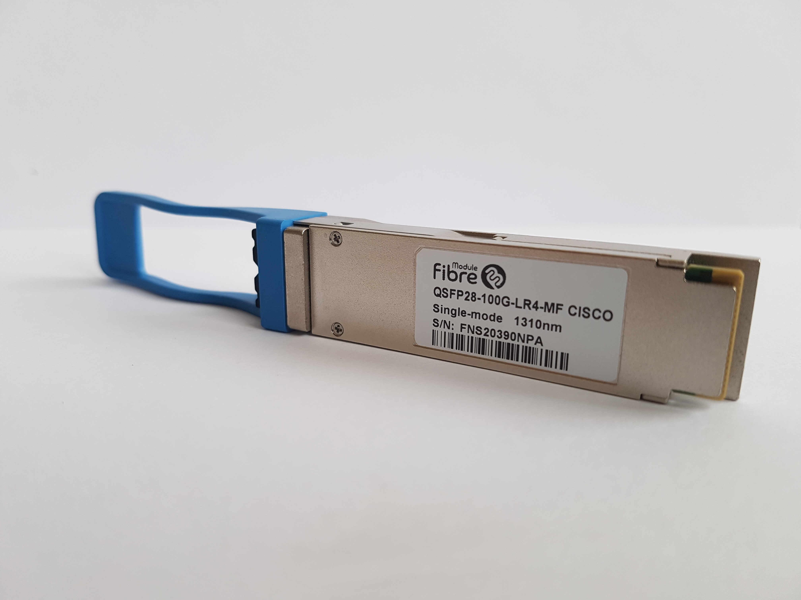

# 사진으로 시작하는 하드웨어: 무엇을 보고 어떤 질문을 할까?

[통합 목차](README.md) · [서버 하드웨어 교재](../hardware/learning/server-hardware/README.md) · [공통 용어사전](GLOSSARY.md)

이 페이지는 부품의 이름과 생김새를 연결하는 출발점이다. 실제 사진과 장착·연결 예시를 먼저 보고, 각 교재에서 내부 동작과 계산으로 이어간다. 모든 사진은 원본의 실제 제품을 보여준다. 이 저장소에서 사례로 쓰는 **A7은 연구실의 특정 서버 이름**이며, 여기에 실은 사진은 그 서버를 촬영한 사진이 아니다. **생김새는 후보를 구별하는 단서이고, 실제 지원 규격은 제품·메인보드·장치 매뉴얼로 확인한다.**

사진별 저작자·원본·라이선스는 [사진 출처](../hardware/learning/server-hardware/assets/photos/README.md)에 기록했다. 저장소의 MIT 라이선스와 사진의 개별 라이선스는 구별한다.

## 1. 메모리: DIMM 한 장에서 무엇을 볼까?

사진: Dsimic, [CC BY-SA 4.0 및 원본](../hardware/learning/server-hardware/assets/photos/README.md). 사진 속 제품은 DDR4-2133 ECC RDIMM이다. DDR4는 메모리 전송 기술의 세대, ECC는 오류 검출·정정 기능, RDIMM은 명령·주소 신호를 중간 회로에서 완충하는 메모리 모듈 종류다.

**DIMM(Dual In-line Memory Module)**은 슬롯에 꽂는 메모리 모듈 기판이다. 검은 사각형은 주로 **DRAM(Dynamic Random Access Memory)** 칩을 보호하고 연결하는 패키지다. DRAM은 전하로 데이터를 저장하고 주기적으로 복원하는 메모리다. 아래 금색 부분은 슬롯과 맞닿는 접점이다. 접점 중간의 홈은 방향과 규격을 구별하는 데 도움이 된다. **Rank는 함께 선택되어 데이터 폭을 제공하는 칩 묶음**이며, 사진에서 칩의 개수나 앞뒤 배치만 보고 그 수를 확정하면 안 된다. RDIMM에는 신호를 완충하는 회로도 있어 모든 검은 사각형이 사용자 데이터 저장 칩인 것도 아니다.

“DIMM 두 장이면 채널도 두 개인가?”, “1Rx8과 2Rx8은 용량인가?”, “왜 똑같이 128GB인데 속도가 다른가?”를 [CPU·메모리·NUMA 장](../hardware/learning/server-hardware/02-cpu-memory-numa.md)의 구조도와 읽기 과정에서 설명한다.

## 2. SSD: 길쭉한 기판과 작은 상자는 어떤 차이일까?

사진: Ilya Plekhanov, [CC BY-SA 4.0 및 원본](../hardware/learning/server-hardware/assets/photos/README.md).

**SSD(Solid State Drive)**는 반도체에 데이터를 저장하는 장치다. 사진에서 오른쪽 커넥터에 기판 끝이 들어가고 왼쪽 나사 쪽에서 고정된 모습을 본다. **M.2**는 이런 모듈의 형태·커넥터 규격이다. **2280**은 폭 22mm, 길이 80mm를 나타낸다. **NVMe(Non-Volatile Memory Express)**는 저장장치와 명령을 주고받는 통신 방식이다. 모든 M.2가 NVMe인 것은 아니고, 길이가 맞아도 슬롯이 지원하는 신호·프로토콜이 다르면 작동하지 않는다.

사진: Dmitry Nosachev, [CC BY-SA 4.0 및 원본](../hardware/learning/server-hardware/assets/photos/README.md). 사진 속 제품은 OCZ Z6300 U.2 NVMe SSD다.

**U.2**는 서버의 2.5인치 SSD 등에서 사용하는 커넥터 계열이다. 상자처럼 보여도 내부에는 반도체 저장장치가 있다. **백플레인(backplane)**은 여러 드라이브의 커넥터를 모아 호스트 쪽 연결에 이어 주는 기판이고, **베이(bay)**는 장치를 넣는 공간이다. **SATA·SAS는 저장장치를 연결하고 명령을 전달하는 규격 계열**이다. 베이 크기가 같다고 SATA·SAS·NVMe를 모두 사용할 수 있는 것은 아니다.

[스토리지 장](../hardware/learning/server-hardware/04-storage-raid-boot.md)에서는 M.2 단품·장착 사진과 U.2 커넥터 확대 사진을 함께 보며 “어떤 SSD를 어느 슬롯에 꽂을 수 있는가?”를 실제 가정 사례로 풀어낸다.

## 3. 네트워크: RJ45와 QSFP를 같은 종류의 이름으로 읽지 않는다

사진: Aurélien Rinaldi, [CC BY-SA 4.0 및 원본](../hardware/learning/server-hardware/assets/photos/README.md).

**QSFP(Quad Small Form-factor Pluggable)**는 장치 포트에 꽂는 모듈·플러그의 형태 계열이다. 사진은 **QSFP28 100G-LR4 광 트랜시버**이며, 트랜시버(transceiver)는 신호를 송신하고 수신하는 장치다. 100G는 이 제품의 100Gbps 전송 속도, LR4는 광 전송 규격의 이름이다. 이 사진의 광 모듈은 전기 신호와 광 신호를 바꾸고 별도의 광 케이블을 연결한다. 모든 QSFP가 이 속도나 연결 매체를 쓰는 것은 아니다.

현장에서 **RJ45**라고 부르는 Ethernet 플러그는 보통 **8P8C**, 즉 8개의 위치와 8개 접점을 가진 모듈러 커넥터다. **Ethernet은 같은 링크에서 장치끼리 데이터를 전달하는 네트워크 표준 계열**이고, **NIC(Network Interface Card)**는 컴퓨터를 네트워크에 연결하는 장치다. **DAC(Direct Attach Copper)**는 끝의 플러그와 구리 케이블이 하나로 결합된 연결이고, **AOC(Active Optical Cable)**는 광섬유와 양 끝의 변환부가 결합된 연결이다. 같은 외형 계열도 광 모듈+분리 케이블과 일체형 케이블이 다르다.

[NIC·네트워크 장](../hardware/learning/server-hardware/06-networking-rdma.md)에는 RJ45 플러그·포트와 QSFP+ DAC 사진도 함께 있다. 포트 형태, 양쪽 지원 속도, 케이블 매체·거리·장치 호환성의 관계를 비교한다.

## 4. HDD: 왜 무작위로 읽으면 오래 기다릴까?

사진: Matthew Field, [CC BY-SA 3.0 및 원본](../hardware/learning/server-hardware/assets/photos/README.md). 학습용 내부 사진이며 장치를 여는 실습을 요구하지 않는다.

**HDD(Hard Disk Drive, 하드디스크 드라이브)**는 자성으로 데이터를 기록하는 회전 원판을 사용한다. **플래터(platter)**가 원판이고 **헤드(head)**는 그 표면의 데이터를 읽고 쓰는 부품이다. 헤드를 원하는 위치로 옮기는 **탐색(seek)**, 데이터가 헤드 아래에 도착하기까지의 **회전 대기(rotational latency)**가 필요하다.

작은 파일을 서로 먼 위치에서 하나씩 읽으면 이 이동·대기를 반복할 수 있다. 큰 파일을 연속으로 읽는 상황과 다른 이유다. SSD는 회전 부품이 없지만 반도체 페이지의 읽기·기록, 지우기, 내부 주소 관리라는 다른 비용이 있다. [스토리지 장](../hardware/learning/server-hardware/04-storage-raid-boot.md)에서 7,200RPM의 평균 회전 대기 계산과 HDD·SSD의 동작, 수명·성능 질문으로 이어간다.

## 5. 사진과 함께 확인할 질문

1. **사진의 부품은 무엇이고 어디에 연결되는가?** 이름, 기판, 접점, 포트를 구별한다.
2. **이 이름은 생김새인가, 연결 표준인가, 명령 방식인가?** M.2와 NVMe처럼 서로 다른 계층을 나눈다.
3. **겉모양이 같아도 안 되는 조합이 있는가?** 규격·배선·지원 속도·소프트웨어를 함께 확인한다.
4. **내부에서는 무엇이 움직이고 어디에서 기다리는가?** 하드웨어 장의 구조도·시간 순서를 따라간다.
5. **사진만으로 확정할 수 없는 것은 무엇인가?** 메모리 Rank, 링크 속도, 드라이브 호환성은 제품 정보와 관측이 더 필요하다.

사진은 이름의 정체를 알려주고, 본문의 기작과 계산은 왜 그 부품을 골라야 하는지 설명한다. [서버 전체 지도](../hardware/learning/server-hardware/01-system-map.md)에서 서로의 연결을 다시 확인한다.
