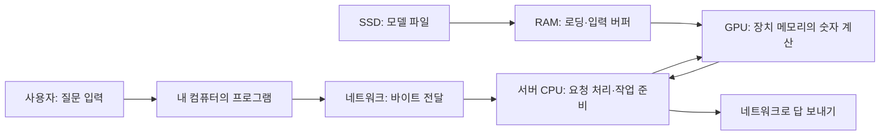

# 00. 교재를 읽기 위한 첫 지도

[통합 목차](README.md) · [공통 용어사전](GLOSSARY.md) · 다음: [전기와 비트](../hardware/learning/server-hardware/00-physical-bits-to-computer.md)

컴퓨터를 사용해 본 것과 컴퓨터 안에서 무엇이 일어나는지 아는 것은 다르다. 여기서는 브라우저에 질문을 입력하고 답을 받는 일을 작은 조각으로 나누어, 교재에 반복해서 나오는 단어와 연결한다. 지금은 모든 약어를 외우지 않아도 된다. 각 이름이 가리키는 대상부터 구별하자.

## 1. 프로그램, 서버, 서비스는 무엇이 다른가?

**프로그램(program)**은 컴퓨터가 할 일을 적은 명령의 묶음이다. **프로세스(process)**는 그 프로그램을 실제로 실행하는 한 개의 실행 주체다. 같은 브라우저 프로그램도 실행 방식에 따라 여러 프로세스를 만들 수 있다. 프로세스는 코드뿐 아니라 현재 계산 상태와 사용할 메모리 등을 갖는다.

**서비스(service)**는 요청을 받고 어떤 기능을 제공하는 프로그램이나 기능이다. **서버(server)**는 요청을 처리하는 역할을 뜻하며, 일상에서는 그 역할을 하는 컴퓨터도 서버라고 부른다. 따라서 서버 한 대에서 여러 서비스를 운영할 수 있고, 서비스 하나를 여러 서버가 나누어 처리할 수도 있다.

**노드(node)**는 연결된 시스템에서 구별하는 컴퓨터나 실행 자원 한 단위다. **클러스터(cluster)**는 여러 노드를 함께 관리하는 묶음이다. **인프라(infrastructure)**는 프로그램을 실행하게 해 주는 계산 장치·메모리·저장장치·네트워크·운영 소프트웨어 등의 기반이다. “AI 인프라”는 AI 모델 계산을 준비하고 실행하고 서비스로 제공하는 기반을 말한다.

## 2. 컴퓨터 한 대에서 각 부품은 무엇을 맡는가?

| 정식 용어 | 무엇인가? | 질문 하나를 처리하는 예 |
| --- | --- | --- |
| CPU, 중앙처리장치 | 프로그램 명령을 실행하는 장치 | 입력을 처리하고 작업을 GPU에 요청 |
| RAM, 주메모리 | 현재 쓰는 명령과 데이터를 담는 작업 공간 | 질문·프로그램·중간 버퍼를 보관 |
| SSD, 반도체 저장장치 | 전원이 꺼져도 데이터를 보존하도록 만든 저장장치 | 모델 파일과 저장한 기록을 보관 |
| GPU, 그래픽 처리장치 | 많은 값에 유사 연산을 병렬로 수행하는 장치 | 모델의 큰 숫자 배열을 계산 |
| NIC, 네트워크 인터페이스 카드 | 컴퓨터를 네트워크에 연결하는 장치 | 질문을 받고 답의 바이트를 전송 |
| 운영체제, OS | 프로그램의 실행과 자원 사용을 관리하는 소프트웨어 | CPU 시간·메모리·파일 접근을 관리 |
| 커널, kernel | 운영체제의 중심에서 자원과 장치를 관리하는 부분 | 읽기·쓰기 요청을 장치 처리로 연결 |
| 드라이버, driver | 운영체제가 특정 장치를 제어하도록 돕는 소프트웨어 | GPU·NIC 등의 제어와 데이터 이동 지원 |

**데이터(data)**는 프로그램이 다루는 정보다. 글자·사진·숫자를 컴퓨터에서 처리하려면 특정 규칙으로 비트에 표현한다. **버퍼(buffer)**는 보내거나 처리할 데이터를 잠시 모으는 공간이고, **캐시(cache)**는 나중에 다시 쓸 데이터를 가까운 곳에 보관해 반복 비용을 줄이는 구조다. 둘 다 메모리를 사용할 수 있지만 필요한 이유가 다르다.

그림의 박스는 작업 주체나 데이터 저장 위치, 화살표는 요청 또는 데이터의 이동이다. SSD의 파일이 곧바로 사용자의 답이 되는 것은 아니다. 프로그램이 읽고, 메모리에 놓고, 장치가 계산하고, 통신으로 결과를 전달한다. 실제 서비스는 여러 서버와 추가 처리 단계를 사용할 수 있다.

## 3. 숫자 옆의 단위를 먼저 읽는다

**비트(bit, b)**는 0 또는 1로 표현하는 정보의 단위다. **바이트(byte, B)**는 8비트다. 대문자 B와 소문자 b가 다르므로 `8 Gbit/s`는 `8 GB/s`가 아니다. 앞의 값은 8로 나누면 `1 GB/s`다. 여기서 `/s`는 초당을 뜻한다.

**용량(capacity)**은 담는 양이고, **대역폭(bandwidth)**은 초당 옮길 수 있는 양이다. **지연시간(latency)**은 요청 뒤 결과를 받을 때까지 걸린 시간이다. 용량 100GB와 속도 10GB/s를 더할 수는 없다. 이상적으로 20GB를 10GB/s로 보내면 `20/10=2초`지만 실제에는 대기와 부가 정보가 포함된다.

**GB**는 10⁹바이트이고 **GiB**는 2³⁰바이트다. 숫자 1은 같아도 기준이 다르다. **ms**는 1/1,000초, **µs**는 1/1,000,000초, **ns**는 1/1,000,000,000초다. 작은 지연을 비교할 때 단위를 먼저 맞춘다.

**2진수(binary)**는 0·1 두 숫자로 자리수를 표현한다. `1101₂`는 `8+4+0+1=13`이다. **16진수(hexadecimal)**는 0~9와 A~F를 사용하고 `0x` 접두사를 흔히 붙인다. `0x10`은 10진수 16이다. 장치 주소나 로그에 A~F가 있어도 장비 이름이라는 뜻은 아니다.

## 4. 기술 이름과 특정 환경의 이름을 나눈다

| 문서에서 만나는 이름 | 정체 | 기억할 범위 |
| --- | --- | --- |
| DDR, DIMM, PCIe | 메모리 기술·모듈 형식·장치 연결 표준 | 다른 컴퓨터에서도 쓰는 일반 기술 용어 |
| Linux, Kubernetes | 커널·클러스터 운영 소프트웨어 이름 | 각 소프트웨어의 역할을 해당 장에서 배움 |
| RTX PRO 6000, RNGD | 각각 특정 GPU·NPU 제품 이름 | 제품 사양은 해당 제품과 버전에만 적용 |
| A7 | NetAI 연구실의 특정 서버 식별명 | 실제 서버 사례를 구별하는 이름 |
| TwinX, MiniX | NetAI 연구실의 클러스터 이름 | 운영 사례의 배경이며 범용 표준이 아님 |

**DIMM**은 메인보드에 꽂는 메모리 모듈이다. **DDR(Double Data Rate)**은 타이밍을 맞추는 클록 신호의 상승·하강 양쪽을 활용해 한 주기에 두 번 데이터를 전달하는 메모리 전송 기술 계열이다. DDR4·DDR5의 숫자는 세대이며 용량이 아니다. **PCIe**는 CPU와 GPU·NIC·SSD 같은 장치를 연결하는 표준이다. 이 셋도 서로 같은 계층이 아니다. 제품 이름을 몰라도 [메모리 구조](../hardware/learning/server-hardware/02-cpu-memory-numa.md)에서 DDR·속도 표기·채널·랭크·뱅크를 배우고 [GPU 실행](../hardware/learning/server-hardware/05-gpu-npu-execution.md)에서 그리드·블록·워프를 배울 수 있다.

## 5. 이 교재에서 깊게 읽는 방법

한 개념을 만날 때 **무엇인가 → 어디에 있는가 → 왜 필요한가 → 누가 어떤 순서로 다루는가 → 무엇을 관찰하면 확인할 수 있는가**를 연결한다. 영어 이름을 아는 것만으로 이 질문에 답할 수 있는 것은 아니다. 반대로 뜻을 설명할 수 있으면 영어·약어도 현장 문서를 읽는 데 도움이 된다.

예를 들어 **뱅크(bank)**는 CPU 쪽 DRAM에서는 행을 열고 닫는 내부 구역이고, GPU 공유 메모리에서는 여러 스레드의 병렬 접근을 위한 내부 구역이다. **랭크(rank)**도 메모리의 칩 선택 단위와 분산 실행의 참가자 번호라는 다른 뜻이 있다. 같은 단어라도 어느 장치와 계층의 문맥인지 먼저 확인한다.

그림은 위치와 연결을, 순서도는 시간이 흐르며 일어나는 동작을 보여준다. 계산은 가정을 놓고 결과를 예측한다. 실습은 그 가정의 일부를 실제 출력과 비교한다. **교육 모형(toy model)**은 원리를 배우려고 단순화한 모델이므로 실제 장치의 최대 성능이나 장애 내성을 인증하지 않는다.

## 6. 답을 확인하며 시작하기

1. 서버 한 대에서 서비스 세 개를 운영한다면 서버와 서비스가 같은 개수인가? **답:** 컴퓨터 한 대와 기능 세 개는 다른 단위다.
2. 네트워크 표에 100Gbit/s라고 적혀 있다. 사용자 데이터의 실제 속도가 항상 12.5GB/s인가? **답:** 8로 나눈 12.5GB/s는 단위 환산의 출발점이다. 부가 정보와 병목이 있어 실제 속도는 따로 측정한다.
3. A7의 RAM 구성을 읽었다. A7을 모든 서버의 메모리 표준으로 이해해도 되는가? **답:** 특정 서버의 내부 이름이다. 관측 날짜와 제품 조건을 가진 사례로 읽는다.
4. GPU의 공유 메모리 bank를 공부했다. DRAM의 행 여는 시간을 그대로 적용할 수 있는가? **답:** 대상 구조가 다르다. 이름의 뜻과 장치 내부 위치를 다시 확인한다.

다음으로 [전기·비트·논리회로](../hardware/learning/server-hardware/00-physical-bits-to-computer.md)를 읽고 [서버 전체 지도](../hardware/learning/server-hardware/01-system-map.md), [운영체제의 공통 원리](operating-systems/README.md), [Linux의 구현](../linux/learning/linux-kernel/00-why-operating-systems.md)로 이어간다. 원하는 답을 찾는 계산 절차와 자료구조를 배우려면 [알고리즘 교재](algorithms/README.md)를 연다. 예를 들어 같은 숫자 목록에서 답을 찾는 절차는 알고리즘의 질문이고, 그 절차를 실행하는 프로그램에 CPU와 메모리를 배정하는 일은 운영체제의 질문이다. 두 관점은 같은 실행을 서로 다른 위치에서 설명한다.

단어를 다시 찾으려면 [공통 용어사전](GLOSSARY.md), 전체 경로는 [통합 목차](README.md)를 사용한다.
