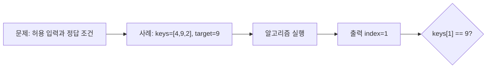

# 00. 문제·입력·정답부터 구분한다

[목차](README.md) · [다음](01-correctness-and-complexity.md)

알고리즘은 코드 조각이 아니라, 허용되는 모든 입력을 정답 조건을 만족하는 출력으로 바꾸는 절차다. 먼저 한 사례와 일반 문제를 분리한다.



## 1. 한 사례는 문제가 아니다

`[4, 9, 2]`에서 9의 위치는 1이다. 이것은 한 입력 사례와 그 답이다. 일반 검색 문제는 다음처럼 쓴다.

- 입력: 길이 `n≥0`인 수열 `keys`와 값 `target`.
- 출력: `keys[i]=target`인 위치 `i`, 없으면 `None`.
- 여러 위치가 가능하면: 첫 위치를 반환한다고 추가로 정한다.

정답 조건이 빠지면 `keys=[9,9]`에서 0과 1 중 무엇이 맞는지 결정할 수 없다.

## 2. 입력 크기를 정한다

비용을 말하려면 크기 척도가 필요하다. 배열 검색에서는 보통 `n=len(keys)`다. 그래프는 정점 수 `V`와 간선 수 `E`가 둘 다 필요하다.

| 문제 | 입력 크기 |
| --- | --- |
| 배열에서 찾기 | 원소 수 `n` |
| 두 정수 곱하기 | bit 수 |
| 그래프 순회 | `V+E` |
| 행렬 곱 | 행·열 크기 |

숫자 1과 `10^1000`을 둘 다 “정수 한 개”라고만 세면 실제 입력 표현 차이를 숨긴다.

## 3. 정답은 하나가 아닐 수 있다

정렬 문제의 출력은 입력과 같은 원소들을 오름차순으로 배열한 수열이다. 같은 key를 가진 record의 순서는 정답 조건에 포함할 수도, 포함하지 않을 수도 있다.

```text
입력: [(2,"A"), (1,"B"), (2,"C")]
key만 정렬: [(1,"B"), (2,"A"), (2,"C")] 또는 [(1,"B"), (2,"C"), (2,"A")]
stable 조건 포함: 첫 번째만 허용
```

## 4. 검증자는 후보 답을 검사한다

검색 결과 `i`를 검증하려면 범위와 값을 본다.

```python
def valid_search_answer(keys, target, i):
    if i is None:
        return target not in keys
    return 0 <= i < len(keys) and keys[i] == target
```

첫 줄은 함수 이름과 입력을 정한다. `None`이면 target이 정말 없는지 확인한다. 위치가 있으면 범위 안이고 해당 값이 target인지 확인한다.

이 검증 코드는 알고리즘보다 느릴 수 있다. 검증 가능하다는 것과 빠르게 풀 수 있다는 것은 다른 질문이다.

## 5. 선조건과 후조건

선조건은 실행 전에 필요한 약속이다. Binary search의 선조건은 배열이 정렬되어 있다는 것이다. 후조건은 반환 뒤 보장할 사실이다.

| 구분 | Binary search |
| --- | --- |
| 선조건 | `keys`가 비내림차순 |
| 후조건 | 반환 위치의 값이 target, 없으면 target 부재 |

정렬되지 않은 `[8,1,5]`에 binary search를 호출해 실패한 것은 알고리즘의 후조건 위반이라기보다 호출자가 선조건을 깨뜨린 것이다.

## 6. 결정·검색·최적화 문제

- 결정: 경로가 존재하는가? 출력은 예/아니오다.
- 검색: 실제 경로 하나를 반환하라.
- 최적화: 가장 짧은 경로를 반환하라.

세 문제는 관련 있지만 같다 하지 않는다. 복잡도 이론의 P·NP는 먼저 결정 문제 언어로 정의한다.

## 7. 실제 시스템 연결은 모형이다

Kubernetes scheduling을 “pod를 node에 배치하는 최적화 문제”로 볼 수 있다. 그러나 실제 scheduler는 affinity, taint, resource, 확장점, 정책을 가진다. 교재의 단순 bin packing 모형이 실제 구현 전체라는 뜻은 아니다.

Spark DAG를 graph로 모델링할 수 있지만 stage 경계와 retry는 Spark 구현 규칙을 따른다. Iceberg metadata 탐색을 graph traversal처럼 설명할 수 있지만 실제 파일 형식·catalog 계약을 지워서는 안 된다.

### 같은 입력에서 정답 조건만 바꿔 보기

입력 `values=[4,1,4,2]`, `target=4`를 세 문제에 사용해 보자.

| 문제 | 허용 출력 | 실제 답 |
| --- | --- | --- |
| 아무 위치 찾기 | 값이 4인 index 하나 | 0 또는 2 |
| 첫 위치 찾기 | 값이 4인 최소 index | 0 |
| 등장 횟수 세기 | 4와 같은 원소 수 | 2 |

입력 바이트가 같아도 정답 조건이 바뀌면 알고리즘의 후조건이 달라진다. 아무 위치 검색이 2를 반환하면 첫 문제에는 맞지만 두 번째에는 틀리다. 등장 횟수 문제에 index 0을 반환하면 출력 타입부터 맞지 않는다.

첫 위치 linear search의 상태를 손으로 적으면 다음과 같다.

```text
i=0, values[0]=4 → target과 같음 → 즉시 0 반환
```

반면 횟수 세기는 첫 일치에서 멈추면 안 된다.

```text
count=0
4를 봄 → 1
1을 봄 → 1
4를 봄 → 2
2를 봄 → 2
종료 → 2
```

정확성 이유도 다르다. 첫 위치 검색은 index 순서로 검사하고 첫 일치 전에 일치가 없다는 invariant가 필요하다. 횟수 세기는 처리한 prefix 안의 target 개수가 `count`라는 invariant가 필요하다.

**실패 조건.** “4를 찾는다”처럼 동작만 짧게 말하면 첫 위치, 아무 위치, 개수 중 무엇을 요구하는지 알 수 없다. 구현 전에 이 차이를 출력 명세에 고정한다.

### 입력 표현도 명세의 일부다

Graph edge를 `(u,v)` 쌍으로 받는지 adjacency list로 받는지에 따라 validation과 입력 크기 계산이 달라진다. Directed edge `(A,B)`를 undirected로 해석하면 존재하지 않는 B→A 경로를 만들 수 있다.

빈 입력, 중복 값, 자기 자신으로 가는 edge, 연결되지 않은 정점처럼 작은 경계 사례를 허용할지 금지할지도 선조건에 적는다. 금지한다면 알고리즘이 조용히 임의 답을 내기보다 입력 오류를 드러내는 계약이 필요하다.

## 8. 손으로 문제 명세 쓰기

입력 `[3,1,3,2]`에서 첫 3의 위치를 찾는 문제:

1. 허용 입력은 임의 길이 정수 수열이다.
2. 출력은 첫 target 위치 또는 `None`이다.
3. 답 0은 범위 안이다.
4. `keys[0]=3`이다.
5. 0보다 앞선 위치는 없으므로 첫 위치 조건도 맞다.

## 9. 반례로 모호함 찾기

“가장 큰 수를 반환”이라는 설명에 빈 배열을 넣으면 답이 없다. 빈 입력을 금지하거나 별도 출력을 정해야 한다.

“경로를 반환”에 시작점과 끝점이 같은 경우를 넣으면 빈 간선 경로를 허용하는지 정해야 한다.

반례는 구현을 공격하려는 것이 아니라 명세의 빈틈을 찾는 작은 입력이다.

## 10. 확인 문제와 해설

**문제 1.** 정렬된 배열 `[1,4,4,9]`에서 4를 찾는 문제의 출력은 하나인가?

**해설.** 아무 위치나 허용하면 1과 2가 모두 정답이다. 첫 위치 조건을 넣으면 1만 정답이다.

**문제 2.** “NCCL 통신 순서를 최소화한다”는 문장이 충분한 명세인가?

**해설.** 아니다. 입력 topology, 허용 연산, 비용 단위, correctness 조건이 필요하다. 실제 NCCL 구현과 교육용 graph 모형도 구분한다.

**문제 3.** 프로그램이 샘플 세 개에서 맞으면 알고리즘이 문제를 푼 것인가?

**해설.** 모든 허용 입력에서 정답 조건을 만족한다는 증명이 없으므로 충분하지 않다.

## 핵심 문장

코드를 쓰기 전에 입력, 출력, 정답 조건, 선조건, 입력 크기를 적는다. 좋은 알고리즘 설명은 한 사례의 답을 넘어 모든 허용 입력을 다룬다.

## 참고

[MIT 6.006 Lecture 1](https://ocw.mit.edu/courses/6-006-introduction-to-algorithms-spring-2020/resources/lecture-1-algorithms-and-computation/index.html)의 문제·알고리즘 구분을 참고했다.
