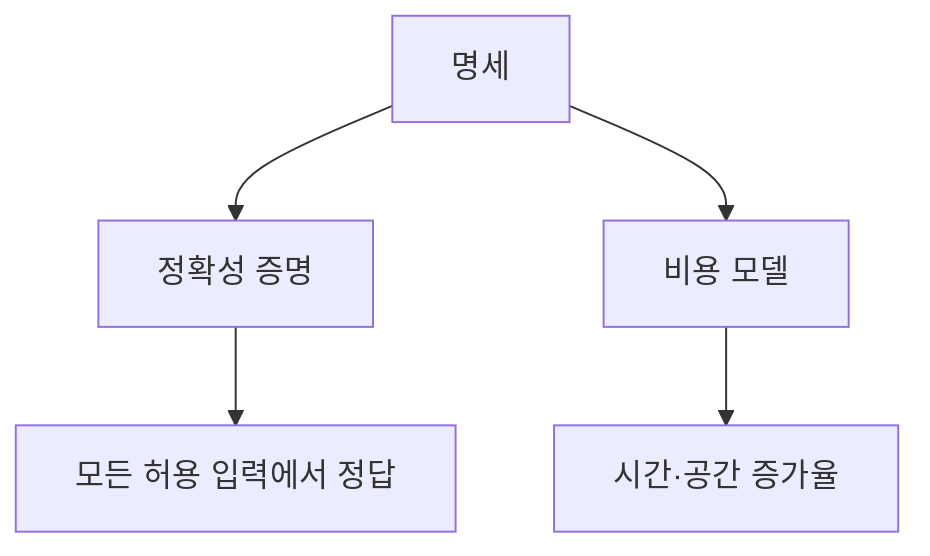

# 01. 정확성과 복잡도

[이전](00-problems-inputs-and-answers.md) · [목차](README.md) · [다음](02-arrays-lists-and-hashing.md)

정확성은 답이 맞는 이유이고 복잡도는 그 답을 만드는 자원 증가율이다. 빠른 오답과 느린 정답을 한 축으로 평가하지 않는다.



## 1. Loop invariant

배열 최댓값을 왼쪽부터 찾는다.

```python
def maximum(values):
    best = values[0]
    for x in values[1:]:
        if x > best:
            best = x
    return best
```

Invariant는 “반복이 특정 지점에 올 때 항상 참인 문장”이다. 여기서는 `best`가 지금까지 본 값의 최댓값이다.

- 초기: 첫 값만 보았으므로 `best`는 본 값의 최댓값이다.
- 유지: 새 값 `x`가 더 크면 바꾸고, 아니면 유지하므로 여전히 최댓값이다.
- 종료: 모든 값을 보았으므로 전체 최댓값이다.

## 2. 숫자로 추적한다

입력 `[3,1,5,2]`:

| 본 값 | 비교 전 best | 비교 결과 | 비교 후 best |
| ---: | ---: | --- | ---: |
| 시작 3 | 없음 | 초기화 | 3 |
| 1 | 3 | 1>3 거짓 | 3 |
| 5 | 3 | 5>3 참 | 5 |
| 2 | 5 | 2>5 거짓 | 5 |

결과가 5인 이유는 마지막에 우연히 5가 남아서가 아니라 invariant와 종료 조건 때문이다.

## 3. 종료도 증명한다

정확성은 답이 맞다는 partial correctness와 실제로 끝난다는 termination을 합친다. 위 loop는 길이 `n-1`인 slice를 한 번씩 보므로 끝난다.

Recursion은 입력 크기가 줄고 base case에 도달함을 보여야 한다.

## 4. 비용 모델

비교 한 번, 배열 접근 한 번을 상수 비용으로 센다고 하자. Maximum은 `n-1`번 비교하므로 `T(n)=an+b`, 즉 `O(n)`이다.

Big-O는 실제 1초를 뜻하지 않는다. Python interpreter, cache, 데이터 표현은 상수와 실제 시간을 바꾼다.

## 5. 상한·하한·tight bound

- `O(g(n))`: 충분히 큰 n에서 상한.
- `Ω(g(n))`: 하한.
- `Θ(g(n))`: 같은 차수의 상한과 하한.

Maximum은 모든 값을 보지 않으면 보지 않은 값이 더 클 수 있다. 비교 기반 일반 입력에서 `Ω(n)`이 필요하고 알고리즘이 `O(n)`이므로 `Θ(n)`이다.

## 6. Worst, average, expected

Linear search에서 target이 첫 위치면 1번, 없으면 n번 비교한다.

| 관점 | 질문 |
| --- | --- |
| Best case | 가장 쉬운 입력은? |
| Worst case | 가장 어려운 허용 입력은? |
| Average case | 입력 분포를 무엇으로 가정했나? |
| Expected | 알고리즘의 난수나 hash 가정에 대한 기댓값은? |

“평균 O(1)”에는 평균을 만드는 확률 모형이 필요하다.

## 7. 공간 복잡도

Input 배열 외에 변수 `best`, `x`만 쓰면 auxiliary space는 `O(1)`이다. 입력 자체를 포함하면 총 공간은 `O(n)`이다. 어느 기준인지 쓴다.

Merge sort는 합칠 임시 배열 때문에 보통 `O(n)` 추가 공간을 사용한다. 호출 stack도 공간이다.

## 8. Amortized cost

Dynamic array가 가득 찰 때 용량을 두 배로 만든다고 하자. 용량 1에서 8개를 append하면 resize 때 복사 수는 `1+2+4=7`이다.

| append 번호 | resize 전 용량 | 복사 수 |
| ---: | ---: | ---: |
| 1 | 1 준비 | 0 |
| 2 | 1 | 1 |
| 3 | 2 | 2 |
| 4 | 4 | 0 |
| 5 | 4 | 4 |
| 6~8 | 8 | 0 |

한 append는 `O(n)`일 수 있지만 n번 전체는 `O(n)`이므로 append당 amortized `O(1)`이다. 이것은 각 호출이 항상 O(1)이라는 뜻이 아니다.

## 9. Invariant와 비용을 섞지 않는다

Binary search의 invariant는 target이 있다면 현재 `[lo,hi]` 안에 있다는 문장이다. 비용은 구간 길이가 매번 절반이 되어 `O(log n)`이라는 별도 계산이다.

정확성 증명에 “빠르다”를 쓰거나 비용 분석에 “답이 맞다”를 쓰면 논점이 바뀐다.

## 10. 재귀 비용

Merge sort는 두 절반을 정렬하고 O(n)에 합친다.

```text
T(n) = 2T(n/2) + cn
level 0 work: cn
level 1 work: 2*c(n/2) = cn
levels: log₂ n
total: Θ(n log n)
```

## 11. 반례

두 nested loop가 있다고 무조건 O(n²)은 아니다.

```text
for i in 0..n-1:
    j = 1
    while j < n:
        j *= 2
```

안쪽은 `log n`번이므로 전체는 O(n log n)이다.

## 12. 작은 검증과 증명

Assert는 실수를 잡는다.

```python
assert maximum([3, 1, 5, 2]) == 5
assert maximum([-4, -2]) == -2
```

하지만 유한한 test가 모든 정수 배열을 덮지 않는다. Test와 proof는 서로 보완한다.

## 13. 시스템 모형

Spark task 수를 n이라 두고 O(n)이라고 말해도 실제 실행 시간은 skew, shuffle, 병렬성에 좌우된다. Cost model이 무엇을 세고 무엇을 숨기는지 적어야 한다.

## 확인 문제

**문제.** Hash lookup expected O(1)은 worst-case O(1)인가?

**해설.** 아니다. Collision과 공격적 key 분포에서는 한 bucket에 n개가 모여 O(n)일 수 있다.

**문제.** O(n) 공간 알고리즘은 언제나 O(1) 공간보다 나쁜가?

**해설.** 시간, 구현 단순성, 입력 크기, 메모리 한도를 함께 본다. Merge sort의 안정성과 시간 보장을 위해 공간을 쓸 수 있다.

## 참고

[MIT 6.006](https://ocw.mit.edu/courses/6-006-introduction-to-algorithms-spring-2020/)와 [MIT 6.046J](https://ocw.mit.edu/courses/6-046j-design-and-analysis-of-algorithms-spring-2015/)의 분석 범위를 참고했다.
