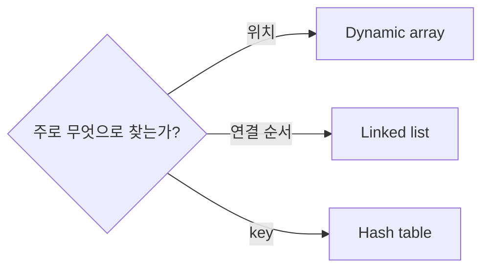

# 02. 배열·연결 목록·Hashing

[이전](01-correctness-and-complexity.md) · [목차](README.md) · [다음](03-stacks-queues-and-recursion.md)

자료구조는 값뿐 아니라 지원할 연산과 그 비용을 정한다.



## 1. 배열의 위치

배열 `[7,4,9,2]`에서 index 2는 9다. 연속된 위치 모델 덕분에 임의 index 접근은 O(1)이다.

중간 index 1에 5를 넣으면 뒤 값을 민다.

```text
전: [7,4,9,2]
4 이동: [7,4,9,2,_]
9 이동: [7,4,9,9,2]
삽입: [7,5,4,9,2]
```

실제 이동은 오른쪽에서 왼쪽 순서여야 덮어쓰지 않는다.

## 2. Dynamic array

용량과 길이를 구분한다. 길이 4, 용량 4에서 append하면 더 큰 저장소를 만들고 네 값을 복사한 뒤 새 값을 넣는다.

Doubling이면 append amortized O(1), 임의 삽입 worst O(n)이다.

## 3. 연결 목록

Node는 값과 다음 node 참조를 가진다.

```text
head → (7,next) → (4,next) → (9,None)
```

4 뒤에 5를 넣을 때 4 node를 이미 알고 있다면 pointer 두 개만 바꾼다.

```text
new.next = node4.next
node4.next = new
```

그러나 “값 4를 먼저 찾기”에는 O(n)이 든다. O(1) 삽입은 위치 node를 이미 가진다는 조건이 있다.

## 4. 배열과 목록 비교

| 연산 | Dynamic array | Singly linked list |
| --- | --- | --- |
| index 접근 | O(1) | O(n) |
| 앞 삽입 | O(n) | O(1) |
| 끝 append | amortized O(1) | tail 있으면 O(1) |
| 메모리 | 값과 여유 용량 | 값마다 pointer |

실제 CPU cache locality는 배열에 유리할 수 있다. Big-O가 같은 traversal도 실제 시간은 다르다.

## 5. Hash function과 bucket

Table 크기 5, `h(k)=k mod 5`라 하자.

| key | hash bucket |
| ---: | ---: |
| 12 | 2 |
| 7 | 2 |
| 18 | 3 |

12와 7이 bucket 2에서 충돌한다. Collision은 오류가 아니라 서로 다른 key가 같은 bucket을 얻는 상황이다.

## 6. Chaining 손 추적

```text
bucket 0: []
bucket 1: []
bucket 2: [(12,A),(7,B)]
bucket 3: [(18,C)]
bucket 4: []
```

7을 찾을 때 bucket 2를 계산하고 12와 비교한 뒤 7을 찾는다. 이 예에서는 두 key 비교다.

## 7. Load factor

`α = 저장 key 수 / bucket 수`다. 3개 key와 5 bucket이면 0.6이다. Load factor가 커지면 평균 chain이 길어질 수 있어 resize와 rehash를 한다.

Rehash는 bucket array만 복사하는 것이 아니라 새 크기의 hash로 각 key 위치를 다시 계산한다.

## 8. Expected와 worst case

Hash 분포가 고르게 되는 가정 아래 lookup expected O(1)이다. 그러나 모든 key가 한 bucket에 모이면 chain 길이가 n이어서 worst O(n)이다.

“Hash table은 O(1)”이라고만 쓰면 확률 가정과 worst case를 숨긴다.

## 9. Open addressing

Chaining 대신 table 내부의 다음 빈 칸을 찾을 수 있다. Linear probing으로 12→2, 7도 2이므로 3, 18→3이지만 차서 4에 둔다.

삭제할 때 단순 빈 칸으로 바꾸면 search chain을 끊을 수 있어 tombstone 같은 상태가 필요하다.

## 10. Set과 map

Set은 key 존재를, map은 key→value를 저장한다. Python `set`과 `dict`는 hashing 기반이지만 내부 구현 세부와 최악 보장은 언어 버전·key에 따라 구분한다.

```python
counts = {}
for key in ["A", "B", "A"]:
    counts[key] = counts.get(key, 0) + 1
```

첫 줄은 빈 map이다. Loop는 key를 하나씩 본다. `get`은 없으면 0을 주고 1을 더한다. 결과는 `{"A":2,"B":1}`이다.

## 11. Invariant

k개 항목을 처리한 뒤 `counts[x]`는 앞 k개에서 x가 나온 횟수다. 다음 key 하나의 count만 1 증가하므로 invariant가 유지된다. 종료하면 전체 빈도다.

## 12. 실제 시스템 연결

Iceberg manifest 통계로 파일을 거르는 일을 hash lookup과 같다고 부를 수는 없다. Metadata 탐색에는 partition summary, range 통계, 파일 I/O가 있다. Hash map은 일부 구현에 쓰일 수 있는 자료구조일 뿐 전체 알고리즘이 아니다.

Kubernetes가 node 이름을 map으로 찾는 것과 scheduler가 제약을 만족하는 node를 선택하는 것도 다르다.

## 13. 반례

정렬된 key의 range query를 hash table로 하면 key 순서가 없어 불편하다. Tree가 더 적합할 수 있다.

Linked list가 삽입 O(1)이라는 말만 보고 중간 값 검색까지 빠르다고 결론 내리면 안 된다.

## 확인 문제

**문제 1.** Bucket 10개에 key 20개면 load factor는?

**해설.** 2.0이다. Chaining이면 가능하지만 평균 chain 증가를 검토한다.

**문제 2.** Hash collision이 생기면 두 key가 같다는 뜻인가?

**해설.** 아니다. Hash 값 또는 bucket이 같아도 원래 key 비교로 구별한다.

**문제 3.** 배열 끝 append는 항상 worst O(1)인가?

**해설.** Dynamic array resize가 일어난 한 호출은 O(n)일 수 있다. Amortized O(1)이다.

## 참고

[MIT 6.006](https://ocw.mit.edu/courses/6-006-introduction-to-algorithms-spring-2020/) 자료구조 범위와 [Princeton Algorithms](https://algs4.cs.princeton.edu/home/)의 기본 자료구조 구성을 참고했다.

## 같은 값과 같은 위치를 구별하기

배열 `[7,7]`의 두 원소는 값이 같지만 index는 0과 1로 다르다. Key를 7로 잡아 set에 넣으면 두 번째 삽입 뒤에도 원소 수는 1이다. 두 건을 모두 보존해야 한다면 record ID를 별도 key로 쓰거나, key 7에 여러 record의 목록을 연결해야 한다.

1. 먼저 입력 record가 두 건이라는 사실을 적는다.
2. 무엇을 같다고 취급할지 equality 규칙을 정한다.
3. 그 규칙에 맞게 배열 위치, record ID, 값 key 중 하나를 고른다.
4. 조회 결과가 한 건이어야 하는지 여러 건이어야 하는지 확인한다.

자료구조의 빠른 조회는 문제의 의미를 대신 정하지 않는다. 값만 같다고 서로 다른 주문 두 건을 하나로 합치면, hash table이 올바르게 동작해도 업무 결과는 틀릴 수 있다.
