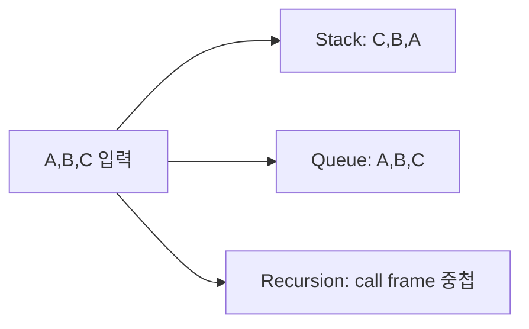

# 03. Stack·Queue·Recursion

[이전](02-arrays-lists-and-hashing.md) · [목차](README.md) · [다음](04-searching.md)

세 도구는 “나중에 처리할 상태”의 순서를 다르게 보존한다.



## 1. Stack은 LIFO

Last In, First Out이다. 빈 stack에 A, B, C를 push하면 top은 C다.

| 연산 | stack bottom→top | 반환 |
| --- | --- | --- |
| push A | A | 없음 |
| push B | A,B | 없음 |
| push C | A,B,C | 없음 |
| pop | A,B | C |

괄호 검사에서 여는 괄호를 push하고 닫는 괄호가 오면 종류가 맞는 top을 pop한다.

## 2. 괄호 손 추적

문자열 `([])`:

| 문자 | 동작 | stack |
| --- | --- | --- |
| `(` | push | `(` |
| `[` | push | `( [` |
| `]` | `[` pop | `(` |
| `)` | `(` pop | empty |

끝에 empty이므로 유효하다. `([)]`는 `)`가 왔을 때 top `[`와 달라 실패한다.

## 3. Queue는 FIFO

First In, First Out이다. A, B, C를 enqueue하면 dequeue 순서는 A, B, C다. BFS에서 먼저 발견한 정점을 먼저 확장한다.

Python list의 앞에서 `pop(0)`하면 뒤 원소 이동으로 O(n)일 수 있다. `collections.deque`의 양끝 연산을 사용한다.

## 4. Circular queue 모형

크기 4 배열에서 head와 tail을 modulo 4로 움직인다.

```text
enqueue A,B,C: [A,B,C,_], head=0, tail=3
dequeue A:     [_,B,C,_], head=1, tail=3
enqueue D,E:   [E,B,C,D], head=1, tail=1
```

Empty와 full을 구분하려면 size를 따로 두거나 한 칸을 비우는 규칙이 필요하다.

## 5. Recursion의 call frame

Factorial은 `n! = n*(n-1)!`, `0!=1`이다.

```python
def factorial(n):
    if n == 0:
        return 1
    return n * factorial(n - 1)
```

첫 줄은 함수다. 두 번째는 base case다. 마지막은 더 작은 입력을 호출하고 돌아온 값에 n을 곱한다.

## 6. `factorial(4)` 추적

```text
f(4) waits for 4*f(3)
f(3) waits for 3*f(2)
f(2) waits for 2*f(1)
f(1) waits for 1*f(0)
f(0)=1
return 1,2,6,24
```

Call stack에는 n과 돌아갈 위치가 보존된다. 시간 O(n), stack 공간 O(n)이다.

## 7. 재귀 정확성

Induction으로 보인다.

- Base: n=0이면 1을 반환하고 `0!=1`이다.
- Step: `factorial(n-1)`이 맞다고 가정하면 n을 곱한 값은 n!이다.
- Termination: n이 1씩 줄어 0에 도달한다.

## 8. 잘못된 recursion

Base case가 없거나 입력이 줄지 않으면 끝나지 않는다.

```python
def bad(n):
    return bad(n)
```

Python에서는 recursion depth 제한 전에 끝나지 않는다. 수학식이 재귀적이라고 구현도 반드시 recursion이어야 하는 것은 아니다.

## 9. 명시적 stack으로 바꾸기

DFS recursion은 호출 stack 대신 list/deque stack을 쓸 수 있다. 명시적 stack은 상태와 순서를 직접 제어하고 깊은 graph에서 language recursion limit을 피한다.

## 10. Queue invariant

BFS queue에는 발견했지만 아직 확장하지 않은 정점이 발견 순서대로 있다. Enqueue할 때 visited 표시를 해야 같은 정점이 여러 번 쌓이는 것을 막을 수 있다.

Dequeue 뒤 표시하면 diamond graph에서 같은 정점이 두 parent로부터 중복 enqueue될 수 있다.

## 11. 비용

| 연산 | 적절한 구현 | 비용 |
| --- | --- | --- |
| Stack push/pop | dynamic array 끝 | amortized O(1) |
| Queue append/popleft | deque | O(1) 양끝 모델 |
| Recursion call | call frame | 호출당 추가 공간 |

전체 비용은 연산 횟수와 각 연산 비용을 곱해 본다.

## 12. 실제 시스템 연결

Spark scheduler의 ready task 목록을 단순 queue로 그릴 수 있지만 실제 priority, locality, retry 정책이 있다. NCCL collective 실행 순서를 stack/queue 하나로 환원하지 않는다.

Iceberg metadata pointer를 따라 내려가는 것은 DFS 같은 모형으로 설명할 수 있지만 cycle이 없는 규범 구조와 I/O 오류 처리는 실제 spec을 따른다.

## 13. 반례

“DFS는 stack, BFS는 queue”는 핵심 도구지만 neighbor를 넣는 순서에 따라 방문 순서는 달라진다. 두 DFS 순서가 달라도 모두 올바른 traversal일 수 있다.

Queue가 FIFO라고 priority queue도 FIFO라고 보면 안 된다. Priority queue는 가장 작은 priority를 먼저 꺼낸다.

## 확인 문제

**문제 1.** `[A,B,C]`를 stack에 차례로 넣고 두 번 pop하면?

**해설.** C, B 순서로 나온다. Stack에는 A가 남는다.

**문제 2.** Recursion의 시간 O(n)이면 공간도 항상 O(n)인가?

**해설.** Call 깊이에 따라 다르다. Tail call도 Python은 일반적으로 frame을 제거해 주지 않는다. 반복 구현이면 O(1) auxiliary space가 가능할 수 있다.

**문제 3.** BFS에서 visited를 enqueue 시점에 표시하는 이유는?

**해설.** 아직 dequeue되지 않은 같은 정점이 여러 parent에서 중복 enqueue되는 것을 막는다.

## 참고

[MIT 6.006](https://ocw.mit.edu/courses/6-006-introduction-to-algorithms-spring-2020/)의 기본 자료구조·재귀 분석 범위를 참고했다.
