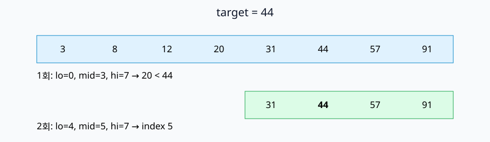
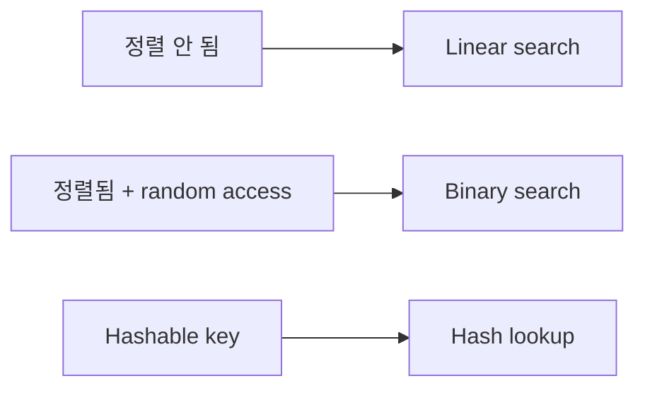

# 04. Searching

[이전](03-stacks-queues-and-recursion.md) · [목차](README.md) · [다음](05-sorting.md)

검색은 정답 조건과 입력의 구조에 따라 방법이 달라진다.





## 1. Linear search

왼쪽부터 target과 비교한다.

```python
def linear_search(keys, target):
    for i, key in enumerate(keys):
        if key == target:
            return i
    return None
```

Loop 시작 시 target이 앞의 `0..i-1` 위치에는 없다는 invariant를 쓴다. 같으면 정답 위치를 반환한다. 끝까지 없으면 전체에 없다.

Worst O(n), best O(1), auxiliary space O(1)이다.

## 2. Binary search 선조건

배열이 오름차순이어야 한다. 여덟 key를 사용한다.

```text
index: 0  1  2  3  4  5  6  7
key:   3  8  12 20 31 44 57 91
target=44
```

## 3. Inclusive 경계 구현

```python
def binary_search(keys, target):
    lo, hi = 0, len(keys) - 1
    while lo <= hi:
        mid = (lo + hi) // 2
        if keys[mid] == target:
            return mid
        if keys[mid] < target:
            lo = mid + 1
        else:
            hi = mid - 1
    return None
```

`hi`가 포함 경계이므로 시작은 `n-1`, loop는 `lo<=hi`다. 작은 값을 버릴 때 `mid+1`, 큰 값을 버릴 때 `mid-1`이다.

## 4. 8개 key 손 추적

| 반복 | lo | hi | mid | keys[mid] | 판단 |
| ---: | ---: | ---: | ---: | ---: | --- |
| 1 | 0 | 7 | 3 | 20 | 20<44, lo=4 |
| 2 | 4 | 7 | 5 | 44 | 찾음, index 5 |

결과 5인 이유는 44와 같은 위치를 반환했기 때문이다.

Target 43도 추적한다.

| 반복 | lo | hi | mid | 값 | 다음 범위 |
| ---: | ---: | ---: | ---: | ---: | --- |
| 1 | 0 | 7 | 3 | 20 | 4..7 |
| 2 | 4 | 7 | 5 | 44 | 4..4 |
| 3 | 4 | 4 | 4 | 31 | 5..4 |

`lo=5 > hi=4`가 되어 후보가 비었으므로 `None`이다.

## 5. Invariant

Target이 배열에 있다면 loop 시작 시 `[lo,hi]`에 있다.

- 초기: 전체 배열이다.
- 유지: mid 값보다 target이 크면 정렬성 때문에 mid 이하를 버려도 된다. 작으면 mid 이상을 버린다.
- 종료: 같은 값을 찾거나 구간이 비어 target이 없다.

## 6. 비용

후보 길이 8→4→2→1처럼 절반이 된다. k번 뒤 최대 `n/2^k`다. 1 이하가 되려면 `k≈log₂ n`, 따라서 O(log n)이다.

Linked list는 mid 위치로 O(1)에 갈 수 없어 같은 이점을 얻지 못한다. 정렬만으로 충분하지 않고 random access도 중요하다.

## 7. Off-by-one 오류

`hi=len(keys)`로 시작하면서 inclusive loop를 쓰면 `mid`가 n이 될 가능성이 있다. Inclusive `[lo,hi]`와 half-open `[lo,hi)` 규칙을 섞지 않는다.

`lo=mid`로 갱신하면 두 원소 구간에서 mid가 lo와 같아 무한 loop가 될 수 있다.

## 8. 첫 위치 찾기

`[1,4,4,4,9]`에서 아무 4가 아니라 첫 4를 원하면 같을 때도 답 후보를 저장하고 왼쪽을 계속 찾는다.

```text
mid=2, value=4 → answer=2, hi=1
mid=0, value=1 → lo=1
mid=1, value=4 → answer=1, hi=0
종료 → 1
```

정답 조건이 달라지면 알고리즘도 달라진다.

## 9. Lower bound

Target 이상인 첫 위치를 찾으면 insertion point와 range query에 쓸 수 있다. Target이 없어도 위치를 반환한다.

예: `[3,8,12,20]`에서 10의 lower bound는 index 2다.

## 10. Hash search와 비교

Hash lookup은 expected O(1)이지만 정렬 순서와 range를 제공하지 않는다. Binary search는 O(log n)이지만 array 정렬 비용과 update 비용이 있다.

한 번 찾기 위해 O(n log n) 정렬부터 하는 것보다 linear search O(n)가 낫다. 반복 query라면 정렬 투자 비용을 나눌 수 있다.

## 11. 실제 시스템 연결

Iceberg file 통계의 min/max pruning은 “조건 밖 파일을 버린다”는 점에서 binary search와 비슷해 보일 수 있지만 manifest layout과 range index가 곧 배열 binary search인 것은 아니다.

Kubernetes scheduler가 node를 찾는 과정도 정렬 배열 검색으로 단순화할 수 없다. Filter와 score plugin 계약을 따른다.

## 12. 반례

정렬되지 않은 `[3,91,8,12]`에서 binary search는 91을 놓칠 수 있다. 빠른 알고리즘은 선조건을 자동으로 만들어 주지 않는다.

Floating-point NaN처럼 정상적인 total order가 아닌 값은 비교 계약을 확인해야 한다.

## 확인 문제

**문제 1.** 8개 후보를 절반씩 줄이면 최악 몇 번 수준의 비교가 필요한가?

**해설.** `log₂8=3` 수준이며 경계와 찾음 비교를 세는 방식에 따라 상수는 달라진다.

**문제 2.** `[2,2,2]`에서 일반 binary search가 index 1을 반환하면 틀렸는가?

**해설.** “아무 일치 위치”가 명세면 맞다. 첫 위치 명세면 틀리다.

**문제 3.** 빈 배열의 시작 경계는?

**해설.** Inclusive 구현은 `lo=0, hi=-1`이어서 loop를 실행하지 않고 None을 반환한다.

## 참고

[Princeton Algorithms searching](https://algs4.cs.princeton.edu/30searching/)과 [MIT 6.006](https://ocw.mit.edu/courses/6-006-introduction-to-algorithms-spring-2020/)을 참고했다.
