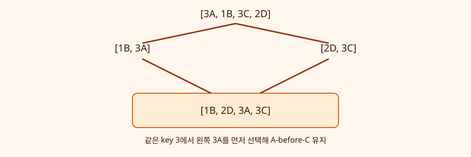
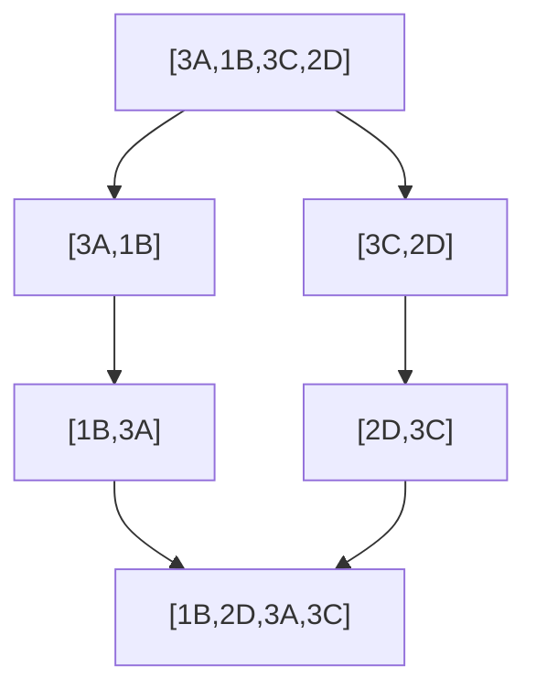

# 05. Sorting

[이전](04-searching.md) · [목차](README.md) · [다음](06-trees-and-heaps.md)

정렬은 key 순서를 만들고, stable 정렬은 같은 key record의 원래 순서도 보존한다.





## 1. 정답 조건

출력은 비내림차순이고 입력과 같은 record multiset을 가져야 한다. 값을 잃거나 복제하면 정렬이 아니다.

Stable 조건을 넣으면 key가 같은 `3A`와 `3C`는 입력의 A-before-C를 유지해야 한다.

## 2. Insertion sort

왼쪽 정렬 prefix에 다음 값을 넣는다.

```text
[5,2,4,2]
[2,5,4,2]
[2,4,5,2]
[2,2,4,5]
```

각 반복 시작에서 앞 `i`개가 정렬되어 있고 원래 앞 `i`개와 같은 값이라는 invariant를 쓴다.

Worst O(n²), 거의 정렬된 입력에서는 이동이 적다. In-place 구현은 O(1) auxiliary space가 가능하다.

## 3. Selection sort

남은 구간의 최솟값을 찾아 앞과 swap한다. 비교는 항상 Θ(n²) 수준이다.

단순 swap 구현은 stable하지 않다. 같은 key record가 서로 넘어갈 수 있다.

## 4. Merge sort

절반을 각각 정렬하고 두 sorted list를 merge한다.

입력 `[(3,A),(1,B),(3,C),(2,D)]`를 위 그림처럼 나눈다.

## 5. Stable merge 손 추적

왼쪽 `[1B,3A]`, 오른쪽 `[2D,3C]`:

| 비교 | 선택 | 출력 |
| --- | --- | --- |
| 1B vs 2D | 1B | 1B |
| 3A vs 2D | 2D | 1B,2D |
| 3A vs 3C | 같으므로 왼쪽 3A | 1B,2D,3A |
| 오른쪽 잔여 | 3C | 1B,2D,3A,3C |

같을 때 왼쪽을 먼저 고르는 규칙이 안정성을 만든다. `<`만 사용해 같을 때 오른쪽을 고르면 3C가 3A보다 앞서 stable하지 않다.

## 6. Merge 정확성

Invariant: 출력에는 두 입력에서 지금까지 소비한 record가 정렬 순서로 있고, 남은 두 첫 record보다 큰 미배치 값이 없다.

더 작은 첫 값을 붙이면 invariant가 유지된다. 한쪽이 비면 다른 쪽은 이미 정렬되어 있어 그대로 붙인다.

## 7. Merge sort 비용

각 level에서 총 n개 record를 merge하고 level 수는 log₂n이므로 Θ(n log n)이다. 보통 O(n) 임시 공간을 쓴다.

## 8. Quicksort

Pivot보다 작은, 같은, 큰 값으로 분할하고 부분을 정렬한다. 좋은 분할이면 O(n log n), 계속 한쪽으로 치우치면 worst O(n²)다.

Random pivot은 특정 입력에 대한 expected 성능을 개선하지만 worst case 자체를 없애지는 않는다.

### Partition 한 번을 손으로 추적한다

입력 `[4,1,5,2,3]`, pivot 3을 작은·같은·큰 세 목록으로 나눈다고 하자.

| 읽은 값 | small | equal | large |
| ---: | --- | --- | --- |
| 4 | `[]` | `[3]` | `[4]` |
| 1 | `[1]` | `[3]` | `[4]` |
| 5 | `[1]` | `[3]` | `[4,5]` |
| 2 | `[1,2]` | `[3]` | `[4,5]` |

재귀적으로 small은 `[1,2]`, large는 `[4,5]`가 되고 결합 결과는 `[1,2,3,4,5]`다. 모든 입력 원소를 세 목록 중 정확히 하나에 넣으므로 permutation 조건을 보존한다.

**실패 조건.** `< pivot`과 `> pivot`만 만들고 pivot과 같은 값을 빠뜨리면 중복 원소를 잃는다. In-place partition은 목록을 따로 만들지 않지만 같은 분류 invariant를 index 구간으로 유지해야 한다.

## 9. Heap sort

Heap을 만들고 최댓값 또는 최솟값을 반복 제거해 정렬한다. Θ(n log n) worst bound를 가질 수 있지만 일반 구현은 stable하지 않다.

## 10. Comparison lower bound

서로 다른 n개 원소의 가능한 순서는 n!개다. 비교 결과가 두 갈래인 decision tree는 모든 순서를 구별할 깊이가 필요해 comparison sort는 worst Ω(n log n) 비교가 필요하다.

Counting sort처럼 key 범위를 사용하는 방법은 comparison model 밖이라 O(n+k)가 가능하다. k가 매우 크면 공간이 부담이다.

## 11. 어떤 정렬을 고를까

| 조건 | 후보 |
| --- | --- |
| 안정성 필요 | Stable merge sort, 언어 stable sort |
| 작은/거의 정렬 | Insertion sort 또는 hybrid |
| worst O(n log n) | Merge/heap 계열 |
| 작은 정수 범위 | Counting/radix 검토 |

실제 Python `sorted`의 구현 계약과 안정성을 문서로 확인하고 직접 구현과 구분한다.

## 12. 반례

### 정렬 검증을 세 조건으로 나눈다

작은 출력은 다음 세 질문으로 검사한다.

1. 인접한 두 key가 비내림차순인가?
2. 입력 record마다 출력에 같은 횟수로 있는가?
3. Stable 요구라면 같은 key의 ID 순서가 보존되는가?

`[1B,2A,2C]`는 세 조건을 모두 만족할 수 있다. `[1B,2C,2A]`는 첫 두 조건은 맞지만 세 번째가 틀리다. `[1B,2A]`는 정렬되어 보여도 C를 잃어 두 번째 조건이 틀리다.

중복 record의 개수를 검사할 때 set만 비교하면 multiplicity를 잃는다. `[1,1,2]`와 `[1,2,2]`의 set은 둘 다 `{1,2}`지만 같은 입력과 출력이 아니다.

정렬 결과 key가 맞아도 record를 잃으면 틀리다. `[2A,1B,2C]→[1B,2A]`는 sorted지만 permutation 조건을 위반한다.

Stable sort가 언제나 더 빠르다는 뜻도 아니다. 안정성은 의미 계약이다.

## 13. 시스템 연결

Spark sort-merge join의 정렬은 distributed partitioning과 spill을 포함한다. 이 장의 in-memory merge sort가 실제 operator 구현 전체는 아니다.

Kubernetes priority 정렬만으로 scheduling이 끝나지 않는다. Feasibility filter와 binding이 남는다.

## 확인 문제

**문제 1.** `[2A,2B]`를 stable descending 정렬하면?

**해설.** Key가 같으므로 A, B 순서를 유지한다.

**문제 2.** Merge sort가 n=8일 때 merge level 수는?

**해설.** 균등 분할이면 log₂8=3이다.

**문제 3.** Quicksort는 언제 O(n²)인가?

**해설.** 매번 pivot이 극단값이라 크기 0과 n-1로 분할되는 경우가 대표적이다.

## 참고

[Princeton sorting](https://algs4.cs.princeton.edu/20sorting/)과 [MIT 6.006](https://ocw.mit.edu/courses/6-006-introduction-to-algorithms-spring-2020/)을 참고했다.
