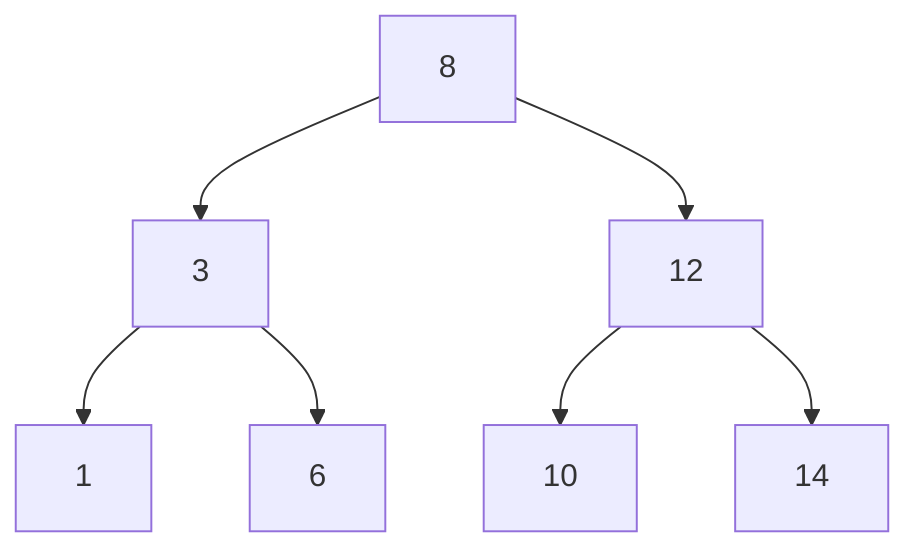

# 06. Trees와 Heaps

[이전](05-sorting.md) · [목차](README.md) · [다음](07-graphs-and-traversal.md)

Tree는 parent-child 계층을, heap은 최솟값 또는 최댓값을 빠르게 꺼내는 partial order를 표현한다.



## 1. 용어

Root는 parent가 없는 node, leaf는 child가 없는 node다. Depth는 root부터 간선 수, height는 가장 긴 아래 경로 길이다.

Node n개의 chain tree height는 n-1, 균형 tree는 약 log₂n이다.

## 2. Binary search tree

각 node에서 왼쪽 subtree key는 작고 오른쪽은 크다는 규칙을 둔다. Duplicate 정책은 별도로 정한다.

12를 찾으면 8보다 크므로 오른쪽, 12와 같아 종료한다. 7은 8 왼쪽→3 오른쪽→6 오른쪽의 빈 곳에서 부재다.

## 3. Search invariant

Target이 있다면 현재 subtree 안에 있다. 비교와 BST 규칙으로 한쪽 subtree를 안전하게 버린다.

시간은 O(height)다. 균형이면 O(log n), chain이면 O(n)이다. “BST lookup O(log n)”에는 균형 조건이 필요하다.

## 4. Insert

위 tree에 7을 넣으면 8 왼쪽, 3 오른쪽, 6 오른쪽에 연결한다.

Insertion 순서 `[1,2,3,4]`는 오른쪽 chain을 만들 수 있다. AVL·red-black tree는 회전과 균형 규칙을 추가한다.

## 5. Traversal

- Preorder: node, left, right.
- Inorder: left, node, right.
- Postorder: left, right, node.

BST inorder는 `1,3,6,8,10,12,14`의 sorted key를 만든다.

## 6. Heap property

Min-heap은 각 parent key가 child보다 작거나 같다. Sibling 사이 순서는 없다.

```text
array index: 0 1 2 3 4 5
heap value:  2 5 4 9 7 8
```

0-based에서 parent i의 child는 `2i+1`, `2i+2`다.

## 7. Heap insert 손 추적

3을 끝에 넣는다.

```text
[2,5,4,9,7,8,3]
3과 parent 4 swap
[2,5,3,9,7,8,4]
3은 parent 2보다 크므로 종료
```

Heap property가 복구된다. Height만큼 올라가므로 O(log n)이다.

## 8. Extract-min

Root 2를 꺼내고 마지막 4를 root로 옮긴다.

```text
[4,5,3,9,7,8]
작은 child 3과 swap
[3,5,4,9,7,8]
```

아래로 O(log n) 이동한다.

## 9. Heap은 정렬 배열이 아니다

`[2,5,4,...]`에서 5가 4보다 앞에 있어도 올바른 min-heap이다. 최솟값만 root에서 보장한다.

임의 key 검색은 O(n)일 수 있다. Priority queue 요구와 ordered set 요구를 구분한다.

## 10. Build heap

아래 internal node부터 sift-down하면 O(n)에 heap을 만들 수 있다. n번 insert의 O(n log n) 상한보다 강하다. 낮은 node가 많고 이동 거리가 짧기 때문이다.

## 11. Priority queue

항목 `(priority,item)`을 넣고 가장 작은 priority를 꺼낸다. Dijkstra와 scheduler 모형에 사용한다.

Priority가 같을 때 tie-breaker가 필요할 수 있다. Heap 자체는 stable queue가 아니다.

## 12. 공간과 구현

### Heap invariant를 index로 검사한다

Min-heap 배열 `[2,5,4,9,7,8]`에서 parent index 0의 children은 1과 2이며 `2≤5`, `2≤4`다. Index 1의 children은 3과 4이며 `5≤9`, `5≤7`이다. Index 2의 child 5에는 `4≤8`이다.

모든 parent-child 쌍이 이 부등식을 만족하면 heap property가 성립한다. 배열 전체가 오름차순인지 검사할 필요는 없다.

| parent i | value | child indexes | child values |
| ---: | ---: | --- | --- |
| 0 | 2 | 1,2 | 5,4 |
| 1 | 5 | 3,4 | 9,7 |
| 2 | 4 | 5 | 8 |

마지막 internal node index는 `floor((n-2)/2)`다. 그 뒤 index는 leaf라 child 조건을 검사하지 않는다.

Complete binary heap은 array에 빈 구멍 없이 저장할 수 있다. Pointer tree보다 locality가 좋을 수 있다.

BST node는 child pointer와 선택적으로 parent·balance 정보를 가진다.

## 13. 시스템 연결

Kubernetes scheduler queue를 heap 모형으로 설명할 수 있지만 실제 scheduling framework의 active/backoff queue와 plugin 정책이 있다.

Dijkstra의 heap은 다음 거리 후보를 고르는 도구다. Heap만 있다고 shortest path 정확성이 자동으로 생기지 않는다.

## 14. 반례

Min-heap의 마지막 원소가 최댓값이라는 보장은 없다. Leaf 중 어디든 최댓값일 수 있다.

BST에 sorted 입력을 넣고 균형이 자동이라고 가정하면 안 된다.

## 확인 문제

**문제 1.** Min-heap `[1,4,2,9,7]`의 두 번째 최솟값은 어디인가?

**해설.** Root의 child 4와 2 중 작은 2다. 일반 k번째 값은 더 복잡하다.

**문제 2.** BST inorder가 sorted인 이유는?

**해설.** 왼쪽 모든 key≤node≤오른쪽 모든 key이고 각 subtree도 같은 규칙을 재귀적으로 만족한다.

**문제 3.** Heap extract-min 뒤 마지막 값을 root로 옮기는 이유는?

**해설.** Complete shape를 유지한 채 빈 root를 채우고 sift-down으로 order를 복구하기 위해서다.

## 참고

[MIT 6.006](https://ocw.mit.edu/courses/6-006-introduction-to-algorithms-spring-2020/)의 binary tree와 heap 주제를 참고했다.

## Heap을 정렬 배열처럼 읽으면 생기는 오류

Min-heap `[1,5,3]`은 올바르다. Root 1이 두 자식 5와 3보다 작기 때문이다. 그러나 배열 자체는 `1,3,5`의 정렬 순서가 아니다. 형제 사이의 순서는 heap 조건이 정하지 않는다.

1. Root 1을 꺼낸다.
2. 마지막 원소 3을 root로 옮겨 `[3,5]`를 만든다.
3. Root가 자식보다 작으므로 내려갈 swap이 없다.
4. 다음에 꺼낼 값은 3이다. 연속해서 pop해야 정렬된 출력이 된다.

따라서 heap 저장 배열에 binary search를 그대로 적용할 수 없다. 최솟값을 빨리 꺼내는 보장과 임의 key를 빨리 찾는 보장은 서로 다르다.
