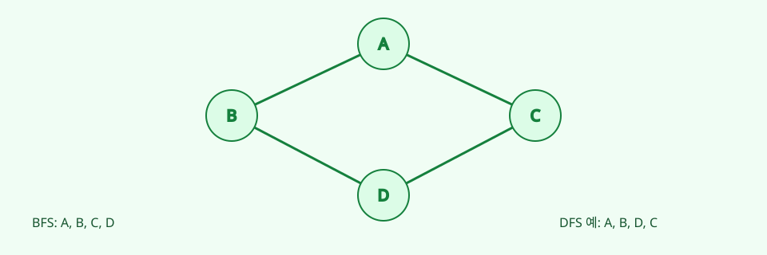
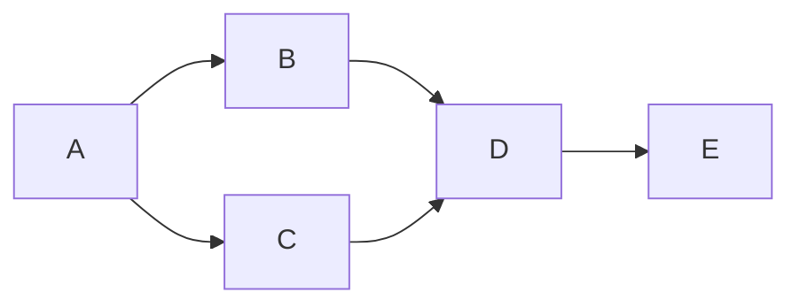

# 07. Graph와 Traversal

[이전](06-trees-and-heaps.md) · [목차](README.md) · [다음](08-shortest-paths.md)

Graph는 정점과 간선으로 관계를 표현한다. Traversal은 reachable 정점을 빠짐없이 방문한다.





## 1. 표현

Adjacency list:

```text
A: B,C
B: D
C: D
D: E
E: -
```

공간은 O(V+E)다. Adjacency matrix는 O(V²)이며 edge 존재 확인은 O(1)이다.

## 2. BFS

Queue를 사용한다. A부터:

| 단계 | dequeue | 새로 enqueue | queue | visited |
| ---: | --- | --- | --- | --- |
| 0 | - | A | A | A |
| 1 | A | B,C | B,C | A,B,C |
| 2 | B | D | C,D | A,B,C,D |
| 3 | C | 없음 | D | A,B,C,D |
| 4 | D | E | E | A,B,C,D,E |
| 5 | E | 없음 | empty | 모두 |

D는 B에서 발견할 때 visited 표시했으므로 C에서 중복 enqueue하지 않는다.

## 3. BFS 최단 간선 수

Unweighted graph에서 BFS는 거리 0,1,2 순서로 발견한다. A→D는 A-B-D 또는 A-C-D의 2간선이다.

Invariant: queue 앞의 정점 거리는 뒤보다 크지 않고, 처음 발견한 거리가 최단 간선 수다.

가중치가 다르면 간선 수 최단과 비용 최단이 달라진다.

## 4. DFS

Stack 또는 recursion으로 한 경로를 깊게 간다. Neighbor 순서를 B,C라 하면 A,B,D,E를 간 뒤 돌아와 C를 본다.

Visited가 없으면 cycle A→B→A에서 끝나지 않는다.

## 5. DFS 색 상태

- White: 미발견.
- Gray: 발견했고 아직 종료 전.
- Black: 모든 outgoing edge 처리 완료.

Directed graph에서 gray 정점으로 가는 edge는 cycle을 보여 준다.

## 6. 비용

Adjacency list에서 각 정점을 한 번 발견하고 각 간선을 한 번 검사해 BFS와 DFS는 O(V+E)다.

Disconnected graph 전체를 보려면 모든 정점에서 미방문 component traversal을 시작한다.

## 7. Topological sort

DAG의 모든 edge `u→v`에서 u가 v보다 먼저 오게 한다. Build→Test→Deploy라면 그 순서를 지킨다.

Kahn 알고리즘은 indegree 0 정점을 queue에 넣는다.

```text
A→B, A→C, B→D, C→D
indegree: A0,B1,C1,D2
queue A
remove A → B,C become 0
remove B,C → D becomes 0
order A,B,C,D (또는 A,C,B,D)
```

## 8. Cycle 검출

모든 정점을 출력하기 전에 indegree-0 queue가 비면 cycle이 있다.

`A→B→C→A`는 모두 indegree 1이라 시작할 정점이 없다. Topological order가 존재하지 않는다.

## 9. 여러 정답

B와 C 사이 dependency가 없으므로 두 topological order가 가능하다. 알고리즘의 tie-breaking이 달라도 둘 다 정답이다.

## 10. Parent로 경로 복원

### 발견 시점과 처리 완료 시점을 구분한다

BFS에서 C가 queue에 들어간 순간 C는 발견되었지만 outgoing edge는 아직 검사하지 않았다. Dequeue해 neighbor를 모두 본 뒤 처리 완료다.

| 정점 | 발견 시점 | 처리 완료 시점 |
| --- | --- | --- |
| A | 초기 enqueue | A dequeue 후 B,C 검사 |
| B | A 처리 중 | B dequeue 후 D 검사 |
| C | A 처리 중 | C dequeue 후 D 검사 |
| D | B 처리 중 | D dequeue 후 neighbor 검사 |

Visited를 발견과 같은 뜻으로 쓰면 enqueue 시 표시한다. 처리 완료 집합이 필요하면 별도 상태를 둔다. 두 상태를 한 boolean으로 섞으면 중복 방지와 cycle 분류가 어려워진다.

BFS에서 처음 발견한 parent를 기록한다. D의 parent가 B, B의 parent가 A면 뒤로 D←B←A를 따라가고 뒤집어 A-B-D를 얻는다.

## 11. Graph direction

Undirected edge는 양쪽 adjacency에 넣는다. Directed dependency를 undirected로 바꾸면 topological 의미를 잃는다.

## 12. 시스템 연결

Spark DAG는 stage/task dependency를 graph로 볼 수 있다. 그러나 실제 stage 생성은 shuffle과 scheduler 규칙을 따른다.

Iceberg metadata는 catalog→metadata→snapshot→manifest list→manifest 경로로 탐색할 수 있지만 arbitrary graph traversal 코드로 파일을 직접 읽는 것은 table semantics를 보장하지 않는다.

NCCL topology 최적화도 graph 문제로 모델링할 수 있으나 hardware link, collective algorithm, runtime 구현을 단순 BFS와 같다고 하면 안 된다.

## 13. 반례

BFS가 weighted shortest path를 항상 주지는 않는다. A→B 비용 100, A→C→B 각 1이면 BFS는 1-edge A-B를 먼저 보지만 비용은 100이다.

DFS 종료 순서를 그대로 topological order로 쓰지 않고 reverse postorder를 사용한다.

## 확인 문제

**문제 1.** BFS에서 D를 dequeue할 때 visited 표시하면 어떤 문제가 생길 수 있는가?

**해설.** B와 C가 모두 D를 enqueue해 중복 queue 항목이 생긴다.

**문제 2.** DAG에 topological order가 하나뿐인가?

**해설.** Dependency로 비교되지 않는 정점은 순서를 바꿀 수 있어 여러 개일 수 있다.

**문제 3.** O(V+E)는 dense graph에서 무엇과 비슷한가?

**해설.** E가 Θ(V²)이면 Θ(V²)다.

## 참고

[Princeton graphs](https://algs4.cs.princeton.edu/40graphs/)와 [MIT 6.006](https://ocw.mit.edu/courses/6-006-introduction-to-algorithms-spring-2020/)을 참고했다.
