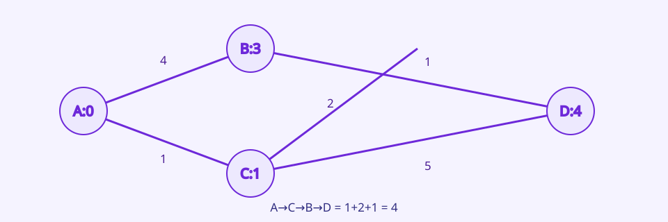
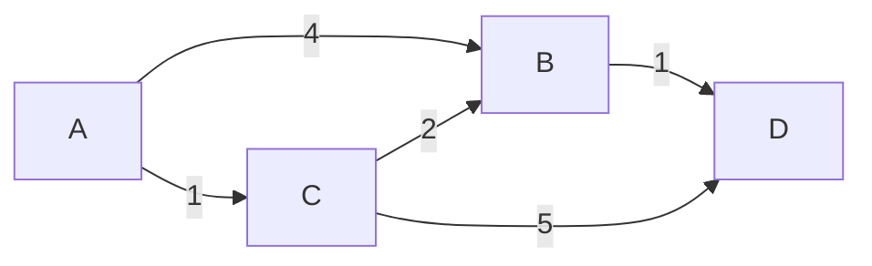

# 08. Shortest Paths

[이전](07-graphs-and-traversal.md) · [목차](README.md) · [다음](09-greedy-and-mst.md)

Shortest path는 간선 수가 아니라 가중치 합을 최소화할 수 있다.





## 1. Relaxation

현재 `dist[v]`보다 `dist[u]+w(u,v)`가 작으면 줄인다.

```text
if dist[u] + w < dist[v]:
    dist[v] = dist[u] + w
    parent[v] = u
```

이는 경로 u까지의 후보 뒤에 edge를 붙여 더 좋은 v 경로를 발견하는 동작이다.

## 2. 초기 상태

Source A의 거리는 0, 나머지는 ∞다.

| 정점 | A | B | C | D |
| --- | ---: | ---: | ---: | ---: |
| 초기 dist | 0 | ∞ | ∞ | ∞ |

## 3. Dijkstra 손 추적

모든 가중치가 음수가 아니다.

| 확정/꺼낸 후보 | Relax 결과 | dist(A,B,C,D) |
| --- | --- | --- |
| A=0 | B=4, C=1 | 0,4,1,∞ |
| C=1 | B=min(4,3)=3, D=6 | 0,3,1,6 |
| B=3 | D=min(6,4)=4 | 0,3,1,4 |
| D=4 | 없음 | 0,3,1,4 |

최단 A→C→B→D 비용은 `1+2+1=4`다.

## 4. Heap와 stale entry

Python heap에 decrease-key 대신 새 `(거리,정점)`을 push할 수 있다. B는 `(4,B)` 뒤 `(3,B)`가 추가된다.

`(3,B)`를 먼저 처리한 뒤 `(4,B)`가 나오면 `4 != dist[B]`이므로 stale entry로 건너뛴다.

```python
distance, node = heappop(heap)
if distance != dist[node]:
    continue
```

Stale을 처리해도 relaxation 결과가 보통 틀리진 않을 수 있지만 불필요한 작업이 늘고 확정 논리를 흐린다.

## 5. 정확성 핵심

음수 edge가 없으므로 아직 확정되지 않은 경로를 더 이어도 비용이 줄어들지 않는다. Heap에서 가장 작은 후보 u를 꺼낼 때 u보다 싼 미발견 경로가 있다면 그 경로 앞부분에도 더 작은 후보가 있어 먼저 나왔어야 한다.

## 6. 비용

Adjacency list와 binary heap이면 보통 O((V+E) log V)로 설명한다. Heap 구현의 duplicate entry를 세는 방식에 따라 log 항 표현을 다르게 적을 수 있다.

## 7. 음수 edge 반례

```text
A→B=2, A→C=5, C→B=-10
```

Dijkstra가 B=2를 먼저 확정하면 나중 A→C→B=-5를 놓칠 수 있다. 음수 edge는 비음수 전제를 깬다.

음수 cycle이 source에서 reachable이면 경로를 돌 때마다 비용을 줄일 수 있어 유한 최단 거리가 없다.

## 8. Bellman–Ford

모든 edge를 V-1번 relaxation한다. 간선 수가 최대 V-1인 simple shortest path가 단계별로 전파된다.

위 음수 예:

| pass | B | C |
| ---: | ---: | ---: |
| 초기 | ∞ | ∞ |
| 1 | 2 후 C=5, C→B로 -5 | 5 |
| 2 | -5 | 5 |

추가 pass에서도 줄어들면 reachable negative cycle을 검출한다.

### 도달 불가와 음수 cycle을 구분한다

정점 E가 어떤 edge로도 A에서 도달되지 않는다고 하자. `dist[E]=∞`가 끝까지 남는 것은 오류가 아니라 “A에서 경로 없음”이라는 결과다.

이제 C→B=-10과 B→C=1이 함께 있으면 B-C cycle 비용은 -9다. A에서 C에 도달할 수 있으므로 cycle을 한 번 돌 때마다 B와 C 거리가 더 작아진다.

| pass | dist[B] | dist[C] | dist[E] |
| ---: | ---: | ---: | ---: |
| 초기 | ∞ | ∞ | ∞ |
| 1 | -5 | 5 | ∞ |
| 2 | -14 | -4 | ∞ |
| 3 | -23 | -13 | ∞ |

E의 ∞는 유한 경로가 없다는 뜻이다. B와 C의 계속 감소는 유한 최단 거리가 없다는 뜻이다. 두 상태를 같은 “계산 실패”로 처리하지 않는다.

Bellman–Ford는 V-1번 뒤 한 번 더 모든 reachable edge를 relaxation해 값이 줄어드는지 본다. 줄어들면 source에서 도달 가능한 음수 cycle이 최단 경로 의미를 깨뜨린다.

**반례.** Graph의 다른 disconnected component에 음수 cycle이 있어도 A에서 도달할 수 없다면 A-source 거리에는 영향을 주지 않는다. Cycle 존재와 source에서 reachable한 cycle을 구분한다.

### 경로 복원 실패 조건

Unreachable E의 parent는 없다. Negative cycle 영향권의 parent를 계속 따르면 cycle을 돌 수 있다. Parent chain 복원은 유한 최단 거리가 확정된 정점에만 수행한다.

## 9. BFS와 관계

모든 edge weight가 1이면 BFS가 O(V+E)에 shortest path를 구한다. Weight가 0 또는 1이면 deque를 쓰는 0-1 BFS도 있다. 제약이 강하면 더 단순한 방법을 고른다.

## 10. Path 복원

Parent[D]=B, Parent[B]=C, Parent[C]=A를 뒤로 따라 D←B←C←A, 뒤집어 A-C-B-D다.

Distance만 필요하면 parent를 생략할 수 있지만 실제 경로를 요구하는 명세에는 필요하다.

## 11. Overflow와 표현

∞를 큰 정수 하나로 흉내 내면 덧셈 overflow나 실제 경로보다 작아질 수 있다. 언어의 infinity나 명시적 unreachable 상태를 사용한다.

## 12. 시스템 연결

Network latency routing을 graph로 모델링할 수 있지만 NCCL collective는 한 source-to-destination shortest path만 고르는 문제가 아니다. Bandwidth, contention, collective semantics가 있다.

Kubernetes scheduler score 합도 shortest path가 아니다. 모형을 실제 구현 계약과 구분한다.

## 13. 반례

가중치가 모두 양수여도 “현재 정점에서 가장 싼 outgoing edge”만 고르는 greedy walk는 전역 최단 경로를 보장하지 않는다. Dijkstra는 전체 frontier의 최솟값과 relaxation을 사용한다.

## 확인 문제

**문제 1.** Dijkstra에서 음수 edge 하나가 reachable하지 않으면 현재 source 결과에 영향이 있는가?

**해설.** 그 source에서는 닿지 않으므로 결과에 영향이 없지만, 알고리즘 계약은 보통 graph의 사용 범위에 비음수 가중치를 요구한다고 명시하는 편이 안전하다.

**문제 2.** Stale heap entry란?

**해설.** 같은 정점의 더 좋은 거리 후보가 나중에 들어가 기존 큰 후보가 현재 dist와 달라진 항목이다.

**문제 3.** Negative cycle이면 가장 짧은 simple path도 없는가?

**해설.** Simple path로 제한하면 후보는 유한하지만 일반 shortest-walk 정의에서는 cycle 반복으로 비용이 무한히 감소한다. 문제 정의를 확인한다.

## 참고

[Princeton shortest paths](https://algs4.cs.princeton.edu/44sp/)와 [MIT 6.006](https://ocw.mit.edu/courses/6-006-introduction-to-algorithms-spring-2020/)을 참고했다.
