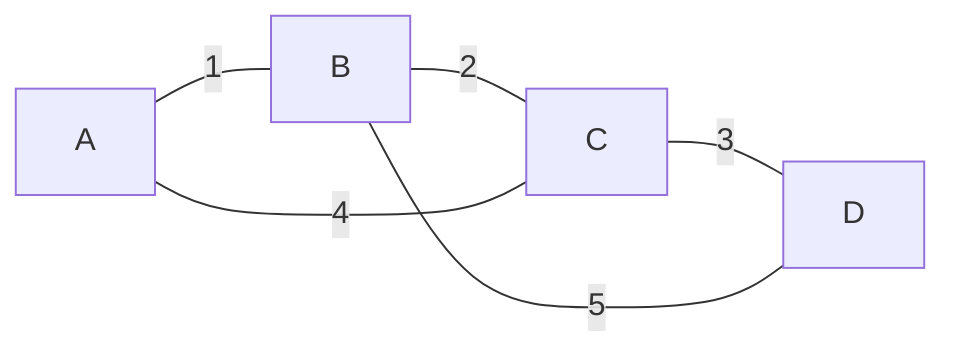

# 09. Greedy와 Minimum Spanning Tree

[이전](08-shortest-paths.md) · [목차](README.md) · [다음](10-dynamic-programming.md)

Greedy는 지금 가장 좋아 보이는 선택을 되돌리지 않는다. 맞으려면 greedy-choice property와 구조적 증명이 필요하다.



## 1. 동전 greedy

동전 `{1,5,10,25}`에서는 큰 동전부터 선택하는 방법이 잘 동작하는 금액이 많다. 하지만 모든 동전 체계에서 맞는 규칙은 아니다.

## 2. 반례 `{1,3,4}`, amount 6

Greedy는 4를 선택하고 남은 2를 1+1로 만들어 세 동전을 쓴다.

```text
6 → choose 4 → remainder 2
2 → choose 1 → remainder 1
1 → choose 1 → remainder 0
coins: 4,1,1 (3개)
```

최적은 3+3의 두 개다. 한 반례가 “모든 체계에서 optimal” 주장을 무너뜨린다.

## 3. Greedy 증명 방식

Exchange argument는 어떤 최적해도 greedy 선택을 포함하는 최적해로 바꿀 수 있음을 보인다. Staying-ahead는 매 단계 greedy 해가 다른 해보다 뒤처지지 않음을 보인다.

증명 없이 샘플 몇 개가 맞는 것은 충분하지 않다.

## 4. Spanning tree

Connected undirected graph의 모든 정점을 잇고 cycle이 없는 edge 집합이다. V개 정점의 tree는 V-1개 edge를 가진다.

MST는 edge weight 합이 최소인 spanning tree다. Source에서 각 정점까지 shortest path tree와 목적이 다르다.

## 5. Kruskal

Edge를 weight 오름차순으로 보고 서로 다른 component를 잇는 edge만 선택한다.

| 순서 | edge | 결정 | 선택 합 |
| ---: | --- | --- | ---: |
| 1 | A-B=1 | 선택 | 1 |
| 2 | B-C=2 | 선택 | 3 |
| 3 | C-D=3 | 선택 | 6 |
| 4 | A-C=4 | cycle이라 제외 | 6 |
| 5 | B-D=5 | cycle이라 제외 | 6 |

정점 4개에 edge 3개를 선택했으므로 종료한다.

### Cycle 검사를 실제 parent 변화로 본다

Union–Find의 대표를 처음에는 자기 자신으로 둔다.

| Edge 처리 | 처리 전 대표 | 판단 | 처리 후 component |
| --- | --- | --- | --- |
| A-B=1 | A, B가 다름 | 선택·union | `{A,B}` |
| B-C=2 | B의 대표 A, C가 다름 | 선택·union | `{A,B,C}` |
| C-D=3 | C의 대표 A, D가 다름 | 선택·union | `{A,B,C,D}` |
| A-C=4 | 둘 다 대표 A | 제외 | 변화 없음 |

A-C를 선택하면 이미 A-B-C 경로가 있는 상태에 세 번째 edge를 넣어 cycle A-B-C-A를 만든다. `find(A)==find(C)`가 바로 그 기존 경로 존재를 요약한다.

**왜 결과 weight가 6인가.** 선택한 edge 1,2,3의 합이다. Weight 4와 5는 graph에 남지만 MST에는 들어가지 않는다. Graph 원본을 삭제하는 알고리즘이 아니라 부분 edge 집합을 고르는 알고리즘이다.

**실패 조건.** Union 호출을 선택 판단 전에 해 버리면 두 component가 미리 합쳐져 안전한 edge까지 cycle처럼 보일 수 있다. 먼저 대표를 비교하고, 선택한 경우에만 합친다.

### Cut과 cycle은 같은 선택을 다른 쪽에서 설명한다

Cut property는 다른 component를 잇는 최소 edge가 안전한 이유를 설명한다. Cycle 검사는 이미 연결된 두 정점을 잇는 edge를 버리는 이유를 설명한다. Kruskal 구현에는 둘 다 같은 대표 비교로 나타나지만 정확성 설명에서는 역할을 구분한다.

## 6. Union–Find

서로 같은 component인지 관리한다.

- `find(x)`: x의 대표 root.
- `union(a,b)`: 두 component를 합침.

처음 `{A},{B},{C},{D}`다. A-B 후 `{A,B}`, B-C 후 `{A,B,C}`, C-D 후 모두 하나다.

Path compression과 union by rank/size를 쓰면 연속 연산의 amortized cost가 매우 작다. 정확한 bound는 inverse Ackermann 함수로 표현한다.

## 7. Cut property

### 한 cut을 숫자로 검사한다

현재 Kruskal component가 `{A,B}`와 `{C}`, `{D}`라고 하자. `{A,B}`와 나머지를 가르는 edge는 B-C=2, A-C=4, B-D=5다. 이 cut을 가로지르는 최소 edge B-C=2를 선택하면 component를 안전하게 합칠 수 있다.

| Crossing edge | weight | 선택 판단 |
| --- | ---: | --- |
| B-C | 2 | 최소라 선택 가능 |
| A-C | 4 | 더 무거움 |
| B-D | 5 | 더 무거움 |

이미 선택한 A-B=1과 B-C=2는 cycle을 만들지 않는다. 나중 A-C=4를 보면 A와 C가 같은 component라 제외한다. “가벼운 edge”와 “서로 다른 component를 잇는 edge”를 함께 검사한다.

정점을 두 집합으로 나눈 cut을 가로지르는 안전한 최소 edge를 선택할 수 있다. Kruskal이 서로 다른 component 사이의 가장 가벼운 edge를 고르는 근거다.

## 8. Prim

한 정점에서 시작해 현재 tree와 밖을 잇는 가장 싼 edge를 반복 선택한다. Priority queue를 사용할 수 있다.

Kruskal은 edge 전체 정렬과 component, Prim은 frontier heap이라는 실행 구조 차이가 있다.

## 9. Disconnected graph

Spanning tree가 없다. Kruskal은 각 component의 minimum spanning forest를 만든다. 명세가 connected를 선조건으로 요구하는지 적는다.

## 10. Equal weights

가중치가 같으면 MST가 여러 개일 수 있다. Weight 합이 같고 모두 spanning tree면 정답이다. Tie-breaking 결과를 하나로 고정하지 않는다.

## 11. 비용

Kruskal은 edge sort O(E log E)가 지배적이다. Union–Find 연산은 amortized로 매우 작다.

Prim은 heap 표현에 따라 O(E log V)로 설명할 수 있다.

## 12. 실제 시스템 연결

NCCL topology에서 최소 weight tree를 떠올릴 수 있지만 collective throughput은 단순 edge 합 MST와 같지 않다. Ring/tree collective, bandwidth와 병렬 link를 실제 구현과 함께 본다.

Kubernetes node 선택도 MST 문제가 아니다. Greedy heuristic을 쓰더라도 constraint와 score 정책을 확인한다.

## 13. 반례

Shortest edge를 무조건 고르는 것이 아니라 cycle을 만들지 않는 shortest safe edge를 고른다. Union–Find 검사가 빠지면 spanning tree가 아닌 cycle을 만들 수 있다.

MST에서 두 정점 사이 경로가 그 두 정점의 shortest path라는 보장도 없다.

## 확인 문제

**문제 1.** `{1,3,4}`로 6을 만들 때 greedy와 optimum은?

**해설.** Greedy 4+1+1 세 개, optimum 3+3 두 개다.

**문제 2.** Kruskal이 V-1개 edge를 선택하기 전에 후보가 끝나면?

**해설.** Graph가 disconnected라 spanning tree가 없다. Forest 결과다.

**문제 3.** MST와 shortest path tree 차이는?

**해설.** MST는 전체 edge 합, shortest path tree는 한 source에서 각 정점까지 거리 보존을 목표로 한다.

## 참고

[Princeton MST](https://algs4.cs.princeton.edu/43mst/)와 [MIT 6.046J](https://ocw.mit.edu/courses/6-046j-design-and-analysis-of-algorithms-spring-2015/)를 참고했다.
