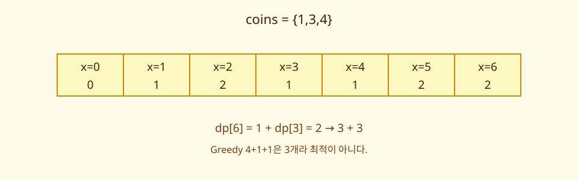
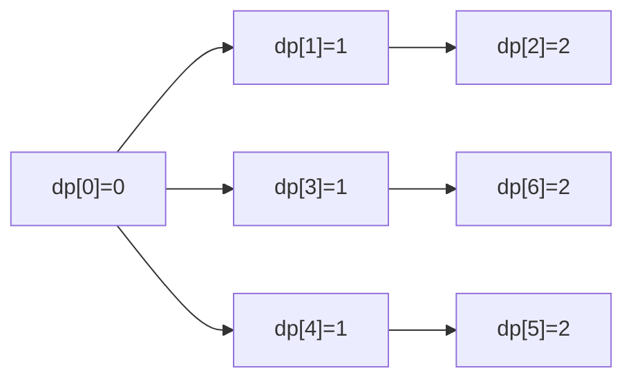

# 10. Dynamic Programming

[이전](09-greedy-and-mst.md) · [목차](README.md) · [다음](11-divide-and-conquer.md)

동적 계획법은 겹치는 부분 문제의 답을 상태로 저장하고 작은 상태부터 큰 상태를 만든다.





## 1. 세 요소

1. 상태: 무엇을 기억하는가?
2. 전이: 작은 답으로 큰 답을 어떻게 만드는가?
3. 기저값: 가장 작은 상태의 답은 무엇인가?

계산 순서는 전이에 필요한 상태가 먼저 준비되게 정한다.

## 2. 동전 최소 개수 상태

동전 `{1,3,4}`에서 `dp[x]`를 금액 x를 만드는 최소 동전 수로 정의한다.

기저값은 `dp[0]=0`이다. 금액 0에는 동전이 필요 없다.

전이는 `dp[x] = 1 + min(dp[x-c])`이며 `c≤x`인 동전만 본다.

## 3. 실제 표

| x | 후보 | dp[x] | 선택 예 |
| ---: | --- | ---: | --- |
| 0 | 기저 | 0 | 없음 |
| 1 | 1+dp[0]=1 | 1 | 1 |
| 2 | 1+dp[1]=2 | 2 | 1+1 |
| 3 | 1+dp[2]=3, 1+dp[0]=1 | 1 | 3 |
| 4 | 1+dp[3]=2, 1+dp[1]=2, 1+dp[0]=1 | 1 | 4 |
| 5 | 1+dp[4]=2, 1+dp[2]=3, 1+dp[1]=2 | 2 | 4+1 |
| 6 | 1+dp[5]=3, 1+dp[3]=2, 1+dp[2]=3 | 2 | 3+3 |

Greedy의 4+1+1 세 개보다 DP의 3+3 두 개가 낫다.

## 4. 왜 전이가 맞는가

금액 x의 최적해 마지막 동전을 c라고 하자. 그 동전을 빼면 x-c의 해가 남는다. 남은 해가 최적이 아니면 더 좋은 x-c 해로 바꿔 x도 개선할 수 있어 모순이다.

모든 가능한 마지막 동전 c를 비교하므로 최적을 놓치지 않는다.

## 5. Bottom-up 코드

```python
def min_coins(amount, coins):
    dp = [0] + [amount + 1] * amount
    for x in range(1, amount + 1):
        for coin in coins:
            if coin <= x:
                dp[x] = min(dp[x], 1 + dp[x - coin])
    return dp[amount]
```

첫 줄은 불가능을 나타낼 큰 초기값을 만든다. 바깥 loop는 작은 금액부터 채운다. 안쪽은 마지막 동전 후보를 본다. 반환값은 정의한 상태 그대로다.

시간 O(amount×동전 수), 공간 O(amount)다. 금액 값에 비례하므로 입력 bit 길이에 대해 pseudo-polynomial일 수 있다.

### 만들 수 없는 금액과 초기값

동전 `{3,4}`로 amount 5를 만든다고 하자. `amount+1=6`을 불가능 표식으로 사용한다.

| x | 후보 | dp[x] |
| ---: | --- | ---: |
| 0 | 기저 | 0 |
| 1 | 사용 가능한 동전 없음 | 6 |
| 2 | 사용 가능한 동전 없음 | 6 |
| 3 | 1+dp[0] | 1 |
| 4 | 1+dp[0] | 1 |
| 5 | 1+dp[2], 1+dp[1] | 둘 다 7이라 불가능 |

코드가 마지막에 6보다 큰 값을 그대로 “동전 6개”라고 반환하면 의미가 틀린다. Public 함수는 sentinel을 확인해 `None`이나 명시적 불가능 결과로 바꿔야 한다.

### 선택한 동전 복원

최솟값만으로 조합을 알고 싶으면 `choice[x]`에 마지막 동전을 저장한다. Amount 6에서 `choice[6]=3`, 남은 금액 3에서 `choice[3]=3`, 남은 0에서 끝나므로 `[3,3]`이다.

```text
x=6 → coin 3 → x=3
x=3 → coin 3 → x=0
reverse 불필요: 마지막 선택을 뒤로 따라도 동전 순서는 의미 없음
```

**실패 조건.** `dp[x]`를 갱신하면서 choice를 같이 갱신하지 않으면 숫자 답은 2인데 복원 경로는 오래된 세 동전을 가리킬 수 있다. 값과 parent/choice는 같은 개선 조건 안에서 바꾼다.

## 6. Memoization

Top-down recursion에 `(state→answer)` cache를 둔다. 필요한 상태만 계산하지만 recursion stack이 생긴다. Bottom-up과 같은 전이를 다른 순서로 평가할 수 있다.

## 7. 0/1 Knapsack

각 물건을 최대 한 번 선택한다. 물건 `(weight,value)`가 `(2,3),(3,4)`, 용량 5라 하자.

`dp[w]`는 처리한 물건으로 용량 w에서 얻는 최대 가치다.

## 8. 업데이트 방향

0/1에서는 용량을 큰 쪽에서 작은 쪽으로 갱신한다.

```text
초기 dp[0..5] = 0,0,0,0,0,0
물건 (2,3), w=5..2 → 0,0,3,3,3,3
물건 (3,4), w=5..3 → 0,0,3,4,4,7
```

w=5에서 이전 `dp[2]=3`에 4를 더해 7이다.

## 9. 앞에서 뒤로 하면 왜 틀리는가

물건 (2,3)을 w=2부터 올리면 방금 만든 dp[2]=3을 사용해 dp[4]=6을 만든다. 같은 물건을 두 번 쓴 셈이다. 이는 unbounded knapsack 전이가 된다.

업데이트 방향은 단순 구현 취향이 아니라 상태가 “현재 물건 이전 행”을 참조한다는 의미를 보존한다.

## 10. 2차원 상태

`dp[i][w]`를 앞 i개 물건으로 용량 w의 최대 가치로 두면 방향 오류가 더 잘 보인다.

```text
dp[i][w] = max(dp[i-1][w], value_i + dp[i-1][w-weight_i])
```

1차원 최적화는 이전 행을 덮어쓰므로 오른쪽부터 갱신한다.

## 11. 상태를 너무 크게 잡지 않는다

지금까지 고른 물건 목록 전체를 state로 두면 경우 수가 폭발한다. 미래 결정에 필요한 정보만 남긴다.

그러나 필요한 정보를 빼면 서로 다른 과거를 잘못 합친다. 상태 설계가 DP의 핵심이다.

## 12. 실제 시스템 연결

Kubernetes scheduling을 knapsack으로 모델링할 수 있지만 실제로는 여러 resource dimension, affinity, preemption, plugin이 있다. 교육용 0/1 표가 실제 scheduler 구현은 아니다.

NCCL 전략 선택도 topology와 collective 상태가 훨씬 크다. DP 가능성은 상태 수와 전이 비용을 먼저 계산해야 한다.

## 13. 반례

부분 문제가 겹치지 않는 merge sort에 memoization table을 붙여도 큰 이득이 없다. Divide-and-conquer와 DP를 구분한다.

Greedy 반례 하나가 있다고 모든 greedy가 틀린 것은 아니다. 문제 구조별 증명이 필요하다.

## 확인 문제

**문제 1.** `dp[0]=∞`로 두면 무엇이 깨지는가?

**해설.** 어떤 동전 하나로 정확히 만드는 상태도 `1+∞`가 되어 시작할 수 없다.

**문제 2.** 0/1 knapsack을 큰 용량부터 갱신하는 이유는?

**해설.** 현재 물건으로 갱신한 값을 같은 물건 처리 중 다시 읽지 않기 위해서다.

**문제 3.** Coin DP가 amount 값에 O(amount)인 것이 언제 부담인가?

**해설.** Amount가 큰 정수이고 입력은 짧은 bit 문자열이면 값 자체에 비례하는 표가 매우 클 수 있다.

## 참고

[MIT 6.006 강의 자료](https://ocw.mit.edu/courses/6-006-introduction-to-algorithms-fall-2011/video_galleries/lecture-videos/)의 동적 계획법 주제와 [MIT 6.046J](https://ocw.mit.edu/courses/6-046j-design-and-analysis-of-algorithms-spring-2015/)를 참고했다.
