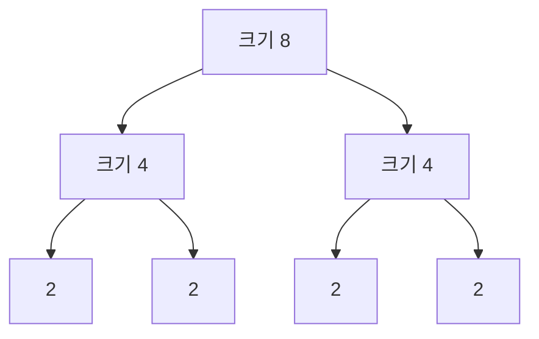

# 11. Divide and Conquer

[이전](10-dynamic-programming.md) · [목차](README.md) · [다음](12-choosing-and-limitations.md)

분할 정복은 문제를 독립적인 작은 문제로 나누고, 각각 풀고, 답을 결합한다.



## 1. 세 단계

- Divide: 입력을 작은 부분으로 나눈다.
- Conquer: 부분 문제를 재귀적으로 푼다.
- Combine: 부분 답을 전체 답으로 합친다.

Base case는 직접 푸는 작은 크기다.

## 2. Merge sort 다시 보기

`[8,3,6,2]`를 `[8,3]`, `[6,2]`로 나눈다. 각각 `[3,8]`, `[2,6]`이 되고 merge하면 `[2,3,6,8]`이다.

부분 문제는 index 범위가 달라 겹치지 않는다. DP의 같은 state 재사용과 다르다.

## 3. 정확성

Induction:

- 크기 0 또는 1은 이미 정렬이다.
- 더 작은 배열을 재귀 호출이 정렬한다고 가정한다.
- 두 sorted 배열의 올바른 merge는 전체를 정렬한다.

Permutation 조건도 merge가 각 원소를 정확히 한 번 옮긴다는 것으로 보인다.

## 4. Recurrence tree

`T(n)=2T(n/2)+cn`이다.

| level | 부분 문제 수 | 각 크기 | level 합 |
| ---: | ---: | ---: | ---: |
| 0 | 1 | n | cn |
| 1 | 2 | n/2 | cn |
| 2 | 4 | n/4 | cn |
| ... | ... | ... | cn |

Level은 log₂n개여서 Θ(n log n)이다.

### n이 2의 거듭제곱이 아닐 때

n=6이면 정확히 같은 크기 3과 3으로 나눈 뒤 1과 2가 섞인다. Recurrence를 `T(⌊n/2⌋)+T(⌈n/2⌉)+cn`으로 쓸 수 있다.

| level | 부분 크기 예 | 총 원소 수 |
| ---: | --- | ---: |
| 0 | 6 | 6 |
| 1 | 3,3 | 6 |
| 2 | 1,2,1,2 | 6 |
| 3 | 크기 1들 | 6 이하 |

Tree 높이는 `ceil(log₂6)=3` 수준이다. Floor와 ceiling은 level별 상수 차이를 만들지만 Θ(n log n) 차수는 바꾸지 않는다.

분할 index를 `(lo+hi)//2`로 잡을 때 포함 구간인지 반열린 구간인지 정해야 한다. 같은 mid를 양쪽 호출에 모두 포함하면 크기가 줄지 않거나 원소를 중복 처리할 수 있다.

```text
반열린 [lo,hi): left=[lo,mid), right=[mid,hi)
포함 [lo,hi]: left=[lo,mid], right=[mid+1,hi]
```

**실패 조건.** `[lo,mid]`와 `[mid,hi]`를 함께 쓰면 mid가 겹친다. 크기 2에서 한 호출이 원래 구간과 같아져 termination이 깨질 수 있다.

## 5. Binary search도 분할 정복인가

후보 절반 하나만 재귀/반복 처리한다. `T(n)=T(n/2)+c`, Θ(log n)이다. 두 절반 모두 푸는 merge sort와 다르다.

## 6. 최대 부분 배열

최댓값 합 구간은 왼쪽, 오른쪽, 중간을 가로지르는 경우 중 최댓값이다. Combine 단계에서 경계 양쪽 최선 합을 계산한다.

하지만 이 문제에는 O(n) Kadane 알고리즘도 있다. 분할 정복이 자동 최선은 아니다.

## 7. 빠른 거듭제곱

### `power(2,5)`를 손으로 추적한다

| 호출 | half 호출 | 반환 계산 | 결과 |
| --- | --- | --- | ---: |
| power(2,5) | power(2,2) | 2×half×half | 32 |
| power(2,2) | power(2,1) | half×half | 4 |
| power(2,1) | power(2,0) | 2×half×half | 2 |
| power(2,0) | 없음 | 1 | 1 |

지수 5→2→1→0으로 줄어든다. 각 호출이 half 결과를 변수에 한 번 저장하므로 호출 tree가 두 갈래로 폭발하지 않는다.

Invariant 대신 induction으로 정확성을 보인다. 절반 지수 결과가 맞으면 짝수 n은 half², 홀수 n은 x×half²가 정확히 xⁿ이다.

`x^8 = (x^4)^2`로 같은 절반 결과를 한 번만 계산한다.

```text
power(x,8)
half=power(x,4)
return half*half
```

두 번 `power(x,4)`를 호출하면 recurrence가 달라져 불필요한 중복이 생긴다.

## 8. 홀수 지수

`x^5 = x*(x^2)^2`다. 지수를 `n//2`로 줄여 termination을 보장한다. 시간 O(log n), recursion stack O(log n)이다.

## 9. Quicksort 분할

Partition이 한쪽 0, 다른 쪽 n-1이면 `T(n)=T(n-1)+Θ(n)=Θ(n²)`이다. 균형 분할이면 Θ(n log n)이다.

평균 또는 expected 주장을 할 때 pivot과 입력 분포 가정을 적는다.

## 10. Master theorem의 직관

`T(n)=aT(n/b)+f(n)`에서 재귀 부분 문제 수 a, 축소 비율 b, 결합 비용 f를 비교한다. 공식을 외우기 전에 level별 총 일을 써 본다.

모든 recurrence가 Master theorem 조건에 맞지는 않는다. `T(n)=T(n-1)+n`에는 그대로 쓰지 않는다.

## 11. Parallelism

독립적인 왼쪽과 오른쪽 부분은 병렬 실행 가능성이 있다. 그러나 task 생성, 데이터 이동, combine 비용이 있다.

Spark에서 partition별 계산을 분할 정복으로 비유할 수 있지만 shuffle stage와 fault recovery는 실제 실행 엔진 규칙이다.

## 12. 공간

In-place partition과 별개로 recursion stack이 있다. Merge sort 임시 배열, quicksort stack depth를 함께 센다.

균형 quicksort stack O(log n), 치우치면 O(n)일 수 있다.

## 13. 반례

부분 문제가 서로 겹치는데 매번 재귀 호출하면 Fibonacci처럼 exponential 중복이 생길 수 있다. Memoization 또는 DP를 검토한다.

나누는 비용이 매우 크거나 combine이 전체 병목이면 병렬 분할만 늘려도 빨라지지 않는다.

## 확인 문제

**문제 1.** `T(n)=2T(n/2)+n`의 level당 일은?

**해설.** 각 level 합이 n이고 log n level이 있어 Θ(n log n)이다.

**문제 2.** Binary search는 왜 Θ(log n)인가?

**해설.** 두 절반 중 하나만 남기고 combine이 상수 비용이기 때문이다.

**문제 3.** Divide-and-conquer와 DP 차이는?

**해설.** 전형적인 분할 정복은 독립 부분 문제, DP는 겹치는 부분 문제 답을 재사용한다.

## 참고

[MIT 6.046J](https://ocw.mit.edu/courses/6-046j-design-and-analysis-of-algorithms-spring-2015/)와 [Princeton sorting](https://algs4.cs.princeton.edu/20sorting/)을 참고했다.
