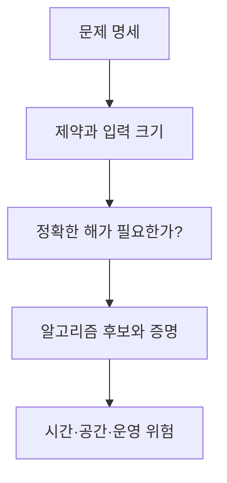

# 12. 선택과 한계: P·NP까지 정확히 말하기

[이전](11-divide-and-conquer.md) · [목차](README.md) · [다음](13-local-model-labs.md)

알고리즘 선택은 이름 맞히기가 아니라 입력 제약, 요구 보장, 비용, 구현 위험을 맞추는 일이다.

## 1. 선택표

| 요구 | 후보 | 확인할 조건 |
| --- | --- | --- |
| 정렬 배열 key | Binary search | 정렬·random access |
| Unweighted shortest path | BFS | edge weight 동일 |
| 비음수 weighted path | Dijkstra | 음수 edge 없음 |
| 음수 edge | Bellman–Ford | 음수 cycle 처리 |
| 전체 연결 최소 합 | MST | undirected·connected |
| 겹치는 최적 부분 | DP | 상태 수 감당 가능 |

## 2. 입력 크기와 상수

n=20이면 O(2^n)도 실행 가능할 수 있고 n=10^9이면 O(n)도 부담이다. Big-O와 실제 한도를 함께 본다.

Memory 1 GiB에서 8-byte 값 `10^9`개 DP 표는 약 8 GB라 맞지 않는다.

## 3. Decision과 optimization

여행 판매원 문제에서:

- 결정: 비용 K 이하 tour가 존재하는가?
- 최적화: 최소 비용 tour를 찾아라.

복잡도 등급을 말할 때 어느 형태인지 명시한다. Optimization 문제가 NP-hard라고 해서 그 자체를 NP-complete라고 부르지 않는다.

## 4. P

P는 deterministic algorithm이 입력 길이에 대한 polynomial time에 푸는 결정 문제들의 집합이다. “실제로 언제나 빠르다”와 같지 않다. `n^100`도 polynomial이다.

## 5. NP

NP는 예 답에 대한 certificate가 주어졌을 때 polynomial time에 검증 가능한 결정 문제들의 집합으로 이해할 수 있다.

NP가 “non-polynomial”의 약자라는 설명은 틀리다.

## 6. Reduction

문제 A의 모든 instance를 polynomial time에 B instance로 바꾸고 답을 보존하면, B를 푸는 방법으로 A를 풀 수 있다. 이는 B가 적어도 A만큼 어렵다는 증거다.

방향을 거꾸로 말하면 난이도 결론이 뒤집힌다.

## 7. NP-hard와 NP-complete

- NP-hard: NP의 모든 문제가 polynomial reduction으로 이 문제에 환원된다.
- NP-complete: NP에 속하면서 NP-hard인 결정 문제다.

따라서 “결정 문제이고 NP-hard”만으로 NP-complete가 아니다. 반드시 NP membership, 즉 polynomial-time certificate verification도 보여야 한다.

Optimization 문제는 NP 밖의 형태일 수 있으면서 NP-hard라고 부를 수 있다.

## 8. P 대 NP

현재 P=NP인지 P≠NP인지 증명되지 않았다. NP-hard 문제에 알려진 polynomial exact algorithm이 없다는 사실은 “모든 알고리즘이 exponential이라고 증명됐다”와 다르다.

일부 문제에는 subexponential, pseudo-polynomial, parameterized, approximation algorithm이 있을 수 있다.

### 주장을 분류하는 작은 표

| 주장 | 현재 말할 수 있는가? | 이유 |
| --- | --- | --- |
| SAT는 NP-complete다 | 예 | NP membership과 NP-hardness가 증명됨 |
| 모든 NP-hard 문제는 NP에 속한다 | 아니오 | Optimization이나 더 넓은 문제도 NP-hard 가능 |
| P≠NP다 | 미해결 | 어느 방향도 현재 증명되지 않음 |
| 이 brute force가 O(2^n)이다 | 분석 가능 | 특정 알고리즘 비용 주장 |
| 이 문제는 어떤 알고리즘도 2^n이 필요하다 | 별도 하한 증명 필요 | 알고리즘 상한과 문제 하한은 다름 |

한 구현의 느린 실행이나 exponential 탐색 tree를 관찰했다고 문제 자체의 exponential 하한을 얻는 것은 아니다. 더 좋은 formulation, pruning, parameterization이 있을 수 있다.

## 9. Exponential 하한을 함부로 말하지 않는다

특정 알고리즘이 O(2^n)이라는 것과 문제 자체가 Ω(2^n)이어야 한다는 것은 다르다. 더 좋은 알고리즘이 있을 수 있다.

증명된 조건부 하한이라면 가정을 적는다.

## 10. Approximation

### 보장과 관찰값을 구분한다

최적 비용이 100인 minimization instance에서 알고리즘이 130을 반환했다고 하자. 이 한 사례의 ratio는 1.3이다. 그러나 1.5-approximation이라고 주장하려면 모든 허용 instance에서 `ALG≤1.5×OPT`를 증명해야 한다.

| 문장 | 의미 |
| --- | --- |
| 이 사례에서 1.3배 | 한 instance의 관찰 |
| 1.5-approximation | 모든 instance에 대한 보장 |
| 평균적으로 좋았다 | 명시한 실험 분포의 결과 |
| Heuristic | 일반 ratio 증명이 없을 수 있음 |

운영에서는 보장 외에도 실행 시간과 해 품질을 측정하지만, benchmark가 이론 보장을 대신하지 않는다.

최적값을 정확히 못 구해도 보장된 비율의 답을 구할 수 있다. Minimization에서 비용이 최적의 α배 이하 같은 보장을 명시한다.

Heuristic은 실용적으로 잘 작동할 수 있지만 worst-case 보장이 없을 수 있다. 둘을 같은 말로 쓰지 않는다.

## 11. Parameterized 관점

전체 n은 커도 작은 parameter k에 대해 `f(k)·poly(n)`이면 실용적일 수 있다. 예: 작은 treewidth, 작은 선택 수.

## 12. Pseudo-polynomial

Knapsack DP O(nW)는 용량 값 W에 polynomial이지만 W의 bit 길이 log W에는 polynomial이 아닐 수 있다. 그래서 일반 입력 길이 기준 polynomial이라고 단정하지 않는다.

## 13. 시스템 문제에 적용할 때

Kubernetes scheduling을 NP-hard한 일반 최적화 모형에 연결할 수 있지만 실제 scheduler가 그 일반 문제의 exact optimum을 구한다고 말하면 안 된다. 실제 제약, heuristic, plugin을 확인한다.

NCCL topology·collective 선택도 목적 함수와 hardware model을 명시해야 한다.

Spark DAG scheduling과 Iceberg metadata 탐색은 특정 구조와 운영 계약을 가지므로 일반 graph 문제의 난이도 결과를 그대로 붙이지 않는다.

## 14. 반례

NP에 속한다고 어렵다는 뜻은 아니다. P는 NP의 부분집합으로 알려져 있으므로 shortest path decision 같은 쉬운 문제도 NP에 속한다.

NP-hard가 곧 undecidable이라는 뜻도 아니다. 계산 가능하지만 효율적 exact algorithm을 모르는 문제와 계산 불가능 문제를 구분한다.

## 15. 선택 체크리스트

1. 입력 크기와 값 범위는?
2. Exact, approximate, feasible 중 무엇이 필요한가?
3. Worst-case 보장이 필요한가?
4. Update/query 비율은?
5. Memory와 latency 한도는?
6. 선조건을 실제 데이터가 만족하는가?
7. 증명과 test는 무엇인가?

## 확인 문제

**문제 1.** NP-hard optimization 문제를 NP-complete라 불러도 되는가?

**해설.** 일반적으로 아니다. NP-complete는 NP에 속하는 NP-hard 결정 문제다.

**문제 2.** P≠NP가 증명되었는가?

**해설.** 아니다. 열린 문제다.

**문제 3.** O(nW) knapsack DP가 일반 입력 길이에 polynomial인가?

**해설.** W 값에는 polynomial이지만 W를 binary로 표현한 길이에는 pseudo-polynomial이다.

## 참고

[Princeton Intractability](https://algs4.cs.princeton.edu/66intractability/)와 [MIT 6.006 강의 자료](https://ocw.mit.edu/courses/6-006-introduction-to-algorithms-fall-2011/video_galleries/lecture-videos/)를 참고했다.
