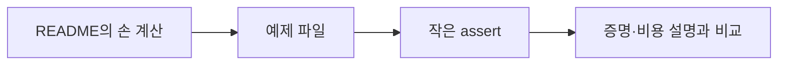

# 13. 로컬 모델 실습

[이전](12-choosing-and-limitations.md) · [목차](README.md) · [다음](14-exercises-and-glossary.md)

이 장의 두 Python 파일은 작은 입력의 정확성 사례를 확인한다. 성능 측정이나 모든 입력에 대한 증명이 아니다.



## 1. 준비

Python 표준 라이브러리만 사용한다.

- [search_sort_lab.py](examples/search_sort_lab.py)
- [graph_dp_lab.py](examples/graph_dp_lab.py)

2026-10-10, Python 3에서 두 파일을 각각 한 번 실행했고 포함된 작은 입력의 assert가 통과했다. 다음 명령은 저장소 root에서 실행한다.

```bash
python3 -B learning/algorithms/examples/search_sort_lab.py
python3 -B learning/algorithms/examples/graph_dp_lab.py
```

두 출력은 각각 `search_sort_lab: 선택한 정확성 예제가 통과했습니다`, `graph_dp_lab: 선택한 정확성 예제가 통과했습니다`였다. 이 결과는 지정한 작은 입력의 기대값과 코드가 일치한다는 뜻이다.

## 2. 검색 실습 읽기

`binary_search`는 inclusive `[lo,hi]` 경계를 쓴다. `trace`에는 `(lo,mid,hi)`가 쌓인다.

8개 key에서 44를 찾으면 예상 trace는 `(0,3,7)`, `(4,5,7)`이고 결과는 5다.

Assert는 결과와 경계 trace를 확인한다. 모든 sorted array에 대한 proof는 04장의 invariant가 담당한다.

## 3. Stable merge 실습

Record `(key,id)` 네 개를 정렬한다.

```text
입력: (3,A),(1,B),(3,C),(2,D)
출력: (1,B),(2,D),(3,A),(3,C)
```

같은 key에서 왼쪽 record를 먼저 고르는 조건을 확인한다. Assert는 A가 C보다 앞인지 검사한다.

## 4. 그래프 실습

Adjacency list는 dictionary와 list로 표현한다. BFS는 deque, DFS는 list stack을 사용한다.

Neighbor 순서를 고정해 작은 예제의 방문 순서를 assert하지만, 다른 올바른 neighbor 순서도 가능하다는 점을 기억한다.

## 5. Dijkstra 실습

비음수 가중치 graph를 사용한다. Heap에 같은 node의 여러 거리 후보가 남을 수 있어 stale check가 있다.

```text
A→B 4, A→C 1, C→B 2, B→D 1, C→D 5
dist: A0,C1,B3,D4
```

음수 edge 반례는 Dijkstra에 실행하지 않고 별도 assert로 선조건을 검사한다.

## 6. Coin DP 실습

동전 1,3,4와 amount 6에서 표 `[0,1,2,1,1,2,2]`를 만든다. 마지막 값 2가 답이다.

Greedy helper의 결과 3과 비교해 반례를 코드로 고정한다.

## 7. 0/1 Knapsack 실습

용량을 뒤에서 앞으로 갱신하는 구현과 기대값 7을 확인한다. 같은 물건을 두 번 쓰지 않는 작은 사례다.

## 8. Assert가 말하는 것

Assert가 통과하면 그 입력에서 실제 출력이 기대와 같다는 뜻이다. Edge case 몇 개를 추가하면 흔한 off-by-one을 잡을 수 있다.

Assert가 말하지 않는 것:

- 모든 입력에서 맞다는 proof.
- Worst-case 시간 복잡도.
- 운영 데이터 성능.
- Python 버전과 환경 전체 호환성.

## 9. 작은 입력을 고르는 법

| 목적 | 입력 |
| --- | --- |
| 빈 경계 | 빈 배열 |
| 한 원소 | `[5]` |
| 중복 안정성 | `[(2,A),(2,B)]` |
| 검색 부재 | target이 사이 값 |
| Graph 합류 | 두 parent가 같은 child |
| 음수 반례 | Dijkstra 선조건 위반 |

### 한 assert 실패를 상태로 진단한다

Binary search 부재 trace가 기대와 다르다고 하자. 결과가 `None`인지만 보면 off-by-one이 숨어 있을 수 있다. 각 tuple에서 다음 조건을 확인한다.

```text
0 ≤ lo ≤ mid ≤ hi < len(keys)
다음 후보 구간 길이 < 이전 후보 구간 길이
target이 존재한다면 후보 구간 안에 남음
```

`lo=mid`로 갱신해 `(4,4,4)`가 반복되면 두 번째 조건이 깨진다. 단순 timeout보다 “후보 구간이 줄지 않았다”는 원인 설명이 된다.

Graph 예제에서는 BFS 결과 순서만 보지 말고 visited 집합과 queue 중복도 본다. D가 두 번 enqueue되면 최종 order에서 한 번만 보이더라도 발견 시점 visited invariant를 어긴 구현일 수 있다.

**작은 입력의 한계.** 이 진단은 선택한 상태 전이를 보여 준다. 매우 큰 graph의 메모리 사용, hash 공격 입력, Python recursion limit, 실제 시스템의 concurrency를 대표하지 않는다.

## 10. 실패를 읽는 순서

1. 입력과 expected output이 명세에 맞는지 본다.
2. Trace에서 invariant가 처음 깨진 줄을 찾는다.
3. 경계 갱신과 visited 시점을 본다.
4. 구현을 고친 뒤 반례 assert를 남긴다.

## 11. 성능 측정을 넣지 않은 이유

초소형 입력 시간은 timer resolution과 interpreter overhead가 지배한다. 이 예제는 알고리즘 상태를 보여 주는 자료다.

성능 실험은 입력 생성, warm-up, 반복, 분포, 결과 검증을 별도 설계해야 한다.

## 12. Python 기본 문법

- `for x in values`: 값을 순서대로 본다.
- `enumerate`: index와 값을 함께 준다.
- `dict.get(k,0)`: 없을 때 0을 준다.
- `deque.popleft()`: queue 앞을 꺼낸다.
- `heapq.heappush/pop`: 최소 priority를 관리한다.

## 13. 코드를 바꿔 보는 실험

Binary search의 `mid+1`을 `mid`로 바꾸고 `[1,3]`에서 3을 찾으면 종료 여부를 추적한다. 무한 loop 위험을 설명한 뒤 원복한다.

Merge의 `<=`를 `<`로 바꾸고 duplicate ID 순서가 뒤집히는지 본다.

Knapsack loop를 앞 방향으로 바꾸고 같은 물건이 재사용되는 값을 찾는다.

## 14. 시스템 연결 주의

이 Python graph는 Spark DAG scheduler, Kubernetes scheduler, NCCL runtime, Iceberg scan planner의 모형일 뿐이다. 실제 시스템 검증에는 해당 프로젝트의 공식 test와 integration 환경이 필요하다.

## 확인 문제

**문제 1.** Assert 20개가 통과하면 correctness proof인가?

**해설.** 아니다. 선택한 20개 instance의 증거다.

**문제 2.** 방문 순서 assert가 실패했지만 reachable 집합은 같다면?

**해설.** 명세가 순서를 요구하는지 본다. Neighbor 순서가 자유라면 test가 과도할 수 있다.

**문제 3.** 작은 예제 시간을 비교해 빠른 알고리즘을 결정해도 되는가?

**해설.** 아니다. 비용 모델과 적절한 benchmark를 별도로 설계한다.

## 다음 단계

14장의 문제를 먼저 손으로 풀고, 필요할 때만 두 파일을 읽어 자신의 trace와 비교한다.
