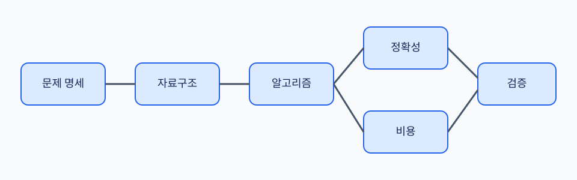

# 자료구조와 알고리즘: 처음부터 손으로 추적하는 입문

이 책은 “코드를 외우는 법”보다 문제를 정확히 정의하고, 작은 입력에서 답을 손으로 확인하고, 왜 모든 입력에서 맞는지와 자원이 얼마나 드는지를 설명하는 법을 배운다. 수학 전제는 0에서 시작한다.

## 학습 목표

1. 입력·출력·정답 조건을 분리해 계산 문제를 쓴다.
2. 배열, 연결 목록, hash table, stack, queue, tree, heap, graph의 상태 변화를 손으로 추적한다.
3. Loop invariant와 induction으로 정확성을 설명한다.
4. 시간·공간 비용, worst/average/expected/amortized를 구분한다.
5. Searching, sorting, traversal, shortest path, MST, dynamic programming을 작은 예제로 검산한다.
6. 문제 제약과 증명된 한계를 보고 알맞은 방법을 선택한다.

## 필요한 수학을 0부터

- 집합은 서로 구별되는 원소의 모음이다. `{2, 5, 7}`처럼 쓴다.
- 수열은 순서가 있는 값이다. `[2, 5, 2]`에서 첫째와 셋째 값은 같아도 위치가 다르다.
- 함수는 입력마다 출력을 정하는 규칙이다.
- 그래프는 정점과 두 정점을 잇는 간선으로 표현한다.
- 합 기호 `Σ`는 여러 값을 더한다. `Σ(i=1..n) i`는 `1+2+...+n`이다.
- 로그 `log₂ n`은 2를 몇 번 곱하면 n인지 나타낸다. `log₂ 8=3`이다.
- 확률과 기댓값은 hash table의 expected cost에서만 기초 수준으로 소개한다.

## 읽는 순서

| 장 | 질문 |
| --- | --- |
| [00](00-problems-inputs-and-answers.md) | 문제와 한 입력 사례는 어떻게 다른가? |
| [01](01-correctness-and-complexity.md) | 맞다는 것과 빠르다는 것을 어떻게 증명하는가? |
| [02](02-arrays-lists-and-hashing.md) | 위치, 연결, key 중 무엇으로 찾을까? |
| [03](03-stacks-queues-and-recursion.md) | 다음에 꺼낼 항목과 호출 상태를 어떻게 보존할까? |
| [04](04-searching.md) | 정렬된 8개 key를 어떻게 절반씩 줄일까? |
| [05](05-sorting.md) | 순서를 만들면서 같은 key의 원래 순서를 지킬 수 있을까? |
| [06](06-trees-and-heaps.md) | 계층 구조와 최솟값을 어떻게 관리할까? |
| [07](07-graphs-and-traversal.md) | BFS·DFS·위상 정렬은 무엇을 보장할까? |
| [08](08-shortest-paths.md) | Relaxation으로 최단 경로를 어떻게 확정할까? |
| [09](09-greedy-and-mst.md) | 당장 좋아 보이는 선택은 언제 맞을까? |
| [10](10-dynamic-programming.md) | 겹치는 부분 문제를 표로 어떻게 저장할까? |
| [11](11-divide-and-conquer.md) | 나누고 합치는 비용은 어떻게 계산할까? |
| [12](12-choosing-and-limitations.md) | 제약, 근사, P·NP를 어떻게 과장 없이 말할까? |
| [13](13-local-model-labs.md) | 작은 assert로 무엇을 검증할 수 있을까? |
| [14](14-exercises-and-glossary.md) | 손으로 푼 뒤 설명을 어떻게 점검할까? |

## 예제와 그림

- [검색·정렬 실습](examples/search_sort_lab.py)
- [그래프·DP 실습](examples/graph_dp_lab.py)
- [알고리즘 지도](assets/algorithm-map.svg)
- [Binary search](assets/searching.svg)
- [Stable merge sort](assets/sorting.svg)
- [Graph traversal](assets/graph-traversal.svg)
- [Shortest paths](assets/shortest-paths.svg)
- [Dynamic programming](assets/dynamic-programming.svg)

## 표기와 비용 모델

`n`은 입력 원소 수, `V`는 정점 수, `E`는 간선 수다. `O(n)`은 충분히 큰 입력에서 비용의 증가율 상한을 표현한다. 실제 초나 byte를 직접 뜻하지 않는다. 이 책의 수치는 손 계산용이며 성능 측정값이 아니다.

## 공식 참고 자료

- [MIT OCW 6.006 Introduction to Algorithms](https://ocw.mit.edu/courses/6-006-introduction-to-algorithms-spring-2020/)
- [MIT OCW 6.046J Design and Analysis of Algorithms](https://ocw.mit.edu/courses/6-046j-design-and-analysis-of-algorithms-spring-2015/)
- [Princeton Algorithms, 4th Edition 저자 사이트](https://algs4.cs.princeton.edu/home/)
- [Stanford CS161](https://web.stanford.edu/class/cs161/)

각 장의 설명과 수치는 이 책의 교육용 예제로 직접 구성했다. 공식 자료는 주제 범위와 정의를 교차 확인하는 출발점이다.

[통합 학습 목차](../README.md) · [첫 장 시작](00-problems-inputs-and-answers.md) · [그림 목록](assets/README.md)
