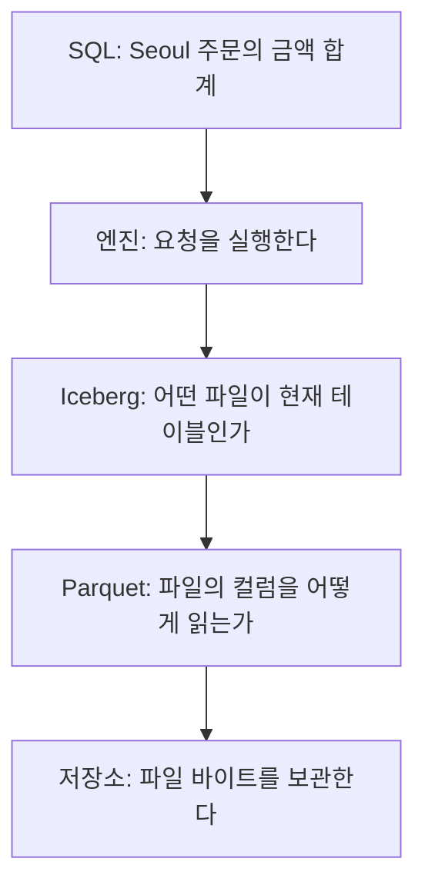
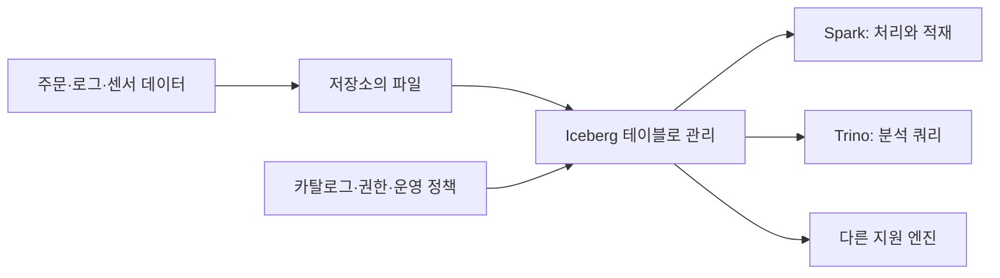

# 00. 파일에서 테이블까지

[이 책의 목차](README.md)

이 장의 목표는 “Iceberg를 쓴다”가 어떤 구성요소를 추가하는 말인지 정확하게 설명하는 것이다. 설치하기 전에 작은 데이터부터 살펴본다.

## 1. 데이터는 값이고 파일은 값을 담는 바이트다

인터넷 상점이 주문을 기록한다고 하자. **행(row)**은 주문 하나의 기록, **열(column)**은 주문 번호나 금액처럼 각 기록에서 같은 의미를 가진 자리다. **테이블(table)**은 이런 행을 정해진 구조로 다루는 논리적 대상이다.

| order_id | ordered_at | region | amount |
| --- | --- | --- | --- |
| 101 | 2026-10-01 10:00:00 | Seoul | 10000 |
| 102 | 2026-10-01 11:00:00 | Busan | 20000 |
| 103 | 2026-10-02 09:00:00 | Seoul | 15000 |

`order_id`는 주문 번호다. 번호가 같으면 같은 주문으로 해석하는 것은 애플리케이션의 규칙이다. Iceberg가 번호 중복을 자동 차단한다는 뜻은 아니다. `amount`의 단위는 이 책에서 원으로 정한다. 숫자 타입만 저장하면 단위까지 자동 기록되지는 않는다.

**스키마(schema)**는 컬럼 이름·타입·필수 여부 등 데이터 구조에 대한 약속이다. 여기서는 주문 번호와 금액을 정수, 지역을 문자열, 주문 시각을 시각 타입으로 정할 수 있다. 문자열 `"10000"`과 정수 `10000`은 화면에는 비슷해도 내부 표현과 가능한 연산이 다르다.

파일에는 값이 바이트로 기록된다. **파일 포맷(file format)**은 바이트를 어떤 순서와 규칙으로 기록하고 다시 해석할지 정의한다. CSV는 행과 구분자를 이용하고, Parquet는 여러 행의 같은 컬럼을 묶어 저장한다.

```text
CSV의 교육용 표현
order_id,ordered_at,region,amount
101,2026-10-01 10:00:00,Seoul,10000
102,2026-10-01 11:00:00,Busan,20000
103,2026-10-02 09:00:00,Seoul,15000

Parquet를 이해하기 위한 개념 표현 — 실제 바이너리 파일 문법이 아님
order_id 묶음:   [101, 102, 103]
region 묶음:     [Seoul, Busan, Seoul]
amount 묶음:     [10000, 20000, 15000]
```

**쿼리(query)**는 데이터를 읽거나 바꾸는 요청이다. **SQL(Structured Query Language)**은 테이블에 이런 요청을 표현하는 언어다. 다음은 특정 서버에 연결하기 전 읽어 보는 예시다.

```sql
SELECT region, SUM(amount) AS total_amount
FROM orders
GROUP BY region;
```

`SELECT`는 출력할 값을 정하고, `FROM`은 읽을 테이블을 정한다. `GROUP BY`는 지역이 같은 행을 묶고 `SUM`은 금액을 더한다. 위 세 행의 답은 Seoul 25000원, Busan 20000원이다.

이 요청을 실제 수행하는 프로그램이 **쿼리 엔진(query engine)**이다. Spark와 Trino는 엔진의 예다. Iceberg 자체가 SQL을 받아 CPU로 집계하는 독립 서버라는 뜻은 아니다.

## 2. Parquet가 좋은데 왜 다른 것이 필요한가

Parquet는 파일 안의 컬럼을 효율적으로 읽는 데 도움을 준다. 그러나 `orders/` 안의 파일이 테이블의 전부라고 생각하면 다음 문제가 생긴다.

### 새 주문 1건을 넣는 동안 읽는 사람이 있다

쓰기 프로그램이 새 파일을 만들고 있다. 어떤 독자는 완성된 파일만 보고, 다른 독자는 임시 파일까지 읽을 수 있다. 파일 여러 개를 묶어 공개할 때 독자가 절반만 보아도 되는가? “이번 입력 전체가 공개되는 한 순간”이 필요하다.

### 주문 102를 취소한다

`part-a.parquet` 안에 주문 101과 102가 함께 있다. 객체 저장소에서는 파일 속 행 하나를 일반적인 디스크 페이지처럼 덮어쓰는 경로를 기대하지 않는다. 새 파일을 만들거나 “이 행을 결과에서 빼라”는 정보를 별도로 기록해야 한다. 과거 파일과 새 파일을 동시에 읽으면 취소한 행이 남거나 주문이 두 번 보일 수 있다.

### 두 프로그램이 동시에 입력한다

둘 다 같은 파일 목록을 읽고 자기 새 파일을 추가했다고 하자. 마지막 프로그램이 자기 목록으로 전체 목록을 덮어쓰면 먼저 성공한 입력이 사라질 수 있다. 여러 작성자의 변경을 안전하게 합치거나 충돌을 알려야 한다.

### 컬럼 이름을 바꾼다

`region`을 `shipping_region`으로 바꾸고 나중에 새 의미의 `region`을 추가했다. 과거 파일의 `region`을 어느 컬럼으로 읽어야 하는가? 이름만으로 동일성을 판단하면 데이터가 잘못 연결될 수 있다.

### 파일이 백만 개가 된다

매번 디렉터리 전체를 나열하고 파일마다 정보를 읽는 비용이 커진다. 어떤 파일이 쿼리 범위와 관련 있는지 메타데이터로 빨리 판단해야 한다.

위 문제를 다루는 계층이 **테이블 포맷(table format)**이다. Iceberg는 파일에 기반한 분석 테이블의 메타데이터 구조와 동작 규칙을 정의한다. Parquet와 경쟁해서 둘 중 하나만 고르는 관계가 아니다. Iceberg 테이블의 실제 데이터 파일을 Parquet로 저장하는 구성이 흔하다.



화살표는 설명의 의존 관계다. 실제 엔진은 메타데이터 읽기와 파일 읽기를 여러 작업으로 나누거나 겹쳐 수행할 수 있다.

## 3. 역할을 다섯 개로 나누어 보면 헷갈리지 않는다

| 이름 | 실제 하는 일 | 혼동하기 쉬운 점 |
| --- | --- | --- |
| 저장소 | 파일 바이트를 보관하고 읽기·쓰기를 제공한다 | S3 버킷 자체가 SQL 테이블은 아니다 |
| Parquet | 한 파일 안에 컬럼 데이터를 조직한다 | 파일 하나의 정보로 테이블 전체의 현재 상태를 정하지 못한다 |
| Iceberg | 테이블의 스키마·파일 집합·스냅샷·변경 규칙을 제공한다 | 독립 SQL 엔진이나 데이터 저장 장치와 구별한다 |
| 카탈로그 | 테이블 이름을 찾아 현재 메타데이터와 커밋 경로를 제공한다 | 카탈로그 조회 권한과 데이터 파일 읽기 권한은 별개다 |
| 엔진 | 계획을 만들고 파일을 읽어 계산하거나 새 파일을 쓴다 | 엔진 버전마다 Iceberg 기능 지원이 다르다 |

**카탈로그(catalog)**는 도서관 목록에 비유할 수 있다. 책 제목으로 위치를 찾듯 `lab.orders`라는 테이블 이름으로 현재 메타데이터를 찾는다. 실제 카탈로그에는 인증·권한·커밋 조건·구현별 추가 기능이 있어 단순한 종이 목록보다 역할이 크다.

**객체 저장소(object storage)**는 키(key)로 객체를 찾아 읽고 쓰는 서비스다. `s3://bucket/orders/data/a.parquet`는 객체를 가리키는 주소의 예다. S3의 `/`는 일반 파일시스템의 디렉터리와 같은 내부 구조를 뜻하지 않는다. S3 외에도 Ceph RGW, HDFS, 로컬 파일시스템 등을 쓰는 구성이 있으며 카탈로그와 파일 I/O의 호환성을 따로 확인한다.

## 4. 데이터 레이크·웨어하우스·레이크하우스

**데이터 레이크(data lake)**는 여러 형태의 데이터를 큰 저장소에 쌓고 여러 처리 도구가 사용하는 구성이다. 파일을 자유롭게 쌓기 쉬운 만큼 테이블의 일관성·검색·관리 규칙을 마련해야 한다.

**데이터 웨어하우스(data warehouse)**는 분석을 위해 구조화한 데이터를 질의하는 시스템이다. 관리형 웨어하우스는 저장·실행·권한을 통합할 수 있다. Iceberg를 쓴다는 사실만으로 이런 모든 기능이 생기지는 않는다.

**레이크하우스(lakehouse)**는 레이크의 파일 저장과 테이블 관리·분석 기능을 결합하는 설계 방향이다. 특정 제품 하나의 이름으로 이해하지 않는다. Iceberg는 여기에 테이블 계층을 제공하고 카탈로그·엔진·보안·운영 도구가 함께 구성을 완성한다.



여러 엔진에서 같은 파일을 사용할 수 있는 개방성이 장점이다. 각 엔진이 같은 기능을 구현하고 같은 카탈로그·저장 권한을 사용할 때 실제 호환이 성립한다. 엔진 이름을 그림에 올렸다는 사실만으로 v3의 모든 타입이 지원되는 것은 아니다.

## 5. ACID를 말할 때 보장 범위를 확인한다

**트랜잭션(transaction)**은 하나의 성공·실패 단위로 다루는 작업 묶음이다. Iceberg에서는 한 테이블의 새 상태를 커밋하는 과정이 중심이다. ACID라는 약어는 다음 네 단어에서 온다.

| 성질 | 주문 입력에 대입한 뜻 | 실제 확인할 경계 |
| --- | --- | --- |
| Atomicity, 원자성 | 한 변경의 파일들이 함께 공개되거나 공개되지 않는다 | 올바른 카탈로그 커밋 구현과 지원 저장소 |
| Consistency, 일관성 | 유효한 메타데이터·스키마·참조 상태를 유지한다 | 주문 번호의 유일성 같은 업무 규칙은 별도 구현 |
| Isolation, 격리 | 읽는 작업이 하나의 일관된 테이블 상태를 사용한다 | 쓰기 연산의 충돌 검증·격리 수준은 엔진 및 설정에 의존 |
| Durability, 지속성 | 성공적으로 저장·커밋한 상태를 다시 읽을 수 있다 | 저장소의 내구성·카탈로그 보존·자격증명·재해복구 |

두 테이블에 걸친 “주문 감소와 재고 감소”가 항상 동시에 성공하는 것을 Iceberg 기본 테이블 커밋만으로 가정하지 않는다. 멀티테이블 트랜잭션은 제품·카탈로그·엔진의 별도 기능과 조건을 확인한다. 테이블의 스냅샷이 있어도 저장소 전체가 없어지는 재해의 백업을 대신하지는 못한다.

## 6. 이 책에서 계속 사용할 숫자

세 주문을 `A.parquet`에 저장했다고 하자. 새 주문 104, 금액 7000원을 `B.parquet`에 넣는다. 현재 파일 집합이 `[A]`에서 `[A, B]`로 바뀌면 총 주문은 4개, 금액은 52000원이다. 파일 수 2개와 행 수 4개는 다른 숫자다.

주문 102를 취소한 뒤에는 3개, 32000원이어야 한다. 파일이 여전히 2개라도 삭제 정보가 붙어 결과에서 102를 뺄 수 있다. 다음 장부터 “파일의 물리 상태”와 “쿼리에 보이는 논리 상태”를 분리해서 기록한다.

## 7. 확인 질문과 해설

**질문 1.** Iceberg 테이블을 쓰면 Parquet를 더 이상 쓰지 않는가?

**해설.** 함께 쓸 수 있다. Parquet는 데이터 파일의 내부 표현, Iceberg는 그 파일들이 구성하는 테이블의 구조와 변화를 관리한다.

**질문 2.** `orders/` 아래의 모든 파일을 읽으면 현재 Iceberg 테이블과 같은 결과인가?

**해설.** 그렇지 않다. 과거 스냅샷의 파일, 실패한 쓰기의 파일, 현재 삭제 정보 등이 있다. 커밋된 메타데이터를 따라 읽어야 한다.

**질문 3.** Iceberg가 주문 번호 중복을 막는가?

**해설.** 스키마나 identifier field가 있어도 일반적인 고유 제약 자동 강제를 의미하지 않는다. 입력 검증·중복 제거·MERGE 정책을 별도로 설계한다.

## 근거와 더 읽기

공식 [Iceberg 소개](https://iceberg.apache.org/), [신뢰성 설명](https://iceberg.apache.org/docs/latest/reliability/), [Parquet 개요](https://parquet.apache.org/docs/overview/)에서 각 계층의 목적을 확인할 수 있다. 위 주문 숫자와 파일 예시는 이 책의 교육용 구성이다.

[다음: 01. 내부 지도](01-metadata-and-files.md)
