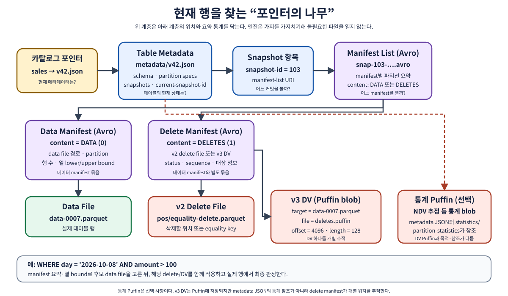
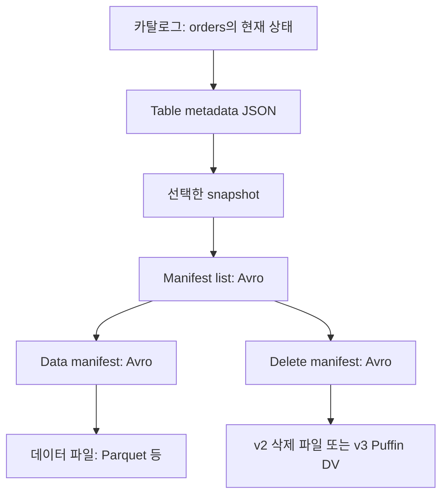

# 01. Iceberg의 내부 지도

[이 책의 목차](README.md) · [이전 장](00-first-principles.md)

이번 장에서는 테이블 이름에서 실제 행까지 찾아가는 경로를 배운다. 모든 파일을 외우기보다 **각 단계가 다음 단계의 어떤 주소를 제공하는지** 본다.



## 1. 테이블은 폴더 전체가 아니라 메타데이터가 정의한 상태다

교육용 주소는 다음과 같다. 실제 파일 이름·배치는 카탈로그와 설정에 따라 달라진다.

```text
warehouse/lab/orders/
  metadata/
    00001-....metadata.json
    00002-....metadata.json
    snap-....avro               ← manifest list
    ....-m0.avro                ← manifest
  data/
    part-A.parquet
    part-B.parquet
  ...                         ← 삭제 파일·Puffin 위치는 구현과 설정에 따름
```

`metadata/`와 `data/`가 눈에 보인다고 해서 폴더 이름만으로 파일의 의미를 판단하지 않는다. 어떤 데이터 파일이 어느 스냅샷에 속하는지, 삭제가 어디에 적용되는지는 메타데이터의 참조가 결정한다.

**메타데이터(metadata)**는 데이터를 설명하는 데이터다. 파일 주소, 컬럼 타입, 파일의 행 수, 현재 스냅샷 번호도 메타데이터다. 작은 정보라고 항상 크기가 작거나 중요도가 낮은 것은 아니다. 파일이 많으면 메타데이터 처리도 큰 비용이 된다.

## 2. 카탈로그: 테이블 이름의 첫 해석

엔진은 `catalog.namespace.table` 이름을 해석한다. 예를 들어 `local.lab.orders`에서 `local`은 엔진에 등록한 카탈로그 이름, `lab`은 이름을 묶는 namespace, `orders`는 테이블 이름이다.

카탈로그 구현은 테이블의 현재 메타데이터 위치를 찾아 주고 변경을 커밋하는 경로를 제공한다. Hive Metastore나 REST 기반 구현과 HadoopCatalog의 저장 방식은 같지 않다. 따라서 모든 구현이 관계형 DB 안의 한 포인터 컬럼을 갱신한다고 일반화하지 않는다.

이 책의 그림에서 `catalog → metadata JSON` 화살표는 “이 이름의 현재 상태를 여기에서 찾는다”는 논리 관계다. 실제 카탈로그 저장 구조는 [08장](08-catalogs-and-engines.md)에서 구별한다.

## 3. Table metadata JSON: 테이블 전체의 설명서

JSON은 구조화된 값을 키와 값으로 표현하는 텍스트 형식이다. Iceberg table metadata에는 스키마 목록, 파티션 명세 목록, 현재 스냅샷, 과거 스냅샷, 설정과 참조 정보가 들어간다.

다음은 주요 필드만 뽑은 설명용 JSON이다. 필수 필드 일부를 생략했으므로 실제 파일로 등록하지 않는다.

```json
{
  "format-version": 2,
  "table-uuid": "교육용-테이블-식별자",
  "current-schema-id": 0,
  "default-spec-id": 0,
  "current-snapshot-id": 9002,
  "last-sequence-number": 2,
  "snapshots": [
    {"snapshot-id": 9001, "sequence-number": 1, "manifest-list": "snap-9001.avro"},
    {"snapshot-id": 9002, "sequence-number": 2, "manifest-list": "snap-9002.avro"}
  ]
}
```

| 필드 | 의미 | 잘못 읽기 쉬운 부분 |
| --- | --- | --- |
| `format-version` | 이 테이블이 따르는 포맷 규칙 | Iceberg 라이브러리 릴리스 번호와 별개 |
| `table-uuid` | 테이블 자체를 구별하는 식별자 | 이름 변경과 식별자 변경은 다르다 |
| `current-schema-id` | 현재 스키마의 ID | 컬럼별 field ID와 다른 번호 |
| `default-spec-id` | 새 쓰기에 기본으로 사용할 partition spec | 과거 파일의 spec을 바꾸지 않는다 |
| `current-snapshot-id` | 기본 조회에서 사용할 현재 스냅샷 | 생성 직후 빈 테이블에서는 스냅샷이 없을 수 있다 |
| `last-sequence-number` | 마지막 할당 시퀀스 번호 | snapshot ID처럼 임의 식별자로 취급하지 않는다 |
| `snapshots` | 보존된 스냅샷의 정보 | 업무 데이터의 모든 과거를 영원히 보관한다는 뜻은 아니다 |

스키마만 바꾸는 커밋처럼 새 메타데이터가 생겨도 새 데이터 스냅샷이 생기지 않는 작업이 있다. “metadata 파일 하나 = 데이터가 한 번 추가됨”이라는 계산은 틀린다.

## 4. Snapshot: 특정 시점의 논리적 파일 집합

**스냅샷(snapshot)**은 어떤 시점의 테이블 상태를 식별한다. 데이터 파일의 전체 복제본을 매번 만들지 않고, 파일 목록의 참조를 이용해 상태를 표현한다.

S1이 `[A]`, S2가 `[A, B]`이면 A는 두 스냅샷이 공유할 수 있다. S1 조회는 A, S2 조회는 A와 B를 읽는다. 스냅샷에는 부모 ID, 생성 시각, 작업 요약, manifest list 주소 등이 기록된다. 요약의 `append`나 `overwrite`를 읽으면 어떤 종류의 변화인지 출발점을 얻는다.

스냅샷을 특정 시점에 선택한 쿼리는 그 상태의 파일을 따라간다. 쿼리 도중 다른 쓰기가 새 스냅샷을 커밋한다고 쿼리의 파일 목록을 임의로 절반 교체하는 방식이 아니다. 엔진의 실제 읽기 계획과 캐시 동작도 함께 확인한다.

## 5. Manifest list: 매니페스트를 찾는 목록

**Avro**는 스키마를 가진 레코드를 저장하는 형식이다. Iceberg의 manifest list와 manifest는 Avro로 기록된다. Parquet와 Avro가 등장한다고 모든 파일이 같은 역할을 갖는 것은 아니다.

Manifest list는 해당 스냅샷을 구성하는 manifest 파일들의 목록이다. manifest 주소·partition spec ID·파일 수·파티션 요약·시퀀스 정보 등을 담는다. 이 요약을 이용하면 어떤 manifest를 더 읽어야 하는지 좁힐 수 있다.

```text
snapshot S2의 manifest list — 교육용 요약
M0.avro : spec 0, data,  기존 A 포함, 날짜 범위 10월 1~2일
M1.avro : spec 0, data,  새 B 포함, 날짜 범위 10월 3일
MD.avro : spec 0, delete, 삭제 정보 포함
```

실제 field와 통계 표현은 명세의 타입을 따른다. “날짜 범위” 문구를 그대로 문자열로 기록하는 포맷이라는 뜻은 아니다.

## 6. Manifest: 파일 한 개씩의 기록

Manifest에는 데이터 파일 또는 삭제 파일의 엔트리가 담긴다. 한 manifest는 하나의 partition spec에 연결된다. 데이터용과 삭제용 manifest는 구분된다.

| 교육용 엔트리 | 상태 | 행 수 | `amount` 최소·최대 | 역할 |
| --- | --- | --- | --- | --- |
| A.parquet | EXISTING | 3 | 10000~20000 | 이전부터 포함된 데이터 파일 |
| B.parquet | ADDED | 1 | 7000~7000 | 이번 변경에서 추가된 파일 |
| P-delete.parquet | ADDED | 1 | 해당 예시에 생략 | 적용 조건에 맞는 삭제 정보 |

엔트리 상태에는 `ADDED`, `EXISTING`, `DELETED`가 있다. 여기서 **manifest 엔트리의 `DELETED`는 파일이 테이블 상태에서 제거되었다는 뜻**이다. 파일 내부 행 하나를 삭제하는 delete file과 구별한다.

파일 메타데이터에는 파일 주소, 포맷, partition tuple, record count, 크기, 컬럼 통계, 시퀀스 정보가 있다. 컬럼 통계는 해당 파일이 쿼리에 관련 있는지 걸러내는 데 사용한다. 삭제 파일의 record count와 데이터 파일의 record count를 합쳐 현재 논리 행 수를 계산하면 안 된다.

## 7. Data file·Delete file·Puffin의 차이

**데이터 파일(data file)**은 실제 주문 행을 담는다. 포맷은 엔진 지원 범위 안에서 Parquet·ORC·Avro 등을 선택할 수 있다. 이 책의 실습은 Parquet를 사용한다.

**삭제 파일(delete file)**은 v2에서 파일 경로와 행 위치 또는 컬럼 값으로 삭제할 대상을 기록한다. 논리적으로 행이 안 보여도 기존 데이터 파일의 바이트는 남아 있을 수 있다. [05장](05-format-v1-v2.md)에서 계산한다.

**Puffin**은 바이너리 blob을 저장하는 Iceberg의 파일 형식이다. 통계 같은 보조 데이터와 v3의 deletion vector를 담는 용도가 있다. 따라서 “Puffin = 오직 삭제용 파일”이라고 정의하지 않는다. v3의 삭제 벡터는 데이터 파일 안의 지워진 행 위치를 bitmap으로 표시하며, 해당 blob의 위치·offset·길이가 추적된다.



## 8. 전체를 손으로 추적한다

`SELECT * FROM orders`를 실행하는 독자가 있다고 하자.

1. 카탈로그에서 orders의 현재 metadata를 찾는다.
2. metadata의 현재 snapshot ID를 선택한다.
3. snapshot의 manifest list를 읽는다.
4. 쿼리에 관련 있는 manifests와 파일 기록을 읽는다.
5. 필요한 데이터 파일을 읽고 관련 삭제 정보를 적용한다.
6. 남은 행에 SQL 조건을 적용하고 결과를 만든다.

리모트 스캔 계획처럼 일부 처리를 카탈로그 서버가 대신 수행하는 구현도 있다. 위 순서는 정보의 논리적 의존 관계를 배우기 위한 기본 설명이며 모든 엔진의 네트워크 호출 수를 고정한 것은 아니다.

## 9. 확인 질문과 해설

**질문.** 새 Parquet 파일이 저장소에 업로드되었다. 바로 테이블 조회에 나타나는가?

**해설.** 현재 커밋된 스냅샷의 참조에 포함되어야 한다. 실패한 쓰기는 파일만 남길 수 있다.

**질문.** `DELETED` 엔트리를 보았으니 개인정보가 저장장치에서 완전히 사라졌는가?

**해설.** 엔트리가 표현하는 테이블 참조 상태와 물리 객체 삭제는 다르다. 과거 스냅샷·백업·객체 버전도 고려해야 한다.

**질문.** metadata JSON이 바뀔 때마다 Parquet 파일을 모두 복사하는가?

**해설.** 기존 파일을 공유·재사용할 수 있다. 스키마나 참조만 바뀌는 변경도 있다.

## 근거와 더 읽기

구조의 규범적 정의는 Apache의 [Table specification](https://iceberg.apache.org/spec/), [Puffin specification](https://iceberg.apache.org/puffin-spec/)에 있다. 실제 저장 구조 관찰은 [09장](09-local-lab.md)의 metadata tables와 로컬 파일 탐색으로 연결한다.

[다음: 02. 읽기·쓰기·동시성](02-reads-writes-and-commits.md)
