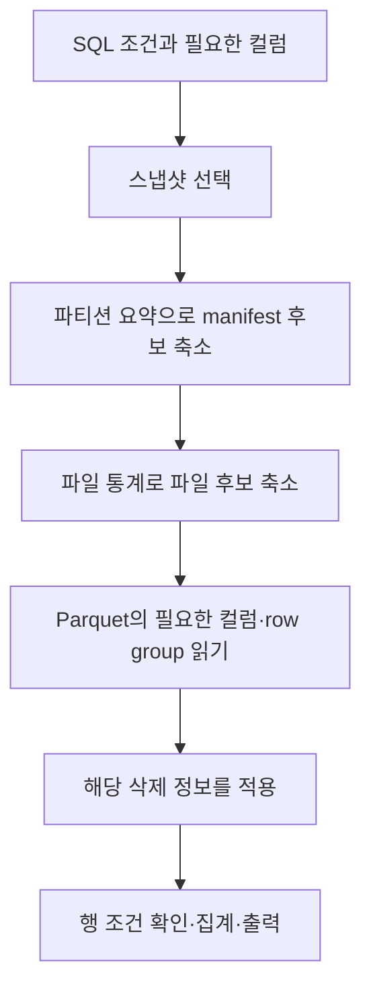
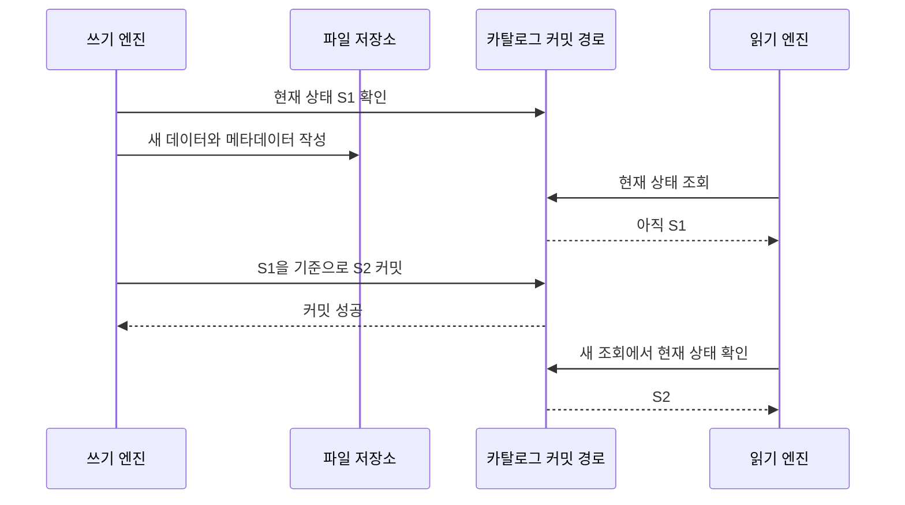
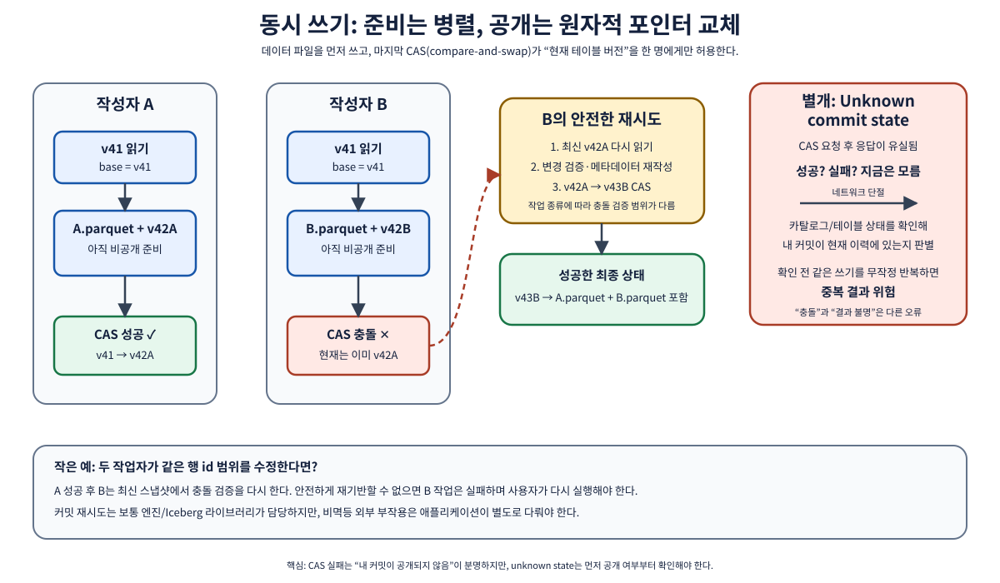

# 02. 읽기·쓰기·동시성

[이 책의 목차](README.md) · [이전 장](01-metadata-and-files.md)

이 장에서는 `SELECT`와 `INSERT`를 내부 작업으로 펼친다. 엔진은 계산을 수행하고 Iceberg의 파일·메타데이터 규칙과 카탈로그의 커밋 경로를 사용한다.

## 1. 쿼리 계획은 실행하기 전에 할 일을 정한다

다음 요청을 생각한다. 실제 실행 환경은 [09장](09-local-lab.md)에서 준비한다.

```sql
SELECT order_id, amount
FROM orders
WHERE ordered_at >= TIMESTAMP '2026-10-02 00:00:00'
  AND ordered_at < TIMESTAMP '2026-10-03 00:00:00'
  AND amount >= 14000;
```

**쿼리 계획(query plan)**은 어떤 파일을 읽고 어떤 컬럼과 조건을 적용하며 어떤 계산을 수행할지 정한 계획이다. **스캔(scan)**은 입력 데이터를 읽는 작업이다. 모든 파일과 컬럼을 읽은 다음 조건을 적용할 수도 있지만 필요 없는 일을 미리 줄이는 편이 좋다.

**Pruning**은 쿼리에 맞을 가능성이 없는 후보를 제외하는 것이다. 정답 행을 메타데이터만으로 항상 찾는다는 뜻은 아니다. 보수적으로 “절대로 조건에 맞지 않는 것”을 버리는 것이 기본이다.

| 단계 | 사용하는 정보 | 제외할 수 있는 예 |
| --- | --- | --- |
| Manifest list | manifest의 파티션 요약 | 10월 1일 파일들만 있는 manifest |
| Manifest | 각 파일의 partition tuple·컬럼 통계 | `amount` 최대가 9000인 파일 |
| 데이터 파일 내부 | Parquet row group의 통계·컬럼 구조 | 해당 row group 전체가 금액 조건 밖 |
| 행 평가 | 실제 컬럼 값 | 후보 파일 안에서 금액 13000인 행 |

**Row group**은 Parquet에서 여러 행의 컬럼 묶음을 구성하는 단위다. **Predicate pushdown**은 필터 조건을 더 아래의 데이터 읽기 단계로 전달하는 것이다. **Projection**은 필요한 컬럼을 골라 읽는 것이다. 위 쿼리는 지역 이름을 출력하지 않으므로 불필요한 컬럼 바이트를 줄일 여지가 있다.



화살표는 논리적 단계다. 특정 엔진이 삭제 필터와 행 필터를 실제로 어느 코드 순서에서 적용하는지는 최적화에 따라 달라질 수 있다. 최종 결과에는 둘 다 올바르게 반영되어야 한다.

## 2. 최소·최대가 알려 주는 것과 알려 주지 않는 것

세 파일의 `amount` 통계가 다음과 같다고 하자.

| 파일 | 최소 | 최대 | `amount >= 14000` 후보 여부 |
| --- | --- | --- | --- |
| A | 10000 | 20000 | 읽어 볼 필요가 있다 |
| B | 7000 | 7000 | 전부 제외할 수 있다 |
| C | 12000 | 16000 | 읽어 볼 필요가 있다 |

A가 후보라는 사실은 파일의 모든 행이 조건에 맞는다는 뜻이 아니다. A가 `[10000, 20000]`이면 20000만 남는다. `[10000, 13000, 20000]`이어도 최소·최대는 같아 내부 행을 추가로 확인해야 한다.

통계가 생략되거나 문자열 경계가 잘리거나 null·NaN에 별도 규칙이 있으면 더 보수적으로 판단한다. 통계는 색인처럼 성능에 도움을 주지만 정확한 행 결과를 대신하는 만능 인덱스로 생각하지 않는다.

파티션 변환으로 하루를 골라도 원래 시각 조건은 남을 수 있다. 오후 3시부터 4시까지 조회하면 “그날 파일”로 후보를 줄일 수 있지만 그날의 모든 행을 답으로 반환할 수는 없다. 남겨서 행에 적용할 조건을 **residual predicate**라고 한다.

## 3. INSERT는 파일 작성과 공개를 나눈다

현재 S1에 A가 있다. 새 주문 104를 B에 쓴다.

1. 엔진이 S1의 스키마·파티션 명세를 확인한다.
2. 작업자들이 새 데이터를 파일 B에 기록한다.
3. 새 파일을 설명하는 manifest와 manifest list를 준비한다.
4. 새로운 table metadata를 준비한다.
5. 카탈로그의 커밋 경로로 새 상태를 원자적으로 공개한다.
6. 커밋을 확인한 독자는 S2의 A와 B를 읽는다.

**커밋(commit)**은 새 상태를 테이블의 유효한 상태로 확정하는 작업이다. 바이트를 먼저 만들고 참조를 나중에 공개하므로, 파일 작성만 성공하고 커밋이 실패할 수 있다.



그림의 “카탈로그 커밋 경로”는 구현별 원자적 상태 변경을 뜻한다. HadoopCatalog는 파일시스템의 원자적 rename에 의존하는 등의 차이가 있다. REST 서비스가 반드시 동일한 DB 컬럼을 갱신한다는 뜻은 아니다.

## 4. 왜 전체 작업 내내 테이블을 잠그지 않는가

Iceberg는 **낙관적 동시성 제어(optimistic concurrency control)**를 사용한다. 보통 변경을 준비하는 긴 시간 동안 독자와 모든 작성자를 하나의 전역 잠금으로 막지 않는다. 대신 커밋할 때 기준 상태가 유효한지, 충돌이 있는지 확인한다.

**CAS(compare-and-swap)**는 “값이 내가 예상한 값일 때만 새 값으로 바꾼다”는 원자적 연산의 개념이다. 모든 카탈로그의 API 이름이 CAS인 것은 아니지만, 옛 상태를 기준으로 새 상태를 공개할 때 경쟁을 다루는 원리를 이해하는 데 도움이 된다.



두 작성자 X와 Y가 S1에서 각각 B와 C를 만들었다고 하자.

| 시점 | X | Y | 현재 상태 |
| --- | --- | --- | --- |
| 1 | S1 읽기 | S1 읽기 | S1: A |
| 2 | B 작성 | C 작성 | S1: A |
| 3 | S1→S2 커밋 성공 | 준비 중 | S2: A+B |
| 4 | 완료 | S1 기준 커밋 거절 | S2: A+B |
| 5 | 완료 | S2 새로 읽기·검증·재시도 | 성공 시 S3: A+B+C |

Append처럼 합칠 수 있는 변화는 새 상태를 읽고 일부 준비물을 재사용해 재시도할 수 있다. 같은 행을 서로 수정하거나 한쪽이 파일을 다시 쓰는 경우에는 충돌 검증이 필요하다. 모든 실패를 “한 번 더 실행하면 자동 해결”로 해석하지 않는다.

## 5. 메타데이터 커밋 재시도와 작업 전체 재실행은 다르다

**커밋 재시도**는 이미 준비한 변경을 최신 상태에 다시 적용해 유효한 새 커밋을 만드는 과정이다. 엔진·라이브러리가 수행하고 재사용 여부는 작업에 따라 달라진다.

**작업 재실행**은 입력부터 다시 읽고 파일을 다시 만드는 것이다. 이전 작업이 이미 커밋되었다면 같은 이벤트를 다시 넣어 중복할 수 있다. 트랜잭션이 원자적이라는 사실만으로 사용자 요청의 재실행이 멱등해지지는 않는다.

**멱등성(idempotency)**은 같은 요청을 반복해도 원하는 최종 효과가 한 번 적용한 것과 같도록 하는 성질이다. 주문 이벤트에 고유 ID를 부여하고 처리 기록·deduplication·checkpoint·MERGE 정책을 연결할 수 있다. 어느 방법이 필요한지는 입력 경로와 엔진의 보장을 함께 살펴야 한다.

## 6. 성공·실패·성공 여부 불확실을 구별한다

네트워크 응답이 사라지면 서버가 성공했는지 클라이언트는 모를 수 있다.

```text
요청 전송 → 서버 커밋 성공 → 응답 전송 중 연결 끊김
클라이언트가 본 것: timeout
실제 테이블: 새 스냅샷이 이미 존재할 수 있음
```

이 경우 새 파일을 즉시 지우면 이미 성공한 스냅샷이 참조하는 파일을 망가뜨릴 수 있다. 먼저 최신 테이블 상태와 작업 식별 정보로 커밋 결과를 확인한다. Iceberg의 상태 확인·재시도 설정과 예외 분류를 활용하고, 결과가 불확실한 작업을 단순한 실패로 처리하지 않는다.

| 관찰 | 의미 | 대응 방향 |
| --- | --- | --- |
| 커밋 성공을 확인 | 새 상태가 확정됨 | 작업 완료 기록 |
| 검증 충돌을 확인 | 해당 변경을 그대로 공개할 수 없음 | 입력·격리 요구에 따라 재계획 |
| 응답 유실·상태 확인 불가 | 성공 여부가 불확실함 | 상태 확인·중복 방지, 성급한 파일 삭제 금지 |

## 7. 격리 수준은 구체적 작업에 대입한다

**Snapshot isolation**은 작업이 읽은 스냅샷을 기준으로 일관된 입력을 사용하는 방향이고, **serializable**은 결과가 어떤 직렬 실행과 일치하도록 더 강한 충돌 검증을 하는 방향이다. Iceberg 엔진의 DELETE·UPDATE·MERGE에는 지원되는 격리 수준 설정이 있다.

예를 들어 “현재 Seoul 주문 전체를 취소”하는 작업과 “새 Seoul 주문 추가”가 경쟁하면 새 주문도 취소되어야 하는지 먼저 업무 의미를 정해야 한다. 이미 읽은 파일만 검사하는 것과 조건에 맞는 동시 새 데이터를 충돌로 보는 것은 다른 정책이다.

구체적인 설정 이름과 기본값은 [공식 설정 문서](https://iceberg.apache.org/docs/latest/configuration/)에서 해당 버전을 확인한다. “Iceberg는 항상 모든 작업에서 모든 DB의 serializable과 동일하다”거나 “엔진을 바꿔도 격리 동작이 자동 동일하다”는 가정을 피한다.

## 8. 확인 질문과 해설

**질문.** 파일 B가 저장되어 있는데 조회에 나타나지 않는다. 무엇을 확인할까?

**해설.** 현재 snapshot과 manifests의 참조, 커밋 결과, 조회 중인 catalog/namespace/branch, 엔진 캐시 갱신 여부를 확인한다. 폴더에서 보인다는 사실만으로 입력 성공을 판정하지 않는다.

**질문.** 두 append 작업이 경쟁하면 먼저 넣은 파일이 마지막 작성자에게 사라져도 되는가?

**해설.** 이전 상태를 무조건 덮어쓰면 lost update가 된다. 기준 상태 검증과 유효한 변경의 재적용으로 다뤄야 한다.

**질문.** `amount` 최소 10000, 최대 20000인 파일에는 14000원이 반드시 있는가?

**해설.** 아니다. 그 범위의 행이 있을 가능성만 남는다. 통계에서 존재 여부를 완전히 추론할 수 없다.

## 근거와 더 읽기

원자적 교체와 동시성 설명은 [Reliability](https://iceberg.apache.org/docs/latest/reliability/), 스캔 필터는 [Performance](https://iceberg.apache.org/docs/latest/performance/), 충돌과 재시도 속성은 [Configuration](https://iceberg.apache.org/docs/latest/configuration/)을 확인한다. 표의 실행 순서와 금액은 교육용 예시다.

[다음: 03. 스키마와 파티션의 진화](03-schema-and-partition-evolution.md)
