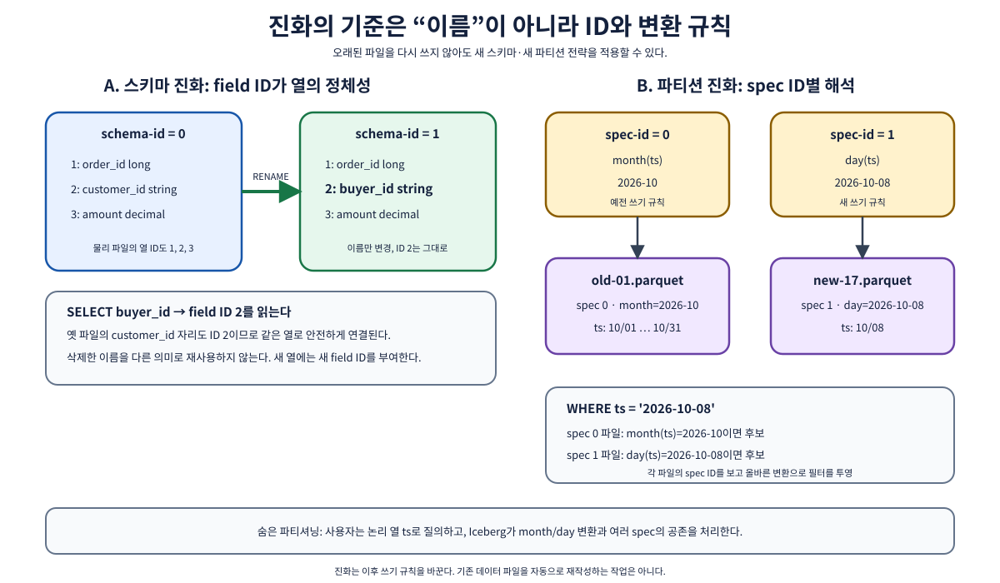
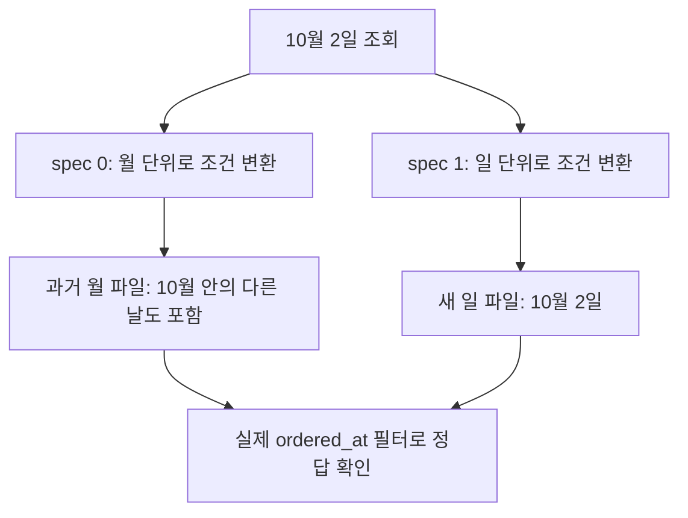

# 03. 스키마와 파티션의 진화

[이 책의 목차](README.md) · [이전 장](02-reads-writes-and-commits.md)

**Evolution, 진화**는 테이블을 계속 사용하면서 구조나 저장 규칙을 변경하는 것이다. 모든 변화를 무조건 메타데이터만으로 해결하는 것이 아니라, 안전하게 바꿀 수 있는 범위와 실제 파일 재작성이 필요한 범위를 나눈다.



## 1. 컬럼 이름보다 안정적인 식별자가 필요하다

현재 스키마가 다음과 같다고 하자. 번호는 교육용이다.

| Field ID | 이름 | 타입 |
| --- | --- | --- |
| 1 | order_id | long |
| 2 | ordered_at | timestamp |
| 3 | region | string |
| 4 | amount | long |

**Field ID**는 필드를 구별하는 고유 번호다. 컬럼 이름을 바꾸거나 순서를 바꿔도 같은 ID를 유지하면 같은 의미의 필드로 연결할 수 있다. 이 점은 과거 파일과 현재 스키마를 연결할 때 중요하다.

다음은 Iceberg를 지원하는 Spark SQL의 예다. 전체 환경과 실행 순서는 [09장](09-local-lab.md)을 따른다.

```sql
ALTER TABLE local.lab.orders RENAME COLUMN region TO shipping_region;
ALTER TABLE local.lab.orders ADD COLUMN region STRING;
```

결과의 의미는 다음과 같다.

| Field ID | 현재 이름 | 과거 파일의 값 |
| --- | --- | --- |
| 3 | shipping_region | 과거의 region 값을 읽는다 |
| 5 | region | 과거 파일에는 새 필드 값이 없다 |

새 `region`의 ID 5는 예시다. 실제 할당 번호는 그 테이블에서 사용한 ID에 따라 달라진다. 기본적인 optional 필드의 과거 값은 null로 읽을 수 있다. v3의 initial default를 사용하는 경우에는 다른 규칙이 적용되므로 [06장](06-format-v3.md)을 참고한다.

이름만 비교하면 과거 `region`을 새 `region`으로 잘못 읽을 수 있다. Field ID는 이런 재사용 오류를 피한다. 삭제한 필드의 ID를 같은 이름의 새 컬럼에 재사용하지 않는다.

## 2. 순서 변경·삭제·타입 변경

스키마에서 컬럼 순서를 바꿔도 파일 전체를 다시 쓰지 않고 현재 projection을 바꿀 수 있다. 컬럼을 삭제해도 이전 파일의 바이트가 즉시 제거되는 것은 아니다. 논리 스키마 변경과 개인정보 물리 제거의 차이는 [11장](11-streaming-security-and-operations.md)에서 다룬다.

타입 변경은 기존 값을 손상하지 않는 지원 범위 안에서 수행한다. 대표적인 widening은 `int → long`, `float → double`, 같은 scale에서 decimal precision 증가다. 예를 들어 `decimal(10,2) → decimal(12,2)`는 소수점 두 자리를 유지하면서 전체 자릿수 범위를 넓힌다.

| 변경 | 이해할 점 |
| --- | --- |
| `int → long` | 기존 정수를 표현할 더 넓은 범위를 제공 |
| `float → double` | 기존 float 값을 더 넓은 부동소수점 타입으로 읽는 지원 경로 |
| `decimal(10,2) → decimal(12,2)` | scale 유지·precision 확대 |
| `string → int` | 모든 문자열이 정수인 것이 아니므로 일반 widening과 다름 |
| timestamp 의미 변경 | 시각의 zone·precision 의미와 엔진 지원까지 확인 필요 |

복잡한 타입에도 ID가 있다. **Struct**는 여러 필드의 묶음, **list**는 요소의 순서 있는 모음, **map**은 키와 값의 모음이다. 중첩 필드를 변경할 때도 ID와 안전한 evolution 규칙을 따른다. 이름과 파일의 컬럼 위치를 임의로 맞추는 변환을 만들지 않는다.

외부 Parquet를 등록하거나 ID가 없는 파일을 읽는 경로는 name mapping과 엔진의 import 지원을 별도로 확인한다. 단순히 `.parquet` 확장자라는 이유로 기존 데이터를 모든 스키마에 안전하게 연결할 수는 없다.

## 3. 파티션은 데이터를 묶는 규칙이다

**파티션(partition)**은 정해진 값이나 변환 결과로 데이터를 묶는 방식이다. 주문 시각에서 날짜를 계산해 같은 날짜의 데이터를 묶으면 하루 범위의 조회가 관련 없는 날짜 파일을 제외하는 데 도움이 된다.

전통적인 폴더 기반 예시는 다음과 같다.

```text
orders/date=2026-10-01/...
orders/date=2026-10-02/...
```

Iceberg에서는 폴더 이름을 사용자가 필터해야만 파티션을 찾는 구조에 의존하지 않는다. 원래 컬럼의 필터와 partition transform을 연결해 계획한다. 이 특성을 **hidden partitioning, 숨겨진 파티셔닝**이라고 부른다.

```sql
CREATE TABLE local.lab.partition_example (
    order_id BIGINT,
    ordered_at TIMESTAMP,
    region STRING,
    amount BIGINT
) USING iceberg
PARTITIONED BY (days(ordered_at));
```

Spark SQL의 `days(ordered_at)` 표기와 명세에서 변환을 부르는 이름이 다를 수 있다. 엔진별 문법을 확인한다. 사용자는 아래처럼 원래 시각을 조건으로 쓰고, 엔진이 날짜 변환과 연결한다.

```sql
SELECT * FROM local.lab.partition_example
WHERE ordered_at >= TIMESTAMP '2026-10-02 00:00:00'
  AND ordered_at < TIMESTAMP '2026-10-03 00:00:00';
```

## 4. 파티션 변환을 작은 값으로 이해한다

| 변환 종류 | 교육용 입력과 결과 | 목적과 주의점 |
| --- | --- | --- |
| Identity | `region=Seoul → Seoul` | 원래 값으로 묶음, 값 종류가 너무 많으면 부담 |
| 시간 변환 | `2026-10-02 09:00 → 해당 일` | 날짜·월·시간 단위로 후보 축소 |
| Bucket | `order_id → 해시 값 modulo N` | 여러 묶음에 분배, 연속 주문 번호의 구간과 다름 |
| Truncate | 문자열 `Seoul → 앞의 지정 길이` | prefix·범위 기반 묶음, 타입별 규칙 확인 |
| Void | 모든 입력에 null partition 값 | evolution에서 기존 필드 자리 처리 등 |

**해시(hash)**는 값을 정해진 계산으로 다른 수에 매핑하는 방법이다. `bucket(16, order_id)`는 주문 번호를 16개 버킷 중 하나에 배치한다. 실제 Iceberg hashing은 명세의 타입별 인코딩과 알고리즘을 따른다. Python 기본 `hash()`로 재현하면 실행마다 달라지거나 규칙이 달라질 수 있다.

`order_id BETWEEN 100 AND 200`이 자동으로 한 버킷만 읽는다는 뜻은 아니다. 연속 ID는 해시 버킷에 흩어진다. 파티션을 설계할 때는 실제 쿼리 조건이 어떤 종류인지 먼저 본다.

## 5. 파티션 명세를 바꿔도 과거 파일이 남는다

처음에는 월별로 묶고 나중에는 일별로 묶는다고 하자. **Partition spec**은 어떤 source field를 어떤 transform으로 묶는지 설명하는 명세이고, **spec ID**는 이 명세를 구별한다.

```text
spec 0: month(ordered_at)
  old-A.parquet → 2026년 10월

spec 1: day(ordered_at)
  new-B.parquet → 2026년 10월 2일
```

새 쓰기는 새 기본 spec을 사용하고 과거 파일은 자신이 기록된 spec을 유지한다. 10월 2일 조회 시 과거 월 파티션은 더 넓은 후보가 된다. 새 일 파티션은 더 정밀하게 제외할 수 있다. 최종 행 필터로 정확한 결과를 만든다.



메타데이터 변경만으로 partition evolution이 가능하다는 말은 **과거 파일의 물리 배치가 자동으로 새 배치로 바뀐다**는 뜻이 아니다. 새 배치의 성능을 과거 데이터에도 적용하려면 별도 rewrite를 검토한다. rewrite는 비용·충돌·보존 영향을 동반한다.

## 6. 정렬과 파티션은 서로 다른 축이다

**Sort order**는 파일에 쓰는 행을 어떤 순서로 정렬할지 표현한다. 파티션은 묶음을 정하고, 정렬은 그 묶음 안에서 가까운 값을 모을 수 있다.

예를 들어 날짜로 파티션하고 그 안에서 `order_id`를 정렬하면 파일마다 ID 최소·최대 범위가 더 좁아질 수 있다. 반대로 여러 파일마다 모든 ID 범위가 섞이면 파일 통계로 제외하기 어렵다.

```text
섞인 두 파일
A: [101, 999, 102, 998] → min 101, max 999
B: [103, 997, 104, 996] → min 103, max 997

정렬해 재배치한 두 파일
A': [101, 102, 103, 104] → min 101, max 104
B': [996, 997, 998, 999] → min 996, max 999
```

`order_id=102` 쿼리에서 A'만 후보로 남길 여지가 있다. 하지만 sort order 선언이 모든 과거 파일을 즉시 정렬하지 않으며, 모든 엔진·쓰기 경로가 같은 정렬 동작을 구현한다고 가정하지 않는다. 출력 행 순서가 필요하면 쿼리의 `ORDER BY`를 사용한다.

## 7. 파티션을 잘게 나누면 항상 빨라지는가

하루 100 MiB 데이터에 장치 ID 백만 개를 파티션 키로 넣으면 파티션마다 작은 파일이 생기기 쉽다. 필터에 맞는 파티션 수는 줄어도 계획·파일 열기·작업 예약 비용이 커질 수 있다.

먼저 다음을 정리한다.

1. 자주 쓰는 조회 조건이 날짜·지역·ID 중 무엇인가?
2. 하루 입력량과 파티션별 분포가 얼마인가?
3. 현재 파일 크기와 파일 수가 어떤가?
4. 늦게 들어오는 데이터가 과거 파티션에 얼마나 쓰이는가?
5. 변경 전후에 계획 시간과 실제 읽기 바이트가 줄었는가?

균등하지 않은 분포를 **skew, 치우침**이라고 한다. 모든 지역이 같은 크기라는 가정은 실제 로그나 주문에서는 쉽게 깨진다. [10장](10-performance-and-maintenance.md)에서 측정으로 연결한다.

## 8. 확인 질문과 해설

**질문.** `region`을 삭제한 뒤 같은 이름으로 다시 추가하면 과거 값을 다시 읽는가?

**해설.** 새 필드에는 새 ID가 부여된다. 이전 field와 자동 동일한 필드로 취급하지 않는다.

**질문.** 월에서 일로 파티션을 바꿨는데 과거 쿼리가 여전히 많은 바이트를 읽는다. 왜 가능한가?

**해설.** 과거 파일은 과거 spec과 배치를 유지한다. 새 spec 변경과 과거 파일 rewrite는 다른 작업이다.

**질문.** 테이블을 주문 번호로 정렬하면 SELECT 결과도 항상 그 순서인가?

**해설.** 아니다. 파일 저장 순서와 SQL 결과 순서는 별개다. 결과 순서는 `ORDER BY`로 요구한다.

## 근거와 더 읽기

공식 [Evolution](https://iceberg.apache.org/docs/latest/evolution/), [Partitioning](https://iceberg.apache.org/docs/latest/partitioning/), [Spark DDL](https://iceberg.apache.org/docs/latest/spark-ddl/), [명세의 컬럼 projection과 partition transforms](https://iceberg.apache.org/spec/)를 참고한다. 실제 엔진의 문법과 지원은 실행 버전에 맞춰 확인한다.

[다음: 04. 스냅샷과 시간 여행](04-snapshots-and-history.md)
