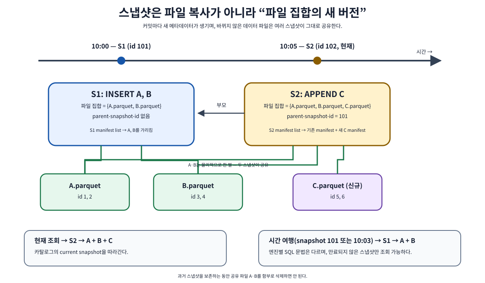
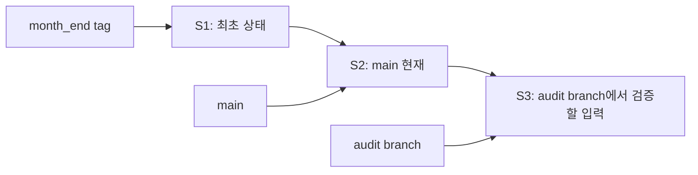

# 04. 스냅샷·시간 여행·브랜치

[이 책의 목차](README.md) · [이전 장](03-schema-and-partition-evolution.md)

이 장에서는 “어제 읽었던 데이터를 다시 읽는다”를 실제 참조와 보존 조건으로 해석한다. 스냅샷은 파일의 복사본을 매번 만드는 방식과 다르다.



## 1. 작은 연표를 만든다

교육용 상태가 다음과 같다고 하자. 실제 snapshot ID는 크거나 임의로 보이는 식별자이며 1씩 증가한다고 가정하지 않는다.

| 상태 | Snapshot ID | Sequence number | 파일 집합 | 행 수 | 의미 |
| --- | --- | --- | --- | --- | --- |
| S1 | 9001 | 1 | A | 3 | 최초 주문 입력 |
| S2 | 4127 | 2 | A+B | 4 | 주문 104 추가 |
| S3 | 7812 | 3 | A'+B | 3 | 주문 102 취소, COW 예시 |

A'는 A에서 주문 102를 제외하고 다시 쓴 파일이다. S1과 S2가 여전히 보존되면 A도 보존해야 한다. S3에 A가 없다는 이유로 삭제하면 시간 여행이 깨진다.

**Snapshot ID**는 스냅샷의 식별자, **sequence number**는 변경의 순서와 논리적 나이를 다루는 번호다. 큰 snapshot ID가 더 최신이라고 정렬하지 않는다. 생성 시각과 history·parent·sequence를 각각 목적에 맞게 본다.

## 2. 시간 여행은 읽을 스냅샷을 선택한다

**Time travel, 시간 여행**은 현재 상태 대신 보존된 특정 스냅샷이나 특정 시각에 대응하는 상태를 선택해서 읽는 기능이다. 다음은 Iceberg를 지원하는 Spark SQL의 예다. 표의 ID는 실제 테이블에 없으므로 실습에서는 조회한 값을 넣는다.

```sql
SELECT * FROM local.lab.orders VERSION AS OF 9001;
SELECT * FROM local.lab.orders
TIMESTAMP AS OF '2026-10-01 12:00:00';
```

ID 조회는 그 스냅샷을 직접 지정한다. 시간 조회는 엔진이 지원하는 시간 해석과 테이블 history를 이용해 해당 시점에 대응하는 스냅샷을 찾는다. 시각은 snapshot commit의 시간이지 `ordered_at` 컬럼의 업무 이벤트 시간과 동일하지 않다.

10월 1일 주문이 네트워크 지연 때문에 10월 3일 적재되었다면, 10월 2일 시점의 스냅샷에는 그 주문이 없을 수 있다. **Event time, 사건 시각**과 **commit time, 테이블 확정 시각**을 분리한다.

## 3. Metadata tables에서 역사를 관찰한다

Metadata table은 테이블 내부 정보를 SQL로 관찰하는 읽기 인터페이스다. 지원 이름·컬럼은 엔진과 버전에 따라 확인한다. Spark 예시는 다음과 같다.

```sql
SELECT snapshot_id, parent_id, committed_at, operation
FROM local.lab.orders.snapshots
ORDER BY committed_at;

SELECT made_current_at, snapshot_id, is_current_ancestor
FROM local.lab.orders.history
ORDER BY made_current_at;

SELECT * FROM local.lab.orders.refs;
```

`snapshots`는 보존된 스냅샷 정보를, `history`는 어떤 상태가 현재로 선택된 이력을, `refs`는 이름 있는 참조를 살펴보는 데 도움을 준다. rollback이나 branch가 있으면 “스냅샷의 생성 순서”와 “main이 현재로 선택한 순서”가 다를 수 있다.

`files`와 `all_data_files` 같은 메타데이터 테이블도 목적이 다르다. 현재 스냅샷의 파일, 여러 보존 스냅샷에서 등장하는 파일, 중복 엔트리 가능성을 구분한다. 집계 전에 테이블 정의를 확인한다.

## 4. Rollback은 파일을 과거 내용으로 덮어쓰는 것이 아니다

**Rollback**은 현재 참조를 보존된 과거 상태로 되돌리는 작업이다. Spark Iceberg procedures에는 rollback 경로가 있다. 설명용 명령의 ID는 실제 확인한 값으로 바꾸어야 한다.

```sql
CALL local.system.rollback_to_snapshot(
    table => 'lab.orders',
    snapshot_id => 9001
);
```

실습용 테이블에서만 사용한다. 운영에서 rollback은 이후 정상 입력이 기본 조회에서 사라지는 효과를 낼 수 있다. 예를 들어 잘못 수정한 주문 102만 되돌리려는데 S1으로 이동하면 정상적으로 추가한 주문 104도 기본 상태에서 빠진다. 필요한 복구가 전체 상태 선택인지 특정 레코드 보정인지 먼저 정한다.

Rollback 가능한 ancestry 조건, 임의 스냅샷 선택과의 차이 등은 해당 procedure 문서를 확인한다. snapshot expiration으로 과거 참조와 파일이 사라졌다면 metadata에서 번호만 알아도 복구할 수 없다.

## 5. Branch와 tag는 이름 있는 스냅샷 참조다

**Branch, 브랜치**는 새 커밋으로 진행할 수 있는 이름 있는 참조다. **Tag, 태그**는 특정 스냅샷을 가리키는 이름 있는 참조로 고정된 기준을 보관하는 용도다. 업데이트·교체 가능 동작은 API와 정책을 확인한다.

Git과 이름이 비슷하지만 의미를 그대로 가져오지 않는다. Iceberg의 branch는 한 테이블의 스냅샷 참조이고, 모든 테이블과 프로그램 코드를 함께 버전 관리하는 Git 저장소와 같은 대상이 아니다. 테이블 스키마는 테이블 수준에서 관리되므로 branch마다 독립된 schema history가 있다고 가정하지 않는다.



화살표 `S1 → S2 → S3`는 부모 관계, 이름에서 스냅샷으로 향하는 화살표는 참조다. 모든 branch가 자동 병합되는 것은 아니다.

## 6. Write-Audit-Publish를 실제 단계로 본다

**WAP(Write-Audit-Publish)**는 쓰기, 검사, 공개를 나누는 패턴이다.

1. 입력을 검증용 branch에 쓴다.
2. 행 수, null, 중복, 금액 합계, schema 조건을 확인한다.
3. 통과한 상태를 지원되는 publish 경로로 main에 반영한다.
4. 실패한 상태는 진단용으로 잠시 보관하거나 정해진 정책에 따라 정리한다.

기본 조회가 main을 사용하면 검증용 상태는 아직 일반 사용자에게 공개되지 않는다. 하지만 누가 그 branch를 조회할 수 있는지까지 자동 숨겨 주는 개인정보 보호 장치는 아니다. 별도 권한을 설정한다.

**Fast-forward**는 현재 참조가 대상의 조상일 때 참조를 앞으로 이동하는 방식이다. main에 다른 변경이 들어와 ancestry 조건이 깨졌다면 무조건 앞으로 옮기지 않는다. 지원되는 검증·재계획·publish 방법을 선택해야 한다. Git처럼 임의의 행 충돌을 자동 병합한다고 설명하지 않는다.

## 7. 보존은 스냅샷과 파일에 비용을 남긴다

스냅샷이 파일을 공유하므로 append만 하는 초기 예시에서는 추가 메타데이터 비용이 중심일 수 있다. 하지만 update·delete·compaction이 데이터를 다시 쓰면 과거 스냅샷이 이전 파일을 붙잡는다.

```text
현재 파일 합계: 100 GiB
rewrite로 새 파일 100 GiB 작성
과거 참조가 옛 파일 100 GiB 유지
이 기간의 데이터 파일 합계: 약 200 GiB + 메타데이터
```

이것은 전체 파일을 다시 쓴 가상의 단순 계산이다. 일부만 다시 쓰면 그 양만 늘고 압축률·파일 분할도 달라진다. 디스크 비용을 현재 테이블 크기 하나로만 산정하지 않는다.

Branch·tag는 snapshot expiration에 영향을 주는 retention 규칙을 갖는다. “오래된 스냅샷을 모두 지우면 된다”는 정책보다 참조, 장시간 독자, 복구 목표, 법적 보존을 함께 봐야 한다. 구체적인 정리는 [10장](10-performance-and-maintenance.md)에서 다룬다.

## 8. 연구 재현성에는 스냅샷 외의 정보도 필요하다

논문 실험을 다시 실행하려면 다음을 묶어 기록한다.

| 기록 | 이유 |
| --- | --- |
| catalog·namespace·table UUID·snapshot ID | 같은 이름으로 재생성된 다른 테이블과 구별 |
| 입력의 보존 정책과 실제 접근성 | 번호가 남아도 파일이 사라지면 재현 불가 |
| SQL·프로그램 commit·엔진 버전 | 같은 데이터에 다른 코드·엔진은 다른 결과 가능 |
| timezone·locale·random seed | 시각·문자·샘플링 해석 재현 |
| 실행 자원·설정·측정 조건 | 성능 비교에 필요 |

Row lineage와 업무 이벤트 추적까지 필요한지는 별도의 요구다. Iceberg snapshot이 전체 데이터 처리 파이프라인의 모든 원천과 변환을 자동 기록한다는 뜻은 아니다.

## 9. 확인 질문과 해설

**질문.** Snapshot ID 9001과 4127 중 9001이 최신인가?

**해설.** ID 크기로 최신성을 판단하지 않는다. 위 예시에서는 4127이 이후 상태다.

**질문.** 10월 1일 사건이면 10월 1일 time travel 결과에 반드시 존재하는가?

**해설.** 아니다. 적재·커밋 시점이 이후일 수 있다.

**질문.** 현재에서 참조하지 않는 A 파일을 삭제해도 안전한가?

**해설.** 보존된 스냅샷·branch·tag에서 참조할 수 있다. 지원되는 retention·정리 도구를 사용한다.

## 근거와 더 읽기

공식 [Spark queries](https://iceberg.apache.org/docs/latest/spark-queries/), [Branching and tagging](https://iceberg.apache.org/docs/latest/branching/), [Spark procedures](https://iceberg.apache.org/docs/latest/spark-procedures/), [Maintenance](https://iceberg.apache.org/docs/latest/maintenance/)가 기능과 조건을 설명한다.

[다음: 05. 포맷 v1과 v2](05-format-v1-v2.md)
