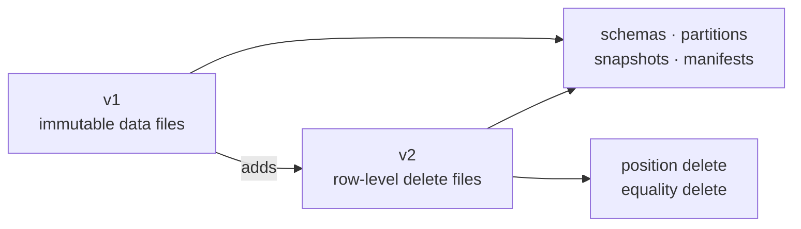
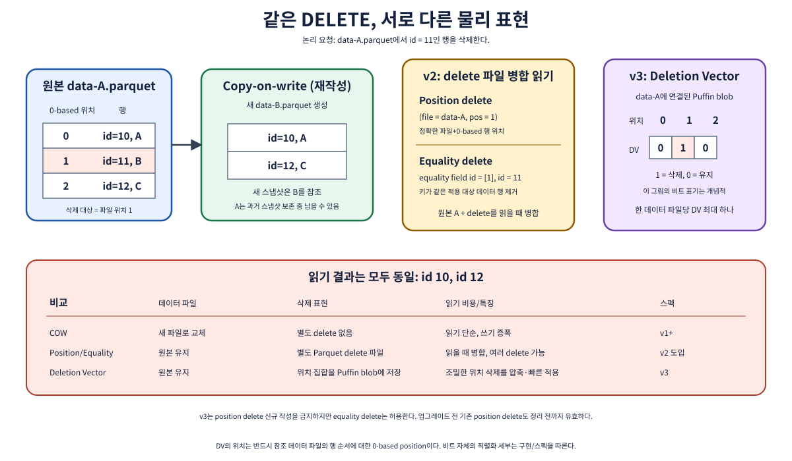
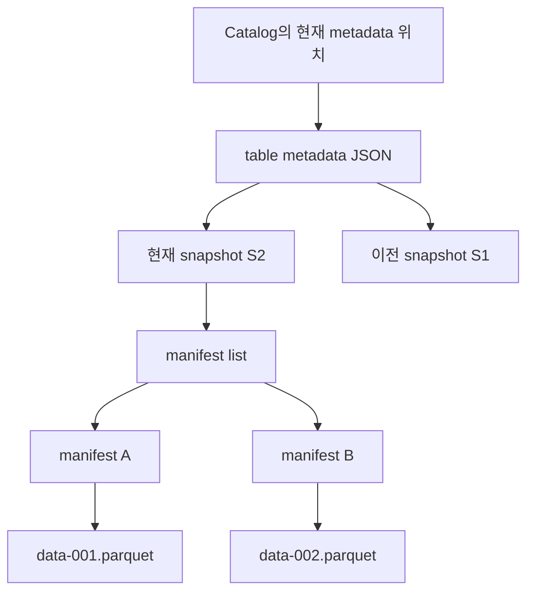
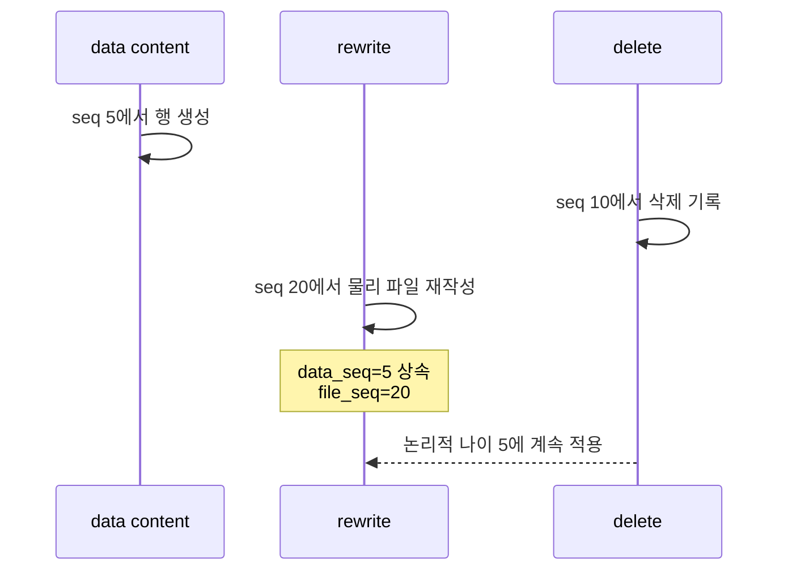
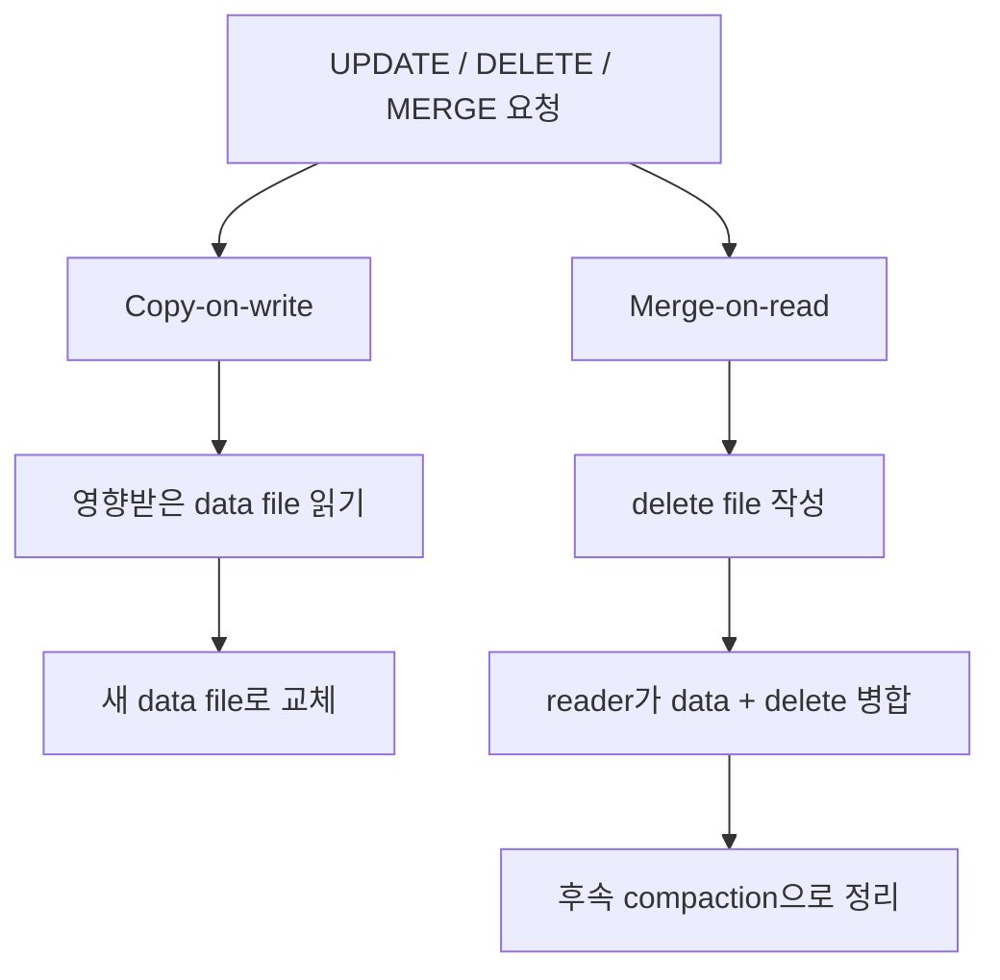

# 05. 포맷 v1과 v2: 스냅샷 테이블에서 행 단위 삭제까지

[← 이 책 목차](README.md)

작성·문헌 확인일: **2026-10-08**

이 장의 목표는 “v1은 옛날 포맷, v2는 새 포맷”처럼 외우는 것이 아니다. v1만으로도 이미 스키마 진화, 파티션 진화, 스냅샷, time travel을 갖춘 완전한 분석 테이블을 만들 수 있다. v2가 추가한 핵심은 **기존 데이터 파일을 즉시 다시 쓰지 않고도 행을 삭제했다고 표현하는 delete file**이다. 아래 SQL은 엔진마다 문법과 지원 범위가 다르므로, 실행 명령이 아니라 의미를 설명하는 의사 코드로 읽는다.

공식 기준은 [Iceberg Table Spec의 format versioning](https://iceberg.apache.org/spec/#format-versioning), [manifest](https://iceberg.apache.org/spec/#manifests), [scan planning](https://iceberg.apache.org/spec/#scan-planning)이다.





*그림 05-1. 두 delete 방식은 모두 원본 데이터 파일을 곧바로 고치지 않는다. position delete는 파일과 행 위치를, equality delete는 열 ID와 값의 일치를 사용한다.*

## 1. 먼저 table format과 file format을 구분한다

Parquet, Avro, ORC는 행과 열을 파일에 어떻게 기록할지 정한다. Iceberg는 어떤 데이터 파일이 현재 테이블에 속하고, 어떤 스키마와 파티션 규칙을 쓰며, 어떤 스냅샷이 현재인지 정한다. 따라서 `format-version=2`는 “Parquet v2로 저장한다”는 뜻이 아니다.

| 층 | 묻는 질문 | 예 |
| --- | --- | --- |
| 데이터 파일 형식 | 한 파일 안의 값은 어떻게 배치되는가? | Parquet, Avro, ORC |
| Iceberg table format | 어떤 파일이 어느 스냅샷에 속하는가? | metadata JSON, manifest list, manifest |
| Iceberg format version | metadata와 행 변경을 어떤 규칙으로 표현하는가? | v1, v2, v3 |
| 쿼리 엔진 | 어떤 SQL과 기능을 실제로 실행하는가? | Spark, Flink, Trino 등 |

테이블의 format version이 같아도 엔진별 `UPDATE`, `DELETE`, `MERGE INTO` 지원은 다를 수 있다. 반대로 SQL 문장이 실행된다고 해서 그 엔진이 모든 v2 최적화와 maintenance 기능을 지원한다는 뜻도 아니다.

## 2. v1도 이미 완전한 스냅샷 테이블이다

v1은 immutable Parquet·Avro·ORC 파일을 추적하는 분석 테이블 포맷이다. “immutable”은 객체를 절대 삭제할 수 없다는 뜻이 아니라, 이미 게시된 데이터 파일의 바이트를 제자리에서 수정해 새 행 상태를 만들지 않는다는 뜻이다. 변경은 새 파일과 새 metadata를 쓴 뒤 새 스냅샷을 게시한다.



v1의 중요한 기능은 다음과 같다.

| 기능 | v1에서 가능한가? | 핵심 아이디어 |
| --- | --- | --- |
| 원자적 commit | 예 | 새 metadata를 만들고 catalog pointer를 교체한다 |
| snapshot과 time travel | 예 | 과거 snapshot의 manifest tree를 따라간다 |
| schema evolution | 예 | 이름 대신 안정적인 field ID로 열을 식별한다 |
| partition evolution | 예 | 파일마다 partition spec ID를 기록한다 |
| hidden partitioning | 예 | 사용자는 물리 파티션 열을 직접 관리하지 않아도 된다 |
| file/partition 통계 pruning | 예 | manifest metadata로 불필요한 파일을 건너뛴다 |
| delete file로 행 삭제 | 아니요 | 이것이 v2의 대표적 추가 기능이다 |

### 2.1 v1에서 행을 고치는 방법

v1에서 한 행만 바꾸려 해도 새 파일로 교체할 수 있다. 이를 흔히 copy-on-write 방식으로 이해한다.

```text
의사 절차 — 특정 고객의 등급을 silver에서 gold로 변경

1. 해당 행이 들어 있는 data-A.parquet을 읽는다.
2. 변경 결과를 data-B.parquet으로 쓴다.
3. 새 snapshot에서 data-A를 제거하고 data-B를 추가한다.
4. commit이 성공한 뒤 새 reader는 data-B를 본다.
5. 과거 snapshot reader는 보존 기간 동안 data-A를 볼 수 있다.
```

한 행 때문에 큰 파일을 다시 쓰면 write amplification이 생긴다. 그러나 읽을 때 별도 delete를 합칠 필요가 없고 결과 파일이 정리되어 있다는 장점도 있다.

## 3. v2는 두 종류의 delete file을 추가한다

v2에서는 data file과 별도로 delete file을 snapshot에 넣을 수 있다. reader는 data file을 읽은 뒤 적용 대상 delete를 합쳐 최종 행을 만든다. [v2 spec changes](https://iceberg.apache.org/spec/#version-2-row-level-deletes)는 position delete와 equality delete를 정의한다.

| 종류 | 저장하는 것 | 잘 맞는 상황 | 주의점 |
| --- | --- | --- | --- |
| position delete | data file 경로 + 0부터 시작하는 row position | 삭제할 실제 파일과 위치를 안다 | 파일 rewrite 뒤 위치가 바뀌면 새 관계로 정리해야 한다 |
| equality delete | equality field ID들과 삭제할 값 | 키 조건으로 많은 파일의 행을 논리 삭제한다 | 적용 sequence와 null/NaN 비교 규칙을 지켜야 한다 |

### 3.1 position delete 숫자 예제

`data-A.parquet`에 다음 다섯 행이 있다고 하자.

| position | order_id | amount |
| ---: | ---: | ---: |
| 0 | 101 | 10 |
| 1 | 102 | 20 |
| 2 | 103 | 30 |
| 3 | 104 | 40 |
| 4 | 105 | 50 |

position delete file에 아래 두 레코드가 있으면 position 1과 4를 제거한다.

```text
개념 레코드 — 실제 파일 schema의 전체 표현은 spec 참조

(file_path="data-A.parquet", pos=1)
(file_path="data-A.parquet", pos=4)
```

reader가 돌려주는 `order_id`는 `101, 103, 104`다. `order_id=102`를 기억해서 삭제한 것이 아니라, **그 파일의 두 번째 물리 행**을 가리켰다. 다른 파일의 position 1에는 적용되지 않는다.

### 3.2 equality delete 숫자 예제

equality field가 `customer_id`이고 delete file에 값 `7`이 있으면, 적용 대상 data file의 행 중 `customer_id=7`인 행을 모두 제거한다.

| file | position | customer_id | item | 결과 |
| --- | ---: | ---: | --- | --- |
| data-A | 0 | 7 | book | 삭제 |
| data-A | 1 | 8 | pen | 유지 |
| data-B | 0 | 7 | cup | 삭제 가능 |

마지막 행에 “가능”이라고 쓴 이유는 equality 값만 같다고 충분하지 않기 때문이다. partition과 sequence 적용 조건도 만족해야 한다. equality delete는 equality field ID를 사용하므로 열 이름 변경만으로 의미가 바뀌지 않는다.

## 4. data sequence와 file sequence는 역할이 다르다

모든 snapshot에는 sequence number가 있다. manifest entry에는 `data_sequence_number`와 `file_sequence_number`가 있다. 이름이 비슷하지만 삭제 적용에서 서로 바꾸어 쓰면 결과가 틀릴 수 있다. [manifest spec](https://iceberg.apache.org/spec/#manifests)은 delete pruning에 file sequence가 아니라 data sequence를 사용하라고 명시한다.

| 번호 | 나타내는 것 | rewrite 때 가능한 동작 | delete 적용 판단 |
| --- | --- | --- | --- |
| data sequence number | 파일 내용의 논리적 나이 | 내용이 그대로면 상속할 수 있다 | 사용한다 |
| file sequence number | 그 물리 파일이 table에 추가된 시점 | 새 파일이므로 증가할 수 있다 | 사용하면 안 된다 |

예를 들어 compaction이 sequence 20에서 data file을 다시 썼지만, 행 내용은 sequence 5에서 온 것이라 하자.

```text
원본 파일: data_seq=5,  file_seq=5
rewrite 파일: data_seq=5, file_seq=20
delete 파일: data_seq=10
```

delete가 sequence 5의 논리적으로 오래된 행에 적용되어야 한다면 `file_seq=20`을 보고 “delete보다 새 파일”이라 제외하면 삭제된 행이 부활한다. `data_seq=5`를 보아야 한다.



## 5. delete 적용 조건을 정확히 읽는다

[scan planning 규칙](https://iceberg.apache.org/spec/#scan-planning)을 초보자 관점으로 정리하면 다음과 같다.

| delete 종류 | data sequence 조건 | 추가 범위 조건 |
| --- | --- | --- |
| position delete | target data sequence ≤ delete data sequence | 같은 partition이며 참조 data file이 일치 |
| equality delete | target data sequence < delete data sequence | 같은 partition spec과 partition; unpartitioned equality delete는 전역 적용 가능 |

부등호 하나가 핵심이다. position delete는 `≤`이고 equality delete는 `<`다.

### 5.1 같은 commit에서 equality delete와 재삽입

sequence 30의 한 commit이 다음 두 작업을 함께 게시한다고 하자.

```text
개념 작업

equality delete: customer_id=7, data_seq=30
new data row:    customer_id=7, data_seq=30, status="active"
```

equality delete 적용 조건은 `target data_seq < delete data_seq`다. 새 행은 `30 < 30`을 만족하지 않으므로 삭제되지 않는다. 오래된 sequence 12의 `customer_id=7` 행은 `12 < 30`이므로 삭제된다. 이 규칙 덕분에 “기존 키를 지우고 새 상태를 삽입”하는 upsert 모양을 한 commit에 표현할 수 있다.

반면 position delete는 `target data_seq ≤ delete data_seq`이므로 동일 sequence의 대상 data file에도 적용될 수 있다. 실제 write 계획은 엔진 구현과 validation을 함께 확인한다.

### 5.2 partition 조건을 빠뜨리지 않는다

partitioned equality delete는 같은 partition의 data file에 적용한다. partition spec이 진화했을 때는 spec이 정의한 matching 규칙을 엔진이 정확히 구현해야 한다. unpartitioned equality delete는 table 전체에 적용할 수 있다. “키 값이 같으니 모든 partition에서 지우겠지”라고 가정하지 말고 delete file의 partition과 spec ID를 확인한다.

## 6. Copy-on-write와 merge-on-read를 선택한다

v2는 저장 표현을 제공하지만, 엔진이 행 변경을 어떻게 계획할지는 별도 선택이다.



| 판단 기준 | Copy-on-write가 유리할 수 있음 | Merge-on-read가 유리할 수 있음 |
| --- | --- | --- |
| 변경 빈도 | 드문 변경 | 빈번한 변경 |
| 읽기 지연 | 낮게 유지하고 싶음 | 추가 merge 비용을 감수 가능 |
| 쓰기 지연 | 큰 파일 rewrite 감수 | 빠르게 delete를 게시하고 싶음 |
| maintenance | rewrite 때 바로 정리 | 주기적 delete 정리와 compaction 필요 |
| 엔진 지원 | COW만 안정적일 수 있음 | MOR read/write 모두 검증 필요 |

“MOR가 항상 빠르다”는 결론은 틀리다. delete file이 누적되면 planning, metadata, bitmap/set lookup, 데이터 병합 비용이 증가할 수 있다. 읽기 중심 BI 테이블은 COW가 단순할 수 있고, 변경이 잦은 CDC 테이블은 MOR가 쓰기 비용을 줄일 수 있다. 실제 엔진 버전에서 다음을 측정한다.

```text
측정 체크리스트

- UPDATE/DELETE commit latency
- 쿼리 planning latency와 읽은 delete file 수
- data bytes 대비 delete bytes
- compaction 시간과 실패 복구
- time travel 결과와 concurrent write 충돌
```

## 7. 업그레이드는 capability와 implementation을 함께 본다

테이블을 v2로 올리면 v2 metadata를 이해하지 못하는 reader가 읽지 못할 수 있다. 업그레이드 전에 모든 writer, batch reader, streaming job, maintenance job, catalog integration의 지원 범위를 확인한다. “엔진 문서에 Iceberg 지원”이라는 한 줄보다 다음 행렬이 유용하다.

| 구성 요소 | v2 read | position delete read | equality delete read | v2 write | maintenance |
| --- | --- | --- | --- | --- | --- |
| Engine A 버전 X | 확인 | 확인 | 확인 | 확인 | 확인 |
| Engine B 버전 Y | 확인 | 확인 | 확인 | 확인 | 확인 |

업그레이드 자체는 스키마 변경이 아니며 기존 파일을 자동으로 모두 다시 쓰는 작업도 아니다. 하지만 format version을 올린 뒤에는 이전 reader와의 호환성이 달라질 수 있으므로 되돌리기 쉬운 설정 변경으로 생각하면 안 된다.

## 8. 확인 문제

### 문제 1

v1 테이블은 snapshot과 time travel을 지원하지 않는다. 맞는가?

<details>
<summary>해설</summary>

아니다. v1도 snapshot, manifest, schema evolution, partition evolution을 갖춘다. v2의 대표적 추가점은 row-level delete file이다.

</details>

### 문제 2

data file의 `data_seq=8`, `file_seq=40`이고 equality delete의 `data_seq=12`라면 sequence 조건은 만족하는가?

<details>
<summary>해설</summary>

만족한다. equality 조건은 target data sequence가 delete data sequence보다 작아야 하므로 `8 < 12`다. `file_seq=40`은 delete 적용 pruning에 사용하지 않는다. partition과 equality 값 조건도 별도로 만족해야 한다.

</details>

### 문제 3

같은 sequence 50에서 `id=9` equality delete와 새 `id=9` 행을 함께 commit하면 새 행도 삭제되는가?

<details>
<summary>해설</summary>

아니다. equality delete는 `target data_seq < delete data_seq`에만 적용된다. `50 < 50`은 거짓이다. 이전 sequence의 같은 키 행은 삭제되고 새 행은 남는다.

</details>

### 문제 4

MOR를 선택하기 전에 무엇을 확인해야 하는가?

<details>
<summary>해설</summary>

엔진이 해당 delete 유형을 읽고 쓰는지, delete 누적 시 읽기 비용이 어떤지, compaction과 장애 복구를 운영할 수 있는지 확인한다. SQL 문법 지원만으로 충분하지 않다.

</details>

## 9. 이 장의 공식 근거

- [Iceberg Table Spec: format versioning](https://iceberg.apache.org/spec/#format-versioning)
- [Iceberg Table Spec: version 2 row-level deletes](https://iceberg.apache.org/spec/#version-2-row-level-deletes)
- [Iceberg Table Spec: manifests와 sequence 상속](https://iceberg.apache.org/spec/#manifests)
- [Iceberg Table Spec: scan planning과 delete 적용 조건](https://iceberg.apache.org/spec/#scan-planning)

[← 이전: 스냅샷과 히스토리](04-snapshots-and-history.md) · [다음: 포맷 v3 →](06-format-v3.md)
