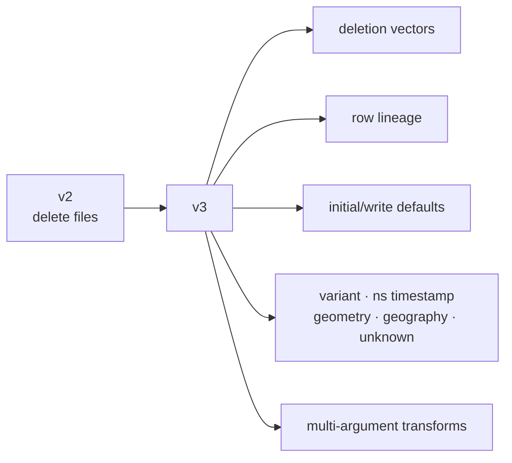
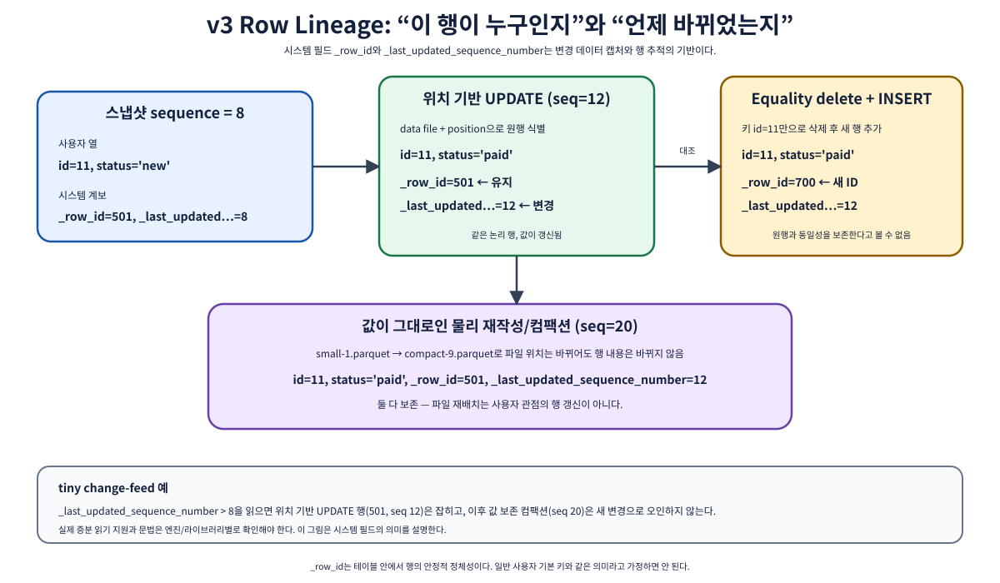
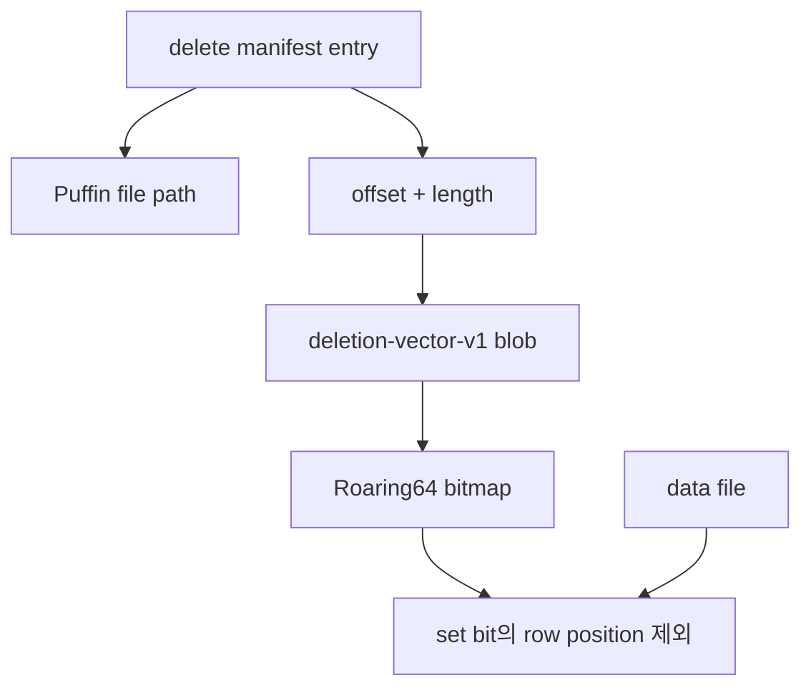
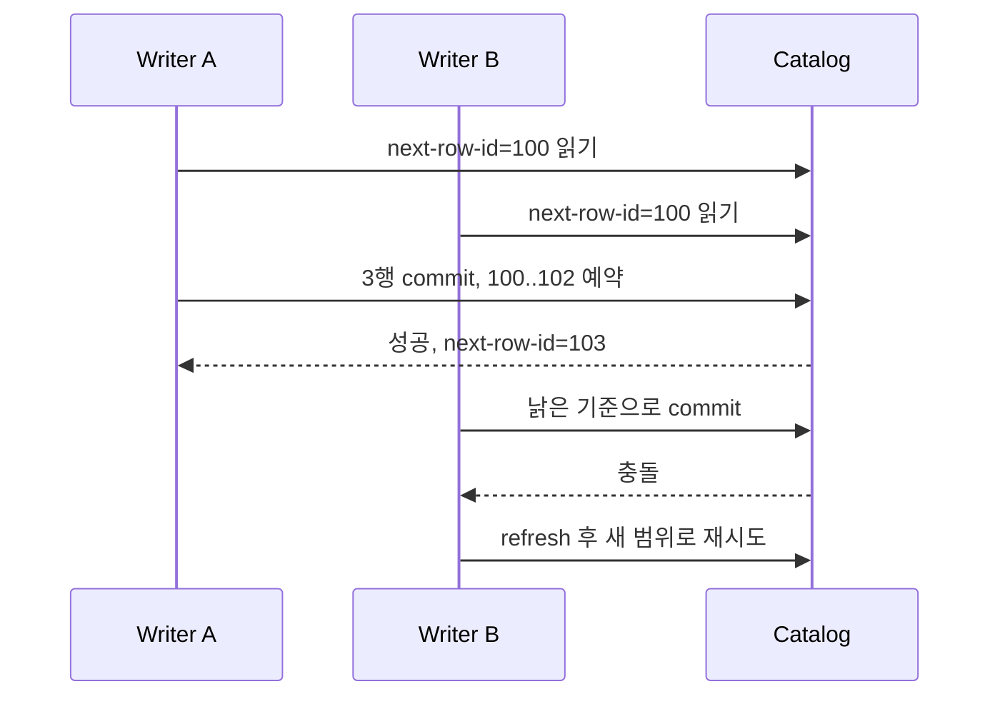
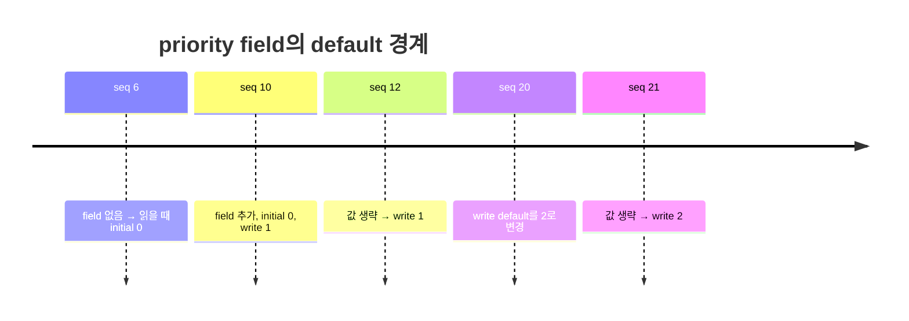
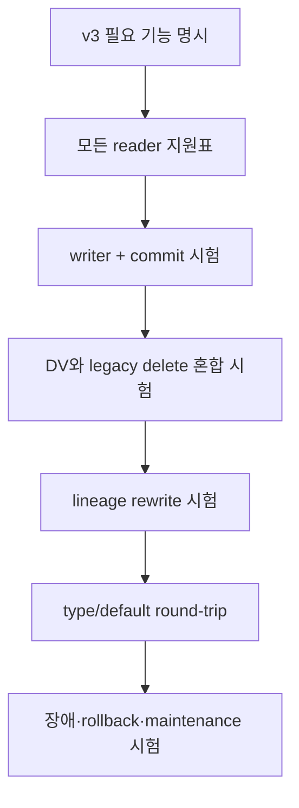

# 06. 포맷 v3: deletion vector, 행 계보, 기본값, 확장 타입

[← 이 책 목차](README.md)

작성·문헌 확인일: **2026-10-08**

포맷 v3는 v2의 행 단위 변경을 더 정교하게 만든다. 대표 변화는 deletion vector(DV), row lineage, column default, 나노초 timestamp와 semi-structured·geospatial type, multi-argument transform이다. v3 스펙이 완성되어 있다는 사실과 각 엔진이 이 기능을 모두 구현했다는 주장은 다르다. 실제 도입 전에는 reader, writer, catalog, maintenance 도구별 지원을 확인해야 한다.

공식 기준은 [Iceberg Table Spec](https://iceberg.apache.org/spec/), [v3 format changes](https://iceberg.apache.org/spec/#appendix-e-format-version-changes), [Puffin deletion-vector-v1](https://iceberg.apache.org/puffin-spec/#deletion-vector-v1-blob-type)이다.





*그림 06-1. 파일을 rewrite해도 같은 논리 행이면 row ID와 마지막 갱신 sequence를 상속한다. 새 논리 행은 새 row ID를 받는다.*

## 1. Deletion vector는 “삭제된 position의 압축 집합”이다

v2 position delete는 삭제할 data file 경로와 row position을 delete record로 나열할 수 있다. v3 deletion vector는 특정 data file에서 삭제된 position 집합을 bitmap으로 압축해 Puffin blob에 저장한다. bitmap에서 position `P`의 bit가 set이면 해당 행은 삭제된 것이다. [Puffin DV 규격](https://iceberg.apache.org/puffin-spec/#deletion-vector-v1-blob-type)은 `deletion-vector-v1` blob과 Roaring64 bitmap serialization을 정의한다.

```text
data-A.parquet의 row positions
position:  0 1 2 3 4 5 6 7 8 9
deleted?:  0 1 0 0 1 0 0 1 0 0

DV set = {1, 4, 7}
reader result = positions {0, 2, 3, 5, 6, 8, 9}
```

DV는 data file을 수정하지 않는다. manifest entry가 delete 파일을 가리키고, 그 파일이 Puffin blob의 offset과 length를 통해 bitmap을 찾는다. reader는 data file의 row position과 bitmap을 대조한다.



### 1.1 DV와 Puffin의 역할을 구분한다

| 항목 | 역할 |
| --- | --- |
| Puffin | Iceberg 관련 index·statistics blob을 담는 컨테이너 파일 형식 |
| `deletion-vector-v1` | Puffin 안에 담기는 DV blob type |
| Roaring64 | 삭제된 64-bit row position 집합의 bitmap serialization |
| delete manifest entry | 대상 data file, sequence, Puffin 위치 등 table-level 적용 정보 |

Puffin blob metadata의 `referenced-data-file`과 `cardinality`는 필수다. cardinality는 삭제 position 수다. `compression-codec` property는 DV에서 생략한다. Puffin blob 자체의 snapshot ID와 sequence number는 `-1`을 사용하며, 실제 table 적용 sequence는 manifest entry에 있다. 따라서 blob header 하나만 보고 어느 snapshot에 어떻게 적용할지 결정하면 안 된다.

### 1.2 한 data file에는 snapshot당 DV가 최대 하나다

v3 규칙에서 같은 snapshot 안의 한 data file에 적용되는 DV는 최대 하나다. 새 삭제를 추가할 때는 기존 DV, 새 삭제, v2에서 남아 있는 legacy position delete를 합쳐 단일 DV를 만든다.

```text
개념 병합 예

기존 DV                  = {1, 4}
legacy position deletes  = {7}
이번 commit의 새 삭제    = {4, 9}
새 snapshot의 단일 DV    = {1, 4, 7, 9}
cardinality              = 4
```

집합이므로 position 4가 두 번 입력되어도 하나다. 새 snapshot에서 DV 둘을 나란히 두는 방식이 아니다.

| 규칙 | v3에서의 의미 |
| --- | --- |
| 기존 v2 position delete | 여전히 읽어야 하는 legacy 입력일 수 있다 |
| 새 position delete file 작성 | 금지 |
| 새 position 기반 삭제 | DV로 작성한다 |
| 같은 data file의 기존/신규 삭제 | 새 단일 DV로 통합한다 |
| snapshot 내 data file당 DV | 최대 1개 |

“v3에서는 position delete가 없다”는 말은 부정확하다. **새 v2-style position delete file을 만들 수 없지만**, 업그레이드 전에 만들어진 legacy position delete는 유효하며 reader와 rewrite가 처리해야 한다.

### 1.3 DV도 sequence 적용 규칙을 따른다

DV는 position 기반 삭제이므로 대상 data file의 data sequence가 DV delete sequence보다 작거나 같아야 한다. 참조 data file도 일치해야 한다. [scan planning](https://iceberg.apache.org/spec/#scan-planning)의 position delete 조건을 따른다.

```text
대상 data file: data_seq=70
DV manifest entry: data_seq=70

70 <= 70 이므로 sequence 조건 만족
참조 data file 일치 여부도 확인
```

DV가 bitmap이라 빠를 가능성은 있지만, 항상 더 빠르다고 단정할 수 없다. cardinality, bitmap 크기, Puffin range read, cache, data file row count, 엔진 vectorization, compaction 주기가 결과를 바꾼다.

## 2. Row lineage는 논리 행의 정체성을 보존한다

v3 이상에서는 새로 생성한 행의 row lineage를 추적해야 한다. 새 writer가 임의로 생략할 수 있는 선택 기능으로 해석하지 않는다. 각 행에는 시스템이 관리하는 `_row_id`와 `_last_updated_sequence_number`가 있고, table metadata에는 다음에 할당할 범위를 관리하는 `next-row-id`가 있다. 업그레이드 이전의 과거 v1/v2 snapshot에도 완전한 행 계보가 소급해 생기는 것은 아니며, 그 snapshot에서 `_row_id`가 null일 수 있다. [row lineage spec](https://iceberg.apache.org/spec/#row-lineage)이 정확한 상속과 commit 규칙을 정의한다.

| 필드 | 뜻 |
| --- | --- |
| `_row_id` | 논리 행의 안정적인 고유 ID |
| `_last_updated_sequence_number` | 그 논리 행이 마지막으로 갱신된 sequence |
| `next-row-id` | 다음 commit이 새 행 ID 범위를 예약할 출발점 |
| `first-row-id` | data file 내 새 행에 ID를 상속 계산할 기준 |

### 2.1 commit 성공 전까지 ID는 확정되지 않는다

동시에 두 writer가 table metadata를 읽으면 둘 다 같은 `next-row-id`를 볼 수 있다. 그래서 writer가 파일을 만들 때 최종 row ID를 무조건 박아 넣는 방식은 충돌할 수 있다. v3는 manifest와 metadata inheritance를 통해 commit 시점에 ID 범위를 배정한다. 실패한 commit은 현재 table 상태를 다시 읽고 재시도해야 한다.



### 2.2 rewrite는 새 행 생성과 다르다

sequence 10에서 만들어진 행의 `_row_id=101`, `_last_updated_sequence_number=10`이라고 하자.

| 사건 | `_row_id` | `_last_updated_sequence_number` | 이유 |
| --- | ---: | ---: | --- |
| 원래 insert | 101 | 10 | 새 행 |
| sequence 20 compaction, 값 불변 | 101 | 10 | 같은 논리 행을 물리적으로 옮김 |
| sequence 25에서 값 update | 101 | 25 | 같은 논리 행의 새 상태 |
| delete 후 별도 새 insert | 새 ID | insert sequence | 새 논리 행 |

Compaction이 row ID를 새로 만들면 downstream 시스템은 같은 행을 새 사건으로 오해할 수 있다. 반대로 실제 새 행이 기존 ID를 재사용하면 고유성 계약을 깨뜨린다.

### 2.3 equality-delete 방식 update의 한계

equality delete는 `customer_id=7` 같은 equality 값은 알지만, 삭제된 원본 행의 `_row_id`를 반드시 알지는 못한다. 따라서 equality delete와 새 insert로 구현한 update는 원 row ID를 정확히 상속할 수 없다. spec은 이 경우 오래된 행을 제거하고 새 unique row ID를 가진 행을 추가하는 것으로 다룬다.

```text
의사 이벤트 — SQL 실행 예가 아님

old: customer_id=7, tier="silver", _row_id=101
equality delete: customer_id=7
new insert: customer_id=7, tier="gold", _row_id=205

결과: 값 관점에서는 update처럼 보여도 lineage 관점에서는
      row 101 삭제 + row 205 삽입이다.
```

원 ID를 보존해야 하는 CDC, 감사, 동기화 시스템이라면 엔진이 어떤 update 전략을 쓰는지 확인해야 한다.

## 3. Initial default와 write default는 시간 경계를 다룬다

v3는 field에 `initial-default`와 `write-default`를 정의한다. 둘은 같은 “빈칸 채우기”가 아니다. [default values spec](https://iceberg.apache.org/spec/#default-values)이 reader와 writer 동작을 구분한다.

| default | 적용 대상 | 변경 가능성 | 질문 |
| --- | --- | --- | --- |
| initial default | field가 추가되기 전에 쓰인 기존 record | field 추가 뒤 불변 | 과거 파일에 이 열이 없으면 무엇으로 읽는가? |
| write default | field 추가 뒤 writer가 값을 제공하지 않은 새 record | 진화 과정에서 변경 가능 | 지금 쓰는 행이 값을 빼면 무엇을 쓰는가? |

### 3.1 숫자로 보는 경계

sequence 10에 `priority` field를 추가하면서 `initial-default=0`, `write-default=1`을 지정했다고 하자.

| record 작성 시점 | 저장된 priority | 읽을 값 | 이유 |
| --- | --- | ---: | --- |
| sequence 6 | field 자체가 없음 | 0 | initial default |
| sequence 12 | writer가 생략 | 1 | write default |
| sequence 13 | writer가 5 기록 | 5 | 명시 값 |

sequence 20에서 write default를 2로 바꾸면 이후 생략된 값은 2가 될 수 있지만, 과거 파일을 읽는 initial default 0은 바뀌지 않는다. required field를 추가할 때는 initial default와 write default가 모두 null이 아니어야 한다.



## 4. v3의 확장 primitive type

[primitive types spec](https://iceberg.apache.org/spec/#primitive-types)은 v3에서 확장된 타입을 정의한다.

| 타입 | 용도 | 초보자가 확인할 점 |
| --- | --- | --- |
| `variant` | semi-structured value | 엔진의 projection, predicate, encoding 지원 |
| `unknown` | 아직 해석하지 못하는 type의 schema 자리 보존 | 값 처리용 만능 타입으로 사용하지 않는다 |
| `timestamp_ns` | timezone 없는 나노초 timestamp | source precision과 반올림 여부 |
| `timestamptz_ns` | UTC instant를 나타내는 나노초 timestamp | 표시 timezone과 저장 의미 구분 |
| `geometry` | 평면 좌표계의 기하 객체 | CRS/SRID와 predicate 지원 |
| `geography` | 지구 표면 좌표의 지리 객체 | 거리·면적 계산 의미와 엔진 지원 |

### 4.1 나노초 timestamp는 정확도가 저절로 생기는 기능이 아니다

원본 장비가 마이크로초까지만 측정했다면 `timestamp_ns`에 저장해도 잃어버린 세 자릿수가 복원되지 않는다. 반대로 나노초 값을 마이크로초만 지원하는 엔진으로 읽으면 truncate 또는 round가 발생할 수 있다. writer→file format→Iceberg reader→query engine 전 경로를 검증한다.

```text
원본: 2026-10-08T12:34:56.123456789
마이크로초 reader가 보일 수 있는 값: 2026-10-08T12:34:56.123456

위 결과는 개념 예시다. 실제 반올림/거부 동작은 엔진 문서를 확인한다.
```

### 4.2 geometry와 geography는 이름만 다른 binary가 아니다

geometry는 보통 평면 좌표 공간의 객체를, geography는 지구 표면을 고려하는 객체를 표현한다. v3 metadata JSON과 default 표현에는 WKT가 사용될 수 있고, 실제 Parquet/Avro 값 표현은 WKB를 사용한다. 엔진이 type을 읽는 것과 `ST_Distance`, 공간 pruning, spatial index까지 구현하는 것은 별도다.

```text
설명용 WKT
POINT (127.0276 37.4979)

주의: 경도/위도 순서, CRS, 단위, antimeridian 처리는
엔진과 함수 계약을 함께 확인한다.
```

### 4.3 unknown은 호환성 자리표시자다

`unknown`은 reader가 모르는 값을 임의 JSON처럼 보관하는 타입이 아니다. 아직 구체적 타입이 결정되지 않은 자리를 표현하며 optional이어야 하고 default는 null이어야 한다. 데이터 파일에는 unknown 타입 값을 저장하지 않는다. 업무 값을 담는 만능 JSON 타입으로 선택하면 안 된다.

v3 type을 v1/v2 table schema에 억지로 사용하면 이전 reader의 forward compatibility를 깰 수 있다. table format version과 모든 reader의 type 지원을 함께 올린다.

## 5. Multi-argument transform은 표현력과 지원 부담을 함께 늘린다

Iceberg transform은 source field를 partition value나 sort term으로 바꾸는 함수적 표현이다. 기존의 `year(ts)`, `bucket(16, id)`, `truncate(8, name)`도 parameter와 source를 가진다. v3는 transform term이 여러 argument를 다룰 수 있는 모델을 명시해 여러 source term을 함께 쓰는 확장 가능성을 연다.

```text
스펙 개념 문법 — 특정 엔진에서 실행 가능한 SQL이 아님

transform_name(argument_1, argument_2, ..., argument_n)
```

여기서 임의의 `zorder(a,b)`나 공간 transform을 표준 기능이라고 가정하면 안 된다. transform 이름, argument type, null 처리, result type은 스펙과 엔진이 각각 지원해야 한다.

| 검증 질문 | 이유 |
| --- | --- |
| 이 transform이 Iceberg spec에 정의되어 있는가? | 이름만 비슷한 엔진 함수와 구분 |
| reader와 writer가 같은 argument 의미를 쓰는가? | partition pruning 오류 방지 |
| catalog가 term을 보존하는가? | metadata round-trip 확인 |
| maintenance job이 새 spec을 이해하는가? | rewrite 후 partition 의미 보존 |

## 6. 암호화 키 메타데이터: 저장 규칙과 키 관리의 연결

v3는 table metadata에 `encryption-keys`를 표현하는 구조도 추가한다. **Encryption key, 암호화 키**는 데이터를 암호화·복호화할 때 사용하는 비밀 값이다. 키를 안전하게 보관하고 사용 권한을 관리하는 서비스가 **KMS(Key Management Service)**다.

파일을 암호화하는 것, 네트워크를 TLS로 보호하는 것, 사용자에게 테이블 접근을 허용하는 것은 서로 다른 작업이다. v3 테이블이라는 이유만으로 모든 파일이 자동 암호화되지는 않는다. 사용하는 encryption scheme·라이브러리·카탈로그·KMS·엔진이 함께 지원해야 한다.

| Key object 필드 | 필수 여부 | 뜻 |
| --- | --- | --- |
| `key-id` | 필수 | 테이블에서 암호화 키를 구별하는 이름 |
| `encrypted-key-metadata` | 필수 | scheme가 정의한 암호화된 키 메타데이터의 base64 표현 |
| `encrypted-by-id` | 선택 | 해당 키 메타데이터를 보호한 상위 키의 ID |
| `properties` | 선택 | encryption scheme의 추가 속성 |

**Base64**는 바이너리를 문자열로 표현하는 인코딩이며 암호화 자체가 아니다. `encrypted-key-metadata`라는 이름은 보호된 키 메타데이터를 저장한다는 뜻이지, 평문 비밀 키를 그냥 base64로 바꾸어 넣으라는 지시가 아니다.

Snapshot의 선택적 `key-id`와 manifest list의 `key_metadata`도 암호화 경로에 사용된다. 상세 바이너리 구조와 키를 감싸는 **wrapping** 방식은 선택한 encryption scheme가 정의한다. 개발자가 임의로 JSON을 만들어 표준 지원 암호화를 구현했다고 간주하지 않는다.

### 6.1 키 교체와 파일 재작성을 구별한다

**Key rotation, 키 교체**는 새로운 키를 사용하도록 관리하는 절차다. 새 키를 설정한 것만으로 모든 과거 파일과 snapshot이 새 키로 재작성되는 것은 아니다. 오래된 파일을 계속 읽기 위해 필요한 키의 수명, 과거 snapshot 보존, KMS 접근 권한을 함께 관리한다.

1.11.0은 Hive 연동 활성화, manifest-list 암호화, 키 교체와 AWS·Azure·GCP KMS 지원 등 실제 구현 변화를 발표했다. 이 내용은 특정 integration의 구현 상태이며 모든 카탈로그의 자동 지원 선언이 아니다.

공식 문서는 카탈로그가 테이블 수명 동안 `encryption.key-id`를 임의 변경·제거하지 않아야 하며, 변조 가능한 저장소의 metadata JSON을 그대로 신뢰하지 않도록 요구한다. 사용자에게 “파일 경로를 읽을 수 있다”는 권한을 부여하는 일과 신뢰할 수 있는 암호화 메타데이터를 제공하는 일을 구별한다.

근거: [Encryption keys 명세](https://iceberg.apache.org/spec/#encryption-keys), [Encryption 문서](https://iceberg.apache.org/docs/latest/encryption/), [1.11.0 발표](https://iceberg.apache.org/blog/apache-iceberg-1.11.0-release/).

## 7. v3 도입 체크리스트



- DV를 읽고 쓰며 legacy position delete와 통합하는가?
- rewrite가 `_row_id`와 `_last_updated_sequence_number`를 정확히 상속하는가?
- equality-delete update의 lineage 한계를 downstream이 허용하는가?
- initial/write default를 오래된 파일과 새 파일에서 각각 검증했는가?
- ns timestamp, variant, geometry/geography를 모든 경로가 보존하는가?
- v3 table을 모르는 reader가 production에 남아 있지 않은가?

## 8. 확인 문제

### 문제 1

한 snapshot에서 data-A에 기존 DV `{2, 5}`와 새 삭제 `{8}`을 별도 DV 둘로 둘 수 있는가?

<details>
<summary>해설</summary>

아니다. data file 하나에는 snapshot당 DV가 최대 하나다. 기존 삭제와 새 삭제, legacy position delete를 합쳐 `{2, 5, 8}`인 새 단일 DV를 만든다.

</details>

### 문제 2

compaction으로 행의 물리 파일만 바뀌면 `_row_id`를 새로 발급해야 하는가?

<details>
<summary>해설</summary>

아니다. 같은 논리 행이면 row ID와 last-updated sequence를 상속한다. 새 ID는 새 논리 행에 발급한다.

</details>

### 문제 3

field 추가 전 record와 추가 후 값이 생략된 record는 같은 default를 사용하는가?

<details>
<summary>해설</summary>

반드시 같지 않다. 전자는 immutable한 initial default, 후자는 현재 write default를 사용한다.

</details>

### 문제 4

테이블이 v3이면 모든 엔진에서 geometry 공간 함수와 DV 최적화가 즉시 동작하는가?

<details>
<summary>해설</summary>

아니다. v3는 저장·metadata 계약이다. 각 엔진의 read/write, SQL, predicate, maintenance 구현은 별도로 확인한다.

</details>

## 9. 이 장의 공식 근거

- [Iceberg Table Spec: v3 format changes](https://iceberg.apache.org/spec/#appendix-e-format-version-changes)
- [Iceberg Table Spec: delete formats](https://iceberg.apache.org/spec/#delete-formats)
- [Puffin Spec: deletion-vector-v1](https://iceberg.apache.org/puffin-spec/#deletion-vector-v1-blob-type)
- [Iceberg Table Spec: row lineage](https://iceberg.apache.org/spec/#row-lineage)
- [Iceberg Table Spec: default values](https://iceberg.apache.org/spec/#default-values)
- [Iceberg Table Spec: primitive types](https://iceberg.apache.org/spec/#primitive-types)

[← 이전: 포맷 v1과 v2](05-format-v1-v2.md) · [다음: 최신 버전과 호환성 →](07-latest-and-compatibility.md)
